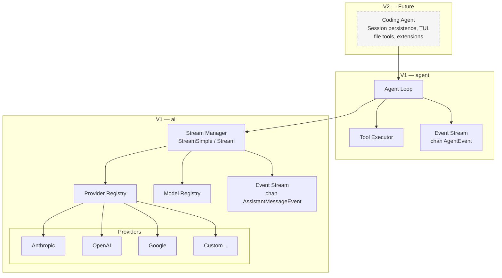
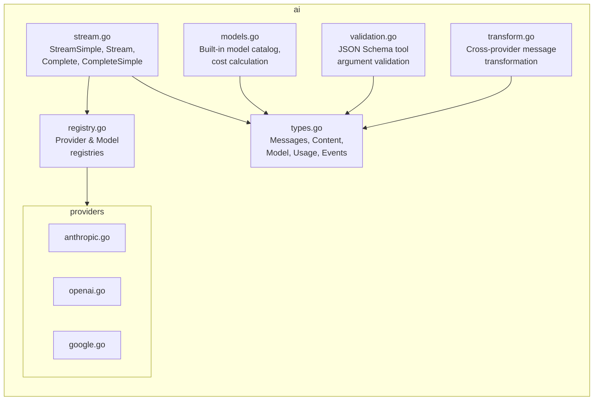

# Architecture

## Overview

This project is a Go implementation of multi-provider LLM abstraction and agentic framework, inspired by the core layers of [pi-mono](https://github.com/badlogic/pi-mono). The goal is to bring the same clean, layered architecture to Go — preserving the elegant separation of concerns while embracing Go idioms.

**V1 scope:** Two packages:

1. **`ai`** — Vendor-agnostic LLM streaming abstraction (inspired by `@mariozechner/pi-ai`)
2. **`agent`** — Stateful agent loop with tool execution (inspired by `@mariozechner/pi-agent-core`)

**V2 (future, out of scope but informs design):** Coding agent with file tools, TUI, session persistence, extensions.

### Design Principles

- **Clean layering**: `ai` knows nothing about agents. `agent` knows nothing about filesystems or persistence. Higher layers (V2) add those concerns.
- **Go idioms**: Interfaces for extensibility, channels for streaming, `context.Context` for cancellation, explicit error handling.
- **Provider-pluggable**: New LLM providers are added by implementing an interface, not modifying core code.
- **Tool-agnostic**: The agent loop executes tools via an interface — it doesn't know or care what they do.
- **Streaming-first**: All LLM interactions stream events through Go channels. Blocking `Complete()` is a convenience wrapper.

## System Overview



## Component Architecture

### Package: `ai`

The LLM abstraction layer. Zero knowledge of agents, tools execution, or persistence.



#### Core Types

These mirror the TypeScript types closely, adapted for Go:

```go
// Message types
type UserMessage struct {
    Content   []ContentBlock  // TextContent | ImageContent
    Timestamp int64           // Unix ms
}

type AssistantMessage struct {
    Content      []ContentBlock  // TextContent | ThinkingContent | ToolCall
    API          string
    Provider     string
    Model        string
    Usage        Usage
    StopReason   StopReason
    ErrorMessage string
    Timestamp    int64
}

type ToolResultMessage struct {
    ToolCallID string
    ToolName   string
    Content    []ContentBlock  // TextContent | ImageContent
    IsError    bool
    Timestamp  int64
}

// Message is the union — a sum type via interface
type Message interface {
    messageRole() string
}

// Content blocks — also a sum type via interface
type ContentBlock interface {
    contentType() string
}

type TextContent struct {
    Text          string
    TextSignature string  // optional, provider-specific
}

type ThinkingContent struct {
    Thinking          string
    ThinkingSignature string
    Redacted          bool
}

type ImageContent struct {
    Data     string  // base64
    MimeType string
}

type ToolCall struct {
    ID               string
    Name             string
    Arguments        map[string]any
    ThoughtSignature string  // optional, Google-specific
}
```

#### Streaming Architecture

The TypeScript reference uses an `EventStream<T>` class that implements `AsyncIterable`. In Go, we use channels:

```go
// AssistantMessageEvent — tagged union of streaming events
type AssistantMessageEvent struct {
    Type         EventType
    ContentIndex int              // for delta events
    Delta        string           // for delta events
    Content      string           // for end events
    ToolCall     *ToolCall        // for toolcall_end
    Partial      *AssistantMessage // progressive snapshot
    Message      *AssistantMessage // for done event
    Error        *AssistantMessage // for error event
    Reason       StopReason       // for done/error
}

// EventStream wraps a channel with result extraction
type EventStream struct {
    C      <-chan AssistantMessageEvent  // consume events
    ch     chan AssistantMessageEvent     // internal send side
    result chan AssistantMessage          // final result
    done   chan struct{}                  // close signal
}

// Result blocks until stream completes and returns the final AssistantMessage
func (s *EventStream) Result() (AssistantMessage, error)

// Close signals the stream is done (called by provider)
func (s *EventStream) Close()
```

**Why channels over callbacks:**
- Natural Go concurrency primitive
- Works with `select` for cancellation via `context.Context`
- No callback hell, no goroutine leaks with proper `defer close(ch)`
- Consumers can range over the channel or call `Result()` for blocking

**Provider streaming pattern:**

```go
func (p *AnthropicProvider) Stream(ctx context.Context, model Model, llmCtx Context, opts StreamOptions) *EventStream {
    es := NewEventStream()

    go func() {
        defer es.Close()
        // 1. Create API client
        // 2. Build request params
        // 3. Start SSE stream
        // 4. For each SSE event:
        //    - Parse provider-specific format
        //    - Update partial AssistantMessage
        //    - Send typed event to es.ch
        // 5. Send done/error event
    }()

    return es
}
```

#### Provider Interface

```go
// Provider is the interface each LLM backend implements
type Provider interface {
    // API returns the API identifier (e.g., "anthropic-messages", "openai-completions")
    API() string

    // Stream starts a streaming LLM call, returning events on a channel
    Stream(ctx context.Context, model Model, llmCtx Context, opts StreamOptions) *EventStream

    // StreamSimple is the high-level API that maps ThinkingLevel to provider-specific params
    StreamSimple(ctx context.Context, model Model, llmCtx Context, opts SimpleStreamOptions) *EventStream
}
```

**Provider registration** uses a global registry (like the TS version), with `init()` for built-in providers. The registry is guarded by `sync.RWMutex` to support concurrent reads and safe runtime registration:

```go
var (
    providerMu       sync.RWMutex
    providerRegistry = map[string]Provider{}
)

func RegisterProvider(p Provider)           // write-locks
func GetProvider(api string) (Provider, error)  // read-locks
func UnregisterProviders(sourceID string)   // write-locks
```

**Concurrency contract:** Registration is safe at any time (not just during `init()`). `GetProvider` is safe to call concurrently from multiple goroutines. All registry functions must pass `-race` detection under concurrent access. The model registry follows the same `sync.RWMutex` pattern.

#### Model Registry

```go
type Model struct {
    ID            string
    Name          string
    API           string
    Provider      string
    BaseURL       string
    Reasoning     bool
    Input         []string       // "text", "image"
    Cost          ModelCost      // $/million tokens for input, output, cache
    ContextWindow int
    MaxTokens     int
    Headers       map[string]string
}

func GetModel(provider, modelID string) (Model, error)
func GetModels(provider string) []Model
func GetProviders() []string
func CalculateCost(model Model, usage *Usage)
```

Models are registered at init time from a generated catalog (or a static Go map/embed). The `CalculateCost` function mutates the `Usage.Cost` fields in-place, matching the TS behavior.

#### Tool Schema

The TypeScript version uses TypeBox for JSON Schema. In Go, we represent tool parameter schemas as raw JSON Schema:

```go
type Tool struct {
    Name        string
    Description string
    Parameters  json.RawMessage  // JSON Schema object
}
```

This keeps the `ai` package simple — it doesn't need to understand schemas, just pass them to providers. Validation against schemas happens via a `ValidateToolArguments(tool Tool, args map[string]any) error` function using a JSON Schema validation library (e.g., `github.com/santhosh-tekuri/jsonschema`).

#### Context & Conversation

```go
// Context represents the full conversation state sent to the LLM
type Context struct {
    SystemPrompt string
    Messages     []Message
    Tools        []Tool
}
```

#### Cross-Provider Message Transformation

The `transform.go` module handles:
- Stripping thinking signatures when switching models
- Converting thinking blocks to text for non-same-model replay
- Normalizing tool call IDs (different providers have different format requirements)
- Inserting synthetic empty tool results for orphaned tool calls
- Skipping errored/aborted assistant messages

This is a critical piece for multi-model conversations and must be ported faithfully.

#### Stream Options

```go
type StreamOptions struct {
    Temperature    *float64
    MaxTokens      *int
    APIKey         string
    SessionID      string
    CacheRetention string   // "none", "short", "long"
    Headers        map[string]string
    MaxRetryDelayMs int
    Metadata       map[string]any
    OnPayload      func(payload any)  // debug hook
}

type SimpleStreamOptions struct {
    StreamOptions
    Reasoning       ThinkingLevel  // "off", "minimal", "low", "medium", "high", "xhigh"
    ThinkingBudgets *ThinkingBudgets
}
```

Note: Cancellation is handled via `context.Context` (passed to `Stream`/`StreamSimple`), not via a signal field in options. This is the Go-idiomatic approach.

### Package: `agent`

The agentic framework. Knows about tools and the agent loop. Zero knowledge of filesystems, persistence, or UI.

```mermaid
graph TB
    subgraph agent
        direction TB
        agent[agent.go<br/>Agent struct, state,<br/>prompt, subscribe]
        loop[loop.go<br/>agentLoop,<br/>agentLoopContinue,<br/>tool execution]
        types[types.go<br/>AgentMessage, AgentTool,<br/>AgentEvent, AgentState]
    end

    agent --> loop
    agent --> types
    loop --> types
    loop -->|"calls StreamSimple"| aiPkg[ai package]
```

#### Core Types

```go
// AgentMessage extends ai.Message with custom message support.
// In Go, we use an interface rather than TS declaration merging.
type AgentMessage interface {
    agentMessageRole() string
}

// Built-in AgentMessage variants — these are the canonical types:
//
//   ai.UserMessage        → implements AgentMessage (role: "user")
//   ai.AssistantMessage   → implements AgentMessage (role: "assistant")
//   ai.ToolResultMessage  → implements AgentMessage (role: "toolResult")
//
// All three ai.Message concrete types have an agentMessageRole() method,
// making them directly usable as AgentMessage without wrappers.
//
// Custom message types: Applications can define additional types that
// implement AgentMessage (e.g., NotificationMessage, ArtifactMessage).
// These are UI-only messages that the LLM never sees.

// ConvertToLLM contract:
//
// The ConvertToLLM function provided in AgentOptions MUST:
// 1. Map each ai.UserMessage → ai.UserMessage (passthrough)
// 2. Map each ai.AssistantMessage → ai.AssistantMessage (passthrough)
// 3. Map each ai.ToolResultMessage → ai.ToolResultMessage (passthrough)
// 4. Map custom AgentMessage types → zero or more ai.Messages
//    (e.g., filter out UI-only messages, convert custom types to user messages)
// 5. Return an error for any unrecognized AgentMessage type
//    (MUST NOT silently drop unknown types)
//
// Round-trip invariant: for any ai.Message m passed through ConvertToLLM,
// the output must be semantically equivalent to m (no data loss).
// Golden tests verify conversion fidelity across tool-call turns and
// provider switches.

// AgentTool extends ai.Tool with an Execute function
type AgentTool struct {
    ai.Tool
    Label   string
    Execute func(ctx context.Context, toolCallID string, params map[string]any, onUpdate func(AgentToolResult)) (AgentToolResult, error)
}

type AgentToolResult struct {
    Content []ai.ContentBlock
    Details any
}
```

#### Agent State

```go
type AgentState struct {
    SystemPrompt    string
    Model           ai.Model
    ThinkingLevel   ThinkingLevel
    Tools           []AgentTool
    Messages        []AgentMessage
    IsStreaming      bool
    StreamMessage    AgentMessage    // partial during streaming
    PendingToolCalls map[string]bool // set of in-flight tool call IDs
    Error            string
}
```

#### Agent Events

```go
type AgentEventType string

const (
    EventAgentStart         AgentEventType = "agent_start"
    EventAgentEnd           AgentEventType = "agent_end"
    EventTurnStart          AgentEventType = "turn_start"
    EventTurnEnd            AgentEventType = "turn_end"
    EventMessageStart       AgentEventType = "message_start"
    EventMessageUpdate      AgentEventType = "message_update"
    EventMessageEnd         AgentEventType = "message_end"
    EventToolExecutionStart AgentEventType = "tool_execution_start"
    EventToolExecutionUpdate AgentEventType = "tool_execution_update"
    EventToolExecutionEnd   AgentEventType = "tool_execution_end"
)

type AgentEvent struct {
    Type    AgentEventType
    // Fields populated depending on Type:
    Message      AgentMessage
    Messages     []AgentMessage          // for agent_end
    ToolCallID   string                  // for tool events
    ToolName     string                  // for tool events
    Args         map[string]any          // for tool events
    Result       *AgentToolResult        // for tool_execution_end
    IsError      bool                    // for tool_execution_end
    ToolResults  []ai.ToolResultMessage // for turn_end
    AssistantEvent *ai.AssistantMessageEvent // for message_update
}
```

#### Agent Loop

The agent loop is the heart of the system. It translates directly from the TypeScript:

```mermaid
sequenceDiagram
    participant Consumer
    participant Agent
    participant Loop
    participant LLM as ai.StreamSimple
    participant Tool as AgentTool.Execute

    Consumer->>Agent: Prompt("do something")
    Agent->>Loop: agentLoop(messages, context, config)

    loop Until no more tool calls or follow-ups
        Loop->>Loop: Check pending messages (steering)
        Loop->>Loop: transformContext (if configured)
        Loop->>Loop: convertToLLM (AgentMessage → ai.Message)
        Loop->>LLM: StreamSimple(model, context, opts)

        loop Stream events
            LLM-->>Loop: AssistantMessageEvent
            Loop-->>Agent: AgentEvent{message_update}
            Agent-->>Consumer: event via subscription channel
        end

        alt Has tool calls
            loop For each tool call
                Loop->>Tool: Execute(ctx, id, params)
                Tool-->>Loop: AgentToolResult
                Loop-->>Agent: AgentEvent{tool_execution_end}

                Loop->>Loop: Check getSteeringMessages()
                alt Steering message received
                    Loop->>Loop: Skip remaining tools
                    Loop->>Loop: Inject steering message
                end
            end
        end

        Loop->>Loop: Check getFollowUpMessages()
        alt Has follow-up
            Loop->>Loop: Continue with follow-up
        else No follow-up
            Loop->>Loop: Exit loop
        end
    end

    Loop-->>Agent: AgentEvent{agent_end}
    Agent-->>Consumer: event via subscription channel
```

#### Agent Public API

```go
type Agent struct {
    // unexported fields: state, subscribers, queues, etc.
}

type AgentOptions struct {
    InitialState     *AgentState
    ConvertToLLM     func([]AgentMessage) ([]ai.Message, error)
    TransformContext func(ctx context.Context, messages []AgentMessage) ([]AgentMessage, error)
    SteeringMode     string  // "all" | "one-at-a-time"
    FollowUpMode     string  // "all" | "one-at-a-time"
    StreamFn         StreamFn
    GetAPIKey        func(provider string) (string, error)
    ThinkingBudgets  *ai.ThinkingBudgets
    MaxRetryDelayMs  int
}

func NewAgent(opts AgentOptions) *Agent

// Core operations
func (a *Agent) Prompt(ctx context.Context, text string, images ...ai.ImageContent) error
func (a *Agent) PromptMessages(ctx context.Context, msgs ...AgentMessage) error
func (a *Agent) Continue(ctx context.Context) error
func (a *Agent) Abort()
func (a *Agent) WaitForIdle() <-chan struct{}

// State access
func (a *Agent) State() AgentState  // returns copy

// Steering & follow-up
func (a *Agent) Steer(msg AgentMessage)
func (a *Agent) FollowUp(msg AgentMessage)
func (a *Agent) ClearQueues()

// Subscription — returns unsubscribe function
func (a *Agent) Subscribe(fn func(AgentEvent)) func()

// State mutators
func (a *Agent) SetSystemPrompt(s string)
func (a *Agent) SetModel(m ai.Model)
func (a *Agent) SetThinkingLevel(l ThinkingLevel)
func (a *Agent) SetTools(tools []AgentTool)
func (a *Agent) ReplaceMessages(msgs []AgentMessage)
```

**Subscription model:** The TypeScript version uses synchronous callback listeners. In Go, we keep the same pattern (synchronous callbacks) rather than per-subscriber channels — this avoids the complexity of managing N goroutines and slow consumers. The `Subscribe` method returns an unsubscribe function (closure over the listener set).

#### Concurrency Model

The `Agent` struct uses a `sync.Mutex` to protect internal state. The concurrency contract:

**Thread-safe methods (callable from any goroutine at any time):**
- `State()` — returns a snapshot (deep copy) of current state
- `Steer(msg)`, `FollowUp(msg)`, `ClearQueues()` — queue operations protected by mutex
- `SetSystemPrompt()`, `SetModel()`, `SetThinkingLevel()`, `SetTools()`, `ReplaceMessages()` — state mutators protected by mutex
- `Subscribe(fn)` / unsubscribe — listener set protected by mutex
- `Abort()` — cancels the context, safe to call anytime
- `WaitForIdle()` — returns a channel, no lock needed

**Serialized methods (must not be called concurrently with each other):**
- `Prompt()`, `PromptMessages()`, `Continue()` — these run the agent loop. Calling while already streaming returns an error (checked under lock).

**Lock boundary rule:** The mutex is **never held** while invoking:
- Subscriber callbacks (`fn(AgentEvent)`)
- Tool `Execute()` functions
- Provider `StreamSimple()` / `Stream()` calls
- `ConvertToLLM()` or `TransformContext()` hooks

This prevents deadlocks when subscribers or tools call back into the Agent (e.g., `agent.Steer()` from within a subscriber callback). The pattern is: acquire lock → copy/update state → release lock → invoke external code → acquire lock → update state from result.

**Lock ordering:** Only one lock exists (`Agent.mu`). The `ai` package registries have their own independent `sync.RWMutex` — no ordering constraint since they are never held simultaneously.

**Testing requirement:** All concurrent API combinations (`Prompt` + `Steer` + `Abort` + `SetModel` + `State`) must pass under `-race` with stress testing.

#### Agent Loop Config

```go
type AgentLoopConfig struct {
    Model            ai.Model
    ConvertToLLM     func([]AgentMessage) ([]ai.Message, error)
    TransformContext func(ctx context.Context, messages []AgentMessage) ([]AgentMessage, error)
    GetSteeringMsgs  func() []AgentMessage
    GetFollowUpMsgs  func() []AgentMessage
    GetAPIKey        func(provider string) (string, error)
    // Plus all SimpleStreamOptions fields
    Reasoning        ThinkingLevel
    ThinkingBudgets  *ai.ThinkingBudgets
    MaxRetryDelayMs  int
    SessionID        string
}
```

## Data Flow: Complete Request Lifecycle

```mermaid
sequenceDiagram
    participant App as Application (V2)
    participant Agent as agent.Agent
    participant Loop as agent.agentLoop
    participant AI as ai.StreamSimple
    participant Prov as ai.Provider (Anthropic)
    participant API as Anthropic API

    App->>Agent: Prompt(ctx, "read config.json")
    Agent->>Agent: Validate not already streaming
    Agent->>Agent: Build AgentLoopConfig
    Agent->>Loop: agentLoop(messages, context, config)

    Note over Loop: Turn 1 — LLM decides to use tool
    Loop->>Loop: transformContext(messages)
    Loop->>Loop: convertToLLM(agentMessages) → aiMessages
    Loop->>AI: StreamSimple(model, aiContext, opts)
    AI->>AI: Lookup provider from model.API
    AI->>Prov: Stream(ctx, model, context, opts)
    Prov->>API: POST /v1/messages (SSE)

    loop SSE chunks
        API-->>Prov: content_block_start (tool_use)
        Prov-->>AI: toolcall_start event
        AI-->>Loop: event on channel
        Loop-->>Agent: AgentEvent{message_update}
        Agent-->>App: subscriber callback
    end

    API-->>Prov: message_delta (stop: tool_use)
    Prov-->>AI: done event
    AI-->>Loop: done event on channel

    Note over Loop: Execute tool call
    Loop->>Loop: Find tool by name
    Loop->>Loop: Validate args against JSON Schema
    Loop-->>Agent: AgentEvent{tool_execution_start}
    Loop->>App: tool.Execute(ctx, id, args)
    App-->>Loop: AgentToolResult{content: file contents}
    Loop-->>Agent: AgentEvent{tool_execution_end}
    Loop->>Loop: Check steering messages → none

    Note over Loop: Turn 2 — LLM responds with text
    Loop->>AI: StreamSimple (with tool result in context)
    AI->>Prov: Stream
    Prov->>API: POST /v1/messages

    loop SSE chunks
        API-->>Prov: text deltas
        Prov-->>Loop: text_delta events
        Loop-->>Agent: AgentEvent{message_update}
    end

    API-->>Prov: end_turn
    Prov-->>Loop: done event

    Loop->>Loop: Check follow-up messages → none
    Loop-->>Agent: AgentEvent{agent_end}
    Agent-->>App: subscriber callback
    Agent->>Agent: Set isStreaming = false
```

## Key Architectural Decisions

### 1. Sum Types via Interfaces

Go doesn't have algebraic data types. We use sealed interfaces with unexported marker methods:

```go
type Message interface{ messageRole() string }
type ContentBlock interface{ contentType() string }
```

Concrete types implement these. Switch statements on the marker method (or type switches) handle dispatch. This is idiomatic Go and matches how `encoding/json`, `database/sql`, etc. handle polymorphism.

### 2. Channels for Event Streaming

The TS version uses `AsyncIterable<T>` (EventStream class with queue + waiting consumers). The Go equivalent is a buffered channel. The `EventStream` struct wraps the channel with a `Result()` method that blocks until the final event.

Channel buffer size: **32 events** (enough to absorb bursts from fast SSE streams without blocking the provider goroutine, small enough to detect backpressure).

### 3. context.Context for Cancellation

Rather than `AbortSignal` in options, all cancellable operations take `context.Context` as the first parameter. This integrates with Go's standard cancellation, timeouts, and deadline propagation. Providers pass the context to HTTP clients for SSE cancellation.

### 4. JSON Schema for Tool Parameters

Rather than bringing in a schema DSL (like TypeBox), tool parameters are plain `json.RawMessage` containing JSON Schema. This:
- Avoids a build-time code generation step
- Matches what providers actually consume (they all want JSON Schema)
- Validation uses a JSON Schema library at runtime
- Builders/helpers can be provided as utilities, not required

### 5. No Global Mutable State in agent

The `ai` package has global registries (providers, models) — this matches the TS version and is acceptable because providers are effectively singletons. The `agent` package has no global state — all state lives in the `Agent` struct.

### 6. Synchronous Event Subscribers

Agent events are delivered synchronously to subscribers (like the TS version). This means:
- Subscribers must not block
- Event ordering is guaranteed
- No goroutine-per-subscriber overhead
- Higher layers (V2) can buffer into channels if they need async processing

### 7. Minimal Dependencies

V1 providers will use:
- Anthropic: Direct HTTP/SSE (no SDK — Go SDKs for LLM providers are often immature or have unwanted deps)
- OpenAI: Direct HTTP/SSE
- Google: Direct HTTP/SSE

Shared dependencies:
- `github.com/santhosh-tekuri/jsonschema` for tool argument validation
- Standard library `net/http`, `encoding/json`, `bufio` for SSE parsing

### 8. Provider-Specific Options via Functional Options

The TS version has `AnthropicOptions extends StreamOptions`. In Go, provider-specific options use the functional options pattern:

```go
// Provider-specific options
type AnthropicOption func(*anthropicConfig)

func WithThinkingEnabled(enabled bool) AnthropicOption { ... }
func WithEffort(effort string) AnthropicOption { ... }

// StreamSimple handles the mapping from ThinkingLevel → provider options
// so consumers rarely need provider-specific options
```

## Module Structure

Following Go conventions, most logic lives in `internal/` with thin public packages that re-export the necessary API surface. This keeps the internal implementation flexible while providing a stable public contract. Each `internal/` package contains cohesive application logic with lightweight unit tests; heavier cross-cutting tests (integration, e2e, benchmarks) go in separate top-level test directories.

```
pi-agent-go/
├── go.mod
├── go.sum
├── internal/
│   ├── ai/                        # LLM abstraction package
│   │   ├── types.go               # Core types: Message, Content, Model, Events
│   │   ├── stream.go              # StreamSimple, Stream, Complete, CompleteSimple
│   │   ├── event_stream.go        # EventStream channel wrapper
│   │   ├── registry.go            # Provider & model registries
│   │   ├── models.go              # Built-in model catalog, cost calculation
│   │   ├── validation.go          # JSON Schema tool argument validation
│   │   ├── transform.go           # Cross-provider message transformation
│   │   └── provider/              # Provider implementations
│   │       ├── anthropic/
│   │       │   ├── anthropic.go   # Anthropic Messages API provider
│   │       │   ├── messages.go    # Message conversion
│   │       │   └── sse.go         # SSE stream parsing
│   │       ├── openai/
│   │       │   ├── openai.go      # OpenAI Completions API provider
│   │       │   ├── messages.go
│   │       │   └── sse.go
│   │       ├── google/
│   │       │   ├── google.go      # Google Generative AI provider
│   │       │   └── messages.go
│   │       └── sse/
│   │           └── sse.go         # Shared SSE parsing utilities
│   │
│   └── agent/                     # Agent framework package
│       ├── types.go               # AgentMessage, AgentTool, AgentEvent, AgentState
│       ├── agent.go               # Agent struct, public API
│       └── loop.go                # Agent loop: tool execution, steering, follow-up
│
├── ai/                            # Public re-exports from internal/ai
│   └── ai.go
├── agent/                         # Public re-exports from internal/agent
│   └── agent.go
│
└── docs/
    └── plans/
        └── 00-architecture.md     # This document
```

## Cross-Cutting Concerns

### Error Handling

- **Provider errors**: Returned as `AssistantMessage` with `StopReason: "error"` and `ErrorMessage` populated. The event stream always completes (never leaves dangling goroutines).
- **Tool errors**: Caught by the loop, returned as `ToolResultMessage` with `IsError: true`. The loop continues (LLM sees the error and can retry or adjust).
- **Network errors**: Wrapped with context, returned through the event stream's error event.

#### Typed Provider Errors

Provider errors are returned as a `ProviderError` type with structured error codes, rather than relying solely on string pattern matching:

```go
type ProviderErrorCode string

const (
    ErrContextOverflow ProviderErrorCode = "context_overflow"
    ErrRateLimit       ProviderErrorCode = "rate_limit"
    ErrAuth            ProviderErrorCode = "auth"
    ErrServerError     ProviderErrorCode = "server_error"
    ErrUnknown         ProviderErrorCode = "unknown"
)

type ProviderError struct {
    Code       ProviderErrorCode
    Message    string
    StatusCode int    // HTTP status if available
    Provider   string // which provider produced this error
    RetryAfter time.Duration // for rate limit errors
}

func (e *ProviderError) Error() string
```

**Detection strategy (in priority order):**
1. **Structured error fields**: HTTP status codes (400, 413, 429, 401/403), provider-specific error JSON fields (`error.type`, `error.code`)
2. **String pattern matching**: Only as a fallback for providers that don't return structured errors, or for distinguishing sub-types within a status code (e.g., 400 could be context overflow or invalid request)

Each provider must include **conformance test fixtures** that replay representative error payloads and verify correct `ProviderErrorCode` classification. Higher layers (V2 compaction) check `errors.As(*ProviderError)` and match on `Code == ErrContextOverflow`.

### Testing Strategy

- **Unit tests**: Each provider has mock SSE responses. Agent loop tested with mock providers.
- **Integration tests**: Real API calls (gated by env vars / build tags) for each provider.
- **Comparison tests**: Run same prompts through TS and Go implementations, compare event sequences and final messages.
- **Fuzzing**: JSON Schema validation and SSE parsing are good fuzz targets.

### Observability

- Structured logging via `log/slog` (Go 1.21+)
- `OnPayload` callback for request inspection
- Usage/cost tracking built into every response
- All errors include provider context

### Performance Considerations

- SSE parsing: Zero-copy where possible, reuse buffers
- JSON parsing: Use `encoding/json` streaming decoder for large responses
- Channel buffer sizing: 32 events (tunable)
- Connection reuse: `http.Client` with persistent connections per provider

## V2 Considerations

The V1 architecture is designed so V2 can layer on top without modifying V1 packages:

| V2 Concern | How V1 Enables It |
|---|---|
| **Session persistence** | `Agent.Subscribe()` emits all state changes as events — a V2 listener writes them to JSONL |
| **Compaction** | `TransformContext` hook lets V2 inject summarization before LLM calls |
| **Extensions/plugins** | `AgentTool` interface means V2 can register any tools at runtime |
| **Custom message types** | `AgentMessage` interface allows V2 to define app-specific message types |
| **Model switching** | `Agent.SetModel()` + `ai.TransformMessages()` handles cross-provider message normalization |
| **UI integration** | Events are synchronous callbacks — V2 can bridge to TUI, web, or any I/O layer |
| **Steering/follow-up** | Already built into V1's agent loop — V2 just calls `Agent.Steer()` |

## Open Questions

1. **JSON Schema library choice**: `santhosh-tekuri/jsonschema` vs `xeipuv/gojsonschema` vs others. Need to evaluate validation correctness, performance, and type coercion support (the TS version uses AJV with `coerceTypes: true` which is important for LLM-generated args that may have wrong types).

2. **Generated model catalog format**: The TS version auto-generates `models.generated.ts` from provider APIs. In Go, options are: (a) code-generate a Go file, (b) embed a JSON file and parse at init, (c) maintain a static Go map manually. Recommendation: embed JSON for easy updates.

3. **SSE parsing**: Use `bufio.Scanner` with custom split function vs a small SSE library vs vendor SDK's built-in streaming. Recommendation: shared SSE parser in `provider/sse/` since all three initial providers use SSE.

4. **Partial JSON parsing for streaming tool args**: The TS version uses `partial-json` to parse incomplete JSON during streaming. Need a Go equivalent or implement one — this is important for real-time tool call argument display.

## Review Disposition

| # | Reviewer | Severity | Summary | Disposition | Notes |
|---|----------|----------|---------|-------------|-------|
| 1 | lime-cloud | P1 | Global registries unsynchronized | Incorporated | Added sync.RWMutex guards and concurrency contract to registry section |
| 2 | lime-cloud | P1 | Agent concurrency model undefined | Incorporated | Added Concurrency Model subsection with mutex strategy, thread-safety contract, lock boundary rule (never hold lock during external calls), and -race test requirement |
| 3 | lime-cloud | P1 | AgentMessage/ai.Message boundary underspecified | Incorporated | Pinned canonical variants, ConvertToLLM contract (must error on unknown types, not silently drop), round-trip invariant, golden test requirement |
| 4 | lime-cloud | P2 | Context overflow string matching brittle | Incorporated | Added ProviderError typed error codes with structured detection strategy (HTTP status first, string fallback only as last resort), conformance test fixtures required per provider |
