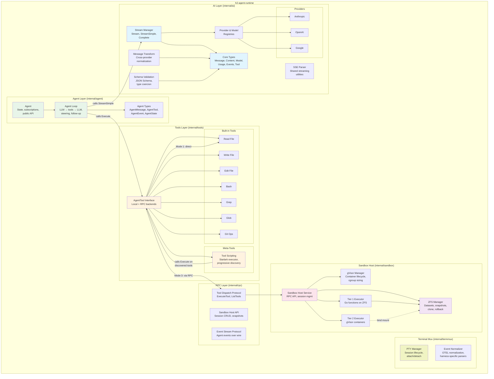
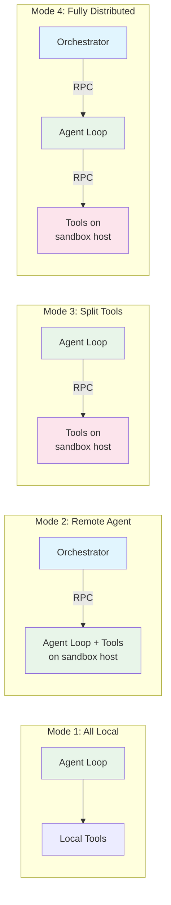
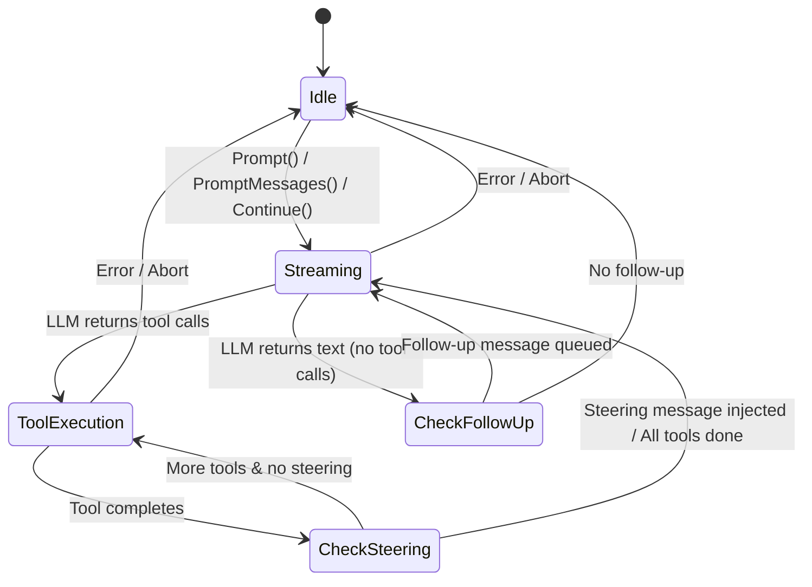
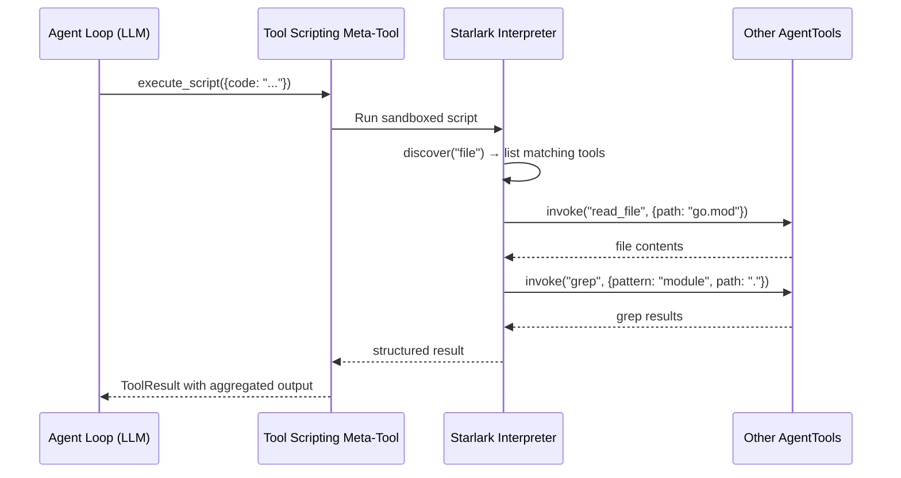
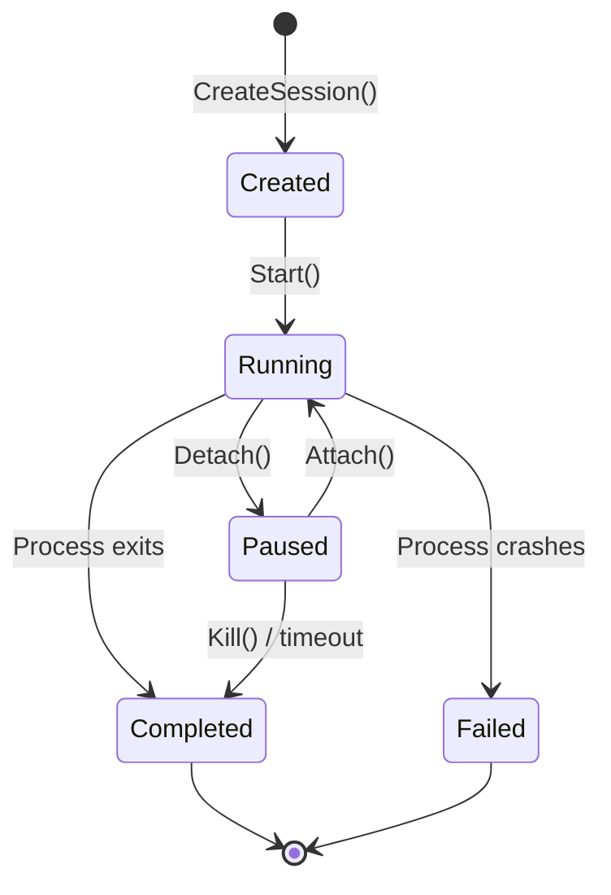
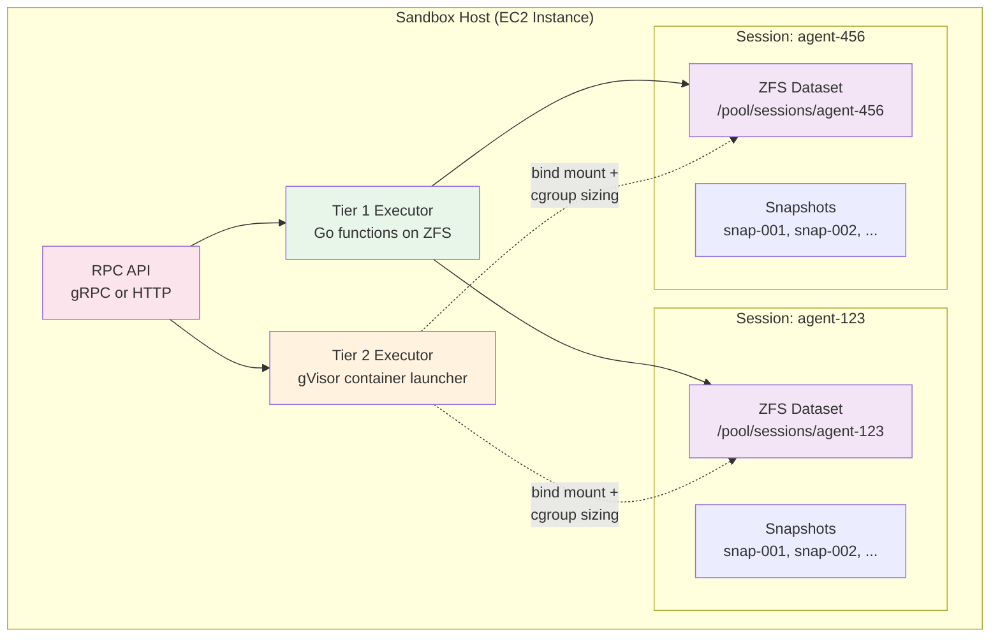
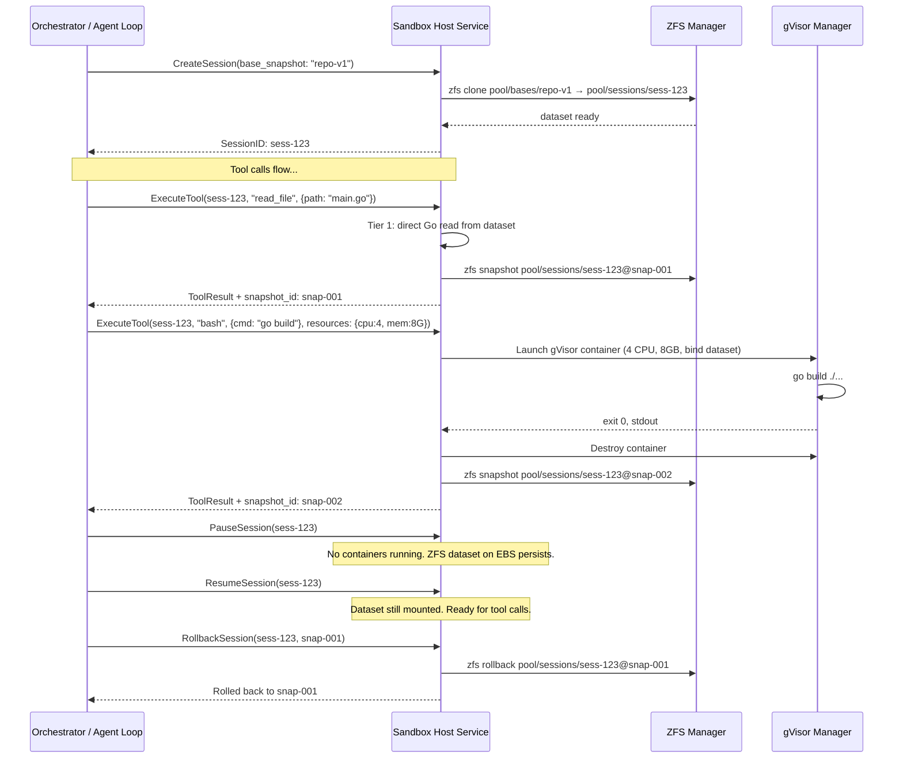
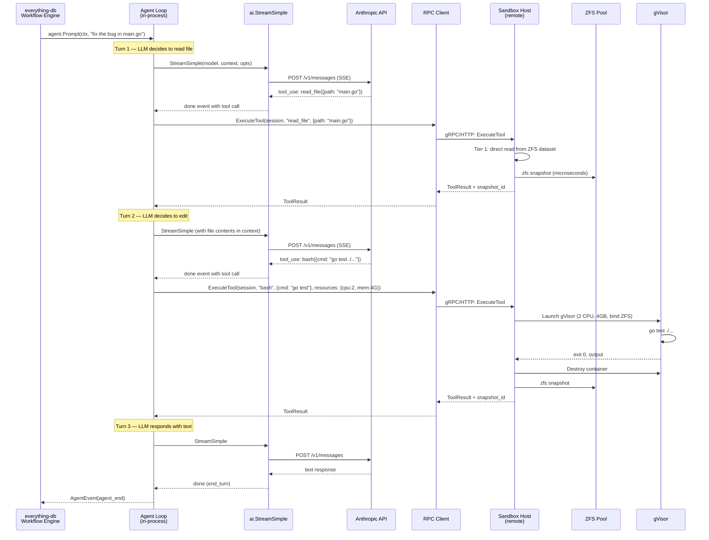
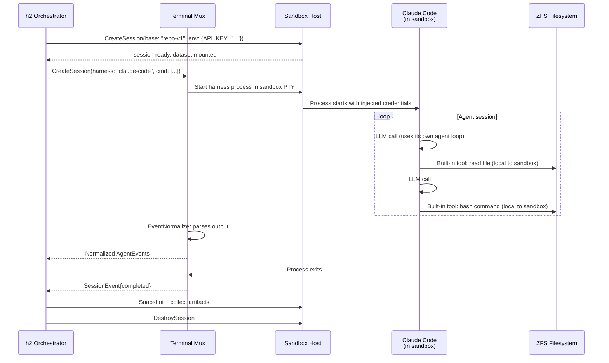
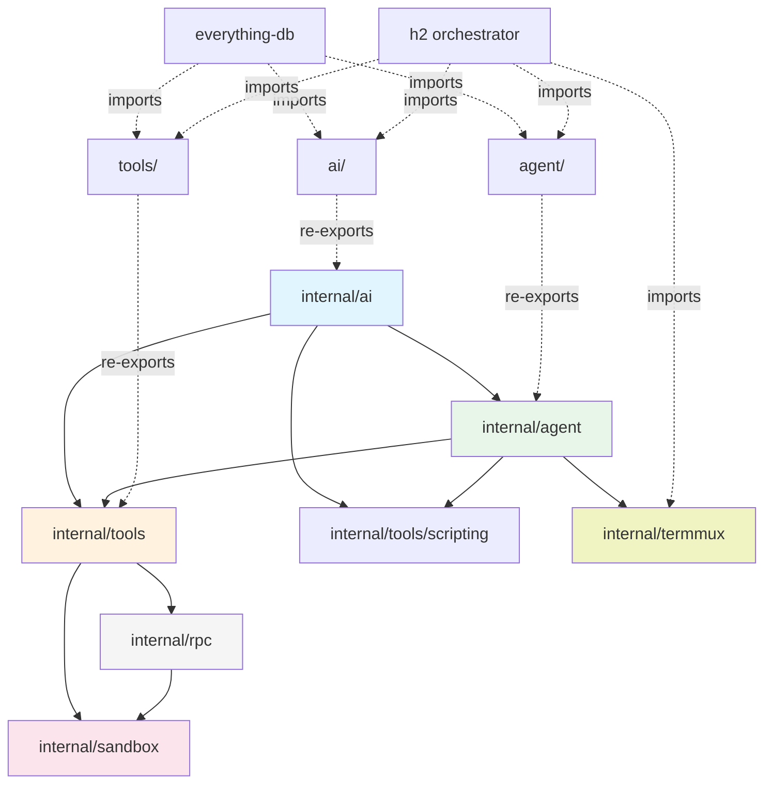

# Architecture — h2-agent-runtime

## Overview

h2-agent-runtime is a Go library and service that provides a flexible, layered agent runtime. It implements the three-layer model from the [agent-runtime shaping doc](../shaping/agent-runtime.md): **orchestrator integration surface**, **agent loop**, and **tools** — with well-defined interfaces between layers that allow each to run locally or remotely.

The runtime serves two consumers:
1. **h2 orchestrator** — imports the runtime as a Go library for multi-agent coordination, terminal mux, and 3rd party harness management.
2. **everything-db** — imports the runtime as a Go library for workflow-embedded agent loops (`ActivityAgentLoop`, `ActivityLLMCall`).

This document is the top-level architecture for the full runtime scope. Individual component plans provide implementation detail.

### Design Principles

- **Clean layering with interface seams**: Each component communicates through Go interfaces. The same agent loop code works with local filesystem tools or remote sandbox tools — it calls `AgentTool.Execute()` and doesn't know or care where execution happens.
- **Go idioms**: Interfaces for extensibility, channels for streaming, `context.Context` for cancellation, explicit error handling, `internal/` for encapsulation.
- **Streaming-first**: All LLM interactions stream events through Go channels. All tool executions report progress through callbacks. Event subscribers see everything in real time.
- **Provider-pluggable / Tool-pluggable**: New LLM providers and new tools are added by implementing interfaces, not modifying core code.
- **Library-first, service-second**: The core runtime is a Go library with zero I/O opinions. The sandbox host service is a separate binary that exposes the library over RPC.

---

## System Architecture

### Full Component Map



### Placement Modes

The same codebase supports four deployment configurations. The `AgentTool` interface is the key seam — local tools and RPC-backed tools implement the same interface:



**Mode 1** — everything in-process, no RPC, no ZFS. For development and single-agent use.

**Mode 2** — orchestrator launches agent + tools on a sandbox host. Primary path for 3rd party harnesses (Claude Code, Codex, Aider run inside the sandbox).

**Mode 3** — agent loop on the workflow server (cheap goroutines), tools dispatched via RPC to sandbox hosts. Most compute-efficient for production.

**Mode 4** — maximum flexibility, each layer on separate infrastructure.

---

## Component Architecture

### 1. AI Layer (`internal/ai`)

The LLM abstraction layer. Multi-provider streaming with vendor-agnostic types. Zero knowledge of agents, tools execution, or persistence.

**Detailed design:** [01-ai-core.md](./01-ai-core.md) (reviewed, approved)
**Test harness:** [01-ai-core-test-harness.md](./01-ai-core-test-harness.md)

#### Key Interfaces

```go
// Provider is the interface each LLM backend implements
type Provider interface {
    API() string
    Stream(ctx context.Context, model Model, llmCtx Context, opts StreamOptions) *EventStream
    StreamSimple(ctx context.Context, model Model, llmCtx Context, opts SimpleStreamOptions) *EventStream
}

// EventStream wraps a channel with result extraction
type EventStream struct {
    C      <-chan AssistantMessageEvent
    // ...
}
func (s *EventStream) Result() (AssistantMessage, error)
```

#### Core Responsibilities

- **Core types**: Message (user, assistant, tool result), ContentBlock (text, thinking, image, tool call), Model, Usage, Tool schema
- **Streaming**: Channel-based event streaming with `EventStream` wrapper. 32-event buffer. `context.Context` for cancellation.
- **Registries**: Thread-safe (`sync.RWMutex`) provider and model registries with concurrent read support
- **Message transformation**: Cross-provider normalization — strip thinking signatures, normalize tool call IDs, insert synthetic tool results for orphaned calls
- **Validation**: JSON Schema validation with type coercion for LLM-generated arguments
- **SSE parsing**: Shared server-sent events parser used by all HTTP-based providers
- **Provider error typing**: `ProviderError` with structured codes (`context_overflow`, `rate_limit`, `auth`, etc.)

#### Providers

Three initial providers, all using direct HTTP/SSE (no vendor SDKs):

| Provider | API | Capabilities |
|----------|-----|-------------|
| Anthropic | Messages API | Streaming, thinking (adaptive + budget), tool calling, cache control |
| OpenAI | Completions API | Streaming, reasoning effort, tool calling, compatible endpoints (Groq, Mistral) |
| Google | Generative AI | Streaming, thinking, tool calling, thought signatures |

### 2. Agent Layer (`internal/agent`)

The stateful agent loop. Manages the LLM → tools → LLM cycle with steering, follow-up messages, and event subscriptions. Zero knowledge of filesystems, persistence, or UI.

**Detailed design:** [01-ai-core.md](./01-ai-core.md) Section on `agent` package (reviewed, approved)



#### Key Interfaces

```go
// AgentTool — the universal tool interface. Same for local and remote tools.
type AgentTool struct {
    ai.Tool
    Label   string
    Execute func(ctx context.Context, toolCallID string, params map[string]any,
                 onUpdate func(AgentToolResult)) (AgentToolResult, error)
}

// Agent — the public API
func NewAgent(opts AgentOptions) *Agent
func (a *Agent) Prompt(ctx context.Context, text string, images ...ai.ImageContent) error
func (a *Agent) Subscribe(fn func(AgentEvent)) func()
func (a *Agent) Steer(msg AgentMessage)
func (a *Agent) FollowUp(msg AgentMessage)
func (a *Agent) Abort()
```

#### Core Responsibilities

- **Agent loop**: LLM call → tool execution → LLM call cycle with configurable continuation
- **Steering**: Inject messages mid-execution to redirect the agent (e.g., "stop, you're going the wrong direction")
- **Follow-up**: Queue messages for after the current turn completes (e.g., "now do this next thing")
- **Event subscription**: Synchronous callbacks for all state changes (turn start/end, tool execution start/end, message streaming)
- **State management**: Thread-safe access to agent state via `sync.Mutex` with copy-on-read semantics
- **ConvertToLLM**: Pluggable function to map application-level messages to LLM messages (supports custom message types)
- **TransformContext**: Pluggable pre-processing hook (e.g., for context compaction in V2)
- **Terminal tools**: Optional designated tools that terminate the loop with structured output (for workflow integration)

#### Concurrency Model

- All state access through `sync.Mutex` with copy-on-read
- Lock never held during external calls (provider streaming, tool execution, subscriber callbacks)
- `Prompt`/`Continue` are serialized (only one active at a time), all other methods are safe from any goroutine
- Must pass `-race` under concurrent stress testing

### 3. Built-in Tools (`internal/tools`)

Core coding tools that implement the `AgentTool` interface. Each tool has two backends: **local** (direct filesystem/process execution) and **sandbox** (RPC dispatch to sandbox host).

#### Tool Catalog

| Tool | Description | Tier | Local Backend | Sandbox Backend |
|------|-------------|------|---------------|-----------------|
| `read_file` | Read file contents with optional offset/limit | 1 | `os.ReadFile` | Go function on ZFS dataset |
| `write_file` | Write/overwrite file | 1 | `os.WriteFile` | Go function on ZFS dataset |
| `edit_file` | Exact string replacement in files | 1 | In-memory read-modify-write | Go function on ZFS dataset |
| `bash` | Execute shell commands with timeout | 2 | `exec.Command` with PTY | gVisor container with ZFS bind mount |
| `grep` | Ripgrep-style content search | 1 | Embedded ripgrep or Go implementation | Go function on ZFS dataset |
| `glob` | File pattern matching | 1 | `filepath.Glob` / `doublestar` | Go function on ZFS dataset |
| `git_*` | Git operations (status, diff, commit, etc.) | 1/2 | `exec.Command("git", ...)` | Depends on operation |

#### Tool Backend Interface

```go
// ToolBackend abstracts where tool execution happens.
// Local tools implement this directly. RPC tools implement it as a client stub.
type ToolBackend interface {
    // ExecuteTool dispatches a tool call and returns the result.
    // The backend handles tier selection, container lifecycle, and snapshots.
    ExecuteTool(ctx context.Context, req ToolRequest) (*ToolResponse, error)
}

type ToolRequest struct {
    SessionID  string
    ToolName   string
    ToolCallID string
    Params     map[string]any
    Resources  *ResourceSpec  // nil for Tier 1 (auto-detected), set for Tier 2
}

type ToolResponse struct {
    Content    []ai.ContentBlock
    SnapshotID string  // empty for local backend
    ExitCode   *int    // for bash tool
}

type ResourceSpec struct {
    CPUs   int
    MemMB  int
    TimeoutSec int
}
```

#### Local Tool Factory

```go
// NewLocalTools creates the built-in tool set for Mode 1 (all local).
// rootDir constrains all file operations to a directory.
func NewLocalTools(rootDir string, opts LocalToolsOptions) []agent.AgentTool

type LocalToolsOptions struct {
    AllowBash    bool    // default true
    BashTimeout  time.Duration
    MaxFileSize  int64
    GitEnabled   bool
}
```

#### Sandbox Tool Factory

```go
// NewSandboxTools creates the built-in tool set backed by a remote sandbox host.
// All tool calls are dispatched via RPC.
func NewSandboxTools(client rpc.SandboxClient, sessionID string) []agent.AgentTool
```

Both factories return `[]agent.AgentTool` — the agent loop doesn't know or care which factory was used.

### 4. Tool Scripting Meta-Tool (`internal/tools/scripting`)

A Starlark-based meta-tool that enables progressive tool discovery and multi-step tool workflows in a single agent turn.



#### Key Properties

- **Sandboxed execution**: Starlark interpreter with no filesystem or network access. Can only interact with the outside world through `discover()` and `invoke()` builtins.
- **Progressive discovery**: `discover(keyword)` returns tool names and descriptions matching a keyword, without loading full schemas. `describe(tool_name)` returns the full schema. This keeps LLM context small.
- **Multi-step workflows**: A single script can call multiple tools sequentially, inspect intermediate results, and make decisions — all in one LLM turn, saving tokens and latency.
- **Lightweight runtime**: Just an embedded Go Starlark interpreter + helper function bindings. No OS, filesystem, or container needed.
- **Deterministic**: Starlark is intentionally deterministic (no `import`, no goroutines, no I/O). Scripts are reproducible.

#### Implementation

```go
type ScriptingTool struct {
    tools      []agent.AgentTool  // tools available for discovery/invocation
    maxSteps   int                // max tool invocations per script (default 50)
    maxRuntime time.Duration      // max wall-clock time per script (default 30s)
}

// Starlark builtins exposed to scripts:
// discover(keyword: str) -> list[dict]     — fuzzy search tool names/descriptions
// describe(tool_name: str) -> dict         — full tool schema
// invoke(tool_name: str, params: dict) -> dict  — execute a tool and return result
// log(msg: str)                            — append to execution log (returned to LLM)
```

### 5. Terminal Multiplexer (`internal/termmux`)

PTY management for running CLI-based 3rd party agents. This is infrastructure — it manages agent processes, not user-facing terminal UI (that lives in the h2 orchestrator).



#### Core Responsibilities

- **PTY allocation**: Create pseudo-terminals for CLI-based agents (Claude Code, Codex, Aider need a real terminal)
- **Session lifecycle**: Create, start, attach, detach, kill sessions
- **I/O multiplexing**: Capture stdout/stderr for logging while optionally forwarding to an attached consumer
- **Process management**: Signal handling, graceful shutdown, crash detection
- **OTEL event normalization**: Parse harness-specific output into normalized events that the orchestrator can consume

#### Key Interfaces

```go
type Session struct {
    ID        string
    HarnessID string  // "claude-code", "codex", "aider", etc.
    Status    SessionStatus
    // unexported: pty, process, I/O pipes
}

type SessionManager interface {
    CreateSession(ctx context.Context, opts SessionOptions) (*Session, error)
    StartSession(ctx context.Context, id string) error
    AttachSession(ctx context.Context, id string) (io.ReadWriteCloser, error)
    DetachSession(ctx context.Context, id string) error
    KillSession(ctx context.Context, id string, signal os.Signal) error
    ListSessions(ctx context.Context) ([]*Session, error)
    Subscribe(fn func(SessionEvent)) func()  // session lifecycle events
}

type SessionOptions struct {
    HarnessID    string
    Command      []string          // e.g., ["claude", "--print", "do something"]
    Env          map[string]string // credential injection
    WorkDir      string
    InitialInput string            // piped to stdin on start
    Cols, Rows   int               // terminal size
}
```

#### Event Normalization

Each 3rd party harness has a harness-specific parser that converts its output into normalized `AgentEvent`-compatible events:

```go
type EventNormalizer interface {
    // ParseOutput processes raw terminal output and emits normalized events.
    // Returns unprocessed bytes (partial line/event at end of buffer).
    ParseOutput(raw []byte) (events []agent.AgentEvent, remaining []byte)
}

// Per-harness implementations:
// ClaudeCodeNormalizer — parses Claude Code's streaming output
// CodexNormalizer      — parses Codex's output format
// AiderNormalizer      — parses Aider's output format
// GenericNormalizer    — best-effort for unknown harnesses
```

### 6. Sandbox Host Service (`internal/sandbox`)

Manages ZFS pools and gVisor containers on EC2 instances. Exposes an RPC API for remote tool dispatch. Multiple agent sessions per host, each with its own ZFS dataset.



#### Session Lifecycle



#### ZFS Manager

```go
type ZFSManager interface {
    // Dataset operations
    CreateDataset(ctx context.Context, name string) error
    CloneFromSnapshot(ctx context.Context, snapshot, newDataset string) error
    DestroyDataset(ctx context.Context, name string) error
    GetMountpoint(ctx context.Context, dataset string) (string, error)

    // Snapshot operations
    CreateSnapshot(ctx context.Context, dataset, snapName string) error
    Rollback(ctx context.Context, dataset, snapName string) error
    ListSnapshots(ctx context.Context, dataset string) ([]SnapshotInfo, error)
    DestroySnapshot(ctx context.Context, dataset, snapName string) error
}
```

#### gVisor Manager

```go
type GVisorManager interface {
    // Run executes a command in a gVisor container with the given resource limits
    // and bind-mounted filesystem path. Container is created, command runs,
    // and container is destroyed — all within this call.
    Run(ctx context.Context, opts ContainerOptions) (*ContainerResult, error)
}

type ContainerOptions struct {
    Command    []string
    WorkDir    string            // within the container
    Env        map[string]string
    BindMount  string            // host path (ZFS mountpoint) → container root
    Resources  ResourceSpec
}

type ContainerResult struct {
    ExitCode int
    Stdout   []byte
    Stderr   []byte
    Duration time.Duration
}
```

#### Two-Tier Execution

The sandbox host service routes each tool call to the appropriate tier:

| Tier | Tools | Execution | Overhead | Isolation |
|------|-------|-----------|----------|-----------|
| **Tier 1** | read, write, edit, grep, glob, git status/diff/log | Go functions directly on ZFS dataset | ~microseconds | Path validation only |
| **Tier 2** | bash, build, test, git push/clone | gVisor container with ZFS bind mount + cgroup limits | ~50-150ms boot | Full syscall interception |

Per-tool-call container lifecycle: containers are created, used, and destroyed per Tier 2 call. No idle containers during LLM thinking time. At scale with 50 agents, this saves ~510 container-hours per 12-hour session vs keeping containers alive.

### 7. RPC Layer (`internal/rpc`)

Interfaces between layers when they run on separate hosts.

#### Tool Dispatch Protocol

Used between agent loop and sandbox host in Mode 3/4:

```go
// SandboxClient is the client-side interface for remote tool dispatch
type SandboxClient interface {
    // Session management
    CreateSession(ctx context.Context, opts CreateSessionRequest) (*CreateSessionResponse, error)
    PauseSession(ctx context.Context, sessionID string) error
    ResumeSession(ctx context.Context, sessionID string) error
    DestroySession(ctx context.Context, sessionID string) error
    RollbackSession(ctx context.Context, sessionID string, snapshotID string) error

    // Tool execution
    ExecuteTool(ctx context.Context, req ToolRequest) (*ToolResponse, error)
    ListTools(ctx context.Context, sessionID string) ([]ai.Tool, error)

    // Snapshot management
    ListSnapshots(ctx context.Context, sessionID string) ([]SnapshotInfo, error)
}
```

#### Event Streaming Protocol

Used to stream agent events from a remote agent loop back to the orchestrator:

```go
// AgentEventStream provides a way to stream agent events over RPC.
// Server-side: agent loop pushes events. Client-side: orchestrator consumes events.
type AgentEventStream interface {
    Send(event agent.AgentEvent) error
    Recv() (agent.AgentEvent, error)
    Close() error
}
```

#### Protocol Choice

The RPC protocol is an open question (OQ1 from shaping doc). The architecture is protocol-agnostic — interfaces are defined in Go, and a concrete protocol adapter implements them. Candidates:

| Protocol | Pros | Cons |
|----------|------|------|
| **gRPC** | Typed contracts, bidirectional streaming, code generation | Heavier dependency, proto files to maintain |
| **ConnectRPC** | gRPC-compatible, works over HTTP/1.1+, browser-friendly | Newer ecosystem |
| **HTTP/JSON + SSE** | Simple, debuggable, no code generation | Manual serialization, no bidirectional streaming |

Recommendation: **ConnectRPC** — gRPC compatibility with simpler deployment (standard HTTP), good streaming support, and aligns with the Go ecosystem. Final decision deferred to implementation plan.

---

## Data Flow: End-to-End Tool Call (Mode 3)



## Data Flow: 3rd Party Harness (Mode 2)



---

## Module Structure

```
h2-agent-runtime/
├── go.mod
├── go.sum
│
├── ai/                              # Public API: re-exports from internal/ai
│   └── ai.go
├── agent/                           # Public API: re-exports from internal/agent
│   └── agent.go
├── tools/                           # Public API: re-exports tool factories
│   └── tools.go
│
├── internal/
│   ├── ai/                          # LLM abstraction layer
│   │   ├── types.go                 # Message, ContentBlock, Model, Usage, Tool
│   │   ├── events.go               # AssistantMessageEvent, EventType
│   │   ├── event_stream.go         # EventStream channel wrapper
│   │   ├── stream.go               # Stream, StreamSimple, Complete
│   │   ├── registry.go             # Provider & Model registries (sync.RWMutex)
│   │   ├── models.go               # Model catalog, CalculateCost
│   │   ├── validation.go           # JSON Schema validation + type coercion
│   │   ├── transform.go            # Cross-provider message transformation
│   │   ├── errors.go               # ProviderError typed errors
│   │   └── provider/               # Provider implementations
│   │       ├── anthropic/
│   │       │   ├── anthropic.go
│   │       │   ├── messages.go
│   │       │   └── sse.go
│   │       ├── openai/
│   │       │   ├── openai.go
│   │       │   ├── messages.go
│   │       │   └── sse.go
│   │       ├── google/
│   │       │   ├── google.go
│   │       │   └── messages.go
│   │       └── sse/
│   │           └── sse.go           # Shared SSE parsing utilities
│   │
│   ├── agent/                       # Agent framework
│   │   ├── types.go                 # AgentMessage, AgentTool, AgentEvent, AgentState
│   │   ├── agent.go                 # Agent struct, public API, subscription
│   │   └── loop.go                  # Agent loop: LLM→tools→LLM, steering, follow-up
│   │
│   ├── tools/                       # Built-in tool implementations
│   │   ├── iface.go                 # ToolBackend interface, ToolRequest/Response
│   │   ├── factory.go              # NewLocalTools, NewSandboxTools factories
│   │   ├── read.go                  # Read file tool
│   │   ├── write.go                 # Write file tool
│   │   ├── edit.go                  # Edit file tool (exact string replacement)
│   │   ├── bash.go                  # Bash execution tool
│   │   ├── grep.go                  # Content search tool
│   │   ├── glob.go                  # File pattern matching tool
│   │   ├── git.go                   # Git operations tool
│   │   └── scripting/               # Tool scripting meta-tool
│   │       ├── scripting.go         # Starlark executor
│   │       ├── builtins.go          # discover(), describe(), invoke(), log()
│   │       └── sandbox.go           # Starlark sandbox restrictions
│   │
│   ├── termmux/                     # Terminal multiplexer
│   │   ├── session.go               # Session struct, lifecycle
│   │   ├── manager.go               # SessionManager implementation
│   │   ├── pty.go                   # PTY allocation and I/O
│   │   └── normalize/               # Event normalization per harness
│   │       ├── iface.go             # EventNormalizer interface
│   │       ├── claudecode.go        # Claude Code parser
│   │       ├── codex.go             # Codex parser
│   │       ├── aider.go             # Aider parser
│   │       └── generic.go           # Best-effort generic parser
│   │
│   ├── sandbox/                     # Sandbox host service
│   │   ├── service.go               # SandboxHostService — main coordinator
│   │   ├── session.go               # Session state management
│   │   ├── tier1.go                 # Tier 1 executor (Go functions on ZFS)
│   │   ├── tier2.go                 # Tier 2 executor (gVisor containers)
│   │   ├── zfs/                     # ZFS management
│   │   │   ├── manager.go           # ZFSManager implementation
│   │   │   ├── dataset.go           # Dataset operations
│   │   │   └── snapshot.go          # Snapshot operations
│   │   └── gvisor/                  # gVisor container management
│   │       ├── manager.go           # GVisorManager implementation
│   │       ├── container.go         # Container lifecycle
│   │       └── cgroups.go           # Resource limit configuration
│   │
│   └── rpc/                         # RPC layer
│       ├── proto/                   # Protocol definitions (proto files or Go types)
│       │   ├── sandbox.go           # Sandbox host API types
│       │   └── events.go            # Event streaming types
│       ├── server/                  # RPC server implementations
│       │   └── sandbox_server.go    # Sandbox host RPC server
│       └── client/                  # RPC client implementations
│           └── sandbox_client.go    # Sandbox host RPC client
│
├── cmd/
│   └── sandbox-host/               # Sandbox host service binary
│       └── main.go
│
├── e2etests/                        # End-to-end and integration tests
│   ├── agent_local_test.go          # Agent + local tools E2E
│   ├── agent_sandbox_test.go        # Agent + sandbox tools E2E
│   ├── sandbox_host_test.go         # Sandbox host service E2E
│   └── termmux_test.go             # Terminal mux E2E
│
├── benchmarks/                      # Performance benchmarks
│   ├── eventstream_bench_test.go
│   ├── sse_bench_test.go
│   └── tool_dispatch_bench_test.go
│
└── docs/
    ├── shaping/
    │   └── agent-runtime.md
    ├── notes/
    │   └── workflow-engine-integration.md
    └── plans/
        ├── 00-architecture.md       # This document
        ├── 00-plan-index.md         # Plan index and dependency graph
        ├── 01-ai-core.md            # AI core types, streaming, registries
        ├── 01-ai-core-test-harness.md
        └── ...                      # Additional plan docs per component
```

### Import Direction



**Rules:**
- `internal/ai` imports nothing from this repo (only stdlib + JSON schema lib)
- `internal/agent` imports `internal/ai` only
- `internal/tools` imports `internal/ai` and `internal/agent` (for `AgentTool`)
- `internal/tools/scripting` imports `internal/ai` and `internal/agent`
- `internal/sandbox` imports `internal/tools` (for `ToolBackend`)
- `internal/rpc` imports `internal/ai`, `internal/agent`, `internal/tools`, `internal/sandbox`
- `internal/termmux` imports `internal/agent` (for `AgentEvent` types)
- Nothing imports `internal/rpc` except `cmd/sandbox-host` and test packages
- The public packages (`ai/`, `agent/`, `tools/`) are thin re-export layers

---

## Key Architectural Decisions

### AD1: AgentTool as the Universal Seam

The `AgentTool` interface is the single point where placement modes diverge. The agent loop calls `tool.Execute()` — it doesn't know if that function reads a local file or sends an RPC to a sandbox host 1000 miles away. This is what makes Mode 1 and Mode 3 use the same agent loop code:

```go
// Mode 1: local
tools := tools.NewLocalTools("/workspace", tools.LocalToolsOptions{})
a := agent.NewAgent(agent.AgentOptions{Tools: tools, ...})

// Mode 3: remote sandbox
client := rpc.NewSandboxClient("sandbox-host-1:8080")
tools := tools.NewSandboxTools(client, "session-123")
a := agent.NewAgent(agent.AgentOptions{Tools: tools, ...})
```

### AD2: Two-Tier Tool Execution

File operations (read, write, grep, glob) don't need a container. They run as Go functions directly on the ZFS dataset. Only process execution (bash, builds) needs the isolation of a gVisor container. This eliminates container overhead for ~80% of tool calls.

### AD3: Per-Tool-Call Container Lifecycle

gVisor containers are created and destroyed per Tier 2 tool call. This costs ~100ms per call but saves massive idle compute at scale (510 container-hours across 50 agents over 12 hours). The agent loop already has 5-30+ second LLM thinking time between tool calls — 100ms boot overhead is negligible.

### AD4: Library-First Architecture

The core runtime is a Go library, not a service. everything-db imports it directly and runs agent loops in-process. The sandbox host service (`cmd/sandbox-host`) is a separate binary that wraps the library with an RPC interface — but it's optional. Mode 1 works with zero external services.

### AD5: Sum Types via Interfaces

Go doesn't have algebraic data types. We use sealed interfaces with unexported marker methods:

```go
type Message interface{ messageRole() string }
type ContentBlock interface{ contentType() string }
```

This is idiomatic Go. Type switches handle dispatch.

### AD6: Channels for Event Streaming

All LLM interactions stream events through buffered Go channels (32-event buffer). `context.Context` provides cancellation. Consumers can range over the channel or call `EventStream.Result()` for blocking.

### AD7: Starlark for Tool Scripting

Starlark (Go's `go.starlark.net`) provides a deterministic, sandboxed scripting language. No filesystem access, no network, no goroutines, no import. The only external interaction is through explicitly exposed builtins (`discover`, `invoke`). This gives us tool scripting without security concerns.

### AD8: Terminal Mux in the Runtime

The terminal multiplexer lives in the runtime (not the orchestrator) because it's infrastructure needed for Mode 2 — running 3rd party harnesses requires PTY management. The TUI (user-facing terminal) lives in h2 orchestrator.

---

## Cross-Cutting Concerns

### Error Handling

- **LLM errors**: `ProviderError` with typed codes (`context_overflow`, `rate_limit`, `auth`, `server_error`). Returned through `EventStream`, never panic.
- **Tool errors**: Returned as `ToolResultMessage` with `IsError: true`. The LLM sees the error and can retry or adjust.
- **RPC errors**: Wrapped with context (session ID, tool name, sandbox host). Transient errors (network, timeout) are retryable. Fatal errors (session not found) are not.
- **Sandbox errors**: ZFS and gVisor errors are wrapped with operation context and reported through tool results.

### Observability

- **Structured logging**: `log/slog` throughout. Every component logs with structured fields (session ID, tool name, provider, etc.)
- **OTEL tracing**: Spans for LLM calls, tool executions, RPC calls, container lifecycle. Trace context propagated across RPC boundaries.
- **Metrics**: Token usage, tool call latency, container boot time, snapshot latency, ZFS space usage. Exported via OTEL metrics.
- **Event streaming**: `Agent.Subscribe()` provides real-time visibility into all agent activity. The orchestrator can forward these to any observability backend.

### Testing Strategy

Each component has its own testing section in its plan doc. The overall strategy:

| Level | Scope | Where |
|-------|-------|-------|
| **Unit** | Single function/type behavior | `*_test.go` alongside source in `internal/` |
| **Property** | Invariants under random input (EventStream ordering, transform idempotency) | `*_test.go` alongside source |
| **Fuzz** | Crash/panic resistance (SSE parser, JSON schema, type coercion) | `*_test.go` alongside source |
| **Integration** | Real LLM API calls, real ZFS operations | Build-tag gated in `internal/` |
| **E2E** | Full agent loop with tools, sandbox host service | `e2etests/` |
| **Benchmark** | Performance regression tracking | `benchmarks/` |
| **Comparison oracle** | Go vs TypeScript reference implementation | `e2etests/` |

### Performance Considerations

- **SSE parsing**: Zero-copy where possible, reuse buffers. Shared parser across providers.
- **Tool dispatch**: Local tools are direct function calls (zero overhead). RPC tools add ~1-5ms per call (negligible vs LLM thinking time).
- **ZFS snapshots**: Microsecond-level COW snapshots. No performance impact on subsequent reads.
- **gVisor boot**: ~50-150ms. Optimizable with container pre-warming if needed.
- **Channel buffers**: 32 events for LLM streaming (absorbs SSE bursts), tunable.
- **Connection reuse**: HTTP clients with persistent connections per LLM provider.

---

## Unreasonably Robust Programming (URP)

| Area | URP Application |
|------|----------------|
| **EventStream terminal guarantee** | `Result()` always unblocks regardless of how the stream ends — done, error, close-without-terminal, panic in provider goroutine, double terminal event. Tested with deterministic simulation. |
| **Registry mutation isolation** | `GetModel()` returns deep copies. Mutating a returned model cannot corrupt the registry. Property-tested. |
| **Comparison oracle testing** | Every core function (TransformMessages, CalculateCost, IsContextOverflow) is tested against the TypeScript reference implementation on 100+ corpus entries. |
| **SSE parser fuzz testing** | The SSE parser is fuzzed with arbitrary byte sequences. Must never panic, never OOM, never infinite loop. |
| **Per-tool-call snapshots** | Every tool call produces a ZFS snapshot, even file reads. This means any point in an agent's history can be inspected or rolled back to. At ~microsecond cost and COW space efficiency, the overhead is negligible. |
| **Starlark sandbox** | The tool scripting interpreter has no filesystem, network, or OS access. Even a malicious script can only call `discover()` and `invoke()` on already-registered tools. Execution is time-bounded and step-bounded. |
| **Typed provider errors** | Provider errors are structurally classified (not string-matched). Each provider has conformance test fixtures with real error payloads. |

## Alien Artifacts

| Area | Technique |
|------|-----------|
| **ZFS COW snapshots** | Copy-on-write filesystem semantics give us instant, space-efficient snapshots at per-tool-call frequency. This is a database-grade technique applied to agent filesystem management. |
| **gVisor syscall interception** | User-space kernel written in Go (memory-safe) that intercepts all syscalls. Production-proven at Google scale (GKE Sandbox, Cloud Run). Provides container-level isolation without hypervisor overhead. |
| **Starlark deterministic execution** | A language specifically designed for deterministic, hermetic execution (created for Bazel). No nondeterminism sources (no `import`, no threads, no I/O, ordered iteration). Scripts are reproducible. |

## Extreme Optimization

| Area | Technique |
|------|-----------|
| **Two-tier tool execution** | ~80% of tool calls (file operations) bypass container overhead entirely, executing as direct Go function calls on the filesystem. Only process execution pays the container boot cost. |
| **Per-tool-call container lifecycle** | Containers exist only during execution, not during LLM thinking time. At 50 agents, this saves ~510 container-hours per 12-hour session vs persistent containers. |
| **SSE zero-copy parsing** | SSE parser operates on byte slices without string conversion where possible. Buffer reuse across events. |
| **Schema validation caching** | Compiled JSON schemas are cached by content hash. Hot-path validation is a map lookup + validate, not parse + compile + validate. |

---

## Open Questions

### OQ1: RPC Protocol (from shaping)

What protocol for inter-layer RPCs? Current recommendation is ConnectRPC. Decision deferred to the RPC layer implementation plan.

### OQ2: 3rd Party Harness Snapshot Granularity (from shaping)

In Mode 2 with 3rd party harnesses, how to trigger snapshots without per-tool-call hooks. Options: periodic timer, inotify/fswatch, git commit hooks. Decision deferred to terminal mux implementation plan.

### OQ3: Cloud Provider Portability (from shaping)

ZFS and gVisor are portable. The AWS-specific piece is EBS. Provider adapters for GCP/Azure are future work.

### OQ4: Partial JSON Parsing

For streaming tool call argument display, we need to parse incomplete JSON during streaming. Options: port JS `partial-json`, find a Go library, or defer. Decision needed before provider implementation plans.

### OQ5: Model Catalog Maintenance

How to keep Go model catalog in sync with TS `models.generated.ts`. Options: code generator, periodic copy, embed JSON. Current plan: embed JSON.

### OQ6: OAuth

OAuth is out of scope for the initial runtime. API-key-only. OAuth is primarily needed for the coding agent TUI experience (h2 orchestrator concern).
