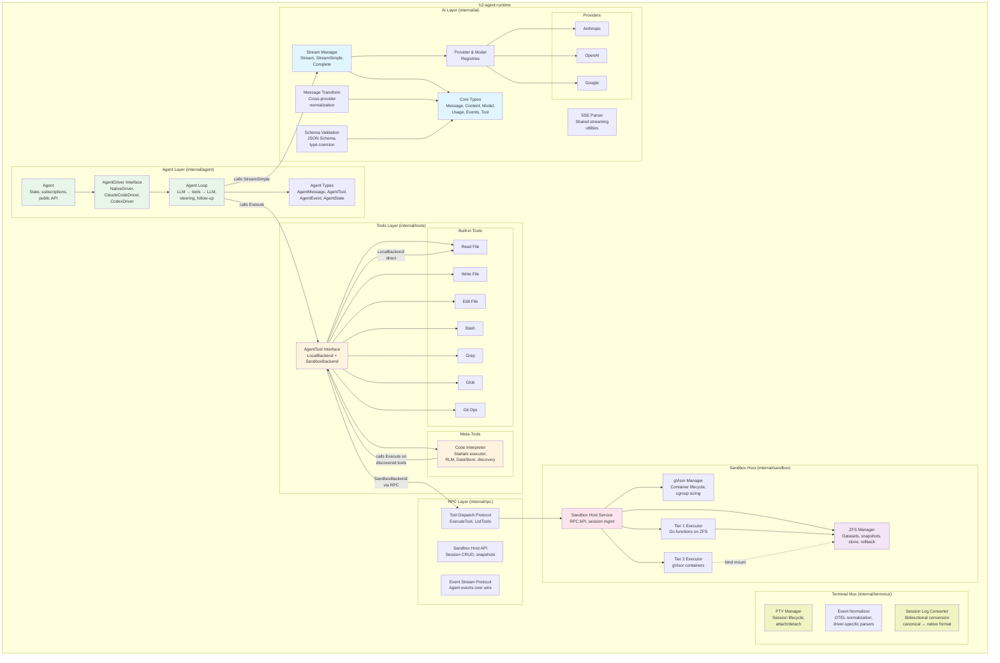
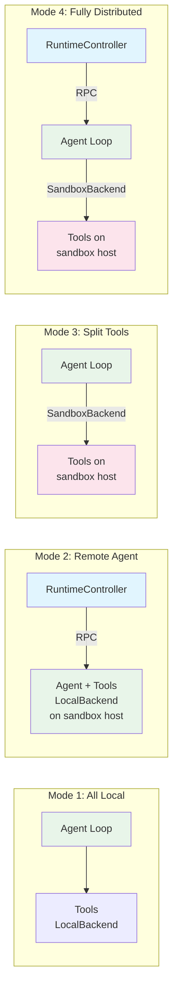
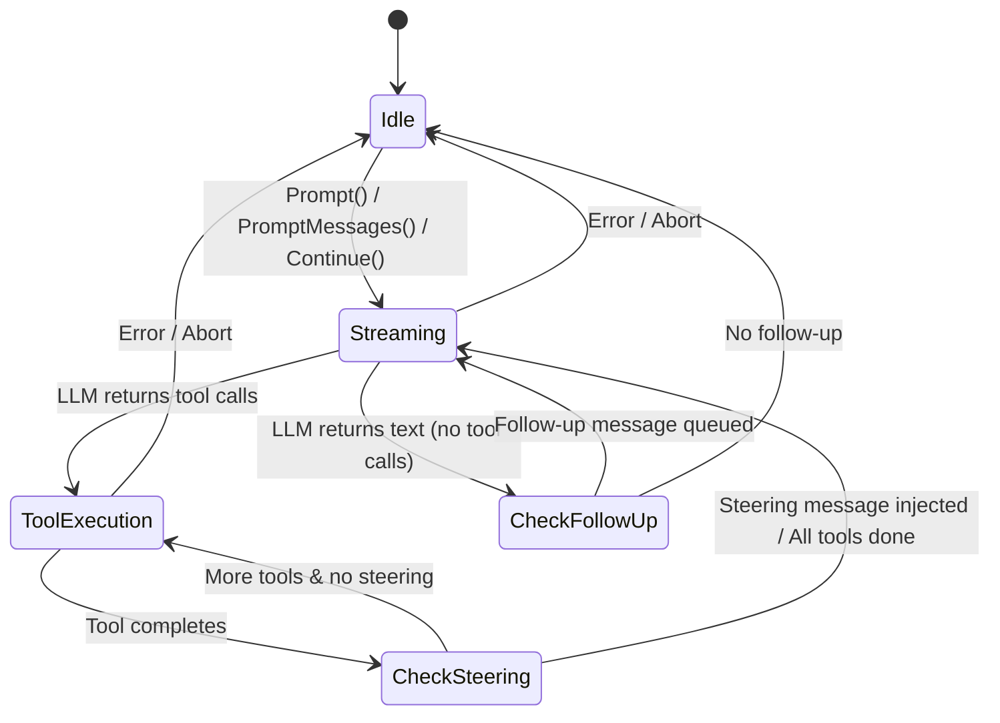
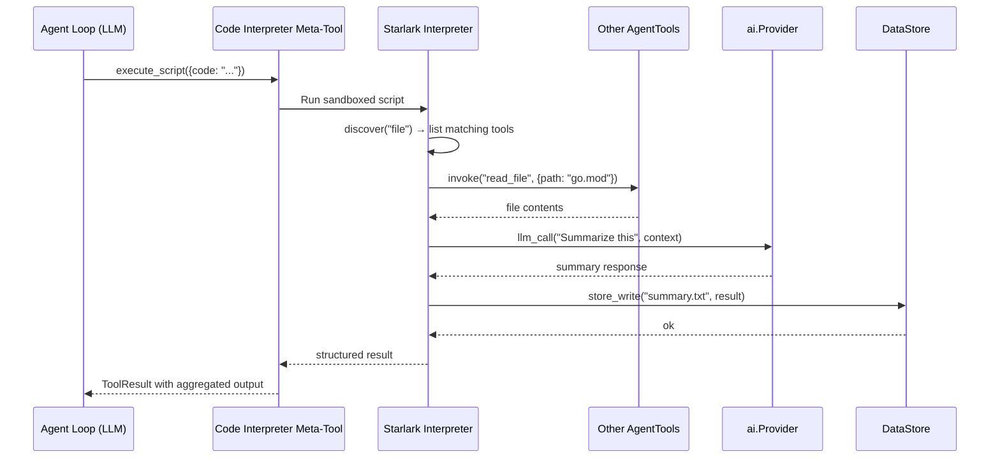
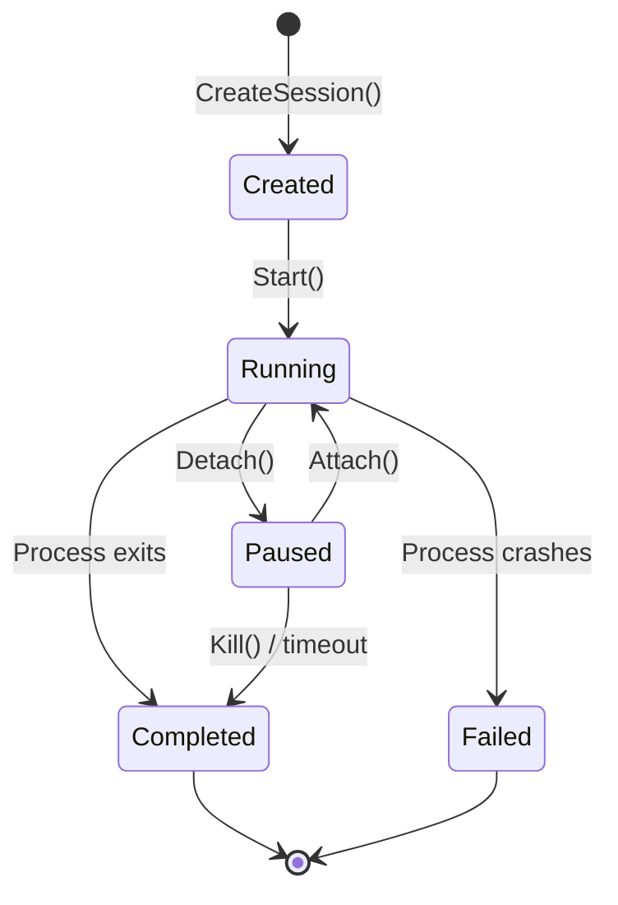
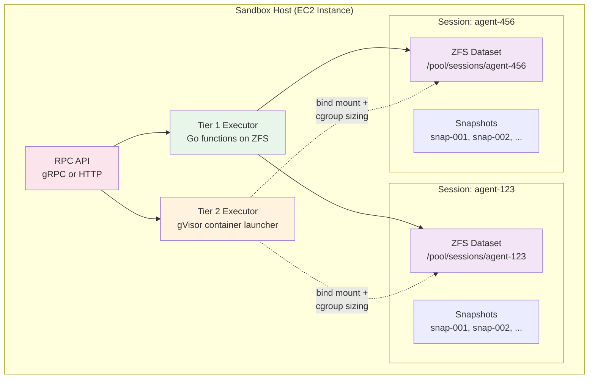
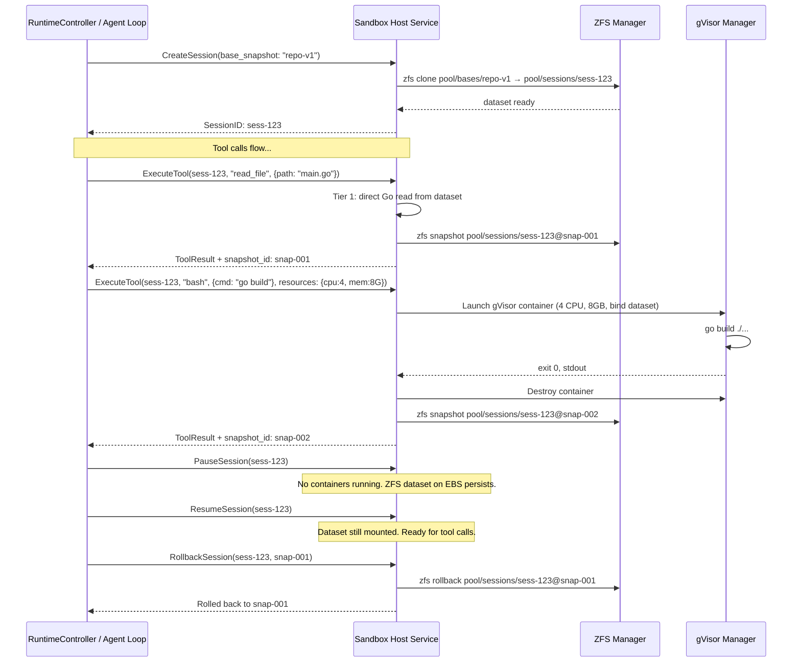
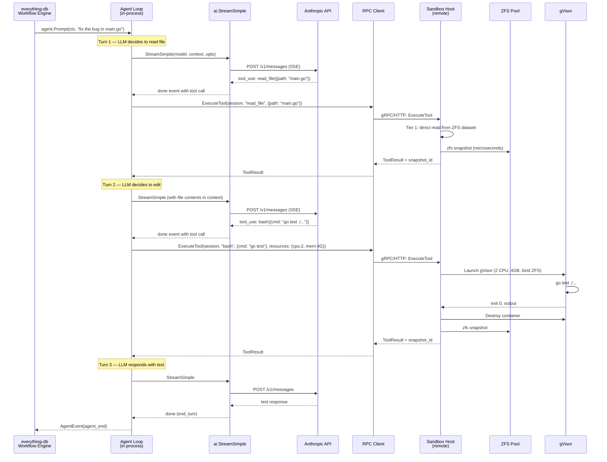
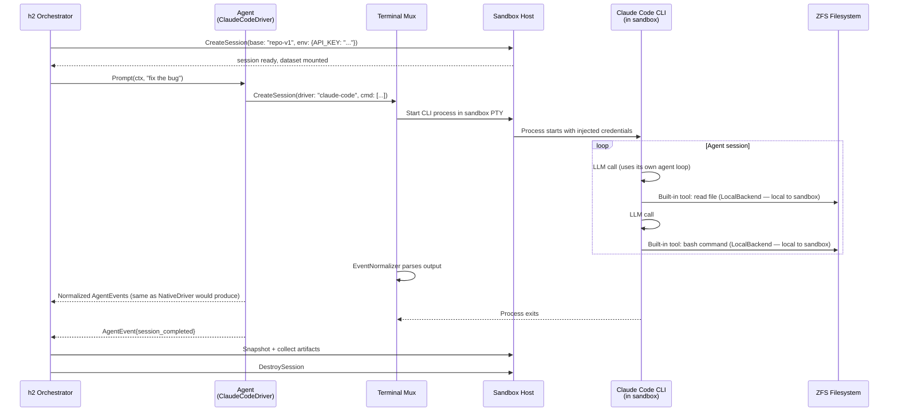
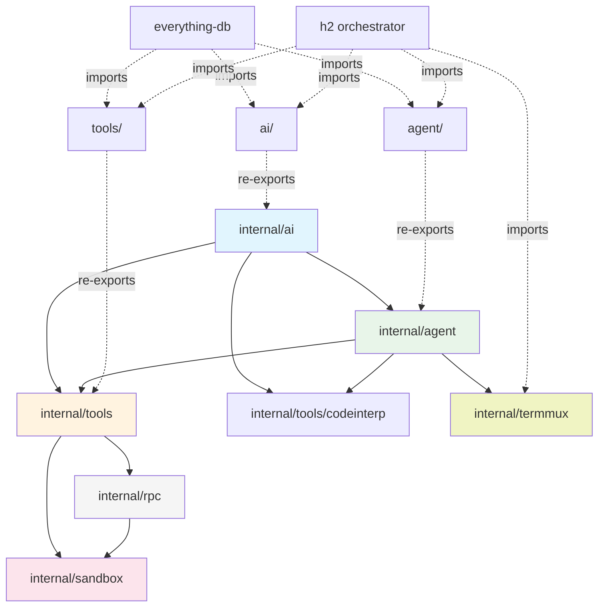

# Architecture — h2-agent-runtime

## Overview

h2-agent-runtime is a Go library and service that provides a flexible, layered agent runtime. It implements the three-layer model from the [agent-runtime shaping doc](../shaping/agent-runtime.md): **RuntimeController**, **agent loop**, and **tools** — with well-defined interfaces between layers that allow each to run locally or remotely.

The runtime serves two consumers:
1. **h2 orchestrator** — imports the runtime as a Go library for multi-agent coordination, terminal mux, and 3rd party agent driver management.
2. **everything-db** — imports the runtime as a Go library for workflow-embedded agent loops (`ActivityAgentLoop`, `ActivityLLMCall`).

### Key Terminology

- **Agent** — The top-level unified interface. Any LLM + tools runtime. Has conversation log, state, metrics. The RuntimeController sees a uniform Agent interface regardless of how the agent loop is driven.
- **RuntimeController** — The control plane for the runtime. Manages session lifecycle (create, pause, resume, stop), event subscription, and state queries. `DefaultController` is the library's built-in implementation. Consumers like h2-orchestrator or edb can use it directly or implement their own `RuntimeController` with additional concerns (TUI, web API, auth, scheduling).
- **AgentDriver** — What runs the agent loop. Three concrete drivers:
  - `NativeDriver` — Our own agent loop (LLM calls + tool dispatch)
  - `ClaudeCodeDriver` — Wraps Claude Code CLI via PTY
  - `CodexDriver` — Wraps Codex CLI via PTY

  All drivers produce the same `AgentEvent` stream and maintain the same `AgentState`.
- **Session** — A single run of an agent (start to pause/completion). Has session ID, conversation log, state history. Can be resumed.

  > **Session ID disambiguation**: Our runtime Session has its own ID, assigned by the RuntimeController. This is distinct from any driver-native session ID (e.g., Claude Code's own session ID, Codex's session ID). We track the driver's native session ID as a field within our Session struct for correlation and debugging, but our Session ID is the authoritative identifier used throughout the system for snapshots, rollback, pause/resume, and RuntimeController state management.

- **ToolBackend** — Two modes:
  - `LocalBackend` — Executes tools on the machine the agent is running on. Covers both Mode 1 (laptop) and Mode 2 (agent inside sandbox — tools are local to that sandbox).
  - `SandboxBackend` — Dispatches tool calls via RPC to sandbox host infrastructure. Covers Modes 3 & 4.
- **Sandbox** — Infrastructure that tool backends point at, NOT a component under the agent. An agent doesn't "have a sandbox" — it has tools whose backends may dispatch to sandbox hosts.

This document is the top-level architecture for the full runtime scope. Individual component plans provide implementation detail.

### RuntimeController Interface

The `RuntimeController` interface defines the control plane API for the runtime. It manages session lifecycle, event subscription, and state queries.

```go
// RuntimeController manages session lifecycle and provides
// the control plane API for the runtime.
type RuntimeController interface {
    // Session lifecycle
    CreateSession(ctx context.Context, opts SessionOptions) (*Session, error)
    GetSession(ctx context.Context, id string) (*Session, error)
    ListSessions(ctx context.Context) ([]*Session, error)
    StopSession(ctx context.Context, id string) error
    PauseSession(ctx context.Context, id string) error
    ResumeSession(ctx context.Context, id string) error

    // Event subscription
    Subscribe(ctx context.Context, sessionID string) (<-chan AgentEvent, error)

    // State queries
    SessionState(ctx context.Context, id string) (SessionState, error)
}
```

`DefaultController` is the library's built-in implementation of `RuntimeController`. Consumers like h2-orchestrator or edb can use `DefaultController` directly, or implement their own `RuntimeController` with additional concerns (TUI, web API, auth, scheduling).

### Design Principles

- **Clean layering with interface seams**: Each component communicates through Go interfaces. The same Agent interface works regardless of whether the underlying AgentDriver is our NativeDriver or a 3rd party CLI driver. Likewise, tools call `AgentTool.Execute()` and don't know or care whether a `LocalBackend` or `SandboxBackend` handles execution.
- **Go idioms**: Interfaces for extensibility, channels for streaming, `context.Context` for cancellation, explicit error handling, `internal/` for encapsulation.
- **Streaming-first**: All LLM interactions stream events through Go channels. All tool executions report progress through callbacks. Event subscribers see everything in real time.
- **Provider-pluggable / Tool-pluggable**: New LLM providers and new tools are added by implementing interfaces, not modifying core code.
- **Library-first, service-second**: The core runtime is a Go library with zero I/O opinions. The sandbox host service is a separate binary that exposes the library over RPC.

---

## System Architecture

### Full Component Map



### Placement Modes

The same codebase supports four deployment configurations. The `AgentTool` interface is the key seam — `LocalBackend` and `SandboxBackend` tools implement the same interface:



**Mode 1** — everything in-process, no RPC, no ZFS. Tools use `LocalBackend`. For development and single-agent use.

**Mode 2** — RuntimeController launches agent + tools on a sandbox host. The agent runs inside the sandbox, so its tools use `LocalBackend` (local to that sandbox). Primary path for 3rd party drivers (ClaudeCodeDriver, CodexDriver run inside the sandbox).

**Mode 3** — agent loop on the workflow server (cheap goroutines), tools dispatched via RPC using `SandboxBackend` to sandbox hosts. Most compute-efficient for production.

**Mode 4** — maximum flexibility, each layer on separate infrastructure. Tools use `SandboxBackend`.

---

## Component Architecture

### 1. AI Layer (`internal/ai`)

The LLM abstraction layer. Multi-provider streaming with vendor-agnostic types. Zero knowledge of agents, tools execution, or persistence.

**Detailed design:** [01-ai-core.md](./01-ai-core.md) (reviewed, approved)
**Test harness:** [01-ai-core-test-harness.md](./01-ai-core-test-harness.md)

#### Key Interfaces

```go
// Provider is the interface each LLM backend implements
type Provider interface {
    API() string
    Stream(ctx context.Context, model Model, llmCtx Context, opts StreamOptions) *EventStream
    StreamSimple(ctx context.Context, model Model, llmCtx Context, opts SimpleStreamOptions) *EventStream
}

// EventStream wraps a channel with result extraction
type EventStream struct {
    C      <-chan AssistantMessageEvent
    // ...
}
func (s *EventStream) Result() (AssistantMessage, error)
```

#### Core Responsibilities

- **Core types**: Message (user, assistant, tool result), ContentBlock (text, thinking, image, tool call), Model, Usage, Tool schema
- **Streaming**: Channel-based event streaming with `EventStream` wrapper. 32-event buffer. `context.Context` for cancellation.
- **Registries**: Thread-safe (`sync.RWMutex`) provider and model registries with concurrent read support
- **Message transformation**: Cross-provider normalization — strip thinking signatures, normalize tool call IDs, insert synthetic tool results for orphaned calls
- **Validation**: JSON Schema validation with type coercion for LLM-generated arguments
- **SSE parsing**: Shared server-sent events parser used by all HTTP-based providers
- **Provider error typing**: `ProviderError` with structured codes (`context_overflow`, `rate_limit`, `auth`, etc.)

#### Providers

Three initial providers, all using direct HTTP/SSE (no vendor SDKs):

| Provider | API | Capabilities |
|----------|-----|-------------|
| Anthropic | Messages API | Streaming, thinking (adaptive + budget), tool calling, cache control |
| OpenAI | Completions API | Streaming, reasoning effort, tool calling, compatible endpoints (Groq, Mistral) |
| Google | Generative AI | Streaming, thinking, tool calling, thought signatures |

### 2. Agent Layer (`internal/agent`)

The Agent is the top-level unified interface — any LLM + tools runtime. It has a conversation log, state, and metrics. The Agent delegates its loop execution to an **AgentDriver**, which determines how the LLM interaction actually runs. Zero knowledge of filesystems, persistence, or UI.

**AgentDriver** is the interface that abstracts how the agent loop runs:
- **`NativeDriver`** — Our own agent loop (LLM calls + tool dispatch). Manages the LLM → tools → LLM cycle with steering, follow-up messages, and event subscriptions.
- **`ClaudeCodeDriver`** — Wraps Claude Code CLI via PTY (uses terminal mux). Parses its output into AgentEvents.
- **`CodexDriver`** — Wraps Codex CLI via PTY (uses terminal mux). Parses its output into AgentEvents.

All drivers produce the same `AgentEvent` stream and maintain the same `AgentState`. The RuntimeController sees a uniform Agent interface regardless of driver.

**Detailed design:** [01-ai-core.md](./01-ai-core.md) Section on `agent` package (reviewed, approved)



#### Key Interfaces

```go
// AgentTool — the universal tool interface. Same for LocalBackend and SandboxBackend tools.
type AgentTool struct {
    ai.Tool
    Label   string
    Execute func(ctx context.Context, toolCallID string, params map[string]any,
                 onUpdate func(AgentToolResult)) (AgentToolResult, error)
}

// AgentDriver — abstracts how the agent loop runs.
// All drivers produce the same AgentEvent stream and maintain the same AgentState.
type AgentDriver interface {
    Start(ctx context.Context, session *Session, prompt string) error
    Resume(ctx context.Context, session *Session) error
    Stop(ctx context.Context) error
    Subscribe(fn func(AgentEvent)) func()
}

// Session — a single run of an agent (start to pause/completion).
// Has session ID, conversation log, state history. Can be resumed.
//
// ID is the runtime-assigned session identifier, authoritative for snapshots,
// rollback, pause/resume, and RuntimeController state. DriverSessionID stores the
// driver's native session ID (e.g. Claude Code's session ID) for correlation.
type Session struct {
    ID               string
    DriverSessionID  string         // driver-native session ID, for correlation only
    ConversationLog  []AgentMessage
    StateHistory     []AgentState
    Metrics          SessionMetrics
}

// Agent — the public API (uniform regardless of driver)
func NewAgent(opts AgentOptions) *Agent
func (a *Agent) Prompt(ctx context.Context, text string, images ...ai.ImageContent) error
func (a *Agent) Subscribe(fn func(AgentEvent)) func()
func (a *Agent) Steer(msg AgentMessage)
func (a *Agent) FollowUp(msg AgentMessage)
func (a *Agent) Abort()
```

#### Core Responsibilities

- **Agent loop**: LLM call → tool execution → LLM call cycle with configurable continuation
- **Steering**: Inject messages mid-execution to redirect the agent (e.g., "stop, you're going the wrong direction")
- **Follow-up**: Queue messages for after the current turn completes (e.g., "now do this next thing")
- **Event subscription**: Synchronous callbacks for all state changes (turn start/end, tool execution start/end, message streaming)
- **State management**: Thread-safe access to agent state via `sync.Mutex` with copy-on-read semantics
- **ConvertToLLM**: Pluggable function to map application-level messages to LLM messages (supports custom message types)
- **TransformContext**: Pluggable pre-processing hook for context compaction (summarizing older conversation turns to stay within context limits)
- **Terminal tools**: Optional designated tools that terminate the loop with structured output (for workflow integration)

#### Concurrency Model

- All state access through `sync.Mutex` with copy-on-read
- Lock never held during external calls (provider streaming, tool execution, subscriber callbacks)
- `Prompt`/`Continue` are serialized (only one active at a time), all other methods are safe from any goroutine
- Must pass `-race` under concurrent stress testing

### 3. Built-in Tools (`internal/tools`)

Core coding tools that implement the `AgentTool` interface. Each tool has two backends: **`LocalBackend`** (direct filesystem/process execution — used in Mode 1 and Mode 2 where the agent runs on the same machine as the tools) and **`SandboxBackend`** (RPC dispatch to sandbox host infrastructure — used in Modes 3 & 4).

#### Tool Catalog

| Tool | Description | Tier | Local Backend | Sandbox Backend |
|------|-------------|------|---------------|-----------------|
| `read_file` | Read file contents with optional offset/limit | 1 | `os.ReadFile` | Go function on ZFS dataset |
| `write_file` | Write/overwrite file | 1 | `os.WriteFile` | Go function on ZFS dataset |
| `edit_file` | Exact string replacement in files | 1 | In-memory read-modify-write | Go function on ZFS dataset |
| `bash` | Execute shell commands with timeout | 2 | `exec.Command` with PTY | gVisor container with ZFS bind mount |
| `grep` | Ripgrep-style content search | 1 | Embedded ripgrep or Go implementation | Go function on ZFS dataset |
| `glob` | File pattern matching | 1 | `filepath.Glob` / `doublestar` | Go function on ZFS dataset |
| `git_*` | Git operations (status, diff, commit, etc.) | 1/2 | `exec.Command("git", ...)` | Depends on operation |

#### ToolBackend Interface

```go
// ToolBackend abstracts where tool execution happens.
// LocalBackend implements this for direct execution (Mode 1 and Mode 2).
// SandboxBackend implements this as an RPC client stub (Mode 3 and Mode 4).
type ToolBackend interface {
    // ExecuteTool dispatches a tool call and returns the result.
    // The backend handles tier selection, container lifecycle, and snapshots.
    ExecuteTool(ctx context.Context, req ToolRequest) (*ToolResponse, error)
}

type ToolRequest struct {
    SessionID  string
    ToolName   string
    ToolCallID string
    Params     map[string]any
    Resources  *ResourceSpec  // nil for Tier 1 (auto-detected), set for Tier 2
}

type ToolResponse struct {
    Content    []ai.ContentBlock
    SnapshotID string  // empty for LocalBackend
    ExitCode   *int    // for bash tool
}

type ResourceSpec struct {
    CPUs   int
    MemMB  int
    TimeoutSec int
}
```

#### LocalBackend Tool Factory

```go
// NewLocalTools creates the built-in tool set using LocalBackend.
// Used in Mode 1 (all local) and Mode 2 (agent inside sandbox — tools are local to sandbox).
// rootDir constrains all file operations to a directory.
func NewLocalTools(rootDir string, opts LocalToolsOptions) []agent.AgentTool

type LocalToolsOptions struct {
    AllowBash    bool    // default true
    BashTimeout  time.Duration
    MaxFileSize  int64
    GitEnabled   bool
}
```

#### SandboxBackend Tool Factory

```go
// NewSandboxTools creates the built-in tool set using SandboxBackend.
// All tool calls are dispatched via RPC to sandbox host infrastructure (Mode 3 and Mode 4).
func NewSandboxTools(client rpc.SandboxClient, sessionID string) []agent.AgentTool
```

Both factories return `[]agent.AgentTool` — the Agent (and its AgentDriver) doesn't know or care which factory was used.

### 4. Code Interpreter Meta-Tool (`internal/tools/codeinterp`)

A Starlark-based code interpreter meta-tool that enables progressive tool discovery, multi-step tool workflows, recursive LLM sub-calls, and pluggable DataStore access in a single agent turn.



#### Key Properties

- **Sandboxed execution**: Starlark interpreter with no filesystem or network access. Can only interact with the outside world through approved builtins (`discover`, `invoke`, `llm_call`, `llm_batch`, `store_*`).
- **Progressive discovery**: `discover(keyword)` returns tool names and descriptions matching a keyword, without loading full schemas. `describe(tool_name)` returns the full schema. This keeps LLM context small.
- **Multi-step workflows**: A single script can call multiple tools sequentially, inspect intermediate results, and make decisions — all in one LLM turn, saving tokens and latency.
- **Recursive LLM (RLM)**: Scripts can spawn sub-LLM calls (`llm_call`, `llm_batch`) for map-reduce, summarization, classification. Sub-calls use existing provider infrastructure with isolated context and configurable token/cost budgets.
- **Pluggable DataStore**: Scripts read/write data through a generic DataStore interface (MemoryDataStore for lightweight, FSDataStore for sandbox, BlobDataStore for cloud, SQLDataStore for analytics).
- **Two-tier execution**: Lightweight scripts run in-process with default limits; full scripts (RLM, large data) run in sandbox with elevated limits and persistent DataStore.
- **Deterministic**: Starlark is intentionally deterministic (no `import`, no goroutines, no I/O). Scripts are reproducible.

#### Implementation

```go
type CodeInterpreterTool struct {
    tools      []agent.AgentTool  // tools available for discovery/invocation
    provider   ai.Provider        // provider for RLM sub-calls
    config     Config             // execution limits (tier-dependent)
}

// Starlark builtins exposed to scripts:
// discover(keyword: str) -> list[dict]     — fuzzy search tool names/descriptions
// describe(tool_name: str) -> dict         — full tool schema
// invoke(tool_name: str, params: dict) -> dict  — execute a tool and return result
// log(msg: str)                            — append to execution log (returned to LLM)
// llm_call(prompt, context, model, max_tokens) -> dict  — sub-LLM call
// llm_batch(calls: list[dict]) -> list[dict]  — parallel sub-LLM calls
// store_write(key, data) -> None           — write to DataStore
// store_read(key) -> str                   — read from DataStore
// store_search(key, pattern) -> list[dict] — search within stored value
// store_list(prefix) -> list[str]          — list keys by prefix
```

### 5. Terminal Multiplexer (`internal/termmux`)

PTY management for running CLI-based 3rd party agent drivers (ClaudeCodeDriver, CodexDriver). This is infrastructure — it manages agent processes, not user-facing terminal UI (that lives in the h2 orchestrator).



#### Core Responsibilities

- **PTY allocation**: Create pseudo-terminals for CLI-based agent drivers (Claude Code, Codex need a real terminal)
- **Session lifecycle**: Create, start, attach, detach, kill sessions
- **I/O multiplexing**: Capture stdout/stderr for logging while optionally forwarding to an attached consumer
- **Process management**: Signal handling, graceful shutdown, crash detection
- **OTEL event normalization**: Parse driver-specific output into normalized events that the RuntimeController can consume
- **Bidirectional session log conversion**: Each 3rd party driver must implement bidirectional session log conversion (see below)

#### Key Interfaces

```go
type Session struct {
    ID       string
    DriverID string  // "claude-code", "codex"
    Status   SessionStatus
    // unexported: pty, process, I/O pipes
}

type SessionManager interface {
    CreateSession(ctx context.Context, opts SessionOptions) (*Session, error)
    StartSession(ctx context.Context, id string) error
    AttachSession(ctx context.Context, id string) (io.ReadWriteCloser, error)
    DetachSession(ctx context.Context, id string) error
    KillSession(ctx context.Context, id string, signal os.Signal) error
    ListSessions(ctx context.Context) ([]*Session, error)
    Subscribe(fn func(SessionEvent)) func()  // session lifecycle events
}

type SessionOptions struct {
    DriverID     string
    Command      []string          // e.g., ["claude", "--print", "do something"]
    Env          map[string]string // credential injection
    WorkDir      string
    InitialInput string            // piped to stdin on start
    Cols, Rows   int               // terminal size
}
```

#### Event Normalization

Each 3rd party driver has a driver-specific parser that converts its output into normalized `AgentEvent`-compatible events:

```go
type EventNormalizer interface {
    // ParseOutput processes raw terminal output and emits normalized events.
    // Returns unprocessed bytes (partial line/event at end of buffer).
    ParseOutput(raw []byte) (events []agent.AgentEvent, remaining []byte)
}

// Per-driver implementations:
// ClaudeCodeNormalizer — parses Claude Code's streaming output
// CodexNormalizer      — parses Codex's output format
```

#### Bidirectional Session Log Conversion

Each 3rd party driver must implement bidirectional session log conversion between its native session log format and our canonical conversation format:

```go
type SessionLogConverter interface {
    // ParseNativeLog reads the driver's native session log (e.g., Claude Code's
    // session.jsonl, Codex equivalent) and converts it into our canonical
    // conversation format.
    ParseNativeLog(ctx context.Context, nativeLog io.Reader) ([]agent.AgentMessage, error)

    // WriteNativeLog converts our canonical conversation format back into the
    // driver's native session log format.
    WriteNativeLog(ctx context.Context, messages []agent.AgentMessage, w io.Writer) error
}

// Per-driver implementations:
// ClaudeCodeLogConverter — converts Claude Code session.jsonl ↔ canonical format
// CodexLogConverter      — converts Codex session log ↔ canonical format
```

This bidirectional conversion enables:
- **Resume after crash**: Rebuild the driver's native session log from our checkpoint, then restart the driver mid-conversation.
- **Cross-driver migration**: Start a session in ClaudeCodeDriver, pause it, resume in CodexDriver or NativeDriver. Our canonical format is the bridge.
- **Durable execution**: Our canonical format is the checkpoint (persisted by the RuntimeController). The driver's native format is the runtime representation (ephemeral). On recovery, we reconstruct the runtime representation from the checkpoint.

### 6. Sandbox Host Service (`internal/sandbox`)

Manages ZFS pools and gVisor containers on EC2 instances. Exposes an RPC API for remote tool dispatch. Multiple agent sessions per host, each with its own ZFS dataset.



#### Session Lifecycle



#### ZFS Manager

```go
type ZFSManager interface {
    // Dataset operations
    CreateDataset(ctx context.Context, name string) error
    CloneFromSnapshot(ctx context.Context, snapshot, newDataset string) error
    DestroyDataset(ctx context.Context, name string) error
    GetMountpoint(ctx context.Context, dataset string) (string, error)

    // Snapshot operations
    CreateSnapshot(ctx context.Context, dataset, snapName string) error
    Rollback(ctx context.Context, dataset, snapName string) error
    ListSnapshots(ctx context.Context, dataset string) ([]SnapshotInfo, error)
    DestroySnapshot(ctx context.Context, dataset, snapName string) error
}
```

#### gVisor Manager

```go
type GVisorManager interface {
    // Run executes a command in a gVisor container with the given resource limits
    // and bind-mounted filesystem path. Container is created, command runs,
    // and container is destroyed — all within this call.
    Run(ctx context.Context, opts ContainerOptions) (*ContainerResult, error)
}

type ContainerOptions struct {
    Command    []string
    WorkDir    string            // within the container
    Env        map[string]string
    BindMount  string            // host path (ZFS mountpoint) → container root
    Resources  ResourceSpec
}

type ContainerResult struct {
    ExitCode int
    Stdout   []byte
    Stderr   []byte
    Duration time.Duration
}
```

#### Two-Tier Execution

The sandbox host service routes each tool call to the appropriate tier:

| Tier | Tools | Execution | Overhead | Isolation |
|------|-------|-----------|----------|-----------|
| **Tier 1** | read, write, edit, grep, glob, git status/diff/log | Go functions directly on ZFS dataset | ~microseconds | Path validation only |
| **Tier 2** | bash, build, test, git push/clone | gVisor container with ZFS bind mount + cgroup limits | ~50-150ms boot | Full syscall interception |

Per-tool-call container lifecycle: containers are created, used, and destroyed per Tier 2 call. No idle containers during LLM thinking time. At scale with 50 agents, this saves ~510 container-hours per 12-hour session vs keeping containers alive.

### 7. RPC Layer (`internal/rpc`)

Interfaces between layers when they run on separate hosts.

#### Tool Dispatch Protocol

Used between agent loop and sandbox host in Mode 3/4:

```go
// SandboxClient is the client-side interface for remote tool dispatch
type SandboxClient interface {
    // Session management
    CreateSession(ctx context.Context, opts CreateSessionRequest) (*CreateSessionResponse, error)
    PauseSession(ctx context.Context, sessionID string) error
    ResumeSession(ctx context.Context, sessionID string) error
    DestroySession(ctx context.Context, sessionID string) error
    RollbackSession(ctx context.Context, sessionID string, snapshotID string) error

    // Tool execution
    ExecuteTool(ctx context.Context, req ToolRequest) (*ToolResponse, error)
    ListTools(ctx context.Context, sessionID string) ([]ai.Tool, error)

    // Snapshot management
    ListSnapshots(ctx context.Context, sessionID string) ([]SnapshotInfo, error)
}
```

#### Event Streaming Protocol

Used to stream agent events from a remote agent loop back to the RuntimeController:

```go
// AgentEventStream provides a way to stream agent events over RPC.
// Server-side: agent loop pushes events. Client-side: RuntimeController consumes events.
type AgentEventStream interface {
    Send(event agent.AgentEvent) error
    Recv() (agent.AgentEvent, error)
    Close() error
}
```

#### Protocol Choice

The RPC protocol is an open question (OQ1 from shaping doc). The architecture is protocol-agnostic — interfaces are defined in Go, and a concrete protocol adapter implements them. Candidates:

| Protocol | Pros | Cons |
|----------|------|------|
| **gRPC** | Typed contracts, bidirectional streaming, code generation | Heavier dependency, proto files to maintain |
| **ConnectRPC** | gRPC-compatible, works over HTTP/1.1+, browser-friendly | Newer ecosystem |
| **HTTP/JSON + SSE** | Simple, debuggable, no code generation | Manual serialization, no bidirectional streaming |

Recommendation: **ConnectRPC** — gRPC compatibility with simpler deployment (standard HTTP), good streaming support, and aligns with the Go ecosystem. Final decision deferred to implementation plan.

---

## Data Flow: End-to-End Tool Call (Mode 3)



## Data Flow: 3rd Party Driver (Mode 2)



---

## Module Structure

```
h2-agent-runtime/
├── go.mod
├── go.sum
│
├── ai/                              # Public API: re-exports from internal/ai
│   └── ai.go
├── agent/                           # Public API: re-exports from internal/agent
│   └── agent.go
├── tools/                           # Public API: re-exports tool factories
│   └── tools.go
│
├── internal/
│   ├── ai/                          # LLM abstraction layer
│   │   ├── types.go                 # Message, ContentBlock, Model, Usage, Tool
│   │   ├── events.go               # AssistantMessageEvent, EventType
│   │   ├── event_stream.go         # EventStream channel wrapper
│   │   ├── stream.go               # Stream, StreamSimple, Complete
│   │   ├── registry.go             # Provider & Model registries (sync.RWMutex)
│   │   ├── models.go               # Model catalog, CalculateCost
│   │   ├── validation.go           # JSON Schema validation + type coercion
│   │   ├── transform.go            # Cross-provider message transformation
│   │   ├── errors.go               # ProviderError typed errors
│   │   └── provider/               # Provider implementations
│   │       ├── anthropic/
│   │       │   ├── anthropic.go
│   │       │   ├── messages.go
│   │       │   └── sse.go
│   │       ├── openai/
│   │       │   ├── openai.go
│   │       │   ├── messages.go
│   │       │   └── sse.go
│   │       ├── google/
│   │       │   ├── google.go
│   │       │   └── messages.go
│   │       └── sse/
│   │           └── sse.go           # Shared SSE parsing utilities
│   │
│   ├── agent/                       # Agent framework
│   │   ├── types.go                 # AgentMessage, AgentTool, AgentEvent, AgentState
│   │   ├── agent.go                 # Agent struct, public API, subscription
│   │   ├── driver.go               # AgentDriver interface, Session
│   │   ├── loop.go                  # NativeDriver: LLM→tools→LLM, steering, follow-up
│   │   ├── driver_claudecode.go    # ClaudeCodeDriver: wraps Claude Code CLI via PTY
│   │   └── driver_codex.go         # CodexDriver: wraps Codex CLI via PTY
│   │
│   ├── tools/                       # Built-in tool implementations
│   │   ├── iface.go                 # ToolBackend interface (LocalBackend, SandboxBackend)
│   │   ├── factory.go              # NewLocalTools, NewSandboxTools factories
│   │   ├── read.go                  # Read file tool
│   │   ├── write.go                 # Write file tool
│   │   ├── edit.go                  # Edit file tool (exact string replacement)
│   │   ├── bash.go                  # Bash execution tool
│   │   ├── grep.go                  # Content search tool
│   │   ├── glob.go                  # File pattern matching tool
│   │   ├── git.go                   # Git operations tool
│   │   └── codeinterp/              # Code interpreter meta-tool
│   │       ├── codeinterp.go        # Starlark executor + tier classification
│   │       ├── builtins.go          # discover(), describe(), invoke(), log()
│   │       ├── rlm.go               # llm_call(), llm_batch() RLM builtins
│   │       ├── datastore.go         # store_read/write/search/list builtins
│   │       ├── sandbox.go           # Starlark sandbox restrictions
│   │       └── datastore/           # DataStore interface + implementations
│   │           ├── iface.go         # DataStore interface
│   │           ├── memory.go        # MemoryDataStore
│   │           ├── fs.go            # FSDataStore
│   │           ├── blob.go          # BlobDataStore (S3/GCS)
│   │           └── sql.go           # SQLDataStore
│   │
│   ├── termmux/                     # Terminal multiplexer
│   │   ├── session.go               # Session struct, lifecycle
│   │   ├── manager.go               # SessionManager implementation
│   │   ├── pty.go                   # PTY allocation and I/O
│   │   ├── normalize/               # Event normalization per driver
│   │   │   ├── iface.go             # EventNormalizer interface
│   │   │   ├── claudecode.go        # Claude Code parser
│   │   │   └── codex.go             # Codex parser
│   │   └── sessionlog/              # Bidirectional session log conversion
│   │       ├── iface.go             # SessionLogConverter interface
│   │       ├── claudecode.go        # Claude Code session.jsonl ↔ canonical
│   │       └── codex.go             # Codex session log ↔ canonical
│   │
│   ├── sandbox/                     # Sandbox host service
│   │   ├── service.go               # SandboxHostService — main coordinator
│   │   ├── session.go               # Session state management
│   │   ├── tier1.go                 # Tier 1 executor (Go functions on ZFS)
│   │   ├── tier2.go                 # Tier 2 executor (gVisor containers)
│   │   ├── zfs/                     # ZFS management
│   │   │   ├── manager.go           # ZFSManager implementation
│   │   │   ├── dataset.go           # Dataset operations
│   │   │   └── snapshot.go          # Snapshot operations
│   │   └── gvisor/                  # gVisor container management
│   │       ├── manager.go           # GVisorManager implementation
│   │       ├── container.go         # Container lifecycle
│   │       └── cgroups.go           # Resource limit configuration
│   │
│   └── rpc/                         # RPC layer
│       ├── proto/                   # Protocol definitions (proto files or Go types)
│       │   ├── sandbox.go           # Sandbox host API types
│       │   └── events.go            # Event streaming types
│       ├── server/                  # RPC server implementations
│       │   └── sandbox_server.go    # Sandbox host RPC server
│       └── client/                  # RPC client implementations
│           └── sandbox_client.go    # Sandbox host RPC client
│
├── cmd/
│   └── sandbox-host/               # Sandbox host service binary
│       └── main.go
│
├── e2etests/                        # End-to-end and integration tests
│   ├── agent_local_test.go          # Agent + LocalBackend tools E2E
│   ├── agent_sandbox_test.go        # Agent + SandboxBackend tools E2E
│   ├── sandbox_host_test.go         # Sandbox host service E2E
│   └── termmux_test.go             # Terminal mux E2E
│
├── benchmarks/                      # Performance benchmarks
│   ├── eventstream_bench_test.go
│   ├── sse_bench_test.go
│   └── tool_dispatch_bench_test.go
│
└── docs/
    ├── shaping/
    │   └── agent-runtime.md
    ├── notes/
    │   └── workflow-engine-integration.md
    └── plans/
        ├── 00-architecture.md       # This document
        ├── 00-plan-index.md         # Plan index and dependency graph
        ├── 01-ai-core.md            # AI core types, streaming, registries
        ├── 01-ai-core-test-harness.md
        └── ...                      # Additional plan docs per component
```

### Import Direction



**Rules:**
- `internal/ai` imports nothing from this repo (only stdlib + JSON schema lib)
- `internal/agent` imports `internal/ai` and `internal/termmux` (for AgentDriver implementations: NativeDriver uses ai directly, ClaudeCodeDriver/CodexDriver use termmux)
- `internal/tools` imports `internal/ai` and `internal/agent` (for `AgentTool`)
- `internal/tools/codeinterp` imports `internal/ai` and `internal/agent`
- `internal/sandbox` imports `internal/tools` (for `ToolBackend`)
- `internal/rpc` imports `internal/ai`, `internal/agent`, `internal/tools`, `internal/sandbox`
- `internal/termmux` imports `internal/agent` (for `AgentEvent` types, `SessionLogConverter`)
- Nothing imports `internal/rpc` except `cmd/sandbox-host` and test packages
- The public packages (`ai/`, `agent/`, `tools/`) are thin re-export layers

---

## Key Architectural Decisions

### AD1: AgentTool as the Universal Seam

The `AgentTool` interface is the single point where placement modes diverge. The Agent (via its AgentDriver) calls `tool.Execute()` — it doesn't know if the `LocalBackend` reads a local file or the `SandboxBackend` sends an RPC to a sandbox host 1000 miles away. This is what makes Mode 1 and Mode 3 use the same agent code:

```go
// Mode 1: LocalBackend
tools := tools.NewLocalTools("/workspace", tools.LocalToolsOptions{})
a := agent.NewAgent(agent.AgentOptions{Tools: tools, ...})

// Mode 3: SandboxBackend
client := rpc.NewSandboxClient("sandbox-host-1:8080")
tools := tools.NewSandboxTools(client, "session-123")
a := agent.NewAgent(agent.AgentOptions{Tools: tools, ...})
```

### AD2: Two-Tier Tool Execution

File operations (read, write, grep, glob) don't need a container. They run as Go functions directly on the ZFS dataset. Only process execution (bash, builds) needs the isolation of a gVisor container. This eliminates container overhead for ~80% of tool calls.

### AD3: Per-Tool-Call Container Lifecycle

gVisor containers are created and destroyed per Tier 2 tool call. This costs ~100ms per call but saves massive idle compute at scale (510 container-hours across 50 agents over 12 hours). The agent loop already has 5-30+ second LLM thinking time between tool calls — 100ms boot overhead is negligible.

### AD4: Library-First Architecture

The core runtime is a Go library, not a service. everything-db imports it directly and runs agent loops in-process. The sandbox host service (`cmd/sandbox-host`) is a separate binary that wraps the library with an RPC interface — but it's optional. Mode 1 works with zero external services.

### AD5: Sum Types via Interfaces

Go doesn't have algebraic data types. We use sealed interfaces with unexported marker methods:

```go
type Message interface{ messageRole() string }
type ContentBlock interface{ contentType() string }
```

This is idiomatic Go. Type switches handle dispatch.

### AD6: Channels for Event Streaming

All LLM interactions stream events through buffered Go channels (32-event buffer). `context.Context` provides cancellation. Consumers can range over the channel or call `EventStream.Result()` for blocking.

### AD7: Starlark for Code Interpreter

Starlark (Go's `go.starlark.net`) provides a deterministic, sandboxed scripting language. No filesystem access, no network, no goroutines, no import. The only external interaction is through explicitly exposed builtins (`discover`, `invoke`, `llm_call`, `llm_batch`, `store_*`). This gives us a code interpreter with recursive LLM support and pluggable storage without security concerns.

### AD8: Terminal Mux in the Runtime

The terminal multiplexer lives in the runtime (not the RuntimeController consumer) because it's infrastructure needed for Mode 2 — running 3rd party agent drivers (ClaudeCodeDriver, CodexDriver) requires PTY management. The TUI (user-facing terminal) lives in h2 orchestrator.

### AD9: Uniform Agent Interface via AgentDriver

The Agent is the top-level interface. Whether driven by NativeDriver (our own LLM loop), ClaudeCodeDriver (wrapping Claude Code CLI), or CodexDriver (wrapping Codex CLI), the RuntimeController sees the same Agent interface with the same AgentEvent stream, AgentState, and Session. This allows the RuntimeController to manage all agents uniformly — tracking state, collecting conversation logs, computing metrics — without knowing which driver is running underneath.

### AD10: Bidirectional Session Log Conversion

Each 3rd party driver maintains bidirectional conversion between its native session log format and our canonical conversation format. This is a key enabler for durable execution: our canonical format serves as the checkpoint, while the driver's native format is the runtime representation. On crash recovery, we reconstruct the native format from our checkpoint. This also enables cross-driver migration — starting a session in one driver and resuming in another.

---

## RuntimeController State Tracking

The h2 orchestrator consumes the runtime as a Go library and is responsible for managing multiple agents. The runtime produces uniform state information via `AgentEvent` streams regardless of which AgentDriver is running underneath. The RuntimeController tracks:

- **Which agents are running**: Registry of all active Agent instances and their current AgentDriver type (NativeDriver, ClaudeCodeDriver, CodexDriver).
- **Agent state changes**: `Active`, `Idle`, `Blocked`, `Exited` states across all agents. State transitions are reported via AgentEvents and are uniform regardless of driver.
- **Full conversation logs from all agents**: Every agent's Session maintains its conversation log in our canonical format. The RuntimeController collects these for dashboard display, session resume, and replay. For 3rd party drivers, the bidirectional session log converter ensures conversation logs are always in canonical format.
- **Metrics**: Token usage, cost, tool call counts, session duration, etc. All metrics are computed from AgentEvents and are driver-agnostic.

The key design point is that the runtime produces all of this uniformly. A NativeDriver emits AgentEvents directly from its LLM loop. A ClaudeCodeDriver emits AgentEvents by parsing Claude Code's output through the EventNormalizer. The RuntimeController consumes the same `Agent.Subscribe()` interface either way.

---

## Cross-Cutting Concerns

### Error Handling

- **LLM errors**: `ProviderError` with typed codes (`context_overflow`, `rate_limit`, `auth`, `server_error`). Returned through `EventStream`, never panic.
- **Tool errors**: Returned as `ToolResultMessage` with `IsError: true`. The LLM sees the error and can retry or adjust.
- **RPC errors**: Wrapped with context (session ID, tool name, sandbox host). Transient errors (network, timeout) are retryable. Fatal errors (session not found) are not.
- **Sandbox errors**: ZFS and gVisor errors are wrapped with operation context and reported through tool results.

### Observability

- **Structured logging**: `log/slog` throughout. Every component logs with structured fields (session ID, tool name, provider, etc.)
- **OTEL tracing**: Spans for LLM calls, tool executions, RPC calls, container lifecycle. Trace context propagated across RPC boundaries.
- **Metrics**: Token usage, tool call latency, container boot time, snapshot latency, ZFS space usage. Exported via OTEL metrics.
- **Event streaming**: `Agent.Subscribe()` provides real-time visibility into all agent activity. The RuntimeController can forward these to any observability backend.

### Testing Strategy

Each component has its own testing section in its plan doc. The overall strategy:

| Level | Scope | Where |
|-------|-------|-------|
| **Unit** | Single function/type behavior | `*_test.go` alongside source in `internal/` |
| **Property** | Invariants under random input (EventStream ordering, transform idempotency) | `*_test.go` alongside source |
| **Fuzz** | Crash/panic resistance (SSE parser, JSON schema, type coercion) | `*_test.go` alongside source |
| **Integration** | Real LLM API calls, real ZFS operations | Build-tag gated in `internal/` |
| **E2E** | Full agent loop with tools, sandbox host service | `e2etests/` |
| **Benchmark** | Performance regression tracking | `benchmarks/` |
| **Comparison oracle** | Go vs TypeScript reference implementation | `e2etests/` |

### Performance Considerations

- **SSE parsing**: Zero-copy where possible, reuse buffers. Shared parser across providers.
- **Tool dispatch**: `LocalBackend` tools are direct function calls (zero overhead). `SandboxBackend` tools add ~1-5ms per call (negligible vs LLM thinking time).
- **ZFS snapshots**: Microsecond-level COW snapshots. No performance impact on subsequent reads.
- **gVisor boot**: ~50-150ms. Optimizable with container pre-warming if needed.
- **Channel buffers**: 32 events for LLM streaming (absorbs SSE bursts), tunable.
- **Connection reuse**: HTTP clients with persistent connections per LLM provider.

---

## Unreasonably Robust Programming (URP)

| Area | URP Application |
|------|----------------|
| **EventStream terminal guarantee** | `Result()` always unblocks regardless of how the stream ends — done, error, close-without-terminal, panic in provider goroutine, double terminal event. Tested with deterministic simulation. |
| **Registry mutation isolation** | `GetModel()` returns deep copies. Mutating a returned model cannot corrupt the registry. Property-tested. |
| **Comparison oracle testing** | Every core function (TransformMessages, CalculateCost, IsContextOverflow) is tested against the TypeScript reference implementation on 100+ corpus entries. |
| **SSE parser fuzz testing** | The SSE parser is fuzzed with arbitrary byte sequences. Must never panic, never OOM, never infinite loop. |
| **Per-turn snapshots** | Every agent turn produces a ZFS snapshot (when the agent goes idle between turns). This captures every meaningful state boundary while avoiding excessive snapshots on trivial operations like file reads. Per-tool-call snapshots available as an opt-in for debugging/audit. |
| **Starlark sandbox** | The code interpreter has no filesystem, network, or OS access. Even a malicious script can only call approved builtins (`discover`, `invoke`, `llm_call`, `llm_batch`, `store_*`) on pre-configured services. Execution is time-bounded, step-bounded, and token/cost-bounded for RLM calls. |
| **Typed provider errors** | Provider errors are structurally classified (not string-matched). Each provider has conformance test fixtures with real error payloads. |

## Alien Artifacts

| Area | Technique |
|------|-----------|
| **ZFS COW snapshots** | Copy-on-write filesystem semantics give us instant, space-efficient snapshots at per-turn frequency (with optional per-tool-call granularity). This is a database-grade technique applied to agent filesystem management. |
| **gVisor syscall interception** | User-space kernel written in Go (memory-safe) that intercepts all syscalls. Production-proven at Google scale (GKE Sandbox, Cloud Run). Provides container-level isolation without hypervisor overhead. |
| **Starlark deterministic execution** | A language specifically designed for deterministic, hermetic execution (created for Bazel). No nondeterminism sources (no `import`, no threads, no I/O, ordered iteration). Scripts are reproducible. |

## Extreme Optimization

| Area | Technique |
|------|-----------|
| **Two-tier tool execution** | ~80% of tool calls (file operations) bypass container overhead entirely, executing as direct Go function calls on the filesystem. Only process execution pays the container boot cost. |
| **Per-call container lifecycle** | Containers exist only during Tier 2 tool execution, not during LLM thinking time. At 50 agents, this saves ~510 container-hours per 12-hour session vs persistent containers. |
| **SSE zero-copy parsing** | SSE parser operates on byte slices without string conversion where possible. Buffer reuse across events. |
| **Schema validation caching** | Compiled JSON schemas are cached by content hash. Hot-path validation is a map lookup + validate, not parse + compile + validate. |

---

## Open Questions

### ~~OQ1: Cloud Provider Portability~~ (Resolved)

See Resolved Questions below.

### ~~OQ2: Partial JSON Parsing~~ (Resolved)

See Resolved Questions below.

### ~~OQ3: Model Catalog Maintenance~~ (Resolved)

See Resolved Questions below.

### ~~OQ4: OAuth~~ (Resolved)

See Resolved Questions below.

### Resolved Questions

- **~~Cloud Provider Portability~~** — The core sandbox host only requires ZFS + gVisor (or any OCI-compatible runtime), neither of which is AWS-specific. The AWS-specific piece is EBS for durable storage. A "generic host" deployment mode is supported where ZFS lives on local disk (or any block device) — this works on Mac minis, VPSs, dedicated servers, and bare metal without any cloud provider dependency. Multi-host routing is manual initially (pin agents to hosts based on where their ZFS datasets live), with ZFS send/recv available for dataset migration between hosts.
- **~~RPC Protocol~~** — Use our own RPC (ConnectRPC/gRPC with custom protobuf) for the sandbox backend. MCP is the wrong fit for built-in tool dispatch because it lacks per-call resource sizing, snapshot correlation, session affinity, and two-tier routing. MCP is used for 3rd party external tool integration (discovered at runtime, standard schemas). Both sit behind the same `AgentTool` interface — different transports underneath.
- **~~3rd Party Driver Snapshot Granularity~~** — Snapshot when the driver transitions to Idle (between turns). This is the natural turn boundary — the driver finished its batch of tool calls, responded, and is waiting. Same as the native driver default.
- **~~Snapshot Granularity (default)~~** — Per-turn snapshots as the default (snapshot when agent goes idle between turns). Per-tool-call snapshots available as opt-in for debugging/audit. Per-turn captures every meaningful state boundary with ~10x fewer snapshots. If something goes wrong mid-turn, roll back to end of previous turn and replay the user prompt.
- **~~Partial JSON Parsing~~** — Use `karminski/streaming-json-go` for streaming partial JSON completion during SSE provider responses. Single library, no fallback — fork and fix gaps if needed. Decision: resolved before provider implementation.
- **~~Model Catalog Maintenance~~** — Automated catalog generator that fetches model metadata from provider APIs (Anthropic /v1/models, OpenAI /v1/models, Google discovery API) and outputs embedded JSON. Separate plan needed for the generator tool. Decision: automated generation, not manual sync.
- **~~OAuth~~** — Resolved as part of Config Directory Management. Driver auth (e.g. Claude Code subscription login, Codex auth) is handled through config directory semantics. Auth tokens are path-sensitive — moving the config directory invalidates them. The runtime must: (1) set up config directories at stable, known paths before driver launch, (2) support triggering driver-specific auth flows (which require manual user interaction like browser-based OAuth sign-in), (3) ensure config dir paths don't change across pause/resume/re-launch. This is a runtime concern, not just orchestrator. For the native agent (NativeDriver), API keys are passed directly. See Config Directory Management in the termmux port plan.
