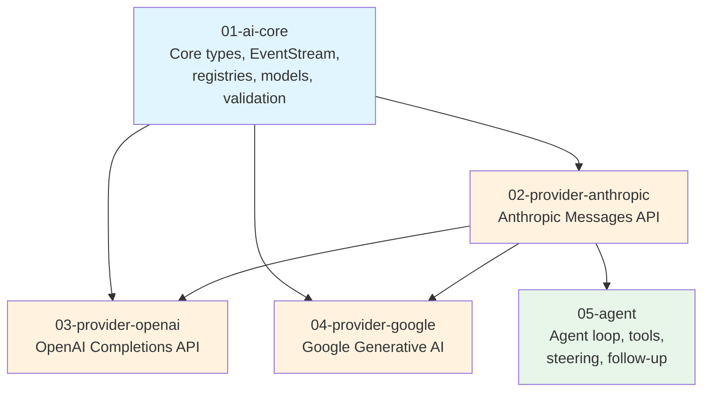

# Plan Index

## Overview

This plan index organizes the V1 implementation into sub-plans grouped by dependency order. The project has two packages (`ai` and `agent`) with clear layering — `ai` is the foundation, `agent` builds on top.

The sub-plans are sized so each represents a substantial, self-contained unit of work that can be implemented and tested independently.

## Milestone Gates

| Gate | Criteria | Between |
|------|----------|---------|
| **G1: Core types compile** | `ai` types, event stream, and registry compile. Model catalog loads. No providers yet. | Batch 1 → Batch 2 |
| **G2: First provider streams** | Anthropic provider passes integration test: stream a simple prompt, receive text events, get final AssistantMessage with usage. | Batch 2 → Batch 3 |
| **G3: Tool calling works** | At least one provider handles tool calls end-to-end: schema sent, tool call received, tool result sent back, final response received. | Batch 2 → Batch 3 |
| **G4: Agent loop works** | `agent.Agent` can run a multi-turn conversation with tools using any V1 provider. Steering and follow-up messages work. | Batch 3 → Done |

## Batch 1: Foundation

Core types, event streaming, registries, and model catalog. No provider implementations yet — these are the shared building blocks everything else depends on.

| Doc | Component | Description | Depends On | Status |
|-----|-----------|-------------|------------|--------|
| [01-ai-core](./01-ai-core.md) | `ai` core types, event stream, registries | All core types (Message, Content, Model, Usage, Events, Tool), EventStream channel wrapper, Provider and Model registries, model catalog with cost calculation, JSON Schema validation, cross-provider message transformation, shared SSE parsing utilities | — | Not started |

## Batch 2: Providers

Each provider is independent. They all depend on Batch 1's core types and can be built in parallel. However, the first provider (Anthropic) should be completed first to validate the core types and streaming architecture — the others should follow its patterns.

| Doc | Component | Description | Depends On | Status |
|-----|-----------|-------------|------------|--------|
| [02-provider-anthropic](./02-provider-anthropic.md) | Anthropic provider | Anthropic Messages API: message conversion, SSE stream parsing, thinking (adaptive + budget), tool calling, cache control, cost tracking. First provider — validates the core architecture. | 01-ai-core | Not started |
| [03-provider-openai](./03-provider-openai.md) | OpenAI provider | OpenAI Completions API: message conversion, SSE parsing, reasoning effort mapping, tool calling, compatibility settings for OpenAI-compatible endpoints (Groq, Mistral, etc.) | 01-ai-core, 02-provider-anthropic | Not started |
| [04-provider-google](./04-provider-google.md) | Google provider | Google Generative AI (Gemini): message conversion, SSE parsing, thinking, tool calling, thought signatures. | 01-ai-core, 02-provider-anthropic | Not started |

## Batch 3: Agent Framework

The agent loop and Agent struct. Depends on at least one working provider for integration testing.

| Doc | Component | Description | Depends On | Status |
|-----|-----------|-------------|------------|--------|
| [05-agent](./05-agent.md) | `agent` package | Agent struct, agent loop (tool execution, steering, follow-up), AgentMessage/AgentTool/AgentEvent types, subscription model, state management. Full unit tests with mock provider, integration test with real provider. | 01-ai-core, 02-provider-anthropic | Not started |

## Dependency Graph

Note: OpenAI and Google providers depend on Anthropic not because of code coupling, but because the Anthropic provider is the first implementation that validates the core architecture. Later providers should follow its established patterns for consistency.

## Process

1. **Draft**: Each sub-plan is written via `/plan-draft`, producing a detailed design doc and companion test harness doc.
2. **Review**: Each sub-plan goes through `/plan-review` (2 independent reviewers), then `/plan-incorporate` to fold feedback in.
3. **Implement**: After review, implementation proceeds in batch order. Within a batch, parallelizable work can be assigned to multiple agents.
4. **Validate**: Each milestone gate must pass before the next batch begins.

## Open Questions

1. **Partial JSON parsing**: Need to decide on approach for streaming tool call argument parsing before the Anthropic provider plan is written. Options: (a) port the JS `partial-json` library, (b) find a Go library, (c) defer and show raw deltas only. This affects all provider plans.

2. **Model catalog maintenance**: How to keep the Go model catalog in sync with the TS `models.generated.ts`? Options: (a) write a Go code generator that reads the same sources, (b) periodically copy and convert, (c) embed the TS-generated JSON. Affects 01-ai-core.

3. **OAuth flows**: The TS version has extensive OAuth support (Anthropic, GitHub Copilot, Google, OpenAI Codex). Is OAuth in V1 scope, or API-key-only? Recommendation: API-key-only for V1 — OAuth is primarily needed for the coding agent (V2). Affects all provider plans.
