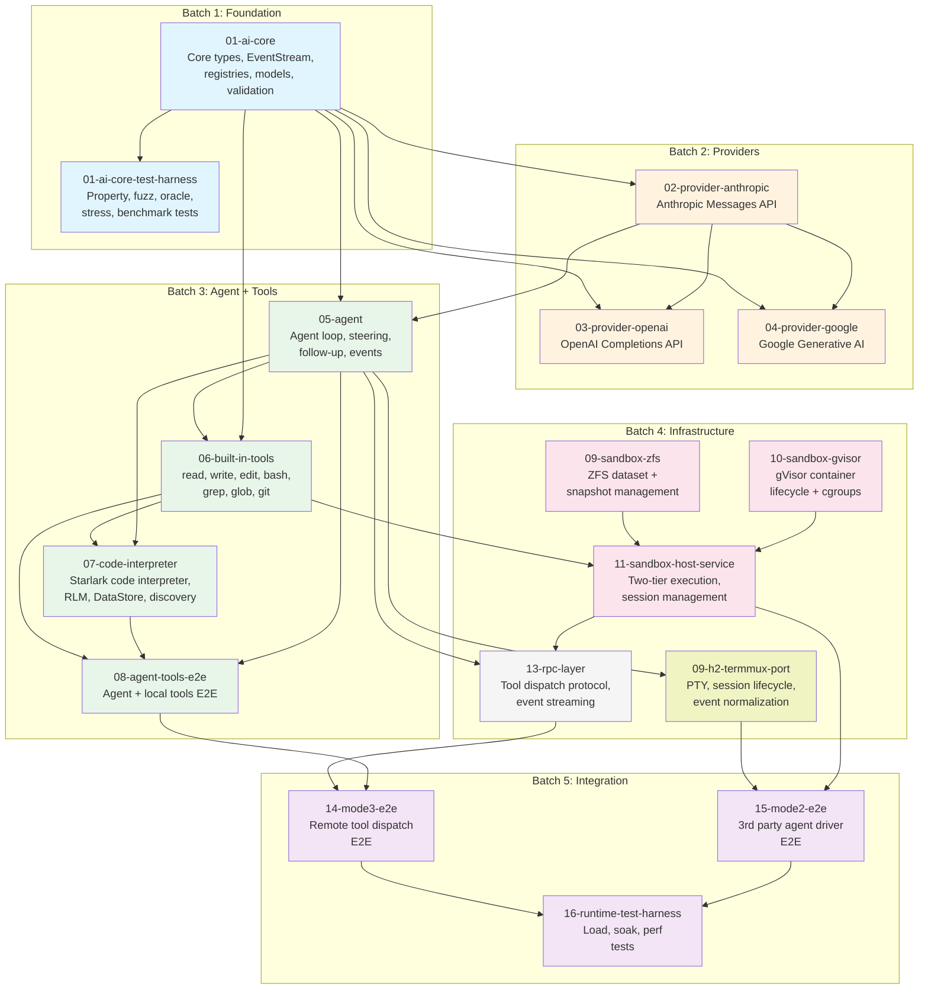

# Plan Index — h2-agent-runtime

## Overview

This plan index organizes the full h2-agent-runtime implementation into sub-plans grouped by dependency order. The runtime has seven major components spanning four batches, progressing from foundation types through the full distributed runtime.

The existing reviewed plans for AI core (01-ai-core, 01-ai-core-test-harness) are incorporated as the foundation. New plans cover built-in tools, code interpreter, agent loop, terminal mux, sandbox host, and the RPC layer.

Sub-plans are sized so each represents a substantial, self-contained unit of work that can be implemented and tested independently by one or two agents.

---

## Milestone Gates

| Gate | Criteria | Between |
|------|----------|---------|
| **G1: Core types compile** | `internal/ai` types, event stream, registries compile. Model catalog loads. No providers yet. | Batch 1 → Batch 2 |
| **G2: First provider streams** | Anthropic provider passes integration test: stream a prompt, receive text events, get final AssistantMessage with usage. | Batch 2 → Batch 3 |
| **G3: Tool calling works** | At least one provider handles tool calls end-to-end: schema sent, tool call received, tool result sent back, final response received. | Batch 2 → Batch 3 |
| **G4: Agent loop + local tools E2E** | `agent.Agent` runs a multi-turn conversation with local built-in tools using any V1 provider. Steering and follow-up work. Code interpreter meta-tool works. | Batch 3 → Batch 4 |
| **G5: Sandbox host operational** | Sandbox host service creates sessions (ZFS datasets), executes Tier 1 and Tier 2 tool calls, takes snapshots, and supports rollback. Tested on a real EC2 instance with ZFS + gVisor. | Batch 4 → Batch 5 |
| **G6: Remote tool dispatch works** | Agent loop dispatches tool calls to a remote sandbox host via RPC. Full Mode 3 E2E test passes. | Batch 4 → Batch 5 |
| **G7: Terminal mux operational** | Terminal mux can launch, attach, detach, and kill 3rd party agent driver sessions. Event normalization produces structured events for at least one agent driver. Bidirectional session log conversion works. | Batch 4 → Batch 5 |

---

## Batch 1: Foundation

Core types, event streaming, registries, and model catalog. The shared building blocks everything else depends on.

| Doc | Component | Description | Depends On | Status |
|-----|-----------|-------------|------------|--------|
| [01-ai-core](./01-ai-core.md) | `internal/ai` core | Core types (Message, Content, Model, Usage, Events, Tool), EventStream channel wrapper, Provider and Model registries, model catalog with cost calculation, JSON Schema validation, cross-provider message transformation, shared SSE parsing, ProviderError types | — | Reviewed (2 rounds) |
| [01-ai-core-test-harness](./01-ai-core-test-harness.md) | `internal/ai` test harness | Property-based tests, comparison oracle tests, fuzz testing, stress tests, benchmarks, security tests | 01-ai-core | Reviewed (2 rounds) |

## Batch 2: Providers

Each provider is independent. They all depend on Batch 1's core types. The first provider (Anthropic) validates the architecture; the others follow its patterns. A **model catalog generator** tool is also needed alongside this batch to automate fetching model metadata from provider APIs and producing the embedded JSON catalog (see Open Questions #11).

| Doc | Component | Description | Depends On | Status |
|-----|-----------|-------------|------------|--------|
| [02-provider-anthropic](./02-provider-anthropic.md) | Anthropic provider | Anthropic Messages API: message conversion, SSE stream parsing, thinking (adaptive + budget), tool calling, cache control, cost tracking. First provider — validates the core architecture. | 01-ai-core | Not started |
| [03-provider-openai](./03-provider-openai.md) | OpenAI provider | OpenAI Completions API: message conversion, SSE parsing, reasoning effort mapping, tool calling, compatibility settings for OpenAI-compatible endpoints (Groq, Mistral, etc.) | 01-ai-core, 02-provider-anthropic | Not started |
| [04-provider-google](./04-provider-google.md) | Google provider | Google Generative AI (Gemini): message conversion, SSE parsing, thinking, tool calling, thought signatures. | 01-ai-core, 02-provider-anthropic | Not started |

## Batch 3: Agent Loop + Tools

The agent framework, built-in tools, and code interpreter. These can be partially parallelized — the agent loop and built-in tools share the `AgentTool` interface but can be implemented concurrently once the interface is defined. Code interpreter depends on both.

| Doc | Component | Description | Depends On | Status |
|-----|-----------|-------------|------------|--------|
| [05-agent](./05-agent.md) | `internal/agent` | Agent struct, agent loop (LLM → tools → LLM cycle), AgentMessage/AgentTool/AgentEvent types, subscription model, state management, steering, follow-up, terminal tools. Full unit tests with mock provider, integration test with real provider. | 01-ai-core, 02-provider-anthropic | Not started |
| [06-built-in-tools](./06-built-in-tools.md) | `internal/tools` | Built-in tool implementations: read, write, edit, bash, grep, glob, git ops. ToolBackend interface (LocalBackend vs SandboxBackend) for dispatch. LocalTools factory. Tool-level unit tests. | 01-ai-core, 05-agent | Not started |
| [07-code-interpreter](./07-code-interpreter.md) | `internal/tools/codeinterp` | Starlark code interpreter meta-tool: sandboxed interpreter, progressive tool discovery (discover/describe/invoke), recursive LLM calls (llm_call/llm_batch), pluggable DataStore (memory/fs/blob/sql), two-tier execution (lightweight/full), configurable limits. | 01-ai-core, 05-agent, 06-built-in-tools | Not started |
| [08-agent-tools-e2e](./08-agent-tools-e2e.md) | Agent + tools E2E | End-to-end tests: agent loop with local built-in tools, multi-turn conversations with file operations and bash, code interpreter workflows. Tests go in `e2etests/`. | 05-agent, 06-built-in-tools, 07-code-interpreter | Not started |

## Batch 4: Infrastructure Services

The sandbox host, terminal mux, and RPC layer. These are the components that enable Modes 2-4. They can be developed in parallel since they are independent components connected by interfaces.

| Doc | Component | Description | Depends On | Status |
|-----|-----------|-------------|------------|--------|
| [09-sandbox-zfs](./09-sandbox-zfs.md) | `internal/sandbox/zfs` | ZFS management: dataset create/clone/destroy, snapshot create/rollback/list/destroy, mountpoint management. Requires Linux + ZFS for integration tests. | — | Not started |
| [10-sandbox-gvisor](./10-sandbox-gvisor.md) | `internal/sandbox/gvisor` | gVisor container management: container create/run/destroy per tool call, cgroup resource limits (CPU, memory, timeout), ZFS bind-mount configuration. Requires Linux + gVisor for integration tests. | — | Not started |
| [11-sandbox-host-service](./11-sandbox-host-service.md) | `internal/sandbox` | Sandbox host service: session management, two-tier tool routing, per-turn snapshots (per-tool-call opt-in), pause/resume, rollback. Integrates ZFS + gVisor managers. `cmd/sandbox-host` binary. | 09-sandbox-zfs, 10-sandbox-gvisor, 06-built-in-tools | Not started |
| [09-h2-termmux-port](./09-h2-termmux-port.md) | `internal/termmux` | Port from h2: terminal multiplexer (PTY, session lifecycle, multi-client attach/detach, panic recovery, hung child detection), three-source event handler (OTEL server, hooks, session log JSONL), agent state machine (Active/Idle/Exited with sub-states), agent drivers for Claude Code and Codex, bidirectional session log conversion. See detailed plan for h2 source mapping. | 05-agent | Draft |
| [13-rpc-layer](./13-rpc-layer.md) | `internal/rpc` | RPC protocol implementation: sandbox client/server (session CRUD, tool dispatch, snapshot management), event streaming protocol, protocol choice (ConnectRPC recommended). SandboxTools factory for remote tool dispatch. | 11-sandbox-host-service, 05-agent | Not started |

Disambiguation note: `09-sandbox-zfs` and `09-h2-termmux-port` intentionally share the `09` prefix. Use full doc IDs (not just number) in cross-plan references to avoid ambiguity.

## Batch 5: Integration & Polish

Full system integration tests, Mode 2/3/4 E2E tests, and any cross-cutting polish.

| Doc | Component | Description | Depends On | Status |
|-----|-----------|-------------|------------|--------|
| [14-mode3-e2e](./14-mode3-e2e.md) | Mode 3 E2E | End-to-end test: agent loop dispatching tool calls to remote sandbox host via RPC. Full lifecycle: create session, execute tools, take snapshots, rollback, pause/resume, destroy. | 13-rpc-layer, 08-agent-tools-e2e | Not started |
| [15-mode2-e2e](./15-mode2-e2e.md) | Mode 2 E2E | End-to-end test: orchestrator launches 3rd party agent driver in sandbox via terminal mux. Credential injection, event normalization, session lifecycle. | 09-h2-termmux-port, 11-sandbox-host-service | Not started |
| [16-runtime-test-harness](./16-runtime-test-harness.md) | Runtime test harness | Cross-cutting test harness: load testing (many concurrent agents), soak testing (long-running sessions), snapshot space growth analysis, container boot time benchmarks, RPC latency profiling. | 14-mode3-e2e, 15-mode2-e2e | Not started |

---

## Dependency Graph

### Parallelization Opportunities

Within each batch, many plans can be worked on in parallel by different agents:

**Batch 2:** All three providers can be parallelized after Anthropic establishes the pattern (OpenAI and Google follow its conventions).

**Batch 3:** Agent loop (05) and built-in tools (06) share the `AgentTool` interface definition but can be implemented concurrently once that interface is agreed upon. Code interpreter (07) depends on both.

**Batch 4:** All four components are independent:
- ZFS manager (09) and gVisor manager (10) are completely independent
- Terminal mux (09-h2-termmux-port) is independent of sandbox components
- RPC layer (13) depends on sandbox host service (11) which depends on 09+10
- Recommended parallel tracks: {09, 10} → 11 → 13, and separately 09-h2-termmux-port

**Batch 5:** Mode 3 E2E (14) and Mode 2 E2E (15) are independent. Runtime test harness (16) depends on both.

---

## Process

1. **Draft**: Each sub-plan is written as a detailed design doc with companion test harness doc (where applicable), following the CLAUDE.md format (mermaid diagrams, testing section, URP/Alien Artifacts/Extreme Optimization sections).
2. **Review**: Each sub-plan goes through 2 independent review rounds. Reviewers write `-review.md` docs. Feedback is incorporated into the main plan doc.
3. **Implement**: After review, implementation proceeds in batch order. Within a batch, parallelizable work is assigned to multiple agents.
4. **Validate**: Each milestone gate must pass before the next batch begins.

---

## Relationship to Existing Plans

The following existing plans are **incorporated** into this index:

| Existing Doc | Disposition | New Location in Index |
|-------------|-------------|----------------------|
| `00-architecture.md` (old) | **Replaced** by this new architecture doc covering full runtime scope | Superseded |
| `00-plan-index.md` (old) | **Replaced** by this new plan index covering full runtime scope | Superseded |
| `01-ai-core.md` | **Retained** — solid reviewed design for the AI layer foundation | Batch 1 |
| `01-ai-core-test-harness.md` | **Retained** — solid reviewed test harness for AI core | Batch 1 |

The old architecture and plan index covered only the AI/agent layer (the "V1" scope). This new index covers the full runtime: AI layer, agent loop, tools, code interpreter, terminal mux, sandbox host, and RPC layer.

---

## Open Questions

### From Architecture Doc

1. **OQ1: RPC Protocol** — ConnectRPC recommended, final decision in plan 13.
2. **OQ2: 3rd Party Agent Driver Snapshot Granularity** — decision in plan 12/15.
3. **OQ3: Cloud Provider Portability** — future work, not in initial scope.
4. **~~OQ4: Partial JSON Parsing~~** — Resolved: use `karminski/streaming-json-go` for streaming partial JSON completion during SSE provider responses. Fork and fix gaps if needed.
5. **OQ5: Model Catalog Maintenance** — embed JSON approach, confirmed in plan 01.
6. **OQ6: OAuth** — out of scope. API-key-only for runtime.

### Implementation-Level

7. **Grep implementation**: Embed ripgrep binary vs pure Go implementation (e.g., wrapping `regexp` with file walking). Ripgrep is faster but adds a binary dependency. Decision in plan 06.
8. **Edit tool algorithm**: Exact string match (like Claude Code's approach) vs diff-based. Exact string match is simpler and more predictable for LLMs. Decision in plan 06.
9. **~~Starlark version/library~~**: Resolved: `go.starlark.net` confirmed as the Starlark implementation. Sandboxing validated in plan 07 (code interpreter).
10. **Container pre-warming**: Whether to pre-warm gVisor containers (keep a warm pool) vs cold-start every time. Cold-start is simpler and sufficient at ~100ms. Decision in plan 10.
11. **Model catalog generator**: Automated tool that fetches model metadata from provider APIs (Anthropic, OpenAI, Google) and generates the embedded JSON catalog. Needs its own small plan — could be a sub-task of Batch 2 provider work or a standalone utility.
