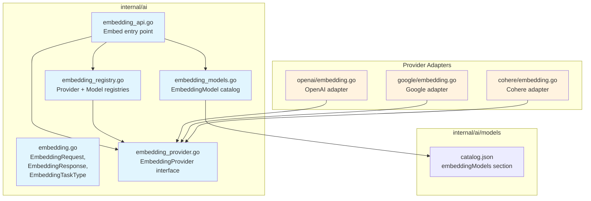
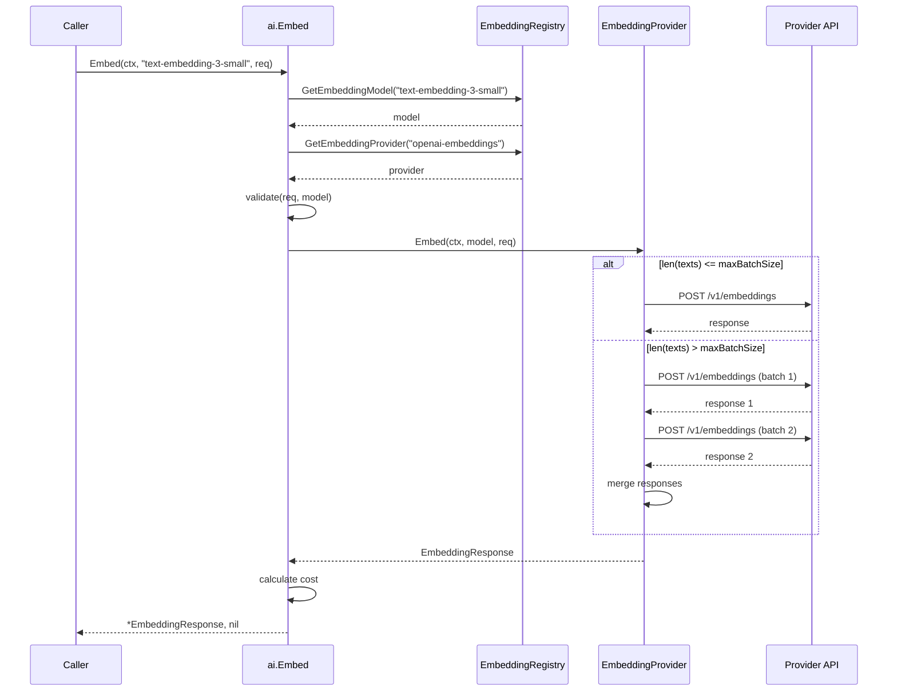

# 01-ai-core Addendum 01: Embedding API Support

**Status:** Draft
**Parent plan:** [01-ai-core](./01-ai-core.md)
**Depends on:** 01-ai-core (core types, Provider interface, registry)
**Depended on by:** 02-provider-anthropic (no embedding), 03-provider-openai, 04-provider-google, future provider plans
**Implements:** Embedding types, EmbeddingProvider interface, embedding registry, embedding model catalog entries

---

## 1. Overview

This addendum defines the types and interfaces for embedding API support across providers. Embeddings are a fundamentally different operation from chat completions: they are non-streaming, have no tool calls or thinking, are batch-oriented, and produce fixed-dimensional float vectors rather than text. This warrants a separate interface from `Provider` rather than extending it.

**Key insight:** Anthropic does **not** offer an embedding API. Embedding support is relevant for OpenAI, Google/Gemini, Cohere, Voyage AI, and OpenAI-compatible endpoints.

**Scope:**
- `EmbeddingRequest` and `EmbeddingResponse` types
- `EmbeddingProvider` interface (separate from `Provider`)
- Embedding provider registry (parallel to the existing chat provider registry)
- Embedding model catalog entries in `catalog.json`
- Cross-provider normalization for task types, dimensions, and encoding formats

**Out of scope:**
- Provider implementations (covered in plans 02-04 and future provider plans)
- Async batch embedding jobs (provider-specific, not in core)
- Multimodal embeddings (future addendum — Cohere embed-v4 and Voyage support images)

---

## 2. Why a Separate Interface

Chat completions and embeddings are structurally different operations:

| Property | Chat Completion | Embedding |
|----------|----------------|-----------|
| Streaming | Yes (SSE events) | No (single response) |
| Tool calls | Yes | No |
| Thinking/reasoning | Yes | No |
| Input | Conversation (messages + system prompt) | Text strings (batch) |
| Output | Text + tool calls | Float vectors |
| Batching | Single request | Multiple texts per request |
| Task types | N/A | Query vs document vs classification |
| Dimension control | N/A | Configurable output dimensions |

Forcing embeddings into the `Provider` interface would bloat it with unused methods and require callers to downcast. Go's interface composition idiom handles this cleanly: providers that support both can implement both interfaces.

```go
// A provider that supports both chat and embeddings:
type openaiProvider struct { ... }

var _ ai.Provider = (*openaiProvider)(nil)
var _ ai.EmbeddingProvider = (*openaiProvider)(nil)
```

---

## 3. Provider API Comparison

Embedding APIs are **significantly less standardized** than chat completion APIs. The OpenAI format is a de facto standard for chat, but for embeddings, major providers diverge substantially.

### 3.1 API Format Comparison

| Feature | OpenAI | Google/Gemini | Cohere | Voyage AI |
|---------|--------|---------------|--------|-----------|
| Input field | `input` (string or []string) | `content.parts[].text` | `texts` ([]string) | `input` ([]string) |
| Task/input type | N/A | `taskType` (8 types) | `input_type` (4 types) | `input_type` (3 types) |
| Dimension param | `dimensions` | `outputDimensionality` | `output_dimension` | `output_dimension` |
| Quantization | `encoding_format` (float, base64) | N/A | `embedding_types` (float, int8, uint8, binary, ubinary) | `output_dtype` (float, int8, uint8, binary, ubinary) |
| Response embeddings | `data[].embedding` | `embedding.values` | `embeddings.<type>[][]` | `data[].embedding` |
| Max batch size | 2048 inputs | Separate batch endpoint | 96 texts | 1000 texts |
| Max input tokens | 8192 per input | Model-dependent | Model-dependent | Up to 32K |

### 3.2 Provider-Specific Models

**OpenAI:**
- `text-embedding-3-small` — 1536 default dims, configurable, $0.02/MTok
- `text-embedding-3-large` — 3072 default dims, configurable, $0.13/MTok
- `text-embedding-ada-002` — 1536 fixed dims, legacy

**Google/Gemini:**
- `gemini-embedding-001` — 3072 default dims (configurable 128-3072)
- `text-embedding-004` — deprecated January 2026

**Cohere:**
- `embed-v4.0` — 1536 default dims, multimodal, configurable (256/512/1024/1536)
- `embed-english-v3.0` — 1024 fixed dims
- `embed-multilingual-v3.0` — 1024 fixed dims

**Voyage AI:**
- `voyage-4-large` / `voyage-4` / `voyage-4-lite` — general purpose
- `voyage-code-3` — code-optimized
- `voyage-finance-2` / `voyage-law-2` — domain-specific
- OpenAI-compatible response format

### 3.3 OpenAI-Compatible Providers

Voyage AI and many serving frameworks (vLLM, Ollama, etc.) implement the OpenAI embedding format. Our OpenAI provider should handle these through the existing `Compat` mechanism on the Model struct, with `BaseURL` override. No separate provider needed for Voyage — configure it as an OpenAI-compatible endpoint.

---

## 4. Types

### 4.1 Embedding Task Type

Different providers use different terminology, but the concepts map cleanly. We normalize to a common set.

```go
// embedding.go (in internal/ai)

// EmbeddingTaskType hints the provider how the embedding will be used.
// Not all providers support all task types — providers map to their
// closest equivalent or ignore if unsupported.
type EmbeddingTaskType string

const (
    // EmbeddingTaskQuery indicates text is a search query.
    EmbeddingTaskQuery EmbeddingTaskType = "query"

    // EmbeddingTaskDocument indicates text is a document to be indexed.
    EmbeddingTaskDocument EmbeddingTaskType = "document"

    // EmbeddingTaskClassification indicates text for classification.
    EmbeddingTaskClassification EmbeddingTaskType = "classification"

    // EmbeddingTaskClustering indicates text for clustering.
    EmbeddingTaskClustering EmbeddingTaskType = "clustering"

    // EmbeddingTaskSimilarity indicates text for similarity comparison.
    EmbeddingTaskSimilarity EmbeddingTaskType = "similarity"

    // EmbeddingTaskUnspecified is the default — no task type hint.
    EmbeddingTaskUnspecified EmbeddingTaskType = ""
)
```

**Provider mapping:**

| Our Type | OpenAI | Google | Cohere | Voyage |
|----------|--------|--------|--------|--------|
| `query` | (ignored) | `RETRIEVAL_QUERY` | `search_query` | `query` |
| `document` | (ignored) | `RETRIEVAL_DOCUMENT` | `search_document` | `document` |
| `classification` | (ignored) | `CLASSIFICATION` | `classification` | (ignored) |
| `clustering` | (ignored) | `CLUSTERING` | `clustering` | (ignored) |
| `similarity` | (ignored) | `SEMANTIC_SIMILARITY` | (ignored) | (ignored) |
| `""` | (ignored) | (omitted) | (error: required for v3+) | `None` |

Note: Cohere v3+ models **require** `input_type`. The provider adapter must map `EmbeddingTaskUnspecified` to a sensible default (`search_document`) rather than omitting it.

### 4.2 Embedding Encoding Format

```go
// EmbeddingEncoding specifies the output format for embedding vectors.
type EmbeddingEncoding string

const (
    // EmbeddingEncodingFloat returns float32 vectors (default for all providers).
    EmbeddingEncodingFloat EmbeddingEncoding = "float"

    // EmbeddingEncodingBase64 returns base64-encoded binary (OpenAI only).
    EmbeddingEncodingBase64 EmbeddingEncoding = "base64"

    // EmbeddingEncodingInt8 returns int8-quantized vectors (Cohere, Voyage).
    EmbeddingEncodingInt8 EmbeddingEncoding = "int8"

    // EmbeddingEncodingBinary returns binary-quantized vectors (Cohere, Voyage).
    EmbeddingEncodingBinary EmbeddingEncoding = "binary"
)
```

### 4.3 Request and Response

```go
// EmbeddingRequest is the provider-agnostic embedding request.
type EmbeddingRequest struct {
    // Texts is the batch of input strings to embed. Required, non-empty.
    Texts []string

    // TaskType hints the provider how embeddings will be used.
    // Providers that don't support task types silently ignore this.
    TaskType EmbeddingTaskType

    // Dimensions overrides the default output dimensionality.
    // Zero means use the model's default. Not all models support this.
    Dimensions int

    // Encoding specifies the output format. Default is float.
    Encoding EmbeddingEncoding
}

// EmbeddingResponse is the provider-agnostic embedding response.
type EmbeddingResponse struct {
    // Embeddings contains one embedding per input text, in order.
    Embeddings []Embedding

    // Model is the model ID that produced the embeddings.
    Model string

    // Usage reports token consumption.
    Usage EmbeddingUsage
}

// Embedding is a single embedding vector with its input index.
type Embedding struct {
    // Index is the position in the input batch (0-based).
    Index int

    // Values is the float32 embedding vector.
    // For non-float encodings, the provider adapter converts to float32.
    Values []float32

    // Raw holds the original encoding if non-float was requested.
    // nil for float encoding. Callers that need quantized vectors
    // can type-assert this ([]int8, []byte, etc.).
    Raw any
}

// EmbeddingUsage reports token consumption for an embedding request.
type EmbeddingUsage struct {
    // Tokens is the total number of tokens across all inputs.
    Tokens int

    // Cost is the total monetary cost.
    Cost float64
}
```

### 4.4 Embedding Model Metadata

The existing `Model` struct needs extension to represent embedding models in the catalog. Rather than modifying the chat-oriented `Model` struct, we add an `EmbeddingModel` type:

```go
// EmbeddingModel describes an embedding model in the catalog.
type EmbeddingModel struct {
    ID              string            `json:"id"`
    Name            string            `json:"name"`
    API             string            `json:"api"`       // e.g., "openai-embeddings", "google-embeddings"
    Provider        string            `json:"provider"`  // e.g., "openai", "google", "cohere"
    BaseURL         string            `json:"baseUrl"`
    MaxInputTokens  int               `json:"maxInputTokens"`
    DefaultDims     int               `json:"defaultDims"`
    MaxDims         int               `json:"maxDims,omitempty"`     // 0 = fixed at DefaultDims
    MinDims         int               `json:"minDims,omitempty"`     // 0 = fixed at DefaultDims
    MaxBatchSize    int               `json:"maxBatchSize"`          // max texts per request
    SupportsDimCtrl bool              `json:"supportsDimCtrl"`       // can caller set dimensions?
    SupportsTaskType bool             `json:"supportsTaskType"`      // does task type matter?
    Cost            EmbeddingCost     `json:"cost"`
    Headers         map[string]string `json:"headers,omitempty"`
}

type EmbeddingCost struct {
    // PerMTok is the cost per million tokens.
    PerMTok float64 `json:"perMTok"`
}
```

Catalog entries go in a new section of `models/catalog.json` under an `"embeddingModels"` key, separate from the chat models array.

---

## 5. Interface

### 5.1 EmbeddingProvider

```go
// embedding_provider.go (in internal/ai)

// EmbeddingProvider generates embedding vectors from text.
// This is intentionally separate from Provider (chat completions)
// because embeddings are a fundamentally different operation:
// non-streaming, batch-oriented, no tool calls.
type EmbeddingProvider interface {
    // API returns the API identifier (e.g., "openai-embeddings").
    API() string

    // Embed generates embeddings for the given texts.
    // The returned Embeddings slice has the same length as req.Texts,
    // with each Embedding.Index matching its position.
    //
    // Providers handle batching internally if len(req.Texts) exceeds
    // the model's max batch size — they split into multiple API calls
    // and merge results transparently.
    Embed(ctx context.Context, model EmbeddingModel, req EmbeddingRequest) (*EmbeddingResponse, error)
}
```

### 5.2 Registry

Parallel to the existing provider registry, using the same pattern:

```go
// embedding_registry.go (in internal/ai)

var (
    embeddingProviderMu       sync.RWMutex
    embeddingProviderRegistry = make(map[string]registeredEmbeddingProvider)
)

type registeredEmbeddingProvider struct {
    provider EmbeddingProvider
    sourceID string
}

// RegisterEmbeddingProvider registers an embedding provider for its API identifier.
func RegisterEmbeddingProvider(p EmbeddingProvider, sourceID string) {
    embeddingProviderMu.Lock()
    defer embeddingProviderMu.Unlock()
    embeddingProviderRegistry[p.API()] = registeredEmbeddingProvider{
        provider: p,
        sourceID: sourceID,
    }
}

// GetEmbeddingProvider retrieves a registered embedding provider by API.
func GetEmbeddingProvider(api string) (EmbeddingProvider, bool) {
    embeddingProviderMu.RLock()
    defer embeddingProviderMu.RUnlock()
    rp, ok := embeddingProviderRegistry[api]
    return rp.provider, ok
}

// UnregisterEmbeddingProviders removes all providers registered with the given sourceID.
func UnregisterEmbeddingProviders(sourceID string) {
    embeddingProviderMu.Lock()
    defer embeddingProviderMu.Unlock()
    for api, rp := range embeddingProviderRegistry {
        if rp.sourceID == sourceID {
            delete(embeddingProviderRegistry, api)
        }
    }
}
```

### 5.3 Embedding Model Registry

Same pattern as the chat model registry:

```go
// embedding_models.go (in internal/ai)

var (
    embeddingModelMu       sync.RWMutex
    embeddingModelRegistry = make(map[string]EmbeddingModel)
)

// RegisterEmbeddingModel registers an embedding model.
func RegisterEmbeddingModel(m EmbeddingModel) {
    embeddingModelMu.Lock()
    defer embeddingModelMu.Unlock()
    embeddingModelRegistry[m.ID] = m
}

// GetEmbeddingModel retrieves a registered embedding model by ID.
func GetEmbeddingModel(id string) (EmbeddingModel, bool) {
    embeddingModelMu.RLock()
    defer embeddingModelMu.RUnlock()
    m, ok := embeddingModelRegistry[id]
    return m, ok
}

// ListEmbeddingModels returns all registered embedding models.
func ListEmbeddingModels() []EmbeddingModel {
    embeddingModelMu.RLock()
    defer embeddingModelMu.RUnlock()
    models := make([]EmbeddingModel, 0, len(embeddingModelRegistry))
    for _, m := range embeddingModelRegistry {
        models = append(models, m)
    }
    return models
}
```

### 5.4 Top-level Entry Point

```go
// embedding_api.go (in internal/ai)

// Embed is the top-level entry point for generating embeddings.
// It looks up the model and provider, validates the request, and delegates.
func Embed(ctx context.Context, modelID string, req EmbeddingRequest) (*EmbeddingResponse, error) {
    model, ok := GetEmbeddingModel(modelID)
    if !ok {
        return nil, fmt.Errorf("unknown embedding model: %s", modelID)
    }

    provider, ok := GetEmbeddingProvider(model.API)
    if !ok {
        return nil, fmt.Errorf("no embedding provider for API: %s", model.API)
    }

    if len(req.Texts) == 0 {
        return nil, fmt.Errorf("embedding request requires at least one text")
    }

    if req.Dimensions > 0 && !model.SupportsDimCtrl {
        return nil, fmt.Errorf("model %s does not support dimension control", modelID)
    }

    if req.Dimensions > 0 && model.MaxDims > 0 && req.Dimensions > model.MaxDims {
        return nil, fmt.Errorf("requested dimensions %d exceeds max %d for model %s",
            req.Dimensions, model.MaxDims, modelID)
    }

    resp, err := provider.Embed(ctx, model, req)
    if err != nil {
        return nil, fmt.Errorf("embed %s: %w", modelID, err)
    }

    // Calculate cost
    if resp.Usage.Cost == 0 && model.Cost.PerMTok > 0 {
        resp.Usage.Cost = float64(resp.Usage.Tokens) * model.Cost.PerMTok / 1_000_000
    }

    return resp, nil
}
```

---

## 6. Architecture

### 6.1 Component Diagram



### 6.2 Sequence Diagram: Embed Call



### 6.3 Import Flow

```
internal/ai/models       → embedded JSON (add embeddingModels section)
internal/ai              → internal/ai/models (load embedding catalog at init)
internal/ai/provider/X   → internal/ai (implement EmbeddingProvider)
```

No new packages needed. Embedding types and interfaces live in `internal/ai` alongside the existing chat types. This keeps the import graph simple and allows providers to implement both interfaces in the same package.

---

## 7. Catalog Extension

The embedded `models/catalog.json` gains a new top-level key:

```json
{
  "models": [ ... ],
  "embeddingModels": [
    {
      "id": "text-embedding-3-small",
      "name": "Text Embedding 3 Small",
      "api": "openai-embeddings",
      "provider": "openai",
      "baseUrl": "https://api.openai.com/v1",
      "maxInputTokens": 8192,
      "defaultDims": 1536,
      "maxDims": 1536,
      "minDims": 256,
      "maxBatchSize": 2048,
      "supportsDimCtrl": true,
      "supportsTaskType": false,
      "cost": { "perMTok": 0.02 }
    },
    {
      "id": "text-embedding-3-large",
      "name": "Text Embedding 3 Large",
      "api": "openai-embeddings",
      "provider": "openai",
      "baseUrl": "https://api.openai.com/v1",
      "maxInputTokens": 8192,
      "defaultDims": 3072,
      "maxDims": 3072,
      "minDims": 256,
      "maxBatchSize": 2048,
      "supportsDimCtrl": true,
      "supportsTaskType": false,
      "cost": { "perMTok": 0.13 }
    },
    {
      "id": "gemini-embedding-001",
      "name": "Gemini Embedding 001",
      "api": "google-embeddings",
      "provider": "google",
      "baseUrl": "https://generativelanguage.googleapis.com/v1beta",
      "maxInputTokens": 2048,
      "defaultDims": 3072,
      "maxDims": 3072,
      "minDims": 128,
      "maxBatchSize": 100,
      "supportsDimCtrl": true,
      "supportsTaskType": true,
      "cost": { "perMTok": 0.00 }
    },
    {
      "id": "embed-v4.0",
      "name": "Cohere Embed v4",
      "api": "cohere-embeddings",
      "provider": "cohere",
      "baseUrl": "https://api.cohere.com/v2",
      "maxInputTokens": 512,
      "defaultDims": 1536,
      "maxDims": 1536,
      "minDims": 256,
      "maxBatchSize": 96,
      "supportsDimCtrl": true,
      "supportsTaskType": true,
      "cost": { "perMTok": 0.12 }
    }
  ]
}
```

---

## 8. Provider Adapter Design

Each provider adapter must handle the translation between our normalized types and the provider's wire format. The key differences:

### 8.1 OpenAI Adapter

Simplest adapter — our types are closest to OpenAI's format.

```go
// Provider: "openai-embeddings"
// Endpoint: POST {baseUrl}/embeddings
// Request mapping:
//   req.Texts       → input ([]string)
//   req.Dimensions   → dimensions (if non-zero)
//   req.Encoding     → encoding_format ("float" or "base64")
//   req.TaskType     → ignored (OpenAI doesn't support task types)
// Response mapping:
//   data[i].embedding → Embedding.Values
//   data[i].index     → Embedding.Index
//   usage.total_tokens → Usage.Tokens
```

OpenAI-compatible endpoints (Voyage, vLLM, Ollama) use this same adapter with `BaseURL` override. Voyage adds `input_type` — the adapter can include it when the model has `supportsTaskType: true`.

### 8.2 Google/Gemini Adapter

Most divergent format — requires significant translation.

```go
// Provider: "google-embeddings"
// Endpoint: POST {baseUrl}/models/{model}:embedContent (single)
//           POST {baseUrl}/models/{model}:batchEmbedContents (batch)
// Request mapping:
//   req.Texts[i]     → requests[i].content.parts[0].text
//   req.TaskType     → requests[i].taskType (mapped to Google's 8 enum values)
//   req.Dimensions   → requests[i].outputDimensionality
//   req.Encoding     → ignored (Google only returns float)
// Response mapping:
//   embeddings[i].values → Embedding.Values
//   (no usage reported by Google — estimate from input text)
```

Google's `batchEmbedContents` has reliability issues above ~500 texts. The adapter should chunk conservatively (100 per batch call).

### 8.3 Cohere Adapter

Unique response structure with type-keyed embeddings.

```go
// Provider: "cohere-embeddings"
// Endpoint: POST {baseUrl}/embed
// Request mapping:
//   req.Texts         → texts
//   req.TaskType       → input_type (REQUIRED for v3+, default "search_document")
//   req.Dimensions     → output_dimension (embed-v4 only)
//   req.Encoding       → embedding_types (["float"] or ["int8"] etc.)
// Response mapping:
//   embeddings.float[i]  → Embedding.Values (if float requested)
//   embeddings.int8[i]   → Embedding.Raw (if int8 requested)
//   meta.billed_units.input_tokens → Usage.Tokens
```

### 8.4 Task Type Mapping Detail

```go
// taskTypeMapping maps our normalized types to provider-specific values.
var googleTaskTypes = map[EmbeddingTaskType]string{
    EmbeddingTaskQuery:          "RETRIEVAL_QUERY",
    EmbeddingTaskDocument:       "RETRIEVAL_DOCUMENT",
    EmbeddingTaskClassification: "CLASSIFICATION",
    EmbeddingTaskClustering:     "CLUSTERING",
    EmbeddingTaskSimilarity:     "SEMANTIC_SIMILARITY",
    EmbeddingTaskUnspecified:    "", // omit from request
}

var cohereInputTypes = map[EmbeddingTaskType]string{
    EmbeddingTaskQuery:          "search_query",
    EmbeddingTaskDocument:       "search_document",
    EmbeddingTaskClassification: "classification",
    EmbeddingTaskClustering:     "clustering",
    EmbeddingTaskSimilarity:     "search_document", // closest match
    EmbeddingTaskUnspecified:    "search_document",  // required, default
}

var voyageInputTypes = map[EmbeddingTaskType]string{
    EmbeddingTaskQuery:    "query",
    EmbeddingTaskDocument: "document",
    // All others: omitted (None)
}
```

---

## 9. Public Re-export Layer

The public `ai` package re-exports embedding types alongside the existing chat types:

```go
// ai/embedding.go (public package)

package ai

import "h2-agent-runtime/internal/ai"

type (
    EmbeddingRequest   = ai.EmbeddingRequest
    EmbeddingResponse  = ai.EmbeddingResponse
    Embedding          = ai.Embedding
    EmbeddingUsage     = ai.EmbeddingUsage
    EmbeddingTaskType  = ai.EmbeddingTaskType
    EmbeddingEncoding  = ai.EmbeddingEncoding
    EmbeddingProvider  = ai.EmbeddingProvider
    EmbeddingModel     = ai.EmbeddingModel
)

const (
    EmbeddingTaskQuery          = ai.EmbeddingTaskQuery
    EmbeddingTaskDocument       = ai.EmbeddingTaskDocument
    EmbeddingTaskClassification = ai.EmbeddingTaskClassification
    EmbeddingTaskClustering     = ai.EmbeddingTaskClustering
    EmbeddingTaskSimilarity     = ai.EmbeddingTaskSimilarity
    EmbeddingTaskUnspecified    = ai.EmbeddingTaskUnspecified
)

var (
    Embed                       = ai.Embed
    RegisterEmbeddingProvider   = ai.RegisterEmbeddingProvider
    GetEmbeddingProvider        = ai.GetEmbeddingProvider
    RegisterEmbeddingModel      = ai.RegisterEmbeddingModel
    GetEmbeddingModel           = ai.GetEmbeddingModel
    ListEmbeddingModels         = ai.ListEmbeddingModels
)
```

---

## 10. Testing

### 10.1 Unit Tests

In `internal/ai/`:

- **Embedding type construction and validation** — zero-value handling, dimension bounds
- **Registry thread safety** — concurrent Register/Get/Unregister for embedding providers and models
- **Embed() validation** — unknown model, unknown provider, empty texts, dimension exceeds max, unsupported dim ctrl
- **Cost calculation** — verify cost computed from usage.Tokens and model.Cost.PerMTok
- **Task type mapping tables** — verify all normalized types map correctly for each provider

### 10.2 Provider Integration Tests (in provider plans)

Each provider plan (02-04) should add:
- Real API call smoke test (behind `go test -tags=integration`)
- Response parsing for actual API responses
- Batch splitting at boundary (maxBatchSize, maxBatchSize+1)
- Dimension control round-trip (request specific dims, verify response has them)
- Task type propagation (where supported)

### 10.3 Property-Based Tests

- **Batch splitting invariant:** For any input of N texts and max batch size B, the provider makes `ceil(N/B)` API calls and returns exactly N embeddings with correct indices.
- **Index preservation:** Response embeddings are always in input order regardless of provider batching.
- **Dimension bound:** If `Dimensions` is set and model supports it, all returned vectors have exactly that length.
- **Cost monotonicity:** Cost scales linearly with token count for the same model.

---

## 11. URP (Unreasonably Robust Programming)

### 11.1 Automatic Batch Splitting with Progress

When embedding large document sets (thousands of texts), the provider adapter should:
1. Split into batches respecting `MaxBatchSize`
2. Execute batches with configurable concurrency (default: 3 concurrent)
3. Merge results maintaining original ordering
4. Report progress via a callback on `EmbeddingRequest` (optional `OnProgress func(completed, total int)`)
5. On partial failure, return successfully embedded results plus a wrapped error listing failed batch indices

### 11.2 Embedding Vector Validation

After receiving embeddings from any provider, validate:
- Vector length matches expected dimensions
- No NaN or Inf values in float vectors
- Index values are within bounds [0, len(texts))
- No duplicate indices

### 11.3 Rate Limit Aware Batching

Providers have different rate limits. The adapter should accept a `*rate.Limiter` (from `golang.org/x/time/rate`) and use it to throttle batch requests. This prevents `429 Too Many Requests` errors during large embedding jobs without requiring caller-side rate limiting.

---

## 12. Alien Artifacts

### 12.1 Matryoshka Representation Learning (MRL)

Modern embedding models (OpenAI text-embedding-3, Cohere embed-v4, Voyage) are trained with Matryoshka Representation Learning, where the first K dimensions of an N-dimensional embedding still form a meaningful K-dimensional embedding. This is why dimension reduction via the `dimensions` parameter works without re-training.

**Design implication:** Our `EmbeddingModel.MinDims` field captures the minimum useful dimensionality. Callers can use this for storage-quality tradeoffs — e.g., use 256 dims for coarse candidate retrieval and full dims for re-ranking.

### 12.2 Quantization-Aware Retrieval

Cohere and Voyage support int8/binary quantization natively. Binary embeddings are 32x smaller than float32 and can use Hamming distance (XOR + popcount) for similarity instead of cosine distance. Our `Embedding.Raw` field preserves quantized representations for callers that can exploit hardware-accelerated Hamming distance (e.g., via SIMD popcount instructions).

---

## 13. Extreme Optimization

### 13.1 SIMD Cosine Similarity

For callers doing embedding similarity locally (e.g., in-process RAG), we should provide optimized similarity functions:

```go
// internal/ai/embedsim/ (future, not part of this addendum's scope)

// CosineSimilarity computes cosine similarity between two float32 vectors.
// Uses SIMD (ARM64 NEON / x86-64 AVX2) for vectors >= 256 dims.
func CosineSimilarity(a, b []float32) float32

// HammingDistance computes Hamming distance for binary embeddings.
// Uses POPCNT instructions.
func HammingDistance(a, b []byte) int
```

This is noted as a future optimization opportunity — not in scope for this addendum but should be planned if embedding-based retrieval becomes a hot path.

### 13.2 Batch Pipelining

For large embedding jobs, pipeline HTTP requests so that while one batch is in-flight, the next batch's request body is being serialized. This overlaps CPU (JSON marshaling) with I/O (network round-trip) for better throughput.

---

## 14. Connected Components (Seams)

| Boundary | Interface | Notes |
|----------|-----------|-------|
| Chat Provider ↔ Embedding Provider | Same package, separate interfaces | A provider can implement both `Provider` and `EmbeddingProvider` |
| Model Catalog | `catalog.json` extended with `embeddingModels` key | Loaded at init alongside chat models |
| Provider Registry | Parallel `embeddingProviderRegistry` | Same `sync.RWMutex` pattern as chat |
| Public API | `ai/embedding.go` re-exports | Same pattern as existing `ai/` package |
| Agent Loop | Not directly connected | Agent loop uses chat, not embeddings. Embeddings are used by tools (e.g., RAG) or external callers |

---

## 15. Acceptance Criteria

1. **AC1:** `ai.Embed("text-embedding-3-small", req)` with a mock provider returns correct embeddings with proper dimensions and index ordering.
2. **AC2:** Registering and unregistering embedding providers is thread-safe and does not affect the chat provider registry.
3. **AC3:** Embedding models load from `catalog.json` at init and are queryable via `GetEmbeddingModel`.
4. **AC4:** Request validation rejects: empty texts, unsupported dimensions, unknown models.
5. **AC5:** Cost calculation correctly computes from token count and model pricing.
6. **AC6:** Provider adapter correctly maps all `EmbeddingTaskType` values to provider-specific equivalents (verified per-provider in provider plans).

---

## 16. Implementation Notes

### File Layout

```
internal/ai/
    embedding.go            # Types: EmbeddingRequest, EmbeddingResponse, EmbeddingTaskType, etc.
    embedding_provider.go   # EmbeddingProvider interface
    embedding_registry.go   # Provider + model registries
    embedding_models.go     # EmbeddingModel type, catalog loading
    embedding_api.go        # Embed() entry point
    embedding_test.go       # Unit tests

ai/
    embedding.go            # Public re-exports
```

### Sizing

This is a modest addition to `internal/ai` — ~400 lines of types/interfaces/registry code plus ~200 lines of tests. No new packages required. The heavy lifting (HTTP calls, SSE, etc.) is in the provider adapters, which are covered by their respective plans.

### Dependencies

No new external dependencies. Uses only stdlib (`context`, `fmt`, `sync`) and the existing `internal/ai` infrastructure.
