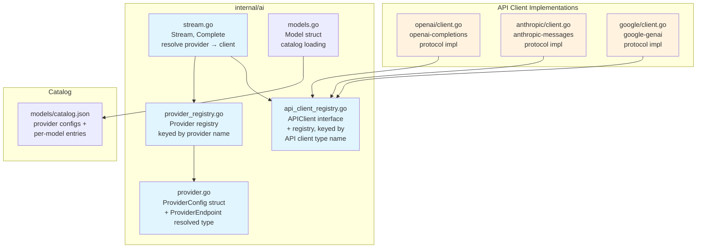
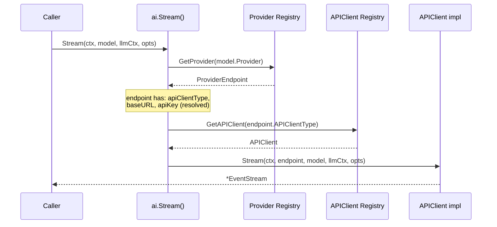
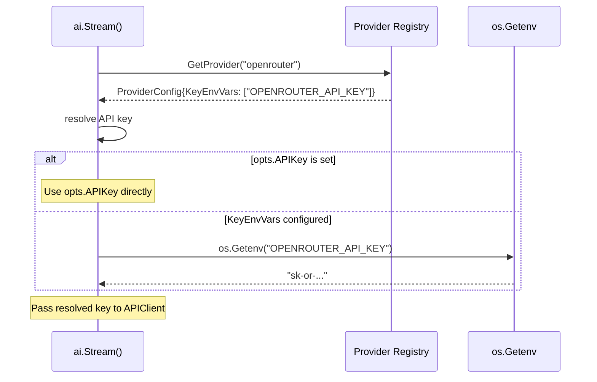

# 01-ai-core Addendum 03: Separate API Client Type from Provider, Fallback Provider

**Status:** Draft
**Parent plan:** [01-ai-core](./01-ai-core.md)
**Depends on:** 01-ai-core (core types, registries), [01-ai-core.add01](./01-ai-core.add01.md) (embedding types)
**Depended on by:** Future provider plans, agent runtime configuration
**Implements:** API client type / provider separation, provider registry refactor, fallback/custom provider mechanism, catalog restructuring

---

## 1. Summary

### Problem

The current architecture conflates two distinct concepts under the name "Provider":

1. **Protocol implementation** -- how to talk to an API (HTTP request format, SSE parsing, response mapping). Examples: `openai-completions`, `anthropic-messages`, `google-genai`.
2. **Service endpoint** -- where to send requests, with what credentials, and which models are available. Examples: OpenAI direct, Anthropic direct, OpenRouter, a self-hosted vLLM instance.

Today, the provider registry is keyed by API name (`model.API`), allowing only **one provider instance per API protocol**. This means:

- You cannot use the same model through two different backends (e.g., Claude via Anthropic direct AND via a proxy).
- OpenRouter models must bake `baseUrl: "https://openrouter.ai/api/v1"` into every catalog entry, but the OpenAI provider ignores `model.BaseURL` and uses its own construction-time `p.baseURL`.
- API keys are bound at provider construction time -- no way to use different keys for different services that share the same protocol.
- Adding an arbitrary OpenAI-compatible endpoint (e.g., a local Ollama instance or a corporate proxy) requires constructing and registering a new provider instance, which **overwrites** the existing one for that API type.

### Solution

Separate the two concepts:

- **API Client Type** (renamed from current "Provider"): stateless protocol implementation. Knows HOW to format requests and parse responses. Registered once per protocol.
- **Provider**: a named service endpoint. Specifies which API client type to use, where to send requests (base URL), how to authenticate (env var names or direct keys), and which models it offers with their pricing.

Add a **fallback/custom provider** mechanism for arbitrary endpoints not in the catalog, where the user specifies a base URL, API client type, and credentials at runtime.

### Key Benefits

- Multiple providers can share the same API client type (OpenAI direct, OpenRouter, and a local vLLM all use `openai-completions`).
- API keys are resolved per-provider from configured env var names, not baked into the client.
- Base URLs are provider-level configuration, not per-model or per-client.
- Arbitrary endpoints work without catalog entries.
- The same model can be accessed through different providers with different pricing.

---

## 2. Architecture

### 2.1 Component Diagram



### 2.2 Sequence Diagram: Stream() Call Resolution



### 2.3 Sequence Diagram: API Key Resolution



### 2.4 Conceptual Layering

```
┌─────────────────────────────────────────────────────┐
│  Caller: Stream(ctx, model, llmCtx, opts)           │
├─────────────────────────────────────────────────────┤
│  Provider Registry (keyed by provider name)         │
│    "openai"      → baseURL, keyEnvVars, models...   │
│    "anthropic"   → baseURL, keyEnvVars, models...   │
│    "openrouter"  → baseURL, keyEnvVars, models...   │
├─────────────────────────────────────────────────────┤
│  API Client Registry (keyed by client type name)    │
│    "openai-completions"  → protocol impl            │
│    "anthropic-messages"  → protocol impl            │
│    "google-genai"        → protocol impl            │
├─────────────────────────────────────────────────────┤
│  HTTP / SSE / Wire Format                           │
└─────────────────────────────────────────────────────┘
```

---

## 3. Detailed Design

### 3.1 API Client Type Interface

The current `Provider` interface is renamed to `APIClient`. This is the protocol implementation layer -- stateless, reusable across providers.

```go
// api_client.go (in internal/ai)

// APIClient is a protocol-level implementation for a specific API format.
// It knows HOW to talk to an API (request format, SSE parsing, response
// mapping) but not WHERE or with what credentials. Those come from
// ProviderEndpoint, passed per-call.
//
// Implementations are stateless and safe for concurrent use.
// Examples: openai-completions, anthropic-messages, google-genai.
type APIClient interface {
    // ClientType returns the API client type identifier.
    // Examples: "openai-completions", "anthropic-messages", "google-genai".
    ClientType() string

    // Stream starts a streaming LLM call.
    // The endpoint provides base URL and resolved API key.
    // The model provides model-specific config (ID, compat flags, etc.).
    Stream(ctx context.Context, endpoint ProviderEndpoint, model Model,
        llmCtx Context, opts StreamOptions) *EventStream

    // StreamSimple is the high-level API that maps ThinkingLevel to
    // provider-specific params.
    StreamSimple(ctx context.Context, endpoint ProviderEndpoint, model Model,
        llmCtx Context, opts SimpleStreamOptions) *EventStream
}
```

Key change from current `Provider` interface: every method now takes a `ProviderEndpoint` parameter that supplies the base URL and resolved API key. The client implementation no longer stores these at construction time.

### 3.2 API Client Registry

Separate from the provider registry. Keyed by client type name. Typically populated once at init time.

```go
// api_client_registry.go (in internal/ai)

var (
    apiClientMu       sync.RWMutex
    apiClientRegistry = make(map[string]APIClient)
)

// RegisterAPIClient registers an API client type.
// Typically called once per protocol implementation at init time.
func RegisterAPIClient(c APIClient) {
    apiClientMu.Lock()
    defer apiClientMu.Unlock()
    apiClientRegistry[c.ClientType()] = c
}

// GetAPIClient returns the API client for the given type.
func GetAPIClient(clientType string) (APIClient, error) {
    apiClientMu.RLock()
    defer apiClientMu.RUnlock()
    c, ok := apiClientRegistry[clientType]
    if !ok {
        return nil, fmt.Errorf("no API client registered for type: %s", clientType)
    }
    return c, nil
}

// ClearAPIClients removes all registered API clients. For testing.
func ClearAPIClients() {
    apiClientMu.Lock()
    defer apiClientMu.Unlock()
    apiClientRegistry = make(map[string]APIClient)
}
```

### 3.3 Provider Types

#### ProviderConfig

This is the declarative configuration for a provider, as stored in the catalog or registered programmatically.

```go
// provider.go (in internal/ai)

// ProviderConfig is the declarative configuration for a named service endpoint.
// It specifies which API client type to use, where to send requests,
// and how to authenticate. Stored in the provider registry.
type ProviderConfig struct {
    // Name is the unique provider identifier.
    // Examples: "openai", "anthropic", "openrouter".
    Name string `json:"name"`

    // APIClientType is the protocol to use for this provider.
    // Must match a registered APIClient's ClientType().
    // Examples: "openai-completions", "anthropic-messages", "google-genai".
    APIClientType string `json:"apiClientType"`

    // BaseURL is the base URL for the API endpoint.
    // Examples: "https://api.openai.com/v1", "https://openrouter.ai/api/v1".
    BaseURL string `json:"baseUrl"`

    // KeyEnvVars is the ordered list of environment variable names to check
    // for the API key. The first non-empty value wins.
    // Examples: ["OPENAI_API_KEY"], ["OPENROUTER_API_KEY"].
    KeyEnvVars []string `json:"keyEnvVars,omitempty"`

    // Headers are extra HTTP headers sent with every request to this provider.
    // Useful for provider-specific routing headers (e.g., OpenRouter site headers).
    Headers map[string]string `json:"headers,omitempty"`

    // ProviderSpecific holds provider-level config that API client
    // implementations may need. Examples: Anthropic API version,
    // Google API version path segment.
    ProviderSpecific map[string]string `json:"providerSpecific,omitempty"`
}
```

#### ProviderEndpoint

This is the resolved, ready-to-use endpoint passed to API clients on each call. It is computed from `ProviderConfig` + any per-call overrides from `StreamOptions`.

```go
// ProviderEndpoint is the resolved endpoint info passed to APIClient methods.
// It is computed from ProviderConfig at call time, with API key resolved
// from environment variables or StreamOptions overrides.
type ProviderEndpoint struct {
    // ProviderName is the provider identifier (for error messages, telemetry).
    ProviderName string

    // BaseURL is the resolved base URL.
    BaseURL string

    // APIKey is the resolved API key (from env var or StreamOptions override).
    // May be empty if the provider doesn't require authentication (e.g., local).
    APIKey string

    // Headers are merged provider-level + call-level headers.
    Headers map[string]string

    // ProviderSpecific passes through from ProviderConfig.
    ProviderSpecific map[string]string
}
```

### 3.4 Provider Registry

The provider registry is now keyed by **provider name** (e.g., `"openai"`, `"openrouter"`) instead of API type name.

```go
// provider_registry.go (in internal/ai)

var (
    providerConfigMu       sync.RWMutex
    providerConfigRegistry = make(map[string]ProviderConfig)
)

// RegisterProviderConfig registers a named provider configuration.
func RegisterProviderConfig(cfg ProviderConfig) {
    cfg = deepCopyProviderConfig(cfg)
    providerConfigMu.Lock()
    defer providerConfigMu.Unlock()
    providerConfigRegistry[cfg.Name] = cfg
}

// GetProviderConfig returns the provider configuration for the given name.
func GetProviderConfig(name string) (ProviderConfig, error) {
    providerConfigMu.RLock()
    defer providerConfigMu.RUnlock()
    cfg, ok := providerConfigRegistry[name]
    if !ok {
        return ProviderConfig{}, fmt.Errorf("no provider registered: %s", name)
    }
    return deepCopyProviderConfig(cfg), nil
}

// ListProviderConfigs returns all registered provider names.
func ListProviderConfigs() []string {
    providerConfigMu.RLock()
    defer providerConfigMu.RUnlock()
    names := make([]string, 0, len(providerConfigRegistry))
    for name := range providerConfigRegistry {
        names = append(names, name)
    }
    sort.Strings(names)
    return names
}

// UnregisterProviderConfig removes a provider by name.
func UnregisterProviderConfig(name string) {
    providerConfigMu.Lock()
    defer providerConfigMu.Unlock()
    delete(providerConfigRegistry, name)
}

// ClearProviderConfigs removes all provider configurations. For testing.
func ClearProviderConfigs() {
    providerConfigMu.Lock()
    defer providerConfigMu.Unlock()
    providerConfigRegistry = make(map[string]ProviderConfig)
}

func deepCopyProviderConfig(cfg ProviderConfig) ProviderConfig {
    if cfg.KeyEnvVars != nil {
        kv := make([]string, len(cfg.KeyEnvVars))
        copy(kv, cfg.KeyEnvVars)
        cfg.KeyEnvVars = kv
    }
    if cfg.Headers != nil {
        h := make(map[string]string, len(cfg.Headers))
        for k, v := range cfg.Headers {
            h[k] = v
        }
        cfg.Headers = h
    }
    if cfg.ProviderSpecific != nil {
        ps := make(map[string]string, len(cfg.ProviderSpecific))
        for k, v := range cfg.ProviderSpecific {
            ps[k] = v
        }
        cfg.ProviderSpecific = ps
    }
    return cfg
}
```

### 3.5 Endpoint Resolution

A helper function resolves `ProviderConfig` + `StreamOptions` into a `ProviderEndpoint`:

```go
// resolve.go (in internal/ai)

// ResolveEndpoint creates a ProviderEndpoint from a ProviderConfig and
// call-level options. API key resolution order:
//   1. opts.APIKey (explicit per-call override)
//   2. First non-empty env var from cfg.KeyEnvVars
//   3. Empty string (provider may not require auth)
func ResolveEndpoint(cfg ProviderConfig, opts StreamOptions) ProviderEndpoint {
    apiKey := strings.TrimSpace(opts.APIKey)
    if apiKey == "" {
        for _, envVar := range cfg.KeyEnvVars {
            if v := os.Getenv(envVar); v != "" {
                apiKey = v
                break
            }
        }
    }

    // Merge headers: provider-level, then model-level (from caller),
    // then call-level opts. Later values override earlier ones.
    headers := make(map[string]string)
    for k, v := range cfg.Headers {
        headers[k] = v
    }
    for k, v := range opts.Headers {
        headers[k] = v
    }

    return ProviderEndpoint{
        ProviderName:     cfg.Name,
        BaseURL:          cfg.BaseURL,
        APIKey:           apiKey,
        Headers:          headers,
        ProviderSpecific: cfg.ProviderSpecific,
    }
}
```

### 3.6 Model Struct Changes

The `Model` struct's `Provider` field now refers to the **provider name** (e.g., `"openrouter"`) rather than being a loose grouping key. The `API` field is retained for backwards compatibility and as a convenience to identify which API client type the model uses, but the canonical resolution path is now `model.Provider` -> `ProviderConfig.APIClientType`.

The `BaseURL` field is **removed from Model**. Base URLs are provider-level configuration, not per-model. Models in the catalog no longer carry `baseUrl`.

```go
// Model defines a provider model configuration.
type Model struct {
    ID            string            `json:"id"`
    Name          string            `json:"name"`
    Provider      string            `json:"provider"`      // provider name, e.g. "openrouter"
    API           string            `json:"api"`            // retained for compat; derived from provider's apiClientType
    Reasoning     bool              `json:"reasoning"`
    Input         []string          `json:"input"`
    Cost          ModelCost         `json:"cost"`
    ContextWindow int               `json:"contextWindow"`
    MaxTokens     int               `json:"maxTokens"`
    Headers       map[string]string `json:"headers,omitempty"`
    Compat        *ModelCompat      `json:"compat,omitempty"`
}
```

Changes from current:
- `BaseURL` field removed (provider-level concern now)
- `Provider` field semantics tightened: must match a registered provider name
- `API` field retained but now derived/validated against `ProviderConfig.APIClientType`

### 3.7 Stream Entry Points Changes

The top-level `Stream()` / `Complete()` functions change their resolution logic:

```go
// stream.go (in internal/ai)

// Stream starts a streaming LLM call.
// Resolution: model.Provider → ProviderConfig → APIClient → Stream()
func Stream(ctx context.Context, model Model, llmCtx Context, opts StreamOptions) *EventStream {
    cfg, err := GetProviderConfig(model.Provider)
    if err != nil {
        return errorStream(err)
    }
    client, err := GetAPIClient(cfg.APIClientType)
    if err != nil {
        return errorStream(fmt.Errorf("provider %q uses API client type %q: %w",
            model.Provider, cfg.APIClientType, err))
    }
    endpoint := ResolveEndpoint(cfg, opts)
    return client.Stream(ctx, endpoint, model, llmCtx, opts)
}

// StreamSimple starts a streaming LLM call with simplified options.
func StreamSimple(ctx context.Context, model Model, llmCtx Context, opts SimpleStreamOptions) *EventStream {
    cfg, err := GetProviderConfig(model.Provider)
    if err != nil {
        return errorStream(err)
    }
    client, err := GetAPIClient(cfg.APIClientType)
    if err != nil {
        return errorStream(fmt.Errorf("provider %q uses API client type %q: %w",
            model.Provider, cfg.APIClientType, err))
    }
    endpoint := ResolveEndpoint(cfg, opts.StreamOptions)
    return client.StreamSimple(ctx, endpoint, model, llmCtx, opts)
}

// Complete and CompleteSimple remain wrappers over Stream/StreamSimple.
```

### 3.8 Catalog Structure Changes

The catalog changes from a flat `provider → modelID → Model` structure to a structure that includes provider-level configuration.

**New `catalog.json` structure:**

```json
{
  "providers": {
    "anthropic": {
      "apiClientType": "anthropic-messages",
      "baseUrl": "https://api.anthropic.com",
      "keyEnvVars": ["ANTHROPIC_API_KEY"],
      "providerSpecific": {
        "apiVersion": "2023-06-01"
      }
    },
    "openai": {
      "apiClientType": "openai-completions",
      "baseUrl": "https://api.openai.com/v1",
      "keyEnvVars": ["OPENAI_API_KEY"]
    },
    "google": {
      "apiClientType": "google-genai",
      "baseUrl": "https://generativelanguage.googleapis.com",
      "keyEnvVars": ["GOOGLE_API_KEY", "GEMINI_API_KEY"],
      "providerSpecific": {
        "apiVersion": "v1beta"
      }
    },
    "openrouter": {
      "apiClientType": "openai-completions",
      "baseUrl": "https://openrouter.ai/api/v1",
      "keyEnvVars": ["OPENROUTER_API_KEY"],
      "headers": {
        "HTTP-Referer": "https://flex-agent-runtime",
        "X-Title": "flex-agent-runtime"
      }
    }
  },
  "models": {
    "anthropic": {
      "claude-sonnet-4-6": {
        "name": "Claude Sonnet 4.6",
        "reasoning": true,
        "input": ["text", "image"],
        "cost": { "input": 3, "output": 15, "cacheRead": 0.3, "cacheWrite": 3.75 },
        "contextWindow": 1000000,
        "maxTokens": 64000
      }
    },
    "openai": {
      "gpt-4.1": {
        "name": "GPT-4.1",
        "reasoning": false,
        "input": ["text", "image"],
        "cost": { "input": 2, "output": 8, "cacheRead": 0.5, "cacheWrite": 2 },
        "contextWindow": 1000000,
        "maxTokens": 32768
      },
      "o3": {
        "name": "o3",
        "reasoning": true,
        "input": ["text", "image"],
        "cost": { "input": 2, "output": 8, "cacheRead": 0.5, "cacheWrite": 2 },
        "contextWindow": 200000,
        "maxTokens": 100000,
        "compat": {
          "supportsReasoningEffort": true,
          "supportsDeveloperRole": true,
          "maxTokensField": "max_completion_tokens"
        }
      }
    },
    "openrouter": {
      "deepseek/deepseek-chat": {
        "name": "DeepSeek V3",
        "reasoning": false,
        "input": ["text"],
        "cost": { "input": 0.32, "output": 0.89, "cacheRead": 0, "cacheWrite": 0 },
        "contextWindow": 163840,
        "maxTokens": 16384
      }
    }
  }
}
```

Key changes:
- Top-level `"providers"` section with provider configs
- Model entries no longer have `baseUrl` or `api` fields (derived from provider)
- `api` field is set on `Model` struct at catalog load time from `ProviderConfig.APIClientType`

**Catalog loading changes:**

```go
// models.go init()

type catalogFile struct {
    Providers map[string]ProviderConfig             `json:"providers"`
    Models    map[string]map[string]Model           `json:"models"`
}

func init() {
    var catalog catalogFile
    if err := json.Unmarshal(catalogJSON, &catalog); err != nil {
        panic(fmt.Sprintf("failed to load model catalog: %v", err))
    }

    // Register provider configs
    for name, cfg := range catalog.Providers {
        cfg.Name = name
        RegisterProviderConfig(cfg)
    }

    // Register models, deriving API from provider config
    for providerName, models := range catalog.Models {
        provCfg, ok := catalog.Providers[providerName]
        if !ok {
            panic(fmt.Sprintf("model catalog: provider %q not in providers section", providerName))
        }
        for id, m := range models {
            m.ID = id
            m.Provider = providerName
            m.API = provCfg.APIClientType
            RegisterModel(m)
        }
    }
}
```

### 3.9 Fallback / Custom Provider

For arbitrary endpoints not in the catalog, callers can register a custom provider at runtime. This supports use cases like:

- Local Ollama or vLLM instances
- Corporate API proxies
- New services that don't have catalog entries yet
- Testing against mock servers

#### CustomProviderConfig

```go
// custom_provider.go (in internal/ai)

// CustomProviderConfig is a convenience for registering a provider at runtime
// for an arbitrary endpoint. Unlike catalog providers, custom providers:
// - Accept any model name (no catalog validation)
// - Have unknown pricing (Cost fields zero-valued)
// - Can accept API keys directly (not just via env vars)
type CustomProviderConfig struct {
    // Name is the unique provider name. Required.
    Name string

    // APIClientType is the protocol to use. Required.
    // Must match a registered APIClient (e.g., "openai-completions").
    APIClientType string

    // BaseURL is the endpoint URL. Required.
    BaseURL string

    // APIKey is a directly-provided API key. If set, takes precedence
    // over KeyEnvVars during resolution.
    APIKey string

    // KeyEnvVars is the ordered list of env var names to check.
    // Checked only if APIKey is empty.
    KeyEnvVars []string

    // Headers are extra HTTP headers for this provider.
    Headers map[string]string

    // ProviderSpecific holds provider-level config for the API client.
    ProviderSpecific map[string]string
}

// RegisterCustomProvider registers a custom provider from runtime config.
// It registers the ProviderConfig in the provider registry.
// Returns an error if Name, APIClientType, or BaseURL is empty,
// or if the APIClientType is not registered.
func RegisterCustomProvider(cfg CustomProviderConfig) error {
    if cfg.Name == "" {
        return fmt.Errorf("custom provider name is required")
    }
    if cfg.APIClientType == "" {
        return fmt.Errorf("custom provider %q: apiClientType is required", cfg.Name)
    }
    if cfg.BaseURL == "" {
        return fmt.Errorf("custom provider %q: baseURL is required", cfg.Name)
    }

    // Validate that the API client type exists
    if _, err := GetAPIClient(cfg.APIClientType); err != nil {
        return fmt.Errorf("custom provider %q: %w", cfg.Name, err)
    }

    provCfg := ProviderConfig{
        Name:             cfg.Name,
        APIClientType:    cfg.APIClientType,
        BaseURL:          cfg.BaseURL,
        KeyEnvVars:       cfg.KeyEnvVars,
        Headers:          cfg.Headers,
        ProviderSpecific: cfg.ProviderSpecific,
    }

    // If a direct API key was provided, store it so ResolveEndpoint can use it.
    // We do this via a special sentinel env var name + direct key storage.
    if cfg.APIKey != "" {
        provCfg.directAPIKey = cfg.APIKey
    }

    RegisterProviderConfig(provCfg)
    return nil
}
```

The `directAPIKey` field requires a small extension to `ProviderConfig` and `ResolveEndpoint`:

```go
// In ProviderConfig (unexported field, not serialized):
type ProviderConfig struct {
    // ... exported fields as above ...

    // directAPIKey is set by RegisterCustomProvider for providers that
    // have a directly-supplied API key rather than env var lookup.
    // Not serialized to JSON. Not exported.
    directAPIKey string
}

// ResolveEndpoint updated key resolution order:
//   1. opts.APIKey (explicit per-call override)
//   2. cfg.directAPIKey (set by RegisterCustomProvider)
//   3. First non-empty env var from cfg.KeyEnvVars
//   4. Empty string
```

#### Custom Model Registration

For custom providers, models can be registered dynamically:

```go
// RegisterCustomModel registers a model for a custom provider.
// The model's Provider and API fields are set from the provider config.
// Cost fields are zero-valued (unknown pricing).
func RegisterCustomModel(providerName string, modelID string, opts CustomModelOpts) error {
    cfg, err := GetProviderConfig(providerName)
    if err != nil {
        return fmt.Errorf("register custom model: %w", err)
    }
    m := Model{
        ID:            modelID,
        Name:          opts.Name,
        Provider:      providerName,
        API:           cfg.APIClientType,
        Reasoning:     opts.Reasoning,
        Input:         opts.Input,
        Cost:          opts.Cost, // zero-valued if unknown
        ContextWindow: opts.ContextWindow,
        MaxTokens:     opts.MaxTokens,
        Compat:        opts.Compat,
    }
    if m.Name == "" {
        m.Name = modelID
    }
    RegisterModel(m)
    return nil
}

// CustomModelOpts provides optional fields when registering a custom model.
type CustomModelOpts struct {
    Name          string
    Reasoning     bool
    Input         []string
    Cost          ModelCost
    ContextWindow int
    MaxTokens     int
    Compat        *ModelCompat
}
```

Alternatively, callers can use `Stream()` with a Model struct constructed inline -- the model does not need to be in the registry if the caller already has the `Model` value. The model registry is a convenience for catalog-driven lookup.

### 3.10 API Client Implementation Changes

Each provider package changes from implementing `ai.Provider` to implementing `ai.APIClient`. The key difference is that base URL and API key are no longer stored on the struct -- they come from `ProviderEndpoint`.

**Example: OpenAI client refactor**

```go
// internal/ai/provider/openai/client.go

package openai

// Client implements ai.APIClient for the OpenAI Chat Completions protocol.
// It is stateless -- base URL and API key come from ProviderEndpoint per-call.
type Client struct {
    httpClient *http.Client
}

// ClientConfig controls OpenAI client construction.
type ClientConfig struct {
    HTTPClient *http.Client
}

// NewClient constructs an OpenAI protocol client.
func NewClient(cfg ClientConfig) *Client {
    client := cfg.HTTPClient
    if client == nil {
        client = &http.Client{Timeout: defaultTimeout}
    }
    return &Client{httpClient: client}
}

func (c *Client) ClientType() string {
    return "openai-completions"
}

func (c *Client) Stream(ctx context.Context, endpoint ai.ProviderEndpoint,
    model ai.Model, llmCtx ai.Context, opts ai.StreamOptions) *ai.EventStream {
    es := ai.NewEventStream()
    go func() {
        defer es.Close()
        if err := c.runStream(ctx, endpoint, model, llmCtx, opts, requestParams{}, es); err != nil {
            sendErrorEvent(es, endpoint, model, err)
        }
    }()
    return es
}

func (c *Client) runStream(ctx context.Context, endpoint ai.ProviderEndpoint,
    model ai.Model, llmCtx ai.Context, opts ai.StreamOptions,
    params requestParams, es *ai.EventStream) error {
    // ... build request body ...
    req, err := http.NewRequestWithContext(ctx, http.MethodPost,
        endpoint.BaseURL+"/chat/completions", bytes.NewReader(bodyBytes))
    // ... apply headers from endpoint ...
    applyHeaders(req, endpoint, model, opts)
    resp, err := c.httpClient.Do(req)
    // ...
}

func applyHeaders(req *http.Request, endpoint ai.ProviderEndpoint,
    model ai.Model, opts ai.StreamOptions) {
    req.Header.Set("Content-Type", "application/json")
    req.Header.Set("Accept", "text/event-stream")
    if endpoint.APIKey != "" {
        req.Header.Set("Authorization", "Bearer "+endpoint.APIKey)
    }
    // Provider-level headers (from ProviderEndpoint, already merged with opts)
    for k, v := range endpoint.Headers {
        req.Header.Set(k, v)
    }
    // Model-level headers
    for k, v := range model.Headers {
        req.Header.Set(k, v)
    }
}

// Register creates a Client and registers it as an API client.
func Register(cfg ClientConfig) *Client {
    c := NewClient(cfg)
    ai.RegisterAPIClient(c)
    return c
}
```

**Example: Anthropic client refactor**

The Anthropic client follows the same pattern. Provider-specific config like `apiVersion` comes from `endpoint.ProviderSpecific`:

```go
func (c *Client) runStream(ctx context.Context, endpoint ai.ProviderEndpoint, ...) error {
    // ...
    version := endpoint.ProviderSpecific["apiVersion"]
    if version == "" {
        version = defaultVersion
    }
    req.Header.Set("anthropic-version", version)
    if endpoint.APIKey != "" {
        req.Header.Set("x-api-key", endpoint.APIKey)
    }
    // ...
}
```

### 3.11 Embedding Provider Consistency

The same separation applies to embedding providers. The current `EmbeddingProvider` interface becomes `EmbeddingAPIClient`:

```go
// embedding_api_client.go (in internal/ai)

type EmbeddingAPIClient interface {
    // ClientType returns the embedding API client type identifier.
    // Examples: "openai-embeddings", "google-embeddings", "cohere-embeddings".
    ClientType() string

    // Embed generates embeddings for the given texts.
    Embed(ctx context.Context, endpoint ProviderEndpoint, model EmbeddingModel,
        req EmbeddingRequest) (*EmbeddingResponse, error)
}
```

The embedding API client registry, embedding model registry, and `Embed()` entry point follow the same pattern:

```go
// Embed() resolution changes:
func Embed(ctx context.Context, modelID string, req EmbeddingRequest) (*EmbeddingResponse, error) {
    model, ok := GetEmbeddingModel(modelID)
    if !ok {
        return nil, fmt.Errorf("unknown embedding model: %s", modelID)
    }
    cfg, err := GetProviderConfig(model.Provider)
    if err != nil {
        return nil, err
    }
    client, err := GetEmbeddingAPIClient(cfg.APIClientType)
    // ... note: embedding models may use a different API client type name
    // e.g., provider "openai" has apiClientType "openai-completions" for chat
    // but embedding models need "openai-embeddings" client type.
    // Resolution: EmbeddingModel stores its own API field, used for client lookup.
    // ...
}
```

**Important nuance:** A single provider (e.g., "openai") may use different API client types for chat vs embeddings. The `EmbeddingModel.API` field is used to look up the `EmbeddingAPIClient`, independent of `ProviderConfig.APIClientType` (which is for chat). The `ProviderConfig` still supplies base URL and credentials. To make this explicit:

```go
func Embed(ctx context.Context, modelID string, req EmbeddingRequest) (*EmbeddingResponse, error) {
    model, ok := GetEmbeddingModel(modelID)
    if !ok {
        return nil, fmt.Errorf("unknown embedding model: %s", modelID)
    }
    cfg, err := GetProviderConfig(model.Provider)
    if err != nil {
        return nil, err
    }
    client, err := GetEmbeddingAPIClient(model.API) // use model.API, not cfg.APIClientType
    if err != nil {
        return nil, err
    }
    endpoint := ResolveEndpoint(cfg, StreamOptions{}) // no per-call opts for embeddings yet
    // ... validation ...
    return client.Embed(ctx, endpoint, model, req)
}
```

### 3.12 Backwards Compatibility Shim

**Note on philosophy:** Per project guidelines, we do NOT leave around old behavior or shims for backwards compatibility. This section documents the migration path, not a compatibility layer.

The old `Provider` interface and `RegisterProvider` / `GetProvider` functions are removed. All callers migrate to the new `APIClient` + `ProviderConfig` pattern. The old `Provider` interface name is repurposed -- it no longer exists as an interface. The concept it represented is now split into `APIClient` (protocol) and `ProviderConfig` (endpoint).

---

## 4. Migration

### 4.1 Provider Package Changes

Each provider package (`openai`, `anthropic`, `google`) must:

1. Rename its type from `Provider` to `Client`.
2. Change the interface it implements from `ai.Provider` to `ai.APIClient`.
3. Change `API()` method to `ClientType()`.
4. Add `ProviderEndpoint` parameter to `Stream()` and `StreamSimple()`.
5. Remove stored `baseURL` and `apiKey` fields -- use `endpoint.BaseURL` and `endpoint.APIKey` instead.
6. Move provider-specific defaults (Anthropic version, Google API version) to `ProviderSpecific` in catalog config.
7. Change `Register()` to register an `APIClient` (not the old `Provider`) and separately ensure provider configs are registered via catalog or explicit calls.

### 4.2 Caller Migration

Callers that currently do:

```go
openai.Register(openai.Config{APIKey: os.Getenv("OPENAI_API_KEY")}, "main")
```

Change to:

```go
// Register the API client (protocol impl) -- typically once at init
openai.Register(openai.ClientConfig{})

// Provider configs are loaded from catalog.json at init.
// API keys are resolved from env vars automatically.
// No explicit key passing needed at registration time.
```

Callers that construct providers for custom endpoints:

```go
// Old: overwrites the global openai-completions provider
openai.Register(openai.Config{
    BaseURL: "https://my-proxy.example.com/v1",
    APIKey:  os.Getenv("PROXY_API_KEY"),
}, "proxy")
```

Change to:

```go
// New: register a named custom provider
ai.RegisterCustomProvider(ai.CustomProviderConfig{
    Name:          "my-proxy",
    APIClientType: "openai-completions",
    BaseURL:       "https://my-proxy.example.com/v1",
    KeyEnvVars:    []string{"PROXY_API_KEY"},
})
```

### 4.3 Demo CLI Migration

The demo CLIs (`demos/llm-demo`, `demos/embedding-demo`) update their provider registration to the new pattern. They register API clients once and rely on catalog-loaded provider configs. For custom endpoints, they use `RegisterCustomProvider`.

### 4.4 Model Registry Migration

The model registry's outer key changes from a loose grouping (e.g., `"anthropic"`, `"openai"`) to a strict provider name that must match a registered `ProviderConfig`. The `GetModel(provider, modelID)` signature remains the same, but the `provider` parameter now means "registered provider name".

### 4.5 AssistantMessage Changes

The `AssistantMessage.Provider` field now carries the provider name (e.g., `"openrouter"`) rather than a loose label. The `AssistantMessage.API` field carries the API client type. Both are set by the stream entry points before delegating to the API client, so API client implementations don't need to know their own provider name.

---

## 5. Testing

### 5.1 Existing Tests to Update

| Test Area | Change Required |
|-----------|----------------|
| Registry tests | Split into API client registry tests and provider config registry tests |
| Stream entry point tests | Update mock to implement `APIClient` instead of `Provider`; verify two-step resolution (provider config → API client) |
| Provider package tests (openai, anthropic, google) | Update to pass `ProviderEndpoint` instead of using stored fields; update mock server tests |
| Catalog loading tests | Verify new catalog format loads both provider configs and models correctly |
| Transform tests | Update `AssistantMessage.Provider` expectations if they check provider name |
| Demo integration tests | Update provider registration calls |

### 5.2 New Tests

| Test | Description |
|------|-------------|
| `TestAPIClientRegistry` | Register/Get/Clear for API clients, concurrent access |
| `TestProviderConfigRegistry` | Register/Get/List/Unregister/Clear for provider configs, concurrent access, deep copy isolation |
| `TestResolveEndpoint` | API key resolution order (opts > direct > env > empty), header merging, provider-specific passthrough |
| `TestResolveEndpointEnvVars` | Multiple env vars, first-wins behavior, empty env vars skipped |
| `TestStreamResolution` | Full path: model.Provider → ProviderConfig → APIClient → Stream(). Verify endpoint fields propagated correctly |
| `TestStreamMissingProvider` | Error when model references unregistered provider |
| `TestStreamMissingAPIClient` | Error when provider config references unregistered API client type |
| `TestCustomProviderRegistration` | RegisterCustomProvider validation (empty fields, unknown API client type), successful registration |
| `TestCustomModelRegistration` | RegisterCustomModel with and without optional fields, error on unknown provider |
| `TestMultipleProvidersPerAPIClient` | Register "openai" and "openrouter" both using "openai-completions", verify independent resolution with different base URLs and keys |
| `TestCatalogNewFormat` | Load new catalog.json format, verify provider configs and models both registered correctly, verify model.API derived from provider |
| `TestEmbeddingResolution` | Embedding model resolves provider config for credentials/baseURL but uses model.API for embedding client lookup |

### 5.3 Property Tests

- **Resolution determinism:** For any registered provider config and API client, `ResolveEndpoint` always produces the same `ProviderEndpoint` given the same inputs.
- **Registry isolation:** Registering/unregistering provider configs does not affect the API client registry, and vice versa.
- **Deep copy integrity:** Mutating a returned `ProviderConfig` does not affect registry state.

---

## 6. Catalog Changes

### 6.1 Before (current format)

```json
{
  "anthropic": {
    "claude-sonnet-4-6": {
      "name": "Claude Sonnet 4.6",
      "api": "anthropic-messages",
      "baseUrl": "https://api.anthropic.com",
      "reasoning": true,
      ...
    }
  },
  "openrouter": {
    "deepseek/deepseek-chat": {
      "name": "DeepSeek V3",
      "api": "openai-completions",
      "baseUrl": "https://openrouter.ai/api/v1",
      ...
    }
  }
}
```

### 6.2 After (new format)

```json
{
  "providers": {
    "anthropic": {
      "apiClientType": "anthropic-messages",
      "baseUrl": "https://api.anthropic.com",
      "keyEnvVars": ["ANTHROPIC_API_KEY"],
      "providerSpecific": {
        "apiVersion": "2023-06-01"
      }
    },
    "openai": {
      "apiClientType": "openai-completions",
      "baseUrl": "https://api.openai.com/v1",
      "keyEnvVars": ["OPENAI_API_KEY"]
    },
    "google": {
      "apiClientType": "google-genai",
      "baseUrl": "https://generativelanguage.googleapis.com",
      "keyEnvVars": ["GOOGLE_API_KEY", "GEMINI_API_KEY"],
      "providerSpecific": {
        "apiVersion": "v1beta"
      }
    },
    "openrouter": {
      "apiClientType": "openai-completions",
      "baseUrl": "https://openrouter.ai/api/v1",
      "keyEnvVars": ["OPENROUTER_API_KEY"],
      "headers": {
        "HTTP-Referer": "https://flex-agent-runtime",
        "X-Title": "flex-agent-runtime"
      }
    }
  },
  "models": {
    "anthropic": {
      "claude-opus-4-6": {
        "name": "Claude Opus 4.6",
        "reasoning": true,
        "input": ["text", "image"],
        "cost": { "input": 5, "output": 25, "cacheRead": 0.5, "cacheWrite": 6.25 },
        "contextWindow": 1000000,
        "maxTokens": 128000
      }
    },
    "openai": {
      "gpt-4.1": {
        "name": "GPT-4.1",
        "reasoning": false,
        "input": ["text", "image"],
        "cost": { "input": 2, "output": 8, "cacheRead": 0.5, "cacheWrite": 2 },
        "contextWindow": 1000000,
        "maxTokens": 32768
      }
    },
    "openrouter": {
      "deepseek/deepseek-chat": {
        "name": "DeepSeek V3",
        "reasoning": false,
        "input": ["text"],
        "cost": { "input": 0.32, "output": 0.89, "cacheRead": 0, "cacheWrite": 0 },
        "contextWindow": 163840,
        "maxTokens": 16384
      }
    }
  }
}
```

### 6.3 Embedding Catalog

The embedding catalog (`models/embedding_catalog.json`) follows the same pattern. The `EmbeddingModel.Provider` field references a provider in the main catalog's `"providers"` section. The `EmbeddingModel.API` field is retained (since embedding models use a different API client type than chat models from the same provider), but `baseUrl` is removed:

```json
[
    {
      "id": "text-embedding-3-small",
      "name": "Text Embedding 3 Small",
      "api": "openai-embeddings",
      "provider": "openai",
      "maxInputTokens": 8192,
      "defaultDims": 1536,
      "maxDims": 1536,
      "minDims": 256,
      "maxBatchSize": 2048,
      "supportsDimCtrl": true,
      "supportsTaskType": false,
      "cost": { "perMTok": 0.02 }
    }
]
```

Note: `baseUrl` removed from embedding models. The embedding `Embed()` entry point resolves base URL from `GetProviderConfig(model.Provider)`.

---

## 7. File Organization

New and changed files:

```
internal/ai/
    api_client.go               # NEW: APIClient interface
    api_client_registry.go      # NEW: API client type registry
    provider.go                 # CHANGED: ProviderConfig + ProviderEndpoint types
                                #   (was: Provider interface — interface removed)
    provider_registry.go        # NEW: provider config registry (replaces registry.go)
    registry.go                 # REMOVED: old provider registry
    resolve.go                  # NEW: ResolveEndpoint helper
    custom_provider.go          # NEW: CustomProviderConfig, RegisterCustomProvider,
                                #       RegisterCustomModel
    stream.go                   # CHANGED: two-step resolution
    models.go                   # CHANGED: Model struct (BaseURL removed),
                                #           catalog loading (new format)
    embedding.go                # CHANGED: EmbeddingModel (BaseURL removed)
    embedding_api_client.go     # NEW: EmbeddingAPIClient interface + registry
    embedding_api.go            # CHANGED: Embed() uses provider config for endpoint
    embedding_models.go         # CHANGED: catalog loading (baseUrl removed)

internal/ai/provider/openai/
    client.go                   # CHANGED: renamed from provider.go, implements APIClient
    stream.go                   # CHANGED: takes ProviderEndpoint param
    embedding_client.go         # CHANGED: implements EmbeddingAPIClient

internal/ai/provider/anthropic/
    client.go                   # CHANGED: renamed from provider.go, implements APIClient
    stream.go                   # CHANGED: takes ProviderEndpoint param

internal/ai/provider/google/
    client.go                   # CHANGED: renamed from provider.go, implements APIClient
    stream.go                   # CHANGED: takes ProviderEndpoint param

internal/ai/models/
    catalog.json                # CHANGED: new format with providers section

ai/
    ai.go                       # CHANGED: re-exports updated types
```

---

## 8. Open Questions

| Question | Proposed Resolution |
|----------|-------------------|
| Should `ProviderConfig` live in catalog only, or also support programmatic-only providers? | Both. Catalog provides defaults, `RegisterProviderConfig` and `RegisterCustomProvider` allow runtime additions. |
| Should the old `Provider` interface name be reused for something? | No. The name is retired. `APIClient` and `ProviderConfig` are distinct enough to avoid confusion. |
| How do API clients that need per-provider state (e.g., Anthropic beta headers) get it? | Via `ProviderEndpoint.ProviderSpecific` map and `ProviderEndpoint.Headers`. |
| Should `ResolveEndpoint` cache resolved keys? | No. Env var lookup is cheap and caching would prevent runtime key rotation. |
| How does `CalculateCost` work for custom models with zero pricing? | It returns zero cost. Callers must handle `Usage.Cost.Total == 0` as "unknown" rather than "free". |

---

## 9. Acceptance Criteria

1. **AC1:** Multiple providers using the same API client type can be registered simultaneously (e.g., "openai" and "openrouter" both using "openai-completions"), and `Stream()` routes to the correct base URL based on `model.Provider`.
2. **AC2:** API keys are resolved from provider-configured env vars without explicit key passing at registration time.
3. **AC3:** `RegisterCustomProvider` allows registering an arbitrary endpoint, and models registered against it can be used with `Stream()`.
4. **AC4:** The catalog loads both provider configs and models from the new format. Model.API is derived from provider config's APIClientType.
5. **AC5:** All existing provider tests pass after migration (openai, anthropic, google).
6. **AC6:** Embedding resolution uses provider config for base URL and credentials while using model.API for API client type lookup.
7. **AC7:** The API client registry and provider config registry are independently thread-safe under `-race`.
8. **AC8:** `make check && make test` pass clean with no warnings.
