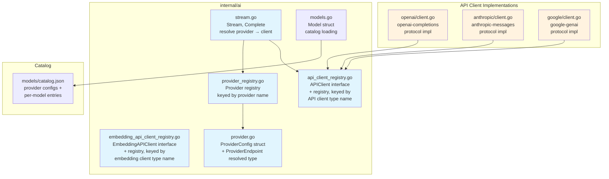
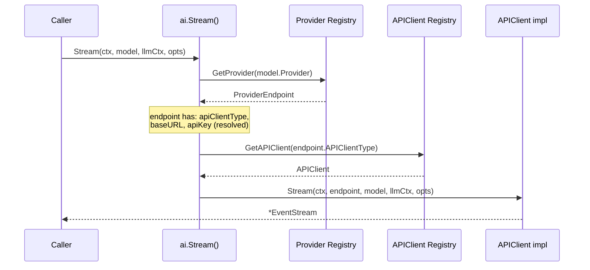
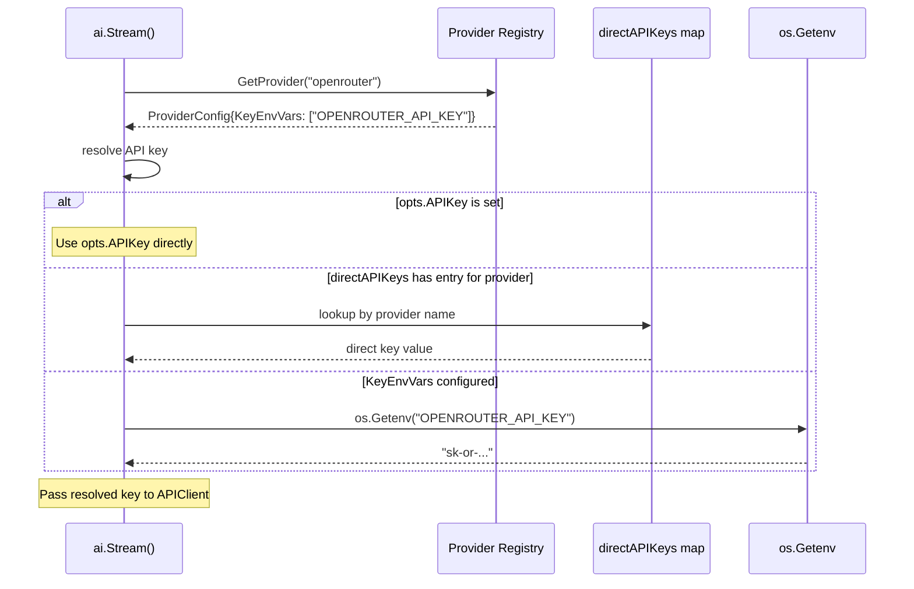

# 01-ai-core Addendum 03: Separate API Client Type from Provider, Fallback Provider

**Status:** Reviewed
**Parent plan:** [01-ai-core](./01-ai-core.md)
**Depends on:** 01-ai-core (core types, registries), [01-ai-core.add01](./01-ai-core.add01.md) (embedding types)
**Depended on by:** Future provider plans, agent runtime configuration
**Implements:** API client type / provider separation, provider registry refactor, fallback/custom provider mechanism, catalog restructuring
**Reviews incorporated:** R1A (Reviewer A), R1B (Reviewer B), R2, SR (Seam Review), SR2 (Seam Review 2), R3-CL (concierge-leaf, lore-garden downstream consumer) -- see disposition tables at end

---

## 1. Summary

### Problem

The current architecture conflates two distinct concepts under the name "Provider":

1. **Protocol implementation** -- how to talk to an API (HTTP request format, SSE parsing, response mapping). Examples: `openai-completions`, `anthropic-messages`, `google-genai`.
2. **Service endpoint** -- where to send requests, with what credentials, and which models are available. Examples: OpenAI direct, Anthropic direct, OpenRouter, a self-hosted vLLM instance.

Today, the provider registry is keyed by API name (`model.API`), allowing only **one provider instance per API protocol**. This means:

- You cannot use the same model through two different backends (e.g., Claude via Anthropic direct AND via a proxy).
- OpenRouter models must bake `baseUrl: "https://openrouter.ai/api/v1"` into every catalog entry, but the OpenAI provider ignores `model.BaseURL` and uses its own construction-time `p.baseURL`.
- API keys are bound at provider construction time -- no way to use different keys for different services that share the same protocol.
- Adding an arbitrary OpenAI-compatible endpoint (e.g., a local Ollama instance or a corporate proxy) requires constructing and registering a new provider instance, which **overwrites** the existing one for that API type.

### Solution

Separate the two concepts:

- **API Client Type** (renamed from current "Provider"): stateless protocol implementation. Knows HOW to format requests and parse responses. Registered once per protocol.
- **Provider**: a named service endpoint. Specifies which API client type to use, where to send requests (base URL), how to authenticate (env var names or direct keys), and which models it offers with their pricing.

Add a **fallback/custom provider** mechanism for arbitrary endpoints not in the catalog, where the user specifies a base URL, API client type, and credentials at runtime.

### Key Benefits

- Multiple providers can share the same API client type (OpenAI direct, OpenRouter, and a local vLLM all use `openai-completions`).
- API keys are resolved per-provider from configured env var names, not baked into the client.
- Base URLs are provider-level configuration, not per-model or per-client.
- Arbitrary endpoints work without catalog entries.
- The same model can be accessed through different providers with different pricing.

---

## 2. Architecture

### 2.1 Component Diagram



### 2.2 Sequence Diagram: Stream() Call Resolution



### 2.3 Sequence Diagram: API Key Resolution



### 2.4 Conceptual Layering

```
┌─────────────────────────────────────────────────────┐
│  Caller: Stream(ctx, model, llmCtx, opts)           │
├─────────────────────────────────────────────────────┤
│  Provider Registry (keyed by provider name)         │
│    "openai"      → baseURL, keyEnvVars, models...   │
│    "anthropic"   → baseURL, keyEnvVars, models...   │
│    "openrouter"  → baseURL, keyEnvVars, models...   │
├─────────────────────────────────────────────────────┤
│  API Client Registry (keyed by client type name)    │
│    "openai-completions"  → protocol impl            │
│    "anthropic-messages"  → protocol impl            │
│    "google-genai"        → protocol impl            │
│  Embedding API Client Registry                      │
│    "openai-embeddings"   → protocol impl            │
│    "google-embeddings"   → protocol impl            │
├─────────────────────────────────────────────────────┤
│  HTTP / SSE / Wire Format                           │
└─────────────────────────────────────────────────────┘
```

---

## 3. Detailed Design

### 3.1 API Client Type Interface

The current `Provider` interface is renamed to `APIClient`. This is the protocol implementation layer -- stateless, reusable across providers.

```go
// api_client.go (in internal/ai)

// APIClient is a protocol-level implementation for a specific API format.
// It knows HOW to talk to an API (request format, SSE parsing, response
// mapping) but not WHERE or with what credentials. Those come from
// ProviderEndpoint, passed per-call.
//
// Implementations are stateless and safe for concurrent use.
// Examples: openai-completions, anthropic-messages, google-genai.
type APIClient interface {
    // ClientType returns the API client type identifier.
    // Examples: "openai-completions", "anthropic-messages", "google-genai".
    ClientType() string

    // Stream starts a streaming LLM call.
    // The endpoint provides base URL and resolved API key.
    // The model provides model-specific config (ID, compat flags, etc.).
    Stream(ctx context.Context, endpoint ProviderEndpoint, model Model,
        llmCtx Context, opts StreamOptions) *EventStream

    // StreamSimple is the high-level API that maps ThinkingLevel to
    // provider-specific params.
    StreamSimple(ctx context.Context, endpoint ProviderEndpoint, model Model,
        llmCtx Context, opts SimpleStreamOptions) *EventStream
}
```

Key change from current `Provider` interface: every method now takes a `ProviderEndpoint` parameter that supplies the base URL and resolved API key. The client implementation no longer stores these at construction time.

### 3.2 API Client Registry

Separate from the provider registry. Keyed by client type name. Typically populated once at init time.

```go
// api_client_registry.go (in internal/ai)

var (
    apiClientMu       sync.RWMutex
    apiClientRegistry = make(map[string]APIClient)
)

// RegisterAPIClient registers an API client type.
// Typically called once per protocol implementation at init time.
func RegisterAPIClient(c APIClient) {
    apiClientMu.Lock()
    defer apiClientMu.Unlock()
    apiClientRegistry[c.ClientType()] = c
}

// GetAPIClient returns the API client for the given type.
func GetAPIClient(clientType string) (APIClient, error) {
    apiClientMu.RLock()
    defer apiClientMu.RUnlock()
    c, ok := apiClientRegistry[clientType]
    if !ok {
        return nil, fmt.Errorf("no API client registered for type: %s", clientType)
    }
    return c, nil
}

// ClearAPIClients removes all registered API clients.
// For testing only. Do not call in production code.
func ClearAPIClients() {
    apiClientMu.Lock()
    defer apiClientMu.Unlock()
    apiClientRegistry = make(map[string]APIClient)
}
```

### 3.2.1 Embedding API Client Registry

The embedding API client registry follows the same pattern as Section 3.2, but for embedding protocol implementations.

```go
// embedding_api_client_registry.go (in internal/ai)

var (
    embeddingAPIClientMu       sync.RWMutex
    embeddingAPIClientRegistry = make(map[string]EmbeddingAPIClient)
)

// RegisterEmbeddingAPIClient registers an embedding API client type.
// Typically called once per embedding protocol implementation at init time.
func RegisterEmbeddingAPIClient(c EmbeddingAPIClient) {
    embeddingAPIClientMu.Lock()
    defer embeddingAPIClientMu.Unlock()
    embeddingAPIClientRegistry[c.ClientType()] = c
}

// GetEmbeddingAPIClient returns the embedding API client for the given type.
func GetEmbeddingAPIClient(clientType string) (EmbeddingAPIClient, error) {
    embeddingAPIClientMu.RLock()
    defer embeddingAPIClientMu.RUnlock()
    c, ok := embeddingAPIClientRegistry[clientType]
    if !ok {
        return nil, fmt.Errorf("no embedding API client registered for type: %s", clientType)
    }
    return c, nil
}

// ClearEmbeddingAPIClients removes all registered embedding API clients.
// For testing only. Do not call in production code.
func ClearEmbeddingAPIClients() {
    embeddingAPIClientMu.Lock()
    defer embeddingAPIClientMu.Unlock()
    embeddingAPIClientRegistry = make(map[string]EmbeddingAPIClient)
}
```

### 3.3 Provider Types

#### ProviderConfig

This is the declarative configuration for a provider, as stored in the catalog or registered programmatically.

```go
// provider.go (in internal/ai)

// ProviderConfig is the declarative configuration for a named service endpoint.
// It specifies which API client type to use, where to send requests,
// and how to authenticate. Stored in the provider registry.
type ProviderConfig struct {
    // Name is the unique provider identifier.
    // Examples: "openai", "anthropic", "openrouter".
    Name string `json:"name"`

    // APIClientType is the protocol to use for chat completions with this provider.
    // Must match a registered APIClient's ClientType() return value.
    // Examples: "openai-completions", "anthropic-messages", "google-genai".
    // Note: embedding models use a separate client type — see EmbeddingAPIClientType.
    APIClientType string `json:"apiClientType"`

    // EmbeddingAPIClientType is the protocol to use for embeddings with this provider.
    // Must match a registered EmbeddingAPIClient's ClientType() return value.
    // Optional: only needed if this provider offers embedding models.
    // When present, embedding resolution uses this instead of requiring each
    // embedding model to specify its own API field.
    // When absent, embedding models must specify their own API field.
    // Examples: "openai-embeddings", "google-embeddings".
    EmbeddingAPIClientType string `json:"embeddingApiClientType,omitempty"`

    // BaseURL is the base URL for the API endpoint.
    // Examples: "https://api.openai.com/v1", "https://openrouter.ai/api/v1".
    BaseURL string `json:"baseUrl"`

    // KeyEnvVars is the ordered list of environment variable names to check
    // for the API key. The first non-empty value wins.
    // Examples: ["OPENAI_API_KEY"], ["OPENROUTER_API_KEY"].
    KeyEnvVars []string `json:"keyEnvVars,omitempty"`

    // Headers are extra HTTP headers sent with every request to this provider.
    // Multi-valued headers (e.g., Anthropic beta headers) use multiple values
    // in the slice. Each value is added via req.Header.Add(), so multiple
    // values for the same key are sent as separate header entries per HTTP spec.
    // Examples: {"anthropic-beta": ["prompt-caching-2024-07-31", "max-tokens-3-5-sonnet-2024-07-15"]}
    Headers map[string][]string `json:"headers,omitempty"`

    // ProviderSpecific holds provider-level config that API client
    // implementations may need. Examples: Anthropic API version,
    // Google API version path segment.
    ProviderSpecific map[string]string `json:"providerSpecific,omitempty"`
}
```

**Direct API keys:** Custom providers that supply API keys directly (not via env vars) use a separate module-level map rather than a field on ProviderConfig. See Section 3.9 for details. This keeps ProviderConfig a clean, fully-serializable struct with no unexported fields.

```go
// directAPIKeys stores API keys supplied directly via RegisterCustomProvider,
// keyed by provider name. Checked by ResolveEndpoint as step 2 in key resolution.
// Not part of ProviderConfig to keep that struct fully JSON-serializable.
var (
    directAPIKeysMu sync.RWMutex
    directAPIKeys   = make(map[string]string)
)
```

#### ProviderEndpoint

This is the resolved, ready-to-use endpoint passed to API clients on each call. It is computed from `ProviderConfig` + any per-call overrides from `StreamOptions`.

```go
// ProviderEndpoint is the resolved endpoint info passed to APIClient methods.
// It is computed from ProviderConfig at call time, with API key resolved
// from environment variables or StreamOptions overrides.
type ProviderEndpoint struct {
    // ProviderName is the provider identifier (for error messages, telemetry).
    // API client implementations use this to set AssistantMessage.Provider.
    ProviderName string

    // BaseURL is the resolved base URL.
    BaseURL string

    // APIKey is the resolved API key (from env var or StreamOptions override).
    // May be empty if the provider doesn't require authentication (e.g., local).
    APIKey string

    // Headers are merged provider-level + call-level headers.
    // Multi-valued: each key maps to one or more header values.
    Headers map[string][]string

    // ProviderSpecific passes through from ProviderConfig.
    ProviderSpecific map[string]string
}
```

### 3.4 Provider Registry

The provider registry is now keyed by **provider name** (e.g., `"openai"`, `"openrouter"`) instead of API type name.

```go
// provider_registry.go (in internal/ai)

var (
    providerConfigMu       sync.RWMutex
    providerConfigRegistry = make(map[string]ProviderConfig)
)

// RegisterProviderConfig registers a named provider configuration.
func RegisterProviderConfig(cfg ProviderConfig) {
    cfg = deepCopyProviderConfig(cfg)
    providerConfigMu.Lock()
    defer providerConfigMu.Unlock()
    providerConfigRegistry[cfg.Name] = cfg
}

// GetProviderConfig returns the provider configuration for the given name.
func GetProviderConfig(name string) (ProviderConfig, error) {
    providerConfigMu.RLock()
    defer providerConfigMu.RUnlock()
    cfg, ok := providerConfigRegistry[name]
    if !ok {
        return ProviderConfig{}, fmt.Errorf("no provider registered: %s", name)
    }
    return deepCopyProviderConfig(cfg), nil
}

// ListProviderConfigs returns all registered provider names.
func ListProviderConfigs() []string {
    providerConfigMu.RLock()
    defer providerConfigMu.RUnlock()
    names := make([]string, 0, len(providerConfigRegistry))
    for name := range providerConfigRegistry {
        names = append(names, name)
    }
    sort.Strings(names)
    return names
}

// UnregisterProviderConfig removes a provider by name.
// Also removes any direct API key associated with this provider.
func UnregisterProviderConfig(name string) {
    providerConfigMu.Lock()
    defer providerConfigMu.Unlock()
    delete(providerConfigRegistry, name)
    directAPIKeysMu.Lock()
    defer directAPIKeysMu.Unlock()
    delete(directAPIKeys, name)
}

// ClearProviderConfigs removes all provider configurations and direct API keys.
// For testing only. Do not call in production code.
// Tests should use t.Cleanup(ai.ClearProviderConfigs) for full cleanup,
// or defer ai.UnregisterProviderConfig(name) for individual cleanup.
func ClearProviderConfigs() {
    providerConfigMu.Lock()
    defer providerConfigMu.Unlock()
    providerConfigRegistry = make(map[string]ProviderConfig)
    directAPIKeysMu.Lock()
    defer directAPIKeysMu.Unlock()
    directAPIKeys = make(map[string]string)
}

func deepCopyProviderConfig(cfg ProviderConfig) ProviderConfig {
    if cfg.KeyEnvVars != nil {
        kv := make([]string, len(cfg.KeyEnvVars))
        copy(kv, cfg.KeyEnvVars)
        cfg.KeyEnvVars = kv
    }
    if cfg.Headers != nil {
        h := make(map[string][]string, len(cfg.Headers))
        for k, v := range cfg.Headers {
            vc := make([]string, len(v))
            copy(vc, v)
            h[k] = vc
        }
        cfg.Headers = h
    }
    if cfg.ProviderSpecific != nil {
        ps := make(map[string]string, len(cfg.ProviderSpecific))
        for k, v := range cfg.ProviderSpecific {
            ps[k] = v
        }
        cfg.ProviderSpecific = ps
    }
    return cfg
}
```

**Note on sourceID removal:** The old `RegisterProvider` took a `sourceID` parameter for bulk unregistration via `UnregisterProviders(sourceID)`. This is intentionally removed. The new registry keys by name, making individual cleanup straightforward via `UnregisterProviderConfig(name)`. Tests should use `t.Cleanup(ai.ClearProviderConfigs)` for full cleanup, or `defer ai.UnregisterProviderConfig(name)` for individual cleanup. See Section 4.2 for migration details.

### 3.5 Endpoint Resolution

A helper function resolves `ProviderConfig` + `StreamOptions` into a `ProviderEndpoint`:

```go
// resolve.go (in internal/ai)

// ResolveEndpoint creates a ProviderEndpoint from a ProviderConfig and
// call-level options. API key resolution order:
//   1. opts.APIKey (explicit per-call override)
//   2. directAPIKeys[cfg.Name] (set by RegisterCustomProvider)
//   3. First non-empty env var from cfg.KeyEnvVars
//   4. Empty string (provider may not require auth)
func ResolveEndpoint(cfg ProviderConfig, opts StreamOptions) ProviderEndpoint {
    apiKey := strings.TrimSpace(opts.APIKey)
    if apiKey == "" {
        directAPIKeysMu.RLock()
        apiKey = directAPIKeys[cfg.Name]
        directAPIKeysMu.RUnlock()
    }
    if apiKey == "" {
        for _, envVar := range cfg.KeyEnvVars {
            if v := os.Getenv(envVar); v != "" {
                apiKey = v
                break
            }
        }
    }

    // Merge headers: provider-level, then call-level opts.
    // Uses Add semantics: multiple values for the same key are preserved.
    headers := make(map[string][]string)
    for k, vs := range cfg.Headers {
        headers[k] = append(headers[k], vs...)
    }
    for k, vs := range opts.Headers {
        headers[k] = append(headers[k], vs...)
    }

    return ProviderEndpoint{
        ProviderName:     cfg.Name,
        BaseURL:          cfg.BaseURL,
        APIKey:           apiKey,
        Headers:          headers,
        ProviderSpecific: cfg.ProviderSpecific,
    }
}
```

**Note on StreamOptions.Headers type change:** `StreamOptions.Headers` in `options.go` changes from `map[string]string` to `map[string][]string` for consistency with `ProviderConfig.Headers`, `ProviderEndpoint.Headers`, and `Model.Headers`. Additionally, `BuildBaseOptions` has its `apiKey` parameter removed since API key resolution now happens in `ResolveEndpoint`, not at options construction time.

**Note on per-call BaseURL override:** Per-call base URL override is intentionally not supported. All URL overrides must go through `RegisterCustomProvider` to create a named provider with the desired base URL. This keeps the resolution path simple and auditable.

### 3.6 Model Struct Changes

The `Model` struct's `Provider` field now refers to the **provider name** (e.g., `"openrouter"`) rather than being a loose grouping key. The `API` field is retained for backwards compatibility and as a convenience to identify which API client type the model uses, but the canonical resolution path is now `model.Provider` -> `ProviderConfig.APIClientType`.

The `BaseURL` field is **removed from Model**. Base URLs are provider-level configuration, not per-model. Models in the catalog no longer carry `baseUrl`.

```go
// Model defines a provider model configuration.
type Model struct {
    ID            string              `json:"id"`
    Name          string              `json:"name"`
    Provider      string              `json:"provider"`      // provider name, e.g. "openrouter"
    API           string              `json:"api"`            // retained for compat; derived from provider's apiClientType
    Reasoning     bool                `json:"reasoning"`
    Input         []string            `json:"input"`
    Cost          ModelCost           `json:"cost"`
    PricingKnown  bool                `json:"pricingKnown"`  // true for catalog models, false for custom models by default
    ContextWindow int                 `json:"contextWindow"`
    MaxTokens     int                 `json:"maxTokens"`
    Headers       map[string][]string `json:"headers,omitempty"`
    Compat        *ModelCompat        `json:"compat,omitempty"`
}
```

Changes from current:
- `BaseURL` field removed (provider-level concern now)
- `Provider` field semantics tightened: must match a registered provider name
- `API` field retained but now derived/validated against `ProviderConfig.APIClientType`
- `PricingKnown` field added: `true` for catalog-loaded models (pricing is known and accurate), `false` for custom models by default (can be set via `CustomModelOpts`). This disambiguates "genuinely free" (PricingKnown=true, Cost all zeros) from "unknown pricing" (PricingKnown=false)
- `Headers` field changed from `map[string]string` to `map[string][]string` for multi-valued header support

**Note on deep copy:** `deepCopyModel` must be updated to handle the `Headers map[string][]string` field. Inner slices must be cloned independently, matching the pattern used in `deepCopyProviderConfig` (Section 3.4).

### 3.7 Stream Entry Points Changes

The top-level `Stream()` / `Complete()` functions change their resolution logic:

```go
// stream.go (in internal/ai)

// Stream starts a streaming LLM call.
// Resolution: model.Provider -> ProviderConfig -> APIClient -> Stream()
func Stream(ctx context.Context, model Model, llmCtx Context, opts StreamOptions) *EventStream {
    cfg, err := GetProviderConfig(model.Provider)
    if err != nil {
        return errorStream(err)
    }
    if cfg.APIClientType == "" {
        return errorStream(fmt.Errorf("provider %q does not support chat completions (no apiClientType configured); it may be an embedding-only provider", model.Provider))
    }
    client, err := GetAPIClient(cfg.APIClientType)
    if err != nil {
        return errorStream(fmt.Errorf("provider %q uses API client type %q: %w",
            model.Provider, cfg.APIClientType, err))
    }
    endpoint := ResolveEndpoint(cfg, opts)
    return client.Stream(ctx, endpoint, model, llmCtx, opts)
}

// StreamSimple starts a streaming LLM call with simplified options.
func StreamSimple(ctx context.Context, model Model, llmCtx Context, opts SimpleStreamOptions) *EventStream {
    cfg, err := GetProviderConfig(model.Provider)
    if err != nil {
        return errorStream(err)
    }
    client, err := GetAPIClient(cfg.APIClientType)
    if err != nil {
        return errorStream(fmt.Errorf("provider %q uses API client type %q: %w",
            model.Provider, cfg.APIClientType, err))
    }
    endpoint := ResolveEndpoint(cfg, opts.StreamOptions)
    return client.StreamSimple(ctx, endpoint, model, llmCtx, opts)
}

// Complete and CompleteSimple remain wrappers over Stream/StreamSimple.
```

**AssistantMessage.Provider:** API client implementations use `ProviderEndpoint.ProviderName` (which is already passed on every call) to set `AssistantMessage.Provider`. This is simple and the information is already available -- no wrapping or annotation layer needed.

### 3.8 Catalog Structure Changes

The catalog changes from a flat `provider -> modelID -> Model` structure to a structure that includes provider-level configuration.

**Migration note:** The catalog format change must be atomic: new `catalog.json` + new `init()` parsing code + updated `catalogFile` struct must land in the same commit. Tests that construct mock catalogs or test catalog loading must be updated in the same commit. The Python script (`scripts/update-model-catalog.py`) must also be updated as part of this migration: it currently outputs model data under `"providers"` and emits `api`/`baseUrl` per model entry. The script must be refactored to emit provider configs under `"providers"`, model data under `"models"`, and stop emitting `api`/`baseUrl` per model (these are derived from provider config at Go load time).

**New `catalog.json` structure:**

```json
{
  "lastUpdated": "2026-03-19T00:00:00Z",
  "providers": {
    "anthropic": {
      "apiClientType": "anthropic-messages",
      "embeddingApiClientType": "anthropic-embeddings",
      "baseUrl": "https://api.anthropic.com",
      "keyEnvVars": ["ANTHROPIC_API_KEY"],
      "headers": {
        "anthropic-beta": ["prompt-caching-2024-07-31", "max-tokens-3-5-sonnet-2024-07-15"]
      },
      "providerSpecific": {
        "apiVersion": "2023-06-01"
      }
    },
    "openai": {
      "apiClientType": "openai-completions",
      "embeddingApiClientType": "openai-embeddings",
      "baseUrl": "https://api.openai.com/v1",
      "keyEnvVars": ["OPENAI_API_KEY"]
    },
    "google": {
      "apiClientType": "google-genai",
      "embeddingApiClientType": "google-embeddings",
      "baseUrl": "https://generativelanguage.googleapis.com",
      "keyEnvVars": ["GOOGLE_API_KEY", "GEMINI_API_KEY"],
      "providerSpecific": {
        "apiVersion": "v1beta"
      }
    },
    "openrouter": {
      "apiClientType": "openai-completions",
      "baseUrl": "https://openrouter.ai/api/v1",
      "keyEnvVars": ["OPENROUTER_API_KEY"],
      "headers": {
        "HTTP-Referer": ["https://flex-agent-runtime"],
        "X-Title": ["flex-agent-runtime"]
      }
    },
    "cohere": {
      "embeddingApiClientType": "cohere-embeddings",
      "baseUrl": "https://api.cohere.com/v2",
      "keyEnvVars": ["COHERE_API_KEY"]
    }
  },
  "models": {
    "anthropic": {
      "claude-sonnet-4-6": {
        "name": "Claude Sonnet 4.6",
        "reasoning": true,
        "input": ["text", "image"],
        "cost": { "input": 3, "output": 15, "cacheRead": 0.3, "cacheWrite": 3.75 },
        "contextWindow": 1000000,
        "maxTokens": 64000
      }
    },
    "openai": {
      "gpt-4.1": {
        "name": "GPT-4.1",
        "reasoning": false,
        "input": ["text", "image"],
        "cost": { "input": 2, "output": 8, "cacheRead": 0.5, "cacheWrite": 2 },
        "contextWindow": 1000000,
        "maxTokens": 32768
      },
      "o3": {
        "name": "o3",
        "reasoning": true,
        "input": ["text", "image"],
        "cost": { "input": 2, "output": 8, "cacheRead": 0.5, "cacheWrite": 2 },
        "contextWindow": 200000,
        "maxTokens": 100000,
        "compat": {
          "supportsReasoningEffort": true,
          "supportsDeveloperRole": true,
          "maxTokensField": "max_completion_tokens"
        }
      }
    },
    "openrouter": {
      "deepseek/deepseek-chat": {
        "name": "DeepSeek V3",
        "reasoning": false,
        "input": ["text"],
        "cost": { "input": 0.32, "output": 0.89, "cacheRead": 0, "cacheWrite": 0 },
        "contextWindow": 163840,
        "maxTokens": 16384
      }
    }
  }
}
```

Key changes:
- Top-level `"lastUpdated"` ISO 8601 timestamp -- written by `scripts/update-model-catalog.py` on each run, used as a freshness check to skip re-fetching if < 1 hour old (`--force` overrides). Parsed but unused by Go code.
- Top-level `"providers"` section with provider configs
- Model entries no longer have `baseUrl` or `api` fields (derived from provider)
- `api` field is set on `Model` struct at catalog load time from `ProviderConfig.APIClientType`
- `Headers` values are `[]string` (multi-valued), e.g. Anthropic beta headers
- Anthropic beta headers are expressed as a multi-valued header in the providers section

**Catalog loading changes:**

Both chat and embedding catalogs are loaded in the same `init()` function in `models.go`. Provider configs are registered first, then chat models, then embedding models. Single `init()`, single file, deterministic order.

```go
// models.go init()

type catalogFile struct {
    LastUpdated string                               `json:"lastUpdated"`
    Providers   map[string]ProviderConfig             `json:"providers"`
    Models      map[string]map[string]Model           `json:"models"`
}

func init() {
    var catalog catalogFile
    if err := json.Unmarshal(catalogJSON, &catalog); err != nil {
        panic(fmt.Sprintf("failed to load model catalog: %v", err))
    }

    // Phase 1: Register provider configs
    for name, cfg := range catalog.Providers {
        cfg.Name = name
        RegisterProviderConfig(cfg)
    }

    // Phase 2: Register chat models, deriving API from provider config
    for providerName, models := range catalog.Models {
        provCfg, ok := catalog.Providers[providerName]
        if !ok {
            panic(fmt.Sprintf("model catalog: provider %q not in providers section", providerName))
        }
        for id, m := range models {
            m.ID = id
            m.Provider = providerName
            m.API = provCfg.APIClientType
            m.PricingKnown = true // catalog models have known pricing
            RegisterModel(m)
        }
    }

    // Phase 3: Register embedding models (from embedding catalog).
    // The //go:embed directive for embedding_catalog.json stays in
    // embedding_models.go (same package, so the var is accessible here).
    // embedding_models.go exports a package-level loadEmbeddingCatalog()
    // function that is called here. The separate init() in embedding_models.go
    // is removed -- all initialization flows through this single init().
    // Each model's Provider is validated against registered provider configs.
    // EmbeddingModel.API is derived from ProviderConfig.EmbeddingAPIClientType
    // when present, or retained from the embedding catalog's own "api" field.
    loadEmbeddingCatalog(catalog.Providers)
}
```

### 3.9 Fallback / Custom Provider

For arbitrary endpoints not in the catalog, callers can register a custom provider at runtime. This supports use cases like:

- Local Ollama or vLLM instances
- Corporate API proxies
- New services that don't have catalog entries yet
- Testing against mock servers

#### CustomProviderConfig

```go
// custom_provider.go (in internal/ai)

// CustomProviderConfig is a convenience for registering a provider at runtime
// for an arbitrary endpoint. Unlike catalog providers, custom providers:
// - Accept any model name (no catalog validation)
// - Have unknown pricing by default (PricingKnown=false, Cost fields zero-valued)
// - Can accept API keys directly (not just via env vars)
type CustomProviderConfig struct {
    ProviderConfig

    // APIKey is a directly-provided API key. If set, takes precedence
    // over KeyEnvVars during resolution.
    APIKey string
}

// RegisterCustomProvider registers a custom provider from runtime config.
// It registers the ProviderConfig in the provider registry.
// Returns an error if Name, APIClientType, or BaseURL is empty.
//
// Note: API client type validation is NOT performed at registration time.
// This is intentional -- API clients may not be registered yet if
// RegisterCustomProvider is called during init(). Validation happens at
// Stream()/Embed() time, which already checks via GetAPIClient/GetEmbeddingAPIClient.
func RegisterCustomProvider(cfg CustomProviderConfig) error {
    if cfg.Name == "" {
        return fmt.Errorf("custom provider name is required")
    }
    if cfg.APIClientType == "" {
        return fmt.Errorf("custom provider %q: apiClientType is required", cfg.Name)
    }
    if cfg.BaseURL == "" {
        return fmt.Errorf("custom provider %q: baseURL is required", cfg.Name)
    }

    // Register the provider config first to maintain consistent lock ordering:
    // providerConfigMu → directAPIKeysMu (same order as UnregisterProviderConfig
    // and ClearProviderConfigs). Storing the direct key before RegisterProviderConfig
    // would reverse this ordering and create an ABBA deadlock risk under concurrent
    // registration and unregistration.
    RegisterProviderConfig(cfg.ProviderConfig)

    // If a direct API key was provided, store it in the module-level map.
    // ResolveEndpoint checks this map as step 2 in key resolution.
    if cfg.APIKey != "" {
        directAPIKeysMu.Lock()
        directAPIKeys[cfg.Name] = cfg.APIKey
        directAPIKeysMu.Unlock()
    }

    return nil
}
```

#### Custom Model Registration

For custom providers, models can be registered dynamically:

```go
// RegisterCustomModel registers a model for a custom provider.
// The model's Provider and API fields are set from the provider config.
// PricingKnown defaults to false unless explicitly set in opts.
func RegisterCustomModel(providerName string, modelID string, opts CustomModelOpts) error {
    cfg, err := GetProviderConfig(providerName)
    if err != nil {
        return fmt.Errorf("register custom model: %w", err)
    }
    m := Model{
        ID:            modelID,
        Name:          opts.Name,
        Provider:      providerName,
        API:           cfg.APIClientType,
        Reasoning:     opts.Reasoning,
        Input:         opts.Input,
        Cost:          opts.Cost, // zero-valued if unknown
        PricingKnown:  opts.PricingKnown,
        ContextWindow: opts.ContextWindow,
        MaxTokens:     opts.MaxTokens,
        Compat:        opts.Compat,
    }
    if m.Name == "" {
        m.Name = modelID
    }
    RegisterModel(m)
    return nil
}

// CustomModelOpts provides optional fields when registering a custom model.
type CustomModelOpts struct {
    Name          string
    Reasoning     bool
    Input         []string
    Cost          ModelCost
    PricingKnown  bool // false by default; set to true if pricing is known
    ContextWindow int
    MaxTokens     int
    Compat        *ModelCompat
}
```

Alternatively, callers can use `Stream()` with a Model struct constructed inline -- the model does not need to be in the registry if the caller already has the `Model` value. The model registry is a convenience for catalog-driven lookup.

### 3.10 API Client Implementation Changes

Each provider package changes from implementing `ai.Provider` to implementing `ai.APIClient`. The key difference is that base URL and API key are no longer stored on the struct -- they come from `ProviderEndpoint`.

**Example: OpenAI client refactor**

```go
// internal/ai/provider/openai/client.go

package openai

// Client implements ai.APIClient for the OpenAI Chat Completions protocol.
// It is stateless -- base URL and API key come from ProviderEndpoint per-call.
type Client struct {
    httpClient *http.Client
}

// ClientConfig controls OpenAI client construction.
type ClientConfig struct {
    HTTPClient *http.Client
}

// NewClient constructs an OpenAI protocol client.
func NewClient(cfg ClientConfig) *Client {
    client := cfg.HTTPClient
    if client == nil {
        client = &http.Client{Timeout: defaultTimeout}
    }
    return &Client{httpClient: client}
}

func (c *Client) ClientType() string {
    return "openai-completions"
}

func (c *Client) Stream(ctx context.Context, endpoint ai.ProviderEndpoint,
    model ai.Model, llmCtx ai.Context, opts ai.StreamOptions) *ai.EventStream {
    es := ai.NewEventStream()
    go func() {
        defer es.Close()
        if err := c.runStream(ctx, endpoint, model, llmCtx, opts, requestParams{}, es); err != nil {
            sendErrorEvent(es, endpoint, model, err)
        }
    }()
    return es
}

func (c *Client) runStream(ctx context.Context, endpoint ai.ProviderEndpoint,
    model ai.Model, llmCtx ai.Context, opts ai.StreamOptions,
    params requestParams, es *ai.EventStream) error {
    // ... build request body ...
    req, err := http.NewRequestWithContext(ctx, http.MethodPost,
        endpoint.BaseURL+"/chat/completions", bytes.NewReader(bodyBytes))
    // ... apply headers from endpoint ...
    applyHeaders(req, endpoint, model, opts)
    resp, err := c.httpClient.Do(req)
    // ...
}

func applyHeaders(req *http.Request, endpoint ai.ProviderEndpoint,
    model ai.Model, opts ai.StreamOptions) {
    req.Header.Set("Content-Type", "application/json")
    req.Header.Set("Accept", "text/event-stream")
    if endpoint.APIKey != "" {
        req.Header.Set("Authorization", "Bearer "+endpoint.APIKey)
    }
    // Provider-level headers (from ProviderEndpoint, already merged with opts)
    // Uses Add for multi-valued header support.
    for k, vs := range endpoint.Headers {
        for _, v := range vs {
            req.Header.Add(k, v)
        }
    }
    // Model-level headers
    for k, vs := range model.Headers {
        for _, v := range vs {
            req.Header.Add(k, v)
        }
    }
}

// Register creates a Client and registers it as an API client.
func Register(cfg ClientConfig) *Client {
    c := NewClient(cfg)
    ai.RegisterAPIClient(c)
    return c
}
```

**Example: Anthropic client refactor**

The Anthropic client follows the same pattern. Provider-specific config like `apiVersion` comes from `endpoint.ProviderSpecific`. Beta headers come from `endpoint.Headers` (multi-valued):

```go
func (c *Client) runStream(ctx context.Context, endpoint ai.ProviderEndpoint, ...) error {
    // ...
    version := endpoint.ProviderSpecific["apiVersion"]
    if version == "" {
        version = defaultVersion
    }
    req.Header.Set("anthropic-version", version)
    if endpoint.APIKey != "" {
        req.Header.Set("x-api-key", endpoint.APIKey)
    }
    // Beta headers come through endpoint.Headers["anthropic-beta"] as []string,
    // applied via the shared applyHeaders helper using Add semantics.
    // ...
}
```

**Example: Google client refactor**

The Google client uses `ProviderSpecific["apiVersion"]` as a URL path segment (not a header value), demonstrating that ProviderSpecific values are interpreted by each client implementation as needed:

```go
func (c *Client) runStream(ctx context.Context, endpoint ai.ProviderEndpoint,
    model ai.Model, ...) error {
    // Google constructs URL using apiVersion as a path segment:
    // baseURL + "/" + apiVersion + "/models/" + modelID + ":streamGenerateContent"
    apiVersion := endpoint.ProviderSpecific["apiVersion"]
    if apiVersion == "" {
        apiVersion = "v1beta"
    }
    url := fmt.Sprintf("%s/%s/models/%s:streamGenerateContent",
        endpoint.BaseURL, apiVersion, model.ID)
    // ...
}
```

### 3.11 Embedding Provider Consistency

The same separation applies to embedding providers. The current `EmbeddingProvider` interface becomes `EmbeddingAPIClient`:

```go
// embedding_api_client.go (in internal/ai)

type EmbeddingAPIClient interface {
    // ClientType returns the embedding API client type identifier.
    // Examples: "openai-embeddings", "google-embeddings", "cohere-embeddings".
    ClientType() string

    // Embed generates embeddings for the given texts.
    Embed(ctx context.Context, endpoint ProviderEndpoint, model EmbeddingModel,
        req EmbeddingRequest) (*EmbeddingResponse, error)
}
```

The `EmbeddingModel` struct is updated with `BaseURL` removed (now resolved from the provider config):

```go
type EmbeddingModel struct {
    ID              string              `json:"id"`
    Name            string              `json:"name"`
    API             string              `json:"api"`      // embedding client type, e.g. "openai-embeddings"
    Provider        string              `json:"provider"` // provider name, e.g. "openai"
    // BaseURL removed -- now comes from ProviderConfig via ProviderEndpoint
    MaxInputTokens  int                 `json:"maxInputTokens"`
    DefaultDims     int                 `json:"defaultDims"`
    MaxDims         int                 `json:"maxDims"`
    MinDims         int                 `json:"minDims"`
    MaxBatchSize    int                 `json:"maxBatchSize"`
    SupportsDimCtrl bool                `json:"supportsDimCtrl"`
    SupportsTaskType bool               `json:"supportsTaskType"`
    Headers         map[string][]string `json:"headers,omitempty"` // per-model headers, parity with Model.Headers
    Cost            EmbeddingCost       `json:"cost"`
    PricingKnown    bool                `json:"pricingKnown"`
}
```

**Note on deep copy:** `deepCopyEmbeddingModel` must be updated to handle the `Headers map[string][]string` field, deep-copying slice values the same way `deepCopyProviderConfig` handles `ProviderConfig.Headers` (Section 3.4).

The embedding API client registry is specified in Section 3.2.1. The `Embed()` entry point follows the same resolution pattern:

**Important nuance:** A single provider (e.g., "openai") may use different API client types for chat vs embeddings. The embedding client type is resolved as follows:
1. If `ProviderConfig.EmbeddingAPIClientType` is set, use that.
2. Otherwise, use `EmbeddingModel.API` directly.

This resolves the asymmetry between chat and embedding resolution paths:
- For chat: `model.Provider` -> `ProviderConfig.APIClientType` -> `APIClient`
- For embeddings: `model.Provider` -> `ProviderConfig.EmbeddingAPIClientType` (preferred) or `model.API` (fallback) -> `EmbeddingAPIClient`

```go
func Embed(ctx context.Context, modelID string, req EmbeddingRequest) (*EmbeddingResponse, error) {
    model, ok := GetEmbeddingModel(modelID)
    if !ok {
        return nil, fmt.Errorf("unknown embedding model: %s", modelID)
    }
    cfg, err := GetProviderConfig(model.Provider)
    if err != nil {
        return nil, err
    }

    // Resolve embedding client type: prefer provider-level, fall back to model-level
    embeddingClientType := cfg.EmbeddingAPIClientType
    if embeddingClientType == "" {
        embeddingClientType = model.API
    }

    client, err := GetEmbeddingAPIClient(embeddingClientType)
    if err != nil {
        return nil, err
    }
    endpoint := ResolveEndpoint(cfg, StreamOptions{}) // no per-call opts for embeddings yet
    // ... validation ...
    return client.Embed(ctx, endpoint, model, req)
}
```

**EmbedFunc type signature:** `EmbedFunc` is updated to include `ProviderEndpoint` as its second parameter, matching the `EmbeddingAPIClient.Embed()` signature:

```go
type EmbedFunc func(ctx context.Context, endpoint ProviderEndpoint, model EmbeddingModel, req EmbeddingRequest) (*EmbeddingResponse, error)
```

`BatchEmbed` passes the endpoint through to each batch call. All three embedding provider implementations (openai, google, cohere) that use `BatchEmbed` must update their `embedSingle` methods to accept `ProviderEndpoint` and pass it through.

**Per-call embedding overrides:** Per-call API key or header overrides for embeddings are out of scope for now. Custom providers that supply keys via `RegisterCustomProvider` work for embeddings since the key is on the provider config. This may be revisited in the future if per-call embedding overrides are needed.

### 3.12 Backwards Compatibility Shim

**Note on philosophy:** Per project guidelines, we do NOT leave around old behavior or shims for backwards compatibility. This section documents the migration path, not a compatibility layer.

The old `Provider` interface and `RegisterProvider` / `GetProvider` functions are removed. All callers migrate to the new `APIClient` + `ProviderConfig` pattern. The old `Provider` interface name is repurposed -- it no longer exists as an interface. The concept it represented is now split into `APIClient` (protocol) and `ProviderConfig` (endpoint).

---

## 4. Migration

### 4.1 Provider Package Changes

Each provider package (`openai`, `anthropic`, `google`) must:

1. Rename its type from `Provider` to `Client`.
2. Change the interface it implements from `ai.Provider` to `ai.APIClient`.
3. Change `API()` method to `ClientType()`.
4. Add `ProviderEndpoint` parameter to `Stream()` and `StreamSimple()`.
5. Remove stored `baseURL` and `apiKey` fields -- use `endpoint.BaseURL` and `endpoint.APIKey` instead.
6. Move provider-specific defaults (Anthropic version, Google API version) to `ProviderSpecific` in catalog config.
7. Change `Register()` to register an `APIClient` (not the old `Provider`) and separately ensure provider configs are registered via catalog or explicit calls.
8. Update all `StreamSimple` implementations to remove the `apiKey` argument from `BuildBaseOptions` calls. All three providers (openai, anthropic, google) currently call `ai.BuildBaseOptions(model, &opts, p.apiKey)` -- the `apiKey` parameter is removed since key resolution now happens in `ResolveEndpoint`.

9. Update error event helpers (e.g., `sendErrorEvent`) to use `endpoint.ProviderName` instead of hardcoded provider name strings (e.g., the current `Provider: "openai"` in `openai/stream.go`). The `sendErrorEvent` function signature must accept `ProviderEndpoint` (or at minimum the provider name string) to support this.

Each embedding provider package (`openai`, `google`, `cohere`) must additionally:

8. Rename its embedding type to implement `ai.EmbeddingAPIClient` instead of `ai.EmbeddingProvider`.
9. Add `ProviderEndpoint` parameter to `Embed()`.
10. Remove `model.BaseURL` usage -- use `endpoint.BaseURL` instead.
11. Change `Register()` to also call `ai.RegisterEmbeddingAPIClient()`.

### 4.2 Caller Migration

Callers that currently do:

```go
openai.Register(openai.Config{APIKey: os.Getenv("OPENAI_API_KEY")}, "main")
```

Change to:

```go
// Register the API client (protocol impl) -- typically once at init
openai.Register(openai.ClientConfig{})

// Provider configs are loaded from catalog.json at init.
// API keys are resolved from env vars automatically.
// No explicit key passing needed at registration time.
```

Callers that construct providers for custom endpoints:

```go
// Old: overwrites the global openai-completions provider
openai.Register(openai.Config{
    BaseURL: "https://my-proxy.example.com/v1",
    APIKey:  os.Getenv("PROXY_API_KEY"),
}, "proxy")
```

Change to:

```go
// New: register a named custom provider
ai.RegisterCustomProvider(ai.CustomProviderConfig{
    ProviderConfig: ai.ProviderConfig{
        Name:          "my-proxy",
        APIClientType: "openai-completions",
        BaseURL:       "https://my-proxy.example.com/v1",
        KeyEnvVars:    []string{"PROXY_API_KEY"},
    },
})
```

**Callers that override a catalog provider's base URL:** Some downstream callers (e.g., lore-garden) register a standard provider like `anthropic` but with a custom `BaseURL` from their config file (for corporate proxies, staging environments, etc.). Under the new model, use `RegisterCustomProvider` with the **same name** as the catalog provider to overwrite it:

```go
// Old: anthropic with custom base URL
anthropic.Register(anthropic.Config{
    APIKey:  apiKey,
    BaseURL: "https://my-anthropic-proxy.example.com",
}, "lore-garden")

// New: overwrite the catalog "anthropic" provider with a custom base URL
ai.RegisterCustomProvider(ai.CustomProviderConfig{
    ProviderConfig: ai.ProviderConfig{
        Name:          "anthropic",                    // same name as catalog entry -- overwrites it
        APIClientType: "anthropic-messages",
        BaseURL:       "https://my-anthropic-proxy.example.com",
        KeyEnvVars:    []string{"ANTHROPIC_API_KEY"},  // keep standard env var
    },
})
// Models registered under "anthropic" in the catalog continue to work
// because GetModel("anthropic", modelID) is keyed by provider name.
```

Note: this only needs to happen when the caller has a non-empty custom base URL. If using the standard endpoint, no override is needed -- the catalog provider config is used as-is.

**Callers that inject API keys programmatically (e.g., from Vault/secrets managers):** The standard flow resolves keys from env vars listed in `ProviderConfig.KeyEnvVars`. If the operator retrieves keys at runtime from a secrets manager (not stored in env vars), use `RegisterCustomProvider` with the `APIKey` field:

```go
// Key retrieved from Vault at startup
vaultKey := fetchKeyFromVault("anthropic-api-key")

ai.RegisterCustomProvider(ai.CustomProviderConfig{
    ProviderConfig: ai.ProviderConfig{
        Name:          "anthropic",
        APIClientType: "anthropic-messages",
        BaseURL:       "https://api.anthropic.com",
        KeyEnvVars:    []string{"ANTHROPIC_API_KEY"},
    },
    APIKey: vaultKey, // takes precedence over env var lookup
})
```

Alternatively, callers can pass a per-call API key via `StreamOptions.APIKey`, which takes highest precedence in the resolution chain (opts > direct > env > empty).

**StreamOptions.Headers callers:** All callers constructing `StreamOptions` with `Headers` must update from `map[string]string` to `map[string][]string`. Use `grep -rn 'Headers:.*map\[string\]string'` or `grep -rn 'Headers.*map\[string\]string'` across the codebase to catch all call sites that need updating. Also check `Model.Headers` and `EmbeddingModel.Headers` usages -- these change to `map[string][]string` as well.

**sourceID cleanup migration:** Tests that currently use sourceID-based bulk cleanup:
```go
// Old pattern:
sourceID := "tier2-agent-flow-" + t.Name()
ai.RegisterProvider(provider, sourceID)
defer ai.UnregisterProviders(sourceID)

// New pattern (full cleanup):
t.Cleanup(ai.ClearProviderConfigs)

// New pattern (individual cleanup):
ai.RegisterProviderConfig(cfg)
defer ai.UnregisterProviderConfig(cfg.Name)
```

### 4.3 Demo CLI Migration

The demo CLIs (`demos/llm-demo`, `demos/embedding-demo`) update their provider registration to the new pattern. They register API clients once and rely on catalog-loaded provider configs. For custom endpoints, they use `RegisterCustomProvider`.

### 4.4 Model Registry Migration

The model registry's outer key changes from a loose grouping (e.g., `"anthropic"`, `"openai"`) to a strict provider name that must match a registered `ProviderConfig`. The `GetModel(provider, modelID)` signature remains the same, but the `provider` parameter now means "registered provider name".

**Model scoping:** Models are scoped to their exact provider name. If a caller registers a custom provider with a different name (e.g., `"my-anthropic-proxy"`) and registers models under that name, those models are NOT accessible via `GetModel("anthropic", modelID)`. Callers looking up models (including for pricing via `Model.Cost`) on a custom provider must use the custom provider name. If a caller overwrites a catalog provider by registering a custom provider with the same name (e.g., `"anthropic"`), the catalog models registered under that name remain accessible -- only the provider config changes.

### 4.5 AssistantMessage Changes

The `AssistantMessage.Provider` field now carries the provider name (e.g., `"openrouter"`) rather than a loose label. The `AssistantMessage.API` field carries the API client type. API client implementations set `AssistantMessage.Provider` from `ProviderEndpoint.ProviderName`, which is passed on every call.

### 4.6 Embedding Provider Migration

Each embedding provider implementation must:

1. Switch from `ai.EmbeddingProvider` to `ai.EmbeddingAPIClient` interface.
2. Add `ProviderEndpoint` parameter to `Embed()` method.
3. Replace `model.BaseURL` usage with `endpoint.BaseURL`.
4. Register via `ai.RegisterEmbeddingAPIClient()` instead of the old embedding provider registration.
5. Use `endpoint.APIKey` instead of stored API key fields.
6. Delete `resolveBaseURL` helper methods (present in OpenAI and Cohere embedding providers) -- base URL now comes exclusively from `endpoint.BaseURL`.

---

## 5. Testing

### 5.1 Existing Tests to Update

| Test Area | Change Required |
|-----------|----------------|
| Registry tests | Split into API client registry tests and provider config registry tests |
| Stream entry point tests | Update mock to implement `APIClient` instead of `Provider`; verify two-step resolution (provider config -> API client) |
| Provider package tests (openai, anthropic, google) | Update to pass `ProviderEndpoint` instead of using stored fields; update mock server tests |
| Catalog loading tests | Verify new catalog format loads both provider configs and models correctly |
| Transform tests | Update `AssistantMessage.Provider` expectations if they check provider name |
| Demo integration tests | Update provider registration calls |

### 5.2 New Tests

| Test | Description |
|------|-------------|
| `TestAPIClientRegistry` | Register/Get/Clear for API clients, concurrent access |
| `TestEmbeddingAPIClientRegistry` | Register/Get/Clear for embedding API clients, concurrent access -- parallel to `TestAPIClientRegistry` |
| `TestProviderConfigRegistry` | Register/Get/List/Unregister/Clear for provider configs, concurrent access, deep copy isolation |
| `TestResolveEndpoint` | API key resolution order (opts > direct > env > empty), header merging (multi-valued), provider-specific passthrough |
| `TestResolveEndpointEnvVars` | Multiple env vars, first-wins behavior, empty env vars skipped |
| `TestStreamResolution` | Full path: model.Provider -> ProviderConfig -> APIClient -> Stream(). Verify endpoint fields propagated correctly |
| `TestStreamMissingProvider` | Error when model references unregistered provider |
| `TestStreamMissingAPIClient` | Error when provider config references unregistered API client type |
| `TestCustomProviderRegistration` | RegisterCustomProvider validation (empty fields), successful registration. Note: does NOT validate API client type at registration time (intentional -- see Section 3.9) |
| `TestCustomProviderOverwritesCatalogProvider` | Register a custom provider with the same name as a catalog provider, verify the new config is used and old config does not leak through |
| `TestCustomModelRegistration` | RegisterCustomModel with and without optional fields, error on unknown provider |
| `TestCustomModelPricingKnown` | Verify PricingKnown=false by default for custom models, PricingKnown=true when explicitly set |
| `TestMultipleProvidersPerAPIClient` | Register "openai" and "openrouter" both using "openai-completions", verify independent resolution with different base URLs and keys |
| `TestCatalogNewFormat` | Load new catalog.json format, verify provider configs and models both registered correctly, verify model.API derived from provider |
| `TestEmbeddingResolution` | Embedding model resolves provider config for credentials/baseURL but uses EmbeddingAPIClientType (or model.API fallback) for embedding client lookup |
| `TestEmbeddingCustomProvider` | Register custom provider, register embedding model against it, verify `Embed()` resolves correctly |
| `TestEmbeddingBaseURLFromProvider` | Verify embedding providers use `endpoint.BaseURL` not `model.BaseURL` (which is removed) |
| `TestCalculateCostPricingKnown` | Verify CalculateCost behavior with PricingKnown=true (zero means free) vs PricingKnown=false (zero means unknown) |
| `TestMultiValuedHeaders` | Verify multi-valued headers (e.g., Anthropic beta) are sent via Add semantics, not Set |

### 5.3 Property Tests

- **Resolution determinism:** For any registered provider config and API client, `ResolveEndpoint` always produces the same `ProviderEndpoint` given the same inputs.
- **Registry isolation:** Registering/unregistering provider configs does not affect the API client registry or embedding API client registry, and vice versa.
- **Deep copy integrity:** Mutating a returned `ProviderConfig` does not affect registry state. Multi-valued header slices are independently copied.

---

## 6. Catalog Changes

### 6.1 Before (current format)

```json
{
  "anthropic": {
    "claude-sonnet-4-6": {
      "name": "Claude Sonnet 4.6",
      "api": "anthropic-messages",
      "baseUrl": "https://api.anthropic.com",
      "reasoning": true,
      ...
    }
  },
  "openrouter": {
    "deepseek/deepseek-chat": {
      "name": "DeepSeek V3",
      "api": "openai-completions",
      "baseUrl": "https://openrouter.ai/api/v1",
      ...
    }
  }
}
```

### 6.2 After (new format)

```json
{
  "lastUpdated": "2026-03-19T00:00:00Z",
  "providers": {
    "anthropic": {
      "apiClientType": "anthropic-messages",
      "embeddingApiClientType": "anthropic-embeddings",
      "baseUrl": "https://api.anthropic.com",
      "keyEnvVars": ["ANTHROPIC_API_KEY"],
      "headers": {
        "anthropic-beta": ["prompt-caching-2024-07-31", "max-tokens-3-5-sonnet-2024-07-15"]
      },
      "providerSpecific": {
        "apiVersion": "2023-06-01"
      }
    },
    "openai": {
      "apiClientType": "openai-completions",
      "embeddingApiClientType": "openai-embeddings",
      "baseUrl": "https://api.openai.com/v1",
      "keyEnvVars": ["OPENAI_API_KEY"]
    },
    "google": {
      "apiClientType": "google-genai",
      "embeddingApiClientType": "google-embeddings",
      "baseUrl": "https://generativelanguage.googleapis.com",
      "keyEnvVars": ["GOOGLE_API_KEY", "GEMINI_API_KEY"],
      "providerSpecific": {
        "apiVersion": "v1beta"
      }
    },
    "openrouter": {
      "apiClientType": "openai-completions",
      "baseUrl": "https://openrouter.ai/api/v1",
      "keyEnvVars": ["OPENROUTER_API_KEY"],
      "headers": {
        "HTTP-Referer": ["https://flex-agent-runtime"],
        "X-Title": ["flex-agent-runtime"]
      }
    },
    "cohere": {
      "embeddingApiClientType": "cohere-embeddings",
      "baseUrl": "https://api.cohere.com/v2",
      "keyEnvVars": ["COHERE_API_KEY"]
    }
  },
  "models": {
    "anthropic": {
      "claude-opus-4-6": {
        "name": "Claude Opus 4.6",
        "reasoning": true,
        "input": ["text", "image"],
        "cost": { "input": 5, "output": 25, "cacheRead": 0.5, "cacheWrite": 6.25 },
        "contextWindow": 1000000,
        "maxTokens": 128000
      }
    },
    "openai": {
      "gpt-4.1": {
        "name": "GPT-4.1",
        "reasoning": false,
        "input": ["text", "image"],
        "cost": { "input": 2, "output": 8, "cacheRead": 0.5, "cacheWrite": 2 },
        "contextWindow": 1000000,
        "maxTokens": 32768
      }
    },
    "openrouter": {
      "deepseek/deepseek-chat": {
        "name": "DeepSeek V3",
        "reasoning": false,
        "input": ["text"],
        "cost": { "input": 0.32, "output": 0.89, "cacheRead": 0, "cacheWrite": 0 },
        "contextWindow": 163840,
        "maxTokens": 16384
      }
    }
  }
}
```

### 6.3 Embedding Catalog

The embedding catalog (`models/embedding_catalog.json`) uses a `{"lastUpdated": "...", "models": [...]}` envelope matching the chat catalog pattern. The `EmbeddingModel.Provider` field references a provider in the main catalog's `"providers"` section. The `EmbeddingModel.API` field is retained (since embedding models may use a different API client type than chat models from the same provider), but `baseUrl` is removed. When the provider has `EmbeddingAPIClientType` set, the embedding model's `API` field is derived from it at catalog load time.

**Embedding catalog `api` field:** The `api` field in embedding catalog JSON entries is **optional** when the provider has `EmbeddingAPIClientType` set. If omitted, `API` is derived from `ProviderConfig.EmbeddingAPIClientType` at load time. If present, it **overrides** the provider-level `EmbeddingAPIClientType` for that specific model, allowing a single provider to serve embedding models using different protocols if needed.

```json
{
  "lastUpdated": "2026-03-19T00:00:00Z",
  "models": [
    {
      "id": "text-embedding-3-small",
      "name": "Text Embedding 3 Small",
      "api": "openai-embeddings",
      "provider": "openai",
      "maxInputTokens": 8192,
      "defaultDims": 1536,
      "maxDims": 1536,
      "minDims": 256,
      "maxBatchSize": 2048,
      "supportsDimCtrl": true,
      "supportsTaskType": false,
      "cost": { "perMTok": 0.02 }
    }
  ]
}
```

Note: `baseUrl` removed from embedding models. The embedding `Embed()` entry point resolves base URL from `GetProviderConfig(model.Provider)`.

**`loadEmbeddingCatalog` implementation:**

```go
// embedding_models.go

type embeddingCatalogFile struct {
    LastUpdated string           `json:"lastUpdated"`
    Models      []EmbeddingModel `json:"models"`
}

// loadEmbeddingCatalog parses embedding_catalog.json and registers embedding models.
// Called from the single init() in models.go after provider configs are registered.
func loadEmbeddingCatalog(providers map[string]ProviderConfig) {
    var catalog embeddingCatalogFile
    if err := json.Unmarshal(embeddingCatalogJSON, &catalog); err != nil {
        panic(fmt.Sprintf("failed to load embedding catalog: %v", err))
    }
    for _, m := range catalog.Models {
        provCfg, ok := providers[m.Provider]
        if !ok {
            panic(fmt.Sprintf("embedding catalog: provider %q not in providers section", m.Provider))
        }
        // Derive API from provider's EmbeddingAPIClientType if model doesn't specify
        if m.API == "" && provCfg.EmbeddingAPIClientType != "" {
            m.API = provCfg.EmbeddingAPIClientType
        }
        m.PricingKnown = true // catalog models have known pricing
        RegisterEmbeddingModel(m)
    }
}
```

---

## 7. File Organization

New and changed files (test files follow the standard `*_test.go` convention and are co-located with their source files):

```
internal/ai/
    api_client.go               # NEW: APIClient interface
    api_client_registry.go      # NEW: API client type registry
    api_client_registry_test.go # NEW: tests
    embedding_api_client.go     # NEW: EmbeddingAPIClient interface
    embedding_api_client_registry.go  # NEW: EmbeddingAPIClient registry
                                #   (Register, Get, Clear — same pattern as 3.2)
    embedding_api_client_registry_test.go # NEW: tests
    provider.go                 # CHANGED: ProviderConfig + ProviderEndpoint types
                                #   (was: Provider interface — interface removed)
                                #   Headers changed to map[string][]string
    provider_registry.go        # NEW: provider config registry (replaces registry.go)
                                #   Also manages directAPIKeys map
    provider_registry_test.go   # NEW: tests
    registry.go                 # REMOVED: old provider registry
    resolve.go                  # NEW: ResolveEndpoint helper
    resolve_test.go             # NEW: tests
    custom_provider.go          # NEW: CustomProviderConfig, RegisterCustomProvider,
                                #       RegisterCustomModel
    custom_provider_test.go     # NEW: tests
    stream.go                   # CHANGED: two-step resolution
    models.go                   # CHANGED: Model struct (BaseURL removed, PricingKnown added),
                                #           catalog loading (new format),
                                #           single init() for providers + chat + embedding models
    options.go                  # CHANGED: StreamOptions.Headers changed from map[string]string
                                #           to map[string][]string; BuildBaseOptions apiKey
                                #           parameter removed (key resolution moves to ResolveEndpoint)
    embedding.go                # CHANGED: EmbeddingModel (BaseURL removed, PricingKnown added,
                                #           Headers changed to map[string][]string)
    embedding_api.go            # CHANGED: Embed() uses provider config for endpoint,
                                #           resolves embedding client type from provider or model.
                                #           EmbedFunc updated to include ProviderEndpoint as
                                #           second parameter.
    embedding_batch.go          # CHANGED: BatchEmbed passes ProviderEndpoint through to
                                #           EmbedFunc calls. Test files (embedding_batch_test.go,
                                #           embedding_harness_test.go) must update all EmbedFunc
                                #           lambdas to the new 4-parameter signature.

internal/ai/provider/openai/
    client.go                   # CHANGED: renamed from provider.go, implements APIClient
    stream.go                   # CHANGED: takes ProviderEndpoint param
    embedding_client.go         # CHANGED: implements EmbeddingAPIClient,
                                #           uses endpoint.BaseURL instead of model.BaseURL

internal/ai/provider/anthropic/
    client.go                   # CHANGED: renamed from provider.go, implements APIClient
    stream.go                   # CHANGED: takes ProviderEndpoint param,
                                #           beta headers come from endpoint.Headers

internal/ai/provider/google/
    client.go                   # CHANGED: renamed from provider.go, implements APIClient
    stream.go                   # CHANGED: takes ProviderEndpoint param,
                                #           apiVersion from ProviderSpecific used for URL path

internal/ai/models/
    catalog.json                # CHANGED: new format with providers section,
                                #           headers as map[string][]string

ai/
    ai.go                       # CHANGED: re-exports updated types (see 7.1)
```

### 7.1 Public Re-export Layer Changes (ai/ package)

The `ai/ai.go` public re-export layer changes as follows:

**Removed exports:**
- `Provider` (interface -- retired)
- `RegisterProvider`
- `GetProvider`
- `UnregisterProviders`

**Added exports:**
- `APIClient` (interface)
- `EmbeddingAPIClient` (interface)
- `ProviderConfig` (struct)
- `ProviderEndpoint` (struct)
- `CustomProviderConfig` (struct)
- `CustomModelOpts` (struct)
- `RegisterAPIClient`
- `GetAPIClient`
- `ClearAPIClients`
- `RegisterEmbeddingAPIClient`
- `GetEmbeddingAPIClient`
- `ClearEmbeddingAPIClients`
- `RegisterProviderConfig`
- `GetProviderConfig`
- `ListProviderConfigs`
- `UnregisterProviderConfig`
- `ClearProviderConfigs`
- `RegisterCustomProvider`
- `RegisterCustomModel`
- `ResolveEndpoint`

---

## 8. Open Questions

| Question | Proposed Resolution |
|----------|-------------------|
| Should `ProviderConfig` live in catalog only, or also support programmatic-only providers? | Both. Catalog provides defaults, `RegisterProviderConfig` and `RegisterCustomProvider` allow runtime additions. |
| Should the old `Provider` interface name be reused for something? | No. The name is retired. `APIClient` and `ProviderConfig` are distinct enough to avoid confusion. |
| How do API clients that need per-provider state (e.g., Anthropic beta headers) get it? | Via `ProviderEndpoint.Headers` (multi-valued `map[string][]string`) and `ProviderEndpoint.ProviderSpecific` map. Beta headers are expressed as multi-valued headers in the catalog and applied via `req.Header.Add()`. |
| Should `ResolveEndpoint` cache resolved keys? | No. Env var lookup is cheap and caching would prevent runtime key rotation. |
| How does `CalculateCost` work for custom models with zero pricing? | It returns zero cost. The `PricingKnown` field on `Model` distinguishes "genuinely free" (PricingKnown=true, Cost=0) from "unknown pricing" (PricingKnown=false). Catalog-loaded models have PricingKnown=true. Custom models have PricingKnown=false by default. |

---

## 9. Round 1 Review Disposition

Reviews incorporated: `docs/reviews/01-ai-core.add03-r1-review-a.md` (Reviewer A), `docs/reviews/01-ai-core.add03-r1-review-b.md` (Reviewer B). Review files deleted after incorporation.

| ID | Sev | Title | Disposition | Section(s) Updated |
|----|-----|-------|-------------|-------------------|
| R1A-1 + R1B-1 | P0 | Anthropic beta headers cannot be represented | Incorporate. Changed `Headers` from `map[string]string` to `map[string][]string` in ProviderConfig, ProviderEndpoint, and Model. Updated deepCopy, applyHeaders, catalog JSON examples. | 3.3, 3.4, 3.5, 3.6, 3.8, 3.10, 6.2 |
| R1A-2 + R1B-3 | P0 | directAPIKey on ProviderConfig breaks JSON round-trip | Incorporate. Replaced unexported field with module-level `directAPIKeys map[string]string`. RegisterCustomProvider writes to it, ResolveEndpoint checks it, ClearProviderConfigs clears it. | 3.3, 3.4, 3.5, 3.9, 2.3 |
| R1A-5 + R1B-2 | P1 | sourceID removal not addressed | Incorporate. Documented intentional removal. Tests use `t.Cleanup(ai.ClearProviderConfigs)` or `defer ai.UnregisterProviderConfig(name)`. | 3.4, 4.2 |
| R1A-3 + R1B-4 | P1 | Embedding API client type asymmetry | Incorporate. Added `EmbeddingAPIClientType` field to ProviderConfig. Added comment to APIClientType clarifying it's for chat. | 3.3, 3.11, 3.8, 6.2 |
| R1A-4 + R1B-5 | P1 | EmbeddingAPIClient registry not specified | Incorporate. Added Section 3.2.1 with full registry spec. Added embedding migration steps to Section 4.1 and 4.6. | 3.2.1, 4.1, 4.6, 5.2, 7 |
| R1A-6 | P1 | RegisterCustomProvider init ordering | Incorporate. Removed registration-time API client type validation. Added comment noting this design choice. | 3.9, 5.2 |
| R1B-6 | P1 | Catalog init order | Incorporate. Documented single init() in models.go for providers, chat models, and embedding models. | 3.8 |
| R1A-7 | P2 | Atomic catalog migration | Incorporate. Added note that format change + init() + tests must land atomically. | 3.8 |
| R1A-9 | P2 | AssistantMessage.Provider mechanism | Incorporate. Specified that API clients use ProviderEndpoint.ProviderName. | 3.7, 4.5 |
| R1A-8 + R1B-13 | P2 | Per-call BaseURL override | Not Incorporate. Intentionally not supported. Documented in Section 3.5. | 3.5 |
| R1A-10 | P2 | Test for overwriting catalog provider | Incorporate. Added TestCustomProviderOverwritesCatalogProvider. | 5.2 |
| R1A-11 + R1B-9 | P2 | CustomProviderConfig duplication | Incorporate. CustomProviderConfig now embeds ProviderConfig. | 3.9, 4.2 |
| R1A-12 + R1B-16 | P2 | Zero pricing ambiguity | Incorporate. Added PricingKnown bool to Model. Catalog=true, custom=false by default. | 3.6, 3.8, 3.9, 5.2, 8 |
| R1B-7 | P2 | Per-call embedding override | Not Incorporate. Out of scope, documented as future work. | 3.11 |
| R1B-8 | P2 | EmbeddingModel struct update | Incorporate. Showed updated EmbeddingModel with BaseURL removed. Added embedding provider migration. | 3.11, 4.1, 4.6 |
| R1B-10 | P2 | Google ProviderSpecific usage | Incorporate. Added Google client example showing URL path construction. | 3.10 |
| R1B-11 | P2 | Public re-export layer | Incorporate. Added Section 7.1 listing removed and added public exports. | 7.1 |
| R1B-12 | P2 | Embedding test coverage | Incorporate. Added embedding-specific test cases. | 5.2 |
| R1A-13 | P3 | JSON tag note | Not Incorporate (informational, no action needed). | -- |
| R1A-14 | P3 | Clear functions docs | Incorporate. Added "Do not call in production code." | 3.2, 3.2.1, 3.4 |
| R1A-15 | P3 | Missing test files in file org | Incorporate. Added test file convention note and listed test files. | 7 |
| R1B-14 | P3 | Naming clarification | Incorporate. Added comment to APIClientType field. | 3.3 |
| R1B-15 | P3 | Deep copy confirmation | Not Incorporate (no action needed, already correct). | -- |

---

## 10. Round 2 Review Disposition

Review incorporated: `docs/reviews/01-ai-core.add03-r2-review.md` (R2 Reviewer). Review file deleted after incorporation.

| ID | Sev | Title | Disposition | Section(s) Updated |
|----|-----|-------|-------------|-------------------|
| R2-1 | P1 | StreamOptions.Headers type not updated to map[string][]string | Incorporate. Added `options.go` to Section 7 as CHANGED. Explicitly noted `StreamOptions.Headers` changes from `map[string]string` to `map[string][]string`. Noted `BuildBaseOptions` apiKey parameter removal since key resolution moves to `ResolveEndpoint`. | 3.5, 7 |
| R2-2 | P1 | EmbeddingModel.Headers field silently dropped | Incorporate. Retained `Headers map[string][]string` on `EmbeddingModel` for parity with `Model`. | 3.11 |
| R2-3 | P2 | EmbedFunc type not addressed | Incorporate. Noted in Section 7 that `EmbedFunc` signature needs updating to include `ProviderEndpoint`, or marked for removal if superseded by `EmbeddingAPIClient`. | 7 |
| R2-4 | P2 | deepCopyEmbeddingModel not updated for map[string][]string Headers | Incorporate. Noted that `deepCopyEmbeddingModel` must handle `map[string][]string` Headers field. | 3.11 |
| R2-5 | P3 | Embed() passes empty StreamOptions for key resolution | Not Incorporate. Works correctly; acknowledged as minor smell, not worth changing now. | -- |
| R2-6 | P3 | Embedding catalog api field redundancy | Incorporate. Clarified that `api` field in embedding catalog JSON is optional when provider has `EmbeddingAPIClientType` set; if present it overrides. | 6.3 |

---

## 10a. Seam Review Disposition

Review incorporated: `docs/reviews/01-ai-core.add03-seam-review.md` (seam-review agent). Review file deleted after incorporation.

| ID | Sev | Title | Disposition | Section(s) Updated |
|----|-----|-------|-------------|-------------------|
| SR-1 | P1 | StreamOptions.Headers callers not enumerated | Incorporate. Added note to Section 4.2 that all callers constructing StreamOptions with Headers must update from `map[string]string` to `map[string][]string`. Included grep pattern to catch call sites. | 4.2 |
| SR-2 | P2 | BuildBaseOptions apiKey removal implicit in migration | Incorporate. Added explicit step 8 to Section 4.1 noting all three providers' StreamSimple implementations must update their `BuildBaseOptions` calls to remove the apiKey argument. | 4.1 |
| SR-3 | P2 | sendErrorEvent hardcodes provider name | Incorporate. Added step 9 to Section 4.1 noting error event helpers must use `endpoint.ProviderName` instead of hardcoded strings. | 4.1 |
| SR-4 | P1 | EmbedFunc type signature undecided | Incorporate. Made definitive decision: update `EmbedFunc` to include `ProviderEndpoint` as second parameter. `BatchEmbed` passes endpoint through. Updated Section 3.11 with new signature and Section 7 to reflect the decision. | 3.11, 7 |
| SR-5 | P1 | resolveBaseURL helper deletion not mentioned | Incorporate. Added step 6 to Section 4.6: delete `resolveBaseURL` helper methods -- base URL now comes exclusively from `endpoint.BaseURL`. | 4.6 |
| SR-6 | P1 | ABBA deadlock in RegisterCustomProvider vs UnregisterProviderConfig | Incorporate. Fixed Section 3.9: `RegisterCustomProvider` now calls `RegisterProviderConfig` BEFORE storing the direct API key, ensuring consistent lock ordering (providerConfigMu -> directAPIKeysMu) across all code paths. | 3.9 |
| SR-7 | P2 | Embedding catalog init() consolidation unclear | Incorporate. Clarified in Section 3.8 that `//go:embed` for `embedding_catalog.json` stays in `embedding_models.go`, but `init()` is removed. `models.go` `init()` calls a package-level `loadEmbeddingCatalog()` function from `embedding_models.go`. | 3.8 |
| SR-8 | P2 | deepCopyModel not updated for map[string][]string Headers | Incorporate. Added note to Section 3.6 that `deepCopyModel` must be updated to handle `map[string][]string` Headers (clone inner slices), matching the pattern in `deepCopyProviderConfig`. | 3.6 |

---

## 10b. Seam Review 2 Disposition

Review incorporated: `docs/plans/01-ai-core.add03-sr2-review.md` (SR2 agent). Review file deleted after incorporation.

| ID | Sev | Title | Disposition | Section(s) Updated |
|----|-----|-------|-------------|-------------------|
| SR2-1 | P0 | Python script outputs wrong chat catalog structure | Incorporated. Added explicit migration note in Section 3.8 that the script must be refactored to emit provider configs under "providers" and model data under "models". | 3.8 |
| SR2-2 | P1 | Script still emits api/baseUrl per model | Incorporated. Covered by SR2-1 migration note — script must stop emitting per-model api/baseUrl fields. | 3.8 |
| SR2-3 | P1 | Script still emits baseUrl per embedding model | Incorporated. Covered by SR2-1 migration note — script must remove baseUrl from embedding entries. | 3.8 |
| SR2-4 | P1 | Missing Cohere provider config | Incorporated. Added "cohere" provider config (embedding-only) to Sections 3.8 and 6.2 provider examples. | 3.8, 6.2 |
| SR2-5 | P1 | loadEmbeddingCatalog implementation not specified | Incorporated. Added full implementation with embeddingCatalogFile struct, provider validation, and API field derivation in Section 6.3. | 6.3 |
| SR2-6 | P2 | catalogFile.Providers Name field asymmetry | Not Incorporated. Informational; cfg.Name is set from map key in existing code comment. | -- |
| SR2-7 | P2 | UnregisterProviderConfig nested lock ordering | Not Incorporated. Lock ordering already documented and fixed in SR-6 (Round 1 Seam Review). | -- |
| SR2-8 | P2 | Embed() empty StreamOptions blocks per-call overrides | Not Incorporated. Already dispositioned as out-of-scope in R2-5. | -- |
| SR2-9 | P2 | sort_keys=True reorders JSON keys | Not Incorporated. Informational, Go handles any key order. | -- |
| SR2-10 | P2 | Embedding baseUrl dead data | Not Incorporated. Duplicate of SR2-3. | -- |
| SR2-11 | P2 | validate_catalog() checks old structure | Incorporated. Covered by SR2-1 migration note — script validation must update alongside format change. | 3.8 |
| SR2-12 | P3 | _catalog_is_fresh() forward-compatible | Not Incorporated. No action needed (confirmed correct). | -- |
| SR2-13 | P3 | lastUpdated unused by Go code | Incorporated. Added note to Section 3.8 key changes that lastUpdated is parsed but unused by Go. | 3.8 |
| SR2-14 | P2 | embedding_batch.go not listed as CHANGED | Incorporated. Added embedding_batch.go to Section 7 file listing with test file update note. | 7 |

---

## 11. Acceptance Criteria

1. **AC1:** Multiple providers using the same API client type can be registered simultaneously (e.g., "openai" and "openrouter" both using "openai-completions"), and `Stream()` routes to the correct base URL based on `model.Provider`.
2. **AC2:** API keys are resolved from provider-configured env vars without explicit key passing at registration time.
3. **AC3:** `RegisterCustomProvider` allows registering an arbitrary endpoint, and models registered against it can be used with `Stream()`.
4. **AC4:** The catalog loads both provider configs and models from the new format. Model.API is derived from provider config's APIClientType.
5. **AC5:** All existing provider tests pass after migration (openai, anthropic, google).
6. **AC6:** Embedding resolution uses provider config for base URL and credentials while using EmbeddingAPIClientType (or model.API fallback) for API client type lookup.
7. **AC7:** The API client registry, embedding API client registry, and provider config registry are independently thread-safe under `-race`.
8. **AC8:** `make check && make test` pass clean with no warnings.
9. **AC9:** Multi-valued headers (e.g., Anthropic beta headers) are correctly sent via `Add` semantics, not `Set`.
10. **AC10:** `PricingKnown` field correctly distinguishes catalog models (true) from custom models (false by default).

---

## 11a. R3-CL Review Disposition (concierge-leaf, lore-garden downstream consumer)

Review incorporated: `docs/plans/01-ai-core.add03-r1-review-concierge.md`. Review file retained for reference.

| ID | Sev | Title | Disposition | Section(s) Updated |
|----|-----|-------|-------------|-------------------|
| C-1 | P0 | lore-garden Register() API breaks -- custom BaseURL migration missing | Incorporated. Added concrete migration example for callers that override a catalog provider's base URL using RegisterCustomProvider with the same name. | 4.2 |
| C-2 | P1 | lore-garden Register() passes explicit API keys from Vault | Incorporated. Added migration example for callers that inject API keys programmatically (Vault/secrets managers) via RegisterCustomProvider with APIKey field. Also noted StreamOptions.APIKey as per-call alternative. | 4.2 |
| C-3 | P1 | Python script still emits api/baseUrl per model entry | Not Incorporated. Already tracked by SR2-1/SR2-2 disposition. The script refactor is noted as required in Section 3.8; detailed script pseudocode is deferred to implementation since the script is a build tool, not runtime code. |  |
| C-4 | P1 | Embedding model baseUrl still emitted by Python script | Not Incorporated. Duplicate of SR2-3; already tracked in SR2 disposition. |  |
| C-5 | P2 | GetModel() model scoping semantics tighten | Incorporated. Added model scoping note to Section 4.4 explaining that models are scoped to exact provider name, and overwriting a catalog provider preserves model access. | 4.4 |
| C-6 | P2 | PricingKnown not on EmbeddingModel / cost semantics | Not Incorporated. Embedding cost calculation is out of scope per prior SR2-8 disposition. PricingKnown is already specified on EmbeddingModel in Section 3.11. |  |
| C-7 | P2 | Model.Headers type change breaks downstream compilation | Incorporated. Added Model.Headers and EmbeddingModel.Headers to the grep migration note in Section 4.2 alongside StreamOptions.Headers. | 4.2 |
| C-8 | P2 | GetProviders() removed without replacement | Not Incorporated. ListProviderConfigs() returns provider names; callers needing full configs can call GetProviderConfig() per name. No downstream callers found that iterate provider capabilities. |  |
| C-9 | P3 | Cohere provider has no apiClientType -- confusing error | Incorporated. Added empty-apiClientType guard in Stream() with clear error message ("does not support chat completions"). | 3.7 |
| C-10 | P3 | ClearProviderConfigs lock ordering comment missing | Not Incorporated. Informational; lock ordering already documented per SR-6. |  |
