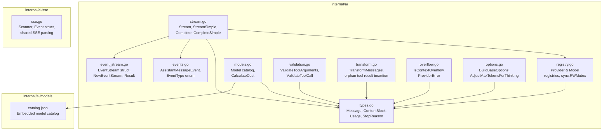

# 01: AI Core Types, Event Stream, Registries

**Status:** Draft
**Depends on:** —
**Depended on by:** 02-provider-anthropic, 03-provider-openai, 04-provider-google, 05-agent
**Implements:** Foundation types, streaming infrastructure, registries, model catalog, validation, message transformation, SSE parsing

---

## 1. Overview

This plan covers everything in the `ai` package except provider implementations. It is the foundation that all providers and the agent package build on. After this plan is implemented, the package should compile, pass all unit tests, and satisfy milestone gate G1.

**Scope:**
- Core types (Message, ContentBlock, Tool, Usage, Events, StreamOptions)
- EventStream channel wrapper
- Provider and Model registries with thread-safe access
- Model catalog with cost calculation (embedded JSON)
- JSON Schema tool argument validation
- Cross-provider message transformation
- Context overflow detection (ProviderError)
- Shared SSE parsing utilities
- Thinking level / budget calculation utilities

**Out of scope:**
- Provider implementations (plans 02-04)
- Agent types and loop (plan 05)
- OAuth (V2)

---

## 2. Architecture

### 2.1 Component Diagram



### 2.2 Import Flow

```
internal/ai/sse          → stdlib only (net/http, bufio, strings)
internal/ai/models       → embedded JSON data, no code deps
internal/ai              → internal/ai/sse, internal/ai/models, jsonschema lib
```

No circular imports. The `sse` sub-package is a leaf. Provider packages (plans 02-04) import `internal/ai` and `internal/ai/sse` but are never imported by them.

---

## 3. Core Types

### 3.1 Message Types

```go
// message.go

// Message is the sealed interface for conversation messages.
// Concrete types: UserMessage, AssistantMessage, ToolResultMessage.
type Message interface {
    messageRole() Role
    GetTimestamp() int64
}

type Role string

const (
    RoleUser      Role = "user"
    RoleAssistant Role = "assistant"
    RoleToolResult Role = "toolResult"
)

// UserMessage represents a user turn in the conversation.
type UserMessage struct {
    Content   []ContentBlock // TextContent | ImageContent
    Timestamp int64          // Unix milliseconds
}

func (m *UserMessage) messageRole() Role    { return RoleUser }
func (m *UserMessage) GetTimestamp() int64   { return m.Timestamp }

// AssistantMessage represents an LLM response.
type AssistantMessage struct {
    Content      []ContentBlock // TextContent | ThinkingContent | ToolCall
    API          string
    Provider     string
    Model        string
    Usage        Usage
    StopReason   StopReason
    ErrorMessage string
    Timestamp    int64
}

func (m *AssistantMessage) messageRole() Role  { return RoleAssistant }
func (m *AssistantMessage) GetTimestamp() int64 { return m.Timestamp }

// ToolResultMessage represents the result of a tool execution.
type ToolResultMessage struct {
    ToolCallID string
    ToolName   string
    Content    []ContentBlock // TextContent | ImageContent
    IsError    bool
    Timestamp  int64
}

func (m *ToolResultMessage) messageRole() Role  { return RoleToolResult }
func (m *ToolResultMessage) GetTimestamp() int64 { return m.Timestamp }
```

**Design decisions:**
- Pointer receivers on all Message methods — messages are passed as `*UserMessage` etc., which satisfies the `Message` interface. This avoids value copies and is consistent with Go convention for types that hold slices/maps.
- `Timestamp` in Unix milliseconds (matching TS). Go's `time.Time` would be more idiomatic, but milliseconds match the JSON wire format and TS reference, avoiding conversion overhead. Helper: `func TimeToMillis(t time.Time) int64` and `func MillisToTime(ms int64) time.Time`.
- `Role` as a string type with constants, not iota — matches JSON serialization naturally.

### 3.2 Content Block Types

```go
// content.go

// ContentBlock is the sealed interface for message content.
// Concrete types: TextContent, ThinkingContent, ImageContent, ToolCall.
type ContentBlock interface {
    contentBlockType() ContentType
}

type ContentType string

const (
    ContentTypeText     ContentType = "text"
    ContentTypeThinking ContentType = "thinking"
    ContentTypeImage    ContentType = "image"
    ContentTypeToolCall ContentType = "toolCall"
)

type TextContent struct {
    Text          string
    TextSignature string // optional, provider-specific (e.g., OpenAI message ID)
}

func (c *TextContent) contentBlockType() ContentType { return ContentTypeText }

type ThinkingContent struct {
    Thinking          string
    ThinkingSignature string // optional, encrypted reasoning (OpenAI)
    Redacted          bool   // true if thinking was redacted by safety filters
}

func (c *ThinkingContent) contentBlockType() ContentType { return ContentTypeThinking }

type ImageContent struct {
    Data     string // base64 encoded
    MimeType string // e.g., "image/jpeg", "image/png"
}

func (c *ImageContent) contentBlockType() ContentType { return ContentTypeImage }

type ToolCall struct {
    ID               string
    Name             string
    Arguments        map[string]any
    ThoughtSignature string // optional, Google-specific (reuse thought context)
}

func (c *ToolCall) contentBlockType() ContentType { return ContentTypeToolCall }
```

### 3.3 Usage & Cost

```go
// usage.go

type Usage struct {
    Input      int
    Output     int
    CacheRead  int
    CacheWrite int
    TotalTokens int
    Cost       UsageCost
}

type UsageCost struct {
    Input      float64
    Output     float64
    CacheRead  float64
    CacheWrite float64
    Total      float64
}
```

### 3.4 Stop Reason

```go
type StopReason string

const (
    StopReasonStop    StopReason = "stop"
    StopReasonLength  StopReason = "length"
    StopReasonToolUse StopReason = "toolUse"
    StopReasonError   StopReason = "error"
    StopReasonAborted StopReason = "aborted"
)
```

### 3.5 Tool Definition

```go
// tool.go

type Tool struct {
    Name        string
    Description string
    Parameters  json.RawMessage // JSON Schema object
}
```

### 3.6 Context (Conversation State)

```go
// context.go

type Context struct {
    SystemPrompt string
    Messages     []Message
    Tools        []Tool
}
```

### 3.7 Stream Options

```go
// options.go

type ThinkingLevel string

const (
    ThinkingMinimal ThinkingLevel = "minimal"
    ThinkingLow     ThinkingLevel = "low"
    ThinkingMedium  ThinkingLevel = "medium"
    ThinkingHigh    ThinkingLevel = "high"
    ThinkingXHigh   ThinkingLevel = "xhigh"
)

type CacheRetention string

const (
    CacheRetentionNone  CacheRetention = "none"
    CacheRetentionShort CacheRetention = "short"
    CacheRetentionLong  CacheRetention = "long"
)

type StreamOptions struct {
    Temperature    *float64          // nil = provider default
    MaxTokens      *int              // nil = computed from model
    APIKey         string
    SessionID      string
    CacheRetention CacheRetention
    Headers        map[string]string
    MaxRetryDelayMs int
    Metadata       map[string]any
    OnPayload      func(payload any) // debug callback for raw payloads
}

type SimpleStreamOptions struct {
    StreamOptions
    Reasoning       ThinkingLevel
    ThinkingBudgets *ThinkingBudgets
}

type ThinkingBudgets struct {
    Minimal *int
    Low     *int
    Medium  *int
    High    *int
}
```

Note: cancellation via `context.Context` parameter on `Stream`/`StreamSimple`, not in options.

---

## 4. Event Types & EventStream

### 4.1 Event Types

```go
// events.go

type EventType string

const (
    EventStart         EventType = "start"
    EventTextStart     EventType = "text_start"
    EventTextDelta     EventType = "text_delta"
    EventTextEnd       EventType = "text_end"
    EventThinkingStart EventType = "thinking_start"
    EventThinkingDelta EventType = "thinking_delta"
    EventThinkingEnd   EventType = "thinking_end"
    EventToolCallStart EventType = "toolcall_start"
    EventToolCallDelta EventType = "toolcall_delta"
    EventToolCallEnd   EventType = "toolcall_end"
    EventDone          EventType = "done"
    EventError         EventType = "error"
)

// AssistantMessageEvent is the tagged union of streaming events.
// Fields are populated based on Type.
type AssistantMessageEvent struct {
    Type         EventType
    ContentIndex int               // for delta/start/end events
    Delta        string            // for delta events
    Content      string            // for end events (full accumulated text)
    ToolCall     *ToolCall         // for toolcall_end
    Partial      *AssistantMessage // progressive snapshot (all non-done/error)
    Message      *AssistantMessage // final message (done event)
    Error        *AssistantMessage // error message (error event)
    Reason       StopReason        // for done/error
}
```

### 4.2 EventStream

The Go equivalent of the TS `EventStream<T, R>`. Uses channels instead of async iterators.

```go
// event_stream.go

const defaultEventBufferSize = 32

// EventStream wraps a buffered channel for streaming AssistantMessageEvents.
// Providers push events via Send(). Consumers read from C or call Result().
//
// Terminal-state contract: Result() is guaranteed to unblock exactly once.
// Either Send() delivers a done/error event, or Close() injects an internal
// ErrStreamClosedWithoutTerminalEvent. The terminated flag (atomic) ensures
// exactly one terminal result is published, even under races between
// Send(done/error) and Close().
type EventStream struct {
    // C is the read-side of the event channel. Consumers range over this.
    C <-chan AssistantMessageEvent

    ch         chan AssistantMessageEvent // internal write side
    result     chan resultOrError         // final result delivery (buffered 1)
    closeOnce  sync.Once                 // ensure channel close is idempotent
    terminated atomic.Bool               // true after terminal result published
}

// ErrStreamClosedWithoutTerminalEvent is returned by Result() when the
// provider goroutine closed the stream (or panicked) without sending a
// done or error event.
var ErrStreamClosedWithoutTerminalEvent = errors.New("event stream closed without terminal done/error event")

type resultOrError struct {
    Message AssistantMessage
    Err     error
}

// NewEventStream creates a new EventStream with a buffered channel.
func NewEventStream() *EventStream {
    ch := make(chan AssistantMessageEvent, defaultEventBufferSize)
    return &EventStream{
        C:      ch,
        ch:     ch,
        result: make(chan resultOrError, 1),
    }
}

// Send pushes an event into the stream. Called by providers.
// If the event is a "done" or "error" event, it also delivers the final result
// (guarded by the terminated flag to prevent double-publish).
// Panics if called after Close().
func (s *EventStream) Send(event AssistantMessageEvent) {
    s.ch <- event

    switch event.Type {
    case EventDone:
        if event.Message != nil && s.terminated.CompareAndSwap(false, true) {
            s.result <- resultOrError{Message: *event.Message}
        }
    case EventError:
        if event.Error != nil && s.terminated.CompareAndSwap(false, true) {
            s.result <- resultOrError{
                Message: *event.Error,
                Err:     providerErrorFromMessage(event.Error),
            }
        }
    }
}

// Close closes the event channel. Must be called by the provider goroutine
// (typically via defer). Idempotent.
//
// If no terminal event (done/error) was sent before Close(), an internal
// error result is injected so that Result() never blocks forever. This
// handles provider panics and early-return paths.
func (s *EventStream) Close() {
    s.closeOnce.Do(func() {
        close(s.ch)
        // If no terminal event was published, inject one so Result() unblocks
        if s.terminated.CompareAndSwap(false, true) {
            s.result <- resultOrError{
                Message: AssistantMessage{
                    StopReason:   StopReasonError,
                    ErrorMessage: ErrStreamClosedWithoutTerminalEvent.Error(),
                    Timestamp:    TimeToMillis(time.Now()),
                },
                Err: ErrStreamClosedWithoutTerminalEvent,
            }
        }
    })
}

// Result blocks until the stream completes and returns the final AssistantMessage.
// Returns an error if the stream ended with an error event or was closed
// without a terminal event.
// This is the blocking convenience API — callers who don't need streaming use this.
// Guaranteed to unblock exactly once due to the terminal-state contract.
func (s *EventStream) Result() (AssistantMessage, error) {
    r := <-s.result
    return r.Message, r.Err
}

// Drain consumes all events from the stream, discarding them, and returns the result.
// Useful when the caller only wants the final message.
func (s *EventStream) Drain() (AssistantMessage, error) {
    for range s.C {
        // discard
    }
    return s.Result()
}
```

**Key design decisions:**

1. **Buffer size 32**: Matches architecture doc. Absorbs SSE burst without blocking provider goroutine. Small enough that backpressure is detectable.

2. **Separate result channel**: The result channel has buffer size 1 — the final message is pushed once when `done`/`error` is sent. `Result()` reads from this channel independently of the event channel. This means a consumer can call `Result()` without draining events (useful for `Complete()`).

3. **`Send` pushes to both channels**: The done/error event goes to both `ch` (for consumers iterating events) and `result` (for consumers calling `Result()`). This mirrors the TS pattern where `isComplete` triggers the final result promise.

4. **Terminal-state guarantee via `atomic.Bool`**: The `terminated` flag ensures exactly one terminal result is published to the `result` channel. Both `Send(done/error)` and `Close()` use `CompareAndSwap(false, true)` — whichever wins publishes, the loser is a no-op. This prevents races between a provider sending a terminal event and `Close()` firing (e.g., via `defer` after a panic). `Close()` injects `ErrStreamClosedWithoutTerminalEvent` if no terminal event was sent, guaranteeing `Result()` never blocks forever.

5. **Idempotent Close**: `sync.Once` prevents double-close panics. Providers call `defer es.Close()` in their goroutine.

6. **`Drain()` helper**: For `Complete()` — iterates the channel to completion, then returns `Result()`. Safe because `Result()` is guaranteed to unblock (terminal-state contract).

### 4.3 Provider Goroutine Pattern

Every provider follows this pattern:

```go
func (p *SomeProvider) Stream(ctx context.Context, model Model, llmCtx Context, opts StreamOptions) *EventStream {
    es := NewEventStream()

    go func() {
        defer es.Close()

        // 1. Build HTTP request
        // 2. Start SSE connection
        // 3. Parse SSE events, send typed events via es.Send()
        // 4. On completion: es.Send(done event)
        // 5. On error: es.Send(error event)
        // 6. Context cancellation: es.Send(error event with aborted reason)
    }()

    return es
}
```

The `defer es.Close()` ensures the channel is always closed, even on panic. The consumer sees the channel close and stops ranging.

---

## 5. Provider & Model Registries

### 5.1 Provider Interface

```go
// provider.go

// Provider is the interface each LLM backend implements.
type Provider interface {
    // API returns the API identifier (e.g., "anthropic-messages", "openai-completions").
    API() string

    // Stream starts a streaming LLM call with provider-specific options.
    Stream(ctx context.Context, model Model, llmCtx Context, opts StreamOptions) *EventStream

    // StreamSimple is the high-level API that maps ThinkingLevel to provider-specific params.
    StreamSimple(ctx context.Context, model Model, llmCtx Context, opts SimpleStreamOptions) *EventStream
}
```

### 5.2 Provider Registry

```go
// registry.go

var (
    providerMu       sync.RWMutex
    providerRegistry = make(map[string]registeredProvider)
)

type registeredProvider struct {
    provider Provider
    sourceID string // for bulk unregistration
}

// RegisterProvider registers a provider for its API identifier.
// Safe to call concurrently and at any time (not just init).
func RegisterProvider(p Provider, sourceID string) {
    providerMu.Lock()
    defer providerMu.Unlock()
    providerRegistry[p.API()] = registeredProvider{provider: p, sourceID: sourceID}
}

// GetProvider returns the provider for the given API, or an error if not registered.
func GetProvider(api string) (Provider, error) {
    providerMu.RLock()
    defer providerMu.RUnlock()
    rp, ok := providerRegistry[api]
    if !ok {
        return nil, fmt.Errorf("no provider registered for API: %s", api)
    }
    return rp.provider, nil
}

// GetProviders returns all registered providers.
func GetProviders() []Provider {
    providerMu.RLock()
    defer providerMu.RUnlock()
    providers := make([]Provider, 0, len(providerRegistry))
    for _, rp := range providerRegistry {
        providers = append(providers, rp.provider)
    }
    return providers
}

// UnregisterProviders removes all providers registered with the given sourceID.
func UnregisterProviders(sourceID string) {
    providerMu.Lock()
    defer providerMu.Unlock()
    for api, rp := range providerRegistry {
        if rp.sourceID == sourceID {
            delete(providerRegistry, api)
        }
    }
}

// ClearProviders removes all registered providers. Intended for testing.
func ClearProviders() {
    providerMu.Lock()
    defer providerMu.Unlock()
    providerRegistry = make(map[string]registeredProvider)
}
```

### 5.3 Model Registry

```go
// models.go (registry portion)

var (
    modelMu       sync.RWMutex
    modelRegistry = make(map[string]map[string]Model) // provider → modelID → Model
)

// RegisterModel registers a model under its provider.
// Deep-copies mutable fields (Headers, Compat) to prevent external mutation
// of registry state after registration.
func RegisterModel(m Model) {
    m = deepCopyModel(m)
    modelMu.Lock()
    defer modelMu.Unlock()
    providerModels, ok := modelRegistry[m.Provider]
    if !ok {
        providerModels = make(map[string]Model)
        modelRegistry[m.Provider] = providerModels
    }
    providerModels[m.ID] = m
}

// GetModel returns a deep copy of the model for the given provider and model ID.
// Callers may freely mutate the returned Model without affecting registry state.
func GetModel(provider, modelID string) (Model, error) {
    modelMu.RLock()
    defer modelMu.RUnlock()
    providerModels, ok := modelRegistry[provider]
    if !ok {
        return Model{}, fmt.Errorf("no models registered for provider: %s", provider)
    }
    model, ok := providerModels[modelID]
    if !ok {
        return Model{}, fmt.Errorf("model %q not found for provider %q", modelID, provider)
    }
    return deepCopyModel(model), nil
}

// GetModels returns deep copies of all models for the given provider.
func GetModels(provider string) []Model {
    modelMu.RLock()
    defer modelMu.RUnlock()
    providerModels := modelRegistry[provider]
    models := make([]Model, 0, len(providerModels))
    for _, m := range providerModels {
        models = append(models, deepCopyModel(m))
    }
    return models
}

// deepCopyModel returns a deep copy of a Model, cloning mutable reference
// fields (Headers map, Compat pointer with its map members, Input slice).
func deepCopyModel(m Model) Model {
    if m.Headers != nil {
        h := make(map[string]string, len(m.Headers))
        for k, v := range m.Headers {
            h[k] = v
        }
        m.Headers = h
    }
    if m.Input != nil {
        inp := make([]string, len(m.Input))
        copy(inp, m.Input)
        m.Input = inp
    }
    if m.Compat != nil {
        c := *m.Compat
        if c.ReasoningEffortMap != nil {
            rem := make(map[string]string, len(c.ReasoningEffortMap))
            for k, v := range c.ReasoningEffortMap {
                rem[k] = v
            }
            c.ReasoningEffortMap = rem
        }
        m.Compat = &c
    }
    return m
}

// GetModelProviders returns all provider names that have registered models.
func GetModelProviders() []string {
    modelMu.RLock()
    defer modelMu.RUnlock()
    providers := make([]string, 0, len(modelRegistry))
    for p := range modelRegistry {
        providers = append(providers, p)
    }
    return providers
}

// ClearModels removes all registered models. Intended for testing.
func ClearModels() {
    modelMu.Lock()
    defer modelMu.Unlock()
    modelRegistry = make(map[string]map[string]Model)
}
```

---

## 6. Model Catalog

### 6.1 Model Struct

```go
type Model struct {
    ID            string            `json:"id"`
    Name          string            `json:"name"`
    API           string            `json:"api"`
    Provider      string            `json:"provider"`
    BaseURL       string            `json:"baseUrl"`
    Reasoning     bool              `json:"reasoning"`
    Input         []string          `json:"input"`          // "text", "image"
    Cost          ModelCost         `json:"cost"`
    ContextWindow int               `json:"contextWindow"`
    MaxTokens     int               `json:"maxTokens"`
    Headers       map[string]string `json:"headers,omitempty"`
    Compat        *ModelCompat      `json:"compat,omitempty"` // provider-specific compat flags
}

type ModelCost struct {
    Input      float64 `json:"input"`      // $/million tokens
    Output     float64 `json:"output"`     // $/million tokens
    CacheRead  float64 `json:"cacheRead"`  // $/million tokens
    CacheWrite float64 `json:"cacheWrite"` // $/million tokens
}

// ModelCompat holds provider-specific compatibility flags.
// Only populated for providers that need them (OpenAI-compatible endpoints).
type ModelCompat struct {
    // OpenAI Completions API compat
    SupportsStore             *bool              `json:"supportsStore,omitempty"`
    SupportsDeveloperRole     *bool              `json:"supportsDeveloperRole,omitempty"`
    SupportsReasoningEffort   *bool              `json:"supportsReasoningEffort,omitempty"`
    ReasoningEffortMap        map[string]string   `json:"reasoningEffortMap,omitempty"`
    SupportsUsageInStreaming   *bool              `json:"supportsUsageInStreaming,omitempty"`
    MaxTokensField            string             `json:"maxTokensField,omitempty"`
    RequiresToolResultName    *bool              `json:"requiresToolResultName,omitempty"`
    RequiresAssistantAfterToolResult *bool       `json:"requiresAssistantAfterToolResult,omitempty"`
    RequiresThinkingAsText    *bool              `json:"requiresThinkingAsText,omitempty"`
    RequiresMistralToolIds    *bool              `json:"requiresMistralToolIds,omitempty"`
    ThinkingFormat            string             `json:"thinkingFormat,omitempty"`
    SupportsStrictMode        *bool              `json:"supportsStrictMode,omitempty"`
}
```

### 6.2 Embedded Catalog

The model catalog is stored as embedded JSON, loaded at `init()` time:

```go
//go:embed models/catalog.json
var catalogJSON []byte

func init() {
    var catalog map[string]map[string]Model
    if err := json.Unmarshal(catalogJSON, &catalog); err != nil {
        panic(fmt.Sprintf("failed to load model catalog: %v", err))
    }
    for provider, models := range catalog {
        for id, m := range models {
            m.ID = id
            m.Provider = provider
            RegisterModel(m)
        }
    }
}
```

**Catalog generation**: The `catalog.json` file is generated from the same source as the TS `models.generated.ts`. For V1, we'll manually create it from the TS source. A code generator can be added later.

**Catalog format**: Nested JSON matching the TS structure:

```json
{
  "anthropic": {
    "claude-sonnet-4-20250514": {
      "name": "Claude Sonnet 4",
      "api": "anthropic-messages",
      "baseUrl": "https://api.anthropic.com",
      "reasoning": true,
      "input": ["text", "image"],
      "cost": { "input": 3, "output": 15, "cacheRead": 0.3, "cacheWrite": 3.75 },
      "contextWindow": 200000,
      "maxTokens": 16384
    }
  }
}
```

### 6.3 Cost Calculation

```go
// CalculateCost computes the cost for the given model and usage,
// populating usage.Cost fields. Costs are in dollars.
// Model costs are stored as $/million tokens.
func CalculateCost(model Model, usage *Usage) {
    usage.Cost.Input = (model.Cost.Input / 1_000_000) * float64(usage.Input)
    usage.Cost.Output = (model.Cost.Output / 1_000_000) * float64(usage.Output)
    usage.Cost.CacheRead = (model.Cost.CacheRead / 1_000_000) * float64(usage.CacheRead)
    usage.Cost.CacheWrite = (model.Cost.CacheWrite / 1_000_000) * float64(usage.CacheWrite)
    usage.Cost.Total = usage.Cost.Input + usage.Cost.Output + usage.Cost.CacheRead + usage.Cost.CacheWrite
}
```

### 6.4 Model Utilities

```go
// ModelsEqual checks if two models are the same (by ID and Provider).
func ModelsEqual(a, b *Model) bool {
    if a == nil || b == nil {
        return a == b
    }
    return a.ID == b.ID && a.Provider == b.Provider
}

// SupportsXHigh checks if a model supports the "xhigh" thinking level.
// Currently only specific Opus-class models.
func SupportsXHigh(model Model) bool {
    switch model.API {
    case "anthropic-messages":
        return strings.Contains(model.ID, "opus-4-6") ||
            strings.Contains(model.ID, "opus-4.6")
    case "openai-completions":
        return strings.Contains(model.ID, "gpt-5.2") ||
            strings.Contains(model.ID, "gpt-5.3")
    default:
        return false
    }
}
```

---

## 7. Stream Entry Points

These are the top-level functions that consumers call. They resolve the provider from the registry and delegate.

```go
// stream.go

// Stream starts a streaming LLM call using the provider registered for model.API.
func Stream(ctx context.Context, model Model, llmCtx Context, opts StreamOptions) *EventStream {
    p, err := GetProvider(model.API)
    if err != nil {
        return errorStream(err)
    }
    return p.Stream(ctx, model, llmCtx, opts)
}

// StreamSimple starts a streaming LLM call with simplified options (ThinkingLevel mapping).
func StreamSimple(ctx context.Context, model Model, llmCtx Context, opts SimpleStreamOptions) *EventStream {
    p, err := GetProvider(model.API)
    if err != nil {
        return errorStream(err)
    }
    return p.StreamSimple(ctx, model, llmCtx, opts)
}

// Complete makes a blocking LLM call and returns the final AssistantMessage.
func Complete(ctx context.Context, model Model, llmCtx Context, opts StreamOptions) (AssistantMessage, error) {
    return Stream(ctx, model, llmCtx, opts).Drain()
}

// CompleteSimple makes a blocking LLM call with simplified options.
func CompleteSimple(ctx context.Context, model Model, llmCtx Context, opts SimpleStreamOptions) (AssistantMessage, error) {
    return StreamSimple(ctx, model, llmCtx, opts).Drain()
}

// errorStream creates an EventStream that immediately emits an error event.
func errorStream(err error) *EventStream {
    es := NewEventStream()
    go func() {
        defer es.Close()
        es.Send(AssistantMessageEvent{
            Type:   EventError,
            Reason: StopReasonError,
            Error: &AssistantMessage{
                StopReason:   StopReasonError,
                ErrorMessage: err.Error(),
                Timestamp:    TimeToMillis(time.Now()),
            },
        })
    }()
    return es
}
```

---

## 8. Thinking Level & Budget Utilities

### 8.1 BuildBaseOptions

```go
// options.go

// BuildBaseOptions converts SimpleStreamOptions to StreamOptions,
// stripping the reasoning/thinking fields for the raw provider API.
func BuildBaseOptions(model Model, opts *SimpleStreamOptions, apiKey string) StreamOptions {
    var so StreamOptions
    if opts != nil {
        so = opts.StreamOptions
    }
    if so.MaxTokens == nil {
        maxTok := min(model.MaxTokens, 32000)
        so.MaxTokens = &maxTok
    }
    if apiKey != "" && so.APIKey == "" {
        so.APIKey = apiKey
    }
    return so
}
```

### 8.2 ClampReasoning

```go
// ClampReasoning reduces xhigh to high for providers that don't support it.
func ClampReasoning(level ThinkingLevel) ThinkingLevel {
    if level == ThinkingXHigh {
        return ThinkingHigh
    }
    return level
}
```

### 8.3 AdjustMaxTokensForThinking

```go
// AdjustMaxTokensForThinking computes maxTokens and thinkingBudget
// based on the base max tokens, model capacity, and reasoning level.
func AdjustMaxTokensForThinking(
    baseMaxTokens int,
    modelMaxTokens int,
    level ThinkingLevel,
    budgets *ThinkingBudgets,
) (maxTokens int, thinkingBudget int) {
    defaults := map[ThinkingLevel]int{
        ThinkingMinimal: 1024,
        ThinkingLow:     2048,
        ThinkingMedium:  8192,
        ThinkingHigh:    16384,
    }

    clamped := ClampReasoning(level)
    thinkingBudget = defaults[clamped]

    // Override with custom budgets if provided
    if budgets != nil {
        switch clamped {
        case ThinkingMinimal:
            if budgets.Minimal != nil { thinkingBudget = *budgets.Minimal }
        case ThinkingLow:
            if budgets.Low != nil { thinkingBudget = *budgets.Low }
        case ThinkingMedium:
            if budgets.Medium != nil { thinkingBudget = *budgets.Medium }
        case ThinkingHigh:
            if budgets.High != nil { thinkingBudget = *budgets.High }
        }
    }

    maxTokens = min(baseMaxTokens+thinkingBudget, modelMaxTokens)

    // Ensure minimum 1024 tokens for output
    const minOutputTokens = 1024
    if maxTokens <= thinkingBudget {
        thinkingBudget = max(0, maxTokens-minOutputTokens)
    }

    return maxTokens, thinkingBudget
}
```

---

## 9. JSON Schema Validation

### 9.1 Library Choice

Use `github.com/santhosh-tekuri/jsonschema/v6` for validation. Reasons:
- Active maintenance, well-tested
- Supports Draft 2020-12 (latest)
- No CGO dependency
- Good error messages with JSON paths

**Type coercion**: The TS version uses AJV with `coerceTypes: true`, which auto-converts `"123"` → `123` for integer fields. The `santhosh-tekuri` library doesn't support coercion natively. We implement a pre-validation coercion pass:

```go
// coerce.go

// CoerceTypes attempts to coerce argument values to match their JSON Schema types.
// This handles LLM output that sends "123" instead of 123 for integer fields.
// Modifies args in-place. Returns a copy of the coerced arguments.
func CoerceTypes(schema json.RawMessage, args map[string]any) map[string]any {
    // Parse schema to extract property types
    // Walk args and coerce string values to their target types:
    //   "123" → 123 (integer)
    //   "1.5" → 1.5 (number)
    //   "true" → true (boolean)
    //   "null" → nil
    // Nested objects: recurse into sub-schemas
    // Arrays: coerce each element
    // On coercion failure: leave original value (validation will catch it)
    return coerced
}
```

### 9.2 Validation Functions

```go
// validation.go

// ValidateToolArguments validates tool call arguments against the tool's JSON Schema.
// Arguments are coerced (e.g., string "123" → int 123) before validation.
// Returns nil if valid, or a descriptive error with paths.
func ValidateToolArguments(tool Tool, args map[string]any) error {
    if len(tool.Parameters) == 0 {
        return nil // no schema = no validation
    }

    coerced := CoerceTypes(tool.Parameters, args)

    schema, err := jsonschema.CompileString("tool.json", string(tool.Parameters))
    if err != nil {
        return fmt.Errorf("invalid tool schema for %q: %w", tool.Name, err)
    }

    // Convert coerced args to interface{} for validation
    if err := schema.Validate(coerced); err != nil {
        return formatValidationError(tool.Name, args, err)
    }

    // Copy coerced values back into args (mutation, matching TS behavior)
    for k, v := range coerced {
        args[k] = v
    }
    return nil
}

// ValidateToolCall finds the tool by name and validates the tool call's arguments.
func ValidateToolCall(tools []Tool, tc ToolCall) error {
    for _, tool := range tools {
        if tool.Name == tc.Name {
            return ValidateToolArguments(tool, tc.Arguments)
        }
    }
    return fmt.Errorf("unknown tool: %q", tc.Name)
}
```

### 9.3 Schema Compilation Cache

Compiling JSON Schema on every validation is expensive. Cache compiled schemas keyed by schema content hash:

```go
var (
    schemaCacheMu sync.RWMutex
    schemaCache    = make(map[uint64]*jsonschema.Schema)
)

func compileSchema(raw json.RawMessage) (*jsonschema.Schema, error) {
    h := xxhash.Sum64(raw)

    schemaCacheMu.RLock()
    if s, ok := schemaCache[h]; ok {
        schemaCacheMu.RUnlock()
        return s, nil
    }
    schemaCacheMu.RUnlock()

    s, err := jsonschema.CompileString("tool.json", string(raw))
    if err != nil {
        return nil, err
    }

    schemaCacheMu.Lock()
    schemaCache[h] = s
    schemaCacheMu.Unlock()
    return s, nil
}
```

---

## 10. Cross-Provider Message Transformation

### 10.1 TransformMessages

Two-pass algorithm matching the TS reference exactly.

```go
// transform.go

// ToolCallIDNormalizer is called for each tool call when transforming messages
// for a different model. It returns the normalized ID for the target provider.
type ToolCallIDNormalizer func(id string, model Model, source *AssistantMessage) string

// TransformMessages transforms a conversation for replay on a (possibly different) model.
// Handles:
// - Stripping/converting thinking blocks for cross-model replay
// - Normalizing tool call IDs for different provider format requirements
// - Inserting synthetic tool results for orphaned tool calls
// - Skipping errored/aborted assistant messages
func TransformMessages(
    messages []Message,
    targetModel Model,
    normalizeToolCallID ToolCallIDNormalizer,
) []Message {
    // Pass 1: transform content
    toolCallIDMap := make(map[string]string) // original → normalized
    var transformed []Message

    for _, msg := range messages {
        switch m := msg.(type) {
        case *UserMessage:
            transformed = append(transformed, m)

        case *AssistantMessage:
            t := transformAssistantMessage(m, targetModel, normalizeToolCallID, toolCallIDMap)
            if t != nil {
                transformed = append(transformed, t)
            }

        case *ToolResultMessage:
            t := transformToolResult(m, toolCallIDMap)
            transformed = append(transformed, t)
        }
    }

    // Pass 2: insert synthetic tool results for orphaned tool calls
    return insertSyntheticToolResults(transformed)
}
```

### 10.2 Assistant Message Transformation

```go
func transformAssistantMessage(
    msg *AssistantMessage,
    targetModel Model,
    normalizeID ToolCallIDNormalizer,
    idMap map[string]string,
) *AssistantMessage {
    // Skip errored/aborted messages entirely
    if msg.StopReason == StopReasonError || msg.StopReason == StopReasonAborted {
        return nil
    }

    sameModel := msg.Provider == targetModel.Provider &&
        msg.API == targetModel.API &&
        msg.Model == targetModel.ID

    var newContent []ContentBlock
    for _, block := range msg.Content {
        switch b := block.(type) {
        case *TextContent:
            if sameModel {
                newContent = append(newContent, b)
            } else {
                // Strip signature for cross-model
                newContent = append(newContent, &TextContent{Text: b.Text})
            }

        case *ThinkingContent:
            if sameModel {
                newContent = append(newContent, b)
            } else if b.Redacted {
                // Drop redacted thinking entirely (encrypted, unusable cross-model)
                continue
            } else if b.Thinking != "" {
                // Convert to text block for cross-model
                newContent = append(newContent, &TextContent{Text: b.Thinking})
            }
            // Empty non-redacted thinking: drop

        case *ToolCall:
            tc := &ToolCall{
                ID:        b.ID,
                Name:      b.Name,
                Arguments: b.Arguments,
            }
            if sameModel {
                tc.ThoughtSignature = b.ThoughtSignature
            }
            if normalizeID != nil && !sameModel {
                newID := normalizeID(b.ID, targetModel, msg)
                if newID != b.ID {
                    idMap[b.ID] = newID
                    tc.ID = newID
                }
            }
            newContent = append(newContent, tc)
        }
    }

    if len(newContent) == 0 {
        return nil
    }

    return &AssistantMessage{
        Content:    newContent,
        API:        msg.API,
        Provider:   msg.Provider,
        Model:      msg.Model,
        Usage:      msg.Usage,
        StopReason: msg.StopReason,
        Timestamp:  msg.Timestamp,
    }
}
```

### 10.3 Tool Result Normalization

```go
func transformToolResult(msg *ToolResultMessage, idMap map[string]string) *ToolResultMessage {
    newID := msg.ToolCallID
    if mapped, ok := idMap[msg.ToolCallID]; ok {
        newID = mapped
    }
    if newID == msg.ToolCallID {
        return msg // unchanged
    }
    return &ToolResultMessage{
        ToolCallID: newID,
        ToolName:   msg.ToolName,
        Content:    msg.Content,
        IsError:    msg.IsError,
        Timestamp:  msg.Timestamp,
    }
}
```

### 10.4 Synthetic Tool Result Insertion

```go
// insertSyntheticToolResults inserts synthetic error results for tool calls
// that have no corresponding ToolResultMessage in the conversation.
// Synthetic results are inserted in sorted order by tool call ID for
// deterministic output (Go map iteration is non-deterministic).
func insertSyntheticToolResults(messages []Message) []Message {
    var result []Message
    pendingToolCalls := make(map[string]*ToolCall) // callID → ToolCall

    for _, msg := range messages {
        switch m := msg.(type) {
        case *AssistantMessage:
            // Before adding this assistant message, flush any pending tool calls
            // from the PREVIOUS assistant message that weren't answered.
            // Sort by ID for deterministic output.
            if len(pendingToolCalls) > 0 {
                ids := make([]string, 0, len(pendingToolCalls))
                for id := range pendingToolCalls {
                    ids = append(ids, id)
                }
                sort.Strings(ids)
                for _, id := range ids {
                    tc := pendingToolCalls[id]
                    result = append(result, &ToolResultMessage{
                        ToolCallID: id,
                        ToolName:   tc.Name,
                        Content:    []ContentBlock{&TextContent{Text: "No result provided"}},
                        IsError:    true,
                        Timestamp:  m.GetTimestamp(),
                    })
                }
                pendingToolCalls = make(map[string]*ToolCall)
            }

            // Track new tool calls from this message
            for _, block := range m.Content {
                if tc, ok := block.(*ToolCall); ok {
                    pendingToolCalls[tc.ID] = tc
                }
            }
            result = append(result, m)

        case *ToolResultMessage:
            delete(pendingToolCalls, m.ToolCallID)
            result = append(result, m)

        default:
            result = append(result, m)
        }
    }

    // Flush any remaining pending tool calls at the end.
    // Sort by ID for deterministic output.
    if len(pendingToolCalls) > 0 {
        now := TimeToMillis(time.Now())
        ids := make([]string, 0, len(pendingToolCalls))
        for id := range pendingToolCalls {
            ids = append(ids, id)
        }
        sort.Strings(ids)
        for _, id := range ids {
            tc := pendingToolCalls[id]
            result = append(result, &ToolResultMessage{
                ToolCallID: id,
                ToolName:   tc.Name,
                Content:    []ContentBlock{&TextContent{Text: "No result provided"}},
                IsError:    true,
                Timestamp:  now,
            })
        }
    }

    return result
}
```

---

## 11. Context Overflow Detection

### 11.1 ProviderError

```go
// errors.go

type ProviderErrorCode string

const (
    ErrContextOverflow ProviderErrorCode = "context_overflow"
    ErrRateLimit       ProviderErrorCode = "rate_limit"
    ErrAuth            ProviderErrorCode = "auth"
    ErrServerError     ProviderErrorCode = "server_error"
    ErrUnknown         ProviderErrorCode = "unknown"
)

type ProviderError struct {
    Code       ProviderErrorCode
    Message    string
    StatusCode int           // HTTP status if available
    Provider   string        // which provider produced this
    RetryAfter time.Duration // for rate limit errors
}

func (e *ProviderError) Error() string {
    return fmt.Sprintf("%s error from %s: %s", e.Code, e.Provider, e.Message)
}

// providerErrorFromMessage attempts to extract a ProviderError from an error AssistantMessage.
func providerErrorFromMessage(msg *AssistantMessage) error {
    if msg == nil || msg.StopReason != StopReasonError {
        return nil
    }
    return &ProviderError{
        Code:     classifyErrorMessage(msg.ErrorMessage),
        Message:  msg.ErrorMessage,
        Provider: msg.Provider,
    }
}
```

### 11.2 Overflow Detection

```go
// overflow.go

var overflowPatterns = []*regexp.Regexp{
    regexp.MustCompile(`(?i)prompt is too long`),
    regexp.MustCompile(`(?i)input is too long for requested model`),
    regexp.MustCompile(`(?i)exceeds the context window`),
    regexp.MustCompile(`(?i)input token count.*exceeds the maximum`),
    regexp.MustCompile(`(?i)maximum prompt length is \d+`),
    regexp.MustCompile(`(?i)reduce the length of the messages`),
    regexp.MustCompile(`(?i)maximum context length is \d+ tokens`),
    regexp.MustCompile(`(?i)exceeds the limit of \d+`),
    regexp.MustCompile(`(?i)exceeds the available context size`),
    regexp.MustCompile(`(?i)greater than the context length`),
    regexp.MustCompile(`(?i)context window exceeds limit`),
    regexp.MustCompile(`(?i)exceeded model token limit`),
    regexp.MustCompile(`(?i)context[_ ]length[_ ]exceeded`),
    regexp.MustCompile(`(?i)too many tokens`),
    regexp.MustCompile(`(?i)token limit exceeded`),
}

// IsContextOverflow checks if an AssistantMessage represents a context overflow error.
// Handles two cases:
// 1. Error-based: message has error stop reason with overflow pattern in error message
// 2. Silent overflow: usage.input exceeds contextWindow (for providers like z.ai)
func IsContextOverflow(msg *AssistantMessage, contextWindow int) bool {
    if msg.StopReason == StopReasonError && msg.ErrorMessage != "" {
        for _, p := range overflowPatterns {
            if p.MatchString(msg.ErrorMessage) {
                return true
            }
        }
        // Cerebras/Mistral: 400/413 with no body
        if regexp.MustCompile(`^4(00|13)\s*(status code)?\s*\(no body\)`).MatchString(msg.ErrorMessage) {
            return true
        }
    }

    // Silent overflow detection
    if contextWindow > 0 && msg.StopReason == StopReasonStop {
        inputTokens := msg.Usage.Input + msg.Usage.CacheRead
        if inputTokens > contextWindow {
            return true
        }
    }

    return false
}

// classifyErrorMessage attempts to classify an error message into a ProviderErrorCode.
func classifyErrorMessage(errMsg string) ProviderErrorCode {
    if errMsg == "" {
        return ErrUnknown
    }
    for _, p := range overflowPatterns {
        if p.MatchString(errMsg) {
            return ErrContextOverflow
        }
    }
    // Additional patterns can be added for rate limit, auth, etc.
    return ErrUnknown
}
```

---

## 12. SSE Parser

### 12.1 Shared SSE Parsing Utilities

Located in `internal/ai/sse/` — used by all providers.

```go
// sse/sse.go
package sse

// Event represents a single Server-Sent Event.
type Event struct {
    Type string // "event" field value, empty string if not present
    Data string // "data" field value (may span multiple lines)
    ID   string // "id" field value
}

// Scanner reads SSE events from an io.Reader.
// It handles the SSE protocol: multi-line data fields, event types,
// blank-line event delimiters, and comment lines (starting with ':').
type Scanner struct {
    scanner *bufio.Scanner
    err     error
}

// NewScanner creates an SSE scanner from an io.Reader (typically http.Response.Body).
func NewScanner(r io.Reader) *Scanner {
    return &Scanner{
        scanner: bufio.NewScanner(r),
    }
}

// Next reads the next SSE event. Returns false when the stream ends or an error occurs.
func (s *Scanner) Next() bool {
    // Read lines until blank line (event delimiter) or EOF
    // Parse "event:", "data:", "id:", and ":" (comment) prefixes
    // Accumulate multi-line data with newlines between data fields
    // Store the parsed event for retrieval via Event()
}

// Event returns the most recently parsed SSE event.
func (s *Scanner) Event() Event {
    return s.event
}

// Err returns any error encountered during scanning (excluding io.EOF).
func (s *Scanner) Err() error {
    return s.err
}
```

### 12.2 SSE Protocol Implementation

Per the [SSE specification](https://html.spec.whatwg.org/multipage/server-sent-events.html):

1. Lines starting with `:` are comments (ignored)
2. Empty lines delimit events
3. `event: <type>` sets the event type
4. `data: <text>` appends to the data buffer (with newline between multiple data lines)
5. `id: <id>` sets the last event ID
6. Lines with no `:` are treated as field name with empty value
7. BOM at start of stream should be ignored

```go
func (s *Scanner) Next() bool {
    s.event = Event{}
    var dataLines []string
    hasData := false

    for s.scanner.Scan() {
        line := s.scanner.Text()

        // Skip BOM if at start
        line = strings.TrimPrefix(line, "\xEF\xBB\xBF")

        // Empty line = end of event
        if line == "" {
            if hasData {
                s.event.Data = strings.Join(dataLines, "\n")
                return true
            }
            continue
        }

        // Comment
        if strings.HasPrefix(line, ":") {
            continue
        }

        // Parse field
        field, value, _ := strings.Cut(line, ":")
        value = strings.TrimPrefix(value, " ") // single leading space stripped per spec

        switch field {
        case "event":
            s.event.Type = value
        case "data":
            dataLines = append(dataLines, value)
            hasData = true
        case "id":
            s.event.ID = value
        }
    }

    s.err = s.scanner.Err()

    // Handle final event without trailing blank line
    if hasData {
        s.event.Data = strings.Join(dataLines, "\n")
        return true
    }

    return false
}
```

---

## 13. File Organization

```
internal/ai/
├── types.go              # Role, Message interface, UserMessage, AssistantMessage, ToolResultMessage
├── content.go            # ContentType, ContentBlock interface, TextContent, ThinkingContent, ImageContent, ToolCall
├── usage.go              # Usage, UsageCost
├── tool.go               # Tool struct
├── context.go            # Context struct
├── options.go            # StreamOptions, SimpleStreamOptions, ThinkingLevel, CacheRetention,
│                         # ThinkingBudgets, BuildBaseOptions, ClampReasoning, AdjustMaxTokensForThinking
├── events.go             # EventType, AssistantMessageEvent
├── event_stream.go       # EventStream struct, NewEventStream, Send, Close, Result, Drain
├── stream.go             # Stream, StreamSimple, Complete, CompleteSimple, errorStream
├── provider.go           # Provider interface
├── registry.go           # Provider registry (Register, Get, Unregister, Clear)
├── models.go             # Model struct, ModelCost, ModelCompat, model registry,
│                         # RegisterModel, GetModel, GetModels, GetModelProviders,
│                         # CalculateCost, ModelsEqual, SupportsXHigh, init() catalog loader
├── validation.go         # ValidateToolArguments, ValidateToolCall
├── coerce.go             # CoerceTypes (pre-validation type coercion)
├── transform.go          # TransformMessages, synthetic tool result insertion
├── errors.go             # ProviderError, ProviderErrorCode
├── overflow.go           # IsContextOverflow, overflow patterns, classifyErrorMessage
├── time.go               # TimeToMillis, MillisToTime helpers
│
├── models/
│   └── catalog.json      # Embedded model catalog (go:embed)
│
├── sse/
│   └── sse.go            # SSE Scanner, Event struct
│
└── provider/             # Provider implementations (plans 02-04, empty for now)
    ├── anthropic/
    ├── openai/
    ├── google/
    └── sse/              # (merged into internal/ai/sse above)
```

**Note:** The SSE parser lives in `internal/ai/sse/` rather than `internal/ai/provider/sse/` since it's a shared utility used by the ai package's tests as well (for mock providers in testing).

---

## 14. Public API Surface

The `ai/` top-level package re-exports from `internal/ai`:

```go
// ai/ai.go
package ai

import "github.com/user/ai-agent-go/internal/ai"

// Types
type (
    Message              = ai.Message
    UserMessage          = ai.UserMessage
    AssistantMessage     = ai.AssistantMessage
    ToolResultMessage    = ai.ToolResultMessage
    ContentBlock         = ai.ContentBlock
    TextContent          = ai.TextContent
    ThinkingContent      = ai.ThinkingContent
    ImageContent         = ai.ImageContent
    ToolCall             = ai.ToolCall
    Usage                = ai.Usage
    UsageCost            = ai.UsageCost
    Tool                 = ai.Tool
    Context              = ai.Context
    Model                = ai.Model
    ModelCost            = ai.ModelCost
    EventStream          = ai.EventStream
    AssistantMessageEvent = ai.AssistantMessageEvent
    Provider             = ai.Provider
    StreamOptions        = ai.StreamOptions
    SimpleStreamOptions  = ai.SimpleStreamOptions
    ThinkingBudgets      = ai.ThinkingBudgets
    ProviderError        = ai.ProviderError
)

// Constants
const (
    // Roles, EventTypes, StopReasons, ThinkingLevels, etc.
)

// Functions
var (
    Stream          = ai.Stream
    StreamSimple    = ai.StreamSimple
    Complete        = ai.Complete
    CompleteSimple  = ai.CompleteSimple
    RegisterProvider = ai.RegisterProvider
    GetProvider     = ai.GetProvider
    // ... etc
)
```

The exact re-export list will be determined during implementation. The principle: export everything consumers need, nothing they shouldn't touch.

---

## 15. Testing Strategy

### 15.1 Unit Tests (in-package `_test.go` files)

| Component | Test Focus | Approach |
|-----------|-----------|----------|
| EventStream | Send/receive, Result(), Drain(), Close idempotency, concurrent access | Direct channel operations, goroutine tests |
| Registry (provider) | Register/Get/Unregister, concurrent R/W, sourceID filtering | Table-driven, `-race` flag |
| Registry (model) | Register/Get, nested map, missing provider/model errors | Table-driven |
| Model catalog | Init loads all models, GetModel returns correct data | Check known models exist, verify fields |
| CalculateCost | Arithmetic correctness, edge cases (zero usage, zero cost) | Table-driven with known expected values |
| Validation | Valid args pass, invalid args fail, type coercion, missing required | Table-driven with various schemas |
| CoerceTypes | String→int, string→float, string→bool, nested objects, arrays | Table-driven |
| TransformMessages | Same-model passthrough, cross-model thinking conversion, error skip, orphan insertion | Golden tests with fixture conversations |
| IsContextOverflow | Each provider pattern matches, silent overflow, non-overflow errors | Table-driven with error strings |
| SSE Scanner | Well-formed events, multi-line data, comments, BOM, empty events, no trailing newline | Fixture-based |
| Options | BuildBaseOptions defaults, AdjustMaxTokensForThinking budget math | Table-driven |
| ModelsEqual | nil handling, same/different models | Table-driven |
| SupportsXHigh | Known opus/gpt models, unknown models | Table-driven |

### 15.2 Concurrency Tests

```go
func TestRegistryConcurrency(t *testing.T) {
    // Parallel goroutines doing:
    // - RegisterProvider
    // - GetProvider
    // - UnregisterProviders
    // - RegisterModel
    // - GetModel
    // Must pass with -race
}

func TestEventStreamConcurrency(t *testing.T) {
    // Producer goroutine sending events
    // Consumer goroutine ranging over C
    // Third goroutine calling Result()
    // Must not deadlock or race
}
```

### 15.3 Golden Tests for TransformMessages

Store fixture conversations as JSON files:

```
internal/ai/testdata/transform/
├── same_model_passthrough.json
├── cross_model_thinking_to_text.json
├── cross_model_redacted_thinking_dropped.json
├── error_message_skipped.json
├── aborted_message_skipped.json
├── orphan_tool_call_synthetic_result.json
├── tool_call_id_normalization.json
├── empty_thinking_dropped.json
└── mixed_conversation_multi_turn.json
```

Each fixture has `input` (messages + target model) and `expected` (transformed messages).

### 15.4 Integration Test: Mock Provider

A test-only mock provider that verifies the full flow:

```go
// mock_provider_test.go

type mockProvider struct {
    events []AssistantMessageEvent
}

func (p *mockProvider) API() string { return "mock" }

func (p *mockProvider) Stream(ctx context.Context, model Model, llmCtx Context, opts StreamOptions) *EventStream {
    es := NewEventStream()
    go func() {
        defer es.Close()
        for _, e := range p.events {
            select {
            case <-ctx.Done():
                // send aborted
                return
            default:
                es.Send(e)
            }
        }
    }()
    return es
}
```

Tests using mock provider:
- `TestStreamWithMockProvider` — verify events flow through
- `TestCompleteWithMockProvider` — verify Result() returns final message
- `TestStreamCancellation` — cancel context mid-stream, verify abort
- `TestStreamError` — mock sends error event, verify Result() returns error

---

## 16. URP (Unreasonably Robust Programming)

### 16.1 Schema Compilation Cache with Metrics

Track cache hit/miss rates for JSON Schema compilation. Export via `slog` structured logging. If miss rate is high, it indicates schemas are changing frequently (unusual — tools don't change within a session).

### 16.2 EventStream Leak Detection

In test builds, track unclosed EventStreams. If an EventStream is garbage collected without `Close()` being called, log a warning with the creation stack trace. Uses `runtime.SetFinalizer`.

```go
func NewEventStream() *EventStream {
    es := &EventStream{...}
    if testing.Testing() {
        stack := string(debug.Stack())
        runtime.SetFinalizer(es, func(es *EventStream) {
            if !es.closed {
                slog.Warn("EventStream leaked without Close()", "created_at", stack)
            }
        })
    }
    return es
}
```

### 16.3 Overflow Pattern Regression Suite

Every overflow pattern has a corresponding test case with a real error message captured from the actual provider. When a new provider is added or an existing provider changes error formats, the test suite catches it. The patterns file includes comments documenting exactly which provider and scenario each pattern covers.

### 16.4 Transform Round-Trip Property

Property test: for any valid conversation `msgs` and any model, `TransformMessages(TransformMessages(msgs, model, nil), model, nil)` should be idempotent (applying transformation twice yields the same result as once). This catches bugs where transformation produces invalid intermediate states.

---

## 17. Extreme Optimization

### 17.1 SSE Zero-Copy Parsing

The SSE scanner avoids allocations on the hot path:
- Reuse a single `[]byte` buffer for line reading
- Only allocate strings when an event is complete (not per-line)
- Use `unsafe.String` for zero-copy string views where the buffer won't be reused before consumption (benchmark to verify benefit)

### 17.2 Schema Compilation Cache

Already described in §9.3. The cache eliminates re-compilation of identical schemas across tool calls in the same session. Most sessions use the same tools throughout, so this is nearly 100% hit rate after the first call.

### 17.3 JSON Parsing for Large Responses

For `ToolCall.Arguments`, use `json.NewDecoder` with streaming for responses where the arguments JSON exceeds 64KB (large structured outputs). For typical small arguments, standard `json.Unmarshal` is fine.

---

## 18. Alien Artifacts

### 18.1 Content-Addressable Schema Cache

The schema cache (§9.3) uses xxHash for content-addressable lookup. xxHash is a non-cryptographic hash with excellent distribution and speed (>10 GB/s), making collision probability negligible for our use case (small JSON documents). This avoids the overhead of string comparison for cache keys while maintaining O(1) lookup.

### 18.2 Deterministic Map Iteration for Transform

`insertSyntheticToolResults` iterates `pendingToolCalls` (a map). Go map iteration is non-deterministic. For reproducible test output and deterministic behavior, we sort pending tool call IDs before inserting synthetic results. This ensures the same input always produces the same output, which is important for golden tests and for the round-trip property test (§16.4).

---

## 19. Dependencies

| Dependency | Version | Purpose |
|-----------|---------|---------|
| `github.com/santhosh-tekuri/jsonschema/v6` | latest | JSON Schema validation |
| `github.com/cespare/xxhash/v2` | latest | Fast hashing for schema cache |
| Go stdlib | 1.22+ | `net/http`, `encoding/json`, `bufio`, `sync`, `log/slog`, `regexp`, `embed` |

No CGO. No LLM provider SDKs. Minimal dependency footprint.

---

## 20. Open Questions Resolved

| Question | Resolution |
|----------|-----------|
| JSON Schema library | `santhosh-tekuri/jsonschema/v6` — active, no CGO, good errors. Type coercion handled with custom pre-pass. |
| Model catalog format | Embedded JSON via `go:embed`. Manual initial creation from TS source. Code generator deferred. |
| SSE parsing | Shared `internal/ai/sse` package with `Scanner` type. Used by all providers. |
| Partial JSON parsing | Deferred to provider plans (02-04). Not needed in core — providers accumulate deltas and parse complete JSON when `toolcall_end` fires. Partial display is a UI concern (V2). |

---

## 21. Exit Criteria (Milestone G1)

1. All types compile and are usable from external packages via `ai/` re-exports
2. EventStream send/receive/result/drain works correctly under `-race`
3. Provider and model registries are thread-safe under `-race`
4. Model catalog loads at init, `GetModel` returns correct data for all V1 models
5. `CalculateCost` produces correct dollar amounts
6. `ValidateToolArguments` validates, coerces types, and produces clear errors
7. `TransformMessages` passes all golden tests including orphan insertion
8. `IsContextOverflow` detects all documented provider patterns
9. SSE Scanner correctly parses well-formed and edge-case SSE streams
10. Mock provider demonstrates full stream → event → result flow
11. All tests pass with `-race` flag
12. `go vet` and `staticcheck` report no issues

## Round 1 Review Disposition

| # | Reviewer | Severity | Summary | Disposition | Notes |
|---|----------|----------|---------|-------------|-------|
| 1 | lime-cloud | P1 | EventStream can deadlock on close-without-terminal-event | Incorporated | Added atomic `terminated` flag with CompareAndSwap for single-terminal-result guarantee. Close() injects ErrStreamClosedWithoutTerminalEvent if no terminal event was sent. Handles provider panic and early-return paths. |
| 2 | lime-cloud | P1 | Model registry leaks mutable state via shallow copies | Incorporated | Added deepCopyModel() that clones Headers map, Input slice, and Compat pointer with its map fields. RegisterModel deep-copies on ingest, GetModel/GetModels deep-copy on read. |
| 3 | lime-cloud | P2 | Deterministic transform ordering claimed but algorithm iterates maps unsorted | Incorporated | Both flush paths in insertSyntheticToolResults now collect map keys, sort.Strings, then iterate in sorted order. |

## Round 2 Review Disposition

No new findings.

---

## Completion Signoff

- **Status**: Partial
- **Date**: 2026-03-12
- **Branch**: main
- **Verified by**: coder-1-sea
- **Completed items**:
  - Core types, event types, provider/model registries, model catalog loading, stream entry points, options utilities, validation/coercion, overflow detection, SSE scanner, and public re-export surface are implemented in `internal/ai` and `ai/reexport.go`.
  - Verification commands passed: `go test -race ./internal/ai/... -count=1`, `go vet ./internal/ai/...`, `go run honnef.co/go/tools/cmd/staticcheck@latest ./internal/ai/...`.
  - Exit criteria checks 1-6 and 8-12 are satisfied by current implementation/tests and command results.
- **Deviations**:
  - [Contractual] `transformAssistantMessage` does not drop assistant messages that become empty after cross-model transformation (plan §10.2 specifies `if len(newContent) == 0 { return nil }`).
  - [Missing] URP §16.2 EventStream leak detection via finalizer/creation stack tracking is not implemented.
  - [Missing] Extreme Optimization §17.1 SSE zero-copy parsing (`unsafe.String` strategy) is not implemented.
  - [Missing] Extreme Optimization §17.3 large-argument streaming JSON parse path (`json.NewDecoder` threshold path) is not implemented.
  - [Cosmetic] File layout differs from plan §13 (types/content/tool/context are consolidated in `types.go`), with equivalent exported contracts.
- **Outstanding gaps**:
  - Gap 1: Implement plan §10.2 empty-assistant drop behavior in `TransformMessages`; suggested follow-up bead: `aiag-qkh.followup-transform-empty-assistant`.
  - Gap 2: Implement or formally descope URP §16.2 EventStream leak detection; suggested follow-up bead: `aiag-qkh.followup-eventstream-leak-detection`.
  - Gap 3: Implement or formally descope EO §17.1 and §17.3 optimization items; suggested follow-up bead: `aiag-qkh.followup-sse-json-optimizations`.
