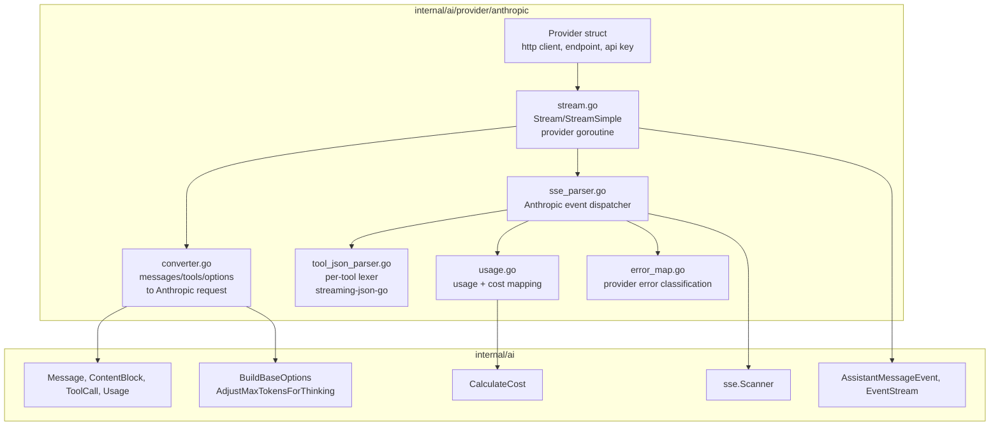
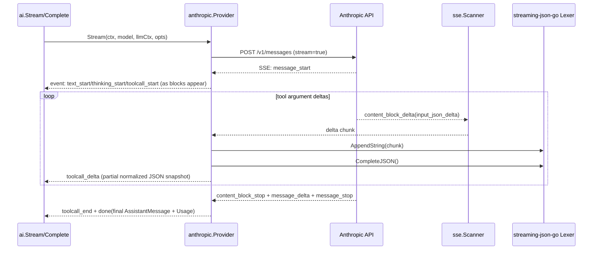
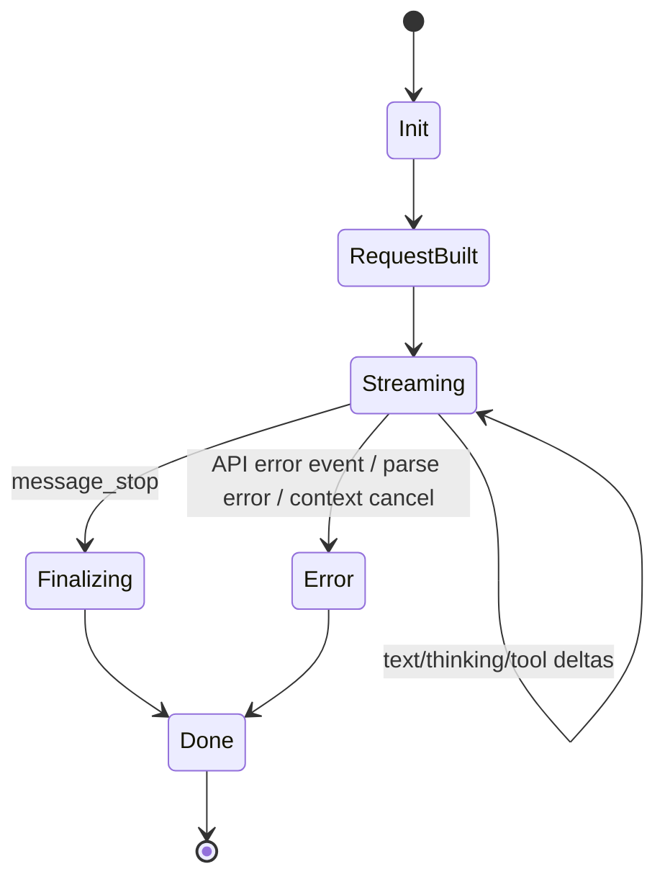

# 02: Anthropic Provider

**Status:** Approved
**Depends on:** 01-ai-core
**Depended on by:** 03-provider-openai, 04-provider-google, 05-agent
**Implements:** Anthropic Messages API provider for `internal/ai` with streaming SSE parsing, thinking budget mapping, tool calling, cache control, and usage/cost accounting.

---

## 1. Overview

This plan defines the first concrete provider implementation in `h2-agent-runtime`: Anthropic Messages API. It validates the `internal/ai` architecture from [01-ai-core](./01-ai-core.md) and establishes implementation patterns for later providers (OpenAI and Google).

Primary goals:
- Convert runtime-neutral `ai.Message`/`ai.Tool` structures into Anthropic wire payloads.
- Stream responses over SSE using shared `internal/ai/sse.Scanner`.
- Emit rich `AssistantMessageEvent` deltas and final `AssistantMessage`.
- Parse streamed tool arguments robustly, including partial JSON during `input_json_delta`.
- Apply thinking-level + budget rules from shared options helpers.
- Track usage fields (input/output/cache read/cache write tokens) and compute cost via `ai.CalculateCost`.

Non-goals:
- Provider-specific retry middleware (deferred; handled by caller/RuntimeController policy).
- UI rendering concerns for partial tool JSON (provider emits typed events only).
- Multi-provider failover policy (belongs in agent/RuntimeController layer).

---

## 2. Architecture

### 2.1 Component Diagram



### 2.2 Streaming Sequence (Tool Call Path)



### 2.3 Stream State Machine



---

## 3. Anthropic API Contract

### 3.1 HTTP Request

`POST /v1/messages` with headers:
- `x-api-key: <key>`
- `anthropic-version: <from model/default config>`
- Additional model-required headers from `ai.Model.Headers`

Body (shape):

```json
{
  "model": "claude-...",
  "max_tokens": 4096,
  "messages": [
    {"role": "user", "content": [{"type": "text", "text": "..."}]}
  ],
  "system": "optional system prompt",
  "tools": [
    {
      "name": "read_file",
      "description": "Read a file",
      "input_schema": {"type": "object", "properties": {"path": {"type": "string"}}, "required": ["path"]}
    }
  ],
  "thinking": {"type": "enabled", "budget_tokens": 2048},
  "stream": true
}
```

### 3.2 Streaming Event Types Consumed

Provider handles Anthropic SSE event payloads including:
- `message_start`
- `content_block_start`
- `content_block_delta`
- `content_block_stop`
- `message_delta`
- `message_stop`
- `ping` (ignored)
- `error` (mapped to typed provider error)

### 3.3 Message/Content Mapping

Runtime-to-Anthropic conversion rules:
- `UserMessage` → role `user`, content array of text/image/tool_result blocks.
- `AssistantMessage` → role `assistant`, content array of text/thinking/tool_use blocks.
- `ToolResultMessage` → `user` message containing `tool_result` block (ID linked to prior tool call).
- `ThinkingContent` respects model compatibility from core model metadata.
- System prompts are extracted from `Context.System` and sent via top-level `system` field.

Anthropic-to-runtime conversion rules:
- text block deltas → `EventTextDelta`
- thinking deltas/signatures → `EventThinkingDelta`
- tool-use block deltas → `EventToolCallDelta`, finalized to `ToolCall` on block stop
- completion usage → `AssistantMessage.Usage`
- stop reasons mapped into `ai.StopReason`

---

## 4. Package and Type Design

### 4.1 File Layout

```text
internal/ai/provider/anthropic/
├── provider.go          # Provider struct + constructor + API()
├── request.go           # request DTOs and message/tool conversion
├── stream.go            # Stream and StreamSimple entrypoints
├── sse_parser.go        # SSE event loop + block assembly
├── tool_json_parser.go  # partial JSON completion wrapper (streaming-json-go)
├── usage.go             # usage/stop_reason mapping + cost calculation
├── errors.go            # API error decoding + ProviderError mapping
└── types_wire.go        # Anthropic wire payload structs
```

### 4.2 Key Types

```go
type Provider struct {
    client      *http.Client
    baseURL     string
    apiKey      string
    version     string
    betaHeaders []string
}

type streamAccumulator struct {
    textParts     map[int]string
    thinkingParts map[int]thinkingState
    toolStates    map[int]*toolStreamState
    usage         ai.Usage
    stopReason    ai.StopReason
}

type toolStreamState struct {
    id        string
    name      string
    rawInput  strings.Builder
    lexer     *streamingjson.Lexer
    lastValid map[string]any
}
```

Design constraints:
- One `toolStreamState` per active tool content block index.
- Lexer lifetime is per tool-call stream, never shared across blocks or requests.
- No global mutable state; provider instance is concurrency-safe.

---

## 5. Algorithms

### 5.1 StreamSimple to StreamOptions

`StreamSimple` calls `ai.BuildBaseOptions(opts)` and `ai.AdjustMaxTokensForThinking(...)` to derive:
- final `max_tokens`
- optional `thinking.budget_tokens`

It then delegates to `Stream` with normalized `StreamOptions`.

### 5.2 SSE Processing Loop

1. Start request and validate `2xx` status.
2. Build `sse.Scanner` over response body.
3. For each event:
- decode JSON payload for event type
- mutate `streamAccumulator`
- emit typed `AssistantMessageEvent` with `Partial` snapshot
4. On `message_stop`, assemble final `AssistantMessage`, attach usage/cost, emit `done`.
5. On transport/API/parser error, emit `error` with mapped `ProviderError`.

### 5.3 Tool JSON Delta Parsing with `streaming-json-go`

For each `input_json_delta` chunk:
1. Append raw chunk to `toolState.rawInput`.
2. Call `toolState.lexer.AppendString(chunk)`.
3. Call `completed := toolState.lexer.CompleteJSON()`.
4. Attempt `json.Unmarshal(completed, &candidateArgs)`.
5. If valid object:
- set `toolState.lastValid = candidateArgs`
- emit `toolcall_delta` with partial parsed args
6. If invalid (rare lexer edge case):
- keep prior `lastValid`, continue buffering raw input
7. On `content_block_stop`:
- parse full raw input strictly
- if strict parse succeeds, use the parsed result
- if strict parse fails, emit a terminal `ProviderError` (tool-call parse failure) — do NOT fall back to `lastValid` or emit `toolcall_end` with stale/truncated arguments
- construct final `ai.ToolCall` and emit `toolcall_end` only on successful parse

This is the concrete architecture decision from plan index OQ4 resolution: use `github.com/karminski/streaming-json-go` for robust partial JSON completion.

### 5.4 Usage + Cost Mapping

On completion payload:
- map provider usage fields to `ai.Usage`:
  - `input_tokens` → `Usage.Input`
  - `output_tokens` → `Usage.Output`
  - `cache_read_input_tokens` → `Usage.CacheRead`
  - `cache_creation_input_tokens` → `Usage.CacheWrite`
- call `ai.CalculateCost(model, &usage)`
- assign to final `AssistantMessage.Usage`

---

## 6. Error Handling

Error map:
- HTTP 401/403 → `ErrAuth`
- HTTP 429 → `ErrRateLimit`
- Known context-overflow messages / stop patterns → `ErrContextOverflow`
- HTTP 5xx → `ErrServerError`
- Other decode/transport cases → `ErrUnknown`

Provider never panics outward; all failures become terminal `error` events in `EventStream`.

---

## 7. Connected Components (Seams)

| Component | Seam | Contract |
|-----------|------|----------|
| `internal/ai` stream entrypoints | `ai.Provider` interface | `Stream(ctx, model, llmCtx, opts) *ai.EventStream`, `StreamSimple(...) *ai.EventStream` |
| `internal/ai/sse` | SSE scanner utility | `sse.NewScanner(io.Reader)` + scanner `Next/Event/Err` |
| `internal/ai` options | Thinking normalization | `ai.BuildBaseOptions`, `ai.AdjustMaxTokensForThinking` |
| `internal/ai` model catalog | Provider headers and pricing | `ai.Model.Headers`, `ai.CalculateCost` |
| `internal/agent` (future consumer) | Streaming event semantics | Emits `AssistantMessageEvent` types defined in 01-ai-core |

No reverse import is allowed from core packages into provider internals.

---

## 8. Acceptance Criteria

1. **Streaming prompt in CLI path**
- Steps: RuntimeController invokes agent with Anthropic model, user submits prompt.
- Expected: user sees incremental text deltas and final assistant response with usage/cost.

2. **Tool call round-trip across agent boundary**
- Steps: prompt triggers `read_file`; provider emits tool call; agent executes tool and sends tool result; provider continues and returns final answer.
- Expected: exactly one completed tool call with stable ID and valid JSON args; conversation continues successfully.

3. **Thinking-enabled run with budget**
- Steps: run with reasoning level `high` and configured budget.
- Expected: request includes thinking budget mapping; stream emits thinking events; completion succeeds without token-budget mismatch errors.

4. **Prompt-caching accounting**
- Steps: two-turn conversation with repeated context that triggers cache read/write tokens.
- Expected: usage includes cache fields and total cost reflects input/output/cache components.

5. **Context overflow surfaced as typed failure**
- Steps: send overlong prompt that exceeds model context.
- Expected: final stream error is classified as `context_overflow` and surfaced through agent/RuntimeController UX.

6. **Partial tool JSON over SSE chunks**
- Steps: provider emits fragmented tool input JSON across multiple deltas.
- Expected: partial parsing never crashes, emits progressive toolcall deltas, and final tool args are valid JSON object.

---

## 9. Testing Strategy

### 9.1 Unit Tests

- Message conversion: role/content mapping, system extraction, tool schema conversion.
- Thinking option mapping: `StreamSimple` to `thinking.budget_tokens` and `max_tokens`.
- Usage mapping + cost arithmetic.
- Error classification from HTTP code and API error body.
- Tool delta parser behavior for fragmented JSON, unicode escapes, truncation boundaries.

### 9.2 Component Tests

- SSE fixture replay tests using recorded Anthropic event streams:
  - plain text stream
  - thinking stream
  - tool-use stream with `input_json_delta`
  - API error stream
- Assert emitted event sequence, partial snapshots, and final message integrity.

### 9.3 Integration Tests (network-gated)

- Live Anthropic API smoke test behind env var (`ANTHROPIC_API_KEY`):
  - single text response
  - one tool-call cycle
  - usage/cost non-zero invariants

---

## 10. URP (Unreasonably Robust Programming)

1. **Golden wire compatibility corpus**: maintain versioned request/response fixtures for multiple Claude model families; run as regression suite on every PR.
2. **Provider differential runner**: execute same scenario on Anthropic sandbox models nightly and compare semantic invariants (tool call shape, stop reason, usage monotonicity).
3. **Automatic schema drift detector**: CI job tracks upstream Anthropic API docs/SDK schema deltas and opens beads when wire contract drifts.

---

## 11. Extreme Optimization

1. Reuse decoder buffers with `sync.Pool` in SSE hot path to reduce allocations on high-chunk streams.
2. Avoid repeated full-message reconstruction for every delta; update targeted block in accumulator and build partial snapshot lazily.
3. Fast-path small JSON deltas (<256B) with stack-backed temp buffers before fallback allocations.

---

## 12. Alien Artifacts

1. **Incremental JSON confidence scoring**: track parser confidence over delta sequence to detect pathological streams before terminal parse failure.
2. **Event automata verification**: model Anthropic event transitions as finite-state automaton and property-test valid/invalid traces.
3. **Probabilistic cost anomaly detection**: online z-score detector over usage-token ratios to catch provider regressions early.

---

## 13. Dependencies

| Dependency | Purpose |
|-----------|---------|
| `internal/ai` | Provider interface, core types, stream events, options, cost calc |
| `internal/ai/sse` | Shared SSE scanner |
| `github.com/karminski/streaming-json-go` | Partial JSON completion for tool argument deltas |
| Go stdlib `net/http`, `encoding/json`, `context` | HTTP/SSE transport and decoding |

---

## 14. Exit Criteria (Milestone Gates G2 + G3 partial)

1. Anthropic provider implements `ai.Provider` and registers successfully.
2. SSE text streaming emits ordered deltas and a valid final message.
3. Tool call streaming supports fragmented JSON input and emits valid `ToolCall`.
4. Thinking-level/budget mapping is covered by tests and behaves per shared options.
5. Usage and cost fields are populated correctly including cache read/write tokens.
6. Provider error classification returns typed errors (`auth`, `rate_limit`, `context_overflow`, `server_error`, `unknown`).
7. Unit + component tests pass under `-race`.
8. Integration smoke tests pass when credentials are provided.

---

## Review Disposition

| # | Reviewer | Severity | Summary | Disposition | Notes |
|---|----------|----------|---------|-------------|-------|
| 1 | coder-1-sea | P1 | Final tool-call arguments can be silently corrupted on parse failure | Incorporated | §5.3 step 7 rewritten: strict parse required at finalization, emit ProviderError on failure instead of falling back to lastValid |

## Plan Review Signoff

- **Status**: Approved
- **Date**: 2026-03-12
- **Branch**: main
- **Commit**: ee32c55
- **Review rounds**: 3 (R1 batch + R2 batch + R3 focused)
- **Total findings**: 1
- **Finding breakdown**: P0: 0, P1: 1, P2: 0, P3: 0
- **Incorporation rate**: 100%
- **Not incorporated**: None
- **Open questions**: All resolved
- **Reviewers**: coder-1-sea, coder-2-sea, reviewer-sea

---

## Completion Signoff

- **Status**: Complete
- **Date**: 2026-03-13
- **Branch**: main
- **Commit**: 01e44b1
- **Verified by**: reviewer-sea
- **Test verification**: `go test -race ./internal/ai/provider/anthropic/... -short -count=1` — PASS
- **Acceptance tests**: N/A (acceptance criteria require agent loop from Batch 3)
- **Deviations from plan**:
  - [Cosmetic] SSE scanner uses `UnsafeEvent()` zero-copy variant instead of `Event()`.
  - [Cosmetic] `StreamSimple` delegates through `streamWithThinking` helper rather than calling `Stream` directly.
  - [Structural — resolved: implementation is better] Constructor uses `New(cfg Config)` with Config struct instead of `New(apiKey string, opts ...Option)` functional options. Consistent across all 3 providers.
  - [Structural — resolved: implementation is better] `streamAccumulator` uses unified `blocks map[int]ai.ContentBlock` instead of separate `textParts`/`thinkingParts` maps. Cleaner design.
  - [Structural — resolved: implementation is better] Tool JSON parsing wrapped in dedicated `toolJSONParser` struct with `cloneMap` deep-copy. Eliminates `lastValid` per review-incorporated strict-final-parse semantics.
  - [Structural — resolved: implementation is better] `classifyHTTPError` takes `(status int, msg string)` returning `ProviderErrorCode` instead of `(statusCode int, body []byte)` returning `*ProviderError`. Body decoding separated into `decodeErrorMessage`.
  - [Structural — resolved: implementation is better] `mapUsage` does pure field mapping without model/cost; cost calculated later in `finish()`.
  - [Structural — resolved: implementation is better] `processStream` factored into `sseProcessor` with helper methods (`onBlockStart`, `onBlockDelta`, `onBlockStop`, `finish`).
- **Structural deviations resolved**: 6 (all resolved as implementation improvements; plan doc should be updated to match)
- **Additions beyond plan**:
  - `Register()` function for provider registration with `ai.RegisterProvider`.
  - `Config` struct for constructor parameters.
  - `mergeUsage()` for incremental usage accumulation from `message_delta` events.
  - `wireImageSource` for image content block support.
  - `wireRequest.Metadata` field for Anthropic metadata pass-through.
  - Large-argument optimization path using `ai.UnmarshalArgumentsFromReader` for payloads >64KB.
  - `EventStart` emission on first SSE chunk.
- **Not implemented (aspirational)**: URP items (golden wire corpus, differential runner, schema drift detector), Extreme Optimization items (sync.Pool, lazy snapshots, stack-backed buffers), Alien Artifacts (JSON confidence scoring, event automata FSM, cost anomaly detection). These are enhancement-tier items explicitly marked as aspirational in the plan.
