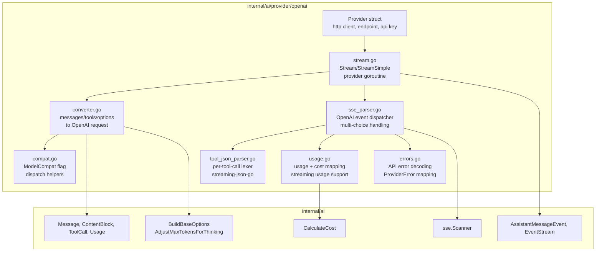
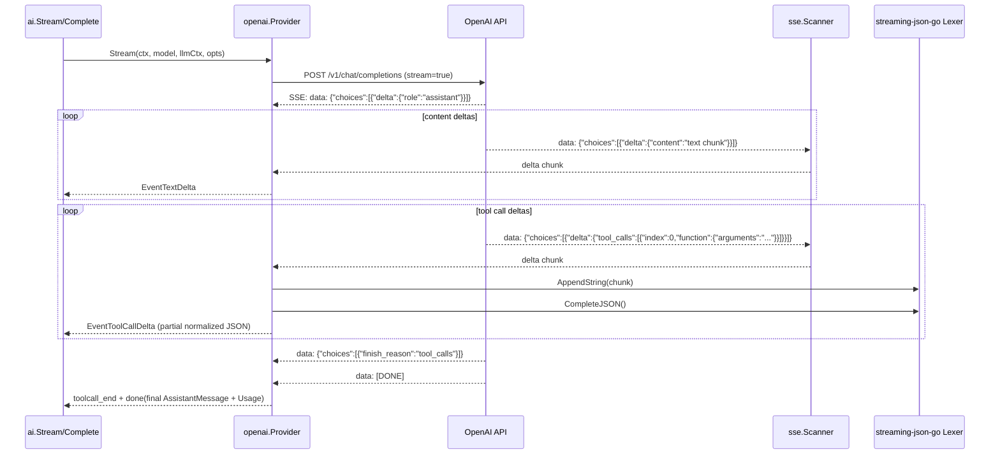
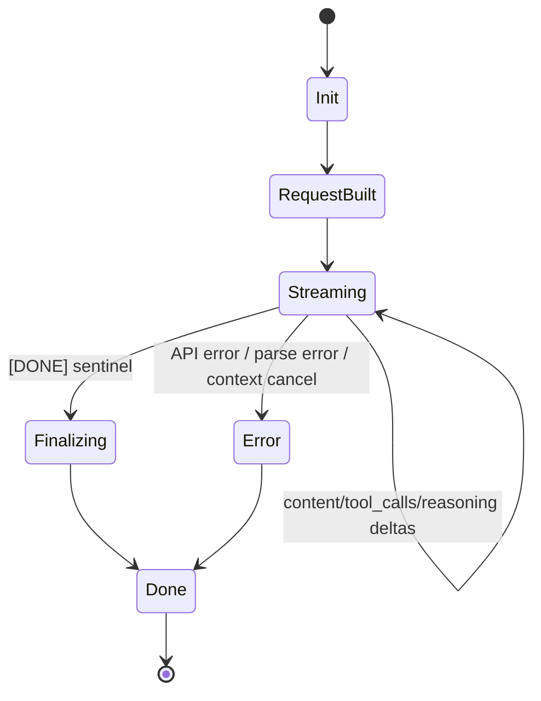

# 03: OpenAI Provider

**Status:** Draft
**Depends on:** 01-ai-core, 02-provider-anthropic
**Depended on by:** 05-agent
**Implements:** OpenAI Completions API provider for `internal/ai` with streaming SSE parsing, reasoning effort mapping, tool calling, compatibility settings for OpenAI-compatible endpoints (Groq, Mistral, etc.), and usage/cost accounting.

---

## 1. Overview

This plan defines the second provider implementation: OpenAI Chat Completions API. It follows patterns established by [02-provider-anthropic](./02-provider-anthropic.md) and leverages shared infrastructure from [01-ai-core](./01-ai-core.md).

The OpenAI provider serves two purposes:
1. **OpenAI proper** — GPT-4o, o1, o3, GPT-5 family models via `api.openai.com`
2. **OpenAI-compatible endpoints** — Groq, Mistral, Together, Cerebras, xAI, DeepSeek, and other providers that implement the OpenAI Completions API with varying levels of compatibility

The `ModelCompat` flags from the model catalog drive per-model behavior differences (reasoning effort support, max tokens field naming, tool result format quirks, thinking format, strict mode, etc.) without provider-level branching.

Primary goals:
- Convert runtime-neutral `ai.Message`/`ai.Tool` structures into OpenAI wire payloads.
- Stream responses over SSE using shared `internal/ai/sse.Scanner`.
- Emit rich `AssistantMessageEvent` deltas and final `AssistantMessage`.
- Parse streamed tool call arguments including partial JSON during `tool_calls[].function.arguments` deltas.
- Map reasoning effort levels via `ModelCompat.ReasoningEffortMap`.
- Handle `developer` role (system prompt) for models that support it.
- Track usage fields and compute cost via `ai.CalculateCost`.
- Support the full matrix of `ModelCompat` flags for OpenAI-compatible endpoints.

Non-goals:
- Provider-specific retry middleware (deferred; handled by caller/RuntimeController).
- Assistants API, Files API, or other OpenAI endpoints beyond Chat Completions.
- Realtime/WebSocket streaming (future work if needed).

---

## 2. Architecture

### 2.1 Component Diagram



### 2.2 Streaming Sequence (Tool Call Path)



### 2.3 Stream State Machine



---

## 3. OpenAI API Contract

### 3.1 HTTP Request

`POST /v1/chat/completions` (or `{baseURL}/chat/completions` for compatible endpoints) with headers:
- `Authorization: Bearer <key>`
- `Content-Type: application/json`
- Additional model-required headers from `ai.Model.Headers`

Body (shape):

```json
{
  "model": "gpt-4o",
  "messages": [
    {"role": "system", "content": "You are helpful"},
    {"role": "user", "content": [{"type": "text", "text": "Hello"}]}
  ],
  "tools": [
    {
      "type": "function",
      "function": {
        "name": "read_file",
        "description": "Read a file",
        "parameters": {"type": "object", "properties": {"path": {"type": "string"}}, "required": ["path"]},
        "strict": true
      }
    }
  ],
  "stream": true,
  "stream_options": {"include_usage": true},
  "max_completion_tokens": 4096,
  "reasoning_effort": "high",
  "store": true
}
```

### 3.2 Key API Differences from Anthropic

| Aspect | Anthropic | OpenAI |
|--------|-----------|--------|
| Auth header | `x-api-key` | `Authorization: Bearer` |
| System prompt | Top-level `system` field | `system` or `developer` role message |
| Tool schema wrapper | `input_schema` field | `function.parameters` field |
| Tool call in response | Content block `type: "tool_use"` | `tool_calls[]` array on delta |
| Tool result | `tool_result` content block in user message | Separate `tool` role message |
| Stream termination | `message_stop` event type | `data: [DONE]` sentinel |
| Thinking/reasoning | `thinking` block with budget | `reasoning_effort` parameter or `reasoning` content |
| Max tokens field | `max_tokens` | `max_completion_tokens` (or `max_tokens` for older models) |
| Usage in stream | Not streamed (final message_delta only) | Optional via `stream_options.include_usage` |
| Multiple tool calls | Multiple content blocks in one message | `tool_calls[]` array with index-based deltas |

### 3.3 Streaming Event Format

OpenAI streams `data:` lines containing JSON chunks. Unlike Anthropic's typed event names, OpenAI uses a single `data:` prefix with the chunk payload:

```
data: {"id":"chatcmpl-...","object":"chat.completion.chunk","choices":[{"index":0,"delta":{"role":"assistant"},"finish_reason":null}]}

data: {"id":"chatcmpl-...","choices":[{"index":0,"delta":{"content":"Hello"},"finish_reason":null}]}

data: {"id":"chatcmpl-...","choices":[{"index":0,"delta":{},"finish_reason":"stop"}]}

data: {"usage":{"prompt_tokens":10,"completion_tokens":5,"total_tokens":15}}

data: [DONE]
```

### 3.4 Message/Content Mapping

Runtime-to-OpenAI conversion rules:
- `UserMessage` → role `user`, content array of text/image blocks.
- `AssistantMessage` → role `assistant`, content string or array, plus `tool_calls[]` if present.
- `ToolResultMessage` → role `tool` with `tool_call_id` linking to prior tool call.
- System prompt → role `system` (or `developer` if `ModelCompat.SupportsDeveloperRole` is true).
- `ThinkingContent` → depends on `ModelCompat.ThinkingFormat`:
  - `""` (empty): drop thinking blocks (most OpenAI models)
  - `"reasoning"`: include as `reasoning` content type (o-series models)
  - If `RequiresThinkingAsText` is true: convert to text content

OpenAI-to-runtime conversion rules:
- `delta.content` string → `EventTextDelta`
- `delta.tool_calls[i].function.name` → `EventToolCallStart`
- `delta.tool_calls[i].function.arguments` → `EventToolCallDelta`, finalized on `finish_reason`
- `delta.reasoning` (if present) → `EventThinkingDelta`
- `finish_reason` → mapped to `ai.StopReason`
- `usage` object (final chunk or streamed) → `AssistantMessage.Usage`

---

## 4. Package and Type Design

### 4.1 File Layout

```text
internal/ai/provider/openai/
├── provider.go          # Provider struct + constructor + API()
├── request.go           # request DTOs and message/tool conversion
├── stream.go            # Stream and StreamSimple entrypoints
├── sse_parser.go        # SSE event loop + choice processing
├── tool_json_parser.go  # partial JSON completion wrapper (streaming-json-go)
├── usage.go             # usage/stop_reason mapping + cost calculation
├── errors.go            # API error decoding + ProviderError mapping
├── compat.go            # ModelCompat dispatch helpers
└── types_wire.go        # OpenAI wire payload structs
```

### 4.2 Key Types

```go
// provider.go

type Provider struct {
    client  *http.Client
    baseURL string // default: "https://api.openai.com/v1"
    apiKey  string
}

func New(apiKey string, opts ...Option) *Provider
func (p *Provider) API() string { return "openai-completions" }
```

```go
// types_wire.go

// Request types (outbound)
type chatRequest struct {
    Model            string            `json:"model"`
    Messages         []chatMessage     `json:"messages"`
    Tools            []chatTool        `json:"tools,omitempty"`
    Stream           bool              `json:"stream"`
    StreamOptions    *streamOptions    `json:"stream_options,omitempty"`
    MaxTokens        *int              `json:"max_tokens,omitempty"`           // older models
    MaxCompletionTok *int              `json:"max_completion_tokens,omitempty"` // newer models
    ReasoningEffort  string            `json:"reasoning_effort,omitempty"`
    Store            *bool             `json:"store,omitempty"`
    Temperature      *float64          `json:"temperature,omitempty"`
    TopP             *float64          `json:"top_p,omitempty"`
}

type streamOptions struct {
    IncludeUsage bool `json:"include_usage"`
}

type chatMessage struct {
    Role       string      `json:"role"` // system, developer, user, assistant, tool
    Content    any         `json:"content"`  // string or []contentPart
    Name       string      `json:"name,omitempty"`
    ToolCalls  []toolCall  `json:"tool_calls,omitempty"` // assistant only
    ToolCallID string      `json:"tool_call_id,omitempty"` // tool role only
}

type contentPart struct {
    Type     string    `json:"type"`
    Text     string    `json:"text,omitempty"`
    ImageURL *imageURL `json:"image_url,omitempty"`
}

type imageURL struct {
    URL    string `json:"url"`
    Detail string `json:"detail,omitempty"`
}

type chatTool struct {
    Type     string       `json:"type"` // "function"
    Function chatFunction `json:"function"`
}

type chatFunction struct {
    Name        string          `json:"name"`
    Description string          `json:"description,omitempty"`
    Parameters  json.RawMessage `json:"parameters,omitempty"`
    Strict      *bool           `json:"strict,omitempty"`
}

type toolCall struct {
    ID       string       `json:"id"`
    Type     string       `json:"type"` // "function"
    Function functionCall `json:"function"`
    Index    *int         `json:"index,omitempty"` // in streaming deltas
}

type functionCall struct {
    Name      string `json:"name,omitempty"`
    Arguments string `json:"arguments"`
}

// Response types (inbound — streaming chunks)
type chatChunk struct {
    ID      string        `json:"id"`
    Object  string        `json:"object"`
    Choices []chunkChoice `json:"choices"`
    Usage   *chunkUsage   `json:"usage,omitempty"` // final chunk with usage
}

type chunkChoice struct {
    Index        int          `json:"index"`
    Delta        chunkDelta   `json:"delta"`
    FinishReason *string      `json:"finish_reason"`
}

type chunkDelta struct {
    Role      string     `json:"role,omitempty"`
    Content   *string    `json:"content,omitempty"`
    ToolCalls []toolCall `json:"tool_calls,omitempty"`
    Reasoning *string    `json:"reasoning,omitempty"` // o-series models
}

type chunkUsage struct {
    PromptTokens     int `json:"prompt_tokens"`
    CompletionTokens int `json:"completion_tokens"`
    TotalTokens      int `json:"total_tokens"`
    // Some providers include cache fields
    PromptTokensDetails *promptTokensDetails `json:"prompt_tokens_details,omitempty"`
}

type promptTokensDetails struct {
    CachedTokens int `json:"cached_tokens"`
}
```

```go
// stream.go

type streamAccumulator struct {
    contentBuf    strings.Builder       // assembled text content
    reasoningBuf  strings.Builder       // assembled reasoning content
    toolStates    map[int]*toolStreamState // index → tool state
    usage         ai.Usage
    stopReason    ai.StopReason
    model         string                 // from first chunk
}

type toolStreamState struct {
    id        string
    name      string
    rawArgs   strings.Builder
    lexer     *streamingjson.Lexer
    lastValid map[string]any
}
```

Design constraints (matching Anthropic provider):
- One `toolStreamState` per active tool call index.
- Lexer lifetime is per tool-call stream, never shared across calls or requests.
- No global mutable state; provider instance is concurrency-safe.

---

## 5. Algorithms

### 5.1 StreamSimple to StreamOptions

`StreamSimple` maps thinking level to OpenAI-specific parameters:

1. Call `ai.BuildBaseOptions(model, opts, apiKey)` for base options.
2. If model supports reasoning effort (`ModelCompat.SupportsReasoningEffort`):
   - Map thinking level via `ModelCompat.ReasoningEffortMap` (e.g., `{"high": "high", "medium": "medium", "low": "low"}`)
   - Set `reasoning_effort` in request
3. If model doesn't support reasoning effort but is a reasoning model:
   - Apply `ai.AdjustMaxTokensForThinking(...)` to increase max tokens budget
4. Delegate to `Stream` with normalized `StreamOptions`.

```go
// stream.go

func (p *Provider) StreamSimple(ctx context.Context, model ai.Model, llmCtx ai.Context, opts ai.SimpleStreamOptions) *ai.EventStream {
    base := ai.BuildBaseOptions(model, &opts, p.apiKey)

    if model.Compat != nil && boolVal(model.Compat.SupportsReasoningEffort) {
        if mapped, ok := model.Compat.ReasoningEffortMap[string(opts.ThinkingLevel)]; ok {
            base.ReasoningEffort = mapped
        }
    } else if model.Reasoning {
        maxTok, thinkBudget := ai.AdjustMaxTokensForThinking(
            valOrDefault(base.MaxTokens, model.MaxTokens),
            model.MaxTokens, opts.ThinkingLevel, opts.ThinkingBudgets)
        base.MaxTokens = &maxTok
        base.ThinkingBudget = thinkBudget
    }

    return p.Stream(ctx, model, llmCtx, base)
}
```

### 5.2 Message Conversion

```go
// request.go

func convertMessages(messages []ai.Message, model ai.Model, system string) []chatMessage {
    var out []chatMessage

    // System/developer message first
    if system != "" {
        role := "system"
        if model.Compat != nil && boolVal(model.Compat.SupportsDeveloperRole) {
            role = "developer"
        }
        out = append(out, chatMessage{Role: role, Content: system})
    }

    for _, msg := range messages {
        switch m := msg.(type) {
        case *ai.UserMessage:
            out = append(out, convertUserMessage(m))
        case *ai.AssistantMessage:
            out = append(out, convertAssistantMessage(m, model))
        case *ai.ToolResultMessage:
            out = append(out, convertToolResult(m, model))
        }
    }
    return out
}
```

Key conversion details:

**User messages:** Convert content blocks to `contentPart` array. Text blocks become `{"type": "text", "text": "..."}`. Image blocks become `{"type": "image_url", "image_url": {"url": "data:..."}}`.

**Assistant messages:** Text content becomes the `content` field (string if single text block, array otherwise). Tool calls are extracted into the `tool_calls` array with proper ID and function structure. Thinking content is handled per `ModelCompat.ThinkingFormat`.

**Tool results:** Each result becomes a separate `tool` role message with `tool_call_id` matching the prior call ID. If `ModelCompat.RequiresToolResultName` is true, include the tool `name` field. If `ModelCompat.RequiresAssistantAfterToolResult` is true, inject a synthetic assistant acknowledgment message between tool results (some compat endpoints require this).

### 5.3 Tool Conversion

```go
// request.go

func convertTools(tools []ai.Tool, model ai.Model) []chatTool {
    out := make([]chatTool, len(tools))
    for i, t := range tools {
        ct := chatTool{
            Type: "function",
            Function: chatFunction{
                Name:        t.Name,
                Description: t.Description,
                Parameters:  t.Parameters,
            },
        }
        if model.Compat != nil && boolVal(model.Compat.SupportsStrictMode) {
            strict := true
            ct.Function.Strict = &strict
        }
        out[i] = ct
    }
    return out
}
```

### 5.4 SSE Processing Loop

1. Start request and validate `2xx` status.
2. Build `sse.Scanner` over response body.
3. For each `data:` line:
   - If `data: [DONE]`, finalize and emit done event.
   - Otherwise, decode `chatChunk` JSON.
   - For each choice in `choices`:
     - If `delta.content` is set: append to `contentBuf`, emit `EventTextDelta`.
     - If `delta.reasoning` is set: append to `reasoningBuf`, emit `EventThinkingDelta`.
     - If `delta.tool_calls` is set: process each tool call delta (see 5.5).
     - If `finish_reason` is non-null: map to `ai.StopReason`.
   - If `usage` is present (final chunk): map to `ai.Usage`.
4. Assemble final `AssistantMessage`, compute cost, emit `done`.
5. On error: emit `error` with mapped `ProviderError`.

```go
// sse_parser.go

func (p *Provider) processStream(ctx context.Context, resp *http.Response, model ai.Model, es *ai.EventStream) {
    acc := &streamAccumulator{
        toolStates: make(map[int]*toolStreamState),
    }

    scanner := sse.NewScanner(resp.Body)
    for scanner.Next() {
        event := scanner.Event()

        // OpenAI uses "data" field only (no event type field)
        data := event.Data
        if data == "[DONE]" {
            break
        }

        var chunk chatChunk
        if err := json.Unmarshal([]byte(data), &chunk); err != nil {
            emitError(es, "parse error", err)
            return
        }

        if chunk.Usage != nil {
            acc.usage = mapUsage(chunk.Usage, model)
        }

        for _, choice := range chunk.Choices {
            processChoice(ctx, es, acc, &choice, model)
        }
    }

    if err := scanner.Err(); err != nil {
        emitError(es, "stream error", err)
        return
    }

    emitDone(es, acc, model)
}
```

### 5.5 Tool Call Delta Processing

OpenAI streams tool calls via `delta.tool_calls[]` with an `index` field that identifies which tool call is being updated. Multiple tool calls can be interleaved.

```go
// sse_parser.go

func processToolCallDelta(es *ai.EventStream, acc *streamAccumulator, tc *toolCall) {
    idx := valOrDefault(tc.Index, 0)

    state, exists := acc.toolStates[idx]
    if !exists {
        // New tool call — first chunk has id and function.name
        state = &toolStreamState{
            id:   tc.ID,
            name: tc.Function.Name,
            lexer: streamingjson.NewLexer(),
        }
        acc.toolStates[idx] = state
        es.Send(ai.AssistantMessageEvent{
            Type:         ai.EventToolCallStart,
            ContentIndex: idx,
            ToolCall:     &ai.ToolCall{ID: tc.ID, Name: tc.Function.Name},
        })
    }

    // Argument delta
    if tc.Function.Arguments != "" {
        state.rawArgs.WriteString(tc.Function.Arguments)
        state.lexer.AppendString(tc.Function.Arguments)
        completed := state.lexer.CompleteJSON()

        var candidateArgs map[string]any
        if err := json.Unmarshal([]byte(completed), &candidateArgs); err == nil {
            state.lastValid = candidateArgs
            es.Send(ai.AssistantMessageEvent{
                Type:         ai.EventToolCallDelta,
                ContentIndex: idx,
                ToolCall:     &ai.ToolCall{ID: state.id, Name: state.name, Arguments: candidateArgs},
            })
        }
    }
}
```

### 5.6 Tool Call Finalization

On `finish_reason: "tool_calls"`, finalize all pending tool call states:

```go
// sse_parser.go

func finalizeToolCalls(es *ai.EventStream, acc *streamAccumulator) {
    // Sort indices to ensure deterministic finalization order matching
    // the model's emitted tool call sequence.
    indices := make([]int, 0, len(acc.toolStates))
    for idx := range acc.toolStates {
        indices = append(indices, idx)
    }
    sort.Ints(indices)

    for _, idx := range indices {
        state := acc.toolStates[idx]
        rawJSON := state.rawArgs.String()
        var finalArgs map[string]any

        if err := json.Unmarshal([]byte(rawJSON), &finalArgs); err != nil {
            // Strict parse failed — emit error, do NOT fall back to
            // lastValid or empty args which could execute tools with
            // stale/truncated arguments.
            emitError(es, "tool call parse failure",
                fmt.Errorf("tool %q (index %d): final argument JSON parse failed: %w", state.name, idx, err))
            return
        }

        es.Send(ai.AssistantMessageEvent{
            Type:         ai.EventToolCallEnd,
            ContentIndex: idx,
            ToolCall:     &ai.ToolCall{ID: state.id, Name: state.name, Arguments: finalArgs},
        })
    }
}
```

### 5.7 Usage + Cost Mapping

```go
// usage.go

func mapUsage(u *chunkUsage, model ai.Model) ai.Usage {
    usage := ai.Usage{
        Input:  u.PromptTokens,
        Output: u.CompletionTokens,
    }

    // Some providers include cache details
    if u.PromptTokensDetails != nil {
        usage.CacheRead = u.PromptTokensDetails.CachedTokens
    }

    ai.CalculateCost(model, &usage)
    return usage
}

func mapStopReason(reason *string) ai.StopReason {
    if reason == nil {
        return ""
    }
    switch *reason {
    case "stop":
        return ai.StopReasonStop
    case "tool_calls":
        return ai.StopReasonToolUse
    case "length":
        return ai.StopReasonLength
    case "content_filter":
        return ai.StopReasonContentFilter
    default:
        return ai.StopReasonStop
    }
}
```

---

## 6. ModelCompat Flag Dispatch

The `compat.go` module centralizes all `ModelCompat`-driven behavior differences. Each compatibility flag maps to a specific API or message conversion variation.

```go
// compat.go

// maxTokensFieldName returns the JSON field name for max tokens.
// Newer OpenAI models use "max_completion_tokens", older use "max_tokens".
// Some compat providers use different names entirely.
func maxTokensFieldName(model ai.Model) string {
    if model.Compat != nil && model.Compat.MaxTokensField != "" {
        return model.Compat.MaxTokensField
    }
    return "max_completion_tokens" // default for modern OpenAI
}

// systemRole returns "developer" or "system" depending on model compatibility.
func systemRole(model ai.Model) string {
    if model.Compat != nil && boolVal(model.Compat.SupportsDeveloperRole) {
        return "developer"
    }
    return "system"
}

// shouldIncludeStore returns whether to set "store: true" in the request.
func shouldIncludeStore(model ai.Model) bool {
    return model.Compat != nil && boolVal(model.Compat.SupportsStore)
}

// shouldRequestStreamUsage returns whether to include stream_options.include_usage.
func shouldRequestStreamUsage(model ai.Model) bool {
    if model.Compat == nil {
        return true // default: request usage
    }
    if model.Compat.SupportsUsageInStreaming != nil {
        return *model.Compat.SupportsUsageInStreaming
    }
    return true
}

// toolCallIDPrefix returns "call_" for standard OpenAI or other prefix as needed.
// Mistral requires specific ID formats.
func normalizeToolCallID(id string, model ai.Model) string {
    if model.Compat != nil && boolVal(model.Compat.RequiresMistralToolIds) {
        // Mistral requires IDs to be exactly 9 alphanumeric characters
        return generateMistralToolID(id)
    }
    return id
}
```

### 6.1 Compat Matrix

| Flag | Default | Behavior When True |
|------|---------|-------------------|
| `SupportsStore` | false | Include `"store": true` in request |
| `SupportsDeveloperRole` | false | System prompt sent as `developer` role instead of `system` |
| `SupportsReasoningEffort` | false | Include `reasoning_effort` field in request |
| `ReasoningEffortMap` | — | Maps thinking levels to provider-specific effort strings |
| `SupportsUsageInStreaming` | true | Request `stream_options.include_usage` |
| `MaxTokensField` | "max_completion_tokens" | Use alternate field name for max tokens |
| `RequiresToolResultName` | false | Include `name` field in tool result messages |
| `RequiresAssistantAfterToolResult` | false | Insert synthetic assistant message between tool results |
| `RequiresThinkingAsText` | false | Convert thinking blocks to text content |
| `RequiresMistralToolIds` | false | Generate Mistral-format tool call IDs |
| `ThinkingFormat` | "" | How to handle thinking/reasoning content |
| `SupportsStrictMode` | false | Include `strict: true` in tool function definitions |

---

## 7. Error Handling

### 7.1 HTTP Error Mapping

```go
// errors.go

func classifyHTTPError(statusCode int, body []byte) *ai.ProviderError {
    var apiErr struct {
        Error struct {
            Message string `json:"message"`
            Type    string `json:"type"`
            Code    string `json:"code"`
        } `json:"error"`
    }
    _ = json.Unmarshal(body, &apiErr)

    msg := apiErr.Error.Message
    if msg == "" {
        msg = fmt.Sprintf("HTTP %d", statusCode)
    }

    switch {
    case statusCode == 401 || statusCode == 403:
        return ai.NewProviderError(ai.ErrAuth, msg)
    case statusCode == 429:
        return ai.NewProviderError(ai.ErrRateLimit, msg)
    case statusCode == 400 && ai.IsContextOverflow(msg):
        return ai.NewProviderError(ai.ErrContextOverflow, msg)
    case statusCode == 400 || statusCode == 413:
        // Some compat endpoints (Cerebras/Mistral) return 400/413 for context overflow
        if ai.IsContextOverflow(msg) {
            return ai.NewProviderError(ai.ErrContextOverflow, msg)
        }
        return ai.NewProviderError(ai.ErrBadRequest, msg)
    case statusCode >= 500:
        return ai.NewProviderError(ai.ErrServerError, msg)
    default:
        return ai.NewProviderError(ai.ErrUnknown, msg)
    }
}
```

### 7.2 Stream Error Handling

- Empty body with non-2xx status → classify from status code
- Malformed chunk JSON → emit parse error, close stream
- Context cancellation → emit `StopReasonAborted`
- `[DONE]` without `finish_reason` → treat as `stop`

Provider never panics outward; all failures become terminal `error` events in `EventStream`.

---

## 8. Connected Components (Seams)

| Component | Seam | Contract |
|-----------|------|----------|
| `internal/ai` stream entrypoints | `ai.Provider` interface | `Stream(ctx, model, llmCtx, opts) *ai.EventStream`, `StreamSimple(...) *ai.EventStream` |
| `internal/ai/sse` | SSE scanner utility | `sse.NewScanner(io.Reader)` + scanner `Next/Event/Err` |
| `internal/ai` options | Thinking/reasoning normalization | `ai.BuildBaseOptions`, `ai.AdjustMaxTokensForThinking` |
| `internal/ai` model catalog | Provider headers, pricing, compat flags | `ai.Model.Headers`, `ai.Model.Compat`, `ai.CalculateCost` |
| `internal/agent` (future consumer) | Streaming event semantics | Emits `AssistantMessageEvent` types defined in 01-ai-core |
| `streaming-json-go` | Partial JSON completion | Same library as Anthropic provider |
| 02-provider-anthropic | Pattern reference | Same streaming architecture, same tool JSON parsing approach |

No reverse import is allowed from core packages into provider internals.

---

## 9. Acceptance Criteria

### AC1. Streaming Prompt via CLI

**Steps:** RuntimeController invokes agent with OpenAI model (e.g., GPT-4o), user submits text prompt.
**Expected:** User sees incremental text deltas and final assistant response with usage/cost.

### AC2. Tool Call Round-Trip

**Steps:** Prompt triggers `read_file`; provider emits tool call; agent executes tool and sends tool result; provider continues and returns final answer.
**Expected:** Exactly one completed tool call with stable ID and valid JSON args; conversation continues successfully. Tool result sent as `tool` role message with matching `tool_call_id`.

### AC3. Reasoning Model with Effort Mapping

**Steps:** Run with an o-series model (o3) with reasoning level `high`.
**Expected:** Request includes `reasoning_effort: "high"`. If model emits reasoning content, it appears as thinking events. Completion succeeds.

### AC4. OpenAI-Compatible Endpoint (Groq)

**Steps:** Configure a Groq model entry with appropriate `baseURL` and `ModelCompat` flags. Submit a prompt.
**Expected:** Request goes to Groq endpoint with correct format. Response parses correctly. Usage/cost populated.

### AC5. Context Overflow Typed Failure

**Steps:** Send overlong prompt that exceeds model context window.
**Expected:** Final stream error is classified as `context_overflow` and surfaced through agent/RuntimeController UX. Works for both OpenAI proper and compat endpoints (which may return different error formats).

### AC6. Multi-Tool Call in Single Response

**Steps:** Prompt causes the model to call two tools simultaneously (e.g., read two files).
**Expected:** Both tool calls are correctly parsed with separate IDs and arguments via index-based delta routing. Both `toolcall_end` events fire.

---

## 10. Testing Strategy

### 10.1 Unit Tests

- **Message conversion**: role/content mapping, system vs developer role, tool schema wrapping, tool result format, thinking content handling per ThinkingFormat.
- **Compat flag dispatch**: each `ModelCompat` flag tested in isolation — correct field names, role names, ID format, etc.
- **Reasoning effort mapping**: `StreamSimple` to `reasoning_effort` for supported models, fallback to thinking budget for others.
- **Usage mapping + cost arithmetic**: standard OpenAI usage, usage with cache details, missing usage.
- **Error classification**: HTTP status code + body combinations, compat endpoint error formats.
- **Stop reason mapping**: `stop`, `tool_calls`, `length`, `content_filter`, null.

### 10.2 Component Tests (SSE Fixture Replay)

SSE fixture replay tests using recorded OpenAI event streams:
- Plain text stream (GPT-4o)
- Reasoning stream (o3 with reasoning content)
- Single tool call stream
- Multi-tool call stream (two concurrent tool calls)
- Tool call with large arguments (>4KB)
- API error stream
- Empty response (context window exceeded)
- Compat endpoint variations (Groq format, Mistral format)

Assert emitted event sequence, partial snapshots, and final message integrity.

### 10.3 Integration Tests (network-gated)

Live OpenAI API smoke tests behind env var (`OPENAI_API_KEY`):
- Single text response
- One tool-call cycle
- Usage/cost non-zero invariants
- Reasoning effort parameter accepted (o-series model)

---

## 11. URP (Unreasonably Robust Programming)

1. **Golden wire compatibility corpus**: maintain versioned request/response fixtures for GPT-4o, o3, and at least two compat endpoints (Groq, Mistral). Run as regression suite on every PR.
2. **Compat endpoint differential testing**: for each compat provider, maintain a small set of test prompts and golden output shapes. Nightly CI runs against real endpoints to detect API drift.
3. **Automatic compat flag detection**: given an unknown OpenAI-compatible endpoint, probe with a test request and infer which compat flags are needed (e.g., does it support `stream_options`? Does it use `max_tokens` or `max_completion_tokens`?). Emit suggested `ModelCompat` configuration.

---

## 12. Extreme Optimization

1. **Buffer pooling**: Reuse `streamAccumulator` and `bytes.Buffer` instances via `sync.Pool` to reduce allocations on high-chunk streams. Same approach as Anthropic provider.
2. **Lazy content assembly**: Don't reconstruct the full `AssistantMessage` on every delta. Update targeted fields in accumulator and build the final message only at `[DONE]`.
3. **Fast JSON path for delta extraction**: OpenAI chunks have a predictable structure. For the common case (single choice, content delta only), use a fast path that extracts `choices[0].delta.content` without full JSON deserialization via `jsoniter` or manual scanning.
4. **Pre-allocated tool state map**: For typical tool call counts (1-3), use a fixed-size array instead of map allocation.

---

## 13. Alien Artifacts

1. **Event automata verification**: Model OpenAI streaming event transitions as a finite-state automaton (matching Anthropic provider approach). Property-test valid/invalid event traces to catch parser bugs.
2. **Probabilistic cost anomaly detection**: Online z-score detector over usage-token ratios to catch provider pricing changes or usage accounting regressions.
3. **Compat flag inference via information-theoretic probing**: Design a minimal set of probe requests that maximally distinguishes between OpenAI-compatible endpoint behaviors using information gain, minimizing the number of API calls needed to determine the correct compat configuration.

---

## 14. Dependencies

| Dependency | Purpose |
|-----------|---------|
| `internal/ai` | Provider interface, core types, stream events, options, cost calc |
| `internal/ai/sse` | Shared SSE scanner |
| `github.com/karminski/streaming-json-go` | Partial JSON completion for tool argument deltas |
| Go stdlib `net/http`, `encoding/json`, `context` | HTTP/SSE transport and decoding |

---

## 15. Exit Criteria (Milestone Gate G3 partial)

1. OpenAI provider implements `ai.Provider` and registers as `"openai-completions"`.
2. SSE text streaming emits ordered deltas and a valid final message for GPT-4o-class models.
3. Tool call streaming supports index-based multi-tool deltas and emits valid `ToolCall` objects.
4. Reasoning effort mapping works for o-series models; thinking level fallback works for non-reasoning models.
5. All `ModelCompat` flags are exercised in unit tests with correct behavior.
6. Usage and cost fields are populated correctly for standard OpenAI and compat endpoints.
7. Provider error classification returns typed errors for all error categories.
8. At least two compat endpoint formats (Groq, Mistral) have fixture tests passing.
9. Unit + component tests pass under `-race`.
10. Integration smoke tests pass when `OPENAI_API_KEY` is provided.

---

## Review Disposition

| # | Reviewer | Severity | Summary | Disposition | Notes |
|---|----------|----------|---------|-------------|-------|
| 1 | coder-1-sea | P1 | Tool-call finalization order is nondeterministic | Incorporated | §5.6 finalizeToolCalls now sorts indices before emitting end events |
| 2 | coder-1-sea | P1 | Final tool-call arguments can degrade to stale/empty payloads | Incorporated | §5.6 now requires strict parse; emits error instead of falling back to lastValid or empty {} |
