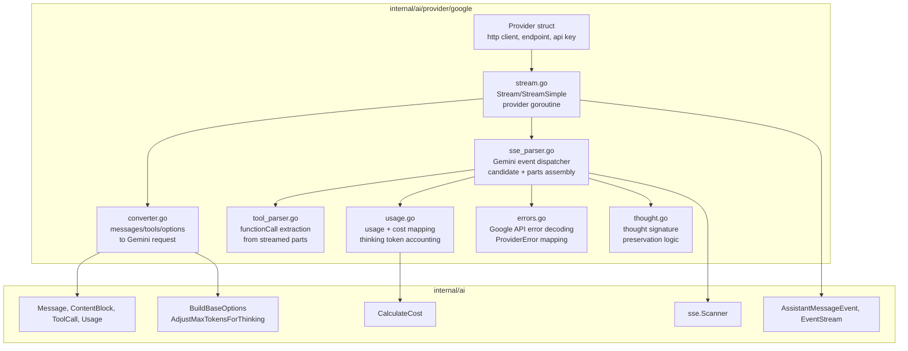
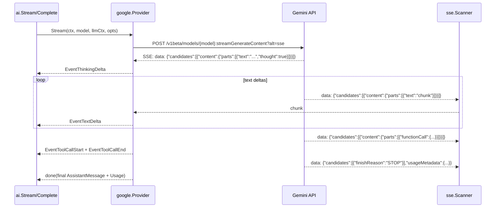
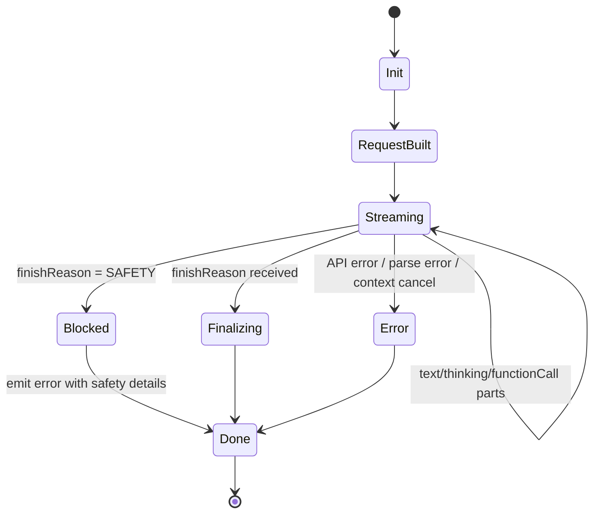

# 04: Google Provider (Gemini)

**Status:** Draft
**Depends on:** 01-ai-core, 02-provider-anthropic
**Depended on by:** 05-agent
**Implements:** Google Generative AI (Gemini) provider for `internal/ai` with streaming SSE parsing, thinking/thought signatures, tool calling (function declarations), safety settings, and usage/cost accounting.

---

## 1. Overview

This plan defines the third provider implementation: Google Generative AI (Gemini). It follows patterns established by [02-provider-anthropic](./02-provider-anthropic.md) and leverages shared infrastructure from [01-ai-core](./01-ai-core.md).

The Google provider targets the Gemini family of models (Gemini 2.5 Flash, Gemini 2.5 Pro, Gemini 3 Flash, Gemini 3.1 Pro, etc.) via the REST API.

Primary goals:
- Convert runtime-neutral `ai.Message`/`ai.Tool` structures into Gemini `contents`/`tools` wire payloads.
- Stream responses over SSE using shared `internal/ai/sse.Scanner` (with `?alt=sse`).
- Emit rich `AssistantMessageEvent` deltas and final `AssistantMessage`.
- Handle Gemini's parts-based content model (text, functionCall, functionResponse, thought parts).
- Preserve `thoughtSignature` across multi-turn conversations for thinking context continuity.
- Map thinking configuration: `thinkingBudget` (Gemini 2.5) and `thinkingLevel` (Gemini 3).
- Track usage fields (`promptTokenCount`, `candidatesTokenCount`, `cachedContentTokenCount`, `thoughtsTokenCount`) and compute cost via `ai.CalculateCost`.

Non-goals:
- Provider-specific retry middleware (deferred; handled by caller/orchestrator policy).
- Vertex AI endpoint support (future work — different auth, same wire format).
- File upload / media API (separate utility, not core provider).
- Google Search grounding, code execution, URL context, or MCP server tools (Gemini-specific meta-tools, out of scope).

---

## 2. Architecture

### 2.1 Component Diagram



### 2.2 Streaming Sequence (Tool Call Path)



### 2.3 Stream State Machine



### 2.4 Key Differences from Anthropic/OpenAI

| Aspect | Anthropic | OpenAI | Google (Gemini) |
|--------|-----------|--------|----------------|
| Auth header | `x-api-key` | `Authorization: Bearer` | `x-goog-api-key` |
| Stream endpoint | Same endpoint | Same endpoint | Separate `:streamGenerateContent?alt=sse` |
| Roles | `user`, `assistant` | `user`, `assistant`, `system`, `developer`, `tool` | `user`, `model` |
| System prompt | Top-level `system` field | `system`/`developer` role message | Top-level `systemInstruction` |
| Content model | Content blocks with types | Content parts or string | `parts` array (each part has exactly one field) |
| Tool call format | `tool_use` content block | `tool_calls[]` on delta | `functionCall` part in content |
| Tool result format | `tool_result` content block in user msg | `tool` role message | `functionResponse` part in user msg |
| Tool calling mode | N/A (always auto) | N/A (always auto) | `toolConfig.functionCallingConfig.mode` (AUTO/ANY/NONE) |
| Thinking config | `thinking.budget_tokens` | `reasoning_effort` | `thinkingConfig.thinkingBudget` or `thinkingConfig.thinkingLevel` |
| Thinking in response | Thinking content blocks | Reasoning content | Parts with `thought: true` |
| Thought signatures | N/A | `ThinkingSignature` (encrypted) | `thoughtSignature` bytes on parts |
| Usage location | `message_delta` event | Final chunk `usage` field | Final chunk `usageMetadata` |
| Safety system | N/A | `content_filter` finish reason | `safetySettings` + `safetyRatings` + `SAFETY` finish reason |
| Stream termination | `message_stop` event type | `data: [DONE]` sentinel | Last chunk has `finishReason` |
| JSON field casing | snake_case | snake_case | camelCase |

---

## 3. Gemini API Contract

### 3.1 HTTP Request

`POST https://generativelanguage.googleapis.com/v1beta/models/{model}:streamGenerateContent?alt=sse`

Headers:
- `x-goog-api-key: <key>`
- `Content-Type: application/json`
- Additional model-required headers from `ai.Model.Headers`

Body (shape):

```json
{
  "contents": [
    {
      "role": "user",
      "parts": [{"text": "Hello"}]
    },
    {
      "role": "model",
      "parts": [
        {"text": "Let me think...", "thought": true},
        {"text": "Hi there!"},
        {"thoughtSignature": "base64..."}
      ]
    },
    {
      "role": "user",
      "parts": [{"text": "What is 2+2?"}]
    }
  ],
  "systemInstruction": {
    "parts": [{"text": "You are a helpful assistant."}]
  },
  "tools": [
    {
      "functionDeclarations": [
        {
          "name": "read_file",
          "description": "Read a file",
          "parameters": {
            "type": "object",
            "properties": {"path": {"type": "string"}},
            "required": ["path"]
          }
        }
      ]
    }
  ],
  "toolConfig": {
    "functionCallingConfig": {
      "mode": "AUTO"
    }
  },
  "generationConfig": {
    "maxOutputTokens": 8192,
    "temperature": 1.0,
    "topP": 0.95,
    "topK": 40,
    "stopSequences": [],
    "thinkingConfig": {
      "includeThoughts": true,
      "thinkingBudget": 8192
    }
  },
  "safetySettings": [
    {"category": "HARM_CATEGORY_DANGEROUS_CONTENT", "threshold": "OFF"}
  ]
}
```

### 3.2 Streaming Event Format

Gemini streams SSE events where each `data:` line is a complete `GenerateContentResponse` JSON object. Unlike Anthropic (typed event names) or OpenAI (delta-based chunks), each Gemini chunk is a self-contained response snapshot for that piece of the stream.

```
data: {"candidates":[{"content":{"parts":[{"text":"Hello","thought":true}],"role":"model"}}],"modelVersion":"gemini-2.5-flash"}

data: {"candidates":[{"content":{"parts":[{"text":" world"}],"role":"model"}}],"modelVersion":"gemini-2.5-flash"}

data: {"candidates":[{"content":{"parts":[{"text":"!"}],"role":"model"},"finishReason":"STOP"}],"usageMetadata":{"promptTokenCount":10,"candidatesTokenCount":50,"totalTokenCount":60,"thoughtsTokenCount":200},"modelVersion":"gemini-2.5-flash"}
```

Key streaming behaviors:
- Each chunk's `candidates[0].content.parts` contains the new parts for that chunk (additive, not replacement).
- `finishReason` appears on the final chunk.
- `usageMetadata` appears on the final chunk.
- `thought: true` on a part indicates thinking content.
- `thoughtSignature` on a part is an opaque blob to pass back in multi-turn.
- Function calls appear as `functionCall` parts — typically a single complete function call per chunk (not streamed incrementally like Anthropic/OpenAI tool argument deltas).

### 3.3 Message/Content Mapping

Runtime-to-Gemini conversion rules:
- `UserMessage` → role `user`, parts array:
  - `TextContent` → `{"text": "..."}`
  - `ImageContent` → `{"inlineData": {"mimeType": "...", "data": "base64..."}}`
- `AssistantMessage` → role `model`, parts array:
  - `TextContent` → `{"text": "..."}`
  - `ThinkingContent` → `{"text": "...", "thought": true}` (if same model). If cross-model, convert to regular text or drop per transformation rules.
  - `ToolCall` → `{"functionCall": {"name": "...", "args": {...}}}`. If `ThoughtSignature` is set (same model), append `{"thoughtSignature": "base64..."}` part.
- `ToolResultMessage` → role `user`, parts:
  - `{"functionResponse": {"name": "...", "response": {"result": "..."}}}`
- System prompt → top-level `systemInstruction.parts` array (NOT in `contents`).

Gemini-to-runtime conversion rules:
- Text part (no `thought`) → `EventTextDelta`
- Text part with `thought: true` → `EventThinkingDelta`
- `thoughtSignature` part → preserved on the preceding `ToolCall` or `ThinkingContent` (stored internally, attached to final `AssistantMessage` content blocks)
- `functionCall` part → `EventToolCallStart` + `EventToolCallEnd` (function calls arrive complete, not delta-streamed)
- `finishReason` → mapped to `ai.StopReason`
- `usageMetadata` → `AssistantMessage.Usage`

---

## 4. Package and Type Design

### 4.1 File Layout

```text
internal/ai/provider/google/
├── provider.go          # Provider struct + constructor + API()
├── request.go           # request DTOs and message/tool/system conversion
├── stream.go            # Stream and StreamSimple entrypoints
├── sse_parser.go        # SSE event loop + parts assembly
├── tool_parser.go       # functionCall/functionResponse conversion
├── thought.go           # thought signature tracking and preservation
├── usage.go             # usage/stop_reason mapping + cost calculation
├── errors.go            # Google API error decoding + ProviderError mapping
├── safety.go            # safety settings + safety rating handling
└── types_wire.go        # Gemini wire payload structs (camelCase JSON)
```

### 4.2 Wire Types

```go
// types_wire.go

// --- Request types (outbound) ---

type generateContentRequest struct {
    Contents          []contentObj         `json:"contents"`
    SystemInstruction *contentObj          `json:"systemInstruction,omitempty"`
    Tools             []toolObj            `json:"tools,omitempty"`
    ToolConfig        *toolConfig          `json:"toolConfig,omitempty"`
    GenerationConfig  *generationConfig    `json:"generationConfig,omitempty"`
    SafetySettings    []safetySetting      `json:"safetySettings,omitempty"`
    CachedContent     string               `json:"cachedContent,omitempty"`
}

type contentObj struct {
    Role  string `json:"role,omitempty"`
    Parts []part `json:"parts"`
}

// part is a union — exactly one field is populated per part.
type part struct {
    Text             string            `json:"text,omitempty"`
    InlineData       *inlineData       `json:"inlineData,omitempty"`
    FunctionCall     *functionCall     `json:"functionCall,omitempty"`
    FunctionResponse *functionResponse `json:"functionResponse,omitempty"`
    Thought          *bool             `json:"thought,omitempty"`
    ThoughtSignature []byte            `json:"thoughtSignature,omitempty"`
}

type inlineData struct {
    MimeType string `json:"mimeType"`
    Data     string `json:"data"` // base64
}

type functionCall struct {
    Name string         `json:"name"`
    Args map[string]any `json:"args"`
    ID   string         `json:"id,omitempty"`
}

type functionResponse struct {
    Name     string         `json:"name"`
    Response map[string]any `json:"response"`
    ID       string         `json:"id,omitempty"`
}

type toolObj struct {
    FunctionDeclarations []functionDeclaration `json:"functionDeclarations,omitempty"`
}

type functionDeclaration struct {
    Name        string          `json:"name"`
    Description string          `json:"description"`
    Parameters  json.RawMessage `json:"parameters,omitempty"` // JSON Schema
}

type toolConfig struct {
    FunctionCallingConfig *functionCallingConfig `json:"functionCallingConfig,omitempty"`
}

type functionCallingConfig struct {
    Mode                 string   `json:"mode"` // AUTO, ANY, NONE
    AllowedFunctionNames []string `json:"allowedFunctionNames,omitempty"`
}

type generationConfig struct {
    Temperature     *float64       `json:"temperature,omitempty"`
    TopP            *float64       `json:"topP,omitempty"`
    TopK            *int           `json:"topK,omitempty"`
    MaxOutputTokens *int           `json:"maxOutputTokens,omitempty"`
    StopSequences   []string       `json:"stopSequences,omitempty"`
    CandidateCount  *int           `json:"candidateCount,omitempty"`
    ThinkingConfig  *thinkingConfig `json:"thinkingConfig,omitempty"`
}

type thinkingConfig struct {
    IncludeThoughts *bool   `json:"includeThoughts,omitempty"`
    ThinkingBudget  *int    `json:"thinkingBudget,omitempty"`  // Gemini 2.5: token budget (0=off, -1=dynamic, >0=explicit)
    ThinkingLevel   string  `json:"thinkingLevel,omitempty"`   // Gemini 3: MINIMAL, LOW, MEDIUM, HIGH
}

type safetySetting struct {
    Category  string `json:"category"`
    Threshold string `json:"threshold"`
}

// --- Response types (inbound) ---

type generateContentResponse struct {
    Candidates    []candidate    `json:"candidates"`
    UsageMetadata *usageMetadata `json:"usageMetadata,omitempty"`
    PromptFeedback *promptFeedback `json:"promptFeedback,omitempty"`
    ModelVersion  string          `json:"modelVersion,omitempty"`
}

type candidate struct {
    Content       *contentObj     `json:"content,omitempty"`
    FinishReason  string          `json:"finishReason,omitempty"`
    SafetyRatings []safetyRating  `json:"safetyRatings,omitempty"`
    Index         int             `json:"index"`
}

type safetyRating struct {
    Category    string  `json:"category"`
    Probability string  `json:"probability"`
    Blocked     bool    `json:"blocked"`
}

type promptFeedback struct {
    BlockReason   string         `json:"blockReason,omitempty"`
    SafetyRatings []safetyRating `json:"safetyRatings,omitempty"`
}

type usageMetadata struct {
    PromptTokenCount        int `json:"promptTokenCount"`
    CandidatesTokenCount    int `json:"candidatesTokenCount"`
    TotalTokenCount         int `json:"totalTokenCount"`
    CachedContentTokenCount int `json:"cachedContentTokenCount,omitempty"`
    ThoughtsTokenCount      int `json:"thoughtsTokenCount,omitempty"`
}
```

### 4.3 Provider Types

```go
// provider.go

type Provider struct {
    client  *http.Client
    baseURL string // default: "https://generativelanguage.googleapis.com"
    apiKey  string
    version string // API version: "v1beta" (default)
}

func New(apiKey string, opts ...Option) *Provider
func (p *Provider) API() string { return "google-genai" }
```

```go
// stream.go

type streamAccumulator struct {
    textParts         []string                // accumulated text parts
    thinkingParts     []string                // accumulated thinking parts
    toolCalls         []*toolCallState        // function calls received
    thoughtSignatures [][]byte                // thought signatures to attach
    usage             ai.Usage
    stopReason        ai.StopReason
    safetyBlocked     bool
    safetyDetails     string                  // human-readable safety block info
    contentIndex      int                     // current content block index for events
}

type toolCallState struct {
    id   string
    name string
    args map[string]any
}
```

Design constraints (matching other providers):
- No global mutable state; provider instance is concurrency-safe.
- Function calls from Gemini arrive complete (not delta-streamed), so no streaming JSON lexer is needed — a key simplification compared to Anthropic/OpenAI.
- `thoughtSignature` is tracked per-stream and attached to the appropriate content blocks in the final `AssistantMessage`.

---

## 5. Algorithms

### 5.1 StreamSimple to StreamOptions

`StreamSimple` maps thinking level to Gemini-specific parameters:

1. Call `ai.BuildBaseOptions(model, opts, apiKey)` for base options.
2. If model supports `ThinkingLevel` (Gemini 3+ family, detected via `Model.Compat`):
   - Map `ai.ThinkingLevel` → Gemini `thinkingLevel` string (`"MINIMAL"`, `"LOW"`, `"MEDIUM"`, `"HIGH"`)
3. If model supports `ThinkingBudget` (Gemini 2.5 family):
   - Use `ai.AdjustMaxTokensForThinking(...)` to derive thinking budget
   - Set `thinkingConfig.thinkingBudget` in request
4. Delegate to `Stream` with normalized `StreamOptions`.

```go
// stream.go

func (p *Provider) StreamSimple(ctx context.Context, model ai.Model, llmCtx ai.Context, opts ai.SimpleStreamOptions) *ai.EventStream {
    base := ai.BuildBaseOptions(model, &opts, p.apiKey)

    if model.Compat != nil && model.Compat.GoogleThinkingMode == "level" {
        // Gemini 3+: use thinkingLevel
        base.GoogleThinkingLevel = mapThinkingLevel(opts.Reasoning)
    } else if model.Reasoning {
        // Gemini 2.5: use thinkingBudget
        maxTok, thinkBudget := ai.AdjustMaxTokensForThinking(
            valOrDefault(base.MaxTokens, model.MaxTokens),
            model.MaxTokens, opts.Reasoning, opts.ThinkingBudgets)
        base.MaxTokens = &maxTok
        base.ThinkingBudget = thinkBudget
    }

    return p.Stream(ctx, model, llmCtx, base)
}

func mapThinkingLevel(level ai.ThinkingLevel) string {
    switch level {
    case ai.ThinkingMinimal:
        return "MINIMAL"
    case ai.ThinkingLow:
        return "LOW"
    case ai.ThinkingMedium:
        return "MEDIUM"
    case ai.ThinkingHigh, ai.ThinkingXHigh:
        return "HIGH"
    default:
        return "" // omit = model default
    }
}
```

### 5.2 Request Construction

```go
// request.go

func buildRequest(model ai.Model, llmCtx ai.Context, opts ai.StreamOptions) *generateContentRequest {
    req := &generateContentRequest{
        Contents:         convertContents(llmCtx.Messages, model),
        GenerationConfig: buildGenerationConfig(model, opts),
        SafetySettings:   defaultSafetySettings(),
    }

    // System prompt as top-level systemInstruction
    if llmCtx.SystemPrompt != "" {
        req.SystemInstruction = &contentObj{
            Parts: []part{{Text: llmCtx.SystemPrompt}},
        }
    }

    // Tools
    if len(llmCtx.Tools) > 0 {
        req.Tools = []toolObj{convertTools(llmCtx.Tools)}
        req.ToolConfig = &toolConfig{
            FunctionCallingConfig: &functionCallingConfig{Mode: "AUTO"},
        }
    }

    return req
}

func buildGenerationConfig(model ai.Model, opts ai.StreamOptions) *generationConfig {
    cfg := &generationConfig{}

    if opts.MaxTokens != nil {
        cfg.MaxOutputTokens = opts.MaxTokens
    }
    if opts.Temperature != nil {
        cfg.Temperature = opts.Temperature
    }

    // Thinking configuration
    if opts.ThinkingBudget != nil && *opts.ThinkingBudget > 0 {
        include := true
        cfg.ThinkingConfig = &thinkingConfig{
            IncludeThoughts: &include,
            ThinkingBudget:  opts.ThinkingBudget,
        }
    } else if opts.GoogleThinkingLevel != "" {
        include := true
        cfg.ThinkingConfig = &thinkingConfig{
            IncludeThoughts: &include,
            ThinkingLevel:   opts.GoogleThinkingLevel,
        }
    }

    return cfg
}
```

### 5.3 Message Conversion

```go
// request.go

func convertContents(messages []ai.Message, model ai.Model) []contentObj {
    var out []contentObj
    sameModel := true // simplified; real check uses model family comparison

    for _, msg := range messages {
        switch m := msg.(type) {
        case *ai.UserMessage:
            out = append(out, convertUserContent(m))
        case *ai.AssistantMessage:
            out = append(out, convertModelContent(m, sameModel))
        case *ai.ToolResultMessage:
            out = append(out, convertToolResultContent(m))
        }
    }
    return out
}

func convertUserContent(m *ai.UserMessage) contentObj {
    var parts []part
    for _, block := range m.Content {
        switch b := block.(type) {
        case *ai.TextContent:
            parts = append(parts, part{Text: b.Text})
        case *ai.ImageContent:
            parts = append(parts, part{
                InlineData: &inlineData{MimeType: b.MimeType, Data: b.Data},
            })
        }
    }
    return contentObj{Role: "user", Parts: parts}
}

func convertModelContent(m *ai.AssistantMessage, sameModel bool) contentObj {
    var parts []part
    for _, block := range m.Content {
        switch b := block.(type) {
        case *ai.TextContent:
            parts = append(parts, part{Text: b.Text})
        case *ai.ThinkingContent:
            if sameModel && b.Thinking != "" {
                t := true
                parts = append(parts, part{Text: b.Thinking, Thought: &t})
            }
            // Drop thinking if cross-model or empty (handled by transform layer)
        case *ai.ToolCall:
            parts = append(parts, part{
                FunctionCall: &functionCall{
                    Name: b.Name,
                    Args: b.Arguments,
                    ID:   b.ID,
                },
            })
            // Append thought signature if present and same model
            if sameModel && b.ThoughtSignature != "" {
                sigBytes, err := base64.StdEncoding.DecodeString(b.ThoughtSignature)
                if err == nil {
                    parts = append(parts, part{ThoughtSignature: sigBytes})
                }
            }
        }
    }
    return contentObj{Role: "model", Parts: parts}
}

func convertToolResultContent(m *ai.ToolResultMessage) contentObj {
    // Tool results go in a "user" role message as functionResponse parts
    responseObj := map[string]any{}
    for _, block := range m.Content {
        if tb, ok := block.(*ai.TextContent); ok {
            responseObj["result"] = tb.Text
        }
    }
    if m.IsError {
        responseObj["error"] = true
    }

    return contentObj{
        Role: "user",
        Parts: []part{{
            FunctionResponse: &functionResponse{
                Name:     m.ToolName,
                Response: responseObj,
                ID:       m.ToolCallID,
            },
        }},
    }
}
```

### 5.4 Tool Conversion

```go
// request.go

func convertTools(tools []ai.Tool) toolObj {
    decls := make([]functionDeclaration, len(tools))
    for i, t := range tools {
        decls[i] = functionDeclaration{
            Name:        t.Name,
            Description: t.Description,
            Parameters:  t.Parameters,
        }
    }
    return toolObj{FunctionDeclarations: decls}
}
```

### 5.5 SSE Processing Loop

```go
// sse_parser.go

func (p *Provider) processStream(ctx context.Context, resp *http.Response, model ai.Model, es *ai.EventStream) {
    acc := &streamAccumulator{
        toolCalls: make([]*toolCallState, 0),
    }

    scanner := sse.NewScanner(resp.Body)
    for scanner.Next() {
        event := scanner.Event()
        data := event.Data

        var chunk generateContentResponse
        if err := json.Unmarshal([]byte(data), &chunk); err != nil {
            emitError(es, "parse error", err)
            return
        }

        // Check for prompt-level blocking
        if chunk.PromptFeedback != nil && chunk.PromptFeedback.BlockReason != "" {
            emitPromptBlocked(es, chunk.PromptFeedback)
            return
        }

        // Process candidates (we only use candidate 0)
        if len(chunk.Candidates) > 0 {
            cand := &chunk.Candidates[0]
            processCandidateParts(es, acc, cand, model)

            if cand.FinishReason != "" {
                acc.stopReason = mapFinishReason(cand.FinishReason)
                if cand.FinishReason == "SAFETY" {
                    acc.safetyBlocked = true
                    acc.safetyDetails = formatSafetyRatings(cand.SafetyRatings)
                }
            }
        }

        // Usage from final chunk
        if chunk.UsageMetadata != nil {
            acc.usage = mapUsage(chunk.UsageMetadata, model)
        }
    }

    if err := scanner.Err(); err != nil {
        emitError(es, "stream error", err)
        return
    }

    if acc.safetyBlocked {
        emitSafetyError(es, acc)
        return
    }

    emitDone(es, acc, model)
}
```

### 5.6 Parts Processing

```go
// sse_parser.go

func processCandidateParts(es *ai.EventStream, acc *streamAccumulator, cand *candidate, model ai.Model) {
    if cand.Content == nil {
        return
    }

    for _, p := range cand.Content.Parts {
        switch {
        case p.FunctionCall != nil:
            // Function calls arrive complete (not delta-streamed)
            tc := &toolCallState{
                id:   p.FunctionCall.ID,
                name: p.FunctionCall.Name,
                args: p.FunctionCall.Args,
            }
            if tc.id == "" {
                tc.id = generateToolCallID(tc.name, len(acc.toolCalls))
            }
            acc.toolCalls = append(acc.toolCalls, tc)
            idx := acc.contentIndex
            acc.contentIndex++

            // Emit start + end immediately (complete call)
            es.Send(ai.AssistantMessageEvent{
                Type:         ai.EventToolCallStart,
                ContentIndex: idx,
                ToolCall:     &ai.ToolCall{ID: tc.id, Name: tc.name},
            })
            es.Send(ai.AssistantMessageEvent{
                Type:         ai.EventToolCallEnd,
                ContentIndex: idx,
                ToolCall: &ai.ToolCall{
                    ID:        tc.id,
                    Name:      tc.name,
                    Arguments: tc.args,
                },
            })

        case p.ThoughtSignature != nil:
            // Store for attachment to preceding content blocks
            acc.thoughtSignatures = append(acc.thoughtSignatures, p.ThoughtSignature)

        case p.Thought != nil && *p.Thought:
            // Thinking content
            acc.thinkingParts = append(acc.thinkingParts, p.Text)
            es.Send(ai.AssistantMessageEvent{
                Type:         ai.EventThinkingDelta,
                ContentIndex: acc.contentIndex,
                Delta:        p.Text,
            })

        case p.Text != "":
            // Regular text
            acc.textParts = append(acc.textParts, p.Text)
            es.Send(ai.AssistantMessageEvent{
                Type:         ai.EventTextDelta,
                ContentIndex: acc.contentIndex,
                Delta:        p.Text,
            })

        // inlineData, executableCode, codeExecutionResult: ignored (out of scope)
        }
    }
}
```

### 5.7 Thought Signature Handling

Gemini returns `thoughtSignature` parts that must be passed back in subsequent turns for thinking context continuity. These are opaque encrypted blobs.

```go
// thought.go

// attachThoughtSignatures attaches collected thought signatures to the
// appropriate content blocks in the final AssistantMessage.
//
// Gemini places thoughtSignature parts after functionCall parts or at the
// end of the response. We attach them as ThoughtSignature on the last
// ToolCall in the message, matching the ai.ToolCall.ThoughtSignature field.
// If there are no tool calls, the signature is stored on a synthetic
// ThinkingContent block's metadata.
func attachThoughtSignatures(msg *ai.AssistantMessage, sigs [][]byte) {
    if len(sigs) == 0 {
        return
    }

    // Find the last ToolCall and attach the signature
    for i := len(msg.Content) - 1; i >= 0; i-- {
        if tc, ok := msg.Content[i].(*ai.ToolCall); ok {
            // Encode as base64 string for the ThoughtSignature field
            tc.ThoughtSignature = base64.StdEncoding.EncodeToString(sigs[len(sigs)-1])
            return
        }
    }

    // No tool calls — store on the last ThinkingContent if present
    for i := len(msg.Content) - 1; i >= 0; i-- {
        if tc, ok := msg.Content[i].(*ai.ThinkingContent); ok {
            tc.ThinkingSignature = base64.StdEncoding.EncodeToString(sigs[len(sigs)-1])
            return
        }
    }

    // Fallback: create a synthetic ThinkingContent to hold the signature
    // This ensures the signature survives message transformation
    msg.Content = append(msg.Content, &ai.ThinkingContent{
        ThinkingSignature: base64.StdEncoding.EncodeToString(sigs[len(sigs)-1]),
    })
}
```

### 5.8 Usage + Cost Mapping

```go
// usage.go

func mapUsage(u *usageMetadata, model ai.Model) ai.Usage {
    usage := ai.Usage{
        Input:       u.PromptTokenCount,
        Output:      u.CandidatesTokenCount,
        CacheRead:   u.CachedContentTokenCount,
        TotalTokens: u.TotalTokenCount,
    }
    // ThoughtsTokenCount is informational but not billed separately
    // (included in candidatesTokenCount). Log for observability.
    ai.CalculateCost(model, &usage)
    return usage
}

func mapFinishReason(reason string) ai.StopReason {
    switch reason {
    case "STOP":
        return ai.StopReasonStop
    case "MAX_TOKENS":
        return ai.StopReasonLength
    case "SAFETY", "RECITATION", "BLOCKLIST", "PROHIBITED_CONTENT", "SPII":
        return ai.StopReasonContentFilter
    case "MALFORMED_FUNCTION_CALL", "UNEXPECTED_TOOL_CALL":
        return ai.StopReasonError
    default:
        return ai.StopReasonStop
    }
}
```

### 5.9 Final Message Assembly

```go
// sse_parser.go

func emitDone(es *ai.EventStream, acc *streamAccumulator, model ai.Model) {
    msg := &ai.AssistantMessage{
        API:        "google-genai",
        Provider:   "google",
        Model:      model.ID,
        Usage:      acc.usage,
        StopReason: acc.stopReason,
        Timestamp:  time.Now().UnixMilli(),
    }

    // Assemble content blocks
    if len(acc.thinkingParts) > 0 {
        msg.Content = append(msg.Content, &ai.ThinkingContent{
            Thinking: strings.Join(acc.thinkingParts, ""),
        })
    }
    if len(acc.textParts) > 0 {
        msg.Content = append(msg.Content, &ai.TextContent{
            Text: strings.Join(acc.textParts, ""),
        })
    }
    for _, tc := range acc.toolCalls {
        msg.Content = append(msg.Content, &ai.ToolCall{
            ID:        tc.id,
            Name:      tc.name,
            Arguments: tc.args,
        })
    }

    // Attach thought signatures
    attachThoughtSignatures(msg, acc.thoughtSignatures)

    es.Send(ai.AssistantMessageEvent{
        Type:    ai.EventDone,
        Reason:  acc.stopReason,
        Message: msg,
    })
}
```

---

## 6. Safety Settings

### 6.1 Default Safety Configuration

For agent tool use, we disable safety filters by default (the agent needs to process all content without interruption). This matches the behavior of Gemini 2.5+ models where safety is `OFF` by default.

```go
// safety.go

func defaultSafetySettings() []safetySetting {
    categories := []string{
        "HARM_CATEGORY_HARASSMENT",
        "HARM_CATEGORY_HATE_SPEECH",
        "HARM_CATEGORY_SEXUALLY_EXPLICIT",
        "HARM_CATEGORY_DANGEROUS_CONTENT",
        "HARM_CATEGORY_CIVIC_INTEGRITY",
    }
    settings := make([]safetySetting, len(categories))
    for i, cat := range categories {
        settings[i] = safetySetting{Category: cat, Threshold: "OFF"}
    }
    return settings
}
```

### 6.2 Safety Block Handling

When `finishReason` is `SAFETY`:
1. The response text may be empty or truncated.
2. `safetyRatings` on the candidate indicate which category triggered.
3. We emit a `ProviderError` with code `ErrContentFilter` and include the safety details.

```go
// safety.go

func formatSafetyRatings(ratings []safetyRating) string {
    var blocked []string
    for _, r := range ratings {
        if r.Blocked {
            blocked = append(blocked, fmt.Sprintf("%s (%s)", r.Category, r.Probability))
        }
    }
    if len(blocked) == 0 {
        return "unknown safety block"
    }
    return "blocked by: " + strings.Join(blocked, ", ")
}
```

---

## 7. Error Handling

### 7.1 HTTP Error Mapping

```go
// errors.go

func classifyHTTPError(statusCode int, body []byte) *ai.ProviderError {
    var apiErr struct {
        Error struct {
            Code    int    `json:"code"`
            Message string `json:"message"`
            Status  string `json:"status"`
        } `json:"error"`
    }
    _ = json.Unmarshal(body, &apiErr)

    msg := apiErr.Error.Message
    if msg == "" {
        msg = fmt.Sprintf("HTTP %d", statusCode)
    }

    switch {
    case statusCode == 403 || apiErr.Error.Status == "PERMISSION_DENIED":
        return ai.NewProviderError(ai.ErrAuth, msg)
    case statusCode == 429 || apiErr.Error.Status == "RESOURCE_EXHAUSTED":
        return ai.NewProviderError(ai.ErrRateLimit, msg)
    case statusCode == 400 && isContextOverflow(msg):
        return ai.NewProviderError(ai.ErrContextOverflow, msg)
    case statusCode == 400:
        return ai.NewProviderError(ai.ErrBadRequest, msg)
    case statusCode == 404:
        return ai.NewProviderError(ai.ErrBadRequest, "model not found: "+msg)
    case statusCode >= 500:
        return ai.NewProviderError(ai.ErrServerError, msg)
    default:
        return ai.NewProviderError(ai.ErrUnknown, msg)
    }
}

func isContextOverflow(msg string) bool {
    lower := strings.ToLower(msg)
    return strings.Contains(lower, "token") &&
        (strings.Contains(lower, "limit") || strings.Contains(lower, "exceed") ||
         strings.Contains(lower, "too long") || strings.Contains(lower, "maximum"))
}
```

### 7.2 Error Categories

| HTTP Status | Google Status | `ProviderError` Code |
|-------------|--------------|---------------------|
| 403 | PERMISSION_DENIED | `ErrAuth` |
| 429 | RESOURCE_EXHAUSTED | `ErrRateLimit` |
| 400 (context overflow) | INVALID_ARGUMENT | `ErrContextOverflow` |
| 400 (other) | INVALID_ARGUMENT / FAILED_PRECONDITION | `ErrBadRequest` |
| 404 | NOT_FOUND | `ErrBadRequest` |
| 500 | INTERNAL | `ErrServerError` |
| 503 | UNAVAILABLE | `ErrServerError` |

Provider never panics outward; all failures become terminal `error` events in `EventStream`.

---

## 8. Connected Components (Seams)

| Component | Seam | Contract |
|-----------|------|----------|
| `internal/ai` stream entrypoints | `ai.Provider` interface | `Stream(ctx, model, llmCtx, opts) *ai.EventStream`, `StreamSimple(...) *ai.EventStream` |
| `internal/ai/sse` | SSE scanner utility | `sse.NewScanner(io.Reader)` + scanner `Next/Event/Err` |
| `internal/ai` options | Thinking normalization | `ai.BuildBaseOptions`, `ai.AdjustMaxTokensForThinking` |
| `internal/ai` model catalog | Provider headers, pricing, compat flags | `ai.Model.Headers`, `ai.Model.Compat`, `ai.CalculateCost` |
| `internal/ai` transform | Thought signature preservation | `TransformMessages` preserves `ThoughtSignature` when `sameModel` is true |
| `internal/agent` (future consumer) | Streaming event semantics | Emits `AssistantMessageEvent` types defined in 01-ai-core |
| 02-provider-anthropic | Pattern reference | Same streaming architecture, same event emission patterns |

No reverse import is allowed from core packages into provider internals.

---

## 9. Acceptance Criteria

### AC1. Streaming Prompt via CLI

**Steps:** Orchestrator invokes agent with Gemini model (e.g., gemini-2.5-flash), user submits text prompt.
**Expected:** User sees incremental text deltas and final assistant response with usage/cost.

### AC2. Tool Call Round-Trip

**Steps:** Prompt triggers `read_file`; provider emits function call; agent executes tool and sends function response; provider continues and returns final answer.
**Expected:** Exactly one completed tool call with stable ID and valid args; conversation continues successfully. Function response sent back in user content as `functionResponse` part.

### AC3. Thinking-Enabled Run with Budget

**Steps:** Run with reasoning level `high` on Gemini 2.5 model.
**Expected:** Request includes `thinkingConfig.thinkingBudget`; stream emits thinking events (parts with `thought: true`); thinking token count appears in usage; completion succeeds.

### AC4. Multi-Turn Thinking with Thought Signatures

**Steps:** Two-turn conversation with thinking enabled on a Gemini model. First turn produces a `thoughtSignature`; second turn includes the prior model response with the signature preserved.
**Expected:** `thoughtSignature` from turn 1 is correctly round-tripped in the turn 2 request. Model produces coherent continuation leveraging thinking context.

### AC5. Context Overflow Surfaced as Typed Failure

**Steps:** Send overlong prompt that exceeds model context window.
**Expected:** Final stream error is classified as `context_overflow` and surfaced through agent/orchestrator UX.

### AC6. Safety Block Surfaced with Details

**Steps:** Send prompt that triggers a safety block (on a model with safety enabled).
**Expected:** `finishReason: SAFETY` is detected; error includes which safety category triggered the block; no partial garbage text is returned to the agent.

---

## 10. Testing Strategy

### 10.1 Unit Tests

- **Message conversion**: role/content mapping (`user`→`user`, `assistant`→`model`), system prompt extraction to `systemInstruction`, tool schema wrapping in `functionDeclarations`, tool result as `functionResponse`, thinking content with `thought: true`, image content as `inlineData`.
- **Thought signature handling**: signature attachment to ToolCall, signature round-trip (base64 encode/decode), cross-model signature stripping.
- **Thinking option mapping**: `StreamSimple` to `thinkingConfig.thinkingBudget` (Gemini 2.5) and `thinkingConfig.thinkingLevel` (Gemini 3).
- **Usage mapping + cost arithmetic**: standard Gemini usage, usage with cached content, usage with thinking tokens.
- **Error classification**: HTTP status code + Google API error body combinations, context overflow detection.
- **Finish reason mapping**: `STOP`, `MAX_TOKENS`, `SAFETY`, `MALFORMED_FUNCTION_CALL`, etc.
- **Safety settings**: default settings generation, safety rating formatting.

### 10.2 Component Tests (SSE Fixture Replay)

SSE fixture replay tests using recorded Gemini event streams:
- Plain text stream
- Thinking stream (parts with `thought: true`)
- Tool call stream (functionCall part)
- Multi-tool call stream (multiple functionCall parts)
- Thinking + tool call stream with thoughtSignature
- Safety-blocked response
- Prompt-level block (promptFeedback.blockReason set)
- API error response
- Empty response (context window exceeded)

Assert emitted event sequence, partial snapshots, and final message integrity.

### 10.3 Integration Tests (network-gated)

Live Gemini API smoke tests behind env var (`GOOGLE_API_KEY`):
- Single text response
- One tool-call cycle
- Usage/cost non-zero invariants
- Thinking mode with budget (if model supports it)

---

## 11. URP (Unreasonably Robust Programming)

1. **Golden wire compatibility corpus**: maintain versioned request/response fixtures for Gemini 2.5 Flash, Gemini 2.5 Pro, and Gemini 3 Flash. Run as regression suite on every PR.
2. **Thought signature integrity verification**: property-test that `thoughtSignature` bytes survive a full round-trip (Gemini response → runtime `AssistantMessage` → next Gemini request). Byte-exact comparison ensures no encoding drift.
3. **Safety rating drift detector**: CI job tracks upstream Gemini safety category enum additions and alerts when new categories appear that we don't handle.

---

## 12. Extreme Optimization

1. **No streaming JSON lexer needed**: Unlike Anthropic/OpenAI where tool arguments arrive as delta fragments requiring partial JSON completion, Gemini delivers function calls complete in a single part. This eliminates the `streaming-json-go` dependency entirely for this provider — tool call parsing is a single `json.Unmarshal`.
2. **Buffer pooling**: Reuse `streamAccumulator` and `bytes.Buffer` instances via `sync.Pool` for the SSE processing loop, matching the other providers.
3. **Lazy content assembly**: Don't reconstruct the full `AssistantMessage` on every chunk. Append to accumulator slices and build the final message only on `finishReason`.
4. **Zero-copy thought signature passthrough**: `thoughtSignature` bytes are stored as `[]byte` throughout — no string conversion until final base64 encoding for the `ai.ToolCall.ThoughtSignature` string field.

---

## 13. Alien Artifacts

1. **Event automata verification**: Model Gemini streaming event transitions as a finite-state automaton. Property-test valid/invalid part sequences (e.g., thought parts must precede text parts, functionCall parts signal tool use finish). Catches parser bugs from API changes.
2. **Probabilistic cost anomaly detection**: Online z-score detector over usage-token ratios to catch provider pricing changes or usage accounting regressions (shared approach with Anthropic/OpenAI providers).
3. **Thought signature as opaque capability token**: The `thoughtSignature` is a cryptographic token that grants the model access to its prior reasoning context. This is conceptually similar to capability-based security — the token itself is the authorization, not any ambient state. Our handling preserves this property by treating signatures as opaque blobs, never inspecting or modifying their contents.

---

## 14. Dependencies

| Dependency | Purpose |
|-----------|---------|
| `internal/ai` | Provider interface, core types, stream events, options, cost calc |
| `internal/ai/sse` | Shared SSE scanner |
| Go stdlib `net/http`, `encoding/json`, `encoding/base64`, `context` | HTTP/SSE transport, JSON decoding, base64 for thought signatures |

Note: Unlike the Anthropic and OpenAI providers, the Google provider does **not** depend on `streaming-json-go` because Gemini delivers function calls as complete JSON objects, not delta-streamed fragments.

---

## 15. Exit Criteria (Milestone Gate G3 partial)

1. Google provider implements `ai.Provider` and registers as `"google-genai"`.
2. SSE text streaming emits ordered deltas and a valid final message for Gemini 2.5 Flash.
3. Function call round-trip works: function call received, function response sent, conversation continues.
4. Thinking mode with budget/level mapping is covered by tests and produces thinking events.
5. `thoughtSignature` survives full round-trip: response → `AssistantMessage` → next request.
6. Usage and cost fields are populated correctly including cached content token count.
7. Provider error classification returns typed errors for all error categories including safety blocks.
8. Unit + component tests pass under `-race`.
9. Integration smoke tests pass when `GOOGLE_API_KEY` is provided.
