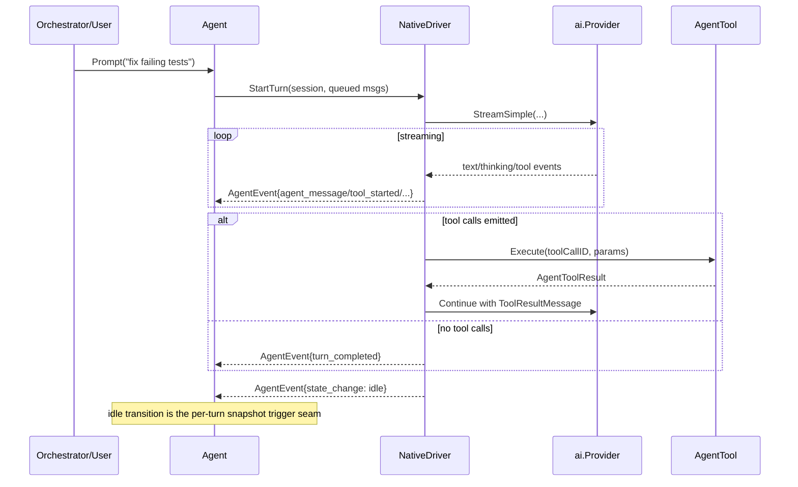
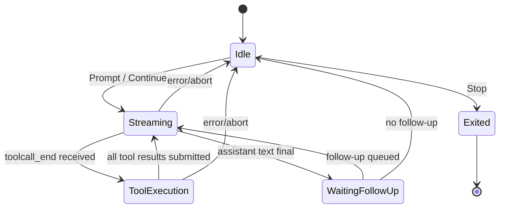

# 05: Agent Loop and Driver Abstraction

**Status:** Draft
**Depends on:** 01-ai-core, 02-provider-anthropic
**Depended on by:** 06-built-in-tools, 07-code-interpreter, 08-agent-tools-e2e, 13-rpc-layer
**Implements:** `internal/agent` Agent struct, NativeDriver loop, driver abstraction, event model, session/state management, steering/follow-up, and terminal-tool termination.

---

## 1. Overview

This plan defines the runtime's agent orchestration core: the `Agent` API and the driver model that supports both native LLM loops and 3rd-party CLI drivers. It is the seam between `internal/ai` providers and tool execution.

Primary goals:
- Implement the native loop (`LLM -> tools -> LLM`) with streaming events.
- Define uniform `AgentDriver` contracts so Native/ClaudeCode/Codex share one observable API.
- Define session/state/event types consumed by orchestrator and sandbox infrastructure.
- Support steering and follow-up injection without race conditions.
- Support terminal tools that intentionally end the loop with structured outputs.
- Preserve architecture decisions: session ID disambiguation, tool backend neutrality, and per-turn snapshot trigger semantics.

Non-goals:
- Tool implementations themselves (plan 06).
- Code interpreter meta-tool internals (plan 07).
- PTY mux implementation details (plan 09-h2-termmux-port).

---

## 2. Architecture

### 2.1 Component Diagram

```mermaid
graph TB
    subgraph "internal/agent"
        A[agent.go\nAgent API + subscription]\n
        T[types.go\nAgentMessage, AgentState,\nAgentEvent, Session, Metrics]
        D[driver.go\nAgentDriver interface\nregistry/factory]
        N[loop.go\nNativeDriver\nLLM->tools->LLM]
        Q[control_queue.go\nsteering/follow-up/abort\nserialization]
        E[event_bus.go\nfan-out + safety\nnon-blocking subscribers]

        A --> T
        A --> D
        A --> E
        D --> N
        N --> Q
        N --> E
    end

    subgraph "Dependencies"
        AI[internal/ai\nProvider, EventStream,\nmessages, transform]
        TOOLS[[]AgentTool\nLocalBackend or SandboxBackend]
        TMX[internal/termmux\n3rd-party driver adapters]
    end

    N --> AI
    N --> TOOLS
    D --> TMX
```

### 2.2 Native Turn Sequence



### 2.3 State Machine



---

## 3. Public API and Core Contracts

### 3.1 Core Types

```go
type Agent struct {
    mu          sync.Mutex
    session     *Session
    driver      AgentDriver
    subscribers map[int]func(AgentEvent)
    nextSubID   int
    running     bool
}

type Session struct {
    ID              string
    DriverSessionID string // non-authoritative, for correlation only
    ConversationLog []AgentMessage
    StateHistory    []AgentState
    Metrics         SessionMetrics
}
```

Session ID disambiguation rule:
- `Session.ID` is runtime-owned and authoritative for snapshots, rollback, pause/resume, RPC addressing, and orchestrator bookkeeping.
- `Session.DriverSessionID` stores the CLI/tool-native ID (Claude/Codex/etc.) only for correlation/debugging and must never drive control-plane operations.

### 3.2 AgentDriver Contract

`internal/agent` driver interface consumed by `Agent`:

```go
type AgentDriver interface {
    Start(ctx context.Context, session *Session, prompt string) error
    Resume(ctx context.Context, session *Session) error
    Stop(ctx context.Context) error
    Subscribe(fn func(AgentEvent)) (unsubscribe func())
}
```

Implementations:
- `NativeDriver` in `internal/agent/loop.go`.
- `ClaudeCodeDriver` and `CodexDriver` adapters over `internal/termmux` driver/runtime.

Adapter note:
- `termmux` has richer launch/session-log methods; agent-layer drivers wrap those details and expose the minimal runtime-level `AgentDriver` above.

### 3.3 AgentTool Contract

```go
type AgentTool struct {
    ai.Tool
    Label   string
    Execute func(ctx context.Context, toolCallID string, params map[string]any,
        onUpdate func(AgentToolResult)) (AgentToolResult, error)
}
```

Design requirement:
- Agent loop treats tools as pure interface calls; backend choice (`LocalBackend` vs `SandboxBackend`) is hidden behind tool construction.

### 3.4 AgentEvent Contract

Canonical event families:
- Session lifecycle: `session_started`, `session_ended`
- Turn lifecycle: `turn_started`, `turn_completed`
- Streaming: `agent_message_delta`, `agent_message_completed`, `thinking_delta`
- Tooling: `tool_started`, `tool_update`, `tool_completed`
- Control/state: `state_change`, `steering_applied`, `followup_enqueued`, `aborted`
- Errors: `driver_error`, `provider_error`, `tool_error`

All drivers must map their internal signals into these canonical types.

---

## 4. Package Structure

```text
internal/agent/
├── types.go             # Session, AgentState, AgentMessage, AgentEvent, metrics
├── agent.go             # Agent API: Prompt, Continue, Steer, FollowUp, Abort, Subscribe
├── driver.go            # AgentDriver interface, driver registry/factory
├── loop.go              # NativeDriver loop + turn executor
├── control_queue.go     # serialization of steer/followup/abort actions
├── event_bus.go         # subscriber fan-out and isolation
├── driver_claudecode.go # termmux-backed adapter
├── driver_codex.go      # termmux-backed adapter
└── errors.go            # typed errors (busy, stopped, invalid-state)
```

Import boundaries:
- `internal/agent` imports `internal/ai`.
- `internal/agent` may import `internal/termmux` in concrete driver adapter files only.
- `internal/ai` must not import `internal/agent`.

---

## 5. NativeDriver Design

### 5.1 Turn Execution Algorithm

1. Snapshot current session conversation (copy-on-read under lock).
2. Transform conversation to LLM context via `ConvertToLLM` hook.
3. Call `ai.StreamSimple` (or `Stream` if advanced options supplied).
4. Relay provider stream events into `AgentEvent`s while accumulating in-progress assistant message.
5. If final assistant message contains tool calls:
- Emit `tool_started`.
- Execute matching `AgentTool` sequentially by default (parallel optional future flag).
- Append `ToolResultMessage` to conversation.
- Continue LLM call.
6. If no tool calls, mark turn complete.
7. Apply follow-up queue if present; otherwise transition idle.
8. Emit `state_change -> idle` exactly once per completed turn.

### 5.2 Steering Semantics

- `Steer(msg)` inserts a high-priority control message after current external call boundary.
- Steering is not applied mid-tool execution or while holding locks.
- After current boundary, loop re-enters provider call with steering message appended.

### 5.3 Follow-up Semantics

- `FollowUp(msg)` appends to pending queue.
- Queue drains only after current turn completes.
- Multiple follow-ups preserve enqueue order.

### 5.4 Terminal Tools

Terminal tools are declared in options by tool name. When one returns:
- Emit `terminal_tool_completed` with structured payload.
- End turn and transition to idle without additional LLM continuation.
- Return structured terminal result to caller/orchestrator.

### 5.5 Per-turn Snapshot Trigger Seam

Architecture decision implementation contract:
- Agent runtime does not take filesystem snapshots directly.
- It emits deterministic turn-boundary signals: `turn_completed` then `state_change(idle)`.
- Sandbox/orchestrator layers subscribe to these events and trigger snapshot creation when session backend supports snapshots.
- This yields per-turn snapshots by default; per-tool-call snapshots remain optional backend policy.

---

## 6. Concurrency and Safety Model

Rules:
- Single active turn executor per `Agent` instance.
- `Prompt/Continue` rejected with typed `ErrBusy` while turn active.
- State lock never held during provider streaming, tool execution, or subscriber callbacks.
- Event subscribers isolated: panic in one subscriber must not crash agent loop.
- `Abort()` is idempotent and safe from any goroutine.

Implementation patterns:
- Control queue channel serializes `steer/followup/abort` commands.
- Event bus publishes snapshots of events to avoid shared mutable data races.
- Conversation log append operations centralized through one method enforcing copy semantics.

---

## 7. Connected Components (Seams)

| Component | Seam | Contract |
|-----------|------|----------|
| `internal/ai` | Provider streaming | `ai.StreamSimple/Stream` + `AssistantMessageEvent` consumption |
| `internal/tools` | Tool execution | `[]AgentTool` with `Execute` callback contract |
| `internal/termmux` | 3rd-party drivers | Adapter from termmux driver events to canonical `AgentEvent` |
| `internal/rpc` (future) | Remote event transport | canonical `AgentEvent` stream serializable over RPC |
| Sandbox host/orchestrator | Snapshot trigger | `turn_completed` + `state_change(idle)` boundary events keyed by `Session.ID` |

---

## 8. Acceptance Criteria

1. **Native prompt with streaming text**
- Steps: user sends prompt via agent API using Anthropic provider.
- Expected: incremental message events, final assistant message in conversation log, and idle transition.

2. **Tool call loop completion**
- Steps: prompt triggers tool call (`read_file`), tool executes, tool result is fed back.
- Expected: tool start/complete events emitted, final assistant response produced, turn completes successfully.

3. **Steering redirects an active turn**
- Steps: run long prompt, issue `Steer("change direction")` during stream.
- Expected: steering event emitted and applied at next loop boundary; subsequent assistant output reflects steering.

4. **Follow-up chain execution**
- Steps: enqueue 2 follow-up messages during first turn.
- Expected: turn 1 completes, follow-ups run in FIFO order as subsequent turns, final idle after queue drains.

5. **Driver parity on observable events**
- Steps: run equivalent task with NativeDriver and a termmux-backed driver.
- Expected: both produce canonical event types and coherent state history under one Agent API.

6. **Snapshot boundary correctness**
- Steps: execute multi-turn task with sandbox-backed tools and snapshot subscriber.
- Expected: exactly one snapshot trigger per completed turn at idle transition; triggers keyed by runtime session ID, not driver session ID.

7. **Terminal tool short-circuit**
- Steps: invoke configured terminal tool in a turn.
- Expected: loop exits turn immediately with structured terminal output and no extra LLM continuation.

---

## 9. Testing Strategy

### 9.1 Unit Tests

- Session ID disambiguation behavior and serialization.
- Busy/abort/state transition edge cases.
- Steering/follow-up queue ordering.
- Event bus subscriber isolation and unsubscribe correctness.
- Conversation append copy semantics and race safety.

### 9.2 Component Tests

- NativeDriver with mock provider streaming fixture (text + tool + error variants).
- Tool execution integration with fake `AgentTool` implementations.
- Terminal tool behavior and short-circuit path.
- Snapshot trigger event sequencing (`turn_completed` before idle).

### 9.3 Integration Tests

- Credential-gated real-provider test (Anthropic) with at least one tool cycle.
- Driver adapter test with termmux fake event source to validate canonical mapping.

---

## 10. URP (Unreasonably Robust Programming)

1. **Event trace model checker:** run generated traces through a state-transition verifier to ensure no illegal transitions can be emitted.
2. **Deterministic replay harness:** persist event + control-command logs and replay to reproduce race bugs exactly.
3. **Always-on race CI lane:** dedicated nightly `-race` stress suite with high goroutine contention and randomized abort/steer/follow-up timing.

---

## 11. Extreme Optimization

1. Pre-size and reuse event objects via pooling for high-throughput delta streaming.
2. Avoid full conversation copies on each delta; append immutable blocks and snapshot only at turn boundaries.
3. Optimize tool lookup path with precomputed map by tool name + schema hash.

---

## 12. Alien Artifacts

1. **Temporal logic validation:** encode agent state transitions in TLA+/Apalache-style specs and check traces from tests.
2. **Causal event graph analysis:** build DAG of turn/tool events to detect hidden ordering anomalies beyond linear checks.
3. **Adaptive control scheduling:** use online policy tuning for steer/follow-up boundary handling based on observed latency distributions.

---

## 13. Dependencies

| Dependency | Purpose |
|-----------|---------|
| `internal/ai` | Provider API, message and event primitives |
| `internal/termmux` | CLI-driver adapters for Claude/Codex |
| Go stdlib (`context`, `sync`, `time`) | concurrency and lifecycle |

---

## 14. Exit Criteria (Milestone G4 foundation)

1. `Agent` API supports prompt/continue/steer/follow-up/abort/subscribe with thread-safe behavior.
2. NativeDriver completes `LLM -> tools -> LLM` cycles with streaming event output.
3. Canonical `AgentEvent` model implemented and emitted consistently by NativeDriver.
4. Session ID disambiguation enforced: runtime session ID authoritative everywhere.
5. Snapshot trigger seam implemented via deterministic idle-boundary events.
6. Terminal tool path implemented and tested.
7. Unit + component tests pass under `-race`.
8. Integration test with real provider passes when credentials are supplied.
