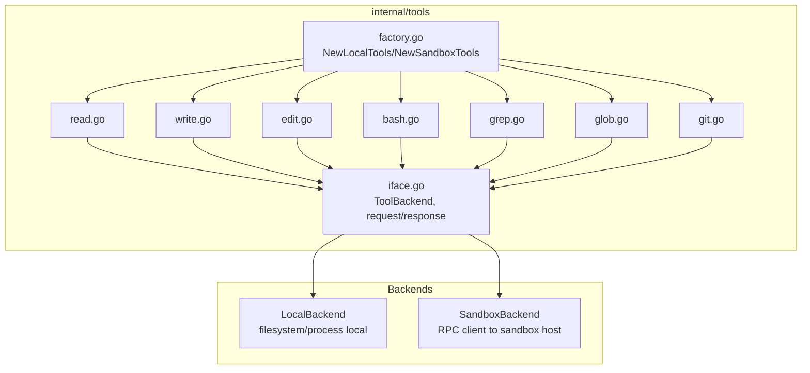
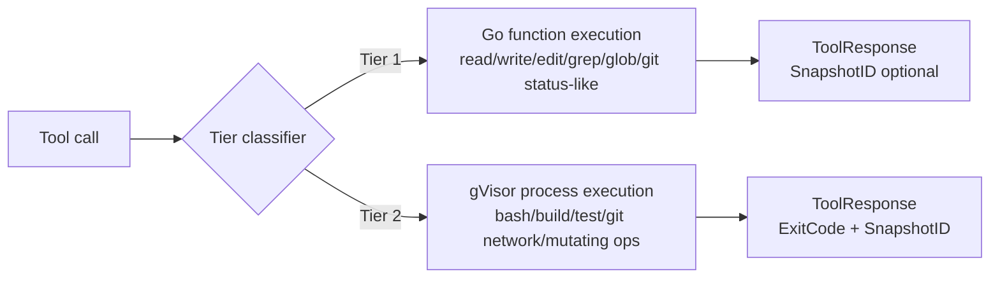
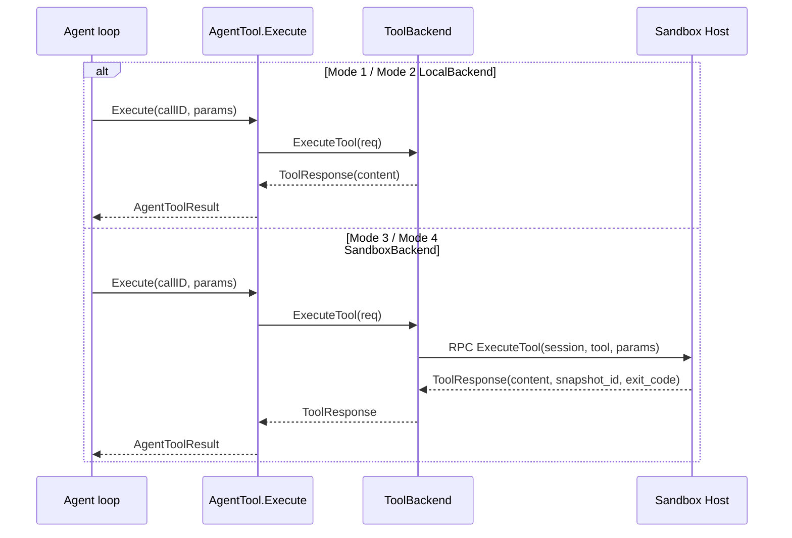

# 06: Built-in Tools and Backend Dispatch

**Status:** Draft
**Depends on:** 01-ai-core, 05-agent
**Depended on by:** 07-code-interpreter, 08-agent-tools-e2e, 11-sandbox-host-service
**Implements:** `internal/tools` built-in tools (`read`, `write`, `edit`, `bash`, `grep`, `glob`, `git`), `ToolBackend` dispatch abstraction, and factory wiring for Local/Sandbox execution.

---

## 1. Overview

This plan defines the runtime's built-in tool layer used by agent drivers. The key architectural requirement is that the agent loop sees a uniform `[]agent.AgentTool` interface while execution placement is delegated to backend implementations.

Primary goals:
- Implement tool contracts and schemas for core coding workflows.
- Implement `ToolBackend` interface with LocalBackend and SandboxBackend adapters.
- Enforce two-tier execution semantics (Tier 1 Go functions, Tier 2 isolated process execution).
- Resolve open questions for grep and edit behavior in a deterministic, LLM-friendly way.

Non-goals:
- RPC protocol details for sandbox backend transport (plan 13).
- Sandbox host internals (plan 11).
- Code interpreter meta-tool internals (plan 07).

---

## 2. Architecture

### 2.1 Component Diagram



### 2.2 Two-Tier Execution Model



Decision carried from architecture AD2/AD3:
- Tier 1 tools run directly as Go logic.
- Tier 2 tools run via process isolation on backend policy (local process for LocalBackend, gVisor container for SandboxBackend).

### 2.3 Data Flow (Mode 1 vs Mode 3)



---

## 3. API Contracts

### 3.1 ToolBackend Interface

```go
type ToolBackend interface {
    ExecuteTool(ctx context.Context, req ToolRequest) (*ToolResponse, error)
}

type ToolRequest struct {
    SessionID  string
    ToolName   string
    ToolCallID string
    Params     map[string]any
    Resources  *ResourceSpec
}

type ToolResponse struct {
    Content    []ai.ContentBlock
    SnapshotID string // empty for LocalBackend by default
    ExitCode   *int
}
```

### 3.2 Factory Functions

```go
func NewLocalTools(rootDir string, opts LocalToolsOptions) []agent.AgentTool
func NewSandboxTools(client SandboxToolClient, sessionID string) []agent.AgentTool
```

Factory invariant:
- Both factories expose the same tool names/schemas and behavioral semantics.
- Only execution placement differs.

### 3.3 Tool Catalog

| Tool | Tier | Core behavior |
|------|------|---------------|
| `read_file` | 1 | Read file with offset/limit and max-size guards |
| `write_file` | 1 | Write/overwrite file atomically |
| `edit_file` | 1 | Exact string replacement with deterministic match rules |
| `bash` | 2 | Execute shell command with timeout/resource hints |
| `grep` | 1 | Regex/literal content search with include/exclude globs |
| `glob` | 1 | Pattern-based path discovery |
| `git_*` | 1/2 | Git status/diff/log mostly Tier 1-like invocation; network/mutating ops treated as Tier 2 policy |

---

## 4. Tool Design Details

### 4.1 Path and Workspace Safety (all file tools)

- All file paths resolved against configured workspace root.
- Reject path traversal outside root after symlink-aware canonicalization.
- Enforce configurable file-size and output-size limits.

### 4.2 `read_file`

Inputs:
- `path` (required)
- `offset` (optional)
- `limit` (optional)

Output:
- Text block with requested content slice and truncation metadata when applicable.

### 4.3 `write_file`

Inputs:
- `path` (required)
- `content` (required)
- `create_dirs` (optional)

Behavior:
- Optional directory creation.
- Atomic replace (`write temp -> fsync -> rename`) to avoid partial writes.

### 4.4 `edit_file` (Open Question resolution)

Decision:
- Use exact string replacement, not diff-based patching.

Rationale:
- Deterministic and easier for LLMs to reason about.
- Predictable failure mode when `old_string` is absent or ambiguous.
- Avoids fuzzy patch heuristics and hidden partial-application errors.

Rules:
- Require explicit `old_string` and `new_string`.
- Default single replacement unless `replace_all=true`.
- Return structured mismatch diagnostics when not found.

### 4.5 `bash`

Inputs:
- `cmd` (required)
- `timeout_ms` (optional)
- resource hints (`cpus`, `mem_mb`) optional for backend policy.

Behavior:
- Streams incremental stdout/stderr updates via `onUpdate` callback.
- Returns final output, exit code, duration, truncation metadata.

### 4.6 `grep` (Open Question resolution)

Decision:
- Implement pure Go grep initially; do not embed ripgrep binary in V1.

Rationale:
- Avoids shipping platform-specific binaries and update complexity.
- Keeps runtime as pure-Go artifact for portability and reproducibility.
- Performance is sufficient for initial tooling scope; benchmark thresholds defined below.

Design:
- Walk files under root with ignore filters.
- Use Go regex engine and optional literal fast path.
- Return match records with file/line/column/snippet.

Future hook:
- Optional ripgrep acceleration can be added behind a backend capability flag when warranted by benchmark evidence.

### 4.7 `glob`

- Use doublestar-style patterns for recursive matching.
- Deterministic sorted output.
- Limit max returned paths and include truncation indicator.

### 4.8 `git_*`

Scope in V1:
- `git_status`, `git_diff`, `git_log`, `git_show`, `git_add`, `git_commit`.

Policy:
- Commands with potential remote/network effects (`push`, `fetch`, `pull`, `clone`) excluded from default tool set in V1 or treated as Tier 2 with stricter policy gates.

---

## 5. Backend Implementations

### 5.1 LocalBackend

- Executes file tools directly in-process under workspace root.
- Executes process tools via `exec.CommandContext` with timeout.
- `SnapshotID` generally empty in responses.

### 5.2 SandboxBackend

- Thin RPC client adapter implementing `ToolBackend`.
- Forwards `SessionID`, `ToolCallID`, tool name, params, resource hints.
- Returns backend-populated `SnapshotID` and exit code fields.

### 5.3 Tier Classification Policy

Classifier function:
- Tier 1: read/write/edit/grep/glob + safe git read-only operations.
- Tier 2: bash and policy-marked git operations.

Classifier is centralized and shared to prevent drift across tools/backends.

---

## 6. Connected Components (Seams)

| Component | Seam | Contract |
|-----------|------|----------|
| `internal/agent` | Tool exposure | `[]agent.AgentTool` with stable names/schema/Execute semantics |
| `internal/sandbox` / `internal/rpc` | Remote dispatch | `ToolBackend.ExecuteTool(ToolRequest) -> ToolResponse` |
| `internal/ai` | Tool schema/types | `ai.Tool`, `ai.ContentBlock` for results |
| `internal/tools/codeinterp` | Meta-tool invocation | relies on tool catalog discoverability and schema consistency |

---

## 7. Acceptance Criteria

1. **Local file workflow**
- Steps: Agent uses local tools to read, edit, and write a file.
- Expected: deterministic outputs, no root escape, final file content matches expected edits.

2. **Sandbox-dispatched tool parity**
- Steps: Same prompt/tool calls executed with SandboxBackend.
- Expected: same semantic tool results as LocalBackend plus snapshot metadata when available.

3. **Bash execution with streaming updates**
- Steps: Run long command (`go test ./...`) through bash tool.
- Expected: progressive updates emitted, final exit code captured, timeout honored.

4. **Grep and glob on medium repo**
- Steps: search patterns and glob across nested directories.
- Expected: deterministic sorted results, bounded output, acceptable latency.

5. **Git inspection commands**
- Steps: run status/diff/log in repo with pending changes.
- Expected: accurate output formatting and non-zero exit handling surfaced clearly.

6. **Edit mismatch handling**
- Steps: attempt edit with absent `old_string`.
- Expected: structured failure message with zero file mutation.

7. **Tier policy correctness**
- Steps: invoke Tier 1 and Tier 2 tools under sandbox host with instrumentation.
- Expected: Tier 1 avoids container path; Tier 2 uses isolated execution path.

---

## 8. Testing Strategy

### 8.1 Unit Tests

- Per-tool schema and argument validation.
- Path canonicalization and traversal rejection.
- Edit exact-match semantics including replace-all and mismatch paths.
- Grep matcher correctness for regex and literal modes.
- Glob sorting/truncation behavior.
- Tier classifier determinism.

### 8.2 Component Tests

- LocalBackend end-to-end per tool using temp workspaces.
- SandboxBackend with fake RPC server validating request forwarding and response mapping.
- Bash tool update callback ordering and truncation behavior.

### 8.3 Integration Tests

- Real git repo fixture tests for git tools.
- (Credential/infra gated) sandbox integration for Tier 1 vs Tier 2 execution routing.

---

## 9. URP (Unreasonably Robust Programming)

1. **Filesystem mutation journal:** record every mutating tool action as structured event stream for replay/audit.
2. **Differential backend runner:** execute same call against LocalBackend and SandboxBackend (mocked dataset) and compare normalized outputs nightly.
3. **Tool policy verifier:** static/dynamic checks ensuring every tool has explicit tier, limits, and path-safety guards.

---

## 10. Extreme Optimization

1. Zero-copy file slice reads for large files using mmap-like strategy where safe.
2. Grep fast path with Aho-Corasick for multi-literal search mode before regex fallback.
3. Batched directory walking with worker pools tuned by IO characteristics.

---

## 11. Alien Artifacts

1. **Search-plan optimizer:** cost-based selection between literal scan, regex scan, and indexed scan per query shape.
2. **Edit operation proof checks:** pre/post content hashing with formal invariants that only expected spans changed.
3. **Adaptive resource estimator:** online model predicting Tier 2 resource needs from command signatures.

---

## 12. Dependencies

| Dependency | Purpose |
|-----------|---------|
| `internal/agent` | `AgentTool` interface shape |
| `internal/ai` | tool schemas and content blocks |
| Go stdlib (`os`, `io/fs`, `os/exec`, `regexp`, `path/filepath`) | core tool implementation |
| `github.com/bmatcuk/doublestar/v4` (or equivalent) | recursive glob semantics |

---

## 13. Exit Criteria

1. All built-in tools implemented with stable schemas and deterministic outputs.
2. `NewLocalTools` and `NewSandboxTools` return compatible tool catalogs.
3. `ToolBackend` dispatch works for both local and sandbox adapters.
4. Two-tier classifier implemented and covered by tests.
5. Edit tool uses exact-string algorithm with explicit mismatch reporting.
6. Grep implemented in pure Go with benchmark targets met.
7. Tool package tests pass under `-race`.
8. Integration tests for git and sandbox routing pass in gated environments.
