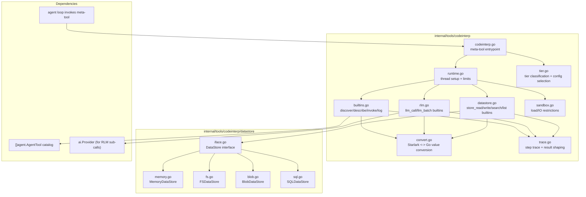
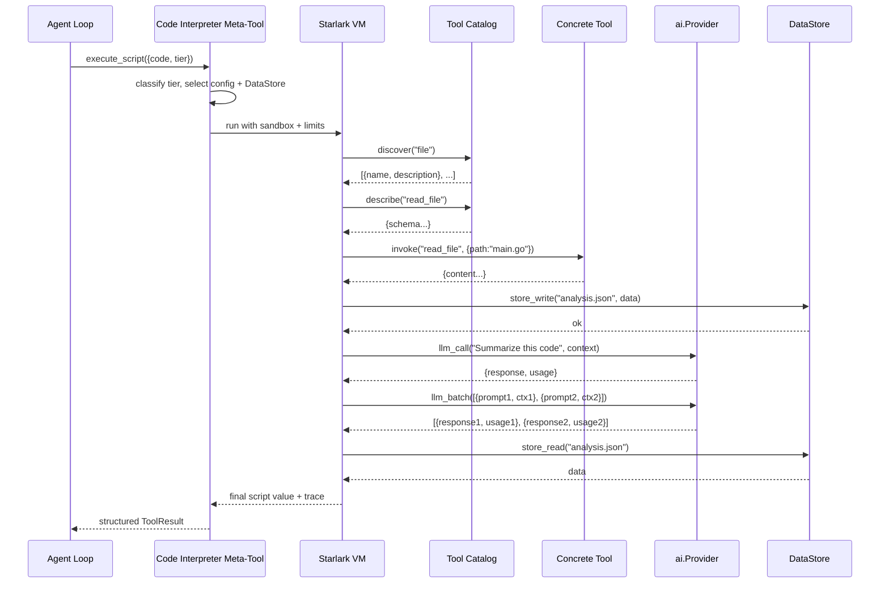
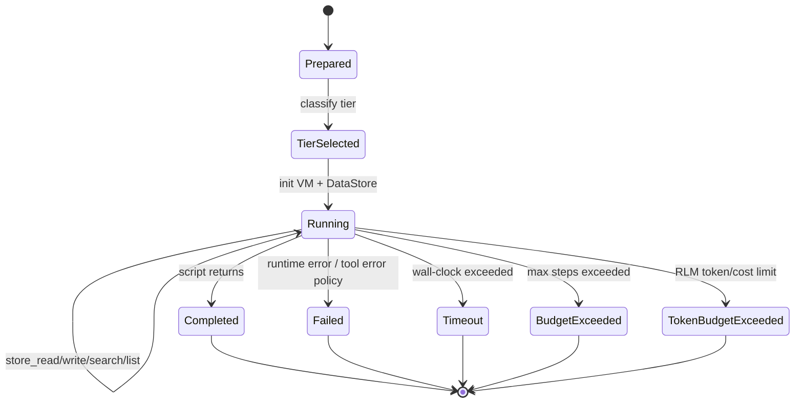
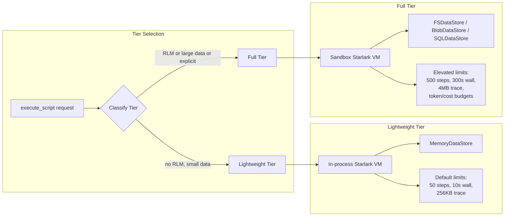

# 07: Code Interpreter Meta-Tool (Starlark)

**Status:** Draft
**Depends on:** 01-ai-core, 05-agent, 06-built-in-tools
**Depended on by:** 08-agent-tools-e2e
**Implements:** `internal/tools/codeinterp` Starlark meta-tool with progressive tool discovery (`discover -> describe -> invoke`), recursive LLM calls (`llm_call`, `llm_batch`), pluggable DataStore (`store_read`, `store_write`, `store_search`, `store_list`), two-tier execution (lightweight in-process vs full Session Sandbox execution), multi-step workflows, and configurable execution limits.

---

## 1. Overview

This plan defines the code interpreter meta-tool that allows an LLM to execute multi-step tool workflows inside one tool call. Instead of repeatedly round-tripping between LLM and tools for each step, a constrained Starlark script can discover tools, inspect schemas, invoke tools, spawn sub-LLM calls, and interact with persistent storage — all within a single agent turn.

The code interpreter extends basic tool scripting with three major capabilities:

1. **Recursive LLM (RLM) support**: Starlark scripts can spawn sub-LLM calls for map-reduce patterns, classification, summarization, and other reasoning tasks. Sub-calls use existing `internal/ai` provider infrastructure with isolated context and configurable token/cost budgets.

2. **Pluggable DataStore**: Scripts interact with storage through a generic `DataStore` interface instead of assuming filesystem access. Implementations include `MemoryDataStore` (lightweight scripts), `FSDataStore` (ZFS/local for sandbox-backed workflows), `BlobDataStore` (S3/GCS for large object storage), and `SQLDataStore` (for edb analytics queries).

3. **Two execution tiers**: Lightweight scripts run in-process with `MemoryDataStore` and default limits. Full scripts (RLM workflows, large data processing) run in sandbox with `FSDataStore` or external DataStore and elevated limits.

### 1.1 Determinism and Sandbox Terms

- **Deterministic core runtime:** Pure Starlark execution plus deterministic builtins (`discover`, `describe`, `invoke`, `store_*`) is deterministic for fixed inputs.
- **Controlled non-determinism:** `llm_call` and `llm_batch` are provider-backed and inherently non-deterministic unless responses are fixed by a deterministic test provider or replay cache.
- **Replay strategy:** deterministic tests MUST inject a fake provider; replay tooling SHOULD support response fixtures keyed by request content hash.
- **Session Sandbox vs Tool Call Sandbox:** this document uses **Session Sandbox** for code interpreter TierFull execution isolation. The per-tool-call gVisor container in plans 10/11 is the **Tool Call Sandbox**.

Primary goals:
- Provide sandboxed Starlark execution via `go.starlark.net`.
- Expose progressive discovery builtins: `discover`, `describe`, `invoke`.
- Expose RLM builtins: `llm_call`, `llm_batch`.
- Expose DataStore builtins: `store_write`, `store_read`, `store_search`, `store_list`.
- Enforce configurable safety limits (step count + wall clock timeout + output bounds + token/cost budgets).
- Support two execution tiers with automatic or explicit tier selection.
- Return structured execution traces useful to the agent loop.

Non-goals:
- General-purpose scripting runtime with unrestricted filesystem/network access.
- Persistent script state across turns (DataStore persists, script state does not).
- Custom Starlark module imports (load disabled).
- GPU offloading or SIMD within Starlark scripts (handled by underlying tools/providers).

---

## 2. Architecture

### 2.1 Component Diagram



### 2.2 Progressive Discovery + RLM Flow



### 2.3 Execution State Machine



### 2.4 Two-Tier Execution Model



---

## 3. Sandboxing and Library Decision

### 3.1 `go.starlark.net` Selection

Decision (resolving plan-index OQ9):
- Use `go.starlark.net` as the Starlark interpreter.

Compatibility/sandboxing confirmation for V1:
- Deterministic language runtime suitable for hermetic execution.
- No filesystem/network access unless host provides custom builtins.
- No goroutines/threads exposed in language runtime.
- No module imports when `load` is disabled by host.

Host-enforced restrictions in our implementation:
- Disable `load` entirely.
- Expose only approved builtins (`discover`, `describe`, `invoke`, `log`, `llm_call`, `llm_batch`, `store_read`, `store_write`, `store_search`, `store_list`).
- No host objects with direct OS/network primitives.
- Bound execution with step budget + wall-clock timeout + token/cost budget.

### 3.2 Threat Model

- Scripts are untrusted LLM-generated code.
- Security boundary is capability restriction (only approved builtins).
- Script can only affect world through `invoke` on already-allowed tools, `llm_call`/`llm_batch` on pre-configured providers, and `store_*` on the scoped DataStore.
- RLM sub-calls inherit the parent agent's provider configuration but with isolated conversation context and per-call token/cost budgets.
- `model` in `llm_call`/`llm_batch` selects a model within the configured provider only; cross-provider switching is out of scope for V1.
- DataStore access is scoped to the script's session — no cross-session reads/writes.

---

## 4. API and Types

### 4.1 Meta-tool Surface

Tool name:
- `execute_script`

Parameters:
- `code` (string, required) — Starlark source code
- `entrypoint` (string, optional, default `main`) — function to call
- `args` (object, optional) — arguments passed to entrypoint
- `tier` (string, optional, `"lightweight"` | `"full"`, default auto-detected)
- `max_steps` (int, optional; capped by server policy)
- `timeout_ms` (int, optional; capped by server policy)
- `max_llm_tokens` (int, optional; caps total tokens across all RLM sub-calls)
- `max_llm_cost_usd` (float, optional; caps total estimated cost across RLM sub-calls)
- `datastore_type` (string, optional; override DataStore selection: `"memory"`, `"fs"`, `"blob"`, `"sql"`)

Return payload:
- `result` (JSON-compatible value)
- `trace` (ordered step records including tool calls and RLM calls)
- `stats` (`steps`, `duration_ms`, `tool_calls`, `discover_calls`, `describe_calls`, `llm_calls`, `llm_tokens_used`, `llm_cost_usd`, `store_ops`)
- `truncated` flags when limits apply
- `tier` (which execution tier was used)

### 4.2 Tool Discovery Builtins

```python
discover(keyword: str) -> list[dict]
describe(tool_name: str) -> dict
invoke(tool_name: str, params: dict) -> dict
log(message: str) -> None
```

Behavioral contracts:
- `discover` returns only summary metadata (name, short description, tags).
- `describe` returns full schema/details for one tool.
- `invoke` validates tool existence and argument shape via underlying tool contract.
- All builtin calls append structured entries to execution trace.

### 4.3 RLM Builtins

```python
llm_call(prompt: str, context: str = "", model: str = "", max_tokens: int = 0) -> dict
llm_batch(calls: list[dict]) -> list[dict]
```

#### `llm_call`

Spawns a single sub-LLM call with isolated context.

Parameters:
- `prompt` (str, required): the prompt to send
- `context` (str, optional): additional context injected as a system/developer message
- `model` (str, optional): model override within the configured provider; defaults to the agent's configured model
- `max_tokens` (int, optional): per-call token limit; capped by remaining budget

Returns:
```python
{
    "response": "...",       # assistant text response
    "usage": {
        "input_tokens": 150,
        "output_tokens": 75,
        "cost_usd": 0.003
    },
    "model": "claude-sonnet-4-6"
}
```

#### `llm_batch`

Spawns multiple sub-LLM calls in parallel for map-reduce patterns.

Parameters:
- `calls` (list[dict]): each dict has `prompt`, optional `context`, optional `model`, optional `max_tokens`

Returns:
- list of result dicts in same order as input, each with same shape as `llm_call` return

Implementation:
- Sub-calls dispatched concurrently via `errgroup` with configurable concurrency limit (default 5).
- Each call gets isolated conversation context (no shared state between parallel calls).
- Aggregate token/cost usage tracked against script-level budgets.
- Any individual call failure returns error in that result slot; other calls continue.

### 4.4 DataStore Builtins

```python
store_write(key: str, data: str) -> None
store_read(key: str) -> str
store_read_range(key: str, offset: int, limit: int) -> str
store_search(key: str, pattern: str) -> list[dict]
store_list(prefix: str) -> list[str]
store_delete(key: str) -> None
```

All DataStore builtins operate on the script's scoped DataStore instance. Keys are validated against path traversal and injection patterns.

### 4.5 DataStore Interface

```go
var ErrNotSupported = errors.New("codeinterp datastore: operation not supported")

// DataStore provides key-value storage for code interpreter scripts.
// Implementations are scoped per script execution session.
type DataStore interface {
    Write(key string, data []byte) error
    Read(key string) ([]byte, error)
    ReadRange(key string, offset, limit int64) ([]byte, error)
    List(prefix string) ([]string, error)
    Delete(key string) error
    Close() error
}

// SearchableDataStore is an optional capability for regex/pattern search.
type SearchableDataStore interface {
    Search(keyPrefix string, pattern string) ([]Match, error)
}

// Match represents a search result. Search can return matches from multiple keys.
type Match struct {
    Key     string
    Line    int
    Column  int
    Content string
}
```

`store_search(key, pattern)` interprets `key` as a key prefix. Implementations that support search return matches across all keys beginning with that prefix. If the backing store does not implement `SearchableDataStore`, `store_search` returns a typed "not supported" error mapped from `ErrNotSupported`.

#### MemoryDataStore

In-memory key-value store. Used for lightweight tier. No persistence. Bounded by configurable memory limit (default 16MB total).

```go
type MemoryDataStore struct {
    mu       sync.RWMutex
    data     map[string][]byte
    maxBytes int64
    used     int64
}
```

#### FSDataStore

Filesystem-backed store rooted at a directory (typically a ZFS dataset mountpoint). Used for full tier in sandbox mode. Supports large files, range reads, and regex search via `regexp`.

```go
type FSDataStore struct {
    root     string  // base directory
    maxBytes int64   // per-key size limit
}
```

#### BlobDataStore

Cloud object storage backend (S3/GCS). Used for large-scale data processing workflows. Implements range reads via HTTP Range headers. Search is optional and returns `ErrNotSupported` for the V1 blob backend.

```go
type BlobDataStore struct {
    client   objstore.Client  // abstracted blob client
    bucket   string
    prefix   string
    maxBytes int64
}
```

#### SQLDataStore

SQL query interface for edb analytics. Write/Read/Delete operate on a key-value table. Search translates pattern to SQL LIKE/REGEXP. List uses prefix-based SELECT.

```go
type SQLDataStore struct {
    db       *sql.DB
    table    string
    maxBytes int64
}
```

### 4.6 Runtime Config

```go
// Config holds execution limits for the code interpreter.
type Config struct {
    // Step and time limits
    MaxSteps       int           // lightweight default 50, full default 500
    MaxWallTime    time.Duration // lightweight default 10s, full default 300s
    MaxTraceBytes  int           // lightweight default 256KB, full default 4MB
    MaxResultBytes int           // lightweight default 256KB, full default 1MB

    // RLM limits
    MaxLLMCalls       int     // default 0 (disabled) for lightweight, 50 for full
    MaxLLMTokens      int     // total token budget across all sub-calls
    MaxLLMCostUSD     float64 // total cost budget across all sub-calls
    LLMConcurrency    int     // max parallel llm_batch calls, default 5
    DefaultLLMModel   string  // default model for sub-calls, inherited from agent

    // DataStore limits
    MaxStoreBytes     int64   // total DataStore capacity per execution
    MaxStoreKeySize   int     // max key length, default 512 bytes
    MaxStoreValueSize int64   // max single value size

    // Tier
    Tier              Tier    // Lightweight or Full
}

type Tier int

const (
    TierLightweight Tier = iota
    TierFull
)

// DefaultLightweightConfig returns defaults for lightweight tier.
func DefaultLightweightConfig() Config

// DefaultFullConfig returns defaults for full tier.
func DefaultFullConfig() Config
```

### 4.7 Tier Classification

```go
// ClassifyTier determines the execution tier based on script content and request.
// Returns TierFull if:
//   - Script contains llm_call or llm_batch calls (detected by AST scan)
//   - Request explicitly sets tier="full"
//   - Request specifies non-memory DataStore
//   - Request sets max_steps > lightweight default
// Otherwise returns TierLightweight.
func ClassifyTier(code string, req ExecuteRequest) Tier
```

Tier classification parses the Starlark AST and detects concrete call expressions to `llm_call` / `llm_batch`. String literals, comments, and unrelated identifiers must not trigger TierFull.

---

## 5. Algorithms and Policies

### 5.1 Step Accounting

- Every builtin call increments `steps` (discover, describe, invoke, log, llm_call, store_*).
- `llm_batch` increments steps by number of calls in the batch.
- Optional line-execution hook increments internal instruction counter for tight loops.
- Exceeding `MaxSteps` returns typed `budget_exceeded` error.

### 5.2 Timeout Handling

- Execution runs with context deadline.
- On timeout, VM interrupted and returns typed `timeout` error with partial trace.
- RLM sub-calls inherit the remaining wall-clock budget via context.

### 5.3 Token/Cost Budget Tracking

- Each `llm_call` and `llm_batch` call reports usage (input tokens, output tokens, estimated cost).
- Running totals tracked in `ExecutionState`.
- Pre-check before each RLM call: if remaining budget < estimated minimum, return typed `token_budget_exceeded` error.
- Estimation policy (hard budget):
  - estimated input tokens from prompt/context size.
  - estimated output tokens = `max_tokens` when provided, otherwise `DefaultRLMMaxTokens` (configurable, default 1024).
  - estimated cost computed from model catalog pricing using estimated input/output tokens.
  - if estimate exceeds remaining token or cost budget, the call is rejected before dispatch.
- Cost estimation uses model catalog pricing from `internal/ai`.

### 5.4 Error Policy

Default:
- `invoke` tool failure raises Starlark runtime error and aborts script.
- `llm_call` provider failure raises Starlark runtime error and aborts script.
- `llm_batch` individual call failure returns error in that result slot; script continues.

Future (V2, not part of V1 builtins):
- `invoke_safe(tool_name, params)` returns `{ok: bool, result: dict, error: str}` for branchable scripts.
- `llm_call_safe(prompt, ...)` returns `{ok: bool, response: str, error: str}`.

### 5.5 Value Conversion

- Starlark values converted to canonical JSON-compatible forms.
- Reject unsupported value kinds with explicit conversion errors.
- Deterministic map key ordering in returned JSON for stable tests.
- DataStore read results converted from `[]byte` to Starlark `str`.

### 5.6 RLM Sub-call Implementation

```go
// rlmCall executes a single sub-LLM call using the configured provider.
func (r *rlmRunner) rlmCall(ctx context.Context, req rlmRequest) (*rlmResult, error) {
    // 1. Check remaining token/cost budget
    // 2. Build minimal conversation: system context + user prompt
    // 3. Call provider.Complete() with sub-call-scoped config
    // 4. Collect response, update running totals
    // 5. Append trace entry
    // 6. Return result
}
```

Sub-calls use the existing `ai.Provider` interface. The conversation context for each sub-call is isolated — it contains only the prompt and optional context, not the parent agent's full conversation history. This prevents context window bloat and information leakage between sub-calls.

---

## 6. Package Structure

```text
internal/tools/codeinterp/
├── codeinterp.go        # AgentTool factory for execute_script
├── runtime.go           # VM init, execution orchestration, limits
├── builtins.go          # discover/describe/invoke/log implementations
├── rlm.go               # llm_call/llm_batch implementations
├── datastore.go         # store_read/write/read_range/search/list/delete builtin wrappers
├── sandbox.go           # load restrictions and capability wiring
├── convert.go           # Starlark<->Go conversion helpers
├── trace.go             # trace event types + serialization
├── tier.go              # tier classification + config selection
├── errors.go            # typed errors (timeout, budget_exceeded, token_budget_exceeded, conversion)
├── options.go           # Config defaults and validation
└── datastore/           # DataStore interface and implementations
    ├── iface.go         # DataStore interface + Match type
    ├── memory.go        # MemoryDataStore (in-memory, bounded)
    ├── fs.go            # FSDataStore (filesystem-backed)
    ├── blob.go          # BlobDataStore (S3/GCS)
    ├── sql.go           # SQLDataStore (edb analytics)
    └── validate.go      # key validation, path traversal prevention
```

---

## 7. Connected Components (Seams)

| Component | Seam | Contract |
|-----------|------|----------|
| `internal/agent` | Tool invocation | exposed as one `agent.AgentTool` (`execute_script`) |
| `internal/tools` | Discovery + invocation | uses same tool catalog as agent loop; no special backdoor |
| `internal/ai` | Provider for RLM | sub-calls use `ai.Provider.Complete()` with isolated context |
| `internal/ai` | Result typing | outputs JSON-compatible blocks through normal tool result path |
| `internal/ai` | Cost tracking | RLM usage accumulated and reported alongside tool result |
| `internal/sandbox` | Session Sandbox execution | TierFull execution is isolated in Session Sandbox (not Tool Call Sandbox) |
| `internal/sandbox/zfs` | FSDataStore root | FSDataStore rooted at ZFS dataset mountpoint in sandbox mode |
| Observability layer | Trace emission | structured execution trace includes tool calls, RLM calls, and store ops |

---

## 8. Acceptance Criteria

1. **Progressive discovery flow works**
- Steps: script calls `discover("file")`, then `describe("read_file")`, then `invoke`.
- Expected: successful execution with trace showing all three steps in order.

2. **Multi-step workflow in one turn**
- Steps: script reads file, greps output, writes patch note.
- Expected: all sub-steps complete within one meta-tool invocation and return structured summary.

3. **RLM sub-call works**
- Steps: script reads a file, calls `llm_call("Summarize this code", file_content)`, stores result.
- Expected: sub-LLM call executes with isolated context, response returned to script, usage tracked.

4. **RLM batch map-reduce works**
- Steps: script reads multiple files, calls `llm_batch` to summarize each, aggregates results.
- Expected: parallel sub-calls complete, results in correct order, aggregate usage reported.

5. **DataStore read/write cycle**
- Steps: script calls `store_write("key", data)`, then `store_read("key")` and `store_search("key", pattern)`.
- Expected: data persists within execution, search returns matches, all ops traced.

6. **Lightweight tier auto-selection**
- Steps: script with only discover/invoke calls submitted without explicit tier.
- Expected: runs in lightweight tier with MemoryDataStore and default limits.

7. **Full tier auto-selection**
- Steps: script with `llm_call` submitted without explicit tier.
- Expected: runs in full tier with elevated limits.

8. **Step limit enforcement**
- Steps: run script with intentional loop exceeding configured step budget.
- Expected: deterministic `budget_exceeded` error with partial trace.

9. **RLM token budget enforcement**
- Steps: run script with RLM calls exceeding token budget.
- Expected: `token_budget_exceeded` error with partial trace and usage stats.

10. **Wall-clock timeout enforcement**
- Steps: run script that blocks on repeated expensive operations.
- Expected: deterministic timeout with interrupted execution and bounded output.

11. **Sandbox restriction guarantees**
- Steps: script tries `load(...)` or access unavailable globals.
- Expected: execution rejected with sandbox error; no external side effects.

12. **Backend-neutral invocation**
- Steps: run same script with local and sandbox-backed tool catalogs.
- Expected: equivalent semantic outputs; backend placement transparent to script.

---

## 9. Testing Strategy

### 9.1 Unit Tests

- Builtin argument validation and return shaping (all 10+ builtins).
- Conversion edge cases across nested maps/lists/scalars.
- Load restriction and global-scope sandbox checks.
- Step/timeout/token config validation.
- Tier classification logic with various script patterns.
- DataStore key validation and path traversal prevention.
- RLM budget tracking arithmetic.

### 9.2 Component Tests

- End-to-end script execution over fake tool catalog + mock provider.
- Trace correctness and deterministic ordering (including RLM and store ops).
- Tool failure propagation behavior.
- RLM budget enforcement with mock provider returning controlled usage.
- DataStore implementation tests for each backend (Memory, FS, Blob mock, SQL mock).
- Tier auto-classification tests.

### 9.3 Integration Tests

- Meta-tool wired through real agent loop + built-in tool catalog.
- LocalBackend and SandboxBackend parity for scripted workflows.
- RLM sub-calls through real provider (gated behind API key).
- FSDataStore on real filesystem with concurrent access patterns.

---

## 10. URP (Unreasonably Robust Programming)

1. **Replayable script transcripts:** persist code, inputs, trace, RLM prompts/responses, and store ops for deterministic replay. RLM responses cached by content hash for replay.
2. **Formal capability audit:** automated check proving no non-approved host capabilities are reachable from VM globals. Extended to verify RLM calls cannot access parent conversation context.
3. **Policy synthesis:** static preflight that predicts script risk/complexity (including RLM cost estimation) and auto-tunes limits.
4. **DataStore consistency checker:** verify that all writes are matched by eventual reads or explicit deletes; detect orphaned data.
5. **RLM cost circuit breaker:** secondary enforcement layer that monitors real provider billing signals and can halt execution if actual costs diverge from estimates.

---

## 11. Extreme Optimization

1. Cache compiled Starlark programs by content hash for repeated script patterns.
2. Use pooled conversion buffers for large trace/result marshaling.
3. Fast path for common builtin call signatures to reduce reflection overhead.
4. RLM response streaming: pipe partial responses to script as they arrive for early processing (future).
5. MemoryDataStore zero-copy reads: return slice references when safe (single-goroutine scripts).
6. `llm_batch` dynamic concurrency: scale parallelism based on remaining wall-clock budget and provider rate limits.

---

## 12. Alien Artifacts

1. **Abstract interpretation preflight:** estimate worst-case step growth and RLM token consumption before execution using control-flow analysis.
2. **Trace automata mining:** infer common script motifs and recommend optimized tool macros.
3. **Adaptive timeout controller:** Bayesian tuning of per-script timeout from historical execution telemetry.
4. **RLM prompt compression:** apply learned compression to RLM sub-call prompts to reduce token usage while preserving semantic content (distillation-based approach).
5. **DataStore access pattern prediction:** prefetch data based on script control-flow analysis to reduce latency for FSDataStore/BlobDataStore.

---

## 13. Dependencies

| Dependency | Purpose |
|-----------|---------|
| `go.starlark.net` | deterministic scripting runtime |
| `internal/agent` | meta-tool exposure contract |
| `internal/tools` | underlying discover/describe/invoke catalog |
| `internal/ai` | Provider interface for RLM sub-calls, model catalog for cost tracking |
| `internal/sandbox/zfs` | FSDataStore root directory in sandbox mode |
| Go stdlib (`context`, `time`, `encoding/json`, `sync`, `database/sql`) | limits, timing, serialization, concurrency, SQL backend |
| Cloud SDK (S3/GCS client) | BlobDataStore implementation |

---

## 14. Exit Criteria

1. `execute_script` meta-tool is available through tool factories.
2. `discover -> describe -> invoke` builtins are implemented and traced.
3. `llm_call` and `llm_batch` builtins are implemented with token/cost budget tracking.
4. DataStore interface is implemented with MemoryDataStore and FSDataStore backends.
5. `go.starlark.net` runtime is sandboxed with load disabled and limited builtins.
6. Step-count, wall-clock, and token/cost limits are enforced with typed errors.
7. Two-tier execution works with automatic classification.
8. Multi-step workflows including RLM sub-calls return structured results; deterministic replay requires fixed provider responses.
9. Local vs sandbox backend neutrality demonstrated in integration tests.
10. Code interpreter package tests pass under `-race`.

## Review Disposition

| # | Reviewer | Severity | Summary | Disposition | Notes |
|---|----------|----------|---------|-------------|-------|
| 1 | coder-2-sea | P1 | RLM sub-calls break absolute determinism claim | Incorporated | Added determinism carve-out and replay strategy in §1.1 and acceptance criteria updates. |
| 2 | coder-2-sea | P1 | DataStore Search semantics and optional capability are ambiguous | Incorporated | Split `SearchableDataStore`, defined key-prefix search semantics, and typed not-supported behavior. |
| 3 | coder-2-sea | P2 | Tier classification via identifier scan is fragile | Incorporated | Tier classification now specifies AST call-expression detection. |
| 4 | coder-2-sea | P2 | DataStore cleanup lifecycle unclear | Incorporated | Lifecycle remains explicit through `Close()` contract and session-scoped store semantics. |
| 5 | coder-2-sea | P2 | RLM budget estimation unspecified | Incorporated | Added explicit hard-budget estimation policy in §5.3. |
| 6 | coder-2-sea | P2 | `invoke_safe` / `llm_call_safe` not fully specified | Incorporated | Reclassified as V2/future to avoid V1 ambiguity. |
| 7 | coder-2-sea | P3 | `store_read_range`/`store_delete` inconsistent in package section | Incorporated | Updated package structure comment to include all datastore builtins. |
| 8 | coder-2-sea | P1 | Provider resolution strategy unspecified | Incorporated | Pinned to configured provider; `model` only selects within provider in V1. |
| 9 | coder-2-sea | P2 | Session Sandbox relationship to code interpreter unspecified | Incorporated | Added explicit Session Sandbox seam and terminology disambiguation. |
| 10 | coder-2-sea | P3 | MemoryDataStore benchmark target too low | Incorporated | Raised benchmark target in companion test harness B6. |
