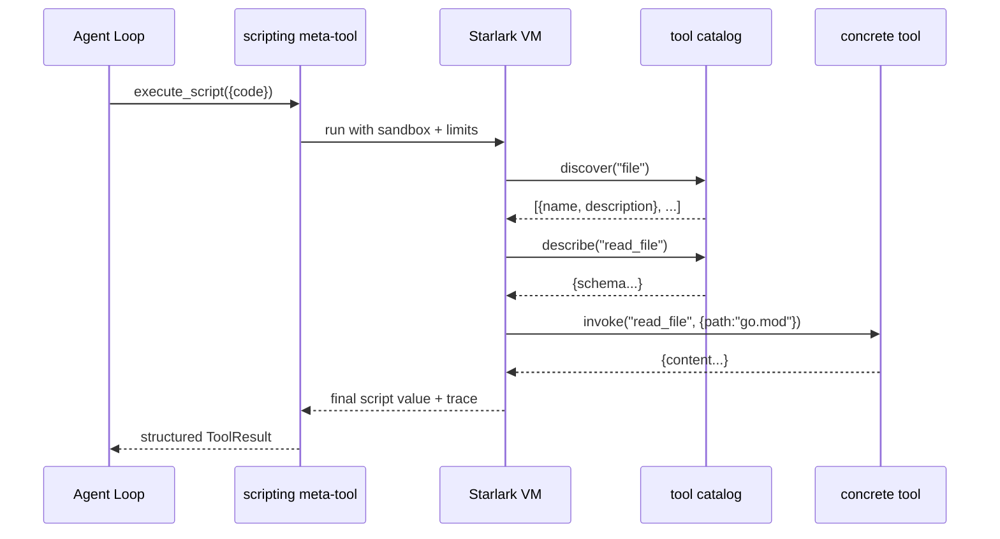
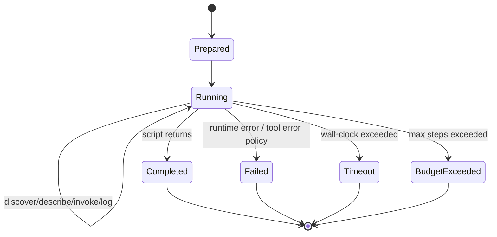

# 07: Tool Scripting Meta-Tool (Starlark)

**Status:** Draft
**Depends on:** 01-ai-core, 05-agent, 06-built-in-tools
**Depended on by:** 08-agent-tools-e2e
**Implements:** `internal/tools/scripting` Starlark meta-tool with progressive tool discovery (`discover -> describe -> invoke`), multi-step workflows, and strict execution limits.

---

## 1. Overview

This plan defines the tool-scripting meta-tool that allows an LLM to execute multi-step tool workflows inside one tool call. Instead of repeatedly round-tripping between LLM and tools for each step, a constrained Starlark script can discover tools, inspect schemas, and invoke tools sequentially.

Primary goals:
- Provide sandboxed Starlark execution via `go.starlark.net`.
- Expose progressive discovery builtins: `discover`, `describe`, `invoke`.
- Enforce strict safety limits (step count + wall clock timeout + output bounds).
- Return structured execution traces useful to the agent loop.

Non-goals:
- General-purpose scripting runtime with filesystem/network access.
- Persistent script state across turns.
- Parallel tool execution inside scripts in V1.

---

## 2. Architecture

### 2.1 Component Diagram

```mermaid
graph TB
    subgraph "internal/tools/scripting"
        M[scripting.go\nmeta-tool entrypoint]
        RT[runtime.go\nthread setup + limits]
        BI[builtins.go\ndiscover/describe/invoke/log]
        SB[sandbox.go\nload/IO restrictions]
        CONV[convert.go\nStarlark <-> Go value conversion]
        TR[trace.go\nstep trace + result shaping]

        M --> RT
        RT --> BI
        RT --> SB
        BI --> CONV
        BI --> TR
    end

    subgraph "Dependencies"
        TOOLS[[]agent.AgentTool catalog]
        AGENT[agent loop invokes meta-tool]
    end

    BI --> TOOLS
    AGENT --> M
```

### 2.2 Progressive Discovery Flow



### 2.3 Execution State Machine



---

## 3. Sandboxing and Library Decision

### 3.1 `go.starlark.net` Selection

Decision (resolving plan-index OQ9):
- Use `go.starlark.net` as the Starlark interpreter.

Compatibility/sandboxing confirmation for V1:
- Deterministic language runtime suitable for hermetic execution.
- No filesystem/network access unless host provides custom builtins.
- No goroutines/threads exposed in language runtime.
- No module imports when `load` is disabled by host.

Host-enforced restrictions in our implementation:
- Disable `load` entirely.
- Expose only approved builtins (`discover`, `describe`, `invoke`, `log`).
- No host objects with direct OS/network primitives.
- Bound execution with step budget + wall-clock timeout.

### 3.2 Threat Model

- Scripts are untrusted LLM-generated code.
- Security boundary is capability restriction (only approved builtins).
- Script can only affect world through `invoke` on already-allowed tools.

---

## 4. API and Types

### 4.1 Meta-tool Surface

Tool name:
- `execute_script`

Parameters:
- `code` (string, required)
- `entrypoint` (string, optional, default `main`)
- `args` (object, optional)
- `max_steps` (int, optional; capped by server policy)
- `timeout_ms` (int, optional; capped by server policy)

Return payload:
- `result` (JSON-compatible value)
- `trace` (ordered step records)
- `stats` (`steps`, `duration_ms`, `tool_calls`, `discover_calls`, `describe_calls`)
- `truncated` flags when limits apply

### 4.2 Builtins

```python
discover(keyword: str) -> list[dict]
describe(tool_name: str) -> dict
invoke(tool_name: str, params: dict) -> dict
log(message: str) -> None
```

Behavioral contracts:
- `discover` returns only summary metadata (name, short description, tags).
- `describe` returns full schema/details for one tool.
- `invoke` validates tool existence and argument shape via underlying tool contract.
- All builtin calls append structured entries to execution trace.

### 4.3 Runtime Config

```go
type Config struct {
    MaxSteps       int           // default 50
    MaxWallTime    time.Duration // default 10s
    MaxTraceBytes  int           // default 256KB
    MaxResultBytes int           // default 256KB
}
```

---

## 5. Algorithms and Policies

### 5.1 Step Accounting

- Every builtin call increments `steps`.
- Optional line-execution hook increments internal instruction counter for tight loops.
- Exceeding `MaxSteps` returns typed `budget_exceeded` error.

### 5.2 Timeout Handling

- Execution runs with context deadline.
- On timeout, VM interrupted and returns typed `timeout` error with partial trace.

### 5.3 Error Policy

Default in V1:
- `invoke` tool failure raises Starlark runtime error and aborts script.

Future extension:
- optional `invoke_safe` returning `{ok:false,error:...}` for branchable scripts.

### 5.4 Value Conversion

- Starlark values converted to canonical JSON-compatible forms.
- Reject unsupported value kinds with explicit conversion errors.
- Deterministic map key ordering in returned JSON for stable tests.

---

## 6. Package Structure

```text
internal/tools/scripting/
├── scripting.go         # AgentTool factory for execute_script
├── runtime.go           # VM init, execution orchestration, limits
├── builtins.go          # discover/describe/invoke/log implementations
├── sandbox.go           # load restrictions and capability wiring
├── convert.go           # Starlark<->Go conversion helpers
├── trace.go             # trace event types + serialization
├── errors.go            # typed errors (timeout, budget_exceeded, conversion)
└── options.go           # Config defaults and validation
```

---

## 7. Connected Components (Seams)

| Component | Seam | Contract |
|-----------|------|----------|
| `internal/agent` | Tool invocation | exposed as one `agent.AgentTool` (`execute_script`) |
| `internal/tools` | Discovery + invocation | uses same tool catalog as agent loop; no special backdoor |
| `internal/ai` | Result typing | outputs JSON-compatible blocks through normal tool result path |
| Observability layer | Trace emission | structured execution trace attached to tool result and events |

---

## 8. Acceptance Criteria

1. **Progressive discovery flow works**
- Steps: script calls `discover("file")`, then `describe("read_file")`, then `invoke`.
- Expected: successful execution with trace showing all three steps in order.

2. **Multi-step workflow in one turn**
- Steps: script reads file, greps output, writes patch note.
- Expected: all sub-steps complete within one meta-tool invocation and return structured summary.

3. **Step limit enforcement**
- Steps: run script with intentional loop exceeding configured step budget.
- Expected: deterministic `budget_exceeded` error with partial trace.

4. **Wall-clock timeout enforcement**
- Steps: run script that blocks on repeated expensive tool calls.
- Expected: deterministic timeout with interrupted execution and bounded output.

5. **Sandbox restriction guarantees**
- Steps: script tries `load(...)` or access unavailable globals.
- Expected: execution rejected with sandbox error; no external side effects.

6. **Backend-neutral invocation**
- Steps: run same script with local and sandbox-backed tool catalogs.
- Expected: equivalent semantic outputs; backend placement transparent to script.

---

## 9. Testing Strategy

### 9.1 Unit Tests

- Builtin argument validation and return shaping.
- Conversion edge cases across nested maps/lists/scalars.
- Load restriction and global-scope sandbox checks.
- Step/timeout config validation.

### 9.2 Component Tests

- End-to-end script execution over fake tool catalog.
- Trace correctness and deterministic ordering.
- Tool failure propagation behavior.

### 9.3 Integration Tests

- Meta-tool wired through real agent loop + built-in tool catalog.
- LocalBackend and SandboxBackend parity for scripted workflows.

---

## 10. URP (Unreasonably Robust Programming)

1. **Replayable script transcripts:** persist code, inputs, trace, and normalized tool results for deterministic replay.
2. **Formal capability audit:** automated check proving no non-approved host capabilities are reachable from VM globals.
3. **Policy synthesis:** static preflight that predicts script risk/complexity and auto-tunes limits.

---

## 11. Extreme Optimization

1. Cache compiled Starlark programs by content hash for repeated script patterns.
2. Use pooled conversion buffers for large trace/result marshaling.
3. Fast path for common builtin call signatures to reduce reflection overhead.

---

## 12. Alien Artifacts

1. **Abstract interpretation preflight:** estimate worst-case step growth before execution.
2. **Trace automata mining:** infer common script motifs and recommend optimized tool macros.
3. **Adaptive timeout controller:** Bayesian tuning of per-script timeout from historical execution telemetry.

---

## 13. Dependencies

| Dependency | Purpose |
|-----------|---------|
| `go.starlark.net` | deterministic scripting runtime |
| `internal/agent` | meta-tool exposure contract |
| `internal/tools` | underlying discover/describe/invoke catalog |
| Go stdlib (`context`, `time`, `encoding/json`) | limits, timing, serialization |

---

## 14. Exit Criteria

1. `execute_script` meta-tool is available through tool factories.
2. `discover -> describe -> invoke` builtins are implemented and traced.
3. `go.starlark.net` runtime is sandboxed with load disabled and limited builtins.
4. Step-count and wall-clock limits are enforced with typed errors.
5. Multi-step workflows run deterministically and return structured results.
6. Local vs sandbox backend neutrality demonstrated in integration tests.
7. Tool scripting package tests pass under `-race`.
