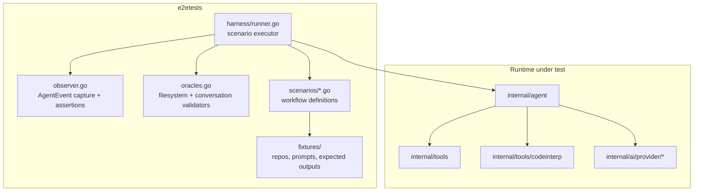
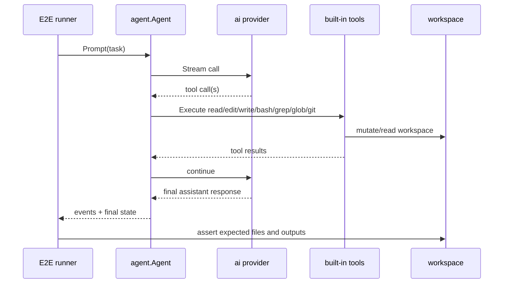

# 08: Agent + Tools End-to-End Test Suite

**Status:** Approved
**Depends on:** 05-agent, 06-built-in-tools, 07-code-interpreter
**Depended on by:** 14-mode3-e2e
**Implements:** `e2etests/` suite validating full agent-loop behavior with built-in tools and code interpreter workflows across local execution modes.

---

## 1. Overview

This plan defines end-to-end verification for the integrated Batch-3 stack: agent loop, built-in tools, and code interpreter. The focus is user-visible behavior across component boundaries rather than isolated unit correctness.

Primary goals:
- Prove `agent.Agent` can complete realistic multi-turn coding workflows with local tools.
- Validate steering, follow-up, and terminal-tool behavior in full flows.
- Validate code interpreter meta-tool workflows (`discover -> describe -> invoke`, RLM sub-calls, DataStore operations) in real conversations.
- Establish reusable E2E harness patterns for later Mode-3/Mode-2 distributed E2E plans.

Non-goals:
- Remote sandbox host lifecycle coverage (plan 14/15).
- gVisor/ZFS performance characterization (plan 16).

---

## 2. Architecture

### 2.1 Test Harness Components



### 2.2 Core E2E Flow



### 2.3 Scenario Matrix

| Scenario family | Purpose |
|----------------|---------|
| File-edit workflows | validate read/write/edit/grep/glob integration |
| Bash workflows | validate long-running command handling and exit semantics |
| Steering/follow-up workflows | validate control-plane behavior under active turns |
| Code interpreter workflows | validate meta-tool orchestration over built-in tools |
| Git workflows | validate status/log/diff operations in seeded repositories |
| Error recovery workflows | validate behavior after unexpected tool failures |
| Terminal-tool workflows | validate short-circuit turn completion |

---

## 3. Test Suite Design

### 3.1 File Layout

```text
e2etests/
├── harness/
│   ├── runner.go              # scenario execution, lifecycle, event collection, assertions, diagnostics
│   └── exec.go                # testability wrapper for exec.Command
├── scenarios/
│   ├── local_file_flow_test.go       # §4.1
│   ├── local_bash_flow_test.go       # §4.2
│   ├── steering_followup_test.go     # §4.3, §4.4
│   ├── codeinterp_workflow_test.go   # §4.5 + P/F/O/S/B/ST/SEC harness tests
│   ├── terminal_tool_test.go         # §4.6
│   ├── git_workflow_test.go          # §4.7
│   └── error_recovery_test.go        # §4.8
└── testutil/
    ├── provider_fake.go       # deterministic provider scripts
    └── fsdiff.go              # workspace diff helpers
```

### 3.2 Provider Modes for E2E

- Default PR mode uses deterministic fake provider traces for reproducibility.
- Optional gated mode uses real Anthropic provider for smoke realism.
- Same scenario contracts should pass in both modes (allowing textual variance where needed).

### 3.3 Assertion Layers

Per scenario, assert at three layers:
1. Event-level: canonical event ordering and required milestones.
2. Conversation-level: expected message/tool-call shape and control actions.
3. Filesystem/process-level: expected file diffs, command outputs, and exit codes.

---

## 4. Key Scenarios

### 4.1 Multi-turn Local File Refactor

- Prompt asks agent to inspect and modify multiple files.
- Agent should perform read/grep/edit/write sequence over >1 turn.
- Final assertions verify concrete file contents and clean event timeline.

### 4.2 Bash Build-and-Fix Loop

- Prompt triggers `bash` test/build command, then file edits, then re-run.
- Assertions verify command exit transitions (fail -> pass) and incremental updates.

### 4.3 Steering Mid-turn

- Inject steering during active streaming.
- Assertions verify steering applied at boundary and altered subsequent behavior.

### 4.4 Follow-up Queue Chain

- Queue multiple follow-up directives during first turn.
- Assertions verify FIFO follow-up execution and eventual idle state.

### 4.5 Code Interpreter Workflow

- Prompt uses `execute_script` meta-tool for multi-step workflow including RLM sub-calls and DataStore operations.
- Assertions verify progressive discovery usage, RLM call traces, DataStore operations, and code interpreter tool-call trace.
- Fake-provider routing for nested calls is explicit:
  - top-level agent loop calls and nested code interpreter RLM sub-calls use distinct fixture branches.
  - nested calls include metadata tags (for example `call_context=code_interpreter_subcall` and `script_exec_id`) so assertions can verify routing.
  - scenario includes at least one nested-call assertion that fails if responses are consumed from the top-level call queue.

### 4.6 Terminal Tool Completion

- Scenario uses terminal tool to produce structured final artifact.
- Assertions verify no extra LLM continuation after terminal tool completion.

### 4.7 Git Read Workflow

- Seed workspace as a git repository with known commit history and staged changes.
- Prompt asks the agent to summarize current branch state and recent changes.
- Assertions verify `git_status`, `git_log`, and `git_diff` tools are invoked and captured in the trace.

### 4.8 Error Recovery Workflow

- Intentionally trigger a tool failure mid-workflow (for example edit on a missing path).
- Fake provider script expects a recovery path (retry with corrected parameters, or fallback sequence).
- Assertions verify the agent recovers or exits gracefully with explicit failure context; no silent hang.

---

## 5. Connected Components (Seams)

| Component | Seam | Contract |
|-----------|------|----------|
| `internal/agent` | Public runtime API | prompt/continue/steer/follow-up/subscribe behavior under integrated load |
| `internal/tools` | Tool execution semantics | correct results and side effects for built-in tool catalog |
| `internal/tools/codeinterp` | Meta-tool behavior | discover/describe/invoke orchestration, RLM sub-calls, DataStore ops, and limit handling |
| `internal/ai` providers | Streaming and tool-call translation | provider events drive tool loop correctly |
| `e2etests` infra | Deterministic environment | reproducible fixtures, stable assertions, controlled variance |

---

## 6. Acceptance Criteria

1. **G4 baseline passes**
- Steps: run full local E2E suite in deterministic provider mode.
- Expected: all scenarios green; agent handles multi-turn tool workflows end-to-end.

2. **File operations correctness**
- Steps: run refactor scenario touching multiple files.
- Expected: resulting repository state matches expected fixtures exactly.

3. **Bash loop correctness**
- Steps: run failing-test-to-passing-test scenario.
- Expected: command exit transitions and final pass state are observed.

4. **Steering/follow-up correctness**
- Steps: inject steering and follow-ups during active session.
- Expected: steering applied at valid boundary; follow-ups execute FIFO.

5. **Code interpreter correctness**
- Steps: run code interpreter scenario that discovers tools, invokes them, and performs RLM sub-calls.
- Expected: script trace shows progressive discovery, nested-call routing metadata, RLM usage stats, and successful multi-step completion.

6. **Code interpreter budget enforcement**
- Steps: run code interpreter scenario that exceeds configured RLM token/cost budget.
- Expected: budget-exceeded behavior is surfaced as a typed failure and handled correctly by the agent.

7. **Terminal-tool correctness**
- Steps: run scenario using terminal tool result path.
- Expected: structured terminal output returned; loop ends cleanly with no extra turn.

8. **Optional live-provider smoke**
- Steps: run gated real-provider E2E smoke scenario.
- Expected: workflow completes with same semantic outcomes as deterministic mode.

---

## 7. Testing Strategy

### 7.1 Determinism Strategy

- Freeze fixtures and deterministic provider traces for PR runs.
- Normalize volatile fields (timestamps, token counts where provider-dependent).
- Keep expected assertions semantic, not brittle to exact wording.

### 7.2 CI Partitioning

- Fast E2E subset on every PR.
- Full deterministic suite nightly.
- Live-provider smoke behind secrets gate.

### 7.3 Failure Diagnostics

On scenario failure, automatically emit:
- event timeline dump
- conversation transcript dump
- workspace diff artifact
- command stdout/stderr excerpts

### 7.4 Workspace Cleanup and Retention

- Clean up temporary workspaces on success.
- Preserve workspace on failure and print the absolute path in test output.
- `E2E_KEEP_WORKSPACES=true` keeps all workspaces for local debugging.

---

## 8. URP (Unreasonably Robust Programming)

1. **Scenario fuzz composer:** generate randomized but valid multi-turn tasks over fixture repos to broaden behavioral coverage.
2. **Dual-run differential checker:** run each scenario twice (fresh workspace and resumed workspace) and compare outcomes.
3. **Replay debugger:** export reproducible replay bundles (fixtures + provider trace + control injections).

---

## 9. Extreme Optimization

1. Parallel scenario scheduling with isolated temp workspaces to reduce CI wall time.
2. Snapshot fixture caches to avoid repeated repository setup cost.
3. Event assertion engine with streaming checks to fail fast on first invariant break.

---

## 10. Alien Artifacts

1. **Behavioral invariant mining:** infer cross-scenario invariants from passing runs and enforce them automatically.
2. **Metamorphic E2E tests:** apply semantics-preserving prompt transformations and assert equivalent end-state.
3. **Counterexample minimization:** automated shrinking of failing scenario traces to minimal repro.

---

## 11. Dependencies

| Dependency | Purpose |
|-----------|---------|
| `internal/agent` | runtime under test |
| `internal/tools` | built-in tool behaviors under test |
| `internal/tools/codeinterp` | meta-tool workflows under test |
| `internal/ai/provider/anthropic` + fake provider harness | deterministic and live-provider modes |

---

## 12. Exit Criteria

1. `e2etests/` contains scenario suite covering file, bash, steering/follow-up, code interpreter, git, error recovery, and terminal-tool workflows.
2. Deterministic provider mode is stable and green in CI.
3. Live-provider smoke mode is available behind secrets gate.
4. Failure artifacts (events, transcript, workspace diff) are generated automatically.
5. At least one E2E scenario demonstrates code interpreter RLM budget enforcement.
6. G4 gate criteria are demonstrably met by this suite.

## Review Disposition

| # | Reviewer | Severity | Summary | Disposition | Notes |
|---|----------|----------|---------|-------------|-------|
| 1 | coder-2-sea | P2 | Nested code interpreter RLM sub-call routing not specified | Incorporated | Added nested-call routing contract and metadata assertions in §4.5. |
| 2 | coder-2-sea | P2 | Missing git E2E scenario | Incorporated | Added dedicated git read workflow in §4.7 and matrix coverage. |
| 3 | coder-2-sea | P3 | Mermaid node labels malformed due to inline concatenation | Incorporated | Split `TOOLS` and `CODEINTERP` into separate nodes. |
| 4 | coder-2-sea | P2 | Error recovery scenario absent | Incorporated | Added error recovery workflow in §4.8 with explicit assertions. |
| 5 | coder-2-sea | P3 | Exit criteria omit budget enforcement | Incorporated | Added acceptance and exit criteria for budget enforcement scenario. |
| 6 | coder-2-sea | P2 | Outdated "scripting" terminology | Incorporated | Renamed to "code interpreter" where subsystem is referenced. |
| 7 | coder-2-sea | P3 | Workspace cleanup/retention strategy unspecified | Incorporated | Added cleanup-on-success, preserve-on-failure policy and env override in §7.4. |

## Plan Review Signoff

- **Status**: Approved
- **Date**: 2026-03-12
- **Branch**: main
- **Commit**: ee32c55
- **Review rounds**: 3 (R1 batch + R2 batch + R3 focused)
- **Total findings**: 7
- **Finding breakdown**: P2: 4, P3: 3
- **Incorporation rate**: 100%
- **Not incorporated**: None
- **Open questions**: All resolved
- **Reviewers**: coder-1-sea, coder-2-sea, reviewer-sea

---

## Completion Signoff

- **Status**: Complete
- **Date**: 2026-03-13
- **Branch**: main
- **Commit**: d1df5b5
- **Verified by**: reviewer-sea
- **Test verification**: `go test -race ./e2etests/... -count=1` — PASS (scenarios 11.631s)
- **Acceptance tests**: PASS (8 scenarios; #8 live-provider smoke is credential-gated, not run)
- **Deviations from plan**:
  - [Cosmetic] No separate `fixtures/` directory — fixtures are created inline in test Setup functions (simpler, no stale fixtures)
- **Structural deviations resolved**: 1 resolved — §3.1 file layout updated to reflect actual structure (`runner.go` consolidates env/observer/assertions; `exec.go` added for testability; scenario files include §4.7 and §4.8)
- **Additions beyond plan**:
  - `harness/exec.go` — testability wrapper for `exec.Command`
  - `configureCodeInterpTool()` — wires code interpreter tool with E2E model, deduplicates from tool catalog
  - `dumpDiagnostics()` — comprehensive failure artifact generation (event timeline, workspace state, provider call log)
  - `WriteFile`, `InitGitRepo`, `GitCommitAll`, `runCmd` helpers in runner.go
