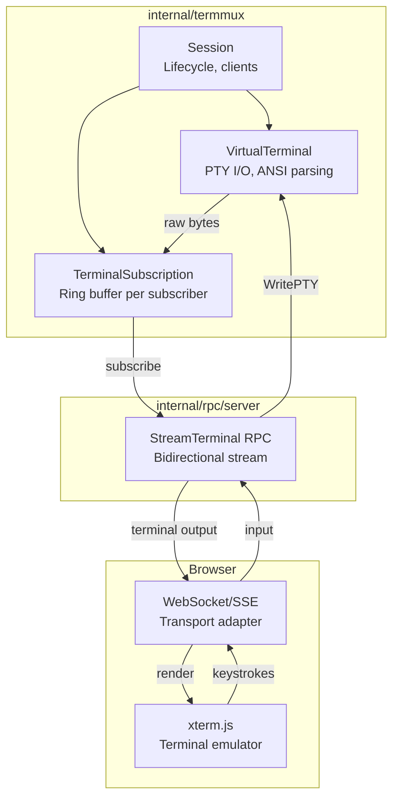
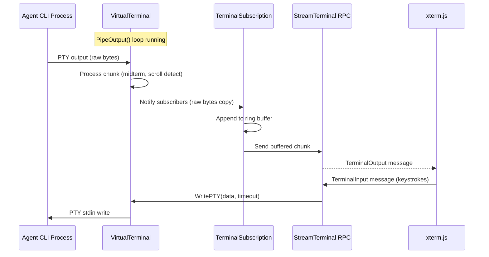
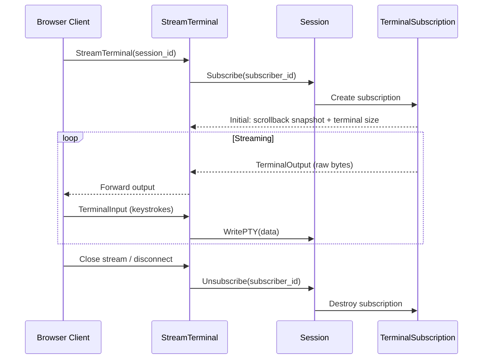

# 09 Addendum 01: Remote Terminal Streaming

**Parent plan:** [09-h2-termmux-port.md](./09-h2-termmux-port.md)
**Status:** Draft
**Scope:** Raw PTY output streaming, terminal defaults, RPC transport, input forwarding, xterm.js compatibility
**Integrates with:** Plan 13 (RPC Layer), Plan 09 (VirtualTerminal)

---

## 1. Overview

The primary UI for flex-agent-runtime uses structured `AgentEvent` streams — parsed, normalized events that drive dashboards, status displays, and automation. However, power users and debuggers need the raw terminal output: the full TUI rendering of Claude Code or Codex as it runs, visible in a browser via xterm.js.

This addendum defines the "raw terminal fallback" path:

```
VirtualTerminal PTY → Raw byte subscription → RPC stream → Browser xterm.js
                                                         ← Input forwarding (keyboard → PTY stdin)
```

**This is NOT the primary interaction path.** It is a debug/power-user tool that provides:
- Full terminal fidelity (ANSI escapes, colors, cursor movement, synchronized output)
- Interactive attach (type into the terminal from the browser)
- Scrollback access (buffered history)

---

## 2. Architecture

### 2.1 Component Diagram



### 2.2 Data Flow: Terminal Streaming



### 2.3 Attach/Detach Lifecycle



---

## 3. Terminal Defaults for Headless Sessions

Agent CLI processes launched by the runtime run headless — no real terminal is attached. The VirtualTerminal must configure the child environment so that CLI tools render correctly.

### 3.1 Required Environment Variables

```go
const (
    DefaultTERM      = "xterm-256color"
    DefaultCOLORTERM = "truecolor"
)

// TerminalEnvDefaults returns the environment variables to set for headless
// child processes. These ensure full color and escape sequence support.
func TerminalEnvDefaults() map[string]string {
    return map[string]string{
        "TERM":      DefaultTERM,
        "COLORTERM": DefaultCOLORTERM,
    }
}
```

These are set in `VirtualTerminal.StartPTY()` as base environment variables, merged with (but overridden by) any driver-specific or user-specified env vars.

### 3.2 Terminal Query Responses

The existing h2 VirtualTerminal already responds to terminal capability queries from the child process:

| Query | Response | Purpose |
|-------|----------|---------|
| OSC 10 | Foreground color (X11 rgb) | Color scheme detection |
| OSC 11 | Background color (X11 rgb) | Dark/light mode detection |
| DA2 (CSI > c) | `CSI > 65;388;1 c` | xterm v388 identification |
| XTVERSION | `DCS > \| xterm(388) ST` | Terminal version string |

These responses must be preserved in the port. They ensure that tools like `bat`, `delta`, `fzf`, and the agent CLIs themselves detect a capable terminal and emit full ANSI output.

### 3.3 COLORFGBG Fallback

When no `COLORFGBG` is available (headless launch), default to dark-background palette:

```go
const DefaultCOLORFGBG = "15;0" // white on black (dark theme)
```

This feeds into the OSC 10/11 response logic, ensuring consistent color rendering.

---

## 4. Raw PTY Output Subscription

### 4.1 TerminalSubscription

Each subscriber gets a ring buffer that receives raw PTY output copies. The ring buffer bounds memory while allowing slow consumers to catch up (with data loss for very slow ones).

```go
// TerminalSubscription is a per-subscriber output stream with bounded buffering.
type TerminalSubscription struct {
    id     string
    chunks chan []byte    // Buffered channel acts as ring buffer
    done   chan struct{}  // Closed when subscription is cancelled

    // Scrollback snapshot delivered on subscribe
    scrollback []byte
    rows, cols int
}

const (
    // SubscriptionBufferSize is the number of output chunks buffered per subscriber.
    // At ~4KB per chunk, this allows ~256KB of buffered output before drops.
    SubscriptionBufferSize = 64
)
```

### 4.2 Integration with PipeOutput

The subscription notification hooks into the existing `PipeOutput` callback pattern:

```go
// In Session.pipeOutputCallback():
func (s *Session) pipeOutputCallback() func() {
    return func() {
        // Existing: render to attached clients
        s.ForEachClient(func(c *Client) { c.RenderScreen() })

        // New: fan out raw bytes to terminal subscribers
        s.fanOutTerminalOutput()
    }
}

// fanOutTerminalOutput copies the latest PTY chunk to all terminal subscribers.
// Non-blocking: slow subscribers have their oldest chunks dropped.
func (s *Session) fanOutTerminalOutput() {
    chunk := s.VT.LatestChunk() // Returns the bytes from the most recent PipeOutput read
    if len(chunk) == 0 {
        return
    }

    s.termSubsMu.RLock()
    defer s.termSubsMu.RUnlock()

    for _, sub := range s.termSubs {
        select {
        case sub.chunks <- chunk:
        default:
            // Subscriber is slow — drop oldest chunk to make room
            select {
            case <-sub.chunks:
            default:
            }
            // Retry once
            select {
            case sub.chunks <- chunk:
            default:
            }
        }
    }
}
```

### 4.3 Subscribe/Unsubscribe on Session

```go
// Subscribe creates a new terminal output subscription.
// Returns the subscription (for reading) and the current terminal dimensions.
func (s *Session) SubscribeTerminal(subscriberID string) *TerminalSubscription {
    sub := &TerminalSubscription{
        id:     subscriberID,
        chunks: make(chan []byte, SubscriptionBufferSize),
        done:   make(chan struct{}),
    }

    s.VT.Mu.Lock()
    sub.scrollback = s.VT.ScrollbackSnapshot()
    sub.rows = s.VT.Rows
    sub.cols = s.VT.Cols
    s.VT.Mu.Unlock()

    s.termSubsMu.Lock()
    s.termSubs[subscriberID] = sub
    s.termSubsMu.Unlock()

    return sub
}

// UnsubscribeTerminal removes a terminal output subscription.
func (s *Session) UnsubscribeTerminal(subscriberID string) {
    s.termSubsMu.Lock()
    sub, ok := s.termSubs[subscriberID]
    if ok {
        delete(s.termSubs, subscriberID)
        close(sub.done)
    }
    s.termSubsMu.Unlock()
}
```

### 4.4 Scrollback Snapshot

On subscribe, the new subscriber receives the current scrollback buffer so it can render history. This avoids the "blank screen on late attach" problem.

```go
const (
    // MaxScrollbackSnapshotBytes caps the scrollback snapshot sent over RPC.
    // At 4MB, this fits well within ConnectRPC's default 16MB message limit
    // while providing substantial history (~40K lines of typical terminal output).
    MaxScrollbackSnapshotBytes = 4 * 1024 * 1024
)

// ScrollbackSnapshot returns a copy of the most recent scrollback history
// formatted as raw ANSI bytes suitable for replay into xterm.js.
// The snapshot is capped at MaxScrollbackSnapshotBytes, taking the most
// recent lines first (users care about recent output, not ancient history).
func (vt *VirtualTerminal) ScrollbackSnapshot() []byte {
    // Walk backwards to find how many lines fit in the budget.
    total := 0
    startIdx := len(vt.ScrollHistory)
    for i := len(vt.ScrollHistory) - 1; i >= 0; i-- {
        lineSize := len(vt.ScrollHistory[i]) + 2 // +2 for \r\n
        if total+lineSize > MaxScrollbackSnapshotBytes {
            break
        }
        total += lineSize
        startIdx = i
    }

    var buf bytes.Buffer
    buf.Grow(total)
    for _, line := range vt.ScrollHistory[startIdx:] {
        buf.WriteString(line)
        buf.WriteString("\r\n")
    }
    return buf.Bytes()
}
```

---

## 5. RPC Stream Endpoint

### 5.1 Service Contract

This extends plan 13's RPC layer with a bidirectional streaming endpoint for raw terminal I/O.

```go
// TerminalService is a separate RPC service (not part of SandboxService).
// SandboxService handles tool dispatch and session CRUD — terminal streaming
// is a distinct concern with different consumers (browser debug UI vs agent loop).
// Keeping them separate allows independent deployment and access control.
type TerminalService interface {
    // StreamTerminal opens a bidirectional stream for raw terminal I/O.
    // Server sends TerminalOutput messages (raw bytes from PTY).
    // Client sends TerminalInput messages (keystrokes to PTY stdin).
    // Client can also send TerminalResize messages.
    StreamTerminal(ctx context.Context, stream TerminalStream) error
}
```

### 5.2 Message Types

```protobuf
// ConnectRPC / proto3 style (actual implementation uses Go structs)

message StreamTerminalRequest {
    string session_id = 1;
}

message TerminalClientMessage {
    oneof payload {
        StreamTerminalRequest attach = 1;
        TerminalInput input = 2;
        TerminalResize resize = 3;
    }
}

message TerminalServerMessage {
    oneof payload {
        TerminalAttached attached = 1;
        TerminalOutput output = 2;
        TerminalDetached detached = 3;
    }
}

message TerminalAttached {
    int32 rows = 1;
    int32 cols = 2;
    bytes scrollback = 3; // Historical output for replay
}

message TerminalInput {
    bytes data = 1; // Raw keystrokes
}

message TerminalOutput {
    bytes data = 1; // Raw PTY output (ANSI sequences included)
}

message TerminalResize {
    int32 rows = 1;
    int32 cols = 2;
}

message TerminalDetached {
    string reason = 1; // "session_ended", "kicked", "error"
}
```

### 5.3 Server Implementation

```go
func (s *terminalServer) StreamTerminal(ctx context.Context, stream TerminalStream) error {
    // 1. Read initial attach message
    msg, err := stream.Recv()
    if err != nil {
        return err
    }
    attach := msg.GetAttach()
    if attach == nil {
        return connect.NewError(connect.CodeInvalidArgument, fmt.Errorf("first message must be attach"))
    }

    // 2. Find session
    session, err := s.sessionManager.Get(attach.SessionId)
    if err != nil {
        return connect.NewError(connect.CodeNotFound, err)
    }

    // 3. Subscribe to terminal output
    subscriberID := uuid.NewString()
    sub := session.SubscribeTerminal(subscriberID)
    defer session.UnsubscribeTerminal(subscriberID)

    // 4. Send initial attached message with scrollback
    stream.Send(&TerminalServerMessage{
        Payload: &TerminalAttached{
            Rows:       int32(sub.rows),
            Cols:       int32(sub.cols),
            Scrollback: sub.scrollback,
        },
    })

    // 5. Bidirectional pump
    errCh := make(chan error, 2)

    // Output pump: subscription → client
    // Note: sub.chunks is never closed — termination is signaled via sub.done.
    go func() {
        for {
            select {
            case chunk := <-sub.chunks:
                if err := stream.Send(&TerminalServerMessage{
                    Payload: &TerminalOutput{Data: chunk},
                }); err != nil {
                    errCh <- err
                    return
                }
            case <-sub.done:
                stream.Send(&TerminalServerMessage{
                    Payload: &TerminalDetached{Reason: "session_ended"},
                })
                errCh <- nil
                return
            case <-ctx.Done():
                errCh <- ctx.Err()
                return
            }
        }
    }()

    // Input pump: client → PTY
    go func() {
        for {
            msg, err := stream.Recv()
            if err != nil {
                errCh <- err
                return
            }
            switch p := msg.Payload.(type) {
            case *TerminalInput:
                _, err := session.VT.WritePTY(p.Data, 3*time.Second)
                if err != nil {
                    errCh <- fmt.Errorf("write to PTY: %w", err)
                    return
                }
            case *TerminalResize:
                // For remote terminal subscribers, childRows equals rows since
                // the browser client owns the full terminal area (no status bar
                // or split panes). The childRows vs rows distinction only matters
                // for the h2 TUI which reserves rows for its own status line.
                session.VT.Resize(int(p.Rows), int(p.Cols), int(p.Rows))
            }
        }
    }()

    return <-errCh
}
```

### 5.4 Rate Limiting and Backpressure

Terminal output can be extremely bursty (e.g., `cat largefile.txt` generating megabytes/second). The design handles this through:

1. **Ring buffer drops**: Subscription buffer drops oldest chunks when full (subscriber too slow)
2. **RPC flow control**: HTTP/2 flow control provides natural backpressure on the stream
3. **Chunk coalescing**: Multiple PipeOutput callbacks between RPC sends can be coalesced into a single TerminalOutput message (implementation detail, not protocol change)
4. **Maximum chunk size**: Individual TerminalOutput messages capped at 64KB; larger PTY reads are split

---

## 6. Input Forwarding

### 6.1 Keyboard → RPC → PTY stdin

The browser client sends raw keystrokes as `TerminalInput` messages. xterm.js provides the `onData` callback which emits the appropriate escape sequences for special keys.

```javascript
// Browser-side (xterm.js)
terminal.onData((data) => {
    stream.send({ payload: { input: { data: new TextEncoder().encode(data) } } });
});
```

The server writes these to the PTY master via `WritePTY` with the standard hung-child timeout. This preserves the existing safety guarantee from plan 09 §4.2.

### 6.2 Resize Forwarding

When the browser window resizes, xterm.js reports new dimensions:

```javascript
terminal.onResize(({ cols, rows }) => {
    stream.send({ payload: { resize: { rows, cols } } });
});
```

The server calls `VT.Resize()` which updates the PTY window size via `TIOCSWINSZ` ioctl, causing the child process to receive `SIGWINCH`.

### 6.3 Multi-Client Input Contention

Multiple browser clients can attach to the same session simultaneously. All receive output, but input from multiple clients interleaves. This is the standard behavior for shared terminal sessions (like `tmux` or `screen`). No input arbitration is implemented in V1 — last writer wins.

### 6.4 Multi-Client Resize Contention

When multiple clients are attached with different window sizes, resize messages from each client would cause rapid SIGWINCH storms. To prevent this, the VT uses **last-resize-wins with debouncing**: resize requests are coalesced with a 100ms window, and only the final size is applied. This matches standard tmux behavior where the smallest attached client determines the size.

For V1, the simpler approach: last resize wins, no minimum-size calculation. If this proves problematic in practice, the minimum-of-all-clients strategy (like `tmux`'s `aggressive-resize`) can be added as a follow-up.

---

## 7. xterm.js Browser Compatibility

### 7.1 Terminal Capabilities

The VirtualTerminal is configured to emulate xterm-256color, which aligns with xterm.js's built-in capabilities:

| Feature | VT Setting | xterm.js Support |
|---------|-----------|-----------------|
| 256 colors | TERM=xterm-256color | Yes (default) |
| True color (24-bit) | COLORTERM=truecolor | Yes (v4.0+) |
| UTF-8 | Inherited from system | Yes |
| Mouse tracking | CSI ? 1000/1002/1003 | Yes |
| Bracketed paste | CSI ? 2004 | Yes |
| Synchronized output | CSI ? 2026 | Yes (addon, v5.0+) |
| Alternate screen | CSI ? 1049 | Yes |
| Scroll regions (DECSTBM) | CSI r | Yes |

### 7.2 Recommended xterm.js Configuration

```javascript
const terminal = new Terminal({
    cursorBlink: true,
    fontFamily: '"Cascadia Code", "Fira Code", monospace',
    fontSize: 14,
    theme: {
        background: '#1e1e1e',
        foreground: '#d4d4d4',
    },
    // Match VT defaults
    cols: 120,
    rows: 40,
    // Enable WebGL renderer for performance
    allowProposedApi: true,
});

// Required addons
const fitAddon = new FitAddon();
terminal.loadAddon(fitAddon);
fitAddon.fit();

// Optional: WebGL renderer for high-throughput output
const webglAddon = new WebglAddon();
terminal.loadAddon(webglAddon);
```

### 7.3 Transport Considerations

xterm.js runs in the browser and cannot use ConnectRPC bidirectional streams directly over HTTP/2. Two transport options:

**Option A: WebSocket relay (recommended for V1)**
- A thin WebSocket endpoint that bridges to the ConnectRPC StreamTerminal call
- WebSocket handles binary frames natively (no base64 encoding overhead)
- Simple, widely supported, low latency

**Option B: Server-Sent Events (output) + POST (input)**
- SSE for server→client output (text/event-stream with base64-encoded chunks)
- POST requests for client→server input
- Higher overhead (base64 encoding, separate connections) but works through more proxies

**Recommendation:** WebSocket relay for V1. The relay is a simple adapter that:
1. Accepts a WebSocket connection with `session_id` in the URL
2. Opens a `StreamTerminal` RPC to the runtime
3. Pumps WebSocket frames ↔ RPC messages

### 7.4 Latency Budget

For interactive terminal use, the end-to-end latency budget from keystroke to rendered response is:

| Segment | Target | Notes |
|---------|--------|-------|
| Browser → WebSocket → RPC | <5ms | Local network |
| RPC → WritePTY | <1ms | In-process call |
| Child processing | Variable | Depends on the agent CLI |
| PTY output → Subscription | <1ms | Callback in PipeOutput |
| Subscription → RPC → WebSocket | <5ms | Includes serialization |
| xterm.js render | <16ms | One frame at 60fps |
| **Total (local)** | **<30ms** | Excluding child processing |

For remote deployments (Mode 3/4), add network RTT (typically 20-100ms).

---

## 8. Security Considerations

### 8.1 Authentication

Terminal streaming must be gated by the same authentication as the RuntimeController API. An authenticated session token should be required for `StreamTerminal` and validated on the WebSocket upgrade.

### 8.2 Input Sanitization

Raw keystrokes are forwarded directly to the PTY — no sanitization is applied. This is intentional: the terminal is a raw I/O channel, and any "sanitization" would break escape sequences. Security relies on the session-level authentication, not input filtering.

### 8.3 Output Filtering

Terminal output may contain sensitive information (API keys in environment variables, file contents, etc.). No output filtering is applied — the terminal stream is raw by design. Access control is the security boundary.

### 8.4 Rate Limiting

Input rate limiting should be applied at the WebSocket/RPC layer to prevent a malicious client from flooding the PTY stdin:
- Maximum 10KB/s sustained input rate
- Burst allowance of 64KB (paste operations)
- Exceeding the limit drops input with a warning, does not disconnect

---

## 9. Acceptance Criteria

1. A browser client can open a WebSocket connection, receive the terminal attach message with dimensions and scrollback, and see live terminal output rendering in xterm.js.
2. Keystrokes typed in xterm.js are forwarded to the agent CLI process and produce the expected effect (e.g., Ctrl+C interrupts, arrow keys navigate).
3. Headless sessions launched by the runtime have `TERM=xterm-256color` and `COLORTERM=truecolor` set, and agent CLIs emit full-color ANSI output.
4. Late-attaching clients receive scrollback history (up to 4MB) and can see prior output without gaps.
5. A slow or disconnected subscriber does not block PTY output processing or other subscribers.
6. Multiple clients can attach simultaneously; all receive output; input interleaves without deadlock.
7. Terminal resize from browser propagates to the child process (verified by `tput cols`/`tput lines`).

---

## 10. Testing

### 9.1 Unit Tests

**T1: TerminalSubscription ring buffer**
- Write N chunks, verify all received when consumer keeps up
- Write N chunks with slow consumer, verify oldest dropped and newest preserved
- Close subscription, verify `done` channel signals

**T2: fanOutTerminalOutput non-blocking**
- Create 100 subscribers, one blocked
- Verify unblocked subscribers receive output within 1ms
- Verify blocked subscriber's dropped count is tracked

**T3: ScrollbackSnapshot correctness**
- Feed known ANSI sequences through VT
- Verify snapshot contains expected lines with formatting preserved
- Verify snapshot is a copy (mutation doesn't affect VT state)

**T4: Terminal environment defaults**
- Verify `TERM=xterm-256color` and `COLORTERM=truecolor` set on child process
- Verify user-specified env vars override defaults
- Verify `COLORFGBG` fallback when not inherited

### 9.2 Integration Tests

**T5: End-to-end streaming round-trip**
- Start VT with `echo "hello world"` command
- Subscribe, read chunks, verify output contains "hello world"
- Send input via subscription, verify child receives it

**T6: Multi-subscriber isolation**
- Attach 3 subscribers
- Verify all receive identical output
- Detach one, verify others continue
- Verify no goroutine leaks after all detach

**T7: Resize propagation**
- Start VT at 80x24
- Send resize to 120x40 via subscription
- Verify child process receives SIGWINCH
- Verify `tput cols`/`tput lines` reflects new size

**T8: RPC StreamTerminal lifecycle**
- Open stream, receive attached message with dimensions
- Receive output, send input, verify echo
- Close stream, verify clean unsubscribe
- Reopen stream, verify scrollback includes prior output

### 9.3 Stress Tests

**T9: High-throughput output**
- Run `yes | head -1000000` through VT with subscriber attached
- Verify subscriber receives output without deadlock or panic
- Measure drop rate under load (acceptable: up to 50% drops for extreme throughput)

**T10: Rapid attach/detach cycling**
- 100 goroutines rapidly subscribing and unsubscribing
- Concurrent output flowing through VT
- Run with `-race`, verify no races or panics

### 9.4 xterm.js Smoke Test (Manual QA)

**MQ1: Visual fidelity**
- Launch Claude Code session, attach via xterm.js in browser
- Verify: colors render correctly, cursor positioning works, scroll regions work
- Test with `htop`, `vim`, `less` to exercise alternate screen and scroll

**MQ2: Interactive input**
- Type commands in xterm.js, verify they execute in the agent session
- Test special keys: arrow keys, Ctrl+C, Ctrl+D, Tab completion
- Test paste (bracketed paste mode)

**MQ3: Reconnect behavior**
- Attach, generate output, disconnect
- Reattach, verify scrollback history is present
- Verify no duplicate output after reattach

---

## 11. Implementation Notes

### 11.1 Chunk Capture in PipeOutput

The existing `PipeOutput` loop reads into a fixed 4KB buffer and calls the callback. To support streaming, we need the callback to have access to the raw bytes. Two approaches:

**Option A: Store latest chunk on VT (recommended)**
```go
type VirtualTerminal struct {
    // ... existing fields ...
    latestChunk []byte // Set in pipeChunk, read by callback
}

func (vt *VirtualTerminal) pipeChunk(data []byte, onData func()) {
    vt.Mu.Lock()
    defer vt.Mu.Unlock()
    // ... existing processing ...
    vt.latestChunk = make([]byte, len(data))
    copy(vt.latestChunk, data)
    onData()
    vt.latestChunk = nil
}

func (vt *VirtualTerminal) LatestChunk() []byte {
    return vt.latestChunk // Only valid during callback
}
```

**Option B: Pass bytes directly to callback**
Change `PipeOutput(onData func())` to `PipeOutput(onData func([]byte))`. This is cleaner but requires updating all existing callback sites.

Recommend Option B for the port since we're restructuring anyway.

**Cross-plan coordination required:** Option B changes the `PipeOutput` signature defined in plan 09 §3.3. This must be coordinated with plan 09's implementation:
- Update `VirtualTerminal.PipeOutput` signature in plan 09
- Update `Session.pipeOutputCallback` to accept `[]byte`
- Update all existing callback consumers (Client rendering)
- This change should be made in plan 09's implementation, with this addendum's `fanOutTerminalOutput` consuming the new `[]byte` parameter

If plan 09 is already implemented when this addendum is built, the signature change must be a separate commit that updates both the VT and all callers atomically.

### 11.2 Relationship to Existing Client System

Plan 09 already defines `Client` for multi-client attach/detach. The `TerminalSubscription` is conceptually similar but serves a different consumer:

- **Client**: Full TUI rendering, screen buffer, cursor state — used by h2's socket-attached terminals
- **TerminalSubscription**: Raw byte stream — used by RPC/WebSocket consumers

Both are notified from the same `pipeOutputCallback`. They coexist: a session can have local Clients AND remote TerminalSubscriptions simultaneously.

### 11.3 Synchronized Output Interaction

When the child enables CSI?2026 (synchronized output), the `pipeChunk` callback is suppressed until the matching disable sequence. This means `TerminalSubscription` also won't see intermediate frames during synchronized updates. This is correct behavior — xterm.js also supports CSI?2026 and would buffer these frames locally.

---

## 12. Connected Components

| Component | Interface | Notes |
|-----------|-----------|-------|
| Plan 09: VirtualTerminal | `PipeOutput`, `WritePTY`, `Resize`, `ScrollbackSnapshot` | Core PTY I/O |
| Plan 09: Session | `SubscribeTerminal`, `UnsubscribeTerminal` | Subscription lifecycle |
| Plan 13: RPC Layer | `StreamTerminal` (new endpoint) | Wire transport |
| Plan 05: Agent | `AgentEvent` stream | Parallel path (structured events, not raw terminal) |
| Browser | WebSocket relay | Last-mile transport to xterm.js |

---

## 13. Open Questions

1. ~~**Scrollback size limit**~~: **Resolved.** Scrollback snapshot is capped at 4MB (MaxScrollbackSnapshotBytes), taking the most recent lines. The VT's internal ScrollHistory (50K lines) is unchanged; only the RPC snapshot is bounded.

2. **Session recording**: Should we support recording terminal sessions to asciicast format (asciinema) for replay? This would be trivial given we already have the raw byte stream with timestamps.

3. **Read-only mode**: Should we support a read-only attach mode (output only, no input forwarding)? Useful for monitoring without risk of accidental input.

---

## Review Disposition (R1)

| # | Reviewer | Severity | Summary | Disposition | Notes |
|---|----------|----------|---------|-------------|-------|
| 1 | reviewer-sea | P2 | Dead code in output pump (chunks never closed but closure checked) | Incorporated | Removed `ok` check from channel receive; termination uses `sub.done` exclusively |
| 2 | reviewer-sea | P2 | Missing acceptance criteria section | Incorporated | Added §9 with 7 user-facing acceptance criteria |
| 3 | reviewer-sea | P2 | Unbounded scrollback snapshot could exceed RPC limits | Incorporated | Added `MaxScrollbackSnapshotBytes` (4MB) cap with most-recent-lines-first strategy |
| 4 | reviewer-sea | P2 | PipeOutput signature change needs cross-plan coordination | Incorporated | Added explicit coordination note in §11.1 with atomic change requirement |
| 5 | reviewer-sea | P3 | Resize handler passes rows for childRows without explanation | Incorporated | Added inline comment explaining childRows == rows for browser clients |
| 6 | reviewer-sea | P3 | StreamTerminal service location ambiguous | Incorporated | Resolved as separate `TerminalService` with rationale in §5.1 |
| 7 | reviewer-sea | P3 | Multi-client resize contention not addressed | Incorporated | Added §6.4 with last-resize-wins + debouncing strategy |

---

## Completion Signoff

- **Status**: Complete
- **Date**: 2026-03-14
- **Branch**: main
- **Commit**: 1070660
- **Verified by**: coder-1-sea
- **Test verification**: `go test -race ./internal/rpc/server/... ./internal/rpc/wsrelay/... ./internal/termmux/...` — PASS
- **Acceptance tests**: PASS (terminal stream attach/output/input/resize + relay behavior)
- **Deviations from plan**:
  - [Cosmetic] API/request types are housed in `internal/rpc/api` and consumed by transport/server wiring.
- **Structural deviations resolved**: None found
- **Additions beyond plan**:
  - Input rate limiting and relay auth hook coverage added with race-safe tests.
