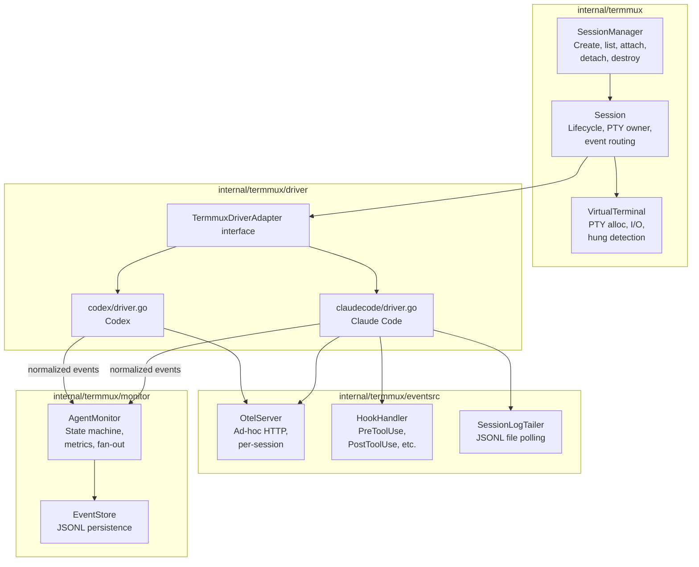
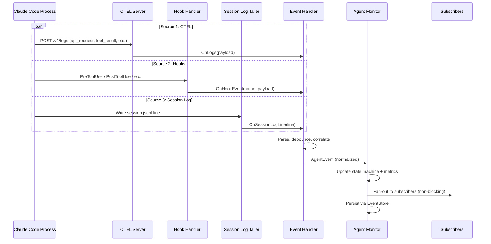
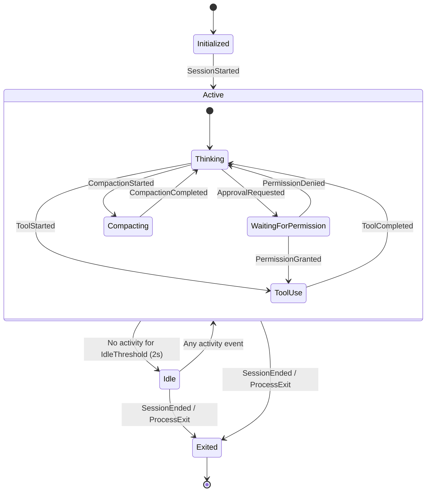

# 09: Terminal Multiplexer & Event Handler Port from h2

**Status:** Approved
**Depends on:** 01-ai-core (event types), 05-agent (AgentEvent definitions)
**Depended on by:** 14-mode2-e2e
**Source:** `~/h2home/projects/h2/internal/session/`

---

## 1. Overview

This plan covers porting the terminal multiplexer, event handler, and agent state machine from the existing h2 codebase into h2-agent-runtime. This is battle-tested code with significant debugging work around robustness (panic recovery, lock safety, hung process detection). The goal is to preserve all of that reliability while restructuring it to fit the runtime's architecture.

**What we're porting:**
- Terminal multiplexer (PTY management, session lifecycle, multi-client attach/detach)
- Three-source event handler (OTEL, hooks, session log JSONL)
- Agent state machine (Active/Idle/Exited with sub-states)
- Per-driver event normalization (Claude Code, Codex, with extension points for others)
- Event persistence (JSONL event store)
- Session metadata management

**What we're NOT porting (stays in h2 orchestrator):**
- TUI / status bar rendering
- Message queue and delivery system
- Profile/role configuration
- Daemon socket protocol (h2-specific IPC)

---

## 2. Architecture

### 2.1 Component Diagram



### 2.2 Data Flow: Three-Source Event Normalization



### 2.3 State Machine



---

## 3. Key Types

### 3.1 TermmuxDriverAdapter Interface

```go
// TermmuxDriverAdapter abstracts a 3rd party agent CLI for termmux session control.
// Name intentionally differs from internal/agent.AgentDriver to avoid ambiguity.
type TermmuxDriverAdapter interface {
    // Identity
    Name() string
    Command() string

    // Launch configuration
    BuildCommandArgs(prependArgs, extraArgs []string) []string
    BuildCommandEnvVars(runtimeDir string) map[string]string
    PrepareForLaunch(dryRun bool) (LaunchConfig, error) // Includes config directory setup (see Section 7)

    // Capabilities
    SupportsHooks() bool
    SupportsResume() bool
    NativeSessionLogPath(configDir, cwd, sessionID string) string

    // Session log conversion (see Section 8: Bidirectional Session Log Conversion)
    ParseSessionLog(reader io.Reader) ([]ConversationEntry, error)
    WriteSessionLog(entries []ConversationEntry, writer io.Writer) error

    // Lifecycle
    Start(ctx context.Context, events chan<- AgentEvent) error
    HandleHookEvent(eventName string, payload json.RawMessage) bool
    HandleInterrupt() bool
    Stop()
}

type LaunchConfig struct {
    OtelEndpoint string            // URL for OTEL HTTP collector
    ExtraEnv     map[string]string // Additional env vars for the child process
}
```

### 3.2 Session

```go
type Session struct {
    ID       string
    Config   SessionConfig
    VT       *VirtualTerminal
    driver   TermmuxDriverAdapter
    monitor  *AgentMonitor

    // Multi-client support
    clients   []*Client
    clientsMu sync.Mutex

    // Lifecycle channels
    exitNotify chan struct{}
    stopCh     chan struct{}
}

type SessionConfig struct {
    DriverType     string            // "claude_code", "codex"
    Command        string
    Args           []string
    CWD            string
    Env            map[string]string
    InitialRows    int
    InitialCols    int
}
```

### 3.3 VirtualTerminal

```go
type VirtualTerminal struct {
    Ptm  *os.File     // PTY master
    Cmd  *exec.Cmd
    Mu   sync.Mutex   // Guards all terminal state and writes

    Rows, Cols int
    ChildRows  int

    // Child process state
    ChildExited bool
    ChildHung   bool
    ExitError   error
}
```

Key methods:
- `StartPTY(command, args, rows, cols, env) error`
- `PipeOutput(onData func()) error` — long-lived goroutine reading child output
- `WritePTY(p []byte, timeout time.Duration) (int, error)` — write with hung detection
- `KillChild()` — SIGKILL for hung processes
- `Resize(rows, cols, childRows int)`

### 3.4 AgentMonitor

```go
type AgentMonitor struct {
    events     chan AgentEvent  // 256-buffered input
    writeEvent func(AgentEvent) error

    mu             sync.RWMutex
    state          State
    subState       SubState
    stateChangedAt time.Time
    stateCh        chan struct{} // Closed+replaced on state change

    // Accumulated metrics
    inputTokens, outputTokens int64
    totalCostUSD              float64
    turnCount                 int64
    toolCounts                map[string]int64

    // Subscriber fan-out
    subscribers []chan<- AgentEvent
}
```

### 3.5 Event Types and Ownership

Canonical `AgentEvent` and `AgentEventType` ownership is in `internal/agent` (plan 05). Termmux imports those types. If driver-specific raw payloads require intermediate shaping, termmux maps private intermediary structs into canonical `internal/agent` events before publish.

```go
// Imported from internal/agent:
// type AgentEvent struct { Type AgentEventType; Timestamp time.Time; Data any }
// type AgentEventType string

// Data payloads
type SessionStartedData struct {
    SessionID string
    Model     string
}

type TurnCompletedData struct {
    TurnID       string
    InputTokens  int64
    OutputTokens int64
    CachedTokens int64
    CostUSD      float64
}

type ToolStartedData struct {
    ToolName string
    CallID   string
}

type ToolCompletedData struct {
    ToolName   string
    CallID     string
    DurationMs int64
    Success    bool
}

type ApprovalRequestedData struct {
    ToolName string
    CallID   string
}

type StateChangeData struct {
    State    State
    SubState SubState
}

type AgentMessageData struct {
    Content string
}

type SessionEndedData struct {
    Reason string
}
```

---

## 4. Robustness Patterns (Port from h2)

These patterns are critical and MUST be preserved in the port. They represent hard-won debugging work.

### 4.1 Panic Recovery with Mutex Safety

Every goroutine that holds a mutex must use this pattern:

```go
func() {
    defer func() {
        if r := recover(); r != nil {
            fmt.Fprintf(os.Stderr, "panic recovered in %s: %v\n%s\n", location, r, debug.Stack())
        }
    }()
    vt.Mu.Lock()
    defer vt.Mu.Unlock()  // Runs even on panic — prevents deadlock
    // ... critical section
}()
```

This ensures that a panic in the critical section:
1. Releases the mutex (via deferred Unlock)
2. Recovers the panic (via deferred recover)
3. Logs the stack trace (for debugging)
4. Does NOT crash the monitoring process

### 4.2 PTY Write Timeout (Hung Child Detection)

```go
n, err := vt.WritePTY(p, 3*time.Second)
if err == ErrPTYWriteTimeout {
    vt.ChildHung = true
    vt.KillChild()
    return 0, io.ErrClosedPipe
}
```

If the child process stops reading from stdin, writes to the PTY master will block. The timeout detects this and kills the child rather than hanging indefinitely.

### 4.3 Per-Connection Panic Isolation

Each client connection gets its own goroutine with panic recovery, so one bad client can't take down the session:

```go
func (d *Daemon) handleConn(conn net.Conn) {
    defer func() {
        if r := recover(); r != nil {
            fmt.Fprintf(os.Stderr, "panic recovered in handleConn: %v\n%s\n", r, debug.Stack())
            conn.Close()
        }
    }()
    // Handle request
}
```

### 4.4 Non-Blocking Event Fan-Out

The monitor fans out events to subscribers without blocking. If a subscriber's channel is full, the event is dropped for that subscriber (not the whole system):

```go
for _, sub := range m.subscribers {
    select {
    case sub <- event:
    default:
        // Subscriber is slow — drop rather than block
    }
}
```

### 4.5 Codex Debouncing

Codex event handler uses debouncing to handle out-of-order events:
- 200ms delay before transitioning to Idle (events may still be arriving)
- 500ms interrupt suppression window (post-interrupt state changes are suppressed)

---

## 5. Event Source Details

### 5.1 OTEL Server

Per-session HTTP server on `127.0.0.1:0` (random port). Receives:
- `POST /v1/logs` — Log records (api_request, api_error, tool_result, etc.)
- `POST /v1/metrics` — Metric data points
- `POST /v1/traces` — Trace spans

The port is injected into the child process via environment variable. Each driver's event handler registers callbacks for the raw payloads and parses them into normalized events.

Lifecycle contract:
- server starts before launching the child process.
- `BuildCommandEnvVars` injects `OTEL_EXPORTER_OTLP_ENDPOINT` in the child env.
- startup bind/listen failure is a hard session-start error.
- shutdown is tied to session context cancellation, with graceful drain timeout (default 2s) followed by forced close.

### 5.2 Hooks

Supported hook events (Claude Code only currently):
- `UserPromptSubmit`, `PreToolUse`, `PostToolUse`
- `PermissionRequest`, `permission_decision`
- `PreCompact`, `SessionStart`, `SessionEnd`
- `Stop`, `Interrupt`

Hooks are called by the child process via a hook command mechanism. The driver receives the event name and JSON payload, parses it, and emits normalized events.

### 5.3 Session Log Tailer

Polls a JSONL file (e.g., Claude Code's `session.jsonl`) at configurable intervals (default 500ms):
- Waits for file to appear (file may not exist at session start)
- Handles partial lines across polls
- Calls `onLine` callback for each complete JSON line
- Used to extract assistant message content that isn't available via OTEL/hooks

---

## 6. Per-Driver Event Handler Responsibilities

### Claude Code
- **OTEL**: Parses `api_request` (turn completed with token counts), `api_error`, `tool_result` (tool completed with timing)
- **Hooks**: `PreToolUse`/`PostToolUse` (tool lifecycle), `PermissionRequest`/`permission_decision` (approval flow), `PreCompact` (compaction state)
- **Session log**: Extracts assistant message content
- **Session ID**: Discovered from OTEL log attributes, used to filter events from other sessions

### Codex
- **OTEL**: Parses traces/logs for Codex-specific event format
- **Hooks**: Not yet supported (being added upstream)
- **Session log**: Not used
- **Debouncing**: 200ms idle delay, 500ms interrupt suppression, token baseline tracking for delta calculation

---

## 7. Config Directory Management

Config directory management is a critical runtime concern for 3rd party agent drivers (Claude Code, Codex). The runtime is responsible for creating, populating, and maintaining per-session config directories that drivers depend on for authentication, configuration, and session state.

### 7.1 Stable Path Setup

Each driver session needs a config directory at a stable, known filesystem path. The runtime creates and manages these directories as part of session lifecycle. The path must be deterministic and reproducible given the session identity, so that the same session always resolves to the same config directory location.

```go
type ConfigDirManager struct {
    BaseDir string // e.g. /var/lib/h2-agent/config
}

func (m *ConfigDirManager) StablePath(sessionID string) string
func (m *ConfigDirManager) EnsureDir(sessionID string) (string, error)
func (m *ConfigDirManager) Cleanup(sessionID string) error
```

Stable path scheme for V1: `<BaseDir>/<session-id>/` (session ID is stable and unique in runtime).

### 7.2 Auth Token Storage

Drivers like Claude Code perform browser-based OAuth sign-in that writes tokens to the config directory. These tokens are path-sensitive — moving the config directory invalidates auth. The runtime must ensure config dir paths don't change across pause/resume/re-launch of a session. This is especially important for durable execution: if a session is paused and resumed later (potentially on a different machine with the same filesystem), the config directory path must remain the same so that cached auth tokens continue to work without forcing re-authentication.

### 7.3 Orchestrator-Injected Files

The h2 orchestrator (or other callers) can inject additional files into the config directory before driver launch — e.g. `CLAUDE.md`, `agents.md`, skills, MCP server configs. The runtime provides hooks/APIs for this injection but doesn't prescribe what gets injected. This allows orchestrators to customize the driver's behavior by placing configuration files where the driver expects them, without the runtime needing to understand the semantics of each file.

### 7.4 Driver-Specific Semantics

Each driver has its own config directory conventions:

- **Claude Code**: Uses `~/.claude/` by default, configurable via the `CLAUDE_CONFIG_DIR` environment variable. Contains settings, auth tokens, session state, and `CLAUDE.md`. The runtime sets `CLAUDE_CONFIG_DIR` to point at the managed config directory.
- **Codex**: Has its own config directory conventions (TBD — needs investigation during implementation).

New drivers added in the future must document their config directory expectations in their driver implementation.

### 7.5 Env Var Configuration

The runtime sets appropriate environment variables to point drivers at the managed config directory before launch. This is part of `BuildCommandEnvVars()` in the `TermmuxDriverAdapter` interface (Section 3.1). For example, for Claude Code the runtime sets `CLAUDE_CONFIG_DIR` to the managed directory path. Each driver implementation is responsible for knowing which environment variables control its config directory location and returning them from `BuildCommandEnvVars()`.

### 7.6 Relationship to PrepareForLaunch

Config directory setup — creating the directory, ensuring the path is stable, and verifying any pre-existing auth tokens — is part of `PrepareForLaunch()` in the `TermmuxDriverAdapter` interface. When `PrepareForLaunch()` is called, the driver implementation must:

1. Ensure the config directory exists at the expected stable path.
2. Validate or migrate any existing auth tokens if the directory already exists from a prior session.
3. Return any additional environment variables needed in the `LaunchConfig.ExtraEnv` map.

The orchestrator-injected files (Section 7.3) are written into the config directory between `PrepareForLaunch()` returning and the actual process start, giving the orchestrator a window to customize the driver's configuration.

---

## 8. Bidirectional Session Log Conversion

Each `TermmuxDriverAdapter` for a 3rd party agent must implement bidirectional conversion between the agent's native session log format and our canonical conversation format. This is expressed in the interface (Section 3.1) as:

```go
// ParseSessionLog reads the driver's native session log and returns
// our canonical conversation entries.
ParseSessionLog(reader io.Reader) ([]ConversationEntry, error)

// WriteSessionLog writes canonical conversation entries back into
// the driver's native session log format.
WriteSessionLog(entries []ConversationEntry, writer io.Writer) error
```

### 8.1 Canonical Conversation Format

```go
type ConversationEntry struct {
    Timestamp time.Time          `json:"timestamp"`
    Role      ConversationRole   `json:"role"`       // "user", "assistant", "tool_use", "tool_result"
    Content   string             `json:"content"`     // Full text content
    ToolCall  *ToolCallRecord    `json:"tool_call,omitempty"`
    Thinking  *ThinkingBlock     `json:"thinking,omitempty"`
    Usage     *TokenUsage        `json:"usage,omitempty"`
}

type ConversationRole string

const (
    RoleUser       ConversationRole = "user"
    RoleAssistant  ConversationRole = "assistant"
    RoleToolUse    ConversationRole = "tool_use"
    RoleToolResult ConversationRole = "tool_result"
)

type ToolCallRecord struct {
    Name   string          `json:"name"`
    Args   json.RawMessage `json:"args"`
    Result string          `json:"result,omitempty"`
    CallID string          `json:"call_id"`
}

type ThinkingBlock struct {
    Content string `json:"content"`
}

type TokenUsage struct {
    InputTokens  int64 `json:"input_tokens"`
    OutputTokens int64 `json:"output_tokens"`
    CachedTokens int64 `json:"cached_tokens,omitempty"`
}
```

### 8.2 Use Cases

- **Resume after crash**: Rebuild the driver's native session log from our canonical checkpoint, then restart the driver process with that log. The canonical format is the durable checkpoint; the native format is the runtime representation the driver process expects.
- **Cross-driver migration**: Start a session in Claude Code, resume it in Codex or a NativeDriver. Parse the originating driver's session log into canonical format, then write it out as the target driver's native format.
- **Durable execution**: Our canonical conversation entries are the source of truth for session state. They are persisted independently of the driver process lifecycle. If the driver crashes or is killed, we reconstruct its native log from the canonical entries and restart.

### 8.3 Driver-Specific Implementations

**Claude Code (`claudecode/session_log.go`)**:
- Parses Claude Code's `session.jsonl` format (one JSON object per line with role, content, tool use blocks, thinking blocks, and usage metadata)
- Writes back to the same `session.jsonl` format for resume

**Codex (`codex/session_log.go`)**:
- V1 scope: live event normalization and runtime operation.
- V1 non-goal: bidirectional session log conversion for Codex until format investigation is complete.
- Follow-up bead tracks Codex session-log conversion investigation and implementation.

---

## 9. ToolBackend

The ToolBackend determines where tool execution occurs, independent of the driver:

- **`LocalBackend`** — Executes tools on the machine the agent runs on. In Mode 1 (laptop), this is the user's machine. In Mode 2 (sandbox), this is inside the sandbox itself.
- **`SandboxBackend`** — Dispatches tool execution via RPC to a sandbox host. Used in Modes 3 and 4 where the agent process runs outside the sandbox but tools must execute within it.

The backend is configured per-session and is orthogonal to the driver choice. A Claude Code driver can run with either a LocalBackend or a SandboxBackend depending on the deployment mode.

---

## 10. Package Structure

```
internal/termmux/
├── session.go               # Session struct, lifecycle (create/start/stop)
├── session_manager.go       # SessionManager: create, list, get, destroy
├── virtual_terminal.go      # VT: PTY alloc, I/O, hung detection, resize
├── client.go                # Client: per-connection output, attach/detach
├── monitor/
│   ├── monitor.go           # AgentMonitor: event processing, state, metrics, fan-out
│   ├── state.go             # State/SubState definitions, transitions
│   └── events.go            # AgentEvent types and data payloads
├── eventsrc/
│   ├── otelserver/
│   │   └── server.go        # Per-session OTEL HTTP collector
│   ├── sessionlog/
│   │   └── tailer.go        # JSONL file tailer with polling
│   └── eventstore/
│       └── store.go         # JSONL event persistence (append, read, tail)
└── driver/
    ├── driver.go            # TermmuxDriverAdapter interface, canonical conversation types
    ├── claudecode/
    │   ├── driver.go        # Claude Code driver implementation
    │   ├── event_handler.go # Three-source normalization for Claude
    │   └── session_log.go   # ParseSessionLog / WriteSessionLog for session.jsonl
    └── codex/
        ├── driver.go        # Codex driver implementation
        ├── event_handler.go # OTEL normalization + debouncing for Codex
        └── session_log.go   # ParseSessionLog / WriteSessionLog for Codex format
```

---

## 11. Acceptance Criteria

1. `internal/termmux` can launch, attach, detach, and stop Claude Code sessions without deadlock or panic.
2. Canonical `internal/agent` events are emitted with correct ordering under mixed OTEL, hook, and session-log input.
3. OTEL server lifecycle is clean: startup failure surfaces immediately; teardown drains and closes within timeout.
4. Session log tailer interval is configurable and covered by tests.
5. Config directory manager enforces stable per-session paths and supports cleanup.
6. Codex driver is operational for live session handling; conversion remains explicitly out-of-scope for V1.
7. Robustness tests (`-race`, panic recovery, hung child handling, multi-client attach/detach) pass.

---

## 12. Testing Strategy

### Unit Tests
- State machine transitions: every event type → correct state/substate
- Event fan-out: verify non-blocking behavior, dropped events for slow subscribers
- OTEL server: HTTP endpoint correctness, callback dispatch
- Session log tailer: partial lines, file appearance, polling behavior
- VirtualTerminal: PTY lifecycle, write timeout, resize

### Integration Tests
- Session log round-trip: parse a real Claude Code session.jsonl → canonical entries → write back → verify output matches original
- Full driver lifecycle: start Claude Code driver → inject OTEL events → verify normalized events
- Multi-client: attach 2 clients → verify both receive output → detach one → verify other continues
- Panic recovery: inject panic in critical section → verify session continues
- Hung child detection: simulate blocked stdin → verify timeout + kill

### Robustness Tests
- Stress test: rapid event injection from all 3 sources concurrently, verify no races (`-race`)
- Crash recovery: kill child process mid-operation → verify clean state transition to Exited
- Event ordering: out-of-order OTEL + hook events → verify correct final state

---

## 13. Migration Notes

### From h2 repo
- `internal/session/session.go` → `internal/termmux/session.go` (strip TUI rendering, message delivery)
- `internal/session/virtualterminal/vt.go` → `internal/termmux/virtual_terminal.go`
- `internal/session/attach.go` → `internal/termmux/client.go` (strip h2-specific IPC protocol)
- `internal/session/listener.go` → panic recovery patterns reused, socket protocol stays in h2
- `internal/session/agent/monitor/` → `internal/termmux/monitor/` (mostly as-is)
- `internal/session/agent/shared/otelserver/` → `internal/termmux/eventsrc/otelserver/`
- `internal/session/agent/shared/sessionlogcollector/` → `internal/termmux/eventsrc/sessionlog/`
- `internal/session/agent/shared/eventstore/` → `internal/termmux/eventsrc/eventstore/`
- `internal/session/agent/harness/claude/` → `internal/termmux/driver/claudecode/`
- `internal/session/agent/harness/codex/` → `internal/termmux/driver/codex/`

### What stays in h2
- `internal/session/daemon.go` — h2-specific daemon lifecycle
- `internal/session/listener.go` — h2-specific socket protocol
- TUI rendering, status bar, message queue integration
- Profile/role system, automation triggers

## Review Disposition

| # | Reviewer | Severity | Summary | Disposition | Notes |
|---|----------|----------|---------|-------------|-------|
| 1 | coder-2-sea | P0 | Missing companion test harness document | Incorporated | Added `09-h2-termmux-port-test-harness.md` in this round. |
| 2 | coder-2-sea | P1 | Name collision with plan 05 `AgentDriver` | Incorporated | Renamed interface to `TermmuxDriverAdapter`. |
| 3 | coder-2-sea | P1 | Event type ownership duplicated with plan 05 | Incorporated | Clarified canonical ownership in `internal/agent`; termmux maps into those types. |
| 4 | coder-2-sea | P2 | OTEL server lifecycle details underspecified | Incorporated | Added startup/teardown/error/env-injection lifecycle contract. |
| 5 | coder-2-sea | P2 | Session log tailer interval hardcoded | Incorporated | Polling interval is now configurable with 500ms default. |
| 6 | coder-2-sea | P2 | Codex session log conversion unspecified | Incorporated | Marked conversion explicitly out-of-scope for V1 with follow-up tracking. |
| 7 | coder-2-sea | P3 | Config directory manager lacks concrete types | Incorporated | Added `ConfigDirManager` type and stable path scheme. |
| 8 | coder-2-sea | P2 | Acceptance criteria section missing | Incorporated | Added explicit acceptance criteria section. |
| 9 | coder-2-sea | P3 | Plan numbering collision with `09-sandbox-zfs` | Not Incorporated | Numbering unchanged in this round; disambiguation note added in plan index. |

## Plan Review Signoff

- **Status**: Approved
- **Date**: 2026-03-12
- **Branch**: main
- **Commit**: ee32c55
- **Review rounds**: 3 (R1 batch + R2 batch + R3 focused)
- **Total findings**: 9
- **Finding breakdown**: P0: 1, P1: 2, P2: 3, P3: 2
- **Incorporation rate**: 89% (8/9)
- **Not incorporated**: #9 (P3 plan numbering collision — disambiguation note added in plan index instead of renumbering)
- **Open questions**: All resolved
- **Reviewers**: coder-1-sea, coder-2-sea, reviewer-sea

---

## Completion Signoff

- **Status**: Complete
- **Date**: 2026-03-14
- **Branch**: main
- **Commit**: 1070660
- **Verified by**: coder-1-sea
- **Test verification**: `go test -race ./internal/termmux/... ./internal/agent/...` — PASS
- **Acceptance tests**: PASS (session lifecycle, event normalization, monitor/driver integration)
- **Deviations from plan**:
  - [Cosmetic] Migration landed with extra helper files compared to illustrative tree.
- **Structural deviations resolved**: None found
- **Additions beyond plan**:
  - Added direct termmux-driver adapter seam tests in agent package.
