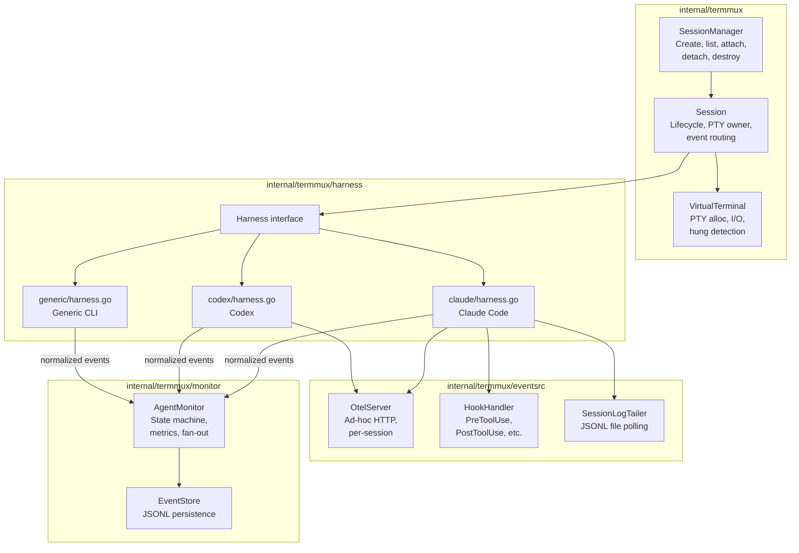
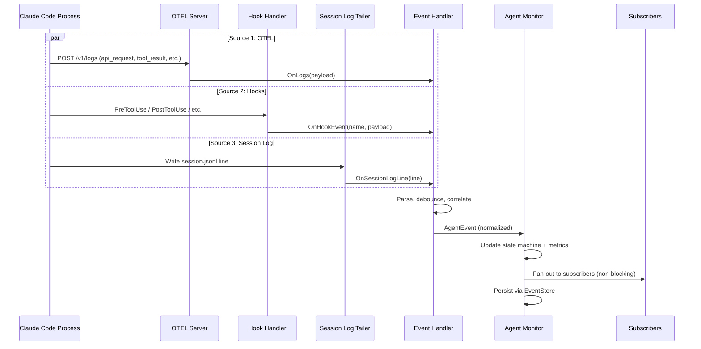
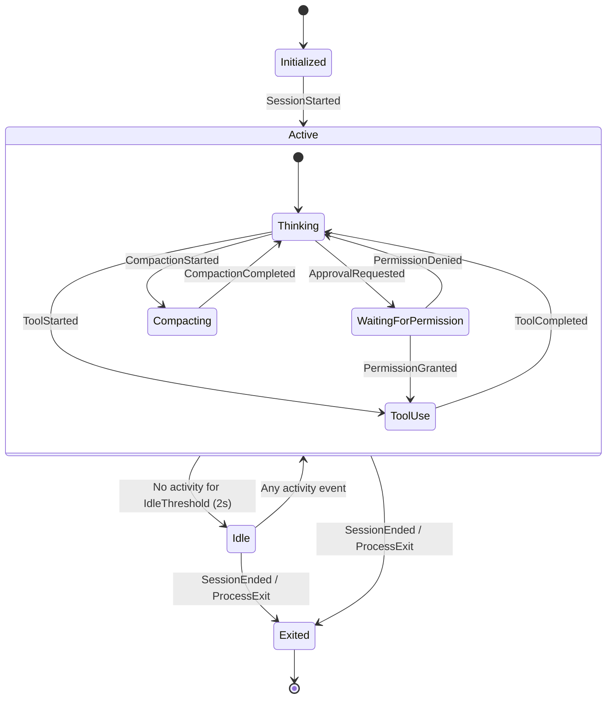

# 09: Terminal Multiplexer & Event Handler Port from h2

**Status:** Draft
**Depends on:** 01-ai-core (event types), 05-agent (AgentEvent definitions)
**Depended on by:** 14-mode2-e2e
**Source:** `~/h2home/projects/h2/internal/session/`

---

## 1. Overview

This plan covers porting the terminal multiplexer, event handler, and agent state machine from the existing h2 codebase into h2-agent-runtime. This is battle-tested code with significant debugging work around robustness (panic recovery, lock safety, hung process detection). The goal is to preserve all of that reliability while restructuring it to fit the runtime's architecture.

**What we're porting:**
- Terminal multiplexer (PTY management, session lifecycle, multi-client attach/detach)
- Three-source event handler (OTEL, hooks, session log JSONL)
- Agent state machine (Active/Idle/Exited with sub-states)
- Per-harness event normalization (Claude Code, Codex, with extension points for others)
- Event persistence (JSONL event store)
- Session metadata management

**What we're NOT porting (stays in h2 orchestrator):**
- TUI / status bar rendering
- Message queue and delivery system
- Profile/role configuration
- Daemon socket protocol (h2-specific IPC)

---

## 2. Architecture

### 2.1 Component Diagram



### 2.2 Data Flow: Three-Source Event Normalization



### 2.3 State Machine



---

## 3. Key Types

### 3.1 Harness Interface

```go
// Harness abstracts a 3rd party agent CLI (Claude Code, Codex, etc.)
type Harness interface {
    // Identity
    Name() string
    Command() string

    // Launch configuration
    BuildCommandArgs(prependArgs, extraArgs []string) []string
    BuildCommandEnvVars(runtimeDir string) map[string]string
    PrepareForLaunch(dryRun bool) (LaunchConfig, error)

    // Capabilities
    SupportsHooks() bool
    SupportsResume() bool
    NativeSessionLogPath(configDir, cwd, sessionID string) string

    // Lifecycle
    Start(ctx context.Context, events chan<- AgentEvent) error
    HandleHookEvent(eventName string, payload json.RawMessage) bool
    HandleInterrupt() bool
    Stop()
}

type LaunchConfig struct {
    OtelEndpoint string            // URL for OTEL HTTP collector
    ExtraEnv     map[string]string // Additional env vars for the child process
}
```

### 3.2 Session

```go
type Session struct {
    ID       string
    Config   SessionConfig
    VT       *VirtualTerminal
    harness  Harness
    monitor  *AgentMonitor

    // Multi-client support
    clients   []*Client
    clientsMu sync.Mutex

    // Lifecycle channels
    exitNotify chan struct{}
    stopCh     chan struct{}
}

type SessionConfig struct {
    HarnessType    string            // "claude_code", "codex", "generic"
    Command        string
    Args           []string
    CWD            string
    Env            map[string]string
    InitialRows    int
    InitialCols    int
}
```

### 3.3 VirtualTerminal

```go
type VirtualTerminal struct {
    Ptm  *os.File     // PTY master
    Cmd  *exec.Cmd
    Mu   sync.Mutex   // Guards all terminal state and writes

    Rows, Cols int
    ChildRows  int

    // Child process state
    ChildExited bool
    ChildHung   bool
    ExitError   error
}
```

Key methods:
- `StartPTY(command, args, rows, cols, env) error`
- `PipeOutput(onData func()) error` — long-lived goroutine reading child output
- `WritePTY(p []byte, timeout time.Duration) (int, error)` — write with hung detection
- `KillChild()` — SIGKILL for hung processes
- `Resize(rows, cols, childRows int)`

### 3.4 AgentMonitor

```go
type AgentMonitor struct {
    events     chan AgentEvent  // 256-buffered input
    writeEvent func(AgentEvent) error

    mu             sync.RWMutex
    state          State
    subState       SubState
    stateChangedAt time.Time
    stateCh        chan struct{} // Closed+replaced on state change

    // Accumulated metrics
    inputTokens, outputTokens int64
    totalCostUSD              float64
    turnCount                 int64
    toolCounts                map[string]int64

    // Subscriber fan-out
    subscribers []chan<- AgentEvent
}
```

### 3.5 Event Types

```go
type AgentEvent struct {
    Type      AgentEventType
    Timestamp time.Time
    Data      any           // Typed per event (see below)
}

type AgentEventType string

const (
    EventSessionStarted     AgentEventType = "session_started"
    EventUserPrompt         AgentEventType = "user_prompt"
    EventTurnCompleted      AgentEventType = "turn_completed"
    EventToolStarted        AgentEventType = "tool_started"
    EventToolCompleted      AgentEventType = "tool_completed"
    EventApprovalRequested  AgentEventType = "approval_requested"
    EventAgentMessage       AgentEventType = "agent_message"
    EventStateChange        AgentEventType = "state_change"
    EventSessionEnded       AgentEventType = "session_ended"
)

// Data payloads
type SessionStartedData struct {
    SessionID string
    Model     string
}

type TurnCompletedData struct {
    TurnID       string
    InputTokens  int64
    OutputTokens int64
    CachedTokens int64
    CostUSD      float64
}

type ToolStartedData struct {
    ToolName string
    CallID   string
}

type ToolCompletedData struct {
    ToolName   string
    CallID     string
    DurationMs int64
    Success    bool
}

type ApprovalRequestedData struct {
    ToolName string
    CallID   string
}

type StateChangeData struct {
    State    State
    SubState SubState
}

type AgentMessageData struct {
    Content string
}

type SessionEndedData struct {
    Reason string
}
```

---

## 4. Robustness Patterns (Port from h2)

These patterns are critical and MUST be preserved in the port. They represent hard-won debugging work.

### 4.1 Panic Recovery with Mutex Safety

Every goroutine that holds a mutex must use this pattern:

```go
func() {
    defer func() {
        if r := recover(); r != nil {
            fmt.Fprintf(os.Stderr, "panic recovered in %s: %v\n%s\n", location, r, debug.Stack())
        }
    }()
    vt.Mu.Lock()
    defer vt.Mu.Unlock()  // Runs even on panic — prevents deadlock
    // ... critical section
}()
```

This ensures that a panic in the critical section:
1. Releases the mutex (via deferred Unlock)
2. Recovers the panic (via deferred recover)
3. Logs the stack trace (for debugging)
4. Does NOT crash the monitoring process

### 4.2 PTY Write Timeout (Hung Child Detection)

```go
n, err := vt.WritePTY(p, 3*time.Second)
if err == ErrPTYWriteTimeout {
    vt.ChildHung = true
    vt.KillChild()
    return 0, io.ErrClosedPipe
}
```

If the child process stops reading from stdin, writes to the PTY master will block. The timeout detects this and kills the child rather than hanging indefinitely.

### 4.3 Per-Connection Panic Isolation

Each client connection gets its own goroutine with panic recovery, so one bad client can't take down the session:

```go
func (d *Daemon) handleConn(conn net.Conn) {
    defer func() {
        if r := recover(); r != nil {
            fmt.Fprintf(os.Stderr, "panic recovered in handleConn: %v\n%s\n", r, debug.Stack())
            conn.Close()
        }
    }()
    // Handle request
}
```

### 4.4 Non-Blocking Event Fan-Out

The monitor fans out events to subscribers without blocking. If a subscriber's channel is full, the event is dropped for that subscriber (not the whole system):

```go
for _, sub := range m.subscribers {
    select {
    case sub <- event:
    default:
        // Subscriber is slow — drop rather than block
    }
}
```

### 4.5 Codex Debouncing

Codex event handler uses debouncing to handle out-of-order events:
- 200ms delay before transitioning to Idle (events may still be arriving)
- 500ms interrupt suppression window (post-interrupt state changes are suppressed)

---

## 5. Event Source Details

### 5.1 OTEL Server

Per-session HTTP server on `127.0.0.1:0` (random port). Receives:
- `POST /v1/logs` — Log records (api_request, api_error, tool_result, etc.)
- `POST /v1/metrics` — Metric data points
- `POST /v1/traces` — Trace spans

The port is injected into the child process via environment variable. Each harness's event handler registers callbacks for the raw payloads and parses them into normalized events.

### 5.2 Hooks

Supported hook events (Claude Code only currently):
- `UserPromptSubmit`, `PreToolUse`, `PostToolUse`
- `PermissionRequest`, `permission_decision`
- `PreCompact`, `SessionStart`, `SessionEnd`
- `Stop`, `Interrupt`

Hooks are called by the child process via a hook command mechanism. The harness receives the event name and JSON payload, parses it, and emits normalized events.

### 5.3 Session Log Tailer

Polls a JSONL file (e.g., Claude Code's `session.jsonl`) at 500ms intervals:
- Waits for file to appear (file may not exist at session start)
- Handles partial lines across polls
- Calls `onLine` callback for each complete JSON line
- Used to extract assistant message content that isn't available via OTEL/hooks

---

## 6. Per-Harness Event Handler Responsibilities

### Claude Code
- **OTEL**: Parses `api_request` (turn completed with token counts), `api_error`, `tool_result` (tool completed with timing)
- **Hooks**: `PreToolUse`/`PostToolUse` (tool lifecycle), `PermissionRequest`/`permission_decision` (approval flow), `PreCompact` (compaction state)
- **Session log**: Extracts assistant message content
- **Session ID**: Discovered from OTEL log attributes, used to filter events from other sessions

### Codex
- **OTEL**: Parses traces/logs for Codex-specific event format
- **Hooks**: Not yet supported (being added upstream)
- **Session log**: Not used
- **Debouncing**: 200ms idle delay, 500ms interrupt suppression, token baseline tracking for delta calculation

### Generic (future harnesses)
- **OTEL**: Not used
- **Hooks**: Not used
- **Activity**: Derived from PTY output (any output = active, silence = idle)

---

## 7. Package Structure

```
internal/termmux/
├── session.go               # Session struct, lifecycle (create/start/stop)
├── session_manager.go       # SessionManager: create, list, get, destroy
├── virtual_terminal.go      # VT: PTY alloc, I/O, hung detection, resize
├── client.go                # Client: per-connection output, attach/detach
├── monitor/
│   ├── monitor.go           # AgentMonitor: event processing, state, metrics, fan-out
│   ├── state.go             # State/SubState definitions, transitions
│   └── events.go            # AgentEvent types and data payloads
├── eventsrc/
│   ├── otelserver/
│   │   └── server.go        # Per-session OTEL HTTP collector
│   ├── sessionlog/
│   │   └── tailer.go        # JSONL file tailer with polling
│   └── eventstore/
│       └── store.go         # JSONL event persistence (append, read, tail)
└── harness/
    ├── harness.go           # Harness interface
    ├── claude/
    │   ├── harness.go       # Claude Code harness implementation
    │   └── event_handler.go # Three-source normalization for Claude
    ├── codex/
    │   ├── harness.go       # Codex harness implementation
    │   └── event_handler.go # OTEL normalization + debouncing for Codex
    └── generic/
        └── harness.go       # Generic CLI harness (PTY output only)
```

---

## 8. Testing Strategy

### Unit Tests
- State machine transitions: every event type → correct state/substate
- Event fan-out: verify non-blocking behavior, dropped events for slow subscribers
- OTEL server: HTTP endpoint correctness, callback dispatch
- Session log tailer: partial lines, file appearance, polling behavior
- VirtualTerminal: PTY lifecycle, write timeout, resize

### Integration Tests
- Full harness lifecycle: start Claude Code harness → inject OTEL events → verify normalized events
- Multi-client: attach 2 clients → verify both receive output → detach one → verify other continues
- Panic recovery: inject panic in critical section → verify session continues
- Hung child detection: simulate blocked stdin → verify timeout + kill

### Robustness Tests
- Stress test: rapid event injection from all 3 sources concurrently, verify no races (`-race`)
- Crash recovery: kill child process mid-operation → verify clean state transition to Exited
- Event ordering: out-of-order OTEL + hook events → verify correct final state

---

## 9. Migration Notes

### From h2 repo
- `internal/session/session.go` → `internal/termmux/session.go` (strip TUI rendering, message delivery)
- `internal/session/virtualterminal/vt.go` → `internal/termmux/virtual_terminal.go`
- `internal/session/attach.go` → `internal/termmux/client.go` (strip h2-specific IPC protocol)
- `internal/session/listener.go` → panic recovery patterns reused, socket protocol stays in h2
- `internal/session/agent/monitor/` → `internal/termmux/monitor/` (mostly as-is)
- `internal/session/agent/shared/otelserver/` → `internal/termmux/eventsrc/otelserver/`
- `internal/session/agent/shared/sessionlogcollector/` → `internal/termmux/eventsrc/sessionlog/`
- `internal/session/agent/shared/eventstore/` → `internal/termmux/eventsrc/eventstore/`
- `internal/session/agent/harness/claude/` → `internal/termmux/harness/claude/`
- `internal/session/agent/harness/codex/` → `internal/termmux/harness/codex/`

### What stays in h2
- `internal/session/daemon.go` — h2-specific daemon lifecycle
- `internal/session/listener.go` — h2-specific socket protocol
- TUI rendering, status bar, message queue integration
- Profile/role system, automation triggers
