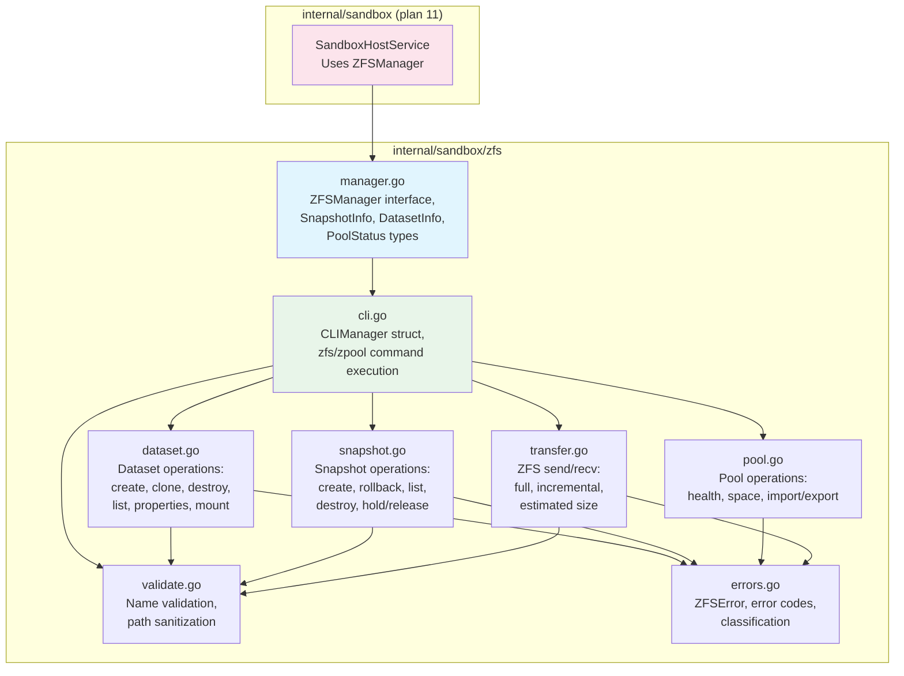
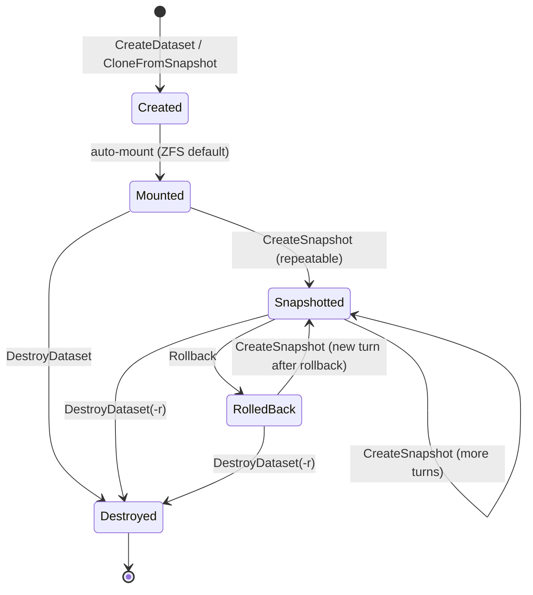

# 09: ZFS Dataset & Snapshot Management

**Status:** Draft
**Depends on:** —
**Depended on by:** 11-sandbox-host-service
**Implements:** `internal/sandbox/zfs` — ZFS dataset lifecycle, snapshot operations, mountpoint management, pool health monitoring, ZFS send/recv for migration

---

## 1. Overview

This plan covers the ZFS management layer that underpins the sandbox host's filesystem. It wraps the `zfs` and `zpool` CLI tools in a type-safe Go interface, providing the foundation for per-session datasets, instant COW snapshots, rollback, and dataset migration via `zfs send/recv`.

The ZFS manager is used by the sandbox host service (plan 11) to create isolated filesystems for each agent session, take per-turn snapshots, roll back to prior states, and initialize sessions from pre-built base snapshots. It does not know about agents, sessions, or tools — it is a pure ZFS abstraction.

**Scope:**
- `ZFSManager` interface and concrete `CLIManager` implementation
- Dataset operations: create, clone, destroy, get/set properties, list, mountpoint management
- Snapshot operations: create, rollback, list, destroy, hold/release (prevent accidental destruction)
- Pool operations: health check, space usage, import/export
- ZFS send/recv for dataset migration between hosts
- Input validation and path sanitization (defense against injection via dataset/snapshot names)
- Structured error types with ZFS exit code mapping
- Build-tag gated integration tests requiring real ZFS

**Out of scope:**
- gVisor container management (plan 10)
- Sandbox host service session management (plan 11)
- EBS volume attachment/detachment (infrastructure layer, not ZFS)
- ZFS pool creation and initial setup (operational concern, documented but not automated)

---

## 2. Architecture

### 2.1 Component Diagram



### 2.2 Import Flow

```
internal/sandbox/zfs → stdlib only (context, os/exec, strings, fmt, strconv, time, regexp, errors)
internal/sandbox     → internal/sandbox/zfs (plan 11 imports this package)
```

No external dependencies. The package shells out to `zfs` and `zpool` CLI tools and parses their stdout/stderr.

### 2.3 Sequence: Session Lifecycle (from ZFS perspective)

```mermaid
sequenceDiagram
    participant SHS as Sandbox Host Service
    participant ZFS as ZFSManager
    participant CLI as zfs/zpool CLI

    Note over SHS: New session from base snapshot

    SHS->>ZFS: CloneFromSnapshot("pool/bases/repo-v1@initial", "pool/sessions/sess-123")
    ZFS->>CLI: zfs clone pool/bases/repo-v1@initial pool/sessions/sess-123
    CLI-->>ZFS: exit 0
    ZFS->>CLI: zfs get -H -o value mountpoint pool/sessions/sess-123
    CLI-->>ZFS: /pool/sessions/sess-123
    ZFS-->>SHS: mountpoint: "/pool/sessions/sess-123"

    Note over SHS: Agent turn completes — snapshot

    SHS->>ZFS: CreateSnapshot("pool/sessions/sess-123", "turn-001")
    ZFS->>CLI: zfs snapshot pool/sessions/sess-123@turn-001
    CLI-->>ZFS: exit 0
    ZFS-->>SHS: SnapshotInfo{Name: "turn-001", Created: ...}

    Note over SHS: Rollback requested

    SHS->>ZFS: Rollback("pool/sessions/sess-123", "turn-001")
    ZFS->>CLI: zfs rollback -r pool/sessions/sess-123@turn-001
    CLI-->>ZFS: exit 0
    ZFS-->>SHS: ok

    Note over SHS: Session done — cleanup

    SHS->>ZFS: DestroyDataset("pool/sessions/sess-123", DestroyRecursive)
    ZFS->>CLI: zfs destroy -r pool/sessions/sess-123
    CLI-->>ZFS: exit 0
    ZFS-->>SHS: ok
```



### 2.4 State Diagram: Dataset Lifecycle



---

## 3. Core Types

### 3.1 ZFSManager Interface

```go
// manager.go

// ZFSManager provides operations on ZFS datasets, snapshots, and pools.
// All methods are safe for concurrent use.
// Dataset and snapshot names must pass ValidateName() or methods return ErrInvalidName.
type ZFSManager interface {
    // Dataset operations
    CreateDataset(ctx context.Context, name string, opts DatasetOptions) error
    CloneFromSnapshot(ctx context.Context, snapshot, newDataset string) error
    DestroyDataset(ctx context.Context, name string, opts DestroyOptions) error
    GetMountpoint(ctx context.Context, dataset string) (string, error)
    SetMountpoint(ctx context.Context, dataset, mountpoint string) error
    GetDatasetInfo(ctx context.Context, name string) (*DatasetInfo, error)
    ListDatasets(ctx context.Context, parent string) ([]DatasetInfo, error)
    DatasetExists(ctx context.Context, name string) (bool, error)

    // Snapshot operations
    CreateSnapshot(ctx context.Context, dataset, snapName string) (*SnapshotInfo, error)
    Rollback(ctx context.Context, dataset, snapName string, opts RollbackOptions) error
    ListSnapshots(ctx context.Context, dataset string) ([]SnapshotInfo, error)
    DestroySnapshot(ctx context.Context, dataset, snapName string) error
    HoldSnapshot(ctx context.Context, dataset, snapName, tag string) error
    ReleaseSnapshot(ctx context.Context, dataset, snapName, tag string) error
    SnapshotExists(ctx context.Context, dataset, snapName string) (bool, error)

    // Pool operations
    PoolStatus(ctx context.Context, pool string) (*PoolStatus, error)
    PoolSpace(ctx context.Context, pool string) (*PoolSpace, error)
    ImportPool(ctx context.Context, pool, device string) error
    ExportPool(ctx context.Context, pool string) error

    // Transfer operations (ZFS send/recv)
    EstimateSendSize(ctx context.Context, snapshot string, opts SendOptions) (int64, error)
    Send(ctx context.Context, snapshot string, opts SendOptions, w io.Writer) error
    Receive(ctx context.Context, dataset string, r io.Reader) error
}
```

### 3.2 Data Types

```go
// manager.go

type DatasetInfo struct {
    Name       string    // full dataset name (e.g., "pool/sessions/sess-123")
    Mountpoint string    // filesystem mount path
    Used       int64     // bytes used (including snapshots)
    Available  int64     // bytes available
    Referenced int64     // bytes referenced by this dataset
    Origin     string    // parent snapshot for clones, empty for non-clones
    Creation   time.Time // creation timestamp
}

type SnapshotInfo struct {
    Name     string    // snapshot name only (e.g., "turn-001"), not full path
    Dataset  string    // parent dataset
    Used     int64     // bytes used by this snapshot
    Refer    int64     // bytes referenced at snapshot time
    Creation time.Time // creation timestamp
    Holds    int       // number of holds on this snapshot
}

type PoolStatus struct {
    Name   string
    State  PoolState // Online, Degraded, Faulted, Offline, Removed, Unavail
    Scan   string    // last scrub/resilver status
    Errors string    // error summary
}

type PoolState string

const (
    PoolOnline   PoolState = "ONLINE"
    PoolDegraded PoolState = "DEGRADED"
    PoolFaulted  PoolState = "FAULTED"
    PoolOffline  PoolState = "OFFLINE"
    PoolRemoved  PoolState = "REMOVED"
    PoolUnavail  PoolState = "UNAVAIL"
)

type PoolSpace struct {
    Pool      string
    Size      int64   // total pool size in bytes
    Allocated int64   // bytes allocated
    Free      int64   // bytes free
    Capacity  float64 // usage percentage (0.0 - 1.0)
    Fragmentation float64 // fragmentation percentage (0.0 - 1.0)
}

type DatasetOptions struct {
    Mountpoint string            // custom mountpoint (empty = ZFS default)
    Properties map[string]string // additional ZFS properties to set
    Quota      int64             // dataset quota in bytes (0 = no quota)
}

type DestroyOptions struct {
    Recursive      bool // -r: destroy all children (snapshots, clones)
    Force          bool // -f: force unmount before destroying
    DependentClones bool // -R: destroy dependent clones as well
}

type RollbackOptions struct {
    DestroyLater bool // -r: destroy snapshots more recent than the target
}

type SendOptions struct {
    Incremental string // base snapshot for incremental send (empty = full send)
    Raw         bool   // -w: send raw (encrypted datasets stay encrypted)
    Compressed  bool   // -c: send compressed blocks as-is
    LargeBlocks bool   // -L: allow large blocks (>128KB)
}
```

### 3.3 Error Types

```go
// errors.go

// ZFSError wraps an error from a zfs/zpool command with structured context.
type ZFSError struct {
    Op       string // operation name (e.g., "CreateSnapshot", "DestroyDataset")
    Command  string // full CLI command executed
    Dataset  string // dataset or snapshot involved
    ExitCode int    // process exit code
    Stderr   string // stderr output from the command
    Err      error  // underlying error (e.g., exec error, context cancelled)
}

func (e *ZFSError) Error() string
func (e *ZFSError) Unwrap() error

// Sentinel errors for common ZFS failure modes.
var (
    ErrInvalidName     = errors.New("zfs: invalid dataset or snapshot name")
    ErrDatasetNotFound = errors.New("zfs: dataset does not exist")
    ErrDatasetExists   = errors.New("zfs: dataset already exists")
    ErrSnapshotNotFound = errors.New("zfs: snapshot does not exist")
    ErrSnapshotExists  = errors.New("zfs: snapshot already exists")
    ErrSnapshotHeld    = errors.New("zfs: snapshot has holds and cannot be destroyed")
    ErrHasClones       = errors.New("zfs: dataset has dependent clones")
    ErrPoolNotFound    = errors.New("zfs: pool does not exist")
    ErrPoolFaulted     = errors.New("zfs: pool is in faulted state")
    ErrPermission      = errors.New("zfs: permission denied")
    ErrBusy            = errors.New("zfs: dataset is busy")
    ErrNoSpace         = errors.New("zfs: no space left on device")
    ErrCommandNotFound = errors.New("zfs: zfs/zpool command not found")
)

// classifyError maps ZFS stderr output to the appropriate sentinel error.
// ZFS error messages are stable across versions (OpenZFS project convention).
func classifyError(op, stderr string, exitCode int) error
```

---

## 4. CLIManager Implementation

### 4.1 Structure

```go
// cli.go

// CLIManager implements ZFSManager by shelling out to zfs/zpool commands.
type CLIManager struct {
    zfsPath   string // path to zfs binary (default: "zfs")
    zpoolPath string // path to zpool binary (default: "zpool")
    sudo      bool   // whether to prefix commands with sudo
    logger    *slog.Logger
    pool      string // pool name (for pool operations)
    defaultCommandTimeout  time.Duration
    metadataCommandTimeout time.Duration
    transferCommandTimeout time.Duration

    // mu protects nothing — all operations are independent CLI invocations.
    // ZFS handles its own locking internally. Concurrent calls are safe.
}

// CLIOption configures CLIManager behavior.
type CLIOption func(*CLIManager)

func WithZFSPath(path string) CLIOption
func WithZPoolPath(path string) CLIOption
func WithSudo(sudo bool) CLIOption
func WithLogger(logger *slog.Logger) CLIOption
func WithPool(pool string) CLIOption
func WithDefaultCommandTimeout(timeout time.Duration) CLIOption
func WithMetadataCommandTimeout(timeout time.Duration) CLIOption
func WithTransferCommandTimeout(timeout time.Duration) CLIOption

// NewCLIManager creates a ZFSManager backed by zfs/zpool CLI tools.
// Returns ErrCommandNotFound if the binaries are not available.
func NewCLIManager(opts ...CLIOption) (*CLIManager, error)
```

### 4.2 Command Execution

All ZFS operations are implemented by executing `zfs` or `zpool` CLI commands. The command execution layer handles:

1. **Context cancellation**: All commands respect `ctx` — if the context is cancelled, the process is killed via `cmd.Cancel`.
2. **Timeout propagation with safe defaults**:
   - caller-provided context deadline always takes precedence.
   - if caller has no deadline, `CLIManager` applies operation-class defaults:
     - metadata operations (list/get/set/snapshot/rollback/destroy/import/export): default 30s
     - transfer operations (`send` / `receive` / estimate): default 10m
   - defaults are configurable via `WithMetadataCommandTimeout` and `WithTransferCommandTimeout`.
3. **Structured logging**: Every command execution is logged at debug level with the full command, duration, exit code, and stderr (if non-empty).
4. **Error classification**: Stderr is parsed by `classifyError()` to produce the appropriate sentinel error wrapped in `ZFSError`.

```go
// cli.go

// exec runs a zfs or zpool command and returns stdout.
// On non-zero exit, returns a *ZFSError with classified error.
func (m *CLIManager) exec(ctx context.Context, op string, args ...string) ([]byte, error) {
    cmdArgs := args
    binary := m.zfsPath
    if args[0] == "zpool" {
        binary = m.zpoolPath
        cmdArgs = args[1:]
    }
    if m.sudo {
        cmdArgs = append([]string{binary}, cmdArgs...)
        binary = "sudo"
    }

    cmd := exec.CommandContext(ctx, binary, cmdArgs...)
    var stdout, stderr bytes.Buffer
    cmd.Stdout = &stdout
    cmd.Stderr = &stderr

    start := time.Now()
    err := cmd.Run()
    duration := time.Since(start)

    m.logger.DebugContext(ctx, "zfs command",
        "op", op,
        "cmd", cmd.String(),
        "duration", duration,
        "exit_code", cmd.ProcessState.ExitCode(),
        "stderr", stderr.String(),
    )

    if err != nil {
        return nil, &ZFSError{
            Op:       op,
            Command:  cmd.String(),
            ExitCode: cmd.ProcessState.ExitCode(),
            Stderr:   stderr.String(),
            Err:      classifyError(op, stderr.String(), cmd.ProcessState.ExitCode()),
        }
    }
    return stdout.Bytes(), nil
}
```

### 4.3 Output Parsing

ZFS commands output tab-separated values when using `-H` (scripting mode) and `-o` (column selection). The parser is straightforward:

```go
// cli.go

// parseTabular parses ZFS `-H -o col1,col2,...` output into rows of string slices.
func parseTabular(output []byte, expectedCols int) ([][]string, error) {
    var rows [][]string
    scanner := bufio.NewScanner(bytes.NewReader(output))
    for scanner.Scan() {
        line := scanner.Text()
        if line == "" {
            continue
        }
        fields := strings.Split(line, "\t")
        if len(fields) != expectedCols {
            return nil, fmt.Errorf("expected %d columns, got %d: %q", expectedCols, len(fields), line)
        }
        rows = append(rows, fields)
    }
    return rows, scanner.Err()
}

// parseSize parses a ZFS size string (bytes as decimal) to int64.
func parseSize(s string) (int64, error)

// parseTimestamp parses a ZFS creation timestamp (Unix seconds) to time.Time.
func parseTimestamp(s string) (time.Time, error)
```

---

## 5. Dataset Operations

### 5.1 CreateDataset

```go
// dataset.go

func (m *CLIManager) CreateDataset(ctx context.Context, name string, opts DatasetOptions) error {
    if err := ValidateName(name); err != nil {
        return err
    }
    args := []string{"create"}
    if opts.Mountpoint != "" {
        args = append(args, "-o", "mountpoint="+opts.Mountpoint)
    }
    if opts.Quota > 0 {
        args = append(args, "-o", fmt.Sprintf("quota=%d", opts.Quota))
    }
    for k, v := range opts.Properties {
        if err := ValidatePropertyName(k); err != nil {
            return err
        }
        args = append(args, "-o", k+"="+v)
    }
    args = append(args, name)
    _, err := m.exec(ctx, "CreateDataset", args...)
    return err
}
```

### 5.2 CloneFromSnapshot

Creates a new dataset by cloning from an existing snapshot. This is the primary mechanism for initializing agent sessions from pre-built base snapshots.

```go
// dataset.go

func (m *CLIManager) CloneFromSnapshot(ctx context.Context, snapshot, newDataset string) error {
    // snapshot is "dataset@snapname" format
    if err := ValidateSnapshotFullName(snapshot); err != nil {
        return err
    }
    if err := ValidateName(newDataset); err != nil {
        return err
    }
    _, err := m.exec(ctx, "CloneFromSnapshot", "clone", snapshot, newDataset)
    return err
}
```

ZFS clones are instant (metadata-only operation) and space-efficient (COW — the clone shares all blocks with the parent snapshot until modified). This supports R9 (pre-built snapshots) with near-zero latency.

### 5.3 DestroyDataset

```go
// dataset.go

func (m *CLIManager) DestroyDataset(ctx context.Context, name string, opts DestroyOptions) error {
    if err := ValidateName(name); err != nil {
        return err
    }
    args := []string{"destroy"}
    if opts.Recursive {
        args = append(args, "-r")
    }
    if opts.Force {
        args = append(args, "-f")
    }
    if opts.DependentClones {
        args = append(args, "-R")
    }
    args = append(args, name)
    _, err := m.exec(ctx, "DestroyDataset", args...)
    return err
}
```

### 5.4 GetMountpoint / SetMountpoint

```go
// dataset.go

func (m *CLIManager) GetMountpoint(ctx context.Context, dataset string) (string, error) {
    if err := ValidateName(dataset); err != nil {
        return "", err
    }
    out, err := m.exec(ctx, "GetMountpoint", "get", "-H", "-o", "value", "mountpoint", dataset)
    if err != nil {
        return "", err
    }
    return strings.TrimSpace(string(out)), nil
}

func (m *CLIManager) SetMountpoint(ctx context.Context, dataset, mountpoint string) error {
    if err := ValidateName(dataset); err != nil {
        return err
    }
    if err := ValidateMountpoint(mountpoint); err != nil {
        return err
    }
    _, err := m.exec(ctx, "SetMountpoint", "set", "mountpoint="+mountpoint, dataset)
    return err
}
```

Mountpoint validation is enforced in this package as defense-in-depth (absolute path, no traversal components). The sandbox host service also validates mountpoints before passing them to gVisor.

### 5.5 GetDatasetInfo / ListDatasets / DatasetExists

```go
// dataset.go

func (m *CLIManager) GetDatasetInfo(ctx context.Context, name string) (*DatasetInfo, error) {
    if err := ValidateName(name); err != nil {
        return nil, err
    }
    out, err := m.exec(ctx, "GetDatasetInfo",
        "get", "-H", "-p", "-o", "value",
        "mountpoint,used,available,referenced,origin,creation",
        name)
    if err != nil {
        return nil, err
    }
    return parseDatasetInfo(name, out)
}

func (m *CLIManager) ListDatasets(ctx context.Context, parent string) ([]DatasetInfo, error) {
    if err := ValidateName(parent); err != nil {
        return nil, err
    }
    out, err := m.exec(ctx, "ListDatasets",
        "list", "-H", "-p", "-r", "-t", "filesystem",
        "-o", "name,mountpoint,used,available,referenced,origin,creation",
        parent)
    if err != nil {
        return nil, err
    }
    return parseDatasetInfoList(out)
}

func (m *CLIManager) DatasetExists(ctx context.Context, name string) (bool, error) {
    _, err := m.GetDatasetInfo(ctx, name)
    if err != nil {
        if errors.Is(err, ErrDatasetNotFound) {
            return false, nil
        }
        return false, err
    }
    return true, nil
}
```

---

## 6. Snapshot Operations

### 6.1 CreateSnapshot

```go
// snapshot.go

func (m *CLIManager) CreateSnapshot(ctx context.Context, dataset, snapName string) (*SnapshotInfo, error) {
    if err := ValidateName(dataset); err != nil {
        return nil, err
    }
    if err := ValidateSnapshotName(snapName); err != nil {
        return nil, err
    }
    fullName := dataset + "@" + snapName
    _, err := m.exec(ctx, "CreateSnapshot", "snapshot", fullName)
    if err != nil {
        return nil, err
    }
    // Return info about the created snapshot
    return m.getSnapshotInfo(ctx, dataset, snapName)
}
```

Snapshot creation is the most performance-critical operation — it happens after every agent turn. ZFS snapshots are COW metadata operations that complete in microseconds. No data is copied; subsequent writes to the dataset create new blocks while the snapshot retains references to the original blocks.

### 6.2 Rollback

```go
// snapshot.go

func (m *CLIManager) Rollback(ctx context.Context, dataset, snapName string, opts RollbackOptions) error {
    if err := ValidateName(dataset); err != nil {
        return err
    }
    if err := ValidateSnapshotName(snapName); err != nil {
        return err
    }
    args := []string{"rollback"}
    if opts.DestroyLater {
        args = append(args, "-r")
    }
    args = append(args, dataset+"@"+snapName)
    _, err := m.exec(ctx, "Rollback", args...)
    return err
}
```

Rollback reverts the dataset to exactly the state at snapshot time. With `-r`, it destroys any snapshots taken after the target. This is needed for R5 (rollback) — when an agent turn goes wrong, roll back to the previous turn's snapshot.

**Important:** ZFS rollback without `-r` only works if the target is the most recent snapshot. Rolling back to an earlier snapshot requires `-r` to destroy intermediate snapshots. The `RollbackOptions.DestroyLater` flag controls this. The sandbox host service (plan 11) will always set this to `true` when rolling back to a prior turn.

### 6.3 ListSnapshots

```go
// snapshot.go

func (m *CLIManager) ListSnapshots(ctx context.Context, dataset string) ([]SnapshotInfo, error) {
    if err := ValidateName(dataset); err != nil {
        return nil, err
    }
    out, err := m.exec(ctx, "ListSnapshots",
        "list", "-H", "-p", "-t", "snapshot",
        "-o", "name,used,referenced,creation,userrefs",
        "-s", "creation",
        dataset)
    if err != nil {
        return nil, err
    }
    return parseSnapshotList(dataset, out)
}
```

Snapshots are returned sorted by creation time (ascending) via `-s creation`. This gives the sandbox host service a chronological view of the session's filesystem history.

### 6.4 DestroySnapshot

```go
// snapshot.go

func (m *CLIManager) DestroySnapshot(ctx context.Context, dataset, snapName string) error {
    if err := ValidateName(dataset); err != nil {
        return err
    }
    if err := ValidateSnapshotName(snapName); err != nil {
        return err
    }
    _, err := m.exec(ctx, "DestroySnapshot", "destroy", dataset+"@"+snapName)
    return err
}
```

### 6.5 Hold / Release

Snapshot holds prevent accidental destruction. A snapshot with holds cannot be destroyed until all holds are released. The sandbox host service can use holds to protect critical snapshots (e.g., the initial base snapshot) while intermediate snapshots can be freely destroyed during cleanup.

```go
// snapshot.go

func (m *CLIManager) HoldSnapshot(ctx context.Context, dataset, snapName, tag string) error {
    if err := ValidateName(dataset); err != nil {
        return err
    }
    if err := ValidateSnapshotName(snapName); err != nil {
        return err
    }
    if err := ValidateHoldTag(tag); err != nil {
        return err
    }
    _, err := m.exec(ctx, "HoldSnapshot", "hold", tag, dataset+"@"+snapName)
    return err
}

func (m *CLIManager) ReleaseSnapshot(ctx context.Context, dataset, snapName, tag string) error {
    if err := ValidateName(dataset); err != nil {
        return err
    }
    if err := ValidateSnapshotName(snapName); err != nil {
        return err
    }
    _, err := m.exec(ctx, "ReleaseSnapshot", "release", tag, dataset+"@"+snapName)
    return err
}

func (m *CLIManager) SnapshotExists(ctx context.Context, dataset, snapName string) (bool, error) {
    _, err := m.getSnapshotInfo(ctx, dataset, snapName)
    if err != nil {
        if errors.Is(err, ErrSnapshotNotFound) {
            return false, nil
        }
        return false, err
    }
    return true, nil
}
```

---

## 7. Pool Operations

### 7.1 PoolStatus

```go
// pool.go

func (m *CLIManager) PoolStatus(ctx context.Context, pool string) (*PoolStatus, error) {
    if err := ValidatePoolName(pool); err != nil {
        return nil, err
    }
    out, err := m.exec(ctx, "PoolStatus", "zpool", "status", "-p", pool)
    if err != nil {
        return nil, err
    }
    return parsePoolStatus(pool, out)
}
```

### 7.2 PoolSpace

```go
// pool.go

func (m *CLIManager) PoolSpace(ctx context.Context, pool string) (*PoolSpace, error) {
    if err := ValidatePoolName(pool); err != nil {
        return nil, err
    }
    out, err := m.exec(ctx, "PoolSpace", "zpool", "list", "-H", "-p",
        "-o", "name,size,allocated,free,capacity,fragmentation",
        pool)
    if err != nil {
        return nil, err
    }
    return parsePoolSpace(out)
}
```

Pool operations are used by the sandbox host service for health monitoring and capacity planning. The service can check pool health before creating new sessions and alert on degraded pools or low space conditions.

### 7.3 ImportPool / ExportPool

```go
func (m *CLIManager) ImportPool(ctx context.Context, pool, device string) error {
    if err := ValidatePoolName(pool); err != nil {
        return err
    }
    if err := ValidateDevicePath(device); err != nil {
        return err
    }
    _, err := m.exec(ctx, "ImportPool", "zpool", "import", "-d", device, pool)
    return err
}

func (m *CLIManager) ExportPool(ctx context.Context, pool string) error {
    if err := ValidatePoolName(pool); err != nil {
        return err
    }
    _, err := m.exec(ctx, "ExportPool", "zpool", "export", pool)
    return err
}
```

---

## 8. Transfer Operations (ZFS Send/Recv)

ZFS send/recv enables dataset migration between hosts. This supports:
- Moving a paused agent session from one sandbox host to another (e.g., for host maintenance or rebalancing)
- Creating base snapshots on a build host and distributing them to sandbox hosts
- Backup and restore of session datasets

### 8.1 Send

```go
// transfer.go

func (m *CLIManager) EstimateSendSize(ctx context.Context, snapshot string, opts SendOptions) (int64, error) {
    if err := ValidateSnapshotFullName(snapshot); err != nil {
        return 0, err
    }
    args := []string{"send", "-nv"} // -n dry run, -v verbose (shows estimated size)
    if opts.Incremental != "" {
        if err := ValidateSnapshotFullName(opts.Incremental); err != nil {
            return 0, err
        }
        args = append(args, "-i", opts.Incremental)
    }
    args = append(args, snapshot)
    out, err := m.exec(ctx, "EstimateSendSize", args...)
    if err != nil {
        return 0, err
    }
    return parseSendSize(out)
}

func (m *CLIManager) Send(ctx context.Context, snapshot string, opts SendOptions, w io.Writer) error {
    if err := ValidateSnapshotFullName(snapshot); err != nil {
        return err
    }
    args := []string{"send"}
    if opts.Incremental != "" {
        if err := ValidateSnapshotFullName(opts.Incremental); err != nil {
            return err
        }
        args = append(args, "-i", opts.Incremental)
    }
    if opts.Raw {
        args = append(args, "-w")
    }
    if opts.Compressed {
        args = append(args, "-c")
    }
    if opts.LargeBlocks {
        args = append(args, "-L")
    }
    args = append(args, snapshot)

    cmd := m.buildCommand(ctx, m.zfsPath, args...)
    cmd.Stdout = w
    var stderr bytes.Buffer
    cmd.Stderr = &stderr

    if err := cmd.Run(); err != nil {
        return &ZFSError{
            Op:       "Send",
            Command:  cmd.String(),
            Dataset:  snapshot,
            ExitCode: cmd.ProcessState.ExitCode(),
            Stderr:   stderr.String(),
            Err:      classifyError("Send", stderr.String(), cmd.ProcessState.ExitCode()),
        }
    }
    return nil
}
```

### 8.2 Receive

```go
// transfer.go

func (m *CLIManager) Receive(ctx context.Context, dataset string, r io.Reader) error {
    if err := ValidateName(dataset); err != nil {
        return err
    }
    args := []string{"receive", dataset}

    cmd := m.buildCommand(ctx, m.zfsPath, args...)
    cmd.Stdin = r
    var stderr bytes.Buffer
    cmd.Stderr = &stderr

    if err := cmd.Run(); err != nil {
        return &ZFSError{
            Op:       "Receive",
            Command:  cmd.String(),
            Dataset:  dataset,
            ExitCode: cmd.ProcessState.ExitCode(),
            Stderr:   stderr.String(),
            Err:      classifyError("Receive", stderr.String(), cmd.ProcessState.ExitCode()),
        }
    }
    return nil
}
```

---

## 9. Input Validation

### 9.1 Name Validation

ZFS names have strict rules. Invalid names passed to the CLI could cause confusing errors or, worse, shell injection. All names are validated before they reach the CLI.

```go
// validate.go

// ZFS naming rules:
// - Dataset names: alphanumeric, hyphen, underscore, period, colon, slash
// - Snapshot names: same as dataset + @ separator
// - No leading/trailing slashes
// - No empty components between slashes
// - No ".." components (path traversal)
// - Maximum length: 255 characters per component, 1024 total
// - Pool name: first component of dataset name

var (
    datasetNamePattern  = regexp.MustCompile(`^[a-zA-Z0-9][a-zA-Z0-9_.\-:/]*$`)
    snapshotNamePattern = regexp.MustCompile(`^[a-zA-Z0-9][a-zA-Z0-9_.\-]*$`)
    holdTagPattern      = regexp.MustCompile(`^[a-zA-Z0-9][a-zA-Z0-9_.\-]*$`)
)

func ValidateName(name string) error {
    if name == "" {
        return fmt.Errorf("%w: empty name", ErrInvalidName)
    }
    if len(name) > 1024 {
        return fmt.Errorf("%w: name exceeds 1024 characters", ErrInvalidName)
    }
    if strings.Contains(name, "..") {
        return fmt.Errorf("%w: path traversal (..) not allowed", ErrInvalidName)
    }
    if !datasetNamePattern.MatchString(name) {
        return fmt.Errorf("%w: %q contains invalid characters", ErrInvalidName, name)
    }
    // Check each component length
    for _, part := range strings.Split(name, "/") {
        if part == "" {
            return fmt.Errorf("%w: empty component in name", ErrInvalidName)
        }
        if len(part) > 255 {
            return fmt.Errorf("%w: component %q exceeds 255 characters", ErrInvalidName, part)
        }
    }
    return nil
}

func ValidateSnapshotName(name string) error {
    if name == "" {
        return fmt.Errorf("%w: empty snapshot name", ErrInvalidName)
    }
    if len(name) > 255 {
        return fmt.Errorf("%w: snapshot name exceeds 255 characters", ErrInvalidName)
    }
    if !snapshotNamePattern.MatchString(name) {
        return fmt.Errorf("%w: snapshot name %q contains invalid characters", ErrInvalidName, name)
    }
    return nil
}

func ValidateSnapshotFullName(name string) error {
    parts := strings.SplitN(name, "@", 2)
    if len(parts) != 2 {
        return fmt.Errorf("%w: snapshot full name must contain exactly one @", ErrInvalidName)
    }
    if err := ValidateName(parts[0]); err != nil {
        return err
    }
    return ValidateSnapshotName(parts[1])
}

func ValidatePoolName(name string) error {
    if name == "" {
        return fmt.Errorf("%w: empty pool name", ErrInvalidName)
    }
    if strings.Contains(name, "/") {
        return fmt.Errorf("%w: pool name must not contain /", ErrInvalidName)
    }
    return ValidateName(name)
}

func ValidateHoldTag(tag string) error {
    if tag == "" {
        return fmt.Errorf("%w: empty hold tag", ErrInvalidName)
    }
    if len(tag) > 255 {
        return fmt.Errorf("%w: hold tag exceeds 255 characters", ErrInvalidName)
    }
    if !holdTagPattern.MatchString(tag) {
        return fmt.Errorf("%w: hold tag %q contains invalid characters", ErrInvalidName, tag)
    }
    return nil
}

func ValidatePropertyName(name string) error {
    // ZFS property names: lowercase alphanumeric plus a few specials
    // User properties: contain ':'
    // Block known-dangerous properties
    dangerous := map[string]bool{
        "exec": true, "setuid": true, "devices": true,
    }
    if dangerous[name] {
        return fmt.Errorf("%w: property %q is restricted", ErrInvalidName, name)
    }
    return nil
}
```

### 9.2 Security Considerations

The primary attack vector is **command injection** through dataset or snapshot names. Even though we use `exec.Command` (which does not invoke a shell), we still validate names because:

1. ZFS interprets special characters in names (e.g., `@` is the snapshot separator)
2. Names appear in log messages and error strings that may be displayed in UIs
3. Defense in depth — the validation layer catches bugs before they reach ZFS

All exec calls use `exec.Command` (no shell), and arguments are passed as separate strings, not concatenated into a shell command. This eliminates shell injection regardless of name content.

---

## 10. Error Classification

### 10.1 Stderr Pattern Matching

ZFS error messages are well-structured and stable across OpenZFS versions. The classifier matches known patterns:

```go
// errors.go

func classifyError(op, stderr string, exitCode int) error {
    stderr = strings.TrimSpace(stderr)

    switch {
    case strings.Contains(stderr, "dataset does not exist"):
        return ErrDatasetNotFound
    case strings.Contains(stderr, "dataset already exists"):
        return ErrDatasetExists
    case strings.Contains(stderr, "could not find any snapshots"):
        return ErrSnapshotNotFound
    case strings.Contains(stderr, "snapshot already exists"):
        return ErrSnapshotExists
    case strings.Contains(stderr, "dataset has dependent clones"):
        return ErrHasClones
    case strings.Contains(stderr, "tag already exists on this dataset"):
        // hold already set — idempotent, but caller may want to know
        return nil
    case strings.Contains(stderr, "no such tag on this dataset"):
        return ErrSnapshotNotFound // release of nonexistent hold
    case strings.Contains(stderr, "permission denied"):
        return ErrPermission
    case strings.Contains(stderr, "dataset is busy"):
        return ErrBusy
    case strings.Contains(stderr, "out of space"),
         strings.Contains(stderr, "no space left"):
        return ErrNoSpace
    case strings.Contains(stderr, "no such pool"):
        return ErrPoolNotFound
    case exitCode == 127:
        return ErrCommandNotFound
    default:
        return fmt.Errorf("zfs %s failed: %s", op, stderr)
    }
}
```

### 10.2 Error Wrapping Convention

All errors returned by the package wrap both the sentinel error and the `ZFSError` with full context. Callers can use `errors.Is()` for classification and type-assert to `*ZFSError` for details:

```go
// Caller pattern:
err := mgr.CreateSnapshot(ctx, dataset, snapName)
if errors.Is(err, zfs.ErrDatasetNotFound) {
    // dataset was deleted between operations
} else if err != nil {
    var zfsErr *zfs.ZFSError
    if errors.As(err, &zfsErr) {
        log.Error("ZFS command failed",
            "op", zfsErr.Op,
            "cmd", zfsErr.Command,
            "stderr", zfsErr.Stderr)
    }
}
```

---

## 11. Connected Components (Seams)

### 11.1 Sandbox Host Service (plan 11) → ZFSManager

The sandbox host service is the primary consumer. It uses `ZFSManager` to:
- Clone base snapshots when creating sessions (`CloneFromSnapshot`)
- Get mountpoints for tool execution (`GetMountpoint`)
- Take per-turn snapshots (`CreateSnapshot`)
- Roll back to prior turns (`Rollback`)
- Clean up finished sessions (`DestroyDataset`)
- Monitor pool health (`PoolStatus`, `PoolSpace`)

**Interface:** The `ZFSManager` interface defined in Section 3.1. The sandbox host service depends on the interface, not the `CLIManager` concrete type. This allows unit testing the service with a mock ZFS manager.

### 11.2 gVisor Manager (plan 10) — Indirect via Mountpoints

The gVisor manager does not import this package. Instead, the sandbox host service calls `GetMountpoint()` to get the filesystem path, then passes it to the gVisor manager as a bind-mount path string. The seam is the mountpoint string, not a programmatic interface.

### 11.3 RPC Layer (plan 13) — No Direct Connection

The RPC layer talks to the sandbox host service, which uses the ZFS manager internally. The ZFS manager has no RPC awareness.

---

## 12. Acceptance Criteria

These scenarios verify the ZFS manager works correctly within the system, not just in isolation. They cross the boundary into the sandbox host service (plan 11) and verify end-user-observable behavior.

### AC1: Session from Base Snapshot

**Steps:**
1. Pre-create a base snapshot `pool/bases/go-project@v1` containing a Go project
2. Create a new agent session via the sandbox host service API
3. Verify the session's filesystem contains the Go project files
4. Run `go build ./...` in the session (via sandbox host tool execution)
5. Verify build succeeds

**Expected:** Session is created in <100ms (clone is metadata-only). Filesystem contains full project contents identical to the base snapshot.

### AC2: Per-Turn Snapshot and Rollback

**Steps:**
1. Create a session and write file "hello.txt" with content "v1"
2. Take snapshot "turn-001"
3. Write file "hello.txt" with content "v2"
4. Take snapshot "turn-002"
5. Roll back to "turn-001"
6. Read "hello.txt"

**Expected:** File contents are "v1" after rollback. Snapshot "turn-002" is destroyed by the rollback.

### AC3: Many Snapshots Under Load

**Steps:**
1. Create a session
2. Take 500 snapshots (simulating a long agent session with many turns)
3. Verify all snapshots are listable in creation order
4. Roll back to snapshot #250
5. Verify snapshots #251-#500 are destroyed
6. Verify filesystem state matches snapshot #250

**Expected:** All operations complete successfully. Snapshot creation remains fast (<1ms each). Pool space usage grows proportionally to actual data changes, not snapshot count.

### AC4: Concurrent Sessions

**Steps:**
1. Create 10 sessions simultaneously from the same base snapshot
2. In each session, write unique files and take snapshots
3. Verify each session's filesystem is isolated (no cross-contamination)
4. Destroy all sessions

**Expected:** All sessions operate independently. No errors from concurrent ZFS operations.

### AC5: Session Migration via Send/Recv

**Steps:**
1. Create a session, write files, take snapshots
2. `zfs send` the latest snapshot to a file
3. `zfs recv` into a new dataset on the same pool (simulating cross-host migration)
4. Verify the received dataset has identical contents
5. Continue working in the received dataset (create files, take new snapshots)

**Expected:** Received dataset is byte-for-byte identical to the original at the snapshot point. New work proceeds normally on the received dataset.

### AC6: Pool Space Exhaustion Handling

**Steps:**
1. Create a pool with limited space (e.g., 100MB)
2. Create a session and fill it with data approaching the pool limit
3. Attempt to take a snapshot when pool is at >95% capacity
4. Attempt to write more data

**Expected:** Operations fail with `ErrNoSpace`. Error messages include pool space information. The sandbox host service can detect this and prevent new sessions from being created.

---

## 13. Testing Strategy

### 13.1 Unit Tests (no ZFS required)

Unit tests cover:
- **Name validation**: Valid/invalid dataset names, snapshot names, pool names, hold tags, property names. Path traversal attempts. Length limits.
- **Output parsing**: Parse `zfs list`, `zfs get`, `zpool list`, `zpool status` output. Edge cases (empty output, unexpected columns, non-UTF8).
- **Error classification**: Map stderr strings to sentinel errors. Unknown errors get generic wrapping.
- **Send size parsing**: Parse `zfs send -nv` output.

These tests use no external dependencies — they test pure functions.

### 13.2 Integration Tests (requires Linux + ZFS)

Integration tests exercise real ZFS operations. They are gated behind a build tag and require:
- Linux (ZFS is not available on macOS in a usable form)
- ZFS kernel modules loaded (`zfs` and `zpool` commands available)
- A test pool (created by the test harness from a file-backed vdev)

```go
//go:build integration && linux

func TestIntegration(t *testing.T) {
    pool := setupTestPool(t) // creates file-backed pool, registers cleanup
    mgr, err := zfs.NewCLIManager(zfs.WithPool(pool))
    require.NoError(t, err)

    t.Run("CreateAndDestroyDataset", func(t *testing.T) { ... })
    t.Run("CloneFromSnapshot", func(t *testing.T) { ... })
    t.Run("SnapshotCreateListDestroy", func(t *testing.T) { ... })
    t.Run("Rollback", func(t *testing.T) { ... })
    t.Run("SendRecv", func(t *testing.T) { ... })
    // ...
}
```

**Test pool setup:** Create a sparse file (e.g., 1GB), use it as a vdev for `zpool create`. This avoids needing dedicated block devices. The test pool is destroyed in `t.Cleanup()`.

```go
func setupTestPool(t *testing.T) string {
    t.Helper()
    poolName := fmt.Sprintf("testpool_%d", time.Now().UnixNano())
    vdevFile := filepath.Join(t.TempDir(), "vdev")

    // Create sparse file
    f, err := os.Create(vdevFile)
    require.NoError(t, err)
    require.NoError(t, f.Truncate(1<<30)) // 1GB sparse
    f.Close()

    // Create pool
    cmd := exec.Command("zpool", "create", poolName, vdevFile)
    require.NoError(t, cmd.Run())

    t.Cleanup(func() {
        exec.Command("zpool", "destroy", "-f", poolName).Run()
    })

    return poolName
}
```

### 13.3 Mock ZFSManager for Upstream Tests

The package provides a `MockManager` that implements `ZFSManager` using in-memory state. This allows the sandbox host service (plan 11) to unit-test without real ZFS:

```go
// mock.go

// MockManager implements ZFSManager using in-memory state for testing.
// It simulates dataset/snapshot operations including space accounting.
type MockManager struct {
    mu        sync.Mutex
    datasets  map[string]*mockDataset
    snapshots map[string]*mockSnapshot // key: "dataset@snap"
    pools     map[string]*mockPool
}

func NewMockManager() *MockManager
```

The mock is in the same package (exported) so that downstream packages can import it directly for testing.
To prevent behavioral drift, the test harness includes a conformance suite that executes equivalent operation traces against `MockManager` and `CLIManager` and compares normalized results.

---

## 14. URP: Unreasonably Robust Programming

### 14.1 Pool Health Watchdog

Even though pool monitoring is the sandbox host service's responsibility, the ZFS manager can provide a `WatchPoolHealth()` method that polls `zpool status` at a configurable interval and calls a callback on state transitions. This catches degraded pools before they cause session failures.

```go
func (m *CLIManager) WatchPoolHealth(ctx context.Context, pool string, interval time.Duration, callback func(PoolStatus)) error
```

### 14.2 Snapshot Space Accounting

Track cumulative snapshot space per dataset and expose it via `GetDatasetInfo()`. The sandbox host service can use this to enforce per-session space budgets and alert when sessions are growing too large (e.g., an agent that keeps generating large build artifacts).

### 14.3 Snapshot Integrity Verification

After creating a snapshot, optionally verify it by listing it back and confirming it exists with the expected creation timestamp. This catches rare ZFS bugs where a snapshot command exits 0 but the snapshot is not actually created (observed in some older ZFS versions under extreme memory pressure).

### 14.4 Defensive Rollback Verification

After a rollback, verify the active dataset's `written` property is 0 (no modifications since the target snapshot). This confirms the rollback was effective.

---

## 15. Extreme Optimization

### 15.1 Snapshot Creation Latency

ZFS snapshots are already at the theoretical minimum for a COW filesystem — a metadata-only operation taking microseconds. There is nothing to optimize in the snapshot itself. Our overhead is the `exec.Command` process spawn (~1-2ms). For per-turn granularity (not per-tool-call), this is irrelevant.

If per-tool-call snapshots were ever needed at high frequency, we could use `libzfs` via CGo to avoid process spawning. However, this adds a build dependency on `libzfs-dev` and is not worth the complexity for per-turn snapshots. Decision: keep CLI-based approach. Measure in integration tests and revisit only if spawn overhead is problematic.

### 15.2 Batch Snapshot Destruction

When rolling back or cleaning up, multiple snapshots may need to be destroyed. ZFS supports destroying snapshot ranges in a single command:

```
zfs destroy pool/dataset@snap1%snap100
```

This destroys `snap1`, `snap100`, and everything in between. We expose this as an optimization for cleanup:

```go
func (m *CLIManager) DestroySnapshotRange(ctx context.Context, dataset, first, last string) error
```

### 15.3 Zero-Copy Send/Recv

The `Send()` and `Receive()` methods use `io.Writer`/`io.Reader` directly from the `zfs send`/`recv` process stdout/stdin. There is no intermediate buffering in Go — data flows directly from the kernel pipe buffer to the destination (network socket, file, etc.). This is already zero-copy from the Go perspective.

---

## 16. Alien Artifacts

### 16.1 Copy-on-Write Semantics (ZFS's Core)

ZFS's COW B-tree is itself an alien artifact — a Merkle tree of data blocks where snapshots are achieved by simply not freeing old blocks when new versions are written. This gives us O(1) snapshot creation and O(changed-blocks) space usage, which is what makes per-turn snapshots viable.

We don't implement this — we leverage it. But understanding the mechanics is important for capacity planning: snapshot space is proportional to the data *changed since the snapshot*, not the total dataset size. An agent session with a 10GB project but only 50MB of changes across 100 turns uses ~50MB of total snapshot space (plus minor metadata overhead).

### 16.2 Deferred Destruction

ZFS `destroy` is asynchronous — blocks are freed in the background by the ZFS delete queue (`zfs_delete_thread`). This means `DestroyDataset` returns immediately even for large datasets, and the actual space reclamation happens asynchronously. This is important for cleanup performance — destroying a session dataset with hundreds of snapshots returns in milliseconds.

---

## 17. Package Structure

```
internal/sandbox/zfs/
├── manager.go       # ZFSManager interface, DatasetInfo, SnapshotInfo, PoolStatus, PoolSpace,
│                    # DatasetOptions, DestroyOptions, RollbackOptions, SendOptions types
├── cli.go           # CLIManager struct, NewCLIManager, exec(), parseTabular(), CLIOption funcs
├── dataset.go       # Dataset operations: CreateDataset, CloneFromSnapshot, DestroyDataset,
│                    # GetMountpoint, SetMountpoint, GetDatasetInfo, ListDatasets, DatasetExists
├── snapshot.go      # Snapshot operations: CreateSnapshot, Rollback, ListSnapshots,
│                    # DestroySnapshot, DestroySnapshotRange, HoldSnapshot, ReleaseSnapshot,
│                    # SnapshotExists
├── pool.go          # Pool operations: PoolStatus, PoolSpace, WatchPoolHealth
├── transfer.go      # ZFS send/recv: EstimateSendSize, Send, Receive
├── validate.go      # Name validation: ValidateName, ValidateSnapshotName,
│                    # ValidateSnapshotFullName, ValidatePoolName, ValidateHoldTag,
│                    # ValidatePropertyName
├── errors.go        # ZFSError type, sentinel errors, classifyError()
├── mock.go          # MockManager (exported, for use by plan 11 tests)
├── validate_test.go       # Unit tests: name validation
├── errors_test.go         # Unit tests: error classification
├── parse_test.go          # Unit tests: output parsing
├── mock_test.go           # Unit tests: mock correctness
└── integration_test.go    # Integration tests (//go:build integration && linux)
```

---

## 18. Open Questions

### OQ1: libzfs vs CLI

The current design shells out to `zfs`/`zpool` commands. An alternative is using `libzfs` via CGo (e.g., `github.com/bicomsystems/go-libzfs`). Trade-offs:

| Approach | Pros | Cons |
|----------|------|------|
| CLI | No build deps, cross-compile friendly, simpler debugging | ~1-2ms per-command spawn overhead |
| libzfs | No spawn overhead, richer error info | CGo build dependency, `libzfs-dev` required, complicates cross-compilation |

**Recommendation:** CLI. The spawn overhead is negligible for per-turn operations. libzfs is a future optimization if we ever need per-tool-call snapshots at high frequency.

### OQ2: Snapshot Naming Convention

Should snapshot names include a monotonic counter, timestamp, or both? Options:
- `turn-001`, `turn-002` (counter only — simple, sortable)
- `1710000000` (Unix timestamp — unique, but hard to read)
- `turn-001-1710000000` (both — verbose but unambiguous)

**Recommendation:** Let the sandbox host service (plan 11) decide the naming convention. The ZFS manager accepts any valid snapshot name. The `turn-NNN` pattern shown in examples is illustrative, not prescribed.

### OQ3: Sudo Configuration

Some environments require `sudo` for ZFS operations. The `WithSudo` option handles this, but the sandbox host binary may need to be configured with appropriate sudoers rules. This is an operational concern documented here for awareness.

## Review Disposition

| # | Reviewer | Severity | Summary | Disposition | Notes |
|---|----------|----------|---------|-------------|-------|
| 1 | coder-2-sea | P2 | MockManager may drift from CLI behavior over time | Incorporated | Added explicit mock-vs-real conformance requirement in §13.3 and harness coverage. |
| 2 | coder-2-sea | P3 | SetMountpoint path validation ownership unclear | Incorporated | Added `ValidateMountpoint` contract and defense-in-depth ownership statement in §5.4. |
| 3 | coder-2-sea | P2 | CLI command timeout defaults unspecified | Incorporated | Added operation-class default timeouts with override options in §4.2/§4.1. |
| 4 | coder-2-sea | P3 | Rollback benchmark conflates snapshot creation and rollback | Incorporated | Updated companion harness benchmark design to isolate rollback cost. |
| 5 | coder-2-sea | P2 | Pool import/export in scope but not covered | Incorporated | Added `ImportPool`/`ExportPool` interface and implementation outline in §3.1 and §7.3. |
| 6 | coder-2-sea | P3 | Stress snapshot count bookkeeping is fragile | Incorporated | Companion harness now uses `ListSnapshots` assertions instead of manual counters. |
