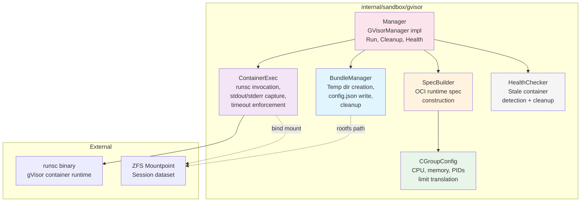
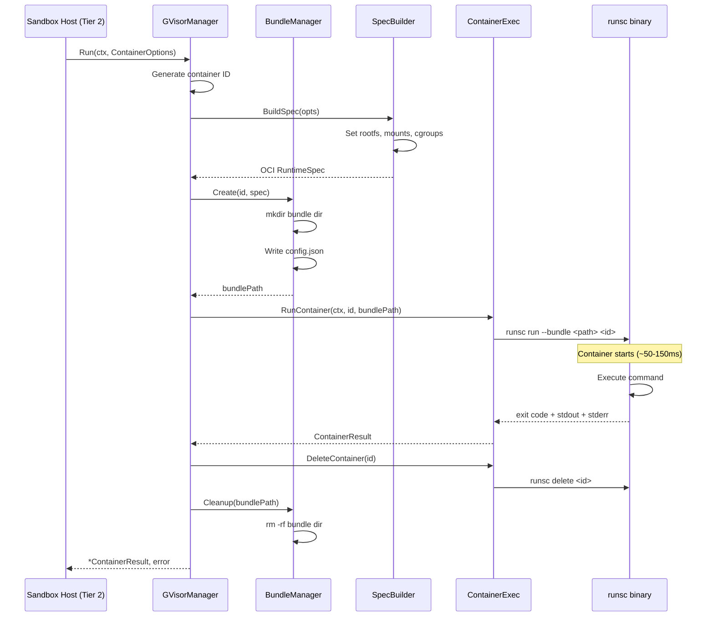
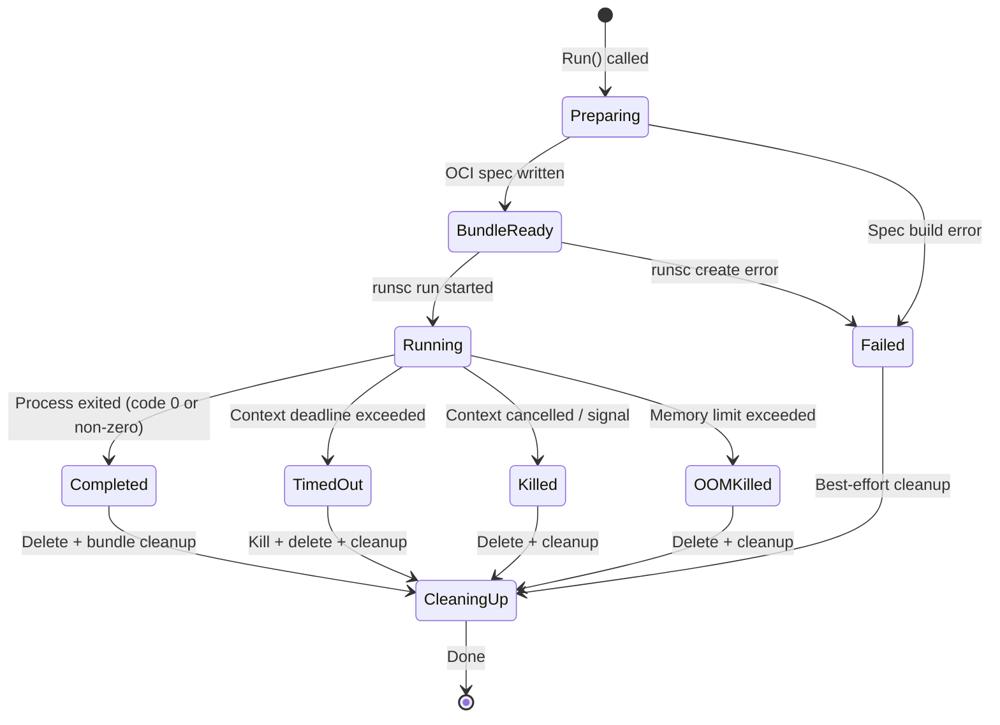

# 10: gVisor Container Management

**Status:** Draft
**Depends on:** — (no code dependencies; 09-sandbox-zfs provides the ZFS datasets this component bind-mounts, but the gVisor manager has no Go import dependency on it)
**Depended on by:** 11-sandbox-host-service
**Implements:** gVisor container lifecycle, cgroup resource limits, OCI spec construction, per-tool-call container management
**Package:** `internal/sandbox/gvisor`

---

## 1. Overview

This plan covers the gVisor container manager — the component that creates, runs, and destroys gVisor (`runsc`) containers for Tier 2 tool execution (bash, builds, tests). Every Tier 2 tool call in the sandbox host spins up a fresh container with a ZFS dataset as its rootfs, executes the command with cgroup-enforced resource limits, captures output, and tears the container down.

**Scope:**
- `GVisorManager` interface and implementation
- OCI runtime spec construction (config.json generation)
- Per-tool-call container lifecycle (create → run → capture → destroy → cleanup)
- cgroup v2 resource limits (CPU, memory, PIDs, timeout)
- ZFS bind-mount as container rootfs
- Network mode configuration (none, sandbox, host)
- runsc binary invocation and output capture
- Concurrent container management (multiple sessions running simultaneously)
- Container health monitoring and forced cleanup
- Observability: structured logging, OTEL metrics for boot time, execution time, resource usage

**Out of scope:**
- ZFS dataset management (plan 09)
- Sandbox host service orchestration, session management, tier routing (plan 11)
- RPC layer (plan 13)
- Container image building / base snapshot preparation (operational concern)
- Container pre-warming pool (see decision D1 below)

---

## 2. Architecture

### 2.1 Component Diagram



### 2.2 Container Lifecycle Sequence



### 2.3 Container State Machine



---

## 3. Package Structure

```
internal/sandbox/gvisor/
├── manager.go          # GVisorManager implementation, Run() method
├── manager_test.go     # Unit tests with mock runsc
├── spec.go             # OCI runtime spec builder
├── spec_test.go        # Spec generation unit tests
├── cgroups.go          # ResourceSpec → cgroup v2 config translation
├── cgroups_test.go     # cgroup config unit tests
├── bundle.go           # Bundle directory lifecycle
├── bundle_test.go      # Bundle creation/cleanup tests
├── exec.go             # runsc process invocation, I/O capture
├── exec_test.go        # Exec tests with mock runsc
├── health.go           # Stale container detection and cleanup
├── health_test.go      # Health checker tests
├── options.go          # ContainerOptions, ResourceSpec, NetworkMode types
└── integration_test.go # Build-tag gated: real runsc tests (//go:build linux && gvisor)
```

### Import Flow

```
internal/sandbox/gvisor → stdlib only (os, os/exec, context, encoding/json,
                           path/filepath, fmt, time, sync, log/slog)
                         + go.opentelemetry.io/otel (metrics, tracing)
```

This package is a leaf — it imports nothing from the rest of the runtime. The sandbox host service (`internal/sandbox`) imports it.

---

## 4. Types and Interfaces

### 4.1 GVisorManager Interface

```go
// manager.go

// GVisorManager manages gVisor container lifecycle for Tier 2 tool execution.
// Each Run() call creates a fresh container, executes the command, captures
// output, and destroys the container. Thread-safe for concurrent use.
type GVisorManager interface {
    // Run executes a command in a gVisor container with the given resource limits.
    // Container is created, command runs, output is captured, and container is
    // destroyed — all within this call. The container's rootfs is the path
    // specified by opts.RootFS (typically a ZFS dataset mountpoint).
    //
    // Returns ContainerResult on successful execution (even if the command
    // exits non-zero). Returns error only for infrastructure failures
    // (runsc not found, bundle creation failed, etc.).
    //
    // Context cancellation or deadline triggers SIGKILL to the container
    // and returns a result with ExitCode -1 and appropriate error status.
    Run(ctx context.Context, opts ContainerOptions) (*ContainerResult, error)

    // CleanupStale finds and removes any containers that are no longer tracked
    // by the manager (e.g., from a previous crash). Safe to call periodically.
    CleanupStale(ctx context.Context) (int, error)

    // ActiveContainers returns the number of currently running containers.
    ActiveContainers() int

    // Close gracefully shuts down the manager, killing any running containers.
    Close() error
}
```

### 4.2 Container Options

```go
// options.go

// ContainerOptions configures a single container execution.
type ContainerOptions struct {
    // Command is the command and arguments to execute.
    Command []string

    // WorkDir is the working directory inside the container.
    // Must be an absolute path within the rootfs.
    WorkDir string

    // Env is the environment variables for the process.
    // If nil, a minimal default environment is used.
    Env map[string]string

    // RootFS is the host path to use as the container's root filesystem.
    // Typically a ZFS dataset mountpoint (e.g., /pool/sessions/sess-123).
    // Must contain a valid Linux directory structure.
    RootFS string

    // Resources specifies CPU, memory, PID, and timeout limits.
    Resources ResourceSpec

    // Network controls the container's network access.
    // Default: NetworkNone (no network).
    Network NetworkMode

    // Stdin provides input to the container's stdin.
    // If nil, stdin is /dev/null.
    Stdin io.Reader

    // User specifies the UID:GID to run the process as inside the container.
    // Default: 0:0 (root). gVisor provides isolation so root-in-container
    // has limited host impact.
    User *UserSpec

    // ReadOnlyRootFS makes the root filesystem read-only.
    // Default: false (writable — tool calls need to modify files).
    ReadOnlyRootFS bool

    // ExtraMounts adds additional bind mounts or tmpfs mounts.
    // Useful for injecting credentials, caches, or temp space.
    ExtraMounts []Mount
}

// ResourceSpec defines resource limits for a container.
type ResourceSpec struct {
    // CPUs is the number of CPU cores to allocate.
    // Translated to cgroup CPU quota/period.
    // 0 means no limit (use all available CPUs).
    CPUs float64

    // MemoryMB is the memory limit in megabytes.
    // Translated to cgroup memory.max.
    // 0 means no limit.
    MemoryMB int

    // MaxPIDs is the maximum number of processes.
    // Translated to cgroup pids.max.
    // 0 means default (1024).
    MaxPIDs int

    // Timeout is the maximum wall-clock execution time.
    // Enforced via context deadline. After timeout, the container
    // receives SIGKILL. 0 means no timeout (caller must set context deadline).
    Timeout time.Duration

    // MaxOutputBytes limits stdout and stderr capture size.
    // Output beyond this limit is truncated. 0 means default (10 MB).
    MaxOutputBytes int64
}

// NetworkMode controls container network access.
type NetworkMode string

const (
    // NetworkNone disables all network access. Most secure.
    // runsc flag: --network=none
    NetworkNone NetworkMode = "none"

    // NetworkSandbox uses gVisor's user-space network stack.
    // Provides basic network access (DNS, HTTP) through gVisor's netstack.
    // runsc flag: --network=sandbox
    NetworkSandbox NetworkMode = "sandbox"

    // NetworkHost uses the host's network stack. Least isolated.
    // Should only be used when network access is required and
    // gVisor's netstack is insufficient.
    // runsc flag: --network=host
    NetworkHost NetworkMode = "host"
)

// UserSpec specifies the user identity inside the container.
type UserSpec struct {
    UID uint32
    GID uint32
}

// Mount defines an additional filesystem mount inside the container.
type Mount struct {
    // Source is the host path (for bind mounts) or mount type (for tmpfs).
    Source string

    // Destination is the mount point inside the container.
    Destination string

    // Type is the mount type: "bind" or "tmpfs".
    Type string

    // ReadOnly makes the mount read-only.
    ReadOnly bool

    // Options are mount-specific options (e.g., tmpfs size).
    Options []string
}
```

### 4.3 Container Result

```go
// options.go (continued)

// ContainerResult holds the outcome of a container execution.
type ContainerResult struct {
    // ContainerID is the unique identifier for this container execution.
    ContainerID string

    // ExitCode is the process exit code. -1 if the process was killed
    // (timeout, OOM, signal).
    ExitCode int

    // Stdout is the captured standard output (may be truncated).
    Stdout []byte

    // Stderr is the captured standard error (may be truncated).
    Stderr []byte

    // StdoutTruncated is true if stdout was truncated due to MaxOutputBytes.
    StdoutTruncated bool

    // StderrTruncated is true if stderr was truncated due to MaxOutputBytes.
    StderrTruncated bool

    // Duration is the wall-clock time from container start to exit.
    Duration time.Duration

    // BootDuration is the time from Run() call to the user process starting.
    // Measured as the time between runsc invocation and first output or
    // process exit — whichever comes first.
    BootDuration time.Duration

    // Status indicates how the container exited.
    Status ContainerStatus

    // OOMKilled is true if the process was killed due to memory limit.
    OOMKilled bool

    // PeakMemoryBytes is the peak memory usage observed, if available.
    // 0 if cgroup stats are not available.
    PeakMemoryBytes int64
}

// ContainerStatus indicates how the container exited.
type ContainerStatus string

const (
    // StatusExited means the process exited normally (check ExitCode).
    StatusExited ContainerStatus = "exited"

    // StatusTimedOut means the process was killed due to timeout.
    StatusTimedOut ContainerStatus = "timed_out"

    // StatusOOMKilled means the process was killed due to memory limit.
    StatusOOMKilled ContainerStatus = "oom_killed"

    // StatusKilled means the process was killed (context cancelled, signal).
    StatusKilled ContainerStatus = "killed"

    // StatusError means an infrastructure error prevented execution.
    StatusError ContainerStatus = "error"
)
```

### 4.4 Manager Configuration

```go
// manager.go (continued)

// ManagerConfig configures the GVisorManager.
type ManagerConfig struct {
    // RunscPath is the path to the runsc binary.
    // Default: "runsc" (found via PATH).
    RunscPath string

    // BundleBaseDir is the directory where container bundles are created.
    // Each container gets a subdirectory. Default: os.TempDir() + "/gvisor-bundles".
    BundleBaseDir string

    // RunscRoot is the root directory for runsc state.
    // runsc flag: --root. Default: /run/runsc (or /tmp/runsc if non-root).
    RunscRoot string

    // Platform is the gVisor platform to use.
    // Default: "systrap" (ptrace-based, works everywhere).
    // Alternative: "kvm" (if KVM is available).
    Platform string

    // MaxConcurrentContainers limits how many containers can run simultaneously.
    // 0 means no limit. Exceeding the limit causes Run() to block until
    // a slot is available (respecting context deadline).
    MaxConcurrentContainers int

    // DefaultNetwork is the default network mode for containers.
    // Can be overridden per-container in ContainerOptions.
    // Default: NetworkNone.
    DefaultNetwork NetworkMode

    // DefaultResources provides default resource limits when not specified
    // in ContainerOptions. Zero values mean no limit.
    DefaultResources ResourceSpec

    // Logger is the structured logger. Default: slog.Default().
    Logger *slog.Logger

    // EnableMetrics enables OTEL metrics collection.
    EnableMetrics bool
}
```

---

## 5. OCI Runtime Spec Builder

### 5.1 Spec Construction

```go
// spec.go

import (
    "encoding/json"
    ocispec "github.com/opencontainers/runtime-spec/specs-go"
)

// BuildSpec constructs an OCI runtime spec from ContainerOptions.
func BuildSpec(opts ContainerOptions) *ocispec.Spec {
    spec := &ocispec.Spec{
        Version: "1.0.2-dev", // OCI runtime spec version
        Root: &ocispec.Root{
            Path:     opts.RootFS,
            Readonly: opts.ReadOnlyRootFS,
        },
        Process: buildProcess(opts),
        Linux:   buildLinux(opts),
        Mounts:  buildMounts(opts),
    }
    return spec
}
```

### 5.2 Process Configuration

```go
// spec.go (continued)

func buildProcess(opts ContainerOptions) *ocispec.Process {
    env := buildEnv(opts.Env)
    user := ocispec.User{UID: 0, GID: 0}
    if opts.User != nil {
        user.UID = opts.User.UID
        user.GID = opts.User.GID
    }

    return &ocispec.Process{
        Terminal: false,
        User:     user,
        Args:     opts.Command,
        Env:      env,
        Cwd:      opts.WorkDir,
        Capabilities: &ocispec.LinuxCapabilities{
            // Minimal capabilities — enough for builds and tests.
            // gVisor intercepts all syscalls anyway, so these are
            // defense-in-depth rather than the primary security boundary.
            Bounding:  minimalCaps(),
            Effective: minimalCaps(),
            Permitted: minimalCaps(),
        },
        NoNewPrivileges: true,
        Rlimits: []ocispec.POSIXRlimit{
            {Type: "RLIMIT_NOFILE", Hard: 65536, Soft: 65536},
        },
    }
}

// minimalCaps returns the minimum Linux capabilities needed for builds/tests.
func minimalCaps() []string {
    return []string{
        "CAP_CHOWN",
        "CAP_DAC_OVERRIDE",
        "CAP_FOWNER",
        "CAP_FSETID",
        "CAP_KILL",
        "CAP_SETGID",
        "CAP_SETUID",
        "CAP_SETPCAP",
        "CAP_NET_BIND_SERVICE",
        "CAP_SYS_CHROOT",
    }
}

// buildEnv constructs the environment variable list.
func buildEnv(env map[string]string) []string {
    defaults := map[string]string{
        "PATH":  "/usr/local/sbin:/usr/local/bin:/usr/sbin:/usr/bin:/sbin:/bin",
        "HOME":  "/root",
        "TERM":  "xterm-256color",
        "LANG":  "C.UTF-8",
    }
    // User env overrides defaults
    for k, v := range env {
        defaults[k] = v
    }
    result := make([]string, 0, len(defaults))
    for k, v := range defaults {
        result = append(result, k+"="+v)
    }
    // Sort for deterministic spec generation
    sort.Strings(result)
    return result
}
```

### 5.3 Linux Configuration (Namespaces + cgroups)

```go
// spec.go (continued)

func buildLinux(opts ContainerOptions) *ocispec.Linux {
    linux := &ocispec.Linux{
        Namespaces: []ocispec.LinuxNamespace{
            {Type: ocispec.PIDNamespace},
            {Type: ocispec.MountNamespace},
            {Type: ocispec.IPCNamespace},
            {Type: ocispec.UTSNamespace},
            {Type: ocispec.NetworkNamespace},
        },
        Resources: buildCgroupResources(opts.Resources),
    }
    return linux
}
```

### 5.4 Mount Configuration

```go
// spec.go (continued)

func buildMounts(opts ContainerOptions) []ocispec.Mount {
    mounts := []ocispec.Mount{
        // /proc is required for many tools
        {
            Destination: "/proc",
            Type:        "proc",
            Source:      "proc",
            Options:     []string{"nosuid", "noexec", "nodev"},
        },
        // /dev with minimal devices
        {
            Destination: "/dev",
            Type:        "tmpfs",
            Source:      "tmpfs",
            Options:     []string{"nosuid", "noexec", "mode=755", "size=65536k"},
        },
        // /dev/pts for pseudo-terminals (needed by some build tools)
        {
            Destination: "/dev/pts",
            Type:        "devpts",
            Source:      "devpts",
            Options:     []string{"nosuid", "noexec", "newinstance", "ptmxmode=0666", "mode=0620"},
        },
        // /dev/shm for shared memory (needed by some test frameworks)
        {
            Destination: "/dev/shm",
            Type:        "tmpfs",
            Source:      "shm",
            Options:     []string{"nosuid", "noexec", "nodev", "mode=1777", "size=67108864"},
        },
        // /tmp for temporary files
        {
            Destination: "/tmp",
            Type:        "tmpfs",
            Source:      "tmpfs",
            Options:     []string{"nosuid", "nodev", "mode=1777"},
        },
        // /sys (read-only, needed by some tools)
        {
            Destination: "/sys",
            Type:        "sysfs",
            Source:      "sysfs",
            Options:     []string{"nosuid", "noexec", "nodev", "ro"},
        },
    }

    // Add user-specified extra mounts
    for _, m := range opts.ExtraMounts {
        mount := ocispec.Mount{
            Destination: m.Destination,
            Type:        m.Type,
            Source:      m.Source,
            Options:     m.Options,
        }
        if m.ReadOnly {
            mount.Options = append(mount.Options, "ro")
        }
        mounts = append(mounts, mount)
    }

    return mounts
}
```

---

## 6. cgroup v2 Resource Limits

### 6.1 Resource Translation

```go
// cgroups.go

// buildCgroupResources translates ResourceSpec into OCI cgroup config.
// Uses cgroup v2 unified hierarchy.
func buildCgroupResources(res ResourceSpec) *ocispec.LinuxResources {
    resources := &ocispec.LinuxResources{}

    // CPU limits
    if res.CPUs > 0 {
        period := uint64(100000) // 100ms standard period
        quota := int64(float64(period) * res.CPUs)
        resources.CPU = &ocispec.LinuxCPU{
            Quota:  &quota,
            Period: &period,
        }
    }

    // Memory limit
    if res.MemoryMB > 0 {
        limit := int64(res.MemoryMB) * 1024 * 1024
        // Set both limit and swap to the same value to disable swap
        resources.Memory = &ocispec.LinuxMemory{
            Limit: &limit,
            Swap:  &limit, // no swap beyond memory limit
        }
    }

    // PID limit
    maxPIDs := int64(res.MaxPIDs)
    if maxPIDs == 0 {
        maxPIDs = 1024 // default
    }
    resources.Pids = &ocispec.LinuxPids{
        Limit: maxPIDs,
    }

    return resources
}
```

### 6.2 Resource Validation

```go
// cgroups.go (continued)

// ValidateResources checks that resource limits are sensible.
func ValidateResources(res ResourceSpec) error {
    if res.CPUs < 0 {
        return fmt.Errorf("CPUs must be non-negative, got %f", res.CPUs)
    }
    if res.CPUs > 256 {
        return fmt.Errorf("CPUs %f exceeds maximum (256)", res.CPUs)
    }
    if res.MemoryMB < 0 {
        return fmt.Errorf("MemoryMB must be non-negative, got %d", res.MemoryMB)
    }
    if res.MemoryMB > 1024*1024 { // 1TB
        return fmt.Errorf("MemoryMB %d exceeds maximum (1TB)", res.MemoryMB)
    }
    if res.MaxPIDs < 0 {
        return fmt.Errorf("MaxPIDs must be non-negative, got %d", res.MaxPIDs)
    }
    if res.Timeout < 0 {
        return fmt.Errorf("Timeout must be non-negative, got %s", res.Timeout)
    }
    if res.MaxOutputBytes < 0 {
        return fmt.Errorf("MaxOutputBytes must be non-negative, got %d", res.MaxOutputBytes)
    }
    return nil
}
```

### 6.3 OOM Detection

After container exit, we check whether the process was OOM-killed by reading the cgroup memory events (if available) or by checking the exit signal. gVisor reports OOM kills through the container's `state.json` or exit status.

```go
// cgroups.go (continued)

// detectOOMKill checks if the container was killed due to memory limit.
// This is done by reading the cgroup memory.events file if accessible,
// or by checking if the exit code indicates OOM (SIGKILL with specific state).
func detectOOMKill(cgroupPath string, exitCode int) bool {
    // Method 1: Read cgroup memory events
    eventsPath := filepath.Join(cgroupPath, "memory.events")
    data, err := os.ReadFile(eventsPath)
    if err == nil {
        // Parse "oom_kill N" from memory.events
        for _, line := range strings.Split(string(data), "\n") {
            if strings.HasPrefix(line, "oom_kill ") {
                count := strings.TrimPrefix(line, "oom_kill ")
                if n, err := strconv.Atoi(strings.TrimSpace(count)); err == nil && n > 0 {
                    return true
                }
            }
        }
    }

    // Method 2: Check runsc events/state for OOM indication
    // runsc reports OOM through its event system; checked by the caller
    // via runsc events or state commands.
    return false
}

// readPeakMemory reads peak memory usage from cgroup stats.
func readPeakMemory(cgroupPath string) int64 {
    data, err := os.ReadFile(filepath.Join(cgroupPath, "memory.peak"))
    if err != nil {
        return 0
    }
    peak, err := strconv.ParseInt(strings.TrimSpace(string(data)), 10, 64)
    if err != nil {
        return 0
    }
    return peak
}
```

---

## 7. Container Lifecycle Implementation

### 7.1 Manager Implementation

```go
// manager.go

// Manager implements GVisorManager.
type Manager struct {
    config     ManagerConfig
    active     sync.Map       // containerID → *containerState
    activeCount atomic.Int32
    sem        chan struct{}   // concurrency limiter (nil if unlimited)
    logger     *slog.Logger
    meter      metric.Meter   // OTEL meter
    closed     atomic.Bool

    // Metrics
    bootDuration    metric.Float64Histogram
    execDuration    metric.Float64Histogram
    containerCount  metric.Int64UpDownCounter
    oomKillCount    metric.Int64Counter
    timeoutCount    metric.Int64Counter
}

type containerState struct {
    id        string
    startTime time.Time
    cmd       *exec.Cmd
    cancel    context.CancelFunc
    done      chan struct{}
}

// NewManager creates a new GVisorManager.
func NewManager(config ManagerConfig) (*Manager, error) {
    if config.RunscPath == "" {
        config.RunscPath = "runsc"
    }
    if config.BundleBaseDir == "" {
        config.BundleBaseDir = filepath.Join(os.TempDir(), "gvisor-bundles")
    }
    if config.RunscRoot == "" {
        if os.Getuid() == 0 {
            config.RunscRoot = "/run/runsc"
        } else {
            config.RunscRoot = filepath.Join(os.TempDir(), "runsc")
        }
    }
    if config.Platform == "" {
        config.Platform = "systrap"
    }
    if config.Logger == nil {
        config.Logger = slog.Default()
    }

    // Verify runsc is available
    if err := verifyRunsc(config.RunscPath); err != nil {
        return nil, fmt.Errorf("runsc verification failed: %w", err)
    }

    // Create bundle base directory
    if err := os.MkdirAll(config.BundleBaseDir, 0o700); err != nil {
        return nil, fmt.Errorf("create bundle dir: %w", err)
    }

    m := &Manager{
        config: config,
        logger: config.Logger.With("component", "gvisor-manager"),
    }

    if config.MaxConcurrentContainers > 0 {
        m.sem = make(chan struct{}, config.MaxConcurrentContainers)
    }

    if config.EnableMetrics {
        m.initMetrics()
    }

    return m, nil
}
```

### 7.2 Run Method (Core Lifecycle)

```go
// manager.go (continued)

func (m *Manager) Run(ctx context.Context, opts ContainerOptions) (*ContainerResult, error) {
    if m.closed.Load() {
        return nil, fmt.Errorf("manager is closed")
    }

    // Validate options
    if err := validateOptions(opts); err != nil {
        return nil, fmt.Errorf("invalid options: %w", err)
    }

    // Apply defaults
    opts = m.applyDefaults(opts)

    // Apply timeout from ResourceSpec if set
    if opts.Resources.Timeout > 0 {
        var cancel context.CancelFunc
        ctx, cancel = context.WithTimeout(ctx, opts.Resources.Timeout)
        defer cancel()
    }

    // Acquire concurrency slot
    if m.sem != nil {
        select {
        case m.sem <- struct{}{}:
            defer func() { <-m.sem }()
        case <-ctx.Done():
            return nil, fmt.Errorf("waiting for concurrency slot: %w", ctx.Err())
        }
    }

    // Generate container ID
    containerID := generateContainerID()
    logger := m.logger.With("container_id", containerID)
    logger.InfoContext(ctx, "starting container",
        "command", opts.Command,
        "rootfs", opts.RootFS,
        "cpus", opts.Resources.CPUs,
        "memory_mb", opts.Resources.MemoryMB,
    )

    runStart := time.Now()

    // Phase 1: Build OCI spec
    spec := BuildSpec(opts)

    // Phase 2: Create bundle
    bundlePath, err := m.createBundle(containerID, spec)
    if err != nil {
        return nil, fmt.Errorf("create bundle: %w", err)
    }
    defer m.cleanupBundle(bundlePath)

    // Phase 3: Run container
    result, err := m.runContainer(ctx, containerID, bundlePath, opts)

    // Phase 4: Delete container (best-effort, always runs)
    m.deleteContainer(containerID)

    if err != nil {
        logger.ErrorContext(ctx, "container execution failed",
            "error", err,
            "duration", time.Since(runStart),
        )
        return nil, err
    }

    result.ContainerID = containerID
    result.Duration = time.Since(runStart)

    // Record metrics
    m.recordMetrics(result)

    logger.InfoContext(ctx, "container completed",
        "exit_code", result.ExitCode,
        "status", result.Status,
        "duration", result.Duration,
        "boot_duration", result.BootDuration,
        "oom_killed", result.OOMKilled,
    )

    return result, nil
}
```

### 7.3 Container Execution

```go
// exec.go

// runContainer invokes runsc and captures output.
func (m *Manager) runContainer(
    ctx context.Context,
    containerID string,
    bundlePath string,
    opts ContainerOptions,
) (*ContainerResult, error) {
    args := []string{
        "--root", m.config.RunscRoot,
        "--platform", m.config.Platform,
        "--network", string(opts.Network),
        "run",
        "--bundle", bundlePath,
        containerID,
    }

    cmd := exec.CommandContext(ctx, m.config.RunscPath, args...)

    // Set up output capture with size limits
    maxOutput := opts.Resources.MaxOutputBytes
    if maxOutput <= 0 {
        maxOutput = 10 * 1024 * 1024 // 10 MB default
    }
    stdoutCapture := newLimitedBuffer(maxOutput)
    stderrCapture := newLimitedBuffer(maxOutput)

    cmd.Stdout = stdoutCapture
    cmd.Stderr = stderrCapture

    if opts.Stdin != nil {
        cmd.Stdin = opts.Stdin
    }

    // Track active container
    execCtx, execCancel := context.WithCancel(ctx)
    state := &containerState{
        id:        containerID,
        startTime: time.Now(),
        cmd:       cmd,
        cancel:    execCancel,
        done:      make(chan struct{}),
    }
    m.active.Store(containerID, state)
    m.activeCount.Add(1)
    defer func() {
        m.active.Delete(containerID)
        m.activeCount.Add(-1)
        close(state.done)
        execCancel()
    }()

    // Record metrics
    if m.containerCount != nil {
        m.containerCount.Add(ctx, 1)
        defer m.containerCount.Add(ctx, -1)
    }

    // Start the container
    bootStart := time.Now()
    if err := cmd.Start(); err != nil {
        return nil, fmt.Errorf("runsc start: %w", err)
    }

    // Wait for completion
    waitErr := cmd.Wait()
    bootDuration := time.Since(bootStart)

    // Build result
    result := &ContainerResult{
        BootDuration:    bootDuration,
        Stdout:          stdoutCapture.Bytes(),
        Stderr:          stderrCapture.Bytes(),
        StdoutTruncated: stdoutCapture.Truncated(),
        StderrTruncated: stderrCapture.Truncated(),
    }

    // Determine exit status
    switch {
    case waitErr == nil:
        result.ExitCode = 0
        result.Status = StatusExited
    case execCtx.Err() == context.DeadlineExceeded:
        result.ExitCode = -1
        result.Status = StatusTimedOut
        if m.timeoutCount != nil {
            m.timeoutCount.Add(ctx, 1)
        }
    case execCtx.Err() == context.Canceled:
        result.ExitCode = -1
        result.Status = StatusKilled
    default:
        if exitErr, ok := waitErr.(*exec.ExitError); ok {
            result.ExitCode = exitErr.ExitCode()
            result.Status = StatusExited
        } else {
            result.ExitCode = -1
            result.Status = StatusError
            return result, fmt.Errorf("runsc wait: %w", waitErr)
        }
    }

    // Check for OOM kill
    result.OOMKilled = m.checkOOMKill(containerID, result.ExitCode)
    if result.OOMKilled {
        result.Status = StatusOOMKilled
        if m.oomKillCount != nil {
            m.oomKillCount.Add(ctx, 1)
        }
    }

    // Read peak memory if available
    result.PeakMemoryBytes = m.readPeakMemory(containerID)

    return result, nil
}
```

### 7.4 Container Deletion

```go
// exec.go (continued)

// deleteContainer removes a container via runsc delete. Best-effort.
func (m *Manager) deleteContainer(containerID string) {
    ctx, cancel := context.WithTimeout(context.Background(), 10*time.Second)
    defer cancel()

    cmd := exec.CommandContext(ctx, m.config.RunscPath,
        "--root", m.config.RunscRoot,
        "delete", "--force", containerID,
    )
    if out, err := cmd.CombinedOutput(); err != nil {
        m.logger.Warn("container delete failed",
            "container_id", containerID,
            "error", err,
            "output", string(out),
        )
    }
}

// checkOOMKill checks if a container was OOM-killed.
func (m *Manager) checkOOMKill(containerID string, exitCode int) bool {
    // runsc events can report OOM, but the simplest check is via state
    ctx, cancel := context.WithTimeout(context.Background(), 5*time.Second)
    defer cancel()

    cmd := exec.CommandContext(ctx, m.config.RunscPath,
        "--root", m.config.RunscRoot,
        "state", containerID,
    )
    out, err := cmd.Output()
    if err != nil {
        return false
    }

    // Parse state JSON, check for OOM indication
    var state struct {
        Status string `json:"status"`
    }
    if err := json.Unmarshal(out, &state); err != nil {
        return false
    }

    // If the process was SIGKILL'd (exit code 137) and we had memory limits,
    // it's likely OOM. gVisor also reports via events.
    return exitCode == 137 || exitCode == -1
}
```

### 7.5 Bundle Management

```go
// bundle.go

// createBundle creates a temporary OCI bundle directory with the spec.
func (m *Manager) createBundle(containerID string, spec *ocispec.Spec) (string, error) {
    bundlePath := filepath.Join(m.config.BundleBaseDir, containerID)

    if err := os.MkdirAll(bundlePath, 0o700); err != nil {
        return "", fmt.Errorf("mkdir bundle: %w", err)
    }

    specJSON, err := json.Marshal(spec)
    if err != nil {
        os.RemoveAll(bundlePath)
        return "", fmt.Errorf("marshal spec: %w", err)
    }

    configPath := filepath.Join(bundlePath, "config.json")
    if err := os.WriteFile(configPath, specJSON, 0o600); err != nil {
        os.RemoveAll(bundlePath)
        return "", fmt.Errorf("write config.json: %w", err)
    }

    return bundlePath, nil
}

// cleanupBundle removes the bundle directory. Best-effort.
func (m *Manager) cleanupBundle(bundlePath string) {
    if err := os.RemoveAll(bundlePath); err != nil {
        m.logger.Warn("bundle cleanup failed",
            "path", bundlePath,
            "error", err,
        )
    }
}
```

### 7.6 Limited Output Buffer

```go
// exec.go (continued)

// limitedBuffer captures output up to a maximum size.
type limitedBuffer struct {
    buf       bytes.Buffer
    max       int64
    truncated bool
    mu        sync.Mutex
}

func newLimitedBuffer(maxBytes int64) *limitedBuffer {
    return &limitedBuffer{max: maxBytes}
}

func (lb *limitedBuffer) Write(p []byte) (int, error) {
    lb.mu.Lock()
    defer lb.mu.Unlock()

    remaining := lb.max - int64(lb.buf.Len())
    if remaining <= 0 {
        lb.truncated = true
        return len(p), nil // pretend we wrote it all
    }
    if int64(len(p)) > remaining {
        lb.buf.Write(p[:remaining])
        lb.truncated = true
        return len(p), nil
    }
    return lb.buf.Write(p)
}

func (lb *limitedBuffer) Bytes() []byte     { return lb.buf.Bytes() }
func (lb *limitedBuffer) Truncated() bool   { return lb.truncated }
```

---

## 8. Health Checker and Stale Container Cleanup

```go
// health.go

// CleanupStale finds containers in runsc's state directory that aren't tracked
// by the manager and removes them. This handles containers leaked by a previous
// crash of the manager process.
func (m *Manager) CleanupStale(ctx context.Context) (int, error) {
    // List all containers known to runsc
    cmd := exec.CommandContext(ctx, m.config.RunscPath,
        "--root", m.config.RunscRoot,
        "list", "--format", "json",
    )
    out, err := cmd.Output()
    if err != nil {
        return 0, fmt.Errorf("runsc list: %w", err)
    }

    var containers []struct {
        ID     string `json:"id"`
        Status string `json:"status"`
    }
    if err := json.Unmarshal(out, &containers); err != nil {
        return 0, fmt.Errorf("parse container list: %w", err)
    }

    cleaned := 0
    for _, c := range containers {
        // Skip containers we're currently tracking
        if _, ok := m.active.Load(c.ID); ok {
            continue
        }

        m.logger.Info("cleaning stale container",
            "container_id", c.ID,
            "status", c.Status,
        )

        // Kill if still running
        if c.Status == "running" || c.Status == "created" {
            killCmd := exec.CommandContext(ctx, m.config.RunscPath,
                "--root", m.config.RunscRoot,
                "kill", c.ID, "SIGKILL",
            )
            killCmd.Run() // best-effort
        }

        // Delete
        m.deleteContainer(c.ID)
        cleaned++
    }

    // Also clean up orphaned bundle directories
    entries, err := os.ReadDir(m.config.BundleBaseDir)
    if err == nil {
        for _, entry := range entries {
            if _, ok := m.active.Load(entry.Name()); !ok {
                bundlePath := filepath.Join(m.config.BundleBaseDir, entry.Name())
                m.cleanupBundle(bundlePath)
            }
        }
    }

    return cleaned, nil
}

// ActiveContainers returns the number of currently running containers.
func (m *Manager) ActiveContainers() int {
    return int(m.activeCount.Load())
}

// Close kills all running containers and releases resources.
func (m *Manager) Close() error {
    if !m.closed.CompareAndSwap(false, true) {
        return nil // already closed
    }

    m.logger.Info("shutting down gvisor manager")

    // Kill all active containers
    m.active.Range(func(key, value any) bool {
        state := value.(*containerState)
        state.cancel()
        // Wait briefly for container to exit
        select {
        case <-state.done:
        case <-time.After(5 * time.Second):
            m.logger.Warn("container did not exit during shutdown",
                "container_id", state.id,
            )
        }
        m.deleteContainer(state.id)
        return true
    })

    return nil
}
```

---

## 9. Container ID Generation

```go
// manager.go (continued)

// generateContainerID creates a unique, runsc-compatible container ID.
// Format: "gv-<timestamp>-<random>" to allow time-ordered listing and
// easy identification.
func generateContainerID() string {
    ts := time.Now().UnixMilli()
    b := make([]byte, 6)
    rand.Read(b)
    return fmt.Sprintf("gv-%d-%s", ts, hex.EncodeToString(b))
}
```

---

## 10. runsc Binary Verification

```go
// manager.go (continued)

// verifyRunsc checks that the runsc binary exists and is executable,
// and validates the version.
func verifyRunsc(path string) error {
    cmd := exec.Command(path, "--version")
    out, err := cmd.Output()
    if err != nil {
        return fmt.Errorf("runsc not found or not executable at %q: %w", path, err)
    }

    // Parse version string (e.g., "runsc version release-20240101.0")
    version := strings.TrimSpace(string(out))
    if !strings.Contains(version, "runsc") {
        return fmt.Errorf("unexpected runsc version output: %q", version)
    }

    return nil
}
```

---

## 11. Observability

### 11.1 OTEL Metrics

```go
// manager.go (continued)

func (m *Manager) initMetrics() {
    provider := otel.GetMeterProvider()
    m.meter = provider.Meter("sandbox.gvisor")

    m.bootDuration, _ = m.meter.Float64Histogram(
        "sandbox.gvisor.boot_duration_seconds",
        metric.WithDescription("Container boot duration in seconds"),
        metric.WithUnit("s"),
    )
    m.execDuration, _ = m.meter.Float64Histogram(
        "sandbox.gvisor.exec_duration_seconds",
        metric.WithDescription("Total container execution duration in seconds"),
        metric.WithUnit("s"),
    )
    m.containerCount, _ = m.meter.Int64UpDownCounter(
        "sandbox.gvisor.active_containers",
        metric.WithDescription("Number of currently running containers"),
    )
    m.oomKillCount, _ = m.meter.Int64Counter(
        "sandbox.gvisor.oom_kills_total",
        metric.WithDescription("Total number of OOM kills"),
    )
    m.timeoutCount, _ = m.meter.Int64Counter(
        "sandbox.gvisor.timeouts_total",
        metric.WithDescription("Total number of container timeouts"),
    )
}

func (m *Manager) recordMetrics(result *ContainerResult) {
    ctx := context.Background()
    if m.bootDuration != nil {
        m.bootDuration.Record(ctx, result.BootDuration.Seconds())
    }
    if m.execDuration != nil {
        m.execDuration.Record(ctx, result.Duration.Seconds())
    }
}
```

### 11.2 Structured Logging

All operations log at appropriate levels with structured fields:

| Level | When |
|-------|------|
| Info | Container start, container completed, stale cleanup |
| Warn | Container delete failed, bundle cleanup failed, forced kill |
| Error | Container execution failed, runsc binary error |
| Debug | OCI spec details, cgroup configuration, mount details |

Every log entry includes `container_id` for correlation.

---

## 12. Error Handling

### 12.1 Error Types

```go
// options.go (continued)

// ContainerError wraps errors with container context.
type ContainerError struct {
    ContainerID string
    Phase       string // "validate", "bundle", "start", "run", "delete"
    Err         error
}

func (e *ContainerError) Error() string {
    return fmt.Sprintf("container %s [%s]: %s", e.ContainerID, e.Phase, e.Err)
}

func (e *ContainerError) Unwrap() error { return e.Err }
```

### 12.2 Error Categories

| Category | Examples | Handling |
|----------|----------|----------|
| **Validation** | Invalid rootfs path, bad resource spec | Return immediately, no container created |
| **Infrastructure** | runsc not found, bundle dir creation failed | Return error, cleanup any partial state |
| **Execution** | Process exited non-zero | Return ContainerResult with ExitCode, NOT an error |
| **Resource** | OOM kill, timeout | Return ContainerResult with appropriate Status |
| **Cleanup** | Delete failed, bundle cleanup failed | Log warning, don't propagate |

Key principle: a process exiting with a non-zero code is not an error. The caller (sandbox host service) decides how to handle exit codes. Only infrastructure failures are errors.

---

## 13. Connected Components (Seams)

### 13.1 Sandbox Host Service (plan 11) → GVisorManager

The sandbox host service creates a `GVisorManager` at startup and calls `Run()` for every Tier 2 tool execution.

```go
// internal/sandbox/tier2.go (in plan 11)
func (t *Tier2Executor) Execute(ctx context.Context, req ToolRequest) (*ToolResult, error) {
    result, err := t.gvisor.Run(ctx, gvisor.ContainerOptions{
        Command:  req.Command,
        WorkDir:  req.WorkDir,
        Env:      req.Env,
        RootFS:   t.datasetMountpoint, // from ZFS manager
        Resources: gvisor.ResourceSpec{
            CPUs:     req.Resources.CPUs,
            MemoryMB: req.Resources.MemoryMB,
            Timeout:  req.Timeout,
        },
        Network: gvisor.NetworkMode(req.NetworkMode),
    })
    // ...
}
```

**Interface boundary:** `GVisorManager.Run(ctx, ContainerOptions) → (*ContainerResult, error)`

### 13.2 ZFS Manager (plan 09) → GVisorManager

No direct Go import dependency. The ZFS manager provides the mountpoint path that gets passed as `ContainerOptions.RootFS`. The sandbox host service coordinates this.

**Interface boundary:** The ZFS mountpoint string (e.g., `/pool/sessions/sess-123`) is passed through `ContainerOptions.RootFS`.

### 13.3 runsc Binary (External)

The manager shells out to the `runsc` binary via `os/exec`. No Go library binding — `runsc` is a standalone binary following the OCI runtime spec.

**Interface boundary:** CLI invocation via `exec.Command("runsc", args...)`. OCI runtime spec JSON file as input. Process stdout/stderr as output.

---

## 14. Decisions

### D1: No Container Pre-Warming (Cold-Start Default)

**Decision:** Start without a container pre-warming pool. Cold-start every container.

**Rationale:**
- Cold-start overhead: ~50-150ms per Tier 2 tool call
- LLM thinking time between calls: 5-30+ seconds
- 200 Tier 2 calls over a 12-hour session = ~20-30 seconds of total boot overhead (negligible)
- Pre-warming is complex: each session has its own ZFS rootfs, so warm containers can't be shared across sessions. Per-session warm pools add memory overhead with minimal benefit.
- The interface is designed so pre-warming can be added later (a pre-warming layer could wrap `GVisorManager` and manage a pool per session) without changing consumers.

### D2: runsc CLI Over Library Binding

**Decision:** Shell out to the `runsc` binary rather than importing gVisor's Go code as a library.

**Rationale:**
- gVisor's internal Go APIs are not stable and not designed for library use
- The `runsc` CLI follows the OCI runtime spec, which is stable
- CLI invocation has negligible overhead vs the container boot time
- Easier to update gVisor (just replace the binary)
- Avoids pulling the entire gVisor dependency tree into our Go module

### D3: OCI Runtime Spec Library for Spec Types

**Decision:** Use `github.com/opencontainers/runtime-spec/specs-go` for OCI spec types (the official Go bindings for the OCI runtime spec JSON schema).

**Rationale:**
- Well-maintained, minimal dependency
- Guarantees spec compliance
- Avoids hand-rolling JSON structures that could drift from the spec

### D4: cgroup v2 Only

**Decision:** Target cgroup v2 (unified hierarchy) only. No cgroup v1 support.

**Rationale:**
- cgroup v2 is the default on all modern Linux distributions (Ubuntu 22.04+, Amazon Linux 2023+)
- Our target environment (EC2 instances running Ubuntu or AL2023) all use cgroup v2
- cgroup v1 compatibility code would add complexity for a use case we don't need

---

## 15. Acceptance Criteria

These verify the gVisor manager works as part of the real sandbox system.

### AC1: Tier 2 Tool Call Executes in Container

**Steps:**
1. Agent sends a bash tool call: `go build ./...`
2. Sandbox host routes to Tier 2 executor
3. Tier 2 executor calls `GVisorManager.Run()` with the session's ZFS dataset as rootfs
4. Container starts, runs the build, captures output
5. Container is destroyed

**Expected:** Build output is returned to the agent. No container remains running after the call completes. ZFS dataset reflects any filesystem changes made by the build.

### AC2: Resource Limits Enforced

**Steps:**
1. Agent sends a bash tool call with memory limit 256MB: `stress --vm 1 --vm-bytes 512M`
2. The process attempts to allocate more memory than its cgroup allows

**Expected:** The process is OOM-killed. `ContainerResult.OOMKilled` is true. `ContainerResult.Status` is `StatusOOMKilled`. No resource leak on the host.

### AC3: Timeout Enforcement

**Steps:**
1. Agent sends a bash tool call with 5s timeout: `sleep 3600`
2. The process runs beyond its timeout

**Expected:** After 5 seconds, the container is killed. `ContainerResult.Status` is `StatusTimedOut`. The agent receives the partial output (if any) and a clear timeout indication.

### AC4: Concurrent Sessions Run Isolated Containers

**Steps:**
1. Two agent sessions (sess-A and sess-B) each send bash tool calls simultaneously
2. sess-A runs `echo "session-a" > /workspace/marker.txt`
3. sess-B runs `cat /workspace/marker.txt` (which doesn't exist in sess-B's dataset)

**Expected:** sess-A succeeds. sess-B fails with "file not found". Each container sees only its own ZFS dataset. No cross-contamination.

### AC5: Crash Recovery Cleans Up Leaked Containers

**Steps:**
1. A container is running when the sandbox host process crashes
2. The sandbox host restarts and calls `GVisorManager.CleanupStale()`

**Expected:** The stale container is found and deleted. Bundle directories are cleaned up. The manager starts cleanly with no zombie containers.

---

## 16. Testing

### 16.1 Unit Tests (No runsc Required)

All unit tests run without runsc or Linux. They test pure logic:

| Test | What |
|------|------|
| `TestBuildSpec_*` | OCI spec generation for various ContainerOptions |
| `TestBuildCgroupResources` | ResourceSpec → cgroup config translation |
| `TestValidateResources` | Resource limit validation |
| `TestValidateOptions` | ContainerOptions validation |
| `TestLimitedBuffer` | Output capture with size limits |
| `TestGenerateContainerID` | ID format and uniqueness |
| `TestBuildEnv` | Environment variable construction |
| `TestMinimalCaps` | Capability list correctness |
| `TestBuildMounts` | Mount configuration including extra mounts |

### 16.2 Integration Tests (Linux + gVisor Required)

Build-tag gated: `//go:build linux && gvisor`

These tests require a Linux host with `runsc` installed. They run real containers.

| Test | What |
|------|------|
| `TestRun_EchoCommand` | Basic command execution and output capture |
| `TestRun_ExitCode` | Non-zero exit code propagation |
| `TestRun_Timeout` | Timeout enforcement (5s timeout, `sleep 3600`) |
| `TestRun_OOMKill` | Memory limit enforcement |
| `TestRun_CPULimit` | CPU throttling verification |
| `TestRun_PIDLimit` | Fork bomb protection |
| `TestRun_NetworkNone` | No network access (curl fails) |
| `TestRun_NetworkSandbox` | Basic network via gVisor netstack |
| `TestRun_BindMount` | ZFS mountpoint as rootfs, file read/write |
| `TestRun_Concurrent` | 10 concurrent containers, no interference |
| `TestRun_LargeOutput` | Output truncation at limit |
| `TestRun_ContextCancel` | Caller cancellation kills container |
| `TestCleanupStale` | Stale container cleanup |
| `TestRun_ExtraMounts` | Additional bind mounts and tmpfs |

### 16.3 Test Rootfs

Integration tests need a rootfs directory. We'll prepare a minimal test rootfs:

```go
// integration_test.go

func prepareTestRootFS(t *testing.T) string {
    t.Helper()
    // Use a minimal Alpine or busybox rootfs extracted to a temp dir.
    // Alternatively, use debootstrap for a Debian rootfs.
    // The test fixture is downloaded once and cached.
    rootfs := filepath.Join(t.TempDir(), "rootfs")
    // ... extract busybox rootfs
    return rootfs
}
```

The test rootfs will be a busybox-based minimal Linux filesystem, stored as a tar.gz in the test fixtures and extracted at test time.

---

## 17. Unreasonably Robust Programming (URP)

| Area | Application |
|------|-------------|
| **Guaranteed cleanup** | Every container is deleted and its bundle removed in all exit paths: normal exit, timeout, OOM kill, context cancellation, manager Close(). A deferred cleanup chain ensures no resource leak even if individual cleanup steps fail. |
| **Stale container recovery** | `CleanupStale()` scans runsc state for containers not tracked by the manager. Handles crashes where the manager process died before cleanup. Should be called at startup and periodically. |
| **Output truncation** | `limitedBuffer` prevents a runaway process from consuming unbounded memory in the manager process. Output is truncated at a configurable limit with a truncation flag in the result. |
| **Concurrency limiter** | `MaxConcurrentContainers` prevents host oversubscription. Uses a semaphore with context-aware blocking, so callers waiting for a slot respect their own deadlines. |
| **Double-close safety** | `Close()` uses `atomic.Bool` compare-and-swap — safe to call multiple times from multiple goroutines. |
| **Spec validation** | Every ContainerOptions is validated before any filesystem or process operations begin. Catches misconfigurations early with clear error messages. |

## 18. Alien Artifacts

| Area | Technique |
|------|-----------|
| **gVisor user-space kernel** | gVisor's sentry implements a Linux-compatible kernel interface entirely in user-space (Go, memory-safe). All container syscalls are intercepted and reimplemented — this is a fundamentally different security model than traditional namespaces/cgroups, which rely on the host kernel. The result is a smaller attack surface (no direct kernel syscalls from untrusted code) while maintaining Linux API compatibility. |
| **OCI runtime spec** | The Open Container Initiative runtime specification provides a declarative, JSON-based contract between container managers and runtimes. Our spec builder generates compliant JSON consumed by any OCI runtime — gVisor today, but trivially swappable for runc, kata-containers, or any future OCI runtime. |
| **Copy-on-write rootfs sharing** | The ZFS dataset that serves as rootfs is itself a COW clone. When the container modifies files, ZFS records only the changed blocks. Multiple containers across different sessions share the same base blocks. This is a database technique (MVCC) applied to container filesystems. |

## 19. Extreme Optimization

| Area | Technique |
|------|-----------|
| **Zero-copy output capture** | The `limitedBuffer` writes directly from the pipe reader into a pre-allocated buffer. No intermediate string conversions. For large outputs, truncation happens at the write boundary with zero wasted copies. |
| **Concurrent container isolation** | Each container gets its own PID namespace, mount namespace, and cgroup. The manager uses `sync.Map` for active container tracking — lock-free reads on the hot path (concurrent `Run()` calls don't contend). |
| **Minimal OCI spec** | The spec builder generates the minimum viable OCI spec. No unnecessary mounts, capabilities, or seccomp profiles (gVisor handles syscall filtering internally). Less JSON = faster parse by runsc. |
| **Deferred cleanup batching** | When `Close()` is called, all active containers are killed concurrently (not sequentially). Each kill is a separate goroutine with a timeout, so slow kills don't block the shutdown of other containers. |

---

## 20. Open Questions

### OQ1: Rootfs Preparation Strategy

The gVisor container needs a rootfs with Linux userspace (shell, coreutils, compilers). Two approaches:

**A) ZFS dataset IS the rootfs**: The base ZFS snapshot includes a complete Linux environment + workspace. Session datasets cloned from it contain everything. `ContainerOptions.RootFS` points directly to the ZFS mountpoint.

**B) Overlay approach**: A shared base rootfs (read-only) is overlaid with the session's ZFS dataset. The ZFS dataset contains only workspace files, not OS binaries.

**Recommendation:** Approach A. Simpler, no overlay management, and ZFS COW means base OS files are shared at the block level anyway. The base snapshot preparation is an operational concern outside this plan.

### OQ2: runsc Debug Logging in Production

Should we capture runsc's debug logs for troubleshooting? Options:
- Always capture to a per-container log file (more data, useful for debugging)
- Only capture on error (saves I/O, less useful for intermittent issues)
- Configurable via `ManagerConfig.DebugLogging`

**Recommendation:** Configurable. Default off in production, on in development/testing.
