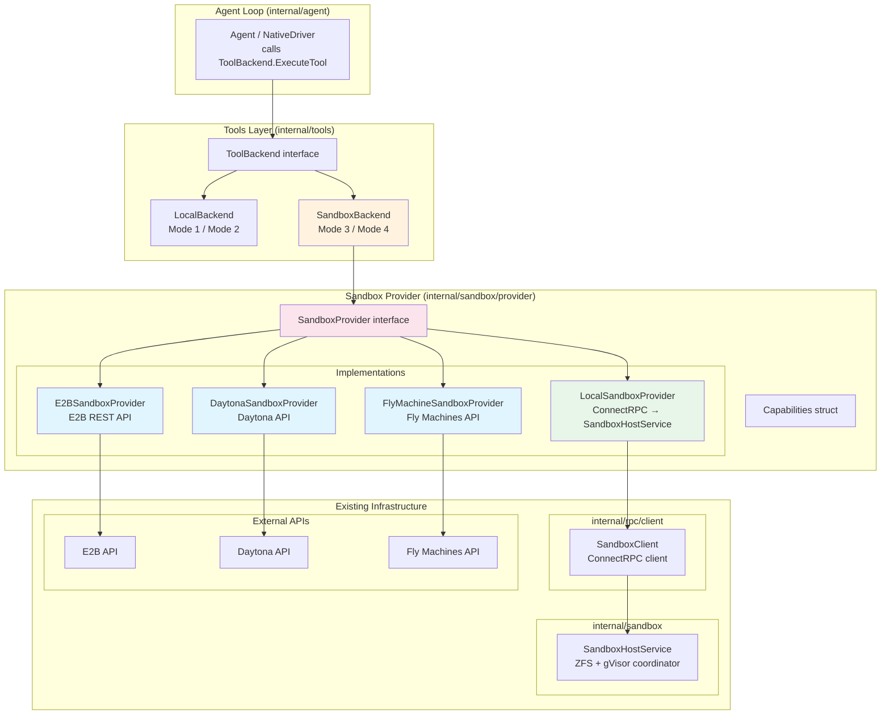
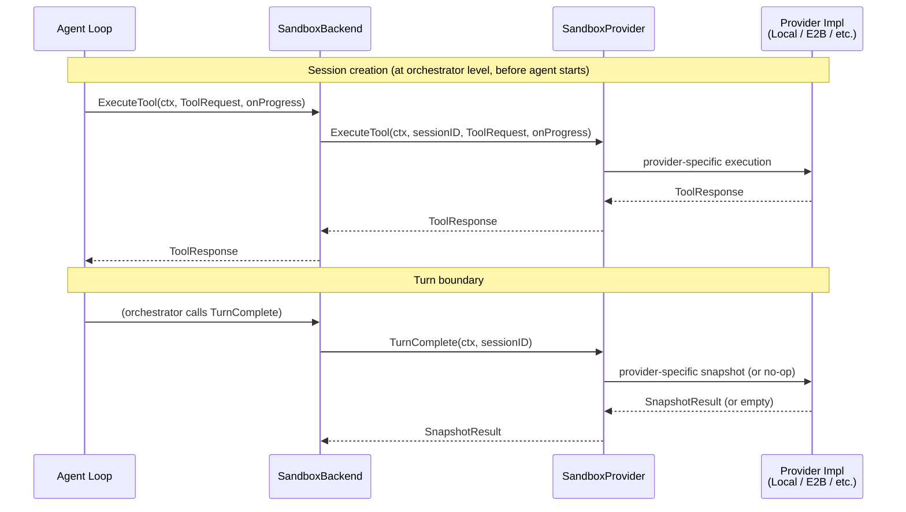

# 11 Addendum 01: Sandbox Provider Abstraction

**Parent plan:** [11-sandbox-host-service.md](./11-sandbox-host-service.md)
**Status:** Draft
**Scope:** Client-side `SandboxProvider` interface, capability system, local provider adapter (wrapping ConnectRPC to SandboxHostService), remote provider adapters (E2B, Daytona, Fly.io), migration path from current `SandboxToolClient` + `SandboxBackend`
**Integrates with:** Plan 06 (ToolBackend), Plan 11 (SandboxHostService), Plan 13 (RPC Layer), Architecture (Placement Modes)

---

## 1. Overview

The current sandbox architecture assumes a single execution model: our ZFS + gVisor stack running behind `SandboxHostService`, accessed via ConnectRPC through `SandboxClient` and `SandboxBackend`. This addendum introduces a `SandboxProvider` abstraction at the **client level** — the interface that the agent loop / orchestrator calls — enabling pluggable sandbox backends including cloud-hosted environments like E2B, Daytona, and Fly.io.

**Key insight:** The abstraction that matters is NOT on the sandbox host side. `SandboxHostService`, `ZFSManager`, and `GVisorManager` all stay as-is — they become internal implementation details of the "local" provider. The abstraction lives at the client level, replacing the current hard-coded `SandboxToolClient` → `SandboxBackend` path with a provider-selected implementation.

**What changes:**
- New `SandboxProvider` interface in `internal/sandbox/provider` — the unified client-side contract
- Capability detection system so the orchestrator knows what each provider supports
- `LocalSandboxProvider` wraps the existing ConnectRPC path (`SandboxClient` → `SandboxHostService`)
- `E2BSandboxProvider`, `DaytonaSandboxProvider`, `FlyMachineSandboxProvider` implement the same interface against their respective APIs
- `SandboxBackend` updated to accept `SandboxProvider` instead of `SandboxToolClient`
- Per-tool snapshots become an optional capability, not a core contract requirement

**What does NOT change:**
- `SandboxHostService` and all ZFS/gVisor internals (plan 11 core)
- `ToolBackend` interface (plan 06)
- Agent loop tool dispatch — still calls `ToolBackend.ExecuteTool()`
- `LocalBackend` (Mode 1 / Mode 2) — unchanged
- RPC layer (plan 13) — unchanged, becomes an implementation detail of `LocalSandboxProvider`

---

## 2. Architecture

### 2.1 Component Diagram



### 2.2 Call Flow: Agent Loop to Provider



### 2.3 Import Flow

```
internal/sandbox/provider           → internal/tools (ToolRequest/ToolResponse types), internal/ai
internal/sandbox/provider/local     → internal/sandbox/provider, internal/rpc/client
internal/sandbox/provider/e2b       → internal/sandbox/provider, net/http
internal/sandbox/provider/daytona   → internal/sandbox/provider, net/http
internal/sandbox/provider/fly       → internal/sandbox/provider, net/http
internal/tools                      → internal/sandbox/provider (SandboxBackend uses SandboxProvider)
```

No circular imports. The provider interface package is minimal (types + interface). Each implementation imports only the interface package and its own API client dependencies.

---

## 3. SandboxProvider Interface

### 3.1 Core Interface

```go
// Package: internal/sandbox/provider
// File: provider.go

// SandboxProvider is the client-side abstraction for sandbox environments.
// It handles session lifecycle, tool execution, and optional snapshot management.
// The agent loop does not interact with this directly — SandboxBackend wraps it
// behind the ToolBackend interface.
//
// Implementations:
//   - LocalSandboxProvider: ConnectRPC to our SandboxHostService (ZFS + gVisor)
//   - E2BSandboxProvider: E2B sandbox API
//   - DaytonaSandboxProvider: Daytona workspace API
//   - FlyMachineSandboxProvider: Fly.io Machines API
type SandboxProvider interface {
    // Name returns a human-readable provider identifier (e.g., "local", "e2b", "daytona", "fly").
    Name() string

    // Capabilities returns the static capability set for this provider.
    // Callers use this to adapt behavior (e.g., skip snapshot calls if not supported).
    Capabilities() Capabilities

    // --- Session Lifecycle ---

    // CreateSession creates a new sandbox session.
    // For local: clones a ZFS dataset from base snapshot.
    // For E2B: creates a new sandbox from a template.
    // For Daytona: creates a workspace.
    // For Fly: creates a Machine with a volume.
    CreateSession(ctx context.Context, req CreateSessionRequest) (*SessionInfo, error)

    // DestroySession tears down a sandbox session and all associated resources.
    DestroySession(ctx context.Context, sessionID string) error

    // PauseSession suspends a session with zero idle compute cost.
    // For local: transitions session state to Paused (ZFS dataset persists).
    // For E2B: calls sandbox.pause().
    // For Daytona: triggers auto-stop (lossy — workspace state preserved, process state lost).
    // For Fly: calls machine.suspend() (memory saved to disk).
    // Returns ErrCapabilityNotSupported if the provider does not support pause.
    PauseSession(ctx context.Context, sessionID string) error

    // ResumeSession re-activates a previously paused session.
    // Returns ErrCapabilityNotSupported if the provider does not support pause.
    ResumeSession(ctx context.Context, sessionID string) error

    // GetSession returns current session metadata.
    GetSession(ctx context.Context, sessionID string) (*SessionInfo, error)

    // --- Tool Execution ---

    // ExecuteTool runs a tool in the sandbox session.
    // For local: dispatches via ConnectRPC to SandboxHostService (Tier 1/2 routing happens server-side).
    // For remote providers: all tools execute as remote commands (no tier distinction).
    // onProgress streams incremental output for long-running tools.
    ExecuteTool(ctx context.Context, sessionID string, req ToolRequest, onProgress func(ToolProgress)) (*ToolResponse, error)

    // --- Snapshot Management (optional) ---

    // TurnComplete signals end of an agent turn.
    // For local: creates a ZFS snapshot (named turn-NNN).
    // For remote providers: may be a no-op or a coarser checkpoint.
    // Returns empty SnapshotResult if the provider does not support snapshots.
    TurnComplete(ctx context.Context, sessionID string) (*SnapshotResult, error)

    // CreateSnapshot creates an explicit named snapshot.
    // Returns ErrCapabilityNotSupported if the provider does not support snapshots.
    CreateSnapshot(ctx context.Context, sessionID string, name string) (*SnapshotResult, error)

    // RollbackSession rolls back a session to a prior snapshot.
    // Returns ErrCapabilityNotSupported if the provider does not support rollback.
    RollbackSession(ctx context.Context, sessionID string, snapshotID string) error

    // ListSnapshots returns the snapshot history for a session.
    // Returns empty list (not error) if the provider does not support snapshots.
    ListSnapshots(ctx context.Context, sessionID string) ([]SnapshotInfo, error)
}
```

### 3.2 Shared Types

```go
// Package: internal/sandbox/provider
// File: types.go

// CreateSessionRequest carries parameters for sandbox session creation.
// Provider-specific fields are passed via Options.
type CreateSessionRequest struct {
    // BaseImage identifies the starting filesystem state.
    // For local: ZFS snapshot name (e.g., "pool/bases/repo-v1@initial").
    // For E2B: template ID.
    // For Daytona: workspace template/image.
    // For Fly: Dockerfile reference or volume snapshot.
    BaseImage string

    // SessionID is an optional pre-assigned session ID.
    // If empty, the provider generates one.
    SessionID string

    // Labels are arbitrary metadata attached to the session.
    Labels map[string]string

    // Options carries provider-specific configuration.
    // Each provider defines its own options struct.
    Options any
}

// SessionInfo describes a sandbox session's current state.
type SessionInfo struct {
    ID         string
    State      SessionState
    Provider   string            // provider name
    Mountpoint string            // filesystem path (may be empty for remote providers)
    TurnCount  int
    SnapCount  int
    Created    time.Time
    Labels     map[string]string
    Metadata   map[string]string // provider-specific metadata (e.g., E2B sandbox ID)
}

// SessionState represents the lifecycle state of a sandbox session.
type SessionState string

const (
    SessionStateCreating   SessionState = "creating"
    SessionStateActive     SessionState = "active"
    SessionStatePaused     SessionState = "paused"
    SessionStateDestroying SessionState = "destroying"
    SessionStateFailed     SessionState = "failed"
)

// SnapshotResult is returned by snapshot operations.
type SnapshotResult struct {
    SnapshotID string
    TurnNumber int
    SpaceUsed  int64 // bytes; 0 if provider doesn't track this
}

// SnapshotInfo describes a single snapshot.
type SnapshotInfo struct {
    ID        string
    Name      string
    CreatedAt time.Time
    SpaceUsed int64 // bytes; 0 if provider doesn't track this
}

// ToolRequest and ToolResponse are re-exported from internal/tools.
// This avoids duplicating types. Providers import internal/tools for these.
type ToolRequest = tools.ToolRequest
type ToolResponse = tools.ToolResponse
type ToolProgress = tools.ToolProgress
```

### 3.3 Error Sentinels

```go
// Package: internal/sandbox/provider
// File: errors.go

var (
    // ErrCapabilityNotSupported is returned when a provider does not support
    // the requested operation (e.g., snapshots on E2B, rollback on Daytona).
    ErrCapabilityNotSupported = errors.New("capability not supported by provider")

    // ErrSessionNotFound is returned when the specified session does not exist.
    ErrSessionNotFound = errors.New("session not found")

    // ErrSessionNotActive is returned when an operation requires an active session
    // but the session is in a different state (paused, destroying, etc.).
    ErrSessionNotActive = errors.New("session not in active state")

    // ErrProviderUnavailable is returned when the provider API is unreachable.
    ErrProviderUnavailable = errors.New("provider unavailable")

    // ErrSessionLimitReached is returned when the provider cannot create more sessions.
    ErrSessionLimitReached = errors.New("session limit reached")
)
```

---

## 4. Capability System

### 4.1 Capabilities Struct

```go
// Package: internal/sandbox/provider
// File: capabilities.go

// Capabilities describes what a SandboxProvider supports.
// This is a static description — it does not change per session.
// The orchestrator checks capabilities to adapt behavior:
//   - Skip TurnComplete calls if PerTurnSnapshots is false
//   - Skip per-tool snapshot expectations if PerToolSnapshots is false
//   - Avoid calling PauseSession if Pause is false
//   - Adjust rollback strategy if Rollback is false
type Capabilities struct {
    // PerTurnSnapshots indicates the provider creates meaningful snapshots
    // on TurnComplete(). If false, TurnComplete() is a no-op that returns
    // an empty SnapshotResult.
    PerTurnSnapshots bool

    // PerToolSnapshots indicates the provider can create snapshots after
    // individual tool executions. Only true for the local provider with
    // config.PerToolSnapshots enabled.
    PerToolSnapshots bool

    // ExplicitSnapshots indicates the provider supports CreateSnapshot()
    // for named, on-demand snapshots.
    ExplicitSnapshots bool

    // Rollback indicates the provider can restore to a prior snapshot.
    Rollback bool

    // Pause indicates the provider supports PauseSession/ResumeSession
    // with state preservation. The degree of state preservation varies:
    //   - Local: full (ZFS dataset persists, instant resume)
    //   - E2B: full (pause() preserves memory + disk)
    //   - Fly: full (suspend() saves memory to disk)
    //   - Daytona: partial (auto-stop preserves disk, loses process state)
    Pause bool

    // TierRouting indicates the provider distinguishes Tier 1 (in-process)
    // and Tier 2 (container) execution. Only true for the local provider.
    // Remote providers execute all tools uniformly.
    TierRouting bool

    // StreamingProgress indicates the provider supports incremental progress
    // callbacks during tool execution (onProgress).
    StreamingProgress bool

    // MaxSessionDuration is the maximum session lifetime. Zero means unlimited.
    MaxSessionDuration time.Duration

    // ConcurrentSessions is the maximum concurrent sessions. Zero means unlimited.
    ConcurrentSessions int
}
```

### 4.2 Capability Constants Per Provider

```go
// LocalCapabilities is the full capability set for ZFS + gVisor local provider.
var LocalCapabilities = Capabilities{
    PerTurnSnapshots:   true,
    PerToolSnapshots:   true, // configurable via ServiceConfig.PerToolSnapshots
    ExplicitSnapshots:  true,
    Rollback:           true,
    Pause:              true,
    TierRouting:        true,
    StreamingProgress:  true,
    MaxSessionDuration: 0, // unlimited
    ConcurrentSessions: 0, // limited by ServiceConfig.MaxSessions
}

// E2BCapabilities describes E2B sandbox limitations.
var E2BCapabilities = Capabilities{
    PerTurnSnapshots:   false,
    PerToolSnapshots:   false,
    ExplicitSnapshots:  false,
    Rollback:           false,
    Pause:              true,  // sandbox.pause() / sandbox.resume()
    TierRouting:        false,
    StreamingProgress:  true,  // sandbox.commands.run() supports streaming
    MaxSessionDuration: 24 * time.Hour,
    ConcurrentSessions: 0, // E2B plan-dependent
}

// DaytonaCapabilities describes Daytona workspace limitations.
var DaytonaCapabilities = Capabilities{
    PerTurnSnapshots:   false,
    PerToolSnapshots:   false,
    ExplicitSnapshots:  false,  // template-based snapshots are too slow for per-turn use
    Rollback:           false,
    Pause:              false,  // auto-stop + recreate is lossy, not true pause
    TierRouting:        false,
    StreamingProgress:  true,   // code_run() supports streaming
    MaxSessionDuration: 0,
    ConcurrentSessions: 0,
}

// FlyMachineCapabilities describes Fly.io Machine limitations.
var FlyMachineCapabilities = Capabilities{
    PerTurnSnapshots:   false,  // volume snapshots are coarse-grained
    PerToolSnapshots:   false,
    ExplicitSnapshots:  false,
    Rollback:           false,
    Pause:              true,   // machine.suspend() saves memory to disk
    TierRouting:        false,
    StreamingProgress:  false,  // no direct exec API; SSH/agent required
    MaxSessionDuration: 0,
    ConcurrentSessions: 0, // Fly org-dependent
}
```

---

## 5. Provider Implementations

### 5.1 LocalSandboxProvider

The local provider wraps the existing `SandboxClient` (ConnectRPC client) and delegates all calls to the remote `SandboxHostService`. This is a thin adapter — the real work happens in plan 11's `SandboxHostService`.

```go
// Package: internal/sandbox/provider/local
// File: local.go

// LocalSandboxProvider adapts the existing ConnectRPC SandboxClient to the
// SandboxProvider interface. This is the provider used in Modes 3 and 4.
//
// It wraps api.SandboxService (the RPC client interface) and translates
// between provider-level types and RPC-level types.
type LocalSandboxProvider struct {
    service api.SandboxService
    logger  *slog.Logger
}

func NewLocalSandboxProvider(service api.SandboxService, logger *slog.Logger) *LocalSandboxProvider {
    return &LocalSandboxProvider{service: service, logger: logger}
}

func (p *LocalSandboxProvider) Name() string { return "local" }

func (p *LocalSandboxProvider) Capabilities() provider.Capabilities {
    return provider.LocalCapabilities
}

func (p *LocalSandboxProvider) CreateSession(ctx context.Context, req provider.CreateSessionRequest) (*provider.SessionInfo, error) {
    rpcResp, err := p.service.CreateSession(ctx, &api.CreateSessionRequest{
        BaseSnapshot: req.BaseImage,
        SessionID:    req.SessionID,
        Labels:       req.Labels,
    })
    if err != nil {
        return nil, fmt.Errorf("local provider: create session: %w", err)
    }
    return apiSessionToProviderSession(rpcResp.Session), nil
}

func (p *LocalSandboxProvider) ExecuteTool(ctx context.Context, sessionID string, req provider.ToolRequest, onProgress func(provider.ToolProgress)) (*provider.ToolResponse, error) {
    // Delegate to the existing SandboxClient RPC path (ExecuteToolStream).
    // This reuses internal/rpc/client.SandboxClient.ExecuteTool exactly.
    rpcReq := &api.ExecuteToolRequest{
        SessionID:  sessionID,
        ToolCallID: req.ToolCallID,
        ToolName:   req.ToolName,
        Params:     req.Params,
    }
    if req.Resources != nil {
        rpcReq.Resources = &api.ResourceSpec{
            CPUs:  float64(req.Resources.CPUs),
            MemMB: req.Resources.MemMB,
        }
    }

    stream, err := p.service.ExecuteToolStream(ctx, rpcReq)
    if err != nil {
        return nil, fmt.Errorf("local provider: execute tool %s: %w", req.ToolName, err)
    }
    defer stream.Close()

    var final *api.ExecuteToolResponse
    for {
        msg, recvErr := stream.Recv()
        if recvErr != nil {
            if final != nil {
                break
            }
            return nil, fmt.Errorf("local provider: stream recv: %w", recvErr)
        }
        if msg == nil {
            continue
        }
        if msg.Progress != nil && onProgress != nil {
            onProgress(provider.ToolProgress{Content: msg.Progress.Content, IsError: msg.Progress.IsError})
        }
        if msg.Response != nil {
            final = msg.Response
            break
        }
    }
    if final == nil {
        return nil, fmt.Errorf("local provider: missing final response for tool %s", req.ToolName)
    }

    return &provider.ToolResponse{
        Content:    decodeResponseContent(final),
        SnapshotID: final.SnapshotID,
        ExitCode:   final.ExitCode,
    }, nil
}

func (p *LocalSandboxProvider) TurnComplete(ctx context.Context, sessionID string) (*provider.SnapshotResult, error) {
    resp, err := p.service.TurnComplete(ctx, &api.TurnCompleteRequest{SessionID: sessionID})
    if err != nil {
        return nil, fmt.Errorf("local provider: turn complete: %w", err)
    }
    return &provider.SnapshotResult{
        SnapshotID: resp.SnapshotID,
        TurnNumber: resp.TurnNumber,
        SpaceUsed:  resp.SpaceUsed,
    }, nil
}

func (p *LocalSandboxProvider) CreateSnapshot(ctx context.Context, sessionID string, name string) (*provider.SnapshotResult, error) {
    resp, err := p.service.CreateSnapshot(ctx, &api.CreateSnapshotRequest{
        SessionID: sessionID,
        Name:      name,
    })
    if err != nil {
        return nil, fmt.Errorf("local provider: create snapshot: %w", err)
    }
    return &provider.SnapshotResult{
        SnapshotID: resp.SnapshotID,
        TurnNumber: resp.TurnNumber,
        SpaceUsed:  resp.SpaceUsed,
    }, nil
}

func (p *LocalSandboxProvider) RollbackSession(ctx context.Context, sessionID string, snapshotID string) error {
    _, err := p.service.RollbackSession(ctx, &api.RollbackSessionRequest{
        SessionID:  sessionID,
        SnapshotID: snapshotID,
    })
    if err != nil {
        return fmt.Errorf("local provider: rollback: %w", err)
    }
    return nil
}

// PauseSession, ResumeSession, DestroySession, GetSession, ListSnapshots
// all follow the same delegation pattern to api.SandboxService methods.
// (Full implementations omitted for brevity — each is a 5-line adapter.)
```

### 5.2 E2BSandboxProvider

E2B is the best-fit remote provider. Its sandbox model maps cleanly to our session concept.

```go
// Package: internal/sandbox/provider/e2b
// File: e2b.go

// E2BSandboxProvider implements SandboxProvider using the E2B sandbox API.
//
// Key mapping:
//   CreateSession → e2b.Sandbox.create(template_id)
//   ExecuteTool   → sandbox.commands.run(cmd) for Tier 2, sandbox.filesystem for Tier 1
//   PauseSession  → sandbox.pause()
//   ResumeSession → e2b.Sandbox.resume(sandbox_id)
//   DestroySession → sandbox.kill()
//   TurnComplete  → no-op (E2B has no snapshot API)
//
// Limitations:
//   - 24-hour maximum sandbox lifetime
//   - No snapshot/rollback API (TurnComplete returns empty result)
//   - pause() preserves full state but has ~2-5s resume latency
type E2BSandboxProvider struct {
    apiKey     string
    httpClient *http.Client
    baseURL    string
    logger     *slog.Logger

    // sessions tracks E2B sandbox IDs keyed by our session ID
    sessions   sync.Map // map[string]*e2bSession
}

type e2bSession struct {
    sandboxID  string
    templateID string
    state      provider.SessionState
    created    time.Time
    turnCount  int
    labels     map[string]string
}

// E2BOptions carries E2B-specific session creation parameters.
type E2BOptions struct {
    TemplateID string        // E2B template to use
    Timeout    time.Duration // sandbox timeout (max 24h, default 5m)
    Metadata   map[string]string
}

func NewE2BSandboxProvider(apiKey string, opts ...Option) *E2BSandboxProvider {
    p := &E2BSandboxProvider{
        apiKey:     apiKey,
        httpClient: &http.Client{Timeout: 30 * time.Second},
        baseURL:    "https://api.e2b.dev/v1",
    }
    for _, opt := range opts {
        opt(p)
    }
    return p
}

func (p *E2BSandboxProvider) Name() string { return "e2b" }

func (p *E2BSandboxProvider) Capabilities() provider.Capabilities {
    return provider.E2BCapabilities
}

func (p *E2BSandboxProvider) CreateSession(ctx context.Context, req provider.CreateSessionRequest) (*provider.SessionInfo, error) {
    var e2bOpts E2BOptions
    if req.Options != nil {
        var ok bool
        e2bOpts, ok = req.Options.(E2BOptions)
        if !ok {
            return nil, fmt.Errorf("e2b provider: Options must be e2b.E2BOptions, got %T", req.Options)
        }
    }
    templateID := e2bOpts.TemplateID
    if templateID == "" {
        templateID = req.BaseImage // fallback: treat BaseImage as template ID
    }

    // POST /sandboxes { template_id, timeout, metadata }
    sandboxID, err := p.apiCreateSandbox(ctx, templateID, e2bOpts)
    if err != nil {
        return nil, fmt.Errorf("e2b provider: create sandbox: %w", err)
    }

    sessionID := req.SessionID
    if sessionID == "" {
        sessionID = "e2b-" + sandboxID
    }

    sess := &e2bSession{
        sandboxID:  sandboxID,
        templateID: templateID,
        state:      provider.SessionStateActive,
        created:    time.Now(),
        labels:     req.Labels,
    }
    p.sessions.Store(sessionID, sess)

    return &provider.SessionInfo{
        ID:       sessionID,
        State:    provider.SessionStateActive,
        Provider: "e2b",
        Created:  sess.created,
        Labels:   req.Labels,
        Metadata: map[string]string{"e2b_sandbox_id": sandboxID},
    }, nil
}

func (p *E2BSandboxProvider) ExecuteTool(ctx context.Context, sessionID string, req provider.ToolRequest, onProgress func(provider.ToolProgress)) (*provider.ToolResponse, error) {
    sess, err := p.getSession(sessionID)
    if err != nil {
        return nil, err
    }

    // Remote providers treat all tools uniformly — no tier distinction.
    // File ops (read, write, edit, grep, glob) use the filesystem API.
    // Process ops (bash, git) use the commands API.
    switch {
    case isFileOp(req.ToolName):
        return p.executeFileOp(ctx, sess, req)
    default:
        return p.executeCommand(ctx, sess, req, onProgress)
    }
}

func (p *E2BSandboxProvider) TurnComplete(ctx context.Context, sessionID string) (*provider.SnapshotResult, error) {
    // E2B has no snapshot API. Increment turn count for tracking only.
    sess, err := p.getSession(sessionID)
    if err != nil {
        return nil, err
    }
    sess.turnCount++
    return &provider.SnapshotResult{TurnNumber: sess.turnCount}, nil
}

func (p *E2BSandboxProvider) CreateSnapshot(ctx context.Context, sessionID string, name string) (*provider.SnapshotResult, error) {
    return nil, provider.ErrCapabilityNotSupported
}

func (p *E2BSandboxProvider) RollbackSession(ctx context.Context, sessionID string, snapshotID string) error {
    return provider.ErrCapabilityNotSupported
}

func (p *E2BSandboxProvider) PauseSession(ctx context.Context, sessionID string) error {
    sess, err := p.getSession(sessionID)
    if err != nil {
        return err
    }
    // POST /sandboxes/{sandbox_id}/pause
    if err := p.apiPauseSandbox(ctx, sess.sandboxID); err != nil {
        return fmt.Errorf("e2b provider: pause: %w", err)
    }
    sess.state = provider.SessionStatePaused
    return nil
}

func (p *E2BSandboxProvider) ResumeSession(ctx context.Context, sessionID string) error {
    sess, err := p.getSession(sessionID)
    if err != nil {
        return err
    }
    // POST /sandboxes/{sandbox_id}/resume
    if err := p.apiResumeSandbox(ctx, sess.sandboxID); err != nil {
        return fmt.Errorf("e2b provider: resume: %w", err)
    }
    sess.state = provider.SessionStateActive
    return nil
}

// DestroySession, GetSession, ListSnapshots follow similar patterns.
// executeFileOp uses E2B filesystem API (read/write/list).
// executeCommand uses E2B commands API (sandbox.commands.run).
```

### 5.3 DaytonaSandboxProvider

Daytona provides workspace-based development environments. The fit is medium — no real pause, template-based snapshots are too slow for per-turn use.

```go
// Package: internal/sandbox/provider/daytona
// File: daytona.go

// DaytonaSandboxProvider implements SandboxProvider using the Daytona API.
//
// Key mapping:
//   CreateSession → daytona.workspace.create(target, source)
//   ExecuteTool   → workspace.code_run() or workspace.filesystem operations
//   PauseSession  → ErrCapabilityNotSupported (auto-stop is lossy)
//   ResumeSession → ErrCapabilityNotSupported
//   DestroySession → workspace.delete()
//   TurnComplete  → no-op (template-based snapshots too slow)
//
// Limitations:
//   - No explicit pause/resume — auto-stop triggers after idle, recreate is lossy
//   - Template-based snapshots exist but are slow (minutes, not milliseconds)
//   - Best for stateless or checkpoint-tolerant workloads
type DaytonaSandboxProvider struct {
    apiKey     string
    apiURL     string
    httpClient *http.Client
    logger     *slog.Logger
    sessions   sync.Map // map[string]*daytonaSession
}

type daytonaSession struct {
    workspaceID string
    state       provider.SessionState
    created     time.Time
    turnCount   int
    labels      map[string]string
}

// DaytonaOptions carries Daytona-specific session creation parameters.
type DaytonaOptions struct {
    Target   string // Daytona target (e.g., "local", "aws")
    Image    string // container image
    GitURL   string // repository to clone
    EnvVars  map[string]string
}

func (p *DaytonaSandboxProvider) Name() string { return "daytona" }

func (p *DaytonaSandboxProvider) Capabilities() provider.Capabilities {
    return provider.DaytonaCapabilities
}

func (p *DaytonaSandboxProvider) PauseSession(ctx context.Context, sessionID string) error {
    return provider.ErrCapabilityNotSupported
}

func (p *DaytonaSandboxProvider) ResumeSession(ctx context.Context, sessionID string) error {
    return provider.ErrCapabilityNotSupported
}

func (p *DaytonaSandboxProvider) CreateSnapshot(ctx context.Context, sessionID string, name string) (*provider.SnapshotResult, error) {
    return nil, provider.ErrCapabilityNotSupported
}

func (p *DaytonaSandboxProvider) RollbackSession(ctx context.Context, sessionID string, snapshotID string) error {
    return provider.ErrCapabilityNotSupported
}

// ExecuteTool, CreateSession, DestroySession, GetSession, TurnComplete, ListSnapshots
// follow the same pattern as E2B but targeting the Daytona REST API.
// code_run() is the primary execution path for all tool types.
```

### 5.4 FlyMachineSandboxProvider

Fly.io is the hardest fit — no direct exec API means we need SSH or an in-sandbox agent for command execution.

```go
// Package: internal/sandbox/provider/fly
// File: fly.go

// FlyMachineSandboxProvider implements SandboxProvider using Fly.io Machines API.
//
// Key mapping:
//   CreateSession → fly.machine.create(image, volume)
//   ExecuteTool   → SSH into machine + exec (requires sshd or agent in image)
//   PauseSession  → machine.suspend()
//   ResumeSession → machine.start()
//   DestroySession → machine.destroy() + volume.destroy()
//   TurnComplete  → no-op (volume snapshots are coarse-grained)
//
// Limitations:
//   - No direct exec API — requires SSH or in-sandbox agent for command execution
//   - Volume snapshots are coarse-grained (not suitable for per-turn)
//   - suspend() saves memory to disk; resume has ~1-3s latency
//   - Custom image required (must include sshd or agent binary)
type FlyMachineSandboxProvider struct {
    apiToken   string
    appName    string
    httpClient *http.Client
    logger     *slog.Logger
    sessions   sync.Map // map[string]*flySession

    // sshConfig for connecting to machines for tool execution
    sshKey     []byte
    sshTimeout time.Duration
}

type flySession struct {
    machineID string
    volumeID  string
    ipAddr    string // private IPv6 within Fly network
    state     provider.SessionState
    created   time.Time
    turnCount int
    labels    map[string]string
}

// FlyOptions carries Fly.io-specific session creation parameters.
type FlyOptions struct {
    Image    string            // Docker image (must include sshd/agent)
    Region   string            // Fly region (e.g., "iad", "lhr")
    CPUs     int               // number of shared CPUs
    MemoryMB int               // memory in MB
    VolumeGB int               // persistent volume size
    EnvVars  map[string]string // environment variables
}

func (p *FlyMachineSandboxProvider) Name() string { return "fly" }

func (p *FlyMachineSandboxProvider) Capabilities() provider.Capabilities {
    return provider.FlyMachineCapabilities
}

func (p *FlyMachineSandboxProvider) ExecuteTool(ctx context.Context, sessionID string, req provider.ToolRequest, onProgress func(provider.ToolProgress)) (*provider.ToolResponse, error) {
    sess, err := p.getSession(sessionID)
    if err != nil {
        return nil, err
    }

    // All tool execution goes through SSH.
    // For file ops: use SSH to read/write files on the machine.
    // For process ops: use SSH to execute commands.
    // The machine image must include an agent binary or sshd.
    switch {
    case isFileOp(req.ToolName):
        return p.executeFileOpSSH(ctx, sess, req)
    default:
        return p.executeCommandSSH(ctx, sess, req, onProgress)
    }
}

func (p *FlyMachineSandboxProvider) PauseSession(ctx context.Context, sessionID string) error {
    sess, err := p.getSession(sessionID)
    if err != nil {
        return err
    }
    // PUT /apps/{app}/machines/{machine_id}/suspend
    if err := p.apiSuspendMachine(ctx, sess.machineID); err != nil {
        return fmt.Errorf("fly provider: suspend: %w", err)
    }
    sess.state = provider.SessionStatePaused
    return nil
}

// CreateSession, ResumeSession, DestroySession, GetSession, TurnComplete,
// CreateSnapshot, RollbackSession, ListSnapshots follow same patterns.
```

---

## 6. Migration Path

### 6.1 Current Call Chain

```
Agent Loop
  → SandboxBackend.ExecuteTool(ctx, ToolRequest, onProgress)
    → SandboxToolClient.ExecuteTool(ctx, sessionID, ToolRequest, onProgress)
      → SandboxClient (internal/rpc/client) speaks ConnectRPC
        → SandboxHostService (internal/sandbox)
```

### 6.2 New Call Chain

```
Agent Loop
  → SandboxBackend.ExecuteTool(ctx, ToolRequest, onProgress)
    → SandboxProvider.ExecuteTool(ctx, sessionID, ToolRequest, onProgress)
      → LocalSandboxProvider → SandboxClient → SandboxHostService
      → E2BSandboxProvider → E2B REST API
      → DaytonaSandboxProvider → Daytona REST API
      → FlyMachineSandboxProvider → Fly Machines API + SSH
```

### 6.3 Changes to Existing Code

**`internal/tools/sandbox_backend.go`** — Replace `SandboxToolClient` with `SandboxProvider`:

```go
// BEFORE:
type SandboxBackend struct {
    client    SandboxToolClient
    sessionID string
}

func NewSandboxBackend(client SandboxToolClient, sessionID string) *SandboxBackend

// AFTER:
type SandboxBackend struct {
    provider  provider.SandboxProvider
    sessionID string
}

func NewSandboxBackend(p provider.SandboxProvider, sessionID string) *SandboxBackend
```

The `ExecuteTool` method body is nearly identical — it just calls `b.provider.ExecuteTool()` instead of `b.client.ExecuteTool()`.

**`internal/tools/sandbox_backend.go`** — Remove `SandboxToolClient` interface:

```go
// REMOVE (superseded by SandboxProvider):
type SandboxToolClient interface {
    ExecuteTool(ctx context.Context, sessionID string, req ToolRequest, onProgress func(ToolProgress)) (*ToolResponse, error)
}
```

**`internal/tools/sandbox_backend.go`** — Update `NewSandboxTools`:

```go
// BEFORE:
func NewSandboxTools(client SandboxToolClient, sessionID string) []agent.AgentTool

// AFTER:
func NewSandboxTools(p provider.SandboxProvider, sessionID string) []agent.AgentTool
```

**`internal/rpc/client/sandbox_client.go`** — `SandboxClient` no longer needs to implement `SandboxToolClient`. It is used internally by `LocalSandboxProvider` through the `api.SandboxService` interface.

**Orchestrator / RuntimeController** — Session lifecycle calls migrate from direct `api.SandboxService` RPC calls to `SandboxProvider` method calls. The orchestrator selects the provider at startup based on configuration:

```go
// Example: orchestrator selects provider
func selectProvider(cfg Config) (provider.SandboxProvider, error) {
    switch cfg.SandboxProvider {
    case "local":
        svc := connectrpc.NewSandboxServiceClient(cfg.SandboxHostURL)
        return local.NewLocalSandboxProvider(svc, logger), nil
    case "e2b":
        return e2b.NewE2BSandboxProvider(cfg.E2BAPIKey), nil
    case "daytona":
        return daytona.NewDaytonaSandboxProvider(cfg.DaytonaAPIKey, cfg.DaytonaURL), nil
    case "fly":
        return fly.NewFlyMachineSandboxProvider(cfg.FlyAPIToken, cfg.FlyAppName, cfg.FlySSHKey), nil
    default:
        return nil, fmt.Errorf("unknown sandbox provider: %s", cfg.SandboxProvider)
    }
}
```

### 6.4 Tier 1/2 Distinction

For the local provider, Tier 1/2 routing is handled server-side by `SandboxHostService` — the provider just forwards the request. For remote providers, there is no tier distinction from the provider's perspective. However, remote providers still need to know how to execute different tool types:

- **File ops** (read, write, edit, grep, glob): Use the provider's filesystem API
- **Process ops** (bash, git commands): Use the provider's command execution API

This is an internal concern of each provider implementation, not an interface-level distinction. The `isFileOp()` helper (shared utility) helps providers route internally, but is NOT exposed in the `SandboxProvider` interface.

---

## 7. Snapshot Handling by Provider

| Operation | Local | E2B | Daytona | Fly.io |
|-----------|-------|-----|---------|--------|
| `TurnComplete()` | ZFS snapshot (instant, COW) | No-op (turn count only) | No-op (turn count only) | No-op (turn count only) |
| `CreateSnapshot()` | ZFS named snapshot | `ErrCapabilityNotSupported` | `ErrCapabilityNotSupported` | `ErrCapabilityNotSupported` |
| `RollbackSession()` | ZFS rollback (<100ms) | `ErrCapabilityNotSupported` | `ErrCapabilityNotSupported` | `ErrCapabilityNotSupported` |
| `ListSnapshots()` | ZFS snapshot list | Empty list | Empty list | Empty list |
| Per-tool snapshots | Opt-in via config | Not supported | Not supported | Not supported |

The orchestrator MUST check `provider.Capabilities()` before relying on snapshot operations. The pattern:

```go
if sp.Capabilities().Rollback {
    err := sp.RollbackSession(ctx, sessionID, snapshotID)
    // handle rollback
} else {
    // provider doesn't support rollback — use alternative recovery strategy
    // (e.g., destroy + recreate session)
}
```

---

## 8. Connected Components / Seam Impacts

### 8.1 New Seams

| Component A | Component B | Interface | Notes |
|-------------|-------------|-----------|-------|
| `internal/tools` (SandboxBackend) | `internal/sandbox/provider` | `SandboxProvider` | Replaces `SandboxToolClient` |
| `internal/sandbox/provider/local` | `internal/rpc/client` | `api.SandboxService` | Local provider delegates to existing RPC client |
| `internal/sandbox/provider/local` | `internal/sandbox` | (indirect, via RPC) | Local provider → RPC → SandboxHostService |
| `internal/sandbox/provider/e2b` | E2B REST API | HTTP | External API dependency |
| `internal/sandbox/provider/daytona` | Daytona REST API | HTTP | External API dependency |
| `internal/sandbox/provider/fly` | Fly Machines API + SSH | HTTP + SSH | External API + SSH dependency |
| RuntimeController / Orchestrator | `internal/sandbox/provider` | `SandboxProvider` | Session lifecycle management |

### 8.2 Modified Seams

| Original Seam | Change |
|---------------|--------|
| `internal/tools (SandboxBackend)` → `SandboxToolClient` | Replaced by `SandboxBackend` → `SandboxProvider` |
| `internal/tools (NewSandboxTools)` signature | `SandboxToolClient` parameter → `SandboxProvider` parameter |
| Orchestrator → `api.SandboxService` (direct RPC) | Orchestrator → `SandboxProvider` (provider-abstracted) |

### 8.3 Unchanged Seams

| Seam | Why Unchanged |
|------|---------------|
| `internal/sandbox (SandboxHostService)` → `ZFSManager` / `GVisorManager` | Internal to local provider path |
| `internal/rpc` → `internal/sandbox` | RPC server still calls SandboxHostService directly |
| `internal/tools (ToolBackend)` interface | SandboxBackend still implements ToolBackend — no change |
| `internal/agent` → `internal/tools` (AgentTool) | Agent loop still sees ToolBackend.ExecuteTool() |
| `internal/tools (ClassifyTool)` | Tier classification is still shared; remote providers may use it internally |

### 8.4 Implementation Guide Updates

The following sections of `00-implementation-guide.md` need updates:

- **Section 1.6** (ToolBackend): Add note about `SandboxBackend` now accepting `SandboxProvider` instead of `SandboxToolClient`
- **Section 2.5** (RPC SandboxBackend Lifecycle): Update to reflect provider abstraction; `SandboxBackend` construction takes `SandboxProvider` not `SandboxToolClient`
- **Section 5** (Seam Reference Table): Add new seam entries from section 8.1 above
- **Section 5.1** (Import Flow): Add `internal/sandbox/provider` and sub-packages

---

## 9. Testing Strategy

### 9.1 Unit Tests (per provider)

**T1: LocalSandboxProvider adapter correctness**
- Mock `api.SandboxService`, verify all methods delegate with correct type conversion
- Verify `ToolRequest` → `api.ExecuteToolRequest` field mapping
- Verify `api.Session` → `provider.SessionInfo` field mapping
- Verify streaming progress callbacks are propagated

**T2: E2BSandboxProvider API mapping**
- Use HTTP test server (`httptest.Server`) to mock E2B API
- Verify CreateSession sends correct POST /sandboxes payload
- Verify ExecuteTool routes file ops to filesystem API, commands to commands API
- Verify PauseSession calls POST /sandboxes/{id}/pause
- Verify TurnComplete returns empty SnapshotResult (no API call)
- Verify CreateSnapshot returns `ErrCapabilityNotSupported`

**T3: DaytonaSandboxProvider API mapping**
- Same pattern as T2 against Daytona API mock
- Verify PauseSession returns `ErrCapabilityNotSupported`
- Verify all snapshot operations return `ErrCapabilityNotSupported`

**T4: FlyMachineSandboxProvider API mapping**
- Mock Fly Machines API + SSH server for command execution
- Verify CreateSession creates machine + volume
- Verify ExecuteTool connects via SSH
- Verify PauseSession calls machine suspend

**T5: Capabilities correctness**
- Each provider's `Capabilities()` returns the expected static values
- Verify capability constants match documented provider limitations

### 9.2 Integration Tests

**T6: SandboxBackend + SandboxProvider integration**
- Wire `SandboxBackend` to each provider (mocked APIs)
- Verify the full `ToolBackend.ExecuteTool()` path works end-to-end
- Verify `onProgress` callbacks flow through the full chain

**T7: Provider selection / factory**
- Verify provider factory returns correct provider type for each config value
- Verify unknown provider name returns error

**T8: Capability-gated behavior**
- Wire orchestrator-level code to each provider
- Verify TurnComplete skipped when `PerTurnSnapshots` is false
- Verify Rollback skipped when `Rollback` is false
- Verify PauseSession returns `ErrCapabilityNotSupported` for Daytona

### 9.3 Backward Compatibility Tests

**T9: Local provider parity with direct SandboxClient**
- Run the same tool execution sequence through:
  1. Direct `SandboxClient` (old path)
  2. `LocalSandboxProvider` wrapping `SandboxClient` (new path)
- Verify identical `ToolResponse` values (content, snapshot ID, exit code)
- Use `MemorySandboxService` from plan 14 as the backend

**T10: NewSandboxTools migration**
- Verify `NewSandboxTools(provider, sessionID)` produces tools with identical names, schemas, and behavior to the old `NewSandboxTools(client, sessionID)`

### 9.4 Contract Tests

**T11: SandboxProvider interface compliance**
- Write a shared test suite that any `SandboxProvider` implementation must pass
- Tests exercise full lifecycle: Create → Execute → TurnComplete → Pause → Resume → Destroy
- For providers that don't support certain operations, verify correct `ErrCapabilityNotSupported` errors
- Run the shared suite against all four providers (with mocked backends)

---

## 10. Implementation Sequence

1. **Phase 1: Interface + Types** — Create `internal/sandbox/provider` package with interface, types, capabilities, errors. No implementations yet.

2. **Phase 2: LocalSandboxProvider** — Implement the local adapter wrapping `api.SandboxService`. Write unit tests. Verify parity with direct `SandboxClient` path.

3. **Phase 3: SandboxBackend Migration** — Update `SandboxBackend` to accept `SandboxProvider` instead of `SandboxToolClient`. Remove `SandboxToolClient` interface. Update `NewSandboxTools`. Verify all existing tests pass.

4. **Phase 4: E2B Provider** — Implement `E2BSandboxProvider` with full API integration. Write unit tests with HTTP mock. This is the highest-value remote provider.

5. **Phase 5: Daytona + Fly Providers** — Implement remaining providers. These can be done in parallel since they share no code dependencies.

6. **Phase 6: Integration Tests** — Contract test suite, capability-gated behavior tests, backward compatibility verification.

---

## 11. Open Questions

1. **Provider-specific tool implementations:** Remote providers need to translate tool requests (e.g., `read_file` with path parameter) into provider-specific API calls (e.g., E2B filesystem API). Should this translation live in each provider, or should we define a `RemoteToolExecutor` helper that providers can share?

2. **Session persistence across provider restarts:** If the provider process restarts, the in-memory session map is lost. For remote providers, we could reconstruct state from the provider API (e.g., list E2B sandboxes). Should we define a `RecoverSessions()` method on the interface?

3. **Provider health checks:** Should `SandboxProvider` include a `HealthCheck()` method? The local provider delegates to `SandboxHostService.HealthCheck()`, but remote providers would need their own health semantics.

4. **Multi-provider sessions:** Should the system support using different providers for different sessions simultaneously (e.g., some agents on local, some on E2B)? The current design supports this naturally since the provider is selected at session creation time, but orchestrator-level routing logic would need to be designed.
