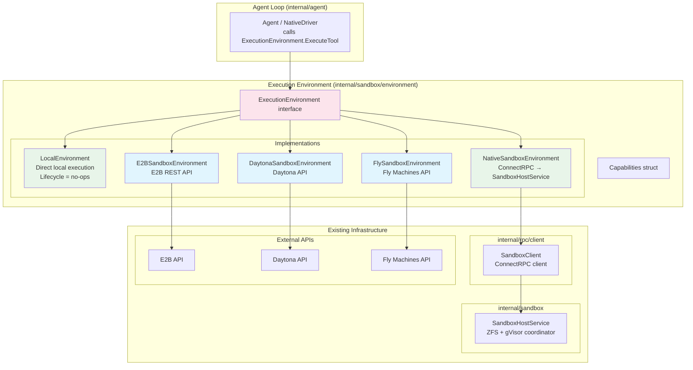
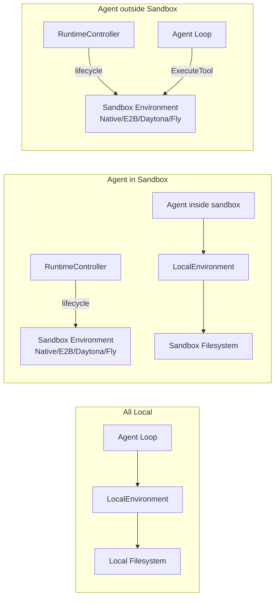
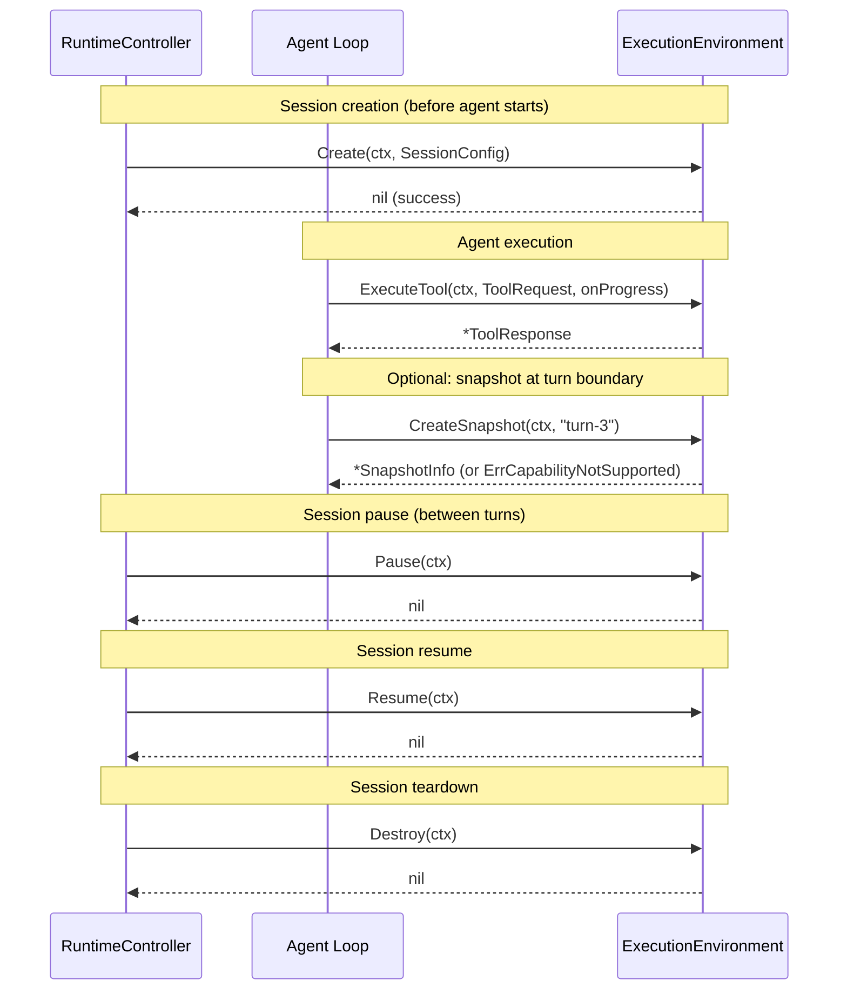

# 11 Addendum 01: ExecutionEnvironment Abstraction

**Parent plan:** [11-sandbox-host-service.md](./11-sandbox-host-service.md)
**Status:** Draft
**Scope:** Unified `ExecutionEnvironment` interface replacing both `ToolBackend` (LocalBackend + SandboxBackend) and the sandbox provider layer. Implementations for local, native sandbox (ZFS/gVisor), E2B, Daytona, and Fly.io. Migration path from current `ToolBackend` split.
**Integrates with:** Plan 06 (ToolBackend), Plan 11 (SandboxHostService), Plan 13 (RPC Layer), Architecture (Placement Modes)

---

## 1. Overview

The current sandbox architecture has two separate interface hierarchies that need to be unified:

1. **ToolBackend** (Plan 06) with `LocalBackend` and `SandboxBackend` — determines *how* tools execute
2. **Sandbox lifecycle** managed directly by the RuntimeController via RPC calls

This addendum replaces both with a single **`ExecutionEnvironment`** interface that covers lifecycle, tool execution, and optional capabilities (snapshots, rollback). Every environment — from "run everything locally with no sandbox" to "use E2B cloud sandboxes" — implements the same interface.

**Key insight:** There is no meaningful distinction between "how tools execute" (ToolBackend) and "what sandbox to use" (provider). They are the same decision. An `ExecutionEnvironment` IS the backend. The agent loop calls `ExecutionEnvironment.ExecuteTool()`. The RuntimeController calls lifecycle methods on the same interface.

**What changes:**
- New `ExecutionEnvironment` interface in `internal/sandbox/environment` — the single unified contract
- `ToolBackend` interface goes away — `ExecutionEnvironment` subsumes it
- `SandboxBackend` wrapper goes away — no more intermediary layer
- `LocalBackend` becomes `LocalEnvironment` (lifecycle methods are no-ops)
- `NativeSandboxEnvironment` wraps ConnectRPC to SandboxHostService
- `E2BSandboxEnvironment`, `DaytonaSandboxEnvironment`, `FlySandboxEnvironment` implement the same interface against their respective APIs
- Capability detection system so the RuntimeController/orchestrator knows what each environment supports

**What does NOT change:**
- `SandboxHostService` and all ZFS/gVisor internals (plan 11 core)
- RPC layer (plan 13) — unchanged, becomes an implementation detail of `NativeSandboxEnvironment`
- Agent loop tool dispatch — still calls `ExecuteTool()`, just on `ExecutionEnvironment` instead of `ToolBackend`

---

## 2. Architecture

### 2.1 Component Diagram



### 2.2 Placement Mode Mapping



**All Local** -- `LocalEnvironment`. Create/Pause/Resume/Destroy are no-ops. ExecuteTool runs tools directly on the local filesystem. No sandbox involved.

**Agent in Sandbox** -- The RuntimeController uses a sandbox environment (NativeSandboxEnvironment, E2BSandboxEnvironment, etc.) for lifecycle: create the sandbox, put the agent in it. The agent running *inside* the sandbox uses `LocalEnvironment` for tool execution (tools are local to that sandbox).

**Agent outside Sandbox** -- The RuntimeController uses a sandbox environment for *both* lifecycle AND tool execution. The agent loop calls `ExecuteTool()` on the sandbox environment directly. Tool calls are dispatched to the sandbox infrastructure.

### 2.3 Call Flow: Agent Loop to Environment



### 2.4 Import Flow

```
internal/sandbox/environment             → (minimal: types + interface only)
internal/sandbox/environment/local       → internal/sandbox/environment, internal/tools (tool execution logic)
internal/sandbox/environment/native      → internal/sandbox/environment, internal/rpc/client
internal/sandbox/environment/e2b         → internal/sandbox/environment, net/http
internal/sandbox/environment/daytona     → internal/sandbox/environment, net/http
internal/sandbox/environment/fly         → internal/sandbox/environment, net/http
internal/agent                           → internal/sandbox/environment (calls ExecuteTool)
```

No circular imports. The environment interface package is minimal (types + interface). Each implementation imports only the interface package and its own dependencies.

---

## 3. ExecutionEnvironment Interface

### 3.1 Core Interface

```go
// Package: internal/sandbox/environment
// File: environment.go

// ExecutionEnvironment is the unified interface for tool execution environments.
// It covers lifecycle management, tool execution, and optional capabilities
// like snapshots and rollback.
//
// Every placement mode maps to an ExecutionEnvironment:
//   - All Local: LocalEnvironment (lifecycle no-ops, direct local exec)
//   - Agent in Sandbox: agent inside uses LocalEnvironment; RuntimeController
//     uses a sandbox environment for lifecycle
//   - Agent outside Sandbox: sandbox environment for both lifecycle and tool exec
//
// Implementations:
//   - LocalEnvironment: direct local filesystem execution, no sandbox
//   - NativeSandboxEnvironment: ConnectRPC to SandboxHostService (ZFS + gVisor)
//   - E2BSandboxEnvironment: E2B sandbox API
//   - DaytonaSandboxEnvironment: Daytona workspace API
//   - FlySandboxEnvironment: Fly.io Machines API
type ExecutionEnvironment interface {
    // --- Lifecycle ---

    // Create initializes the execution environment.
    // For LocalEnvironment: no-op (local filesystem is always available).
    // For NativeSandboxEnvironment: creates a ZFS dataset clone from base snapshot.
    // For E2BSandboxEnvironment: creates a sandbox from a template.
    // For DaytonaSandboxEnvironment: creates a workspace.
    // For FlySandboxEnvironment: creates a Machine with a volume.
    Create(ctx context.Context, config SessionConfig) error

    // Pause suspends the environment with minimal idle compute cost.
    // For LocalEnvironment: no-op.
    // For NativeSandboxEnvironment: transitions session state to paused (ZFS persists).
    // For E2BSandboxEnvironment: sandbox.pause() (full state preserved).
    // For DaytonaSandboxEnvironment: auto-stop (lossy — disk preserved, processes lost).
    // For FlySandboxEnvironment: machine.suspend() (memory saved to disk).
    // Returns ErrCapabilityNotSupported if pause is not meaningful for this environment.
    Pause(ctx context.Context) error

    // Resume re-activates a previously paused environment.
    // Returns ErrCapabilityNotSupported if pause/resume is not supported.
    Resume(ctx context.Context) error

    // Destroy tears down the environment and all associated resources.
    // For LocalEnvironment: no-op.
    // For sandbox environments: destroys the sandbox/machine/workspace and volumes.
    Destroy(ctx context.Context) error

    // --- Tool Execution ---

    // ExecuteTool runs a tool in this environment.
    // For LocalEnvironment: executes directly on local filesystem/processes.
    // For sandbox environments: dispatches to the sandbox via RPC/API.
    // onProgress streams incremental output for long-running tools (e.g., bash).
    ExecuteTool(ctx context.Context, req ToolRequest, onProgress func(ToolProgress)) (*ToolResponse, error)

    // --- Capabilities & Snapshots ---

    // Capabilities returns the static capability set for this environment.
    // Callers use this to adapt behavior (e.g., skip snapshot calls if not supported).
    Capabilities() Capabilities

    // CreateSnapshot creates a named snapshot of the environment's current state.
    // For NativeSandboxEnvironment: creates a ZFS snapshot (instant, COW).
    // Returns ErrCapabilityNotSupported for environments without snapshot support.
    CreateSnapshot(ctx context.Context, name string) (*SnapshotInfo, error)

    // Rollback restores the environment to a prior snapshot.
    // For NativeSandboxEnvironment: ZFS rollback (<100ms).
    // Returns ErrCapabilityNotSupported for environments without rollback support.
    Rollback(ctx context.Context, snapshotID string) error
}
```

### 3.2 Shared Types

```go
// Package: internal/sandbox/environment
// File: types.go

// SessionConfig carries parameters for environment creation.
// Environment-specific fields are passed via Options.
type SessionConfig struct {
    // BaseImage identifies the starting filesystem state.
    // For NativeSandboxEnvironment: ZFS snapshot name (e.g., "pool/bases/repo-v1@initial").
    // For E2BSandboxEnvironment: template ID.
    // For DaytonaSandboxEnvironment: workspace template/image.
    // For FlySandboxEnvironment: Docker image reference or volume snapshot.
    // For LocalEnvironment: ignored (uses local filesystem as-is).
    BaseImage string

    // SessionID is an optional pre-assigned session ID.
    // If empty, the environment generates one.
    SessionID string

    // Labels are arbitrary metadata attached to the session.
    Labels map[string]string

    // Options carries environment-specific configuration.
    // Each environment implementation defines its own options struct.
    Options any
}

// SnapshotInfo describes a snapshot of the environment state.
type SnapshotInfo struct {
    ID        string
    Name      string
    CreatedAt time.Time
    SpaceUsed int64 // bytes; 0 if environment doesn't track this
}

// ToolRequest and ToolResponse are re-exported from internal/tools.
// This avoids duplicating types. Environments import internal/tools for these.
type ToolRequest = tools.ToolRequest
type ToolResponse = tools.ToolResponse
type ToolProgress = tools.ToolProgress
```

### 3.3 Error Sentinels

```go
// Package: internal/sandbox/environment
// File: errors.go

var (
    // ErrCapabilityNotSupported is returned when an environment does not support
    // the requested operation (e.g., snapshots on E2B, rollback on Daytona).
    ErrCapabilityNotSupported = errors.New("capability not supported by environment")

    // ErrNotActive is returned when an operation requires an active environment
    // but the environment is in a different state (paused, destroyed, etc.).
    ErrNotActive = errors.New("environment not in active state")

    // ErrUnavailable is returned when the environment's backing service is unreachable.
    ErrUnavailable = errors.New("environment unavailable")

    // ErrSessionLimitReached is returned when no more environments can be created.
    ErrSessionLimitReached = errors.New("session limit reached")
)
```

---

## 4. Capability System

### 4.1 Capabilities Struct

```go
// Package: internal/sandbox/environment
// File: capabilities.go

// Capabilities describes what an ExecutionEnvironment supports.
// This is a static description — it does not change after Create().
// The RuntimeController and orchestrator check capabilities to adapt behavior:
//   - Skip snapshot calls if Snapshots is false
//   - Skip rollback strategy if Rollback is false
//   - Avoid calling Pause if Pause is false
type Capabilities struct {
    // Snapshots indicates the environment supports CreateSnapshot().
    // Only true for NativeSandboxEnvironment (ZFS snapshots).
    Snapshots bool

    // Rollback indicates the environment can restore to a prior snapshot.
    // Only true for NativeSandboxEnvironment (ZFS rollback).
    Rollback bool

    // Pause indicates the environment supports Pause/Resume
    // with state preservation. The degree of preservation varies:
    //   - NativeSandboxEnvironment: full (ZFS dataset persists, instant resume)
    //   - E2BSandboxEnvironment: full (pause() preserves memory + disk)
    //   - FlySandboxEnvironment: full (suspend() saves memory to disk)
    //   - DaytonaSandboxEnvironment: partial (auto-stop preserves disk, loses processes)
    Pause bool

    // StreamingProgress indicates the environment supports incremental progress
    // callbacks during tool execution (onProgress).
    StreamingProgress bool

    // TierRouting indicates the environment distinguishes Tier 1 (in-process)
    // and Tier 2 (container) execution. Only true for NativeSandboxEnvironment.
    // Remote environments execute all tools uniformly.
    TierRouting bool

    // MaxSessionDuration is the maximum session lifetime. Zero means unlimited.
    MaxSessionDuration time.Duration

    // ConcurrentSessions is the maximum concurrent sessions. Zero means unlimited.
    ConcurrentSessions int
}
```

### 4.2 Capability Constants Per Environment

```go
// LocalCapabilities: LocalEnvironment has no sandbox features.
var LocalCapabilities = Capabilities{
    Snapshots:         false,
    Rollback:          false,
    Pause:             false, // no-op, not a real pause
    TierRouting:       false,
    StreamingProgress: true,  // local exec can stream output
}

// NativeSandboxCapabilities: full capability set for ZFS + gVisor.
var NativeSandboxCapabilities = Capabilities{
    Snapshots:         true,
    Rollback:          true,
    Pause:             true,
    TierRouting:       true,
    StreamingProgress: true,
}

// E2BCapabilities: E2B sandbox limitations.
var E2BCapabilities = Capabilities{
    Snapshots:          false,
    Rollback:           false,
    Pause:              true,  // sandbox.pause() / sandbox.resume()
    TierRouting:        false,
    StreamingProgress:  true,  // sandbox.commands.run() supports streaming
    MaxSessionDuration: 24 * time.Hour,
}

// DaytonaCapabilities: Daytona workspace limitations.
var DaytonaCapabilities = Capabilities{
    Snapshots:         false,
    Rollback:          false,
    Pause:             false, // auto-stop + recreate is lossy, not true pause
    TierRouting:       false,
    StreamingProgress: true,  // code_run() supports streaming
}

// FlyCapabilities: Fly.io Machine limitations.
var FlyCapabilities = Capabilities{
    Snapshots:         false, // volume snapshots are coarse-grained
    Rollback:          false,
    Pause:             true,  // machine.suspend() saves memory to disk
    TierRouting:       false,
    StreamingProgress: false, // no direct exec API; SSH/agent required
}
```

---

## 5. Environment Implementations

### 5.1 LocalEnvironment

`LocalEnvironment` is the simplest implementation. Lifecycle methods are no-ops. Tool execution runs directly on the local filesystem and processes. Used in **All Local** mode and by agents running **inside** sandboxes in **Agent in Sandbox** mode.

```go
// Package: internal/sandbox/environment/local
// File: local.go

// LocalEnvironment executes tools directly on the local filesystem.
// All lifecycle methods (Create, Pause, Resume, Destroy) are no-ops.
// This is used in All Local mode and by agents running inside sandboxes
// in Agent in Sandbox mode (from the agent's perspective, tools are local).
type LocalEnvironment struct {
    workDir string       // working directory for tool execution
    logger  *slog.Logger
}

func NewLocalEnvironment(workDir string, logger *slog.Logger) *LocalEnvironment {
    return &LocalEnvironment{workDir: workDir, logger: logger}
}

func (e *LocalEnvironment) Create(ctx context.Context, config environment.SessionConfig) error {
    return nil // no-op: local filesystem is always available
}

func (e *LocalEnvironment) Pause(ctx context.Context) error {
    return nil // no-op
}

func (e *LocalEnvironment) Resume(ctx context.Context) error {
    return nil // no-op
}

func (e *LocalEnvironment) Destroy(ctx context.Context) error {
    return nil // no-op
}

func (e *LocalEnvironment) ExecuteTool(ctx context.Context, req environment.ToolRequest, onProgress func(environment.ToolProgress)) (*environment.ToolResponse, error) {
    // Dispatch to the local tool execution engine.
    // File ops (read, write, edit, grep, glob) execute as Go functions.
    // Process ops (bash) execute as os/exec commands.
    // This reuses the existing tool execution logic from internal/tools.
    return executeLocalTool(ctx, e.workDir, req, onProgress)
}

func (e *LocalEnvironment) Capabilities() environment.Capabilities {
    return environment.LocalCapabilities
}

func (e *LocalEnvironment) CreateSnapshot(ctx context.Context, name string) (*environment.SnapshotInfo, error) {
    return nil, environment.ErrCapabilityNotSupported
}

func (e *LocalEnvironment) Rollback(ctx context.Context, snapshotID string) error {
    return environment.ErrCapabilityNotSupported
}
```

### 5.2 NativeSandboxEnvironment

Wraps the existing `SandboxClient` (ConnectRPC client) and delegates all calls to the `SandboxHostService`. This is a thin adapter -- the real work happens in plan 11's `SandboxHostService`. Used in **Agent outside Sandbox** mode with our own ZFS + gVisor stack, and by the RuntimeController for lifecycle management in **Agent in Sandbox** mode.

```go
// Package: internal/sandbox/environment/native
// File: native.go

// NativeSandboxEnvironment adapts the existing ConnectRPC SandboxClient to the
// ExecutionEnvironment interface. Wraps api.SandboxService (the RPC client
// interface) and translates between environment-level types and RPC-level types.
type NativeSandboxEnvironment struct {
    service   api.SandboxService
    logger    *slog.Logger
    sessionID string // set after Create()
}

func NewNativeSandboxEnvironment(service api.SandboxService, logger *slog.Logger) *NativeSandboxEnvironment {
    return &NativeSandboxEnvironment{service: service, logger: logger}
}

func (e *NativeSandboxEnvironment) Create(ctx context.Context, config environment.SessionConfig) error {
    rpcResp, err := e.service.CreateSession(ctx, &api.CreateSessionRequest{
        BaseSnapshot: config.BaseImage,
        SessionID:    config.SessionID,
        Labels:       config.Labels,
    })
    if err != nil {
        return fmt.Errorf("native sandbox: create: %w", err)
    }
    e.sessionID = rpcResp.Session.ID
    return nil
}

func (e *NativeSandboxEnvironment) Pause(ctx context.Context) error {
    _, err := e.service.PauseSession(ctx, &api.PauseSessionRequest{SessionID: e.sessionID})
    if err != nil {
        return fmt.Errorf("native sandbox: pause: %w", err)
    }
    return nil
}

func (e *NativeSandboxEnvironment) Resume(ctx context.Context) error {
    _, err := e.service.ResumeSession(ctx, &api.ResumeSessionRequest{SessionID: e.sessionID})
    if err != nil {
        return fmt.Errorf("native sandbox: resume: %w", err)
    }
    return nil
}

func (e *NativeSandboxEnvironment) Destroy(ctx context.Context) error {
    _, err := e.service.DestroySession(ctx, &api.DestroySessionRequest{SessionID: e.sessionID})
    if err != nil {
        return fmt.Errorf("native sandbox: destroy: %w", err)
    }
    return nil
}

func (e *NativeSandboxEnvironment) ExecuteTool(ctx context.Context, req environment.ToolRequest, onProgress func(environment.ToolProgress)) (*environment.ToolResponse, error) {
    rpcReq := &api.ExecuteToolRequest{
        SessionID:  e.sessionID,
        ToolCallID: req.ToolCallID,
        ToolName:   req.ToolName,
        Params:     req.Params,
    }
    if req.Resources != nil {
        rpcReq.Resources = &api.ResourceSpec{
            CPUs:  float64(req.Resources.CPUs),
            MemMB: req.Resources.MemMB,
        }
    }

    stream, err := e.service.ExecuteToolStream(ctx, rpcReq)
    if err != nil {
        return nil, fmt.Errorf("native sandbox: execute tool %s: %w", req.ToolName, err)
    }
    defer stream.Close()

    var final *api.ExecuteToolResponse
    for {
        msg, recvErr := stream.Recv()
        if recvErr != nil {
            if final != nil {
                break
            }
            return nil, fmt.Errorf("native sandbox: stream recv: %w", recvErr)
        }
        if msg == nil {
            continue
        }
        if msg.Progress != nil && onProgress != nil {
            onProgress(environment.ToolProgress{Content: msg.Progress.Content, IsError: msg.Progress.IsError})
        }
        if msg.Response != nil {
            final = msg.Response
            break
        }
    }
    if final == nil {
        return nil, fmt.Errorf("native sandbox: missing final response for tool %s", req.ToolName)
    }

    return &environment.ToolResponse{
        Content:    decodeResponseContent(final),
        SnapshotID: final.SnapshotID,
        ExitCode:   final.ExitCode,
    }, nil
}

func (e *NativeSandboxEnvironment) Capabilities() environment.Capabilities {
    return environment.NativeSandboxCapabilities
}

func (e *NativeSandboxEnvironment) CreateSnapshot(ctx context.Context, name string) (*environment.SnapshotInfo, error) {
    resp, err := e.service.CreateSnapshot(ctx, &api.CreateSnapshotRequest{
        SessionID: e.sessionID,
        Name:      name,
    })
    if err != nil {
        return nil, fmt.Errorf("native sandbox: create snapshot: %w", err)
    }
    return &environment.SnapshotInfo{
        ID:        resp.SnapshotID,
        Name:      name,
        SpaceUsed: resp.SpaceUsed,
    }, nil
}

func (e *NativeSandboxEnvironment) Rollback(ctx context.Context, snapshotID string) error {
    _, err := e.service.RollbackSession(ctx, &api.RollbackSessionRequest{
        SessionID:  e.sessionID,
        SnapshotID: snapshotID,
    })
    if err != nil {
        return fmt.Errorf("native sandbox: rollback: %w", err)
    }
    return nil
}
```

### 5.3 E2BSandboxEnvironment

E2B is the best-fit remote environment. Its sandbox model maps cleanly to our session concept.

```go
// Package: internal/sandbox/environment/e2b
// File: e2b.go

// E2BSandboxEnvironment implements ExecutionEnvironment using the E2B sandbox API.
//
// Key mapping:
//   Create      → e2b.Sandbox.create(template_id)
//   ExecuteTool → sandbox.commands.run(cmd) for process ops,
//                 sandbox.filesystem for file ops
//   Pause       → sandbox.pause()
//   Resume      → e2b.Sandbox.resume(sandbox_id)
//   Destroy     → sandbox.kill()
//
// Limitations:
//   - 24-hour maximum sandbox lifetime
//   - No snapshot/rollback API
//   - pause() preserves full state but has ~2-5s resume latency
type E2BSandboxEnvironment struct {
    apiKey     string
    httpClient *http.Client
    baseURL    string
    logger     *slog.Logger

    // Session state (set after Create)
    sandboxID string
    state     SessionState
    created   time.Time
    labels    map[string]string
}

// E2BOptions carries E2B-specific environment creation parameters.
type E2BOptions struct {
    TemplateID string        // E2B template to use
    Timeout    time.Duration // sandbox timeout (max 24h, default 5m)
    Metadata   map[string]string
}

func NewE2BSandboxEnvironment(apiKey string, opts ...Option) *E2BSandboxEnvironment {
    e := &E2BSandboxEnvironment{
        apiKey:     apiKey,
        httpClient: &http.Client{Timeout: 30 * time.Second},
        baseURL:    "https://api.e2b.dev/v1",
    }
    for _, opt := range opts {
        opt(e)
    }
    return e
}

func (e *E2BSandboxEnvironment) Create(ctx context.Context, config environment.SessionConfig) error {
    var e2bOpts E2BOptions
    if config.Options != nil {
        var ok bool
        e2bOpts, ok = config.Options.(E2BOptions)
        if !ok {
            return fmt.Errorf("e2b: Options must be e2b.E2BOptions, got %T", config.Options)
        }
    }
    templateID := e2bOpts.TemplateID
    if templateID == "" {
        templateID = config.BaseImage // fallback: treat BaseImage as template ID
    }

    // POST /sandboxes { template_id, timeout, metadata }
    sandboxID, err := e.apiCreateSandbox(ctx, templateID, e2bOpts)
    if err != nil {
        return fmt.Errorf("e2b: create sandbox: %w", err)
    }

    e.sandboxID = sandboxID
    e.state = StateActive
    e.created = time.Now()
    e.labels = config.Labels
    return nil
}

func (e *E2BSandboxEnvironment) ExecuteTool(ctx context.Context, req environment.ToolRequest, onProgress func(environment.ToolProgress)) (*environment.ToolResponse, error) {
    if e.state != StateActive {
        return nil, environment.ErrNotActive
    }

    // Remote environments treat all tools uniformly — no tier distinction.
    // File ops (read, write, edit, grep, glob) use the filesystem API.
    // Process ops (bash, git) use the commands API.
    switch {
    case isFileOp(req.ToolName):
        return e.executeFileOp(ctx, req)
    default:
        return e.executeCommand(ctx, req, onProgress)
    }
}

func (e *E2BSandboxEnvironment) Pause(ctx context.Context) error {
    if e.state != StateActive {
        return environment.ErrNotActive
    }
    // POST /sandboxes/{sandbox_id}/pause
    if err := e.apiPauseSandbox(ctx, e.sandboxID); err != nil {
        return fmt.Errorf("e2b: pause: %w", err)
    }
    e.state = StatePaused
    return nil
}

func (e *E2BSandboxEnvironment) Resume(ctx context.Context) error {
    if e.state != StatePaused {
        return environment.ErrNotActive
    }
    // POST /sandboxes/{sandbox_id}/resume
    if err := e.apiResumeSandbox(ctx, e.sandboxID); err != nil {
        return fmt.Errorf("e2b: resume: %w", err)
    }
    e.state = StateActive
    return nil
}

func (e *E2BSandboxEnvironment) Destroy(ctx context.Context) error {
    // DELETE /sandboxes/{sandbox_id}
    if err := e.apiKillSandbox(ctx, e.sandboxID); err != nil {
        return fmt.Errorf("e2b: destroy: %w", err)
    }
    e.state = StateDestroyed
    return nil
}

func (e *E2BSandboxEnvironment) Capabilities() environment.Capabilities {
    return environment.E2BCapabilities
}

func (e *E2BSandboxEnvironment) CreateSnapshot(ctx context.Context, name string) (*environment.SnapshotInfo, error) {
    return nil, environment.ErrCapabilityNotSupported
}

func (e *E2BSandboxEnvironment) Rollback(ctx context.Context, snapshotID string) error {
    return environment.ErrCapabilityNotSupported
}
```

### 5.4 DaytonaSandboxEnvironment

Daytona provides workspace-based development environments. The fit is medium -- no real pause, template-based snapshots are too slow for per-turn use.

```go
// Package: internal/sandbox/environment/daytona
// File: daytona.go

// DaytonaSandboxEnvironment implements ExecutionEnvironment using the Daytona API.
//
// Key mapping:
//   Create      → daytona.workspace.create(target, source)
//   ExecuteTool → workspace.code_run() or workspace.filesystem operations
//   Pause       → ErrCapabilityNotSupported (auto-stop is lossy)
//   Resume      → ErrCapabilityNotSupported
//   Destroy     → workspace.delete()
//
// Limitations:
//   - No explicit pause/resume — auto-stop triggers after idle, recreate is lossy
//   - Template-based snapshots exist but are slow (minutes, not milliseconds)
//   - Best for stateless or checkpoint-tolerant workloads
type DaytonaSandboxEnvironment struct {
    apiKey     string
    apiURL     string
    httpClient *http.Client
    logger     *slog.Logger

    // Session state (set after Create)
    workspaceID string
    state       SessionState
    created     time.Time
    labels      map[string]string
}

// DaytonaOptions carries Daytona-specific environment creation parameters.
type DaytonaOptions struct {
    Target  string // Daytona target (e.g., "local", "aws")
    Image   string // container image
    GitURL  string // repository to clone
    EnvVars map[string]string
}

func (e *DaytonaSandboxEnvironment) Capabilities() environment.Capabilities {
    return environment.DaytonaCapabilities
}

func (e *DaytonaSandboxEnvironment) Pause(ctx context.Context) error {
    return environment.ErrCapabilityNotSupported
}

func (e *DaytonaSandboxEnvironment) Resume(ctx context.Context) error {
    return environment.ErrCapabilityNotSupported
}

func (e *DaytonaSandboxEnvironment) CreateSnapshot(ctx context.Context, name string) (*environment.SnapshotInfo, error) {
    return nil, environment.ErrCapabilityNotSupported
}

func (e *DaytonaSandboxEnvironment) Rollback(ctx context.Context, snapshotID string) error {
    return environment.ErrCapabilityNotSupported
}

// Create, ExecuteTool, Destroy follow the same pattern as E2B but targeting
// the Daytona REST API. code_run() is the primary execution path for all
// tool types.
```

### 5.5 FlySandboxEnvironment

Fly.io is the hardest fit -- no direct exec API means we need SSH or an in-sandbox agent for command execution.

```go
// Package: internal/sandbox/environment/fly
// File: fly.go

// FlySandboxEnvironment implements ExecutionEnvironment using the Fly.io Machines API.
//
// Key mapping:
//   Create      → fly.machine.create(image, volume)
//   ExecuteTool → SSH into machine + exec (requires sshd or agent in image)
//   Pause       → machine.suspend()
//   Resume      → machine.start()
//   Destroy     → machine.destroy() + volume.destroy()
//
// Limitations:
//   - No direct exec API — requires SSH or in-sandbox agent for command execution
//   - Volume snapshots are coarse-grained (not suitable for per-turn)
//   - suspend() saves memory to disk; resume has ~1-3s latency
//   - Custom image required (must include sshd or agent binary)
type FlySandboxEnvironment struct {
    apiToken   string
    appName    string
    httpClient *http.Client
    logger     *slog.Logger

    // Session state (set after Create)
    machineID string
    volumeID  string
    ipAddr    string // private IPv6 within Fly network
    state     SessionState
    created   time.Time
    labels    map[string]string

    // SSH config for connecting to machines for tool execution
    sshKey     []byte
    sshTimeout time.Duration
}

// FlyOptions carries Fly.io-specific environment creation parameters.
type FlyOptions struct {
    Image    string            // Docker image (must include sshd/agent)
    Region   string            // Fly region (e.g., "iad", "lhr")
    CPUs     int               // number of shared CPUs
    MemoryMB int               // memory in MB
    VolumeGB int               // persistent volume size
    EnvVars  map[string]string // environment variables
}

func (e *FlySandboxEnvironment) Capabilities() environment.Capabilities {
    return environment.FlyCapabilities
}

func (e *FlySandboxEnvironment) ExecuteTool(ctx context.Context, req environment.ToolRequest, onProgress func(environment.ToolProgress)) (*environment.ToolResponse, error) {
    if e.state != StateActive {
        return nil, environment.ErrNotActive
    }

    // All tool execution goes through SSH.
    // For file ops: use SSH to read/write files on the machine.
    // For process ops: use SSH to execute commands.
    // The machine image must include an agent binary or sshd.
    switch {
    case isFileOp(req.ToolName):
        return e.executeFileOpSSH(ctx, req)
    default:
        return e.executeCommandSSH(ctx, req, onProgress)
    }
}

func (e *FlySandboxEnvironment) Pause(ctx context.Context) error {
    if e.state != StateActive {
        return environment.ErrNotActive
    }
    // PUT /apps/{app}/machines/{machine_id}/suspend
    if err := e.apiSuspendMachine(ctx, e.machineID); err != nil {
        return fmt.Errorf("fly: suspend: %w", err)
    }
    e.state = StatePaused
    return nil
}

func (e *FlySandboxEnvironment) CreateSnapshot(ctx context.Context, name string) (*environment.SnapshotInfo, error) {
    return nil, environment.ErrCapabilityNotSupported
}

func (e *FlySandboxEnvironment) Rollback(ctx context.Context, snapshotID string) error {
    return environment.ErrCapabilityNotSupported
}

// Create, Resume, Destroy follow the same Machine API patterns.
```

---

## 6. Provider Research Summary

### 6.1 E2B (Best Fit)

| Aspect | Details |
|--------|---------|
| **Model** | Cloud sandboxes from templates, REST API |
| **Create** | `POST /sandboxes` with template_id, timeout, metadata |
| **Execute** | `sandbox.commands.run(cmd)` for process ops, `sandbox.filesystem` for file ops |
| **Pause/Resume** | `sandbox.pause()` / `Sandbox.resume(sandbox_id)` — full state preserved |
| **Snapshots** | None — no snapshot/rollback API |
| **Max lifetime** | 24 hours |
| **Streaming** | Yes, `commands.run()` supports streaming output |
| **Pricing** | Per-second compute billing |

### 6.2 Daytona (Medium Fit)

| Aspect | Details |
|--------|---------|
| **Model** | Workspace-based development environments |
| **Create** | `workspace.create(target, source)` |
| **Execute** | `code_run()` for process ops, filesystem API for file ops |
| **Pause/Resume** | Auto-stop only (lossy — disk preserved, processes lost) |
| **Snapshots** | Template-based — too slow for per-turn use (minutes, not ms) |
| **Max lifetime** | Unlimited (but auto-stop after idle) |
| **Streaming** | Yes, `code_run()` supports streaming |
| **Pricing** | Self-hosted or SaaS, varies |

### 6.3 Fly.io (Hardest Fit)

| Aspect | Details |
|--------|---------|
| **Model** | Lightweight VMs (Machines) with persistent volumes |
| **Create** | `machine.create(image, volume)` — custom image required |
| **Execute** | SSH into machine (no direct exec API) — requires sshd or agent in image |
| **Pause/Resume** | `machine.suspend()` / `machine.start()` — memory saved to disk, ~1-3s resume |
| **Snapshots** | Volume snapshots — coarse-grained, not per-turn |
| **Max lifetime** | Unlimited |
| **Streaming** | No native streaming — must be implemented over SSH |
| **Pricing** | Per-second compute + volume storage |

---

## 7. Migration Path

### 7.1 Current Call Chain

```
Agent Loop
  → ToolBackend.ExecuteTool(ctx, ToolRequest, onProgress)
    → LocalBackend.ExecuteTool (All Local, Agent in Sandbox)
      → direct filesystem/process execution
    → SandboxBackend.ExecuteTool (Agent outside Sandbox)
      → SandboxToolClient.ExecuteTool(ctx, sessionID, ToolRequest, onProgress)
        → SandboxClient (internal/rpc/client) speaks ConnectRPC
          → SandboxHostService (internal/sandbox)
```

### 7.2 New Call Chain

```
Agent Loop
  → ExecutionEnvironment.ExecuteTool(ctx, ToolRequest, onProgress)
    → LocalEnvironment (All Local, Agent in Sandbox internal)
      → direct filesystem/process execution
    → NativeSandboxEnvironment (Agent outside Sandbox with our stack)
      → SandboxClient → SandboxHostService
    → E2BSandboxEnvironment (Agent outside Sandbox with E2B)
      → E2B REST API
    → DaytonaSandboxEnvironment (Agent outside Sandbox with Daytona)
      → Daytona REST API
    → FlySandboxEnvironment (Agent outside Sandbox with Fly)
      → Fly Machines API + SSH
```

### 7.3 What Gets Removed

**`ToolBackend` interface** -- Replaced entirely by `ExecutionEnvironment`. Agent loop code that calls `ToolBackend.ExecuteTool()` now calls `ExecutionEnvironment.ExecuteTool()`.

**`LocalBackend`** -- Replaced by `LocalEnvironment`. Same direct-execution logic, now implementing `ExecutionEnvironment` with no-op lifecycle methods.

**`SandboxBackend`** -- Eliminated. There is no wrapper layer. The sandbox environments (NativeSandboxEnvironment, etc.) implement `ExecutionEnvironment` directly. The agent loop calls them directly.

**`SandboxToolClient` interface** -- Eliminated. `NativeSandboxEnvironment` uses `api.SandboxService` directly.

### 7.4 RuntimeController Updates

The RuntimeController selects the right `ExecutionEnvironment` at startup based on configuration:

```go
// Example: RuntimeController creates environment
func createEnvironment(cfg Config) (environment.ExecutionEnvironment, error) {
    switch cfg.EnvironmentType {
    case "local":
        return local.NewLocalEnvironment(cfg.WorkDir, logger), nil
    case "native":
        svc := connectrpc.NewSandboxServiceClient(cfg.SandboxHostURL)
        return native.NewNativeSandboxEnvironment(svc, logger), nil
    case "e2b":
        return e2b.NewE2BSandboxEnvironment(cfg.E2BAPIKey), nil
    case "daytona":
        return daytona.NewDaytonaSandboxEnvironment(cfg.DaytonaAPIKey, cfg.DaytonaURL), nil
    case "fly":
        return fly.NewFlySandboxEnvironment(cfg.FlyAPIToken, cfg.FlyAppName, cfg.FlySSHKey), nil
    default:
        return nil, fmt.Errorf("unknown environment type: %s", cfg.EnvironmentType)
    }
}
```

### 7.5 Tier 1/2 Distinction

For `NativeSandboxEnvironment`, Tier 1/2 routing is handled server-side by `SandboxHostService` -- the environment just forwards the request. For remote environments, there is no tier distinction. However, remote environments still need to know how to execute different tool types:

- **File ops** (read, write, edit, grep, glob): Use the environment's filesystem API
- **Process ops** (bash, git commands): Use the environment's command execution API

This is an internal concern of each environment implementation, not an interface-level distinction. The `isFileOp()` helper (shared utility) helps environments route internally.

---

## 8. Snapshot Handling by Environment

| Operation | LocalEnvironment | NativeSandbox | E2BSandbox | DaytonaSandbox | FlySandbox |
|-----------|-----------------|---------------|------------|----------------|------------|
| `CreateSnapshot()` | `ErrCapabilityNotSupported` | ZFS snapshot (instant, COW) | `ErrCapabilityNotSupported` | `ErrCapabilityNotSupported` | `ErrCapabilityNotSupported` |
| `Rollback()` | `ErrCapabilityNotSupported` | ZFS rollback (<100ms) | `ErrCapabilityNotSupported` | `ErrCapabilityNotSupported` | `ErrCapabilityNotSupported` |

The orchestrator MUST check `env.Capabilities()` before relying on snapshot operations:

```go
if env.Capabilities().Rollback {
    err := env.Rollback(ctx, snapshotID)
    // handle rollback
} else {
    // environment doesn't support rollback — use alternative recovery strategy
    // (e.g., destroy + recreate environment)
}
```

---

## 9. Connected Components / Seam Impacts

### 9.1 New Seams

| Component A | Component B | Interface | Notes |
|-------------|-------------|-----------|-------|
| `internal/agent` | `internal/sandbox/environment` | `ExecutionEnvironment` | Replaces `ToolBackend` |
| `internal/sandbox/environment/native` | `internal/rpc/client` | `api.SandboxService` | Native environment delegates to existing RPC client |
| `internal/sandbox/environment/native` | `internal/sandbox` | (indirect, via RPC) | Native environment -> RPC -> SandboxHostService |
| `internal/sandbox/environment/e2b` | E2B REST API | HTTP | External API dependency |
| `internal/sandbox/environment/daytona` | Daytona REST API | HTTP | External API dependency |
| `internal/sandbox/environment/fly` | Fly Machines API + SSH | HTTP + SSH | External API + SSH dependency |
| RuntimeController | `internal/sandbox/environment` | `ExecutionEnvironment` | Lifecycle management (Create/Pause/Resume/Destroy) |

### 9.2 Modified Seams

| Original Seam | Change |
|---------------|--------|
| `internal/agent` -> `internal/tools (ToolBackend)` | Replaced by `internal/agent` -> `ExecutionEnvironment` |
| `internal/tools (SandboxBackend)` -> `SandboxToolClient` | Eliminated; NativeSandboxEnvironment uses `api.SandboxService` directly |
| Orchestrator -> `api.SandboxService` (direct RPC) | Orchestrator -> `ExecutionEnvironment` (environment-abstracted) |

### 9.3 Unchanged Seams

| Seam | Why Unchanged |
|------|---------------|
| `internal/sandbox (SandboxHostService)` -> `ZFSManager` / `GVisorManager` | Internal to native environment path |
| `internal/rpc` -> `internal/sandbox` | RPC server still calls SandboxHostService directly |
| `internal/tools (ClassifyTool)` | Tier classification is still shared; remote environments may use it internally |

### 9.4 Implementation Guide Updates

The following sections of `00-implementation-guide.md` need updates:

- **Section 1.6** (ToolBackend): Replace with ExecutionEnvironment; document that ToolBackend is removed
- **Section 2.5** (RPC SandboxBackend Lifecycle): Update to reflect environment abstraction; SandboxBackend is eliminated
- **Section 5** (Seam Reference Table): Replace ToolBackend seam entries with ExecutionEnvironment entries from section 9.1 above
- **Section 5.1** (Import Flow): Add `internal/sandbox/environment` and sub-packages

---

## 10. Testing Strategy

### 10.1 Unit Tests (per environment)

**T1: LocalEnvironment behavior**
- Verify Create/Pause/Resume/Destroy are all no-ops (return nil)
- Verify ExecuteTool dispatches to local tool execution
- Verify Capabilities returns `LocalCapabilities`
- Verify CreateSnapshot/Rollback return `ErrCapabilityNotSupported`

**T2: NativeSandboxEnvironment adapter correctness**
- Mock `api.SandboxService`, verify all methods delegate with correct type conversion
- Verify `ToolRequest` -> `api.ExecuteToolRequest` field mapping
- Verify streaming progress callbacks are propagated
- Verify Create stores sessionID, subsequent calls use it

**T3: E2BSandboxEnvironment API mapping**
- Use HTTP test server (`httptest.Server`) to mock E2B API
- Verify Create sends correct POST /sandboxes payload
- Verify ExecuteTool routes file ops to filesystem API, commands to commands API
- Verify Pause calls POST /sandboxes/{id}/pause
- Verify CreateSnapshot returns `ErrCapabilityNotSupported`

**T4: DaytonaSandboxEnvironment API mapping**
- Same pattern as T3 against Daytona API mock
- Verify Pause returns `ErrCapabilityNotSupported`
- Verify all snapshot operations return `ErrCapabilityNotSupported`

**T5: FlySandboxEnvironment API mapping**
- Mock Fly Machines API + SSH server for command execution
- Verify Create creates machine + volume
- Verify ExecuteTool connects via SSH
- Verify Pause calls machine suspend

**T6: Capabilities correctness**
- Each environment's `Capabilities()` returns the expected static values
- Verify capability constants match documented environment limitations

### 10.2 Integration Tests

**T7: Agent loop + ExecutionEnvironment integration**
- Wire agent loop to each environment (mocked APIs)
- Verify the full `ExecuteTool()` path works end-to-end
- Verify `onProgress` callbacks flow through the full chain

**T8: Environment selection / factory**
- Verify environment factory returns correct type for each config value
- Verify unknown environment type returns error

**T9: Capability-gated behavior**
- Wire orchestrator-level code to each environment
- Verify snapshot calls skipped when `Snapshots` is false
- Verify Rollback skipped when `Rollback` is false
- Verify Pause returns `ErrCapabilityNotSupported` for Daytona

### 10.3 Backward Compatibility Tests

**T10: NativeSandboxEnvironment parity with direct SandboxClient**
- Run the same tool execution sequence through:
  1. Direct `SandboxClient` (old path)
  2. `NativeSandboxEnvironment` wrapping `SandboxClient` (new path)
- Verify identical `ToolResponse` values (content, snapshot ID, exit code)
- Use `MemorySandboxService` from plan 14 as the backend

### 10.4 Contract Tests

**T11: ExecutionEnvironment interface compliance**
- Write a shared test suite that any `ExecutionEnvironment` must pass
- Tests exercise full lifecycle: Create -> ExecuteTool -> CreateSnapshot -> Pause -> Resume -> Destroy
- For environments that don't support certain operations, verify correct `ErrCapabilityNotSupported`
- Run the shared suite against all five environments (with mocked backends)

---

## 11. Implementation Sequence

1. **Phase 1: Interface + Types** -- Create `internal/sandbox/environment` package with interface, types, capabilities, errors. No implementations yet.

2. **Phase 2: LocalEnvironment** -- Implement the local environment with no-op lifecycle and direct tool execution. Write unit tests. This validates the interface design with the simplest case.

3. **Phase 3: NativeSandboxEnvironment** -- Implement the native adapter wrapping `api.SandboxService`. Write unit tests. Verify parity with direct `SandboxClient` path.

4. **Phase 4: Agent Loop Migration** -- Update agent loop to use `ExecutionEnvironment` instead of `ToolBackend`. Remove `ToolBackend`, `LocalBackend`, `SandboxBackend`, and `SandboxToolClient`. Verify all existing tests pass.

5. **Phase 5: E2BSandboxEnvironment** -- Implement E2B with full API integration. Write unit tests with HTTP mock. This is the highest-value remote environment.

6. **Phase 6: Daytona + Fly Environments** -- Implement remaining environments. These can be done in parallel since they share no code dependencies.

7. **Phase 7: Integration Tests** -- Contract test suite, capability-gated behavior tests, backward compatibility verification.

---

## 12. Open Questions

1. **Environment-specific tool implementations:** Remote environments need to translate tool requests (e.g., `read_file` with path parameter) into environment-specific API calls (e.g., E2B filesystem API). Should this translation live in each environment, or should we define a `RemoteToolExecutor` helper that environments can share?

2. **State recovery:** If the process hosting an environment restarts, the in-memory state is lost. For remote environments, we could reconstruct state from the API (e.g., list E2B sandboxes). Should we define a `Recover()` method on the interface?

3. **Health checks:** Should `ExecutionEnvironment` include a `HealthCheck()` method? The native environment delegates to `SandboxHostService.HealthCheck()`, but remote environments would need their own health semantics.

4. **Multi-environment sessions:** The current design naturally supports using different environments for different sessions (e.g., some agents on native sandbox, some on E2B). The RuntimeController creates the right environment per session. Orchestrator-level routing logic would need to be designed but is out of scope for this addendum.
