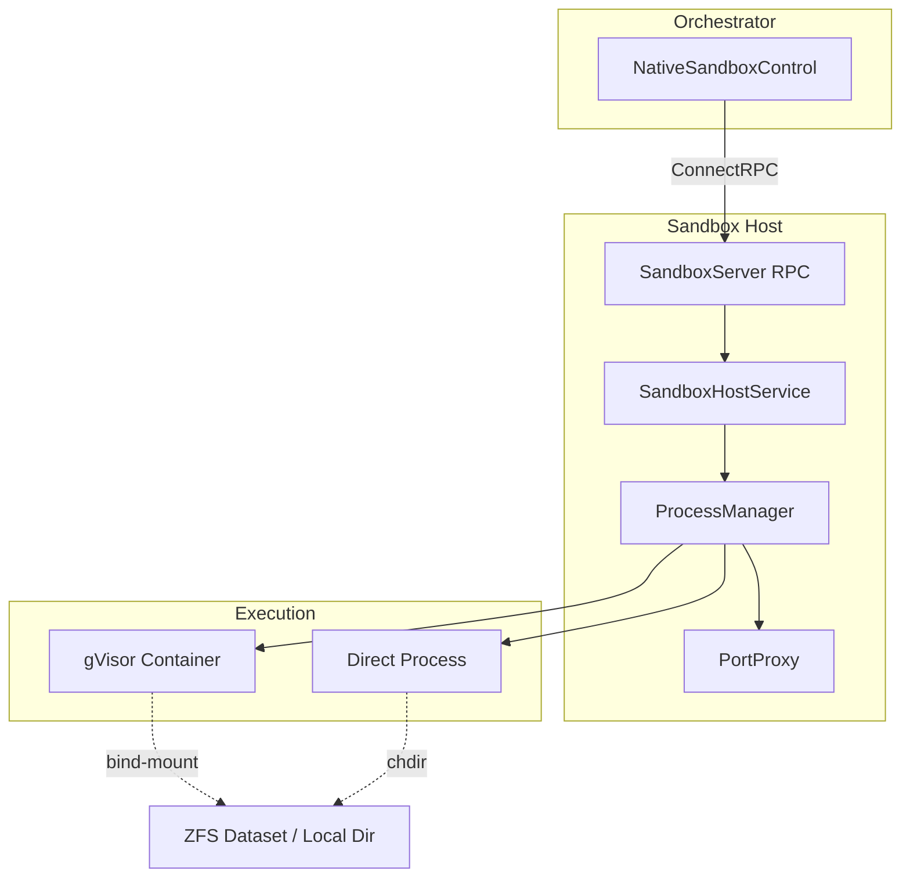
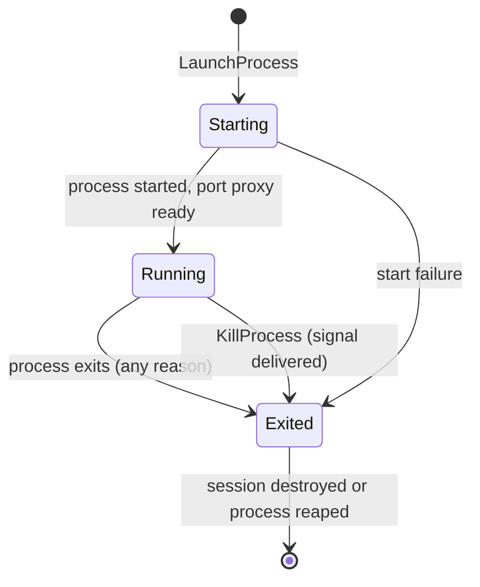
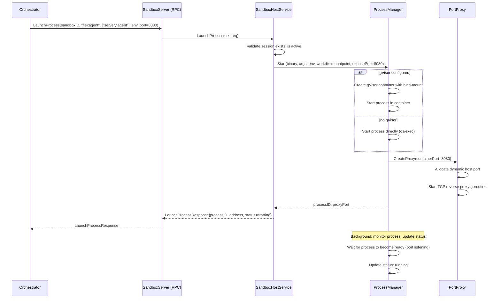

# 11 Addendum 03: Process Management RPCs (LaunchProcess, KillProcess, GetProcessStatus)

**Parent plan:** [11-sandbox-host-service.md](./11-sandbox-host-service.md)
**Depends on:** [11-sandbox-host-service.add01.md](./11-sandbox-host-service.add01.md) (ExecutionEnvironment), [11-sandbox-host-service.add02.md](./11-sandbox-host-service.add02.md) (Configurable backends), [18-agent-loop-rpc.md](./18-agent-loop-rpc.md) (SandboxControl interface, section 6)
**Status:** Draft
**Scope:** Three new RPC endpoints on the sandbox-host service -- `LaunchProcess`, `KillProcess`, `GetProcessStatus` -- enabling the orchestrator to start and manage long-running processes (primarily `flexagent serve agent`) inside existing sandbox sessions. Covers process execution, ZFS dataset bind-mounting, port proxying, PID tracking, and process monitoring.

---

## 1. Overview

The `SandboxControl` interface defined in plan 18 (section 6) includes three process management methods: `LaunchProcess`, `KillProcess`, and `GetProcessStatus`. These methods enable an orchestrator to launch long-running processes inside an already-provisioned sandbox session -- the primary use case being deploying `flexagent serve agent` inside a sandbox so the agent loop runs in an isolated environment with access to the session's filesystem.

This addendum specifies the sandbox-host side of these RPCs: the request/response types added to `internal/rpc/api`, the server-side handler logic in `internal/rpc/server/sandbox_server.go`, the codec mappings in `internal/rpc/codec/sandbox_map.go`, the ConnectRPC procedure registration in `internal/rpc/transport`, and the core process management logic added to `SandboxHostService` in `internal/sandbox`.

**What this addendum covers:**
- New RPC API types for process management
- `SandboxHostService` process lifecycle methods
- Process execution in gVisor containers or directly on the host
- ZFS dataset bind-mounting for launched processes
- TCP reverse proxy for port exposure
- PID tracking and process monitoring
- Integration with existing sandbox-host infrastructure

**What this addendum does NOT cover:**
- The `SandboxControl` interface itself (defined in plan 18, section 6)
- `NativeSandboxControl` client-side implementation (plan 18, section 6.1)
- Cloud provider implementations of process management (plan 18, section 6.2)

---

## 2. Architecture

### 2.1 Component Diagram



### 2.2 Process Lifecycle



### 2.3 Sequence Diagram: Launch Agent in Sandbox



---

## 3. RPC API Types

New types added to `internal/rpc/api/types.go`:

```go
// LaunchProcessRequest starts a long-running process inside a sandbox session.
type LaunchProcessRequest struct {
    SessionID  string            // Target sandbox session (must exist and be active)
    Binary     string            // Path to binary or command name
    Args       []string          // Command-line arguments
    Env        map[string]string // Environment variables (merged with defaults)
    ExposePort int               // Port the process will listen on (0 = no port exposure)
}

// LaunchProcessResponse contains the launched process info.
type LaunchProcessResponse struct {
    ProcessID string        // Unique identifier for this process
    Address   string        // "host:port" for connecting to the process (empty if ExposePort=0)
    Status    ProcessStatus // Initial status (typically "starting")
}

// KillProcessRequest terminates a process launched via LaunchProcess.
type KillProcessRequest struct {
    SessionID string // The sandbox session containing the process
    ProcessID string // The process to kill
    Signal    int    // Unix signal number (0 defaults to SIGTERM)
}

// KillProcessResponse is the response to KillProcess.
type KillProcessResponse struct{}

// GetProcessStatusRequest queries the status of a launched process.
type GetProcessStatusRequest struct {
    SessionID string
    ProcessID string
}

// GetProcessStatusResponse contains the current process status.
type GetProcessStatusResponse struct {
    Status   ProcessStatus // "starting", "running", or "exited"
    ExitCode *int          // Only set when Status == "exited"
}

// ProcessStatus represents the lifecycle state of a launched process.
type ProcessStatus string

const (
    ProcessStatusStarting ProcessStatus = "starting"
    ProcessStatusRunning  ProcessStatus = "running"
    ProcessStatusExited   ProcessStatus = "exited"
)
```

These types mirror the `control.LaunchProcessRequest` / `control.LaunchProcessResponse` types from plan 18 section 6, but live in the RPC API package (`internal/rpc/api`) as transport-level types. The codec layer maps between them.

---

## 4. ConnectRPC Procedures

New procedure constants added to `internal/rpc/transport/procedures.go`:

```go
ProcedureSandboxLaunchProcess     = "/rpc.v1.SandboxService/LaunchProcess"
ProcedureSandboxKillProcess       = "/rpc.v1.SandboxService/KillProcess"
ProcedureSandboxGetProcessStatus  = "/rpc.v1.SandboxService/GetProcessStatus"
```

All three are **unary** RPCs (`connect.NewUnaryHandlerSimple`). Process monitoring is done via polling `GetProcessStatus`, not via a streaming RPC. This keeps the design simple and consistent with the existing sandbox-host RPC pattern where the client polls for status rather than maintaining a long-lived stream.

**Handler registration** follows the existing pattern in `transport.Server.Handler()`:

```go
mux.Handle(ProcedureSandboxLaunchProcess, connect.NewUnaryHandlerSimple(
    ProcedureSandboxLaunchProcess, func(ctx context.Context, req *api.LaunchProcessRequest) (*api.LaunchProcessResponse, error) {
        res, err := s.sandbox.LaunchProcess(ctx, req)
        return res, toConnectError(err)
    }, opts...,
))
mux.Handle(ProcedureSandboxKillProcess, connect.NewUnaryHandlerSimple(
    ProcedureSandboxKillProcess, func(ctx context.Context, req *api.KillProcessRequest) (*api.KillProcessResponse, error) {
        res, err := s.sandbox.KillProcess(ctx, req)
        return res, toConnectError(err)
    }, opts...,
))
mux.Handle(ProcedureSandboxGetProcessStatus, connect.NewUnaryHandlerSimple(
    ProcedureSandboxGetProcessStatus, func(ctx context.Context, req *api.GetProcessStatusRequest) (*api.GetProcessStatusResponse, error) {
        res, err := s.sandbox.GetProcessStatus(ctx, req)
        return res, toConnectError(err)
    }, opts...,
))
```

---

## 5. SandboxService Interface Extension

Three new methods are added to the `api.SandboxService` interface in `internal/rpc/api/types.go`:

```go
type SandboxService interface {
    // ... existing methods ...

    LaunchProcess(ctx context.Context, req *LaunchProcessRequest) (*LaunchProcessResponse, error)
    KillProcess(ctx context.Context, req *KillProcessRequest) (*KillProcessResponse, error)
    GetProcessStatus(ctx context.Context, req *GetProcessStatusRequest) (*GetProcessStatusResponse, error)
}
```

Both the `SandboxServer` (RPC handler) and the `SandboxClient` (RPC client) must implement these new methods.

---

## 6. SandboxHostService Process Management

### 6.1 Process Tracking State

New fields on `SandboxHostService` and `Session`:

```go
// internal/sandbox/types.go -- additions to Session

type Session struct {
    // ... existing fields ...

    // Process management
    processes   sync.Map // map[string]*ManagedProcess
    processSeq  atomic.Uint64
}

// ManagedProcess tracks a launched process within a session.
type ManagedProcess struct {
    mu        sync.RWMutex
    id        string
    pid       int               // OS-level PID (or gVisor container PID)
    binary    string
    args      []string
    status    ProcessState
    exitCode  *int
    cmd       *exec.Cmd         // nil when running in gVisor
    proxy     *portProxy        // nil when ExposePort == 0
    startedAt time.Time
    exitedAt  time.Time
    done      chan struct{}      // closed when process exits
}

type ProcessState string

const (
    ProcessStarting ProcessState = "starting"
    ProcessRunning  ProcessState = "running"
    ProcessExited   ProcessState = "exited"
)
```

**Process ID generation:** Process IDs are generated as `"proc-" + sessionID[:8] + "-" + seq` where `seq` is an incrementing counter from `processSeq`. This produces readable, session-scoped identifiers (e.g., `proc-abc12345-1`).

### 6.2 LaunchProcess Implementation

```go
// internal/sandbox/process.go

func (svc *SandboxHostService) LaunchProcess(ctx context.Context, req LaunchProcessRequest) (*LaunchProcessResponse, error) {
    // 1. Validate request
    if req.SessionID == "" {
        return nil, fmt.Errorf("sandbox: session_id is required")
    }
    if req.Binary == "" {
        return nil, fmt.Errorf("sandbox: binary is required")
    }
    if req.ExposePort < 0 || req.ExposePort > 65535 {
        return nil, fmt.Errorf("sandbox: expose_port %d out of range", req.ExposePort)
    }

    // 2. Look up session
    sess, err := svc.getSession(req.SessionID)
    if err != nil {
        return nil, err
    }
    sess.mu.RLock()
    if sess.state != SessionActive {
        sess.mu.RUnlock()
        return nil, fmt.Errorf("sandbox: session %s is not active (state=%s)", req.SessionID, sess.state)
    }
    mountpoint := sess.mountpoint
    sess.mu.RUnlock()

    // 3. Generate process ID
    seq := sess.processSeq.Add(1)
    processID := fmt.Sprintf("proc-%s-%d", req.SessionID[:min(8, len(req.SessionID))], seq)

    // 4. Start the process
    proc := &ManagedProcess{
        id:        processID,
        binary:    req.Binary,
        args:      req.Args,
        status:    ProcessStarting,
        startedAt: time.Now(),
        done:      make(chan struct{}),
    }

    var startErr error
    if svc.config.ContainerRuntime == ContainerRuntimeGVisor {
        startErr = svc.launchInGVisor(ctx, proc, req, mountpoint)
    } else {
        startErr = svc.launchDirect(ctx, proc, req, mountpoint)
    }
    if startErr != nil {
        return nil, fmt.Errorf("sandbox: launch process: %w", startErr)
    }

    // 5. Set up port proxy if needed
    var address string
    if req.ExposePort > 0 {
        proxy, proxyErr := svc.createPortProxy(proc, req.ExposePort)
        if proxyErr != nil {
            // Kill the process we just started
            svc.killManagedProcess(proc, syscall.SIGKILL)
            return nil, fmt.Errorf("sandbox: setup port proxy: %w", proxyErr)
        }
        proc.proxy = proxy
        address = proxy.address // "host:proxyPort"
    }

    // 6. Store and monitor
    sess.processes.Store(processID, proc)

    // Start background monitor goroutine
    go svc.monitorProcess(sess, proc)

    return &LaunchProcessResponse{
        ProcessID: processID,
        Address:   address,
        Status:    ProcessStarting,
    }, nil
}
```

### 6.3 Direct Process Execution (No gVisor)

When `ContainerRuntime` is `"none"`, the process is started directly on the host using `os/exec`:

```go
func (svc *SandboxHostService) launchDirect(ctx context.Context, proc *ManagedProcess, req LaunchProcessRequest, mountpoint string) error {
    cmd := exec.CommandContext(ctx, req.Binary, req.Args...)
    cmd.Dir = mountpoint
    cmd.Env = buildEnv(req.Env)
    cmd.Stdout = nil // or pipe to log
    cmd.Stderr = nil // or pipe to log

    if err := cmd.Start(); err != nil {
        return fmt.Errorf("start process: %w", err)
    }

    proc.mu.Lock()
    proc.cmd = cmd
    proc.pid = cmd.Process.Pid
    proc.status = ProcessRunning
    proc.mu.Unlock()

    return nil
}

func buildEnv(env map[string]string) []string {
    // Start with a minimal base environment
    result := []string{
        "PATH=/usr/local/bin:/usr/bin:/bin",
        "HOME=/root",
    }
    for k, v := range env {
        result = append(result, k+"="+v)
    }
    return result
}
```

### 6.4 gVisor Process Execution

When `ContainerRuntime` is `"gvisor"`, the process is started inside a gVisor container with the session's filesystem bind-mounted:

```go
func (svc *SandboxHostService) launchInGVisor(ctx context.Context, proc *ManagedProcess, req LaunchProcessRequest, mountpoint string) error {
    containerID := proc.id // reuse process ID as container ID

    spec := gvisor.ContainerSpec{
        ID:      containerID,
        Command: append([]string{req.Binary}, req.Args...),
        Env:     mapToSlice(req.Env),
        Mounts: []gvisor.Mount{
            {
                Source:      mountpoint,
                Destination: "/workspace",
                Type:        "bind",
                ReadOnly:    false,
            },
        },
        WorkingDir: "/workspace",
        Resources:  svc.config.DefaultResources,
    }

    // If the process needs network access (for RPC serving), enable host networking
    if req.ExposePort > 0 {
        spec.Network = gvisor.NetworkHost
    }

    if err := svc.gvisor.CreateContainer(ctx, spec); err != nil {
        return fmt.Errorf("create container: %w", err)
    }

    if err := svc.gvisor.StartContainer(ctx, containerID); err != nil {
        _ = svc.gvisor.DeleteContainer(ctx, containerID)
        return fmt.Errorf("start container: %w", err)
    }

    proc.mu.Lock()
    proc.pid = 0 // gVisor manages the PID internally
    proc.status = ProcessRunning
    proc.mu.Unlock()

    return nil
}
```

**Bind-mount details:**
- The session's mountpoint (ZFS dataset or local-disk directory) is bind-mounted at `/workspace` inside the container.
- The mount is read-write so the agent process can create/modify files.
- The `flexagent serve agent` binary inside the container uses `LocalEnvironment` with root dir `/workspace` -- from its perspective, it is running locally in Mode 1.

**Network mode:**
- When `ExposePort > 0`, the container uses host networking (`gvisor.NetworkHost`) so the process can bind to a port that is reachable from the sandbox-host.
- When `ExposePort == 0`, the container uses the default isolated network. This is appropriate for processes that do not need inbound connections (e.g., background workers).

### 6.5 Port Proxying

The sandbox-host allocates a dynamic port on its own address and proxies TCP connections to the process's exposed port. This means the orchestrator connects to `sandbox-host-addr:proxyPort` rather than needing to reach the container directly.

```go
// internal/sandbox/proxy.go

type portProxy struct {
    address    string        // "host:port" address to advertise to callers
    listener   net.Listener
    targetPort int
    targetHost string       // "127.0.0.1" for direct, or container IP for isolated net
    done       chan struct{}
}

func (svc *SandboxHostService) createPortProxy(proc *ManagedProcess, containerPort int) (*portProxy, error) {
    // Allocate a dynamic port by binding to :0
    listener, err := net.Listen("tcp", ":0")
    if err != nil {
        return nil, fmt.Errorf("allocate proxy port: %w", err)
    }

    _, portStr, _ := net.SplitHostPort(listener.Addr().String())
    proxyPort, _ := strconv.Atoi(portStr)

    // Determine the sandbox-host's own advertise address
    // This is the address the orchestrator will use to reach the proxy
    advertiseHost := svc.advertiseAddress()

    proxy := &portProxy{
        address:    fmt.Sprintf("%s:%d", advertiseHost, proxyPort),
        listener:   listener,
        targetPort: containerPort,
        targetHost: "127.0.0.1", // host networking: process binds on localhost
        done:       make(chan struct{}),
    }

    go proxy.serve()
    return proxy, nil
}

func (p *portProxy) serve() {
    defer close(p.done)
    for {
        conn, err := p.listener.Accept()
        if err != nil {
            return // listener closed
        }
        go p.handleConn(conn)
    }
}

func (p *portProxy) handleConn(clientConn net.Conn) {
    defer clientConn.Close()

    targetAddr := fmt.Sprintf("%s:%d", p.targetHost, p.targetPort)
    targetConn, err := net.DialTimeout("tcp", targetAddr, 5*time.Second)
    if err != nil {
        return
    }
    defer targetConn.Close()

    // Bidirectional copy
    done := make(chan struct{}, 2)
    go func() {
        io.Copy(targetConn, clientConn)
        done <- struct{}{}
    }()
    go func() {
        io.Copy(clientConn, targetConn)
        done <- struct{}{}
    }()
    <-done
}

func (p *portProxy) close() {
    p.listener.Close()
    <-p.done
}
```

**Advertise address:** The sandbox-host determines its own advertise address from its listen configuration. When running on an EC2 instance or other cloud host, this is typically the instance's private IP. A `--advertise-addr` flag on `cmd/sandbox-host` (or `flexagent serve sandbox-host`) configures this. If unset, it defaults to the hostname resolved from `os.Hostname()`.

**Why proxy instead of direct port exposure:** The proxy approach has several advantages:
1. The orchestrator only needs network connectivity to the sandbox-host, not to individual containers.
2. Port allocation is managed centrally by the sandbox-host, avoiding port conflicts.
3. The proxy can be torn down cleanly when the process exits or the session is destroyed.
4. For gVisor containers with isolated networking (future), the proxy bridges the network namespace boundary.

### 6.6 Process Monitoring

A background goroutine monitors each launched process and updates its status:

```go
func (svc *SandboxHostService) monitorProcess(sess *Session, proc *ManagedProcess) {
    defer close(proc.done)

    if svc.config.ContainerRuntime == ContainerRuntimeGVisor {
        svc.monitorGVisorProcess(sess, proc)
    } else {
        svc.monitorDirectProcess(sess, proc)
    }
}

func (svc *SandboxHostService) monitorDirectProcess(sess *Session, proc *ManagedProcess) {
    proc.mu.RLock()
    cmd := proc.cmd
    proc.mu.RUnlock()

    if cmd == nil {
        return
    }

    // Wait for the process to exit
    err := cmd.Wait()

    proc.mu.Lock()
    proc.status = ProcessExited
    proc.exitedAt = time.Now()
    if err != nil {
        var exitErr *exec.ExitError
        if errors.As(err, &exitErr) {
            code := exitErr.ExitCode()
            proc.exitCode = &code
        } else {
            code := -1
            proc.exitCode = &code
        }
    } else {
        code := 0
        proc.exitCode = &code
    }
    proc.mu.Unlock()

    // Close port proxy if any
    if proc.proxy != nil {
        proc.proxy.close()
    }

    svc.logger.Info("process exited",
        "session_id", sess.id,
        "process_id", proc.id,
        "exit_code", proc.exitCode,
        "duration", proc.exitedAt.Sub(proc.startedAt),
    )
}

func (svc *SandboxHostService) monitorGVisorProcess(sess *Session, proc *ManagedProcess) {
    containerID := proc.id

    // Poll container status until it exits
    ticker := time.NewTicker(2 * time.Second)
    defer ticker.Stop()

    for range ticker.C {
        status, err := svc.gvisor.ContainerStatus(context.Background(), containerID)
        if err != nil {
            svc.logger.Warn("failed to check container status",
                "container_id", containerID,
                "error", err,
            )
            continue
        }

        if status.State == gvisor.StateStopped {
            proc.mu.Lock()
            proc.status = ProcessExited
            proc.exitedAt = time.Now()
            proc.exitCode = status.ExitCode
            proc.mu.Unlock()

            if proc.proxy != nil {
                proc.proxy.close()
            }

            // Clean up the container
            _ = svc.gvisor.DeleteContainer(context.Background(), containerID)

            svc.logger.Info("container exited",
                "session_id", sess.id,
                "process_id", proc.id,
                "exit_code", proc.exitCode,
            )
            return
        }
    }
}
```

**Key behaviors:**
- The sandbox remains alive when a process exits. The orchestrator decides whether to destroy the sandbox, launch a new process, or take other recovery action.
- The port proxy is closed when the process exits. Further connection attempts to the proxy port fail immediately, which the orchestrator detects as connection loss.
- For gVisor processes, the container is deleted after the process exits (cleanup). The session's ZFS dataset is unaffected.

### 6.7 KillProcess Implementation

```go
func (svc *SandboxHostService) KillProcess(ctx context.Context, req KillProcessRequest) error {
    if req.SessionID == "" {
        return fmt.Errorf("sandbox: session_id is required")
    }
    if req.ProcessID == "" {
        return fmt.Errorf("sandbox: process_id is required")
    }

    sess, err := svc.getSession(req.SessionID)
    if err != nil {
        return err
    }

    procVal, ok := sess.processes.Load(req.ProcessID)
    if !ok {
        return fmt.Errorf("sandbox: process %s not found in session %s", req.ProcessID, req.SessionID)
    }
    proc := procVal.(*ManagedProcess)

    sig := syscall.Signal(req.Signal)
    if sig == 0 {
        sig = syscall.SIGTERM
    }

    return svc.killManagedProcess(proc, sig)
}

func (svc *SandboxHostService) killManagedProcess(proc *ManagedProcess, sig syscall.Signal) error {
    proc.mu.RLock()
    status := proc.status
    cmd := proc.cmd
    proc.mu.RUnlock()

    if status == ProcessExited {
        return nil // already exited, no-op
    }

    if cmd != nil {
        // Direct process: signal via OS
        if cmd.Process != nil {
            return cmd.Process.Signal(sig)
        }
        return fmt.Errorf("sandbox: process has no OS handle")
    }

    // gVisor process: stop the container
    // gVisor does not support arbitrary signals; use stop for SIGTERM/SIGKILL
    return svc.gvisor.StopContainer(context.Background(), proc.id)
}
```

**Signal semantics:**
- For direct processes, the signal is delivered via `os.Process.Signal()`.
- For gVisor containers, `SIGTERM` and `SIGKILL` both map to `gvisor.StopContainer()`. Arbitrary signal delivery to gVisor containers is not supported in this plan (the gVisor manager does not expose a signal API). If needed in the future, this can be added via `gvisor.SignalContainer()`.
- Killing an already-exited process is a no-op (idempotent).

### 6.8 GetProcessStatus Implementation

```go
func (svc *SandboxHostService) GetProcessStatus(ctx context.Context, req GetProcessStatusRequest) (*GetProcessStatusResponse, error) {
    if req.SessionID == "" {
        return nil, fmt.Errorf("sandbox: session_id is required")
    }
    if req.ProcessID == "" {
        return nil, fmt.Errorf("sandbox: process_id is required")
    }

    sess, err := svc.getSession(req.SessionID)
    if err != nil {
        return nil, err
    }

    procVal, ok := sess.processes.Load(req.ProcessID)
    if !ok {
        return nil, fmt.Errorf("sandbox: process %s not found in session %s", req.ProcessID, req.SessionID)
    }
    proc := procVal.(*ManagedProcess)

    proc.mu.RLock()
    defer proc.mu.RUnlock()

    return &GetProcessStatusResponse{
        Status:   ProcessState(proc.status),
        ExitCode: proc.exitCode,
    }, nil
}
```

---

## 7. SandboxServer (RPC Handler) Changes

Three new methods are added to `SandboxServer` in `internal/rpc/server/sandbox_server.go`, following the same delegation pattern as existing methods:

```go
func (s *SandboxServer) LaunchProcess(ctx context.Context, req *api.LaunchProcessRequest) (*api.LaunchProcessResponse, error) {
    if req == nil {
        return nil, rpc.NewRPCError(rpc.CodeInvalidArgument, "nil request", nil)
    }
    if req.SessionID == "" {
        return nil, rpc.NewRPCError(rpc.CodeInvalidArgument, "session_id is required", nil)
    }
    if req.Binary == "" {
        return nil, rpc.NewRPCError(rpc.CodeInvalidArgument, "binary is required", nil)
    }

    resp, err := s.host.LaunchProcess(ctx, codec.ToLaunchProcessRequest(req))
    if err != nil {
        return nil, rpc.MapError(err)
    }
    return codec.FromLaunchProcessResponse(resp), nil
}

func (s *SandboxServer) KillProcess(ctx context.Context, req *api.KillProcessRequest) (*api.KillProcessResponse, error) {
    if req == nil {
        return nil, rpc.NewRPCError(rpc.CodeInvalidArgument, "nil request", nil)
    }

    err := s.host.KillProcess(ctx, codec.ToKillProcessRequest(req))
    if err != nil {
        return nil, rpc.MapError(err)
    }
    return &api.KillProcessResponse{}, nil
}

func (s *SandboxServer) GetProcessStatus(ctx context.Context, req *api.GetProcessStatusRequest) (*api.GetProcessStatusResponse, error) {
    if req == nil {
        return nil, rpc.NewRPCError(rpc.CodeInvalidArgument, "nil request", nil)
    }

    resp, err := s.host.GetProcessStatus(ctx, codec.ToGetProcessStatusRequest(req))
    if err != nil {
        return nil, rpc.MapError(err)
    }
    return codec.FromGetProcessStatusResponse(resp), nil
}
```

---

## 8. Codec Mappings

New functions in `internal/rpc/codec/sandbox_map.go`:

```go
// LaunchProcess codec
func ToLaunchProcessRequest(req *api.LaunchProcessRequest) sandbox.LaunchProcessRequest {
    if req == nil {
        return sandbox.LaunchProcessRequest{}
    }
    return sandbox.LaunchProcessRequest{
        SessionID:  req.SessionID,
        Binary:     req.Binary,
        Args:       req.Args,
        Env:        req.Env,
        ExposePort: req.ExposePort,
    }
}

func FromLaunchProcessResponse(resp *sandbox.LaunchProcessResponse) *api.LaunchProcessResponse {
    if resp == nil {
        return nil
    }
    return &api.LaunchProcessResponse{
        ProcessID: resp.ProcessID,
        Address:   resp.Address,
        Status:    api.ProcessStatus(resp.Status),
    }
}

// KillProcess codec
func ToKillProcessRequest(req *api.KillProcessRequest) sandbox.KillProcessRequest {
    if req == nil {
        return sandbox.KillProcessRequest{}
    }
    return sandbox.KillProcessRequest{
        SessionID: req.SessionID,
        ProcessID: req.ProcessID,
        Signal:    req.Signal,
    }
}

// GetProcessStatus codec
func ToGetProcessStatusRequest(req *api.GetProcessStatusRequest) sandbox.GetProcessStatusRequest {
    if req == nil {
        return sandbox.GetProcessStatusRequest{}
    }
    return sandbox.GetProcessStatusRequest{
        SessionID: req.SessionID,
        ProcessID: req.ProcessID,
    }
}

func FromGetProcessStatusResponse(resp *sandbox.GetProcessStatusResponse) *api.GetProcessStatusResponse {
    if resp == nil {
        return nil
    }
    return &api.GetProcessStatusResponse{
        Status:   api.ProcessStatus(resp.Status),
        ExitCode: resp.ExitCode,
    }
}
```

---

## 9. Domain-Level Request/Response Types

New types in `internal/sandbox/service.go` (or a new `internal/sandbox/process.go`):

```go
type LaunchProcessRequest struct {
    SessionID  string
    Binary     string
    Args       []string
    Env        map[string]string
    ExposePort int
}

type LaunchProcessResponse struct {
    ProcessID string
    Address   string       // "host:port" or empty
    Status    ProcessState
}

type KillProcessRequest struct {
    SessionID string
    ProcessID string
    Signal    int
}

type GetProcessStatusRequest struct {
    SessionID string
    ProcessID string
}

type GetProcessStatusResponse struct {
    Status   ProcessState
    ExitCode *int
}
```

---

## 10. Session Destroy Cleanup

When a session is destroyed, all launched processes within that session must be terminated and their resources cleaned up. The existing `DestroySession` flow is extended:

```go
func (svc *SandboxHostService) destroySessionProcesses(sess *Session) {
    sess.processes.Range(func(key, value any) bool {
        proc := value.(*ManagedProcess)

        // Kill the process
        svc.killManagedProcess(proc, syscall.SIGKILL)

        // Wait for the monitor goroutine to finish (with timeout)
        select {
        case <-proc.done:
        case <-time.After(5 * time.Second):
            svc.logger.Warn("process cleanup timed out",
                "session_id", sess.id,
                "process_id", proc.id,
            )
        }

        // Close port proxy if still open
        if proc.proxy != nil {
            proc.proxy.close()
        }

        return true
    })
}
```

This is called in `DestroySession` before the ZFS dataset or local-disk directory is removed. The ordering is:

1. Kill all launched processes (SIGKILL)
2. Wait for monitor goroutines to exit
3. Close port proxies
4. Proceed with existing destroy logic (ZFS destroy or `os.RemoveAll`)

### 10.1 Pause/Resume Interaction

When a session is paused:
- Launched processes are **not** automatically paused or killed. The process continues running. This is intentional: pausing affects the tool execution lifecycle (no new tool calls accepted), but launched processes (like `flexagent serve agent`) should continue operating during a session pause since they are serving the orchestrator directly.
- The orchestrator is responsible for coordinating pause semantics with launched processes if needed (e.g., by calling `AgentService.Close()` before pausing the sandbox).

When a session is resumed:
- No action needed on launched processes -- they were never stopped.

**Future consideration:** If gVisor gains container pause/resume support, we may want to freeze containers during session pause. This is deferred.

---

## 11. Error Handling

### 11.1 Error Types and RPC Code Mapping

| Error Condition | Domain Error | ConnectRPC Code |
|----------------|-------------|-----------------|
| Session not found | `ErrSessionNotFound` | `CodeNotFound` |
| Session not active (paused, destroying) | `ErrInvalidState` | `CodeFailedPrecondition` |
| Process not found | `fmt.Errorf("process %s not found")` | `CodeNotFound` |
| Binary not found / exec failure | `fmt.Errorf("launch process: ...")` | `CodeInternal` |
| Port allocation failure | `fmt.Errorf("setup port proxy: ...")` | `CodeInternal` |
| Missing required field | `rpc.NewRPCError(CodeInvalidArgument, ...)` | `CodeInvalidArgument` |

### 11.2 Partial Failure: Process Started but Proxy Failed

If the process starts successfully but port proxy setup fails:
1. The process is immediately killed (SIGKILL).
2. The monitor goroutine detects the exit and cleans up.
3. The error is returned to the caller.
4. The caller can retry `LaunchProcess`.

This ensures no orphaned processes are left running without a way to reach them.

### 11.3 Process Start Failure

If the process fails to start (binary not found, permission denied, gVisor container creation fails):
1. All partially created resources are cleaned up (container deleted if created).
2. The process is NOT stored in the session's process map.
3. An error is returned to the caller.

### 11.4 Race: LaunchProcess During Session Destroy

The session state check (`sess.state != SessionActive`) at the top of `LaunchProcess` guards against launching into a destroying session. There is a TOCTOU window between the state check and the process start, but this is acceptable:
- If `DestroySession` runs concurrently, the process will be killed during destroy cleanup.
- The worst case is a briefly-running process that is immediately killed -- no resource leak.

---

## 12. Integration with cmd/sandbox-host

The `cmd/sandbox-host/main.go` (and future `flexagent serve sandbox-host`) requires a new configuration field:

```go
type Config struct {
    // ... existing fields ...

    // AdvertiseAddr is the address the sandbox-host advertises for port proxies.
    // If empty, defaults to os.Hostname() resolved address.
    // Example: "10.0.1.50" or "sandbox-host.internal"
    AdvertiseAddr string
}
```

The advertise address is passed to `SandboxHostService` via `ServiceConfig`:

```go
type ServiceConfig struct {
    // ... existing fields ...

    // AdvertiseAddr is used in port proxy addresses returned by LaunchProcess.
    AdvertiseAddr string
}
```

If `AdvertiseAddr` is empty, `SandboxHostService` resolves it from `os.Hostname()` at construction time and logs the resolved address.

---

## 13. Connected Components

### 13.1 Modified Seams

| Seam | Change | Impact |
|------|--------|--------|
| `api.SandboxService` interface | 3 new methods: `LaunchProcess`, `KillProcess`, `GetProcessStatus` | All implementations must be updated (`SandboxServer`, `SandboxClient`) |
| `SandboxServer` (RPC handler) | 3 new handler methods | Follows existing delegation pattern |
| `transport.Server.Handler()` | 3 new procedure registrations | Additive; existing procedures unchanged |
| `transport/procedures.go` | 3 new procedure constants | Additive |
| `sandbox.Session` struct | New `processes` and `processSeq` fields | Internal; no external API change |
| `sandbox.ServiceConfig` | New `AdvertiseAddr` field | Additive; zero value triggers hostname resolution |
| `sandbox.DestroySession` | Extended to kill processes before cleanup | Behavior change: destroys launched processes |

### 13.2 New Seams

| Seam | Description |
|------|-------------|
| `sandbox.LaunchProcessRequest` / `LaunchProcessResponse` | Domain-level request/response types for process management |
| `sandbox.ManagedProcess` | Internal process tracking struct |
| `sandbox.portProxy` | TCP reverse proxy for port exposure |
| `codec.ToLaunchProcessRequest` / `FromLaunchProcessResponse` | Codec mappings for process types |

### 13.3 Consumed Seams

| Seam | How Used |
|------|----------|
| `gvisor.GVisorManager` | `CreateContainer`, `StartContainer`, `StopContainer`, `DeleteContainer`, `ContainerStatus` for gVisor-based process execution |
| `sandbox.getSession` | Session lookup for all process RPCs |
| `rpc.MapError` | Error mapping in RPC handler |

### 13.4 Relationship to Plan 18 SandboxControl

The types defined here are the sandbox-host-side (server) counterparts to the `SandboxControl` types defined in plan 18 section 6 (client/orchestrator side):

| Plan 18 (SandboxControl) | This Addendum (SandboxHostService) | Codec Mapping |
|--------------------------|-------------------------------------|---------------|
| `control.LaunchProcessRequest` | `sandbox.LaunchProcessRequest` | `NativeSandboxControl` calls `codec.ToLaunchProcessRequest(apiReq)` -> RPC -> `codec.ToLaunchProcessRequest(apiReq)` |
| `control.LaunchProcessResponse` | `sandbox.LaunchProcessResponse` | Reverse mapping via codec |
| `control.KillProcessRequest` | `sandbox.KillProcessRequest` | Direct field mapping |
| `control.GetProcessStatusResponse` | `sandbox.GetProcessStatusResponse` | `ProcessStatus` string type alignment |

The `NativeSandboxControl` (plan 18 section 6.1) wraps the RPC client to call these endpoints. The `api.*` types serve as the wire-format intermediary between `control.*` types on the client and `sandbox.*` types on the server.

---

## 14. Acceptance Criteria

**AC1 -- LaunchProcess with direct execution (no gVisor):**
Configure `ContainerRuntime: "none"`. Create a session. Call `LaunchProcess` with a simple binary (e.g., a test echo server). Verify the process starts, `GetProcessStatus` returns `"running"`, and the process is reachable at the returned address. Kill the process via `KillProcess`. Verify `GetProcessStatus` returns `"exited"` with exit code.

**AC2 -- LaunchProcess with gVisor:**
Configure `ContainerRuntime: "gvisor"`. Create a session. Call `LaunchProcess`. Verify the process runs inside a gVisor container with the session's filesystem bind-mounted at `/workspace`. Verify the process can read/write files in the session directory. Kill and verify exit status.

**AC3 -- Port proxy lifecycle:**
Launch a process with `ExposePort=8080`. Verify the returned address has a different port (dynamically allocated). Connect to the proxy address and verify TCP traffic reaches the process. Kill the process. Verify the proxy port is closed (connection refused on subsequent attempts).

**AC4 -- Session destroy kills processes:**
Launch a process in a session. Call `DestroySession`. Verify the process is killed, the proxy is closed, and the session directory (or ZFS dataset) is cleaned up. Verify no goroutine leaks.

**AC5 -- Invalid request handling:**
Call `LaunchProcess` with empty `SessionID` -> `CodeInvalidArgument`. Call with nonexistent session -> `CodeNotFound`. Call with empty `Binary` -> `CodeInvalidArgument`. Call `GetProcessStatus` with nonexistent process -> `CodeNotFound`.

**AC6 -- Process exits independently:**
Launch a process that exits on its own after a short delay. Verify `GetProcessStatus` transitions from `"running"` to `"exited"` with the correct exit code. Verify the sandbox session remains active (not destroyed). Verify the port proxy is closed.

**AC7 -- KillProcess is idempotent:**
Kill a process. Call `KillProcess` again on the same process. Verify no error (idempotent).

**AC8 -- Environment variable injection:**
Launch a process with `Env: {"ANTHROPIC_API_KEY": "sk-test"}`. Verify the process can read the environment variable. (This is the primary API key delivery mechanism for sandbox-launched agent loops.)

---

## 15. Testing Strategy

### 15.1 Unit Tests

**Process lifecycle:**
- `LaunchProcess` with direct execution -> process starts, PID tracked, status transitions `starting -> running -> exited`
- `LaunchProcess` with gVisor -> container created with correct bind-mount spec
- `KillProcess` -> signal delivered, status becomes `"exited"`
- `KillProcess` on already-exited process -> no error (idempotent)
- `GetProcessStatus` -> returns current status and exit code
- `GetProcessStatus` on nonexistent process -> error

**Port proxy:**
- Proxy allocates a dynamic port
- TCP connections through proxy reach target
- Proxy closes when process exits
- Proxy closes when `close()` called explicitly

**Session destroy cleanup:**
- `DestroySession` with active processes kills all processes
- `DestroySession` with already-exited processes is a no-op on those
- Port proxies closed during destroy

**Validation:**
- Empty `SessionID`, `Binary`, `ProcessID` -> error
- `ExposePort` out of range -> error
- Session not active (paused) -> error

### 15.2 Integration Tests

**RPC round-trip:**
- `LaunchProcess` via ConnectRPC -> verify response fields
- `GetProcessStatus` via ConnectRPC -> verify status transitions
- `KillProcess` via ConnectRPC -> verify process termination
- Codec round-trip fidelity for all process types

**End-to-end with agent loop:**
- Create session -> `LaunchProcess("flexagent", ["serve", "agent"], ...)` -> connect to returned address via `AgentServiceClient` -> create agent session -> send message -> receive events -> destroy sandbox
- This validates the full orchestrator -> sandbox-host -> agent loop flow

### 15.3 Harness Tests

**Concurrency:**
- Launch N processes in the same session concurrently -> all tracked correctly
- Kill processes concurrently -> no races
- `DestroySession` while `LaunchProcess` is in flight -> no goroutine leaks

**Stress:**
- Launch and kill 100 processes in rapid succession -> all cleaned up, no port leaks

**Property tests:**
- Any valid sequence of `LaunchProcess`, `KillProcess`, `GetProcessStatus`, `DestroySession` leaves no leaked resources (goroutines, file descriptors, ports)

### 15.4 Mock Strategy

For unit tests that do not need real process execution:
- Mock `gvisor.GVisorManager` to verify container creation specs without running gVisor
- Use a simple test binary (compiled from `cmd/testbin/main.go` or similar) that listens on a port and exits on signal, for direct-process tests
- Use `net.Listen` on loopback for port proxy tests without a real target process (just verify proxy setup and teardown)

---

## 16. Implementation Order

1. **Domain types** (`internal/sandbox/process.go`): `LaunchProcessRequest`, `LaunchProcessResponse`, `KillProcessRequest`, `GetProcessStatusRequest`, `GetProcessStatusResponse`, `ManagedProcess`, `ProcessState`, `portProxy`
2. **Port proxy** (`internal/sandbox/proxy.go`): TCP reverse proxy implementation + unit tests
3. **SandboxHostService process methods**: `LaunchProcess`, `KillProcess`, `GetProcessStatus`, `destroySessionProcesses`, `monitorProcess` + unit tests
4. **RPC API types** (`internal/rpc/api/types.go`): New request/response types, `ProcessStatus` constants, `SandboxService` interface extension
5. **Codec mappings** (`internal/rpc/codec/sandbox_map.go`): `To*`/`From*` functions for process types + unit tests
6. **SandboxServer handlers** (`internal/rpc/server/sandbox_server.go`): 3 new handler methods
7. **Procedure constants + handler registration** (`internal/rpc/transport/procedures.go`, `server.go`)
8. **Config extension**: `AdvertiseAddr` in `ServiceConfig` and `cmd/sandbox-host` config
9. **Integration tests**: RPC round-trip tests
10. **End-to-end test**: Full flow with `flexagent serve agent` launched inside sandbox
