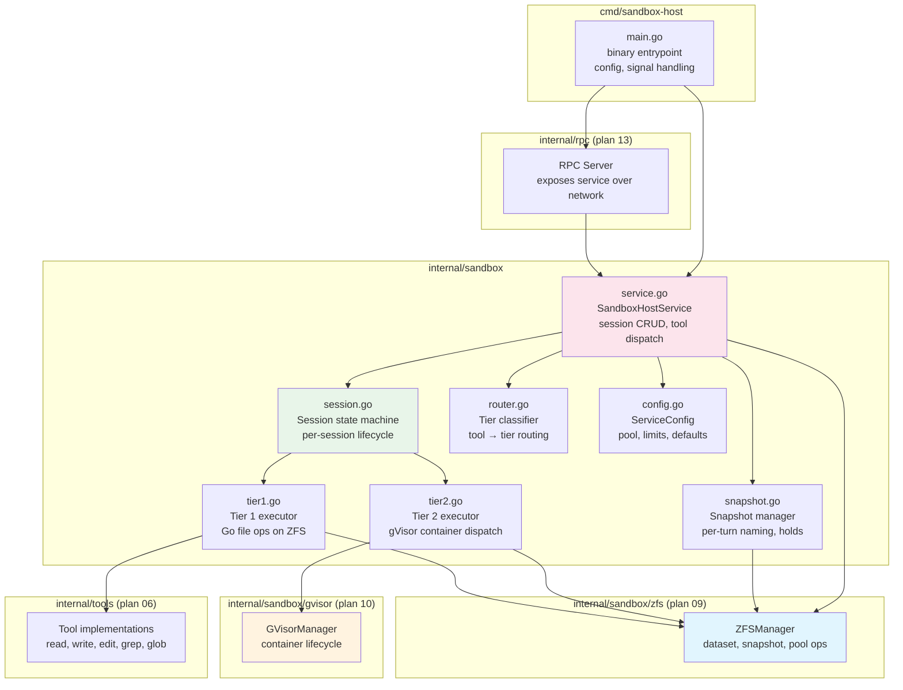
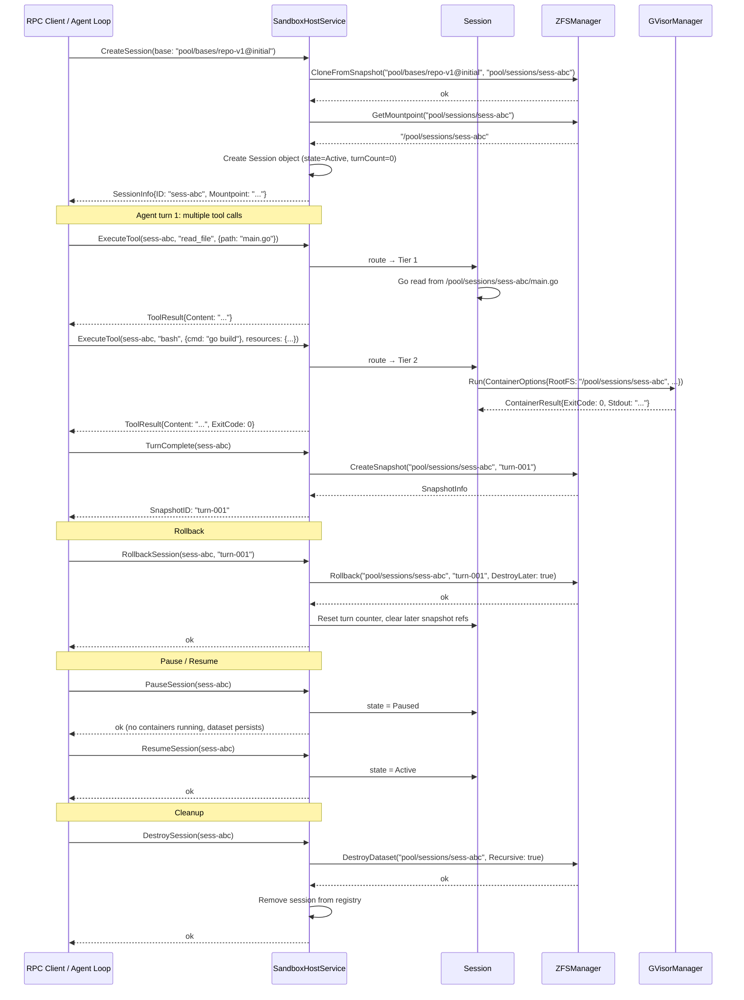
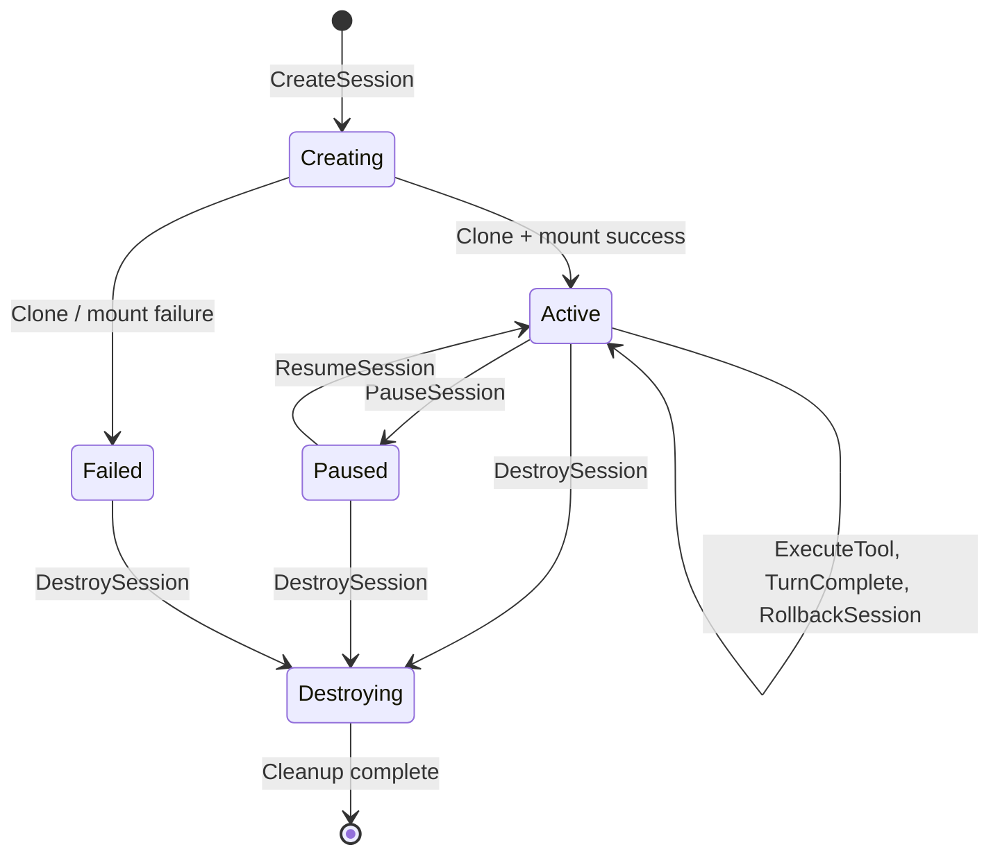

# 11: Sandbox Host Service

**Status:** Draft
**Depends on:** 09-sandbox-zfs, 10-sandbox-gvisor, 06-built-in-tools
**Depended on by:** 13-rpc-layer, 15-mode2-e2e
**Implements:** `internal/sandbox` — sandbox host service coordinating ZFS + gVisor for session management, two-tier tool routing, per-turn snapshots, pause/resume, rollback. `cmd/sandbox-host` binary.

---

## 1. Overview

The sandbox host service is the coordinator that ties ZFS dataset management and gVisor container execution together into a coherent session-based tool execution environment. It runs on EC2 instances (or any Linux host with ZFS) and manages multiple agent sessions concurrently, each with isolated filesystems and snapshot histories.

> **Terminology:** In this plan, "sandbox" refers to the **Tool Call Sandbox** — the ZFS + gVisor infrastructure that provides isolated filesystem and process execution for tool calls. This is distinct from the **Session Sandbox**, which is the container/environment where the agent process itself runs in Mode 2. The package name `internal/sandbox` and type names like `SandboxHostService` refer to the Tool Call Sandbox.

This is the component that makes Modes 2, 3, and 4 possible. It receives tool execution requests, routes them to the appropriate tier (Go functions for file ops, gVisor containers for process execution), manages per-turn snapshots, and supports pause/resume/rollback of entire sessions.

**Scope:**
- `SandboxHostService` — main coordinator struct
- Session lifecycle: create (clone from base), execute tools, snapshot, pause, resume, rollback, destroy
- Two-tier tool routing: Tier 1 (file ops as Go functions on ZFS dataset) and Tier 2 (bash/builds via gVisor)
- Per-turn snapshot management (snapshot when agent goes idle between turns, with per-tool-call opt-in)
- Session state tracking (active, paused, destroying)
- Pool health monitoring and capacity management
- `cmd/sandbox-host` binary with configuration, signal handling, graceful shutdown
- Observability: structured logging, OTEL metrics for session count, tool latency, snapshot latency, pool space

**Out of scope:**
- ZFS internals (plan 09 — used via `ZFSManager` interface)
- gVisor internals (plan 10 — used via `GVisorManager` interface)
- RPC protocol and server/client (plan 13 — uses service via Go interface)
- EBS volume management (infrastructure layer)
- Agent loop, agent state, agent events (plan 05)

---

## 2. Architecture

### 2.1 Component Diagram



### 2.2 Import Flow

```
internal/sandbox/zfs    → stdlib only
internal/sandbox/gvisor → stdlib, OCI spec libs
internal/tools          → internal/ai, stdlib
internal/sandbox        → internal/sandbox/zfs, internal/sandbox/gvisor, internal/tools, internal/ai
internal/rpc            → internal/sandbox (plan 13 imports this)
cmd/sandbox-host        → internal/sandbox, internal/rpc
```

No circular imports. The sandbox package is the integration point that composes ZFS, gVisor, and tools.

### 2.3 Session Lifecycle Sequence



### 2.4 Session State Machine



> **Note:** ZFS rollback (`zfs rollback`) is a synchronous operation that completes
> quickly (typically <100ms), so there is no need for a transient `RollingBack` state.
> Rollback transitions `Active → Active` on success or `Active → Failed` on error.

---

## 3. Core Types

### 3.1 SandboxHostService

```go
// service.go

// SandboxHostService manages agent sessions on a sandbox host.
// It coordinates ZFS dataset management, gVisor container execution,
// and tool dispatch. Safe for concurrent use.
type SandboxHostService struct {
    config     ServiceConfig
    zfs        zfs.ZFSManager
    gvisor     gvisor.GVisorManager
    sessions   sync.Map          // map[string]*Session
    sessionsMu sync.Mutex        // guards capacity-check + store atomicity in CreateSession
    logger     *slog.Logger
    metrics    *serviceMetrics   // OTEL counters/histograms
}

func NewSandboxHostService(cfg ServiceConfig, z zfs.ZFSManager, g gvisor.GVisorManager, logger *slog.Logger) *SandboxHostService

// Session management
func (s *SandboxHostService) CreateSession(ctx context.Context, req CreateSessionRequest) (*SessionInfo, error)
func (s *SandboxHostService) DestroySession(ctx context.Context, sessionID string) error
func (s *SandboxHostService) PauseSession(ctx context.Context, sessionID string) error
func (s *SandboxHostService) ResumeSession(ctx context.Context, sessionID string) error
func (s *SandboxHostService) GetSession(ctx context.Context, sessionID string) (*SessionInfo, error)
func (s *SandboxHostService) ListSessions(ctx context.Context) ([]SessionInfo, error)

// Tool execution
func (s *SandboxHostService) ExecuteTool(ctx context.Context, req ExecuteToolRequest) (*ExecuteToolResponse, error)

// Snapshot management
func (s *SandboxHostService) TurnComplete(ctx context.Context, sessionID string) (*SnapshotResult, error)
func (s *SandboxHostService) CreateSnapshot(ctx context.Context, sessionID string, name string) (*SnapshotResult, error)
func (s *SandboxHostService) RollbackSession(ctx context.Context, sessionID string, snapshotID string) error
func (s *SandboxHostService) ListSnapshots(ctx context.Context, sessionID string) ([]zfs.SnapshotInfo, error)

// Health
func (s *SandboxHostService) HealthCheck(ctx context.Context) (*HealthStatus, error)

// Lifecycle
func (s *SandboxHostService) Shutdown(ctx context.Context) error
```

### 3.2 Request/Response Types

```go
// service.go

type CreateSessionRequest struct {
    BaseSnapshot string            // "pool/bases/repo-v1@initial"
    SessionID    string            // optional — auto-generated if empty
    Quota        int64             // optional dataset quota in bytes
    Labels       map[string]string // arbitrary metadata
}

type SessionInfo struct {
    ID         string
    State      SessionState
    Mountpoint string
    TurnCount  int
    SnapCount  int
    Created    time.Time
    Labels     map[string]string
    SpaceUsed  int64
}

type SessionState string

const (
    SessionCreating   SessionState = "creating"
    SessionActive     SessionState = "active"
    SessionPaused     SessionState = "paused"
    SessionDestroying SessionState = "destroying"
    SessionFailed     SessionState = "failed"
)

type ExecuteToolRequest struct {
    SessionID  string
    ToolName   string
    ToolCallID string
    Params     map[string]any
    Resources  *gvisor.ResourceSpec // optional Tier 2 resource sizing
}

type ExecuteToolResponse struct {
    Content    string   // tool output
    ExitCode   *int     // Tier 2 only
    Duration   time.Duration
    Tier       int      // 1 or 2
}

type SnapshotResult struct {
    SnapshotID string
    TurnNumber int
    SpaceUsed  int64
}

type HealthStatus struct {
    Status      string     // "healthy", "degraded", "unhealthy"
    PoolState   zfs.PoolState
    PoolSpace   zfs.PoolSpace
    SessionCount int
    ActiveTools  int       // currently executing tool calls
    Uptime      time.Duration
    Errors      []string  // recent error summaries
}
```

### 3.3 ServiceConfig

```go
// config.go

type ServiceConfig struct {
    // Pool configuration
    PoolName       string // ZFS pool name (e.g., "tank")
    BasesDataset   string // parent dataset for base snapshots (e.g., "tank/bases")
    SessionsDataset string // parent dataset for sessions (e.g., "tank/sessions")

    // Session limits
    MaxSessions         int   // max concurrent sessions (0 = unlimited)
    DefaultSessionQuota int64 // default per-session quota in bytes (0 = no quota)

    // Snapshot configuration
    SnapshotPrefix     string // prefix for auto-generated snapshot names (default: "turn")
    MaxSnapshotsPerSession int // auto-cleanup old snapshots beyond this count (0 = unlimited)

    // Tool execution
    DefaultResources gvisor.ResourceSpec // default Tier 2 resources if not specified per-call
    ToolTimeout      time.Duration       // max tool execution time (default: 5m)

    // Health monitoring
    PoolSpaceWarnThreshold  float64 // warn when pool is this full (0.0-1.0, default: 0.85)
    PoolSpaceCritThreshold  float64 // critical when pool is this full (default: 0.95)
    HealthCheckInterval     time.Duration // how often to check pool health (default: 30s)

    // Pause / Destroy drain
    PauseDrainTimeout time.Duration // max time to wait for in-flight tools on pause (default: 30s)

    // Graceful shutdown
    ShutdownTimeout time.Duration // max time to wait for in-flight tools (default: 30s)
}

func DefaultServiceConfig() ServiceConfig
```

---

## 4. Session Management

### 4.1 Session Object

```go
// session.go

// Session represents a single agent session with its own ZFS dataset.
type Session struct {
    mu         sync.RWMutex
    id         string
    state      SessionState
    dataset    string         // full ZFS dataset name
    mountpoint string         // filesystem path to dataset
    turnCount  int            // monotonic turn counter
    created    time.Time
    labels     map[string]string
    activeTools atomic.Int32  // currently executing tool count

    // Snapshot tracking — each entry records whether the snapshot was created
    // by TurnComplete (isTurnSnapshot=true) or by an explicit CreateSnapshot call.
    // This distinction is needed so that rollback can compute the correct turnCount
    // by counting only turn-snapshots up to the rollback target.
    snapshots []SnapshotEntry
}

// SnapshotEntry tracks a snapshot and whether it originated from a turn boundary.
type SnapshotEntry struct {
    Name           string
    IsTurnSnapshot bool
}

func (s *Session) Info() SessionInfo
```

### 4.2 CreateSession

```go
// service.go

func (svc *SandboxHostService) CreateSession(ctx context.Context, req CreateSessionRequest) (*SessionInfo, error) {
    // 1. Generate session ID if not provided
    sessionID := req.SessionID
    if sessionID == "" {
        sessionID = generateSessionID()
    }

    // 2. Atomic capacity-check + store under sessionsMu to prevent TOCTOU race.
    //    Without this mutex, two concurrent CreateSession calls could both pass the
    //    capacity check and both store sessions, exceeding MaxSessions.
    svc.sessionsMu.Lock()
    if svc.config.MaxSessions > 0 {
        count := svc.sessionCount()
        if count >= svc.config.MaxSessions {
            svc.sessionsMu.Unlock()
            return nil, ErrMaxSessionsReached
        }
    }
    if _, loaded := svc.sessions.Load(sessionID); loaded {
        svc.sessionsMu.Unlock()
        return nil, fmt.Errorf("%w: %s", ErrSessionExists, sessionID)
    }
    // Reserve the slot with a placeholder to hold our position while we do I/O.
    // This lets us release the mutex before the (slow) ZFS clone operation.
    placeholder := &Session{id: sessionID, state: SessionCreating}
    svc.sessions.Store(sessionID, placeholder)
    svc.sessionsMu.Unlock()

    // 3. Clone from base snapshot
    dataset := svc.config.SessionsDataset + "/" + sessionID
    if err := svc.zfs.CloneFromSnapshot(ctx, req.BaseSnapshot, dataset); err != nil {
        svc.sessions.Delete(sessionID) // release the placeholder
        return nil, fmt.Errorf("clone base snapshot: %w", err)
    }

    // 4. Set quota if configured (use SetProperty — dataset already exists from clone)
    quota := req.Quota
    if quota == 0 {
        quota = svc.config.DefaultSessionQuota
    }
    if quota > 0 {
        if err := svc.zfs.SetProperty(ctx, dataset, "quota", formatBytes(quota)); err != nil {
            svc.zfs.DestroyDataset(ctx, dataset, zfs.DestroyOptions{Recursive: true, Force: true})
            svc.sessions.Delete(sessionID)
            return nil, fmt.Errorf("set quota: %w", err)
        }
    }

    // 5. Get mountpoint
    mountpoint, err := svc.zfs.GetMountpoint(ctx, dataset)
    if err != nil {
        // Cleanup on failure
        svc.zfs.DestroyDataset(ctx, dataset, zfs.DestroyOptions{Recursive: true, Force: true})
        svc.sessions.Delete(sessionID)
        return nil, fmt.Errorf("get mountpoint: %w", err)
    }

    // 6. Create session object (replaces the placeholder)
    sess := &Session{
        id:         sessionID,
        state:      SessionActive,
        dataset:    dataset,
        mountpoint: mountpoint,
        created:    time.Now(),
        labels:     req.Labels,
    }
    svc.sessions.Store(sessionID, sess)

    svc.metrics.sessionsCreated.Add(ctx, 1)
    svc.logger.InfoContext(ctx, "session created",
        "session_id", sessionID,
        "base", req.BaseSnapshot,
        "mountpoint", mountpoint,
    )

    info := sess.Info()
    return &info, nil
}
```

### 4.3 PauseSession / ResumeSession

Pause marks a session as paused — no tool calls are accepted. The ZFS dataset remains mounted (no compute cost, just disk). Resume marks it active again.

```go
// service.go

func (svc *SandboxHostService) PauseSession(ctx context.Context, sessionID string) error {
    sess, err := svc.getActiveSession(sessionID)
    if err != nil {
        return err
    }

    sess.mu.Lock()
    if sess.state != SessionActive {
        sess.mu.Unlock()
        return fmt.Errorf("%w: session is %s, not active", ErrInvalidState, sess.state)
    }
    sess.mu.Unlock()

    // Wait for in-flight tools to complete with a configurable timeout.
    // This matches the pattern used in Shutdown and DestroySession. Callers
    // expect pause to gracefully wait rather than immediately rejecting.
    drainTimeout := svc.config.PauseDrainTimeout
    if drainTimeout == 0 {
        drainTimeout = 30 * time.Second
    }
    deadline := time.After(drainTimeout)
    for sess.activeTools.Load() > 0 {
        select {
        case <-deadline:
            return fmt.Errorf("%w: timed out waiting for %d in-flight tools",
                ErrToolsInFlight, sess.activeTools.Load())
        case <-time.After(50 * time.Millisecond):
            continue
        }
    }

    sess.mu.Lock()
    defer sess.mu.Unlock()
    // Re-check state after waiting — another operation may have changed it.
    if sess.state != SessionActive {
        return fmt.Errorf("%w: session is %s, not active", ErrInvalidState, sess.state)
    }
    sess.state = SessionPaused
    svc.metrics.sessionsPaused.Add(ctx, 1)
    return nil
}

func (svc *SandboxHostService) ResumeSession(ctx context.Context, sessionID string) error {
    sess, err := svc.getSession(sessionID)
    if err != nil {
        return err
    }

    sess.mu.Lock()
    defer sess.mu.Unlock()

    if sess.state != SessionPaused {
        return fmt.Errorf("%w: session is %s, not paused", ErrInvalidState, sess.state)
    }

    sess.state = SessionActive
    svc.metrics.sessionsResumed.Add(ctx, 1)
    return nil
}
```

### 4.4 DestroySession

```go
// service.go

func (svc *SandboxHostService) DestroySession(ctx context.Context, sessionID string) error {
    sess, err := svc.getSession(sessionID)
    if err != nil {
        return err
    }

    sess.mu.Lock()
    sess.state = SessionDestroying
    sess.mu.Unlock()

    // Wait for in-flight tools to drain before destroying the dataset.
    // Destroying while tools are reading/writing could cause panics or corruption.
    // Uses the same wait-with-timeout pattern as Shutdown.
    drainTimeout := svc.config.ShutdownTimeout
    if drainTimeout == 0 {
        drainTimeout = 30 * time.Second
    }
    deadline := time.After(drainTimeout)
    for sess.activeTools.Load() > 0 {
        select {
        case <-deadline:
            svc.logger.WarnContext(ctx, "destroy drain timeout — proceeding with active tools",
                "session_id", sessionID, "active_tools", sess.activeTools.Load())
            goto destroy
        case <-time.After(50 * time.Millisecond):
            continue
        }
    }

destroy:
    // Destroy ZFS dataset (recursive — includes all snapshots)
    if err := svc.zfs.DestroyDataset(ctx, sess.dataset, zfs.DestroyOptions{
        Recursive: true,
        Force:     true,
    }); err != nil {
        svc.logger.ErrorContext(ctx, "failed to destroy dataset",
            "session_id", sessionID, "error", err)
        // Continue — remove from registry even if ZFS cleanup fails
        // (orphaned datasets can be cleaned up by a background sweep)
    }

    svc.sessions.Delete(sessionID)
    svc.metrics.sessionsDestroyed.Add(ctx, 1)
    return nil
}
```

---

## 5. Two-Tier Tool Routing

### 5.1 Tier Classifier

```go
// router.go

// Tier classifies a tool into Tier 1 (Go function) or Tier 2 (gVisor container).
type Tier int

const (
    Tier1 Tier = 1 // file ops — Go functions on ZFS dataset
    Tier2 Tier = 2 // process execution — gVisor container
)

// ClassifyTool returns the execution tier for a tool.
// This is the single source of truth for tier routing.
func ClassifyTool(toolName string) Tier {
    switch toolName {
    case "read_file", "write_file", "edit_file", "grep", "glob",
         "git_status", "git_diff", "git_log", "git_show":
        return Tier1
    case "bash", "git_push", "git_clone", "git_fetch", "git_pull",
         "git_add", "git_commit":
        return Tier2
    default:
        // Unknown tools default to Tier 2 (safer — container isolation)
        return Tier2
    }
}
```

### 5.2 ExecuteTool

```go
// service.go

func (svc *SandboxHostService) ExecuteTool(ctx context.Context, req ExecuteToolRequest) (*ExecuteToolResponse, error) {
    sess, err := svc.getActiveSession(req.SessionID)
    if err != nil {
        return nil, err
    }

    // Track in-flight tool
    sess.activeTools.Add(1)
    defer sess.activeTools.Add(-1)

    // Apply timeout
    timeout := svc.config.ToolTimeout
    if timeout > 0 {
        var cancel context.CancelFunc
        ctx, cancel = context.WithTimeout(ctx, timeout)
        defer cancel()
    }

    tier := ClassifyTool(req.ToolName)
    start := time.Now()

    var resp *ExecuteToolResponse
    switch tier {
    case Tier1:
        resp, err = svc.executeTier1(ctx, sess, req)
    case Tier2:
        resp, err = svc.executeTier2(ctx, sess, req)
    }

    duration := time.Since(start)
    if resp != nil {
        resp.Duration = duration
        resp.Tier = int(tier)
    }

    svc.metrics.toolExecutions.Add(ctx, 1,
        attribute.String("tool", req.ToolName),
        attribute.Int("tier", int(tier)),
    )
    svc.metrics.toolLatency.Record(ctx, duration.Seconds(),
        attribute.String("tool", req.ToolName),
        attribute.Int("tier", int(tier)),
    )

    return resp, err
}
```

### 5.3 Tier 1 Executor

Tier 1 tools run as Go functions directly on the ZFS dataset. They use the tool implementations from `internal/tools` but with the session's mountpoint as the workspace root.

```go
// tier1.go

func (svc *SandboxHostService) executeTier1(ctx context.Context, sess *Session, req ExecuteToolRequest) (*ExecuteToolResponse, error) {
    sess.mu.RLock()
    mountpoint := sess.mountpoint
    sess.mu.RUnlock()

    // Defense-in-depth: validate that any path parameter stays within the
    // session mountpoint. This is the isolation boundary — the service must
    // enforce containment regardless of individual tool implementation quality.
    if err := validatePathParams(mountpoint, req.Params); err != nil {
        return nil, fmt.Errorf("tier1 %s: path validation: %w", req.ToolName, err)
    }

    // Execute tool using the built-in tool implementation
    result, err := svc.executeToolFunc(ctx, req.ToolName, mountpoint, req.Params)
    if err != nil {
        return nil, fmt.Errorf("tier1 %s: %w", req.ToolName, err)
    }

    return &ExecuteToolResponse{
        Content: result,
    }, nil
}

// validatePathParams checks all path-like parameters to ensure they resolve
// within the given root directory. Rejects any path that escapes via "../".
func validatePathParams(rootDir string, params map[string]any) error {
    for key, val := range params {
        if key != "path" && key != "file_path" && key != "directory" {
            continue
        }
        p, ok := val.(string)
        if !ok {
            continue
        }
        if err := validatePath(rootDir, p); err != nil {
            return err
        }
    }
    return nil
}

// validatePath resolves a requested path against the root directory and rejects
// any result that escapes the root. Uses filepath.Rel to detect traversal.
func validatePath(rootDir, requested string) error {
    // Resolve to absolute path within rootDir
    abs := requested
    if !filepath.IsAbs(requested) {
        abs = filepath.Join(rootDir, requested)
    }
    abs = filepath.Clean(abs)

    rel, err := filepath.Rel(rootDir, abs)
    if err != nil {
        return fmt.Errorf("path escape: cannot compute relative path: %w", err)
    }
    if strings.HasPrefix(rel, "..") {
        return fmt.Errorf("path escape: %q resolves outside session root", requested)
    }
    return nil
}

// executeToolFunc dispatches to the appropriate Go function for file operations.
func (svc *SandboxHostService) executeToolFunc(ctx context.Context, toolName, rootDir string, params map[string]any) (string, error) {
    switch toolName {
    case "read_file":
        return executeReadFile(ctx, rootDir, params)
    case "write_file":
        return executeWriteFile(ctx, rootDir, params)
    case "edit_file":
        return executeEditFile(ctx, rootDir, params)
    case "grep":
        return executeGrep(ctx, rootDir, params)
    case "glob":
        return executeGlob(ctx, rootDir, params)
    case "git_status", "git_diff", "git_log", "git_show":
        return executeGitReadOnly(ctx, rootDir, toolName, params)
    default:
        return "", fmt.Errorf("unknown Tier 1 tool: %s", toolName)
    }
}
```

### 5.4 Tier 2 Executor

Tier 2 tools run in gVisor containers with the ZFS dataset bind-mounted as the rootfs.

```go
// tier2.go

func (svc *SandboxHostService) executeTier2(ctx context.Context, sess *Session, req ExecuteToolRequest) (*ExecuteToolResponse, error) {
    sess.mu.RLock()
    mountpoint := sess.mountpoint
    sess.mu.RUnlock()

    // Build container options
    resources := svc.config.DefaultResources
    if req.Resources != nil {
        resources = *req.Resources
    }

    cmd, env, err := buildTier2Command(req.ToolName, req.Params)
    if err != nil {
        return nil, fmt.Errorf("tier2 %s: %w", req.ToolName, err)
    }

    opts := gvisor.ContainerOptions{
        Command:   cmd,
        WorkDir:   "/workspace", // standardized working directory in container
        Env:       env,
        RootFS:    mountpoint,
        Resources: resources,
    }

    // Execute in gVisor container
    result, err := svc.gvisor.Run(ctx, opts)
    if err != nil {
        return nil, fmt.Errorf("tier2 %s: %w", req.ToolName, err)
    }

    // Build response
    content := formatTier2Output(result)
    exitCode := result.ExitCode

    return &ExecuteToolResponse{
        Content:  content,
        ExitCode: &exitCode,
    }, nil
}

// buildTier2Command constructs the shell command for Tier 2 execution.
// Returns an error for unknown tools rather than constructing a shell command
// with untrusted input (which would risk shell injection via toolName).
func buildTier2Command(toolName string, params map[string]any) ([]string, map[string]string, error) {
    switch toolName {
    case "bash":
        cmd := params["cmd"].(string)
        return []string{"/bin/bash", "-c", cmd}, nil, nil
    case "git_push", "git_clone", "git_fetch", "git_pull":
        c, e := buildGitCommand(toolName, params)
        return c, e, nil
    case "git_add":
        c, e := buildGitAddCommand(params)
        return c, e, nil
    case "git_commit":
        c, e := buildGitCommitCommand(params)
        return c, e, nil
    default:
        return nil, nil, fmt.Errorf("unknown Tier 2 tool: %s", toolName)
    }
}
```

---

## 6. Snapshot Management

### 6.1 Per-Turn Snapshots

The primary snapshot granularity is per-turn: the agent loop (or RPC client) calls `TurnComplete()` after each agent turn to trigger a snapshot. This captures the filesystem state at every meaningful boundary between turns.

```go
// snapshot.go

func (svc *SandboxHostService) TurnComplete(ctx context.Context, sessionID string) (*SnapshotResult, error) {
    sess, err := svc.getActiveSession(sessionID)
    if err != nil {
        return nil, err
    }

    // Compute the snapshot name using the *prospective* turn number, but do NOT
    // increment turnCount yet. Only increment after the snapshot succeeds. This
    // prevents turnCount and actual snapshot count from diverging on failure.
    sess.mu.RLock()
    prospectiveTurn := sess.turnCount + 1
    snapName := fmt.Sprintf("%s-%04d", svc.config.SnapshotPrefix, prospectiveTurn)
    sess.mu.RUnlock()

    snapshotStart := time.Now()
    info, err := svc.zfs.CreateSnapshot(ctx, sess.dataset, snapName)
    if err != nil {
        return nil, fmt.Errorf("snapshot turn %d: %w", prospectiveTurn, err)
    }
    snapshotDuration := time.Since(snapshotStart)

    // Snapshot succeeded — now commit the state change.
    sess.mu.Lock()
    sess.turnCount = prospectiveTurn
    sess.snapshots = append(sess.snapshots, SnapshotEntry{Name: snapName, IsTurnSnapshot: true})
    sess.mu.Unlock()

    // Auto-cleanup old snapshots if limit is set
    if svc.config.MaxSnapshotsPerSession > 0 {
        svc.cleanupOldSnapshots(ctx, sess)
    }

    svc.metrics.snapshotsTaken.Add(ctx, 1)
    svc.metrics.snapshotLatency.Record(ctx, snapshotDuration.Seconds())
    svc.metrics.snapshotSpaceUsed.Record(ctx, float64(info.Used))

    return &SnapshotResult{
        SnapshotID: snapName,
        TurnNumber: prospectiveTurn,
        SpaceUsed:  info.Used,
    }, nil
}
```

### 6.2 Explicit Snapshots

For debugging or per-tool-call snapshots (opt-in), callers can create named snapshots:

```go
// snapshot.go

func (svc *SandboxHostService) CreateSnapshot(ctx context.Context, sessionID string, name string) (*SnapshotResult, error) {
    sess, err := svc.getActiveSession(sessionID)
    if err != nil {
        return nil, err
    }

    info, err := svc.zfs.CreateSnapshot(ctx, sess.dataset, name)
    if err != nil {
        return nil, fmt.Errorf("snapshot %s: %w", name, err)
    }

    sess.mu.Lock()
    sess.snapshots = append(sess.snapshots, SnapshotEntry{Name: name, IsTurnSnapshot: false})
    sess.mu.Unlock()

    return &SnapshotResult{
        SnapshotID: name,
        SpaceUsed:  info.Used,
    }, nil
}
```

### 6.3 Rollback

```go
// snapshot.go

func (svc *SandboxHostService) RollbackSession(ctx context.Context, sessionID string, snapshotID string) error {
    sess, err := svc.getActiveSession(sessionID)
    if err != nil {
        return err
    }

    // Ensure no tools are in-flight
    if sess.activeTools.Load() > 0 {
        return ErrToolsInFlight
    }

    // Rollback with -r (destroy later snapshots)
    if err := svc.zfs.Rollback(ctx, sess.dataset, snapshotID, zfs.RollbackOptions{
        DestroyLater: true,
    }); err != nil {
        return fmt.Errorf("rollback to %s: %w", snapshotID, err)
    }

    // Update session state — remove snapshots after the target and recompute
    // turnCount by counting only turn-snapshots up to and including the target.
    // This is correct even when explicit (non-turn) snapshots are interleaved.
    sess.mu.Lock()
    targetIdx := -1
    for i, s := range sess.snapshots {
        if s.Name == snapshotID {
            targetIdx = i
            break
        }
    }
    if targetIdx >= 0 {
        sess.snapshots = sess.snapshots[:targetIdx+1]
        turnCount := 0
        for _, s := range sess.snapshots {
            if s.IsTurnSnapshot {
                turnCount++
            }
        }
        sess.turnCount = turnCount
    }
    sess.mu.Unlock()

    svc.metrics.rollbacks.Add(ctx, 1)
    return nil
}
```

### 6.4 Old Snapshot Cleanup

When `MaxSnapshotsPerSession` is set, excess old snapshots are pruned (oldest first), keeping the configured maximum. Held snapshots are not destroyed.

```go
// snapshot.go

func (svc *SandboxHostService) cleanupOldSnapshots(ctx context.Context, sess *Session) {
    maxSnaps := svc.config.MaxSnapshotsPerSession

    // Perform the entire check-and-remove under a single lock hold to prevent
    // a concurrent TurnComplete from modifying the snapshots slice between the
    // check and the truncation (which could cause incorrect removal or index
    // out of bounds).
    sess.mu.Lock()
    snapCount := len(sess.snapshots)
    if maxSnaps <= 0 || snapCount <= maxSnaps {
        sess.mu.Unlock()
        return
    }

    toRemove := snapCount - maxSnaps
    removeEntries := make([]SnapshotEntry, toRemove)
    copy(removeEntries, sess.snapshots[:toRemove])
    sess.snapshots = sess.snapshots[toRemove:]
    sess.mu.Unlock()

    // Destroy snapshots outside the lock (ZFS operations may be slow).
    for _, entry := range removeEntries {
        if err := svc.zfs.DestroySnapshot(ctx, sess.dataset, entry.Name); err != nil {
            // Log but don't fail — held snapshots will return ErrSnapshotHeld
            svc.logger.WarnContext(ctx, "cleanup snapshot failed",
                "session_id", sess.id, "snapshot", entry.Name, "error", err)
        }
    }
}
```

---

## 7. Health Monitoring

### 7.1 HealthCheck

```go
// service.go

func (svc *SandboxHostService) HealthCheck(ctx context.Context) (*HealthStatus, error) {
    poolStatus, err := svc.zfs.PoolStatus(ctx, svc.config.PoolName)
    if err != nil {
        return &HealthStatus{Status: "unhealthy", Errors: []string{err.Error()}}, nil
    }

    poolSpace, err := svc.zfs.PoolSpace(ctx, svc.config.PoolName)
    if err != nil {
        return &HealthStatus{Status: "unhealthy", Errors: []string{err.Error()}}, nil
    }

    status := "healthy"
    var errors []string

    if poolStatus.State != zfs.PoolOnline {
        status = "degraded"
        errors = append(errors, fmt.Sprintf("pool state: %s", poolStatus.State))
    }

    if poolSpace.Capacity >= svc.config.PoolSpaceCritThreshold {
        status = "unhealthy"
        errors = append(errors, fmt.Sprintf("pool %.0f%% full (critical)", poolSpace.Capacity*100))
    } else if poolSpace.Capacity >= svc.config.PoolSpaceWarnThreshold {
        if status == "healthy" {
            status = "degraded"
        }
        errors = append(errors, fmt.Sprintf("pool %.0f%% full (warning)", poolSpace.Capacity*100))
    }

    return &HealthStatus{
        Status:       status,
        PoolState:    poolStatus.State,
        PoolSpace:    *poolSpace,
        SessionCount: svc.sessionCount(),
        Uptime:       time.Since(svc.startTime),
        Errors:       errors,
    }, nil
}
```

### 7.2 Background Health Monitor

A background goroutine periodically checks pool health and logs warnings.

```go
// service.go

func (svc *SandboxHostService) startHealthMonitor(ctx context.Context) {
    ticker := time.NewTicker(svc.config.HealthCheckInterval)
    defer ticker.Stop()

    for {
        select {
        case <-ctx.Done():
            return
        case <-ticker.C:
            health, err := svc.HealthCheck(ctx)
            if err != nil {
                svc.logger.ErrorContext(ctx, "health check failed", "error", err)
                continue
            }
            if health.Status != "healthy" {
                svc.logger.WarnContext(ctx, "pool health",
                    "status", health.Status,
                    "errors", health.Errors,
                    "capacity", health.PoolSpace.Capacity,
                )
            }
            svc.metrics.poolCapacity.Record(ctx, health.PoolSpace.Capacity)
            svc.metrics.sessionGauge.Record(ctx, int64(health.SessionCount))
        }
    }
}
```

---

## 8. Graceful Shutdown

```go
// service.go

func (svc *SandboxHostService) Shutdown(ctx context.Context) error {
    svc.logger.InfoContext(ctx, "shutting down sandbox host service")

    // 1. Stop accepting new sessions
    svc.shuttingDown.Store(true)

    // 2. Wait for in-flight tools to complete (with timeout)
    deadline := time.After(svc.config.ShutdownTimeout)
    for {
        activeTools := svc.totalActiveTools()
        if activeTools == 0 {
            break
        }
        select {
        case <-deadline:
            svc.logger.WarnContext(ctx, "shutdown timeout — killing in-flight tools",
                "active_tools", activeTools)
            goto cleanup
        case <-time.After(100 * time.Millisecond):
            continue
        }
    }

cleanup:
    // 3. Pause all active sessions (data preserved)
    svc.sessions.Range(func(key, value any) bool {
        sess := value.(*Session)
        sess.mu.Lock()
        if sess.state == SessionActive {
            sess.state = SessionPaused
        }
        sess.mu.Unlock()
        return true
    })

    svc.logger.InfoContext(ctx, "shutdown complete",
        "sessions_paused", svc.sessionCount())
    return nil
}
```

---

## 9. cmd/sandbox-host Binary

### 9.1 Structure

```go
// cmd/sandbox-host/main.go

func main() {
    cfg := loadConfig()   // from flags, env vars, config file
    logger := setupLogger(cfg.LogLevel)

    // Initialize managers
    zfsMgr, err := zfs.NewCLIManager(
        zfs.WithPool(cfg.PoolName),
        zfs.WithSudo(cfg.UseSudo),
        zfs.WithLogger(logger),
    )
    exitOnError(err, "init ZFS manager")

    gvisorMgr, err := gvisor.NewManager(gvisor.ManagerConfig{
        RunscPath: cfg.RunscPath,
        Logger:    logger,
    })
    exitOnError(err, "init gVisor manager")

    // Create service
    svc := sandbox.NewSandboxHostService(cfg.ServiceConfig, zfsMgr, gvisorMgr, logger)

    // Start RPC server (plan 13)
    server := rpc.NewSandboxServer(svc, cfg.ListenAddr)

    // Signal handling
    ctx, stop := signal.NotifyContext(context.Background(), syscall.SIGINT, syscall.SIGTERM)
    defer stop()

    // Start health monitor
    go svc.StartHealthMonitor(ctx)

    // Serve
    go server.Serve()
    logger.Info("sandbox host ready", "addr", cfg.ListenAddr)

    <-ctx.Done()
    logger.Info("shutting down...")

    shutdownCtx, cancel := context.WithTimeout(context.Background(), cfg.ServiceConfig.ShutdownTimeout)
    defer cancel()
    server.Shutdown(shutdownCtx)
    svc.Shutdown(shutdownCtx)
}
```

### 9.2 Configuration

The binary accepts configuration from:
1. Command-line flags (highest priority)
2. Environment variables (`SANDBOX_POOL_NAME`, `SANDBOX_LISTEN_ADDR`, etc.)
3. Config file (YAML/TOML, lowest priority)

Key config parameters:
- `--pool-name` / `SANDBOX_POOL_NAME`: ZFS pool name
- `--listen-addr` / `SANDBOX_LISTEN_ADDR`: RPC listen address (default `:8080`)
- `--runsc-path` / `SANDBOX_RUNSC_PATH`: path to runsc binary
- `--max-sessions` / `SANDBOX_MAX_SESSIONS`: max concurrent sessions
- `--use-sudo` / `SANDBOX_USE_SUDO`: whether to use sudo for ZFS commands
- `--log-level`: structured log level (default: info)

---

## 10. Error Types

```go
// errors.go

var (
    ErrSessionNotFound    = errors.New("sandbox: session not found")
    ErrSessionExists      = errors.New("sandbox: session already exists")
    ErrInvalidState       = errors.New("sandbox: invalid session state for operation")
    ErrToolsInFlight      = errors.New("sandbox: tools are still executing")
    ErrMaxSessionsReached = errors.New("sandbox: maximum session count reached")
    ErrShuttingDown       = errors.New("sandbox: service is shutting down")
    ErrSessionPaused      = errors.New("sandbox: session is paused")
)
```

---

## 11. Connected Components (Seams)

### 11.1 ZFSManager (plan 09)

Used for all dataset and snapshot operations. The service depends on the `zfs.ZFSManager` interface — swappable with `zfs.MockManager` for testing.

**Interface:** `zfs.ZFSManager` (see plan 09 Section 3.1)

### 11.2 GVisorManager (plan 10)

Used for all Tier 2 tool execution. The service depends on the `gvisor.GVisorManager` interface — swappable with a mock for testing.

**Interface:** `gvisor.GVisorManager.Run(ctx, ContainerOptions) → (*ContainerResult, error)`

### 11.3 Built-in Tools (plan 06)

Tier 1 executor uses tool implementations from `internal/tools`. The service imports the file operation functions directly (not via `ToolBackend` — it IS the backend).

**Interface:** Individual tool functions (e.g., `tools.ReadFile(ctx, rootDir, params)`)

### 11.4 RPC Layer (plan 13)

The RPC server wraps `SandboxHostService` and exposes it over the network. The service itself has no RPC awareness.

**Interface:** `SandboxHostService` struct methods (Go interface, not network protocol)

### 11.5 Agent Loop / RuntimeController

In Mode 3, the agent loop calls `SandboxBackend.ExecuteTool()` which goes through RPC to this service. In Mode 2, the agent runs inside the Session Sandbox (the container/environment where the agent process runs) and uses `LocalBackend` instead — the service is not involved in tool routing (only in session lifecycle via the RuntimeController).

---

## 12. Acceptance Criteria

### AC1: Session From Base Snapshot to Tool Execution

**Steps:**
1. Pre-create a base snapshot with a Go project
2. Call `CreateSession(base: "pool/bases/go-project@v1")`
3. Call `ExecuteTool(session, "read_file", {path: "go.mod"})`
4. Call `ExecuteTool(session, "bash", {cmd: "go build ./..."})`

**Expected:** Session created in <200ms. `read_file` returns file contents (Tier 1, microseconds). `bash` runs in gVisor container (Tier 2, ~200ms boot + build time) and returns exit code 0.

### AC2: Per-Turn Snapshot and Rollback

**Steps:**
1. Create session, write "hello.txt" with "v1"
2. `TurnComplete()` → snapshot "turn-0001"
3. Write "hello.txt" with "v2"
4. `TurnComplete()` → snapshot "turn-0002"
5. `RollbackSession(session, "turn-0001")`
6. `ExecuteTool(session, "read_file", {path: "hello.txt"})`

**Expected:** After rollback, file contains "v1". Snapshot "turn-0002" is destroyed.

### AC3: Pause/Resume Preserves State

**Steps:**
1. Create session, write files, take snapshots
2. `PauseSession(session)`
3. Verify `ExecuteTool` returns `ErrSessionPaused`
4. `ResumeSession(session)`
5. Read back files

**Expected:** Files are intact after resume. Snapshots are intact. Session continues normally.

### AC4: Concurrent Sessions Isolation

**Steps:**
1. Create 5 sessions from the same base snapshot
2. In each session, run different bash commands simultaneously
3. Read session-specific files

**Expected:** No cross-contamination. Each session sees only its own filesystem changes. All Tier 2 tool calls complete independently.

### AC5: Pool Space Monitoring and Capacity

**Steps:**
1. Start service with health monitoring enabled
2. Create sessions until pool is 85% full
3. Check health status

**Expected:** Health transitions to "degraded" at warning threshold. `CreateSession` still works. At critical threshold, health is "unhealthy" and appropriate metrics are emitted.

### AC6: Graceful Shutdown Under Load

**Steps:**
1. Start 3 sessions with long-running bash commands
2. Send SIGTERM to sandbox-host process
3. Observe behavior

**Expected:** Service stops accepting new sessions immediately. Waits for in-flight tools (up to shutdown timeout). Pauses all sessions (preserving data). Exits cleanly.

---

## 13. Testing Strategy

### 13.1 Unit Tests (no ZFS/gVisor required)

- **Tier classifier**: verify tool → tier mapping for all known tools and unknown tools
- **Session state machine**: test all valid transitions, verify invalid transitions are rejected
- **Snapshot naming**: verify `turn-NNNN` format, monotonic numbering
- **Config defaults**: verify `DefaultServiceConfig()` produces valid config
- **Error wrapping**: verify all errors wrap appropriate sentinels

Uses `zfs.MockManager` and a mock `GVisorManager` for testing.

### 13.2 Component Tests (mocked ZFS + gVisor)

- **Full session lifecycle**: create → execute tools → snapshot → rollback → pause → resume → destroy
- **Concurrent sessions**: 10 sessions with concurrent tool execution
- **Capacity limits**: MaxSessions enforcement, session quota
- **Health check**: mock pool in various states (online, degraded, full)
- **Graceful shutdown**: verify in-flight tool handling

### 13.3 Integration Tests (requires Linux + ZFS + gVisor)

Build-tag gated (`//go:build integration && linux`):
- **Real ZFS + gVisor**: full session lifecycle with real filesystem operations
- **Snapshot verification**: verify file content at snapshot points
- **Rollback verification**: verify filesystem state after rollback
- **Container execution**: verify bash commands run correctly in gVisor

---

## 14. URP (Unreasonably Robust Programming)

### 14.1 Session Recovery on Restart

On service startup, scan `pool/sessions/*` for existing datasets. Reconstruct session objects from dataset metadata (name, mountpoint, snapshot list). Mark recovered sessions as paused. This allows the service to survive restarts without losing session data.

### 14.2 Orphaned Resource Cleanup

Background goroutine periodically scans for:
- Datasets without corresponding sessions (orphaned from crashes)
- Stale containers that should have been destroyed (via `gvisor.CleanupStale()`)
- ZFS datasets exceeding their age limit (configurable session TTL)

### 14.3 Tool Execution Audit Log

Every tool execution is logged as a structured event with: session ID, tool name, tier, duration, exit code, snapshot ID. This provides a complete audit trail for debugging and compliance.

### 14.4 Dataset Integrity Verification

Optionally verify dataset integrity after rollback by computing a checksum of key files and comparing against the snapshot's expected state. Catches ZFS bugs or disk corruption.

---

## 15. Extreme Optimization

### 15.1 Tier 1 Zero-Copy File Reads

For `read_file`, use `mmap` for large files to avoid copying file content through kernel buffers twice. For files <64KB (the common case), direct `os.ReadFile` is faster due to mmap setup overhead.

### 15.2 Connection-Aware Container Scheduling

When multiple Tier 2 tool calls arrive for the same session in quick succession, batch them into a single container (keeping the container alive for a short grace period). This eliminates redundant container boot overhead for rapid tool call sequences. Grace period defaults to 0 (pure per-call lifecycle) and is opt-in.

### 15.3 Snapshot Deduplication Monitoring

Track the `used` property of snapshots to identify when sessions are creating excessive unique data (e.g., repeatedly generating large build artifacts). Surface this as a metric so the RuntimeController can take action (increase quota, warn, or kill the session).

---

## 16. Alien Artifacts

### 16.1 Predictive Resource Sizing

Track per-tool resource usage (CPU time, peak memory, duration) across sessions. Build a lightweight online model that predicts resource needs for new tool calls based on: tool name, command signature (for bash), project type (from base snapshot labels). Use predictions to set tighter cgroup limits, reducing resource waste.

### 16.2 Snapshot Space Forecasting

Using the space growth rate observed across snapshots, forecast when the pool will be full. Emit early warnings and suggest cleanup actions (destroy old sessions, compact snapshots) before capacity issues occur.

---

## 17. Package Structure

```
internal/sandbox/
├── service.go          # SandboxHostService struct, session CRUD, ExecuteTool
├── session.go          # Session struct, state machine, activeTools tracking
├── tier1.go            # Tier 1 executor — file ops as Go functions
├── tier2.go            # Tier 2 executor — gVisor container dispatch
├── router.go           # ClassifyTool — tier routing logic
├── snapshot.go         # TurnComplete, CreateSnapshot, RollbackSession, cleanup
├── health.go           # HealthCheck, background health monitor
├── config.go           # ServiceConfig, DefaultServiceConfig
├── errors.go           # Error types and sentinels
├── metrics.go          # OTEL metrics definitions
│
├── zfs/                # ZFS management (plan 09)
│   └── ...
├── gvisor/             # gVisor management (plan 10)
│   └── ...
│
├── service_test.go     # Unit tests with mocked ZFS + gVisor
├── session_test.go     # Session state machine unit tests
├── router_test.go      # Tier classifier tests
└── integration_test.go # Integration tests (//go:build integration && linux)

cmd/sandbox-host/
├── main.go             # Binary entrypoint
└── config.go           # Config loading (flags, env, file)
```

---

## 18. Open Questions

### OQ1: Session Persistence Across Restarts

Should session metadata be persisted to disk (e.g., JSON file per session in the pool) so the service can fully recover sessions on restart? Or is scanning ZFS datasets sufficient?

**Recommendation:** Scan ZFS datasets on startup (datasets + snapshots give us the full state). Store minimal metadata (labels, creation time) as ZFS user properties on the dataset, avoiding a separate persistence layer.

### OQ2: Per-Tool-Call Snapshots

The architecture doc says per-turn is the default with per-tool-call available as opt-in. Should the opt-in be a session-level setting or a per-call flag?

**Recommendation:** Per-call flag on `ExecuteToolRequest`. The caller (agent loop / RPC client) knows when it wants a snapshot. Add an optional `Snapshot bool` field to `ExecuteToolRequest`.

### OQ3: Session TTL

Should sessions have a configurable time-to-live after which they are automatically destroyed? This prevents resource leaks from crashed agents that never clean up.

**Recommendation:** Yes. Add `SessionTTL` to `ServiceConfig` (default: 24h). The background health monitor checks session ages and destroys expired sessions.

---

## Round 1 Review Disposition

**Review:** [11-sandbox-host-service-review-reviewer-sea.md](./11-sandbox-host-service-review-reviewer-sea.md)
**Incorporated by:** coder-2-sea
**Date:** 2026-03-12

| # | Reviewer | Severity | Summary | Disposition | Notes |
|---|----------|----------|---------|-------------|-------|
| 1 | reviewer-sea | P1 | Atomic session-capacity check/store race | Incorporated | Added `sessionsMu` to guard capacity check + store atomically. |
| 2 | reviewer-sea | P1 | `turnCount` incremented before snapshot success | Incorporated | Moved turn counter commit to post-success path. |
| 3 | reviewer-sea | P2 | Turn-count recompute ignored explicit snapshots | Incorporated | Added `SnapshotEntry` metadata with `IsTurnSnapshot` and recompute by counting turn snapshots only. |
| 4 | reviewer-sea | P2 | Rollback state machine introduced async `RollingBack` state | Incorporated | Removed `RollingBack`; rollback remains synchronous in the canonical state model. |
| 5 | reviewer-sea | P2 | Destroy race with in-flight tools | Incorporated | Added drain-with-timeout for in-flight tools before teardown. |
| 6 | reviewer-sea | P3 | Pause completion/wait semantics underspecified | Incorporated | Added wait-with-timeout behavior in `PauseSession`. |
| 7 | reviewer-sea | P2 | Tier1 path validation missing/underspecified | Incorporated | Added `validatePath` helper and containment checks in Tier1 executor. |
| 8 | reviewer-sea | P3 | Quota update example used wrong helper and masked errors | Incorporated | Updated to explicit `SetProperty` call with surfaced errors. |
| 9 | reviewer-sea | P3 | Session remove path locking not atomic | Incorporated | Unified to single lock-hold check-and-remove sequence. |
| 10 | reviewer-sea | P3 | Unknown Tier2 tool fallback risked shell execution | Incorporated | Default case now returns typed error for unknown tool. |
| 11 | reviewer-sea | P2 | State-machine tests lacked shadow-model verification | Incorporated | Added explicit shadow state-machine check in test harness. |

## Round 2 Review Disposition

**Review:** [11-sandbox-host-service-review-coder-1-sea.md](./11-sandbox-host-service-review-coder-1-sea.md)
**Incorporated by:** coder-1-sea
**Date:** 2026-03-12

| # | Reviewer | Severity | Summary | Disposition | Notes |
|---|----------|----------|---------|-------------|-------|
| 1 | coder-1-sea | P1 | `TurnComplete` returned undefined `turnNum` symbol | Incorporated | Return value now uses committed `prospectiveTurn` consistently. |
| 2 | coder-1-sea | P2 | Snapshot latency metric recorded bytes-used value | Incorporated | Added explicit timing around `CreateSnapshot`; `snapshotLatency` and `snapshotSpaceUsed` are recorded separately. |
