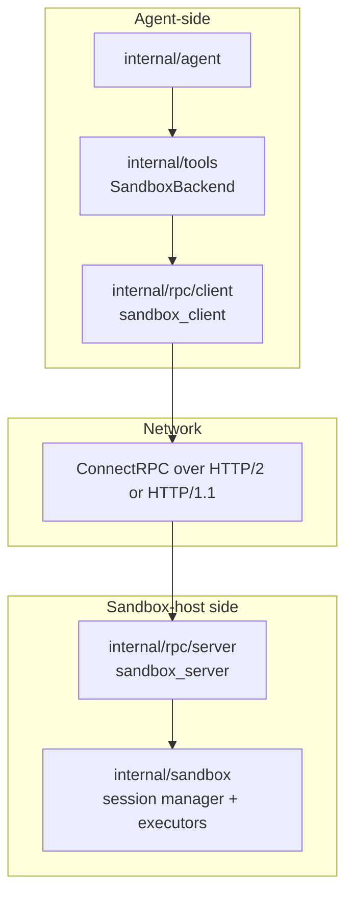
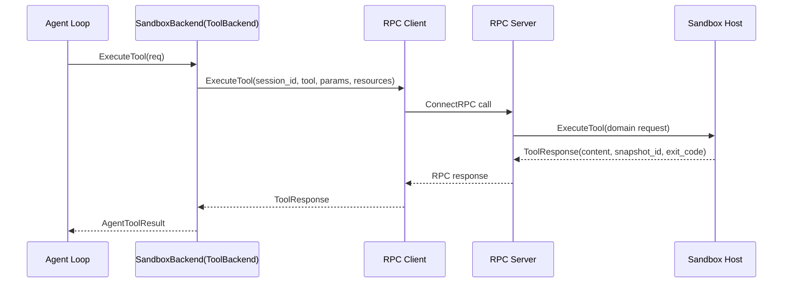
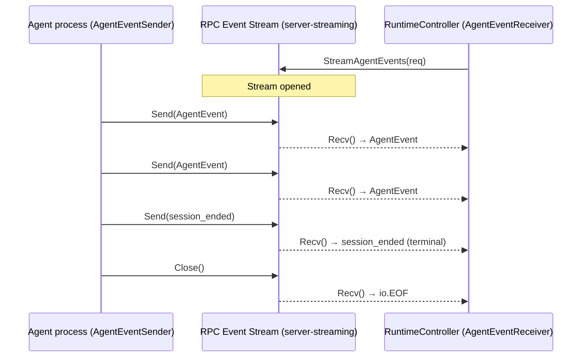

# 13: RPC Layer for Sandbox Backend and Agent Events

**Status:** Approved
**Depends on:** 11-sandbox-host-service, 05-agent
**Depended on by:** 14-mode3-e2e
**Implements:** `internal/rpc` protocol, client/server adapters, SandboxBackend transport, and agent-event streaming over RPC.

---

## 1. Overview

This plan defines the runtime RPC layer used in Mode 3 and Mode 4 to connect agent loops to remote sandbox hosts.

Primary goals:
- Implement typed RPC contracts for sandbox session CRUD, tool dispatch, snapshot control, and lifecycle.
- Implement `SandboxBackend` as a `ToolBackend` adapter over RPC.
- Provide event-stream transport for real-time `AgentEvent` delivery over RPC.
- Standardize error mapping, retry classification, and observability across RPC boundaries.

Non-goals:
- External/3rd-party tool protocol integration via MCP (separate concern).
- Sandbox host internal orchestration logic (plan 11).

---

## 2. Key Decisions

1. **Protocol choice:** Use ConnectRPC for sandbox backend RPC.
2. **MCP boundary:** MCP is only for external/3rd-party tool integration; not used for sandbox backend dispatch.
3. **Interface seam:** `SandboxBackend` implements `internal/tools.ToolBackend`, so agent loop remains backend-agnostic.
4. **Streaming:** Define RPC event streaming for real-time agent event transport in distributed modes.

---

## 3. Architecture

### 3.1 Component Diagram



### 3.2 Tool Dispatch Flow (Mode 3)



### 3.3 Agent Event Streaming Flow (Unidirectional: Agent → RuntimeController)



---

## 4. RPC Service Contracts

### 4.1 Sandbox Service API

```go
type SandboxService interface {
    CreateSession(ctx context.Context, req *CreateSessionRequest) (*CreateSessionResponse, error)
    GetSession(ctx context.Context, req *GetSessionRequest) (*GetSessionResponse, error)
    PauseSession(ctx context.Context, req *PauseSessionRequest) (*PauseSessionResponse, error)
    ResumeSession(ctx context.Context, req *ResumeSessionRequest) (*ResumeSessionResponse, error)
    DestroySession(ctx context.Context, req *DestroySessionRequest) (*DestroySessionResponse, error)

    // ExecuteTool dispatches a tool call. The request includes a ToolCallID for
    // traceability, and the server echoes it back in the response for unambiguous
    // correlation (critical under retries or concurrent calls).
    ExecuteTool(ctx context.Context, req *ExecuteToolRequest) (*ExecuteToolResponse, error)

    ListSnapshots(ctx context.Context, req *ListSnapshotsRequest) (*ListSnapshotsResponse, error)
    RollbackSession(ctx context.Context, req *RollbackSessionRequest) (*RollbackSessionResponse, error)
}
```

### 4.2 Event Stream API

The agent event stream is **unidirectional (server-streaming)**: the agent process produces events, and the RuntimeController consumes them. The interface is split into distinct sender and receiver types to enforce this directionality at the type level.

```go
type AgentEventService interface {
    // StreamAgentEvents opens a server-streaming RPC. The server (agent-side)
    // writes events via AgentEventSender; the client (RuntimeController-side)
    // reads events via AgentEventReceiver.
    StreamAgentEvents(ctx context.Context, req *StreamAgentEventsRequest) (AgentEventReceiver, error)
}

// AgentEventSender is the producer-side handle (agent process).
type AgentEventSender interface {
    Send(*AgentEventEnvelope) error
    Close() error
}

// AgentEventReceiver is the consumer-side handle (RuntimeController).
type AgentEventReceiver interface {
    Recv() (*AgentEventEnvelope, error)
    Close() error
}
```

#### 4.2.1 Terminal Event Semantics

The event stream has well-defined lifecycle behavior tied to session state changes:

| Session State Change | Stream Behavior |
|---------------------|-----------------|
| **Session start** | Stream begins after a `session_started` lifecycle event and remains open while the session is active. |
| **Session pause** | Stream sends `state_change(paused)` and then closes gracefully. Consumer receives the terminal state event followed by `io.EOF`. |
| **Session destroy** | Stream sends `session_ended` (reason: destroyed), then closes gracefully. Consumer receives the terminal event followed by `io.EOF`. |
| **Agent run completion** | Stream sends `session_ended` (reason: completed) and then closes gracefully. Consumer receives the terminal event followed by `io.EOF`. |
| **Session crash / connection loss** | Stream closes abnormally. Consumer receives an RPC error with code `unavailable` (network loss) or `internal` (process crash). No terminal event is sent. |

Consumers must distinguish between graceful closure (terminal event followed by `io.EOF`) and abnormal closure (RPC error without terminal event). On abnormal closure, the consumer should treat the session state as unknown and query session status via `GetSession` before attempting reconnection.

### 4.3 Message Mapping

- Transport DTOs mirror domain request/response fields with explicit versioning.
- `session_id` always uses runtime session ID, never driver-native ID.
- `tool_call_id` is present in both `ExecuteToolRequest` and `ExecuteToolResponse`. The server echoes back the caller's `tool_call_id` in the response to enable unambiguous request-response correlation, which is critical for correctness under retries and concurrent tool calls.
- `ToolResponse.snapshot_id` propagated unchanged to agent/RuntimeController consumers.

#### 4.3.1 Versioning Strategy

The RPC layer uses **protobuf evolution rules** for schema compatibility:
- All field changes are **additive-only**: new fields are appended, existing fields are never removed or renumbered.
- No breaking changes to existing message shapes.

For **compatibility signaling**, a `x-api-version` header is attached to every RPC call via a ConnectRPC interceptor (client-side outgoing, server-side incoming). The header value is a monotonically increasing integer (e.g., `1`, `2`, `3`) that indicates the highest API version the caller supports.

**Version mismatch behavior:**
- If the server receives a request with a higher `x-api-version` than it supports, it processes the request using its own version (graceful degradation — unknown fields are ignored per protobuf rules).
- If the server receives a request with a _lower_ `x-api-version` than the minimum it supports, it rejects the request with a typed error: code `failed_precondition`, detail `"unsupported API version: got N, minimum M"`.
- The server includes its own `x-api-version` in response headers so clients can detect version skew.

---

## 5. Package Structure

```text
internal/rpc/
├── api/
│   ├── sandbox.proto / connect schema
│   ├── events.proto / connect schema
│   └── version.go
├── client/
│   ├── sandbox_client.go      # domain-facing client adapter
│   └── event_client.go        # stream consumer helpers
├── server/
│   ├── sandbox_server.go      # wraps internal/sandbox service
│   └── event_server.go        # stream producer adapter
├── codec/
│   ├── sandbox_map.go         # domain <-> transport mapping
│   └── event_map.go
├── errors.go                  # canonical RPC error mapping
├── retry.go                   # transient/non-transient classification
└── observability.go           # tracing, metrics, correlation IDs
```

---

## 6. SandboxBackend Design

`internal/tools` integration path:

```go
type SandboxBackend struct {
    client    SandboxClient
    sessionID string
}

func (b *SandboxBackend) ExecuteTool(ctx context.Context, req ToolRequest, onProgress func(ToolProgress)) (*ToolResponse, error) {
    rpcReq := &ExecuteToolRequest{
        SessionID:  b.sessionID,
        ToolCallID: req.ToolCallID, // propagate for traceability
        ToolName:   req.ToolName,
        Params:     req.Params,
        Resources:  req.Resources,
    }
    // Use server-streaming RPC to receive incremental progress for Tier 2 tools.
    // Each streamed message is either a progress chunk or the final response.
    stream, err := b.client.ExecuteToolStream(ctx, rpcReq)
    if err != nil {
        return nil, wrapRPCError(err, b.sessionID, req.ToolName)
    }
    var rpcResp *ExecuteToolResponse
    for {
        msg, err := stream.Receive()
        if err != nil {
            return nil, wrapRPCError(err, b.sessionID, req.ToolName)
        }
        if msg.Progress != nil && onProgress != nil {
            onProgress(ToolProgress{
                Content: msg.Progress.Content,
                IsError: msg.Progress.IsError,
            })
            continue
        }
        if msg.Response != nil {
            rpcResp = msg.Response
            break
        }
    }
    // Server echoes ToolCallID — verify it matches for safety
    if rpcResp.ToolCallID != req.ToolCallID {
        return nil, fmt.Errorf("tool_call_id mismatch: sent %q, received %q", req.ToolCallID, rpcResp.ToolCallID)
    }
    return mapToToolResponse(rpcResp), nil
}
```

Rules:
- Request `SessionID` in `ToolRequest` must match backend-bound session unless explicitly overridden for tests.
- `ToolCallID` is propagated in both request and response for end-to-end traceability across agent → RPC → sandbox boundaries. The server echoes the caller's `ToolCallID` in the response.
- Wrap RPC errors with context fields (`session_id`, `tool_name`, `host`).

### 6.1 SandboxBackend Lifecycle

The `SandboxBackend` instance lifecycle is tied to the session it wraps:

1. **Creation:** A `SandboxBackend` is created _after_ `CreateSession` succeeds, using the `sessionID` returned by the server. The caller (typically the RuntimeController or agent loop setup code) constructs it and passes it to the agent loop as the `ToolBackend`.

2. **Usage:** During a session, `SandboxBackend` makes **independent RPC calls per tool invocation** — it does not hold a persistent streaming connection. Each `ExecuteTool` call is a standalone unary RPC. This simplifies connection management and avoids stale-connection issues.

3. **Pause/Resume:** When a session is paused, the existing `SandboxBackend` is discarded. On resume (`ResumeSession`), a **new** `SandboxBackend` is created with the same `sessionID`. This ensures no stale connection state carries over from before the pause.

4. **Destruction:** When `DestroySession` is called, the `SandboxBackend` is discarded. No cleanup RPC is needed from the backend itself — the `DestroySession` call handles server-side cleanup.

---

## 7. Error Model and Retries

### 7.1 Canonical Error Classes

- `invalid_argument`
- `not_found`
- `permission_denied`
- `resource_exhausted`
- `deadline_exceeded`
- `unavailable`
- `internal`

### 7.2 Retry Policy

Retryable by default:
- `unavailable`, transient transport resets, selected `deadline_exceeded`.

Non-retryable:
- `invalid_argument`, `not_found`, `permission_denied`.

Retries are bounded with exponential backoff + jitter.

#### 7.2.1 Idempotency Specification

Safe retries require idempotency guarantees. The following table classifies each RPC method:

| Method | Idempotency | Mechanism |
|--------|-------------|-----------|
| `CreateSession` | State-guarded | Returns `already_exists` if the session ID is already in use. Callers must not retry blindly — check for `already_exists` and treat it as success if the existing session matches the requested configuration. |
| `GetSession` | Naturally idempotent | Read-only. |
| `PauseSession` | State-guarded | Returns `failed_precondition` if the session is not in `Active` state (e.g., already paused, destroyed). Callers should check session state before retrying. A retry after a transient RPC failure is safe only if the session may still be `Active`. |
| `ResumeSession` | State-guarded | Returns `failed_precondition` if the session is not in `Paused` state (e.g., already active, destroyed). Same retry guidance as `PauseSession`. |
| `DestroySession` | Naturally idempotent | Destroying an already-destroyed session returns `not_found` (non-retryable). |
| `ListSnapshots` | Naturally idempotent | Read-only. |
| `RollbackSession` | Naturally idempotent | Rolling back to the same snapshot_id is a no-op if already at that state. |
| **`ExecuteTool`** | **Requires explicit key** | Uses `tool_call_id` as the idempotency key. The server deduplicates `ExecuteTool` calls with the same `tool_call_id` within a configurable window (default: 5 minutes). If a duplicate is detected, the server returns the cached response without re-executing the tool. This prevents dangerous double-execution of side-effecting tools (e.g., running the same bash command twice). |

The server maintains an in-memory idempotency cache keyed by `(session_id, tool_call_id)` with TTL-based expiry. Cache entries store the response (or error) from the first execution.

---

## 8. Observability

- Propagate trace context through ConnectRPC interceptors.
- Metrics:
  - RPC latency by method/status
  - payload sizes
  - stream reconnect counts
  - retry counts and outcomes
- Structured logs include `session_id`, `tool_call_id`, `method`, `peer`.

---

## 9. Connected Components (Seams)

| Component | Seam | Contract |
|-----------|------|----------|
| `internal/agent` | Event stream + tool dispatch | canonical `AgentEvent` envelope + `ToolBackend` dispatch path |
| `internal/tools` | SandboxBackend adapter | `ToolBackend.ExecuteTool(ToolRequest) -> ToolResponse` |
| `internal/sandbox` | RPC server backend | session CRUD + tool execution + snapshot operations |
| RuntimeController | Remote telemetry/control | event stream consumption (via `AgentEventReceiver`) and session lifecycle calls |
| External tools ecosystem | Protocol boundary | MCP explicitly excluded from sandbox backend path |

---

## 10. Acceptance Criteria

1. **Session lifecycle over RPC**
- Steps: create, pause, resume, destroy session via RPC client.
- Expected: consistent state transitions and typed errors on invalid transitions.

2. **Remote tool dispatch via SandboxBackend**
- Steps: agent calls tool through SandboxBackend in Mode 3.
- Expected: tool result mirrors host execution output and includes snapshot metadata when provided.

3. **Snapshot operations over RPC**
- Steps: list snapshots and rollback session via RPC.
- Expected: rollback succeeds and subsequent tool calls observe rolled-back state.

4. **Event streaming delivery**
- Steps: stream agent events to remote consumer during active run.
- Expected: ordered delivery per stream, reconnect behavior documented/tested.

5. **Error classification and retry behavior**
- Steps: inject transient and permanent RPC failures.
- Expected: transient failures retried within limits, permanent failures surfaced immediately.

6. **MCP boundary enforcement**
- Steps: inspect and test RPC layer interfaces.
- Expected: no MCP dependency in sandbox backend dispatch path.

---

## 11. Testing Strategy

### 11.1 Unit Tests

- DTO mapping (domain <-> transport).
- Error mapping and retry classifier.
- SandboxBackend request/response translation.

### 11.2 Component Tests

- In-memory ConnectRPC server/client roundtrips per method.
- Event streaming with controlled producer/consumer pacing.
- Interceptor behavior for trace/context propagation.

### 11.3 Integration Tests

- RPC server wired to sandbox host implementation (or architecture-compatible fake if plan 11 not yet implemented).
- Mode-3 style agent + sandbox dispatch smoke path.

---

## 12. URP (Unreasonably Robust Programming)

1. **Protocol compatibility matrix:** run cross-version client/server compatibility tests on every change.
2. **Record/replay RPC harness:** capture real traffic and replay against new builds for regression detection.
3. **Formal idempotency checks:** verify retry behavior never duplicates side effects on non-idempotent endpoints.

---

## 13. Extreme Optimization

1. Zero-copy marshaling paths for large tool outputs where feasible.
2. Connection pooling and adaptive keepalive tuning for high agent concurrency.
3. Stream backpressure controls with bounded buffers and fast-fail overload signaling.

### 13.1 Max Message Size and Truncation

The maximum single-message payload size is **16 MB**, configured on both ConnectRPC client and server via `connect.WithReadMaxBytes(16 << 20)` and `connect.WithSendMaxBytes(16 << 20)`.

Tool output exceeding 16 MB is **truncated** by the sandbox host before constructing the RPC response. Truncated responses include metadata indicating truncation:

```go
type ToolOutputTruncation struct {
    Truncated    bool  // true if output was truncated
    OriginalSize int64 // original size in bytes before truncation
    RetainedSize int64 // size after truncation
}
```

This metadata is included in `ExecuteToolResponse` so that the agent and RuntimeController can detect and handle truncated output (e.g., by informing the LLM that output was cut short). The truncation boundary preserves valid UTF-8 and avoids splitting mid-line where possible.

---

## 14. Alien Artifacts

1. **Adaptive retry controller:** online model tunes retry/backoff by method and host health.
2. **Causal stream validator:** detect missing/reordered event envelopes via lightweight vector-clock metadata.
3. **Transport anomaly detection:** unsupervised detection of latency/size outliers as early outage signals.

---

## 15. Dependencies

| Dependency | Purpose |
|-----------|---------|
| ConnectRPC (Go) | RPC transport and streaming framework |
| `internal/tools` | SandboxBackend ToolBackend contract |
| `internal/agent` | AgentEvent serialization contracts |
| `internal/sandbox` | server-side domain implementation |

---

## 16. Exit Criteria

1. ConnectRPC selected and documented as the sandbox backend RPC transport.
2. Sandbox service RPC methods implemented for session CRUD, tool dispatch, and snapshots.
3. `SandboxBackend` ToolBackend adapter implemented and tested.
4. Agent event streaming protocol implemented with client/server adapters.
5. Error mapping + retry behavior tested for transient vs permanent failure classes.
6. No MCP dependency in sandbox backend path.
7. RPC layer tests pass under `-race`.

---

## Round 1 Review Disposition

**Review:** [13-rpc-layer-review-reviewer-sea.md](./13-rpc-layer-review-reviewer-sea.md)
**Incorporated by:** coder-2-sea
**Date:** 2026-03-12

| # | Reviewer | Severity | Summary | Disposition | Notes |
|---|----------|----------|---------|-------------|-------|
| 1 | reviewer-sea | P1 | Event stream interface directionality was ambiguous | Incorporated | Split producer (`AgentEventSender`) and consumer (`AgentEventReceiver`) interface roles. |
| 2 | reviewer-sea | P2 | Terminal event behavior on session lifecycle transitions | Incorporated | Added explicit graceful/abnormal closure semantics and lifecycle-linked terminal behavior. |
| 3 | reviewer-sea | P2 | Missing tool-call correlation ID in request/response contract | Incorporated | Added `tool_call_id` to request and echoed response contract. |
| 4 | reviewer-sea | P2 | Versioning/compatibility strategy underspecified | Incorporated | Added additive protobuf evolution + `x-api-version` signaling policy. |
| 5 | reviewer-sea | P2 | SandboxBackend lifecycle wiring not explicit | Incorporated | Added lifecycle sequencing and ownership expectations for backend adapter. |
| 6 | reviewer-sea | P3 | Message-size limits and truncation behavior unspecified | Incorporated | Added 16MB cap and truncation/error behavior expectations. |
| 7 | reviewer-sea | P3 | P5 invariant too loose | Incorporated | Strengthened invariant definition in testing/acceptance criteria. |
| 8 | reviewer-sea | P2 | Idempotency strategy for retries missing | Incorporated | Added idempotency guidance keyed on `tool_call_id`. |

## Round 2 Review Disposition

**Review:** [13-rpc-layer-review-coder-1-sea.md](./13-rpc-layer-review-coder-1-sea.md)
**Incorporated by:** coder-1-sea
**Date:** 2026-03-12

| # | Reviewer | Severity | Summary | Disposition | Notes |
|---|----------|----------|---------|-------------|-------|
| 1 | coder-1-sea | P1 | Server-streaming API returned producer-side type | Incorporated | `StreamAgentEvents` now returns `AgentEventReceiver` for RuntimeController consumers. |
| 2 | coder-1-sea | P1 | Event taxonomy drifted from canonical agent lifecycle names | Incorporated | Terminal/lifecycle semantics now align to `session_started`/`session_ended` with `state_change` transitions. |

## Seam Review Disposition

| # | Reviewer | Severity | Summary | Disposition | Notes |
|---|----------|----------|---------|-------------|-------|
| 1 | coder-1-sea | P1 | SandboxBackend.ExecuteTool missing onProgress callback from ToolBackend interface (plan 06) | Incorporated | Added `onProgress func(ToolProgress)` parameter and server-streaming RPC pattern for progress propagation. |
| 2 | coder-1-sea | P1 | RPC response doesn't propagate SnapshotID from host service to agent | Incorporated | SnapshotID now flows: host service ExecuteToolResponse → RPC stream → SandboxBackend → ToolResponse. |
| 3 | coder-1-sea | P2 | Idempotency table claims CreateSession/PauseSession/ResumeSession are naturally idempotent, but plan 11 returns state errors | Incorporated | Updated to state-guarded idempotency with correct error semantics matching plan 11 behavior. |

## Plan Review Signoff

- **Status**: Approved
- **Date**: 2026-03-12
- **Branch**: main
- **Commit**: ee32c55
- **Review rounds**: 4 (R1 batch + R2 batch + R3 focused + seam review)
- **Total findings**: 13
- **Finding breakdown**: P0: 0, P1: 5, P2: 6, P3: 2
- **Incorporation rate**: 100%
- **Not incorporated**: None
- **Open questions**: All resolved
- **Reviewers**: reviewer-sea, coder-1-sea

---

## Completion Signoff

- **Status**: Partial
- **Date**: 2026-03-14
- **Branch**: main
- **Verified by**: coder-1-sea
- **Completed items**: RPC domain API contracts, sandbox server/client adapters, error mapping/retry logic, idempotent tool dispatch, event stream server, and race-clean RPC tests are implemented.
- **Deviations**:
  - [Contractual] Plan-specified ConnectRPC transport wiring/interceptors are not implemented; current implementation uses in-process interfaces and adapters.
  - [Missing] Terminal streaming RPC service seam from addendum scope is not wired through RPC transport.
- **Outstanding gaps**:
  - `aiag-glo.3`: Implement concrete ConnectRPC transport + policy interceptors + terminal service integration.
