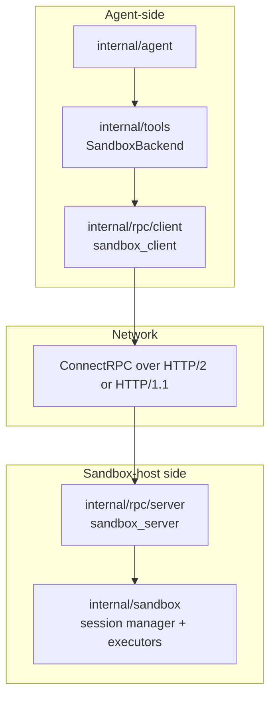
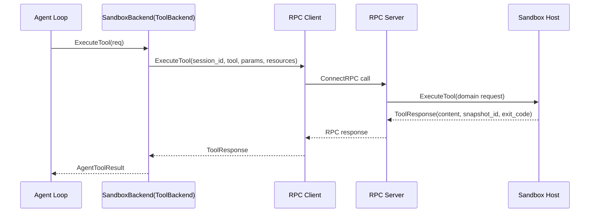
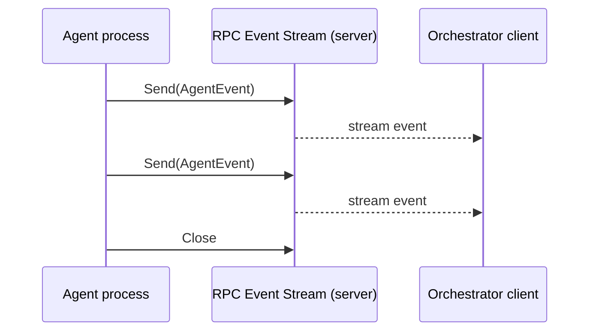

# 13: RPC Layer for Sandbox Backend and Agent Events

**Status:** Draft
**Depends on:** 11-sandbox-host-service, 05-agent
**Depended on by:** 14-mode3-e2e
**Implements:** `internal/rpc` protocol, client/server adapters, SandboxBackend transport, and agent-event streaming over RPC.

---

## 1. Overview

This plan defines the runtime RPC layer used in Mode 3 and Mode 4 to connect agent loops to remote sandbox hosts.

Primary goals:
- Implement typed RPC contracts for sandbox session CRUD, tool dispatch, snapshot control, and lifecycle.
- Implement `SandboxBackend` as a `ToolBackend` adapter over RPC.
- Provide event-stream transport for real-time `AgentEvent` delivery over RPC.
- Standardize error mapping, retry classification, and observability across RPC boundaries.

Non-goals:
- External/3rd-party tool protocol integration via MCP (separate concern).
- Sandbox host internal orchestration logic (plan 11).

---

## 2. Key Decisions

1. **Protocol choice:** Use ConnectRPC for sandbox backend RPC.
2. **MCP boundary:** MCP is only for external/3rd-party tool integration; not used for sandbox backend dispatch.
3. **Interface seam:** `SandboxBackend` implements `internal/tools.ToolBackend`, so agent loop remains backend-agnostic.
4. **Streaming:** Define RPC event streaming for real-time agent event transport in distributed modes.

---

## 3. Architecture

### 3.1 Component Diagram



### 3.2 Tool Dispatch Flow (Mode 3)



### 3.3 Agent Event Streaming Flow



---

## 4. RPC Service Contracts

### 4.1 Sandbox Service API

```go
type SandboxService interface {
    CreateSession(ctx context.Context, req *CreateSessionRequest) (*CreateSessionResponse, error)
    GetSession(ctx context.Context, req *GetSessionRequest) (*GetSessionResponse, error)
    PauseSession(ctx context.Context, req *PauseSessionRequest) (*PauseSessionResponse, error)
    ResumeSession(ctx context.Context, req *ResumeSessionRequest) (*ResumeSessionResponse, error)
    DestroySession(ctx context.Context, req *DestroySessionRequest) (*DestroySessionResponse, error)

    ExecuteTool(ctx context.Context, req *ExecuteToolRequest) (*ExecuteToolResponse, error)

    ListSnapshots(ctx context.Context, req *ListSnapshotsRequest) (*ListSnapshotsResponse, error)
    RollbackSession(ctx context.Context, req *RollbackSessionRequest) (*RollbackSessionResponse, error)
}
```

### 4.2 Event Stream API

```go
type AgentEventService interface {
    StreamAgentEvents(ctx context.Context, req *StreamAgentEventsRequest) (AgentEventStream, error)
}

type AgentEventStream interface {
    Send(*AgentEventEnvelope) error
    Recv() (*AgentEventEnvelope, error)
    Close() error
}
```

### 4.3 Message Mapping

- Transport DTOs mirror domain request/response fields with explicit versioning.
- `session_id` always uses runtime session ID, never driver-native ID.
- `ToolResponse.snapshot_id` propagated unchanged to agent/orchestrator consumers.

---

## 5. Package Structure

```text
internal/rpc/
├── api/
│   ├── sandbox.proto / connect schema
│   ├── events.proto / connect schema
│   └── version.go
├── client/
│   ├── sandbox_client.go      # domain-facing client adapter
│   └── event_client.go        # stream consumer helpers
├── server/
│   ├── sandbox_server.go      # wraps internal/sandbox service
│   └── event_server.go        # stream producer adapter
├── codec/
│   ├── sandbox_map.go         # domain <-> transport mapping
│   └── event_map.go
├── errors.go                  # canonical RPC error mapping
├── retry.go                   # transient/non-transient classification
└── observability.go           # tracing, metrics, correlation IDs
```

---

## 6. SandboxBackend Design

`internal/tools` integration path:

```go
type SandboxBackend struct {
    client    SandboxClient
    sessionID string
}

func (b *SandboxBackend) ExecuteTool(ctx context.Context, req ToolRequest) (*ToolResponse, error) {
    // map ToolRequest -> ExecuteTool RPC
    // forward session/tool call IDs and resources
    // map ExecuteToolResponse -> ToolResponse
}
```

Rules:
- Request `SessionID` in `ToolRequest` must match backend-bound session unless explicitly overridden for tests.
- Preserve tool call IDs for traceability across agent -> RPC -> sandbox.
- Wrap RPC errors with context fields (`session_id`, `tool_name`, `host`).

---

## 7. Error Model and Retries

### 7.1 Canonical Error Classes

- `invalid_argument`
- `not_found`
- `permission_denied`
- `resource_exhausted`
- `deadline_exceeded`
- `unavailable`
- `internal`

### 7.2 Retry Policy

Retryable by default:
- `unavailable`, transient transport resets, selected `deadline_exceeded`.

Non-retryable:
- `invalid_argument`, `not_found`, `permission_denied`.

Retries are bounded with exponential backoff + jitter and idempotency safeguards for session-mutating calls.

---

## 8. Observability

- Propagate trace context through ConnectRPC interceptors.
- Metrics:
  - RPC latency by method/status
  - payload sizes
  - stream reconnect counts
  - retry counts and outcomes
- Structured logs include `session_id`, `tool_call_id`, `method`, `peer`.

---

## 9. Connected Components (Seams)

| Component | Seam | Contract |
|-----------|------|----------|
| `internal/agent` | Event stream + tool dispatch | canonical `AgentEvent` envelope + `ToolBackend` dispatch path |
| `internal/tools` | SandboxBackend adapter | `ToolBackend.ExecuteTool(ToolRequest) -> ToolResponse` |
| `internal/sandbox` | RPC server backend | session CRUD + tool execution + snapshot operations |
| Orchestrator layer | Remote telemetry/control | event stream consumption and session lifecycle calls |
| External tools ecosystem | Protocol boundary | MCP explicitly excluded from sandbox backend path |

---

## 10. Acceptance Criteria

1. **Session lifecycle over RPC**
- Steps: create, pause, resume, destroy session via RPC client.
- Expected: consistent state transitions and typed errors on invalid transitions.

2. **Remote tool dispatch via SandboxBackend**
- Steps: agent calls tool through SandboxBackend in Mode 3.
- Expected: tool result mirrors host execution output and includes snapshot metadata when provided.

3. **Snapshot operations over RPC**
- Steps: list snapshots and rollback session via RPC.
- Expected: rollback succeeds and subsequent tool calls observe rolled-back state.

4. **Event streaming delivery**
- Steps: stream agent events to remote consumer during active run.
- Expected: ordered delivery per stream, reconnect behavior documented/tested.

5. **Error classification and retry behavior**
- Steps: inject transient and permanent RPC failures.
- Expected: transient failures retried within limits, permanent failures surfaced immediately.

6. **MCP boundary enforcement**
- Steps: inspect and test RPC layer interfaces.
- Expected: no MCP dependency in sandbox backend dispatch path.

---

## 11. Testing Strategy

### 11.1 Unit Tests

- DTO mapping (domain <-> transport).
- Error mapping and retry classifier.
- SandboxBackend request/response translation.

### 11.2 Component Tests

- In-memory ConnectRPC server/client roundtrips per method.
- Event streaming with controlled producer/consumer pacing.
- Interceptor behavior for trace/context propagation.

### 11.3 Integration Tests

- RPC server wired to sandbox host implementation (or architecture-compatible fake if plan 11 not yet implemented).
- Mode-3 style agent + sandbox dispatch smoke path.

---

## 12. URP (Unreasonably Robust Programming)

1. **Protocol compatibility matrix:** run cross-version client/server compatibility tests on every change.
2. **Record/replay RPC harness:** capture real traffic and replay against new builds for regression detection.
3. **Formal idempotency checks:** verify retry behavior never duplicates side effects on non-idempotent endpoints.

---

## 13. Extreme Optimization

1. Zero-copy marshaling paths for large tool outputs where feasible.
2. Connection pooling and adaptive keepalive tuning for high agent concurrency.
3. Stream backpressure controls with bounded buffers and fast-fail overload signaling.

---

## 14. Alien Artifacts

1. **Adaptive retry controller:** online model tunes retry/backoff by method and host health.
2. **Causal stream validator:** detect missing/reordered event envelopes via lightweight vector-clock metadata.
3. **Transport anomaly detection:** unsupervised detection of latency/size outliers as early outage signals.

---

## 15. Dependencies

| Dependency | Purpose |
|-----------|---------|
| ConnectRPC (Go) | RPC transport and streaming framework |
| `internal/tools` | SandboxBackend ToolBackend contract |
| `internal/agent` | AgentEvent serialization contracts |
| `internal/sandbox` | server-side domain implementation |

---

## 16. Exit Criteria

1. ConnectRPC selected and documented as the sandbox backend RPC transport.
2. Sandbox service RPC methods implemented for session CRUD, tool dispatch, and snapshots.
3. `SandboxBackend` ToolBackend adapter implemented and tested.
4. Agent event streaming protocol implemented with client/server adapters.
5. Error mapping + retry behavior tested for transient vs permanent failure classes.
6. No MCP dependency in sandbox backend path.
7. RPC layer tests pass under `-race`.
