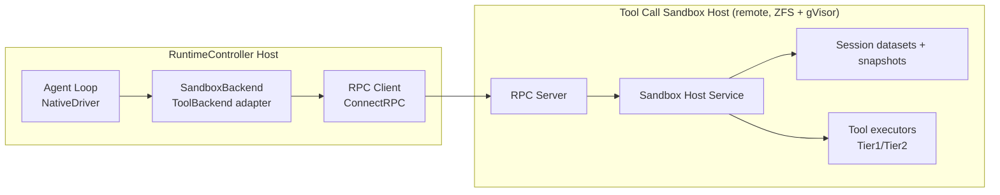
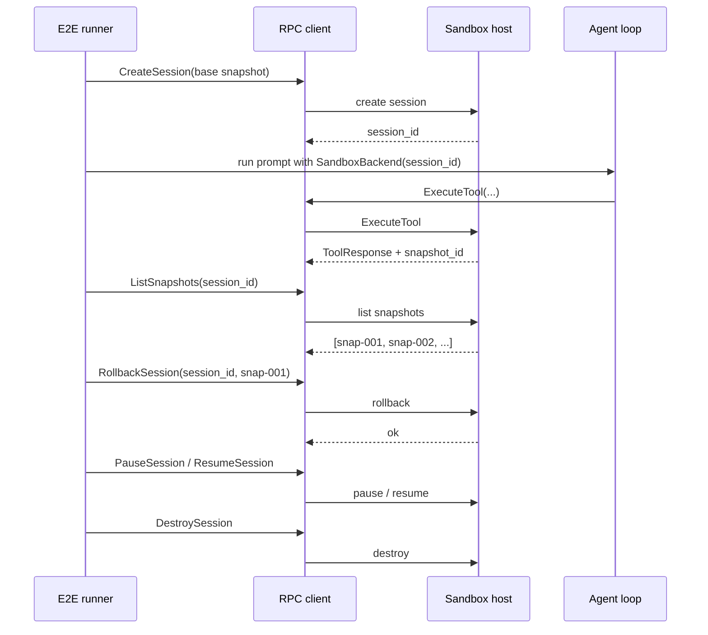

# 14: Mode 3 End-to-End — Remote Tool Dispatch via RPC

**Status:** Approved
**Depends on:** 13-rpc-layer, 08-agent-tools-e2e
**Depended on by:** 16-runtime-test-harness
**Implements:** Full Mode-3 E2E suite validating local agent loop + remote sandbox-host tool execution over ConnectRPC, including session lifecycle and snapshot operations.

---

## 1. Overview

This plan defines end-to-end tests for Mode 3 deployment:
- Agent loop runs locally on RuntimeController compute (the runtime's control plane, not h2-orchestrator).
- Tool calls dispatch through `SandboxBackend` over ConnectRPC.
- Sandbox host executes tools and returns results with snapshot metadata.

Primary goals:
- Validate remote-dispatch equivalence with local E2E behavior.
- Validate full sandbox session lifecycle via RPC (`create -> execute -> snapshot -> rollback -> pause/resume -> destroy`).
- Validate snapshot-boundary correctness and rollback semantics across multi-turn workflows.

Non-goals:
- Mode 2 third-party driver E2E (plan 15).
- Cross-host load/soak at large scale (plan 16).

---

## 2. Architecture

### 2.1 Mode 3 Placement Under Test



### 2.2 Lifecycle Sequence (Canonical Scenario)



### 2.3 Test Matrix

| Axis | Values |
|------|--------|
| Backend placement | Local (baseline from plan 08), Mode 3 remote sandbox |
| Tool mix | Tier 1 only, Tier 1 + Tier 2 (`bash`) |
| Control ops | normal run, rollback path, pause/resume path |
| Provider mode | deterministic fake provider, optional live provider smoke |

---

## 3. Test Suite Structure

```text
e2etests/
├── mode3/
│   ├── harness/
│   │   ├── remote_env.go          # boots RPC client + remote host fixture
│   │   ├── lifecycle.go           # session create/pause/resume/destroy helpers
│   │   └── assertions.go          # snapshot + remote-dispatch assertions
│   ├── mode3_happy_path_test.go
│   ├── mode3_tier_mix_test.go
│   ├── mode3_rollback_test.go
│   ├── mode3_pause_resume_test.go
│   ├── mode3_session_recovery_test.go
│   └── mode3_event_stream_test.go
└── fixtures/
    └── repos/...
```

Harness requirements:
- Shared setup to obtain remote `session_id` before agent run.
- Agent instantiated with `NewSandboxTools(client, session_id)`.
- Fixture repo seeded in sandbox session base snapshot.

---

## 4. Scenario Definitions

### 4.1 Happy-path Remote Workflow

- Run multi-turn task requiring read/edit/write and one bash validation step.
- Assert final file state and command success.
- Assert every tool call traversed RPC path (no local fallback).

### 4.2 Tier Routing with Snapshot Metadata

- Exercise Tier 1 and Tier 2 tools in same run.
- Assert responses include `snapshot_id` sequence and non-empty snapshot list.

### 4.3 Rollback Correctness

- Execute mutating actions producing snapshots.
- Roll back to earlier snapshot.
- Re-run read assertions to confirm prior state restoration.

### 4.4 Pause/Resume Continuity

- Pause session mid-workflow after at least one turn.
- Resume and continue workflow.
- Assert continuity of workspace and session identity.

### 4.5 Session Recovery / Destroy Semantics

- Validate destroyed session rejects further ExecuteTool calls with typed `not_found`.
- Validate create-new-session from same base snapshot produces clean state.

### 4.6 Event Stream Remote Visibility

- Stream `AgentEvent`s to remote observer during Mode 3 run.
- Assert key milestones and order consistency per stream.

**Canonical event sequence (happy-path multi-turn):**

```
session_started → tool_started → tool_completed → turn_completed → tool_started → tool_completed → turn_completed → session_ended
```

Event ordering guarantees (referencing event types from plan 05 — agent):
- `session_started` is always the first lifecycle event for a session.
- `tool_started` and `tool_completed` always appear as matched pairs in order per tool call.
- `turn_completed` appears after all tool calls in a turn have emitted `tool_completed`.
- `session_ended` is always the final lifecycle event (both success and error carry outcome metadata).
- Within a single turn, multiple `tool_started → tool_completed` pairs may appear sequentially.
- Events across turns are strictly ordered: all events for turn N complete before any events for turn N+1.

---

## 5. Connected Components (Seams)

| Component | Seam | Contract |
|-----------|------|----------|
| `internal/agent` | Tool dispatch boundary | Agent uses `ToolBackend` abstraction with `SandboxBackend` injection |
| `internal/rpc` | Remote transport | ConnectRPC methods for lifecycle, tool execution, snapshots, events |
| `internal/sandbox` | Tool Call Sandbox backend | remote session lifecycle and tiered tool execution (ZFS + gVisor infrastructure) |
| `internal/tools` | Remote tool adapter | `NewSandboxTools` + `ToolResponse.snapshot_id` propagation |
| `e2etests/mode3` | Validation harness | deterministic remote environment and assertions |

---

## 6. Acceptance Criteria

1. **Mode 3 happy path works end-to-end**
- Steps: create remote session, run multi-turn agent task via SandboxBackend, destroy session.
- Expected: successful completion with expected workspace output and RPC-observed tool dispatch.

2. **Full lifecycle operations work**
- Steps: create, pause, resume, rollback, destroy in one suite.
- Expected: each operation succeeds in valid state and fails with typed errors in invalid state.

3. **Snapshot behavior is correct**
- Steps: run mutating operations, capture snapshot IDs, rollback.
- Expected: rollback restores prior state and subsequent reads reflect restored snapshot.

4. **Tier mix works remotely**
- Steps: run both Tier 1 and Tier 2 tools in one task.
- Expected: both succeed through remote host path with correct result metadata.

5. **Event streaming works in distributed run**
- Steps: subscribe to remote event stream during scenario.
- Expected: ordered milestone events are received and correlated with session/tool call IDs.

6. **No MCP dependency in Mode 3 path**
- Steps: inspect runtime wiring and execute scenarios.
- Expected: all remote tool dispatch goes through ConnectRPC sandbox services only.

---

## 7. Testing Strategy

### 7.1 Deterministic First

- Default PR suite uses deterministic provider traces and reproducible fixture repos. Deterministic provider traces and fixture repos are defined in plan 08 (agent-tools-e2e). Mode 3 tests reuse the same fixture infrastructure, adding remote session setup/teardown around the existing test scenarios.
- Normalize volatile fields (timestamps, token counts) in assertions.

### 7.2 Environment Modes

- `mode3-fake-host`: in-process fake sandbox service for fast deterministic checks (see §7.3 below).
- `mode3-real-host`: integration environment with real sandbox host (gated lane).

### 7.3 MemorySandboxService (Fake Sandbox Host)

The `mode3-fake-host` environment uses a `MemorySandboxService` that implements the same `SandboxHostService` interface as the real implementation. This fake is shared between Mode 3 E2E tests (plan 14) and RPC layer tests (plan 13).

**Behavior contract:**

1. **In-memory filesystem state per session:** Each session maintains its own filesystem using `map[string][]byte`. File reads and writes operate on this map. Sessions are fully isolated from each other and support concurrent access.
2. **Snapshot-as-copy and rollback-as-restore:** Creating a snapshot deep-copies the current filesystem map. Rolling back to a snapshot replaces the current filesystem with the deep-copied state from that snapshot. Snapshot IDs are monotonically increasing per session.
3. **Session state machine tracking:** Sessions follow the same FSM as the real implementation (`created → active → paused → active → destroying → destroyed`, plus `failed` from any state). Invalid transitions return typed errors identical to the real host.
4. **Tool tier classification:** Uses the same `ClassifyTool` function from plan 11 to route tools to Tier 1 (read-only) or Tier 2 (mutating/bash) execution paths. Tier 2 calls automatically produce a post-execution snapshot.
5. **Full interface parity:** Implements `CreateSession`, `DestroySession`, `PauseSession`, `ResumeSession`, `ExecuteTool`, `CreateSnapshot`, `RollbackSession`, `ListSnapshots`, and `StreamEvents`.

**Key types:**

```go
// MemorySandboxService implements SandboxHostService for deterministic testing.
type MemorySandboxService struct {
    mu       sync.Mutex
    sessions map[string]*memorySession
}

type memorySession struct {
    id        string
    state     SessionState // created | active | paused | destroying | destroyed | failed
    files     map[string][]byte
    snapshots []memorySnapshot
    events    []AgentEvent
}

type memorySnapshot struct {
    id    string
    files map[string][]byte // deep copy at snapshot time
}
```

### 7.4 Diagnostics

On failure, capture:
- RPC method timeline with request IDs
- Agent event timeline
- Snapshot list and selected rollback target
- Workspace diff before/after rollback

---

## 8. URP (Unreasonably Robust Programming)

1. **Dual-host failover scenario:** simulate host loss and session recreation from snapshot transfer.
2. **Replayable distributed trace bundles:** package RPC + agent + filesystem traces for deterministic repro.
3. **Cross-run semantic diffing:** compare Mode 1 baseline and Mode 3 outcomes to detect subtle regressions.

---

## 9. Extreme Optimization

1. Parallel scenario execution across isolated remote sessions.
2. Reusable base snapshots to amortize setup time across Mode 3 tests.
3. Streaming assertion engine that validates invariants online to fail fast.

---

## 10. Alien Artifacts

1. **Distributed invariant checker:** enforce temporal invariants spanning agent events + RPC calls + snapshot state.
2. **Causal trace stitching:** correlate tool-call causality across process boundaries automatically.
3. **Counterexample shrinking for distributed failures:** minimize failing event/RPC traces for fast root-cause isolation.

---

## 11. Dependencies

| Dependency | Purpose |
|-----------|---------|
| `internal/rpc` | ConnectRPC client/server and event stream contracts |
| `internal/agent` | runtime under test with SandboxBackend tool dispatch |
| `internal/tools` | `NewSandboxTools` factory and remote tool mapping |
| `internal/sandbox` | remote execution target for lifecycle/snapshot operations |

---

## 12. Exit Criteria

1. Mode 3 E2E suite exists under `e2etests/mode3/` and is runnable in deterministic mode.
2. Lifecycle scenarios cover create/execute/list snapshots/rollback/pause/resume/destroy.
3. Tier-mixed remote tool workflows pass with snapshot metadata assertions.
4. Remote event streaming scenario passes with ordered milestone checks.
5. Gated real-host integration lane is defined and passing.
6. Mode 3 gate (G6 precursor behaviors) is demonstrated by suite results.

---

## Round 1 Review Disposition

**Review:** [14-mode3-e2e-review-reviewer-sea.md](./14-mode3-e2e-review-reviewer-sea.md)
**Incorporated by:** coder-2-sea
**Date:** 2026-03-12

| # | Reviewer | Severity | Summary | Disposition | Notes |
|---|----------|----------|---------|-------------|-------|
| 1 | reviewer-sea | P1 | Missing deterministic in-memory sandbox service for test lane | Incorporated | Added `MemorySandboxService` contract (state, snapshots, rollback, tier classification). |
| 2 | reviewer-sea | P2 | Network fault-injection coverage incomplete | Incorporated | Added F6-F8 network fault scenarios with TCP proxy injection. |
| 3 | reviewer-sea | P2 | Canonical happy-path event sequence not explicit | Incorporated | Added explicit canonical event sequence assertions for happy path. |
| 4 | reviewer-sea | P2 | Semantic-equivalence criteria lacked divergence policy | Incorporated | Added explicit divergence allow-list for parity checks. |
| 5 | reviewer-sea | P3 | Fixture infrastructure linkage was unclear | Incorporated | Added cross-reference to plan 08 fixture infrastructure. |
| 6 | reviewer-sea | P3 | Fixture dataset sizing/readiness criteria unspecified | Incorporated | Added small fixture size bounds and explicit "ready" criteria. |

## Round 2 Review Disposition

**Review:** [14-mode3-e2e-review-coder-1-sea.md](./14-mode3-e2e-review-coder-1-sea.md)
**Incorporated by:** coder-1-sea
**Date:** 2026-03-12

| # | Reviewer | Severity | Summary | Disposition | Notes |
|---|----------|----------|---------|-------------|-------|
| 1 | coder-1-sea | P1 | Event assertions referenced non-canonical lifecycle names | Incorporated | Canonical sequence/order assertions now use plan-05 lifecycle taxonomy (`session_started`, `session_ended`). |

## Plan Review Signoff

- **Status**: Approved
- **Date**: 2026-03-12
- **Branch**: main
- **Commit**: ee32c55
- **Review rounds**: 3 (R1 batch + R2 batch + R3 focused)
- **Total findings**: 7
- **Finding breakdown**: P0: 0, P1: 2, P2: 3, P3: 2
- **Incorporation rate**: 100%
- **Not incorporated**: None
- **Open questions**: All resolved
- **Reviewers**: reviewer-sea, coder-1-sea
