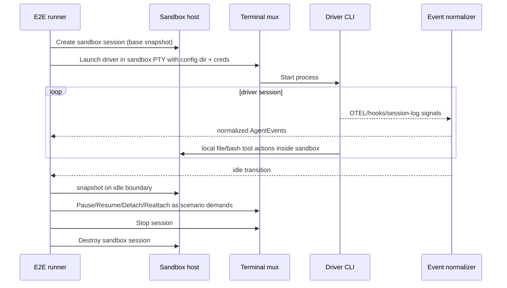

# 15: Mode 2 End-to-End — 3rd Party Driver in Sandbox

**Status:** Draft
**Depends on:** 09-h2-termmux-port, 11-sandbox-host-service
> **Note (R1-F1):** Plan 09 in the plan index (`00-plan-index.md`) is "sandbox-zfs." The `09-h2-termmux-port` plan doc exists separately — there is a known plan number collision being tracked. Mode 2 E2E tests code against the `internal/termmux` interface contract defined in `09-h2-termmux-port`. If that plan does not fully specify the termmux API, the Mode 2 E2E tests will define the interface contract they require and the termmux implementation will conform to it.
**Depended on by:** 16-runtime-test-harness
**Implements:** End-to-end validation of Mode 2 where the entire 3rd-party agent driver runs inside a Session Sandbox (the container/environment where the agent process runs), managed by terminal mux with normalized events and session lifecycle controls. Tool execution within that Session Sandbox uses Tool Call Sandbox infrastructure (ZFS + gVisor).

---

## 1. Overview

This plan defines Mode 2 E2E tests for running 3rd-party agent CLIs (Claude Code, Codex) inside Session Sandbox environments managed by the sandbox host service. In Mode 2, the driver process and tools are colocated in the Session Sandbox and use `LocalBackend` semantics from inside that environment. Tool execution within the Session Sandbox uses Tool Call Sandbox infrastructure (ZFS snapshots + gVisor isolation).

Primary goals:
- Validate RuntimeController-driven launch of 3rd-party drivers in Session Sandbox PTY sessions.
- Validate credential/config directory injection and persistence semantics.
- Validate event normalization from driver-native output into canonical `AgentEvent` stream.
- Validate session lifecycle (start, attach/detach, idle detection, pause/resume, terminate).
- Validate snapshot behavior on idle turn boundaries for durable recovery.

Non-goals:
- Native driver Mode 1/Mode 3 behavior (covered by plans 08 and 14).
- Cross-provider tool dispatch protocol concerns (plan 13).

---

## 2. Architecture

### 2.1 Mode 2 Placement Under Test

```mermaid
graph LR
    subgraph "RuntimeController host"
        ORCH[RuntimeController / test runner]
        TMUXC[Terminal mux client API]
    end

    subgraph "Session Sandbox"
        SH[Sandbox host service]
        TMUXS[Terminal mux session manager + PTY]
        DRV[3rd-party driver CLI\nClaude/Codex]
        FS[ZFS-backed session workspace\n— Tool Call Sandbox]
        CFG[Managed config dir\n(credentials + driver config)\n— outside ZFS dataset]
    end

    ORCH --> TMUXC --> TMUXS
    TMUXS --> DRV
    DRV --> FS
    DRV --> CFG
    SH --> FS
```

### 2.2 Core Mode 2 E2E Sequence



### 2.3 Scenario Matrix

| Axis | Values |
|------|--------|
| Driver | ClaudeCodeDriver, CodexDriver |
| Event source mix | OTEL-only, hook-only, session-log-only, mixed three-source |
| Lifecycle path | basic run, detach/attach, pause/resume, restart/recover |
| Config/creds | fresh config, reused config, missing/invalid creds |

---

## 3. Test Suite Structure

```text
e2etests/
├── mode2/
│   ├── harness/
│   │   ├── sandbox_env.go         # sandbox session + workspace fixtures
│   │   ├── termmux_env.go         # PTY launch/attach/detach helpers
│   │   ├── config_injection.go    # credential/config directory setup
│   │   └── assertions.go          # event/state/snapshot assertions
│   ├── mode2_driver_launch_test.go
│   ├── mode2_event_normalization_test.go
│   ├── mode2_attach_detach_test.go
│   ├── mode2_pause_resume_test.go
│   ├── mode2_config_persistence_test.go
│   └── mode2_recovery_test.go
└── fixtures/
    ├── driver_logs/
    └── sandbox_repos/
```

Harness requirements:
- Driver runtime configurable by scenario (`claude`, `codex`).
- Deterministic event capture from normalized stream.
- Explicit mapping between runtime `Session.ID` and driver-native session IDs.

---

## 4. Scenario Definitions

### 4.1 Driver Launch with Credential Injection

- Launch driver in sandbox with managed config directory and injected credentials/files.
- Assert process starts, auth state recognized, and initial prompt executes.

### 4.2 Event Normalization Correctness

- Feed realistic mixed-source signals (OTEL + hooks + session-log tail).
- Assert normalized event stream includes canonical milestones and coherent state transitions.

#### 4.2.1 Source Priority Hierarchy and Conflict Resolution (R1-F2)

When multiple event sources report on the same activity, the normalizer applies a strict priority hierarchy:

1. **OTEL (highest fidelity):** Structured, timestamped spans with explicit semantic metadata. When OTEL data is available, it is the authoritative source for event timing and classification.
2. **Hooks (second priority):** Reliable delivery with coarser granularity. Used when OTEL is unavailable or incomplete for a given event.
3. **Session-log tail (fallback):** Always available but requires parsing. Used when both OTEL and hooks are silent for a given event window.

**Conflict resolution rules:**
- When sources disagree (e.g., OTEL reports `tool_completed` but session-log still shows output streaming due to timing skew), the higher-priority source wins.
- When a higher-priority source is silent (e.g., OTEL is absent because the process died before sending telemetry), the normalizer degrades gracefully to lower-priority sources.
- Events derived from lower-priority sources when higher-priority sources are silent carry an explicit `confidence` marker (e.g., `confidence: "degraded"`) on the normalized `AgentEvent`. This allows consumers to distinguish high-confidence events from best-effort reconstructions.
- The three-source drift detector (§8 URP) continuously monitors for divergence patterns to surface systemic source reliability issues.

### 4.3 Attach/Detach Lifecycle

- Attach client, detach, reattach while session remains active.
- Assert no event-loss beyond documented buffering guarantees and no PTY corruption.

### 4.4 Pause/Resume with Idle Snapshot

- Pause session after idle transition snapshot.
- Resume later and continue prompt flow.
- Assert config path stability and usable auth/session continuity.

### 4.5 Config Directory Persistence

- Verify per-session stable path and persistence across restart/resume.
- Assert path-sensitive auth tokens remain valid (no forced re-auth when path unchanged).

#### 4.5.1 Config Directory Path Scheme (R1-F5)

The config directory path scheme is: `<sandbox-data-dir>/configs/<session-id>/`

**ZFS dataset placement:** The config directory is placed **outside** the ZFS dataset (i.e., on a separate persistent filesystem mount within the Session Sandbox). This means:
- Config directories persist across ZFS snapshot rollbacks of the Tool Call Sandbox workspace.
- Auth tokens modified during the session are preserved even if a rollback reverts the workspace filesystem.
- Driver config changes (e.g., updated settings files) survive workspace rollback.

This separation is intentional: the ZFS dataset manages the workspace/code filesystem for tool execution rollback, while config/credentials are session-scoped state that should not be reverted by workspace rollback operations.

**Stability contract:** For a given logical session ID, the config directory path is deterministic and stable across:
- Pause/resume cycles
- Driver process restart within the same session
- Host process restarts (the path is derived from session ID, not runtime state)

### 4.6 Recovery from Driver Exit/Crash

- Simulate driver exit/crash and restart handling.
- Assert lifecycle termination events and deterministic recovery path.

---

## 5. Connected Components (Seams)

| Component | Seam | Contract |
|-----------|------|----------|
| `internal/termmux` | PTY/session control | launch, attach/detach, stop, event normalization outputs |
| `internal/sandbox` | session durability | workspace/session lifecycle and snapshot operations |
| `internal/agent` driver adapters | canonical event model | normalized events align with `AgentEvent` contracts |
| Config management | credential injection | stable config-dir paths and pre-launch injection window |
| RuntimeController/test harness | control-plane actions | lifecycle orchestration and state assertions |

> **Note (R1-F4):** `internal/termmux` interfaces and contracts are defined in plan doc `09-h2-termmux-port`. Mode 2 E2E tests code against those contracts. If the termmux API is not yet fully specified in that plan, the Mode 2 E2E tests will define the interface contract they need (PTY launch, attach/detach, stop, event normalization outputs) and the termmux implementation will conform to it.

---

## 6. Acceptance Criteria

1. **Mode 2 driver launch works**
- Steps: create sandbox session, launch 3rd-party driver via termmux PTY, run prompt.
- Expected: driver responds successfully and emits normalized events.

2. **Credential/config injection works**
- Steps: inject driver config and credentials before launch.
- Expected: driver authenticates/loads config without manual intervention in automated path.

3. **Event normalization is coherent**
- Steps: run mixed-source event scenario.
- Expected: canonical event stream captures turn/tool/idle/session milestones correctly.

4. **Lifecycle controls work**
- Steps: attach/detach, pause/resume, stop.
- Expected: state transitions are correct and session integrity is preserved.

5. **Idle snapshot behavior works**
- Steps: reach idle boundary, pause, resume.
- Expected: snapshot boundary captured and workflow resumes from expected filesystem/session state.

6. **Config path stability is preserved**
- Steps: restart/resume same logical session.
- Expected: config directory path remains stable and path-sensitive auth remains valid.

7. **Session crash/exit handling works**
- Steps: force driver exit during run.
- Expected: clean termination events and deterministic recovery outcome.

---

## 7. Testing Strategy

### 7.1 Deterministic Mode

- Primary PR path uses deterministic driver simulators/replayed logs for repeatability.
- Normalize timing-volatile fields in assertions.

#### 7.1.1 Deterministic Driver Simulator (R1-F3)

The deterministic driver simulator is a concrete component that enables repeatable Mode 2 E2E testing without live driver processes. It works as follows:

**Architecture:** A process that reads a replay script (captured from a real driver session) and replays PTY output, OTEL spans, and hook callbacks at recorded timestamps. The simulator implements the same PTY interface that a real driver process would, so the terminal mux and event normalizer exercise their real code paths.

**Replay script format:** JSON Lines (one JSON object per line), where each line is a tuple:

```json
{"ts": "2026-03-12T10:00:00.123Z", "source": "pty", "data": "base64-encoded-pty-output"}
{"ts": "2026-03-12T10:00:00.456Z", "source": "otel", "data": {"span": "tool_call", "attrs": {...}}}
{"ts": "2026-03-12T10:00:01.000Z", "source": "hook", "data": {"event": "idle", "session_id": "..."}}
```

Fields:
- `ts`: ISO 8601 timestamp from the original recording.
- `source`: One of `"pty"`, `"otel"`, `"hook"`.
- `data`: Source-specific payload. PTY data is base64-encoded raw bytes. OTEL data is a structured span/event object. Hook data is the hook callback payload.

**Recording:** A recording mode captures a real driver session into this format. The recorder wraps the PTY, OTEL collector, and hook receiver to produce the replay script. This enables capturing interesting real sessions and replaying them deterministically in CI.

**Timing:** The simulator supports two replay modes: (1) real-time replay at original timestamps (for latency/performance testing), and (2) fast-forward replay with no inter-event delays (for functional correctness testing in PR-fast lane).

### 7.2 Real Driver Gated Mode

- Weekly/controlled lane executes real Claude/Codex binaries in sandbox.
- Requires credentialed environment and operator safeguards.

### 7.3 Diagnostics

On failure, capture:
- PTY transcript window
- normalized event timeline
- raw source events (OTEL/hooks/session-log)
- config-dir metadata (path, injected files summary)
- snapshot state summary around idle boundaries

---

## 8. URP (Unreasonably Robust Programming)

1. **Three-source drift detector:** continuously compare OTEL/hooks/session-log interpretations for divergence.
2. **Session resurrection tests:** repeatedly kill/restart driver process while preserving config/workspace and verify convergence.
3. **Cross-driver migration E2E:** start with one driver, convert session log, resume in another driver, validate continuity.

---

## 9. Extreme Optimization

1. PTY I/O buffering tuned for high-throughput agent output without event lag.
2. Incremental normalizer parsing to avoid full-log rescans.
3. Shared sandbox fixture snapshots to reduce setup cost across scenarios.

---

## 10. Alien Artifacts

1. **Event-source truth fusion:** probabilistic reconciliation over OTEL/hooks/log signals for stronger normalized event confidence.
2. **State-machine anomaly detection:** online detection of unlikely transition paths in long sessions.
3. **Automated transcript minimization:** shrink failing PTY transcripts to minimal causal slices.

---

## 11. Dependencies

| Dependency | Purpose |
|-----------|---------|
| `internal/termmux` | PTY/session manager and event normalizers (interfaces defined in plan 09-h2-termmux-port) |
| `internal/sandbox` | Session Sandbox lifecycle + Tool Call Sandbox snapshot support |
| `internal/agent` | canonical event/state contracts for driver adapters |
| real/simulated 3rd-party CLIs | Mode 2 execution targets |

> **Note (R1-F4):** The `internal/termmux` dependency is defined in plan doc `09-h2-termmux-port` (note: plan number 09 has a known collision with `09-sandbox-zfs` in the plan index). If the termmux API is not yet fully specified there, Mode 2 E2E tests will define the interface contract they need and the termmux implementation will conform to it.

---

## 12. Exit Criteria

1. Mode 2 E2E suite exists under `e2etests/mode2/` with deterministic scenarios.
2. Driver launch + event normalization scenarios pass for at least one concrete driver.
3. Attach/detach and pause/resume lifecycle scenarios pass.
4. Config injection/path-stability scenarios pass.
5. Idle-boundary snapshot behavior is validated in E2E.
6. Gated real-driver lane is defined and passing in controlled environment.

---

## R1 Review Disposition (reviewer-sea)

**Review:** [15-mode2-e2e-review-reviewer-sea.md](./15-mode2-e2e-review-reviewer-sea.md)
**Incorporated by:** coder-2-sea
**Date:** 2026-03-12

| Finding | Severity | Disposition | Notes |
|---------|----------|-------------|-------|
| F1 | P1 | Incorporated | Clarified termmux dependency with plan number collision note |
| F2 | P2 | Incorporated | Added source priority hierarchy and conflict resolution policy |
| F3 | P2 | Incorporated | Specified deterministic driver simulator with JSON-lines replay format |
| F4 | P2 | Incorporated | Added termmux interface contract notes in Connected Components |
| F5 | P3 | Incorporated | Defined config dir path scheme and ZFS dataset placement |
| F6 | P3 | Incorporated | Scoped O2 to lifecycle semantics comparison |
