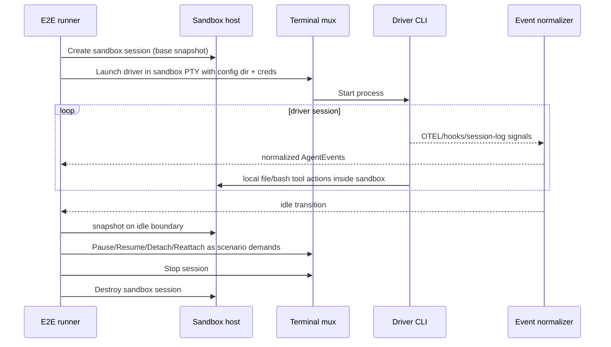

# 15: Mode 2 End-to-End — 3rd Party Driver in Sandbox

**Status:** Draft
**Depends on:** 09-h2-termmux-port, 11-sandbox-host-service
**Depended on by:** 16-runtime-test-harness
**Implements:** End-to-end validation of Mode 2 where the entire 3rd-party agent driver runs inside sandbox, managed by terminal mux with normalized events and session lifecycle controls.

---

## 1. Overview

This plan defines Mode 2 E2E tests for running 3rd-party agent CLIs (Claude Code, Codex) inside sandbox-host-managed environments. In Mode 2, the driver process and tools are colocated in sandbox context and use `LocalBackend` semantics from inside that sandbox.

Primary goals:
- Validate orchestrator-driven launch of 3rd-party drivers in sandbox PTY sessions.
- Validate credential/config directory injection and persistence semantics.
- Validate event normalization from driver-native output into canonical `AgentEvent` stream.
- Validate session lifecycle (start, attach/detach, idle detection, pause/resume, terminate).
- Validate snapshot behavior on idle turn boundaries for durable recovery.

Non-goals:
- Native driver Mode 1/Mode 3 behavior (covered by plans 08 and 14).
- Cross-provider tool dispatch protocol concerns (plan 13).

---

## 2. Architecture

### 2.1 Mode 2 Placement Under Test

```mermaid
graph LR
    subgraph "Orchestrator host"
        ORCH[Orchestrator / test runner]
        TMUXC[Terminal mux client API]
    end

    subgraph "Sandbox host"
        SH[Sandbox host service]
        TMUXS[Terminal mux session manager + PTY]
        DRV[3rd-party driver CLI\nClaude/Codex]
        FS[ZFS-backed session workspace]
        CFG[Managed config dir\n(credentials + driver config)]
    end

    ORCH --> TMUXC --> TMUXS
    TMUXS --> DRV
    DRV --> FS
    DRV --> CFG
    SH --> FS
```

### 2.2 Core Mode 2 E2E Sequence



### 2.3 Scenario Matrix

| Axis | Values |
|------|--------|
| Driver | ClaudeCodeDriver, CodexDriver |
| Event source mix | OTEL-only, hook-only, session-log-only, mixed three-source |
| Lifecycle path | basic run, detach/attach, pause/resume, restart/recover |
| Config/creds | fresh config, reused config, missing/invalid creds |

---

## 3. Test Suite Structure

```text
e2etests/
├── mode2/
│   ├── harness/
│   │   ├── sandbox_env.go         # sandbox session + workspace fixtures
│   │   ├── termmux_env.go         # PTY launch/attach/detach helpers
│   │   ├── config_injection.go    # credential/config directory setup
│   │   └── assertions.go          # event/state/snapshot assertions
│   ├── mode2_driver_launch_test.go
│   ├── mode2_event_normalization_test.go
│   ├── mode2_attach_detach_test.go
│   ├── mode2_pause_resume_test.go
│   ├── mode2_config_persistence_test.go
│   └── mode2_recovery_test.go
└── fixtures/
    ├── driver_logs/
    └── sandbox_repos/
```

Harness requirements:
- Driver runtime configurable by scenario (`claude`, `codex`).
- Deterministic event capture from normalized stream.
- Explicit mapping between runtime `Session.ID` and driver-native session IDs.

---

## 4. Scenario Definitions

### 4.1 Driver Launch with Credential Injection

- Launch driver in sandbox with managed config directory and injected credentials/files.
- Assert process starts, auth state recognized, and initial prompt executes.

### 4.2 Event Normalization Correctness

- Feed realistic mixed-source signals (OTEL + hooks + session-log tail).
- Assert normalized event stream includes canonical milestones and coherent state transitions.

### 4.3 Attach/Detach Lifecycle

- Attach client, detach, reattach while session remains active.
- Assert no event-loss beyond documented buffering guarantees and no PTY corruption.

### 4.4 Pause/Resume with Idle Snapshot

- Pause session after idle transition snapshot.
- Resume later and continue prompt flow.
- Assert config path stability and usable auth/session continuity.

### 4.5 Config Directory Persistence

- Verify per-session stable path and persistence across restart/resume.
- Assert path-sensitive auth tokens remain valid (no forced re-auth when path unchanged).

### 4.6 Recovery from Driver Exit/Crash

- Simulate driver exit/crash and restart handling.
- Assert lifecycle termination events and deterministic recovery path.

---

## 5. Connected Components (Seams)

| Component | Seam | Contract |
|-----------|------|----------|
| `internal/termmux` | PTY/session control | launch, attach/detach, stop, event normalization outputs |
| `internal/sandbox` | session durability | workspace/session lifecycle and snapshot operations |
| `internal/agent` driver adapters | canonical event model | normalized events align with `AgentEvent` contracts |
| Config management | credential injection | stable config-dir paths and pre-launch injection window |
| Orchestrator/test harness | control-plane actions | lifecycle orchestration and state assertions |

---

## 6. Acceptance Criteria

1. **Mode 2 driver launch works**
- Steps: create sandbox session, launch 3rd-party driver via termmux PTY, run prompt.
- Expected: driver responds successfully and emits normalized events.

2. **Credential/config injection works**
- Steps: inject driver config and credentials before launch.
- Expected: driver authenticates/loads config without manual intervention in automated path.

3. **Event normalization is coherent**
- Steps: run mixed-source event scenario.
- Expected: canonical event stream captures turn/tool/idle/session milestones correctly.

4. **Lifecycle controls work**
- Steps: attach/detach, pause/resume, stop.
- Expected: state transitions are correct and session integrity is preserved.

5. **Idle snapshot behavior works**
- Steps: reach idle boundary, pause, resume.
- Expected: snapshot boundary captured and workflow resumes from expected filesystem/session state.

6. **Config path stability is preserved**
- Steps: restart/resume same logical session.
- Expected: config directory path remains stable and path-sensitive auth remains valid.

7. **Session crash/exit handling works**
- Steps: force driver exit during run.
- Expected: clean termination events and deterministic recovery outcome.

---

## 7. Testing Strategy

### 7.1 Deterministic Mode

- Primary PR path uses deterministic driver simulators/replayed logs for repeatability.
- Normalize timing-volatile fields in assertions.

### 7.2 Real Driver Gated Mode

- Weekly/controlled lane executes real Claude/Codex binaries in sandbox.
- Requires credentialed environment and operator safeguards.

### 7.3 Diagnostics

On failure, capture:
- PTY transcript window
- normalized event timeline
- raw source events (OTEL/hooks/session-log)
- config-dir metadata (path, injected files summary)
- snapshot state summary around idle boundaries

---

## 8. URP (Unreasonably Robust Programming)

1. **Three-source drift detector:** continuously compare OTEL/hooks/session-log interpretations for divergence.
2. **Session resurrection tests:** repeatedly kill/restart driver process while preserving config/workspace and verify convergence.
3. **Cross-driver migration E2E:** start with one driver, convert session log, resume in another driver, validate continuity.

---

## 9. Extreme Optimization

1. PTY I/O buffering tuned for high-throughput agent output without event lag.
2. Incremental normalizer parsing to avoid full-log rescans.
3. Shared sandbox fixture snapshots to reduce setup cost across scenarios.

---

## 10. Alien Artifacts

1. **Event-source truth fusion:** probabilistic reconciliation over OTEL/hooks/log signals for stronger normalized event confidence.
2. **State-machine anomaly detection:** online detection of unlikely transition paths in long sessions.
3. **Automated transcript minimization:** shrink failing PTY transcripts to minimal causal slices.

---

## 11. Dependencies

| Dependency | Purpose |
|-----------|---------|
| `internal/termmux` | PTY/session manager and event normalizers |
| `internal/sandbox` | sandbox session lifecycle + snapshot support |
| `internal/agent` | canonical event/state contracts for driver adapters |
| real/simulated 3rd-party CLIs | Mode 2 execution targets |

---

## 12. Exit Criteria

1. Mode 2 E2E suite exists under `e2etests/mode2/` with deterministic scenarios.
2. Driver launch + event normalization scenarios pass for at least one concrete driver.
3. Attach/detach and pause/resume lifecycle scenarios pass.
4. Config injection/path-stability scenarios pass.
5. Idle-boundary snapshot behavior is validated in E2E.
6. Gated real-driver lane is defined and passing in controlled environment.
