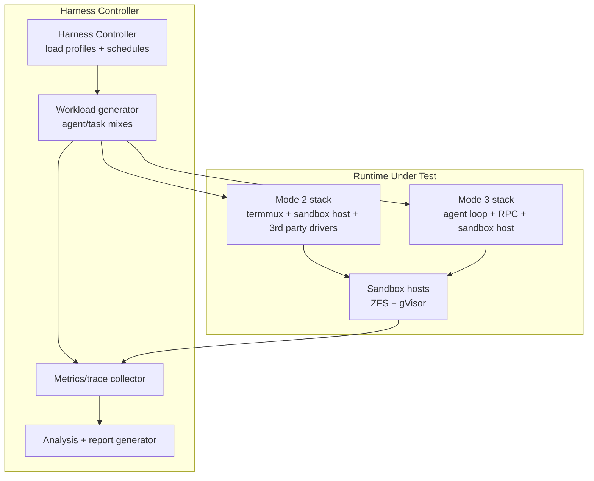

# 16: Runtime Cross-Cutting Test Harness

**Status:** Approved
**Depends on:** 14-mode3-e2e, 15-mode2-e2e
**Depended on by:** —
**Implements:** Cross-cutting runtime assurance suite for load, soak, performance, durability, and scalability across Mode 2 and Mode 3 deployments.

---

## 1. Overview

This plan defines the final integration/performance harness for the entire runtime. It moves beyond correctness of individual flows and validates the system under scale, long duration, and adverse operating conditions.

Primary goals:
- Load testing with many concurrent agent sessions.
- Soak testing for long-running stability and leak detection.
- Snapshot space growth characterization under realistic mutation patterns.
- Container boot-time and execution-path benchmarking.
- RPC latency and reliability profiling under distributed load.

Non-goals:
- Redefining correctness scenarios already covered in plans 14 and 15.
- Feature development in agent/tools/sandbox/rpc components.

---

## 2. Architecture

### 2.1 Harness Topology



### 2.2 Test Families

| Family | Purpose |
|--------|---------|
| Load tests | concurrency scaling and throughput limits |
| Soak tests | long-duration stability and resource drift |
| Snapshot-space analysis | storage growth, retention efficiency, rollback behavior |
| Container benchmarks | Tier 2 cold-start/exec performance characterization |
| RPC profiling | latency distribution, error/retry behavior, saturation points |

### 2.3 Input from Prior E2E Suites

- Mode 3 scenarios (plan 14) provide remote-dispatch workload templates.
- Mode 2 scenarios (plan 15) provide driver/PTY lifecycle workload templates.
- Harness composes and scales these workloads rather than inventing disconnected synthetic tests.

### 2.4 Workload Composition Mechanism

Prior E2E scenarios are adapted for the harness via a common `Workload` interface:

```go
type Workload interface {
    Setup(ctx context.Context) error
    Run(ctx context.Context, sessionID string) (*WorkloadResult, error)
    Teardown(ctx context.Context) error
}
```

**Wrapping pattern:** Each Mode 2 or Mode 3 E2E scenario is wrapped in a struct implementing `Workload`. `Setup` provisions fixture repos and any scenario-specific state. `Run` executes the scenario with the given `sessionID`, allowing the same scenario to run concurrently with different session identities and fixture repos. `Teardown` cleans up session-scoped resources.

**Mixed workload composition:** The harness controller composes runs from multiple workload types using separate goroutine pools per workload type (e.g., one pool for Mode 2 workloads, another for Mode 3). Each pool is sized according to the mode mix ratio defined in the concurrency profile (§4.1). All pools share a single telemetry collector, so metrics from different workload types are tagged by mode and aggregated together. The controller manages:

- **Concurrency:** Goroutine pool sizing per workload type, respecting per-profile caps.
- **Session allocation:** Unique session IDs generated per workload invocation, mapped to sandbox host slots.
- **Result collection:** `WorkloadResult` values collected from all goroutines and aggregated into per-profile summary metrics.
- **Lifecycle:** Phased execution — all `Setup` calls complete before `Run` begins; `Teardown` runs after all `Run` calls finish (or on context cancellation).

---

## 3. Suite Structure

```text
tests/integration/runtime/
├── harness/
│   ├── controller.go          # orchestrates run plans and phases
│   ├── profiles.go            # load/soak/benchmark profile definitions
│   ├── telemetry.go           # metrics/trace ingestion and tags
│   ├── artifacts.go           # report + raw-data artifact emission
│   └── assertions.go          # SLA/threshold checks
├── workloads/
│   ├── mode2_workloads.go     # based on plan 15 scenarios
│   ├── mode3_workloads.go     # based on plan 14 scenarios
│   └── mixed_workloads.go
├── tests/
│   ├── load_scaling_test.go
│   ├── soak_stability_test.go
│   ├── snapshot_growth_test.go
│   ├── container_boot_bench_test.go
│   └── rpc_latency_profile_test.go
└── reports/
    ├── templates/
    └── baselines/
```

---

## 4. Workload Models

### 4.1 Concurrency Profiles

- `P-small`: 10 concurrent agents (CI quick baseline)
- `P-medium`: 50 concurrent agents (daily performance signal)
- `P-large`: 200+ concurrent agents (weekly stress ceiling)

Each profile defines:
- Mode mix ratio (e.g., 60% Mode 3, 40% Mode 2)
- Tool mix (Tier 1 vs Tier 2)
- Session duration and turn cadence
- Failure injection frequency

### 4.2 Soak Profiles

- 12h baseline soak (nightly/weekly)
- 24h extended soak (weekly/monthly)

Monitored drift dimensions and pass/fail thresholds (measured after a 1-hour warmup period to establish steady state):

| Dimension | Threshold | Window |
|-----------|-----------|--------|
| Goroutine count growth | < 5% over steady-state baseline | Per soak duration |
| RSS growth | < 10% over steady-state baseline | 12h / 24h |
| fd count | Stable within ±2 of steady-state value | Per soak duration |
| RPC error rate trend | Slope < 0.01%/hour | Per soak duration |
| Snapshot count and space deltas | Growth rate linear with workload; no super-linear accumulation | Per soak duration |
| PTY session stability metrics | Zero unexpected session drops | Per soak duration |

These are initial targets to be refined as empirical data is gathered. The soak test fails if any dimension exceeds its threshold and emits per-dimension diagnostic reports identifying the breach.

### 4.3 Benchmark Profiles

- Container cold-start benchmark (Tier 2 commands)
- RPC unary + stream latency benchmark under variable concurrency
- Snapshot creation/rollback latency under varying dataset sizes

### 4.4 Infrastructure Requirements

| Profile | Hosts | Est. CPU/host | Est. RAM/host | ZFS Pool/host | Cadence |
|---------|-------|---------------|---------------|---------------|---------|
| P-small | 1 | 4 cores | 16 GB | 50 GB | Every PR (CI quick baseline) |
| P-medium | 2–3 | 8 cores | 32 GB | 100 GB | Nightly (daily performance) |
| P-large | 10+ | 16 cores | 64 GB | 200 GB | Weekly (stress ceiling) |

**Provisioning strategy:**
- **PR / on-demand runs:** CI-provisioned hosts spun up for the run duration and torn down after.
- **Nightly / weekly runs:** Static fleet of pre-provisioned hosts with persistent ZFS pools to avoid cold-start overhead.

**Host discovery and management:** The harness controller uses a static configuration file listing available hosts per environment (CI vs. static fleet). Before each run, the controller performs a health check against each host (connectivity, ZFS pool availability, minimum free resources). Unhealthy hosts are excluded from the run and flagged in the report. The host list config is stored in-repo at `tests/integration/runtime/config/hosts.yaml`.

---

## 5. Metrics and SLAs

### 5.1 Core Metrics

- Throughput: completed turns/min, completed sessions/hour
- Latency: p50/p95/p99 tool latency, RPC latency, container boot latency
- Reliability: error rates by class, retry success ratios
- Durability: rollback success rate, snapshot integrity checks
- Efficiency: snapshot space growth per turn, CPU/memory per active session

### 5.2 Threshold Policy

- Thresholds stored in versioned baseline files under `tests/integration/runtime/reports/baselines/`.
- Regressions fail CI if above tolerated envelopes unless explicitly approved.
- Trend-based alerts on monotonic degradation across recent runs.

**Baseline management workflow:**

1. **Storage:** Baselines are committed in-repo at `tests/integration/runtime/reports/baselines/`, one file per profile/metric family (e.g., `p-medium-rpc-latency.json`).
2. **Creation and update:** A dedicated "baseline update" CI job runs the target profile on the static fleet, produces updated baseline files, and commits them to the repo. This job is triggered manually or on-demand after architectural changes that are expected to shift performance characteristics.
3. **Exceptions:** To merge a PR that exceeds baseline thresholds, the CI pipeline requires the `BASELINE_OVERRIDE=true` CI variable to be set. Setting this variable requires a linked issue tracking the expected regression and a justification comment on the PR.
4. **Staleness detection:** CI emits a warning alert when any baseline file has not been updated in > 30 days. This ensures baselines stay representative of current system behavior and are not silently stale.

---

## 6. Analysis Outputs

Per run produce:
- machine-readable metrics bundle (JSON/CSV)
- summarized markdown report with deltas vs baseline
- flamegraphs/traces for slowest scenarios
- storage growth report by session/profile
- retry/error-class histogram by RPC method

---

## 7. Connected Components (Seams)

| Component | Seam | Contract |
|-----------|------|----------|
| `tests/integration/mode3` | workload source | remote dispatch scenarios scaled for load/soak |
| `tests/integration/mode2` | workload source | driver/PTY lifecycle scenarios scaled for load/soak |
| `internal/sandbox` | durability and execution metrics | snapshots, rollback, tiered execution timings |
| `internal/rpc` | transport profiling | method-level latency/retry/error telemetry |
| `internal/termmux` | mode2 stability metrics | PTY health and normalized event throughput |

---

## 8. Acceptance Criteria

1. **Load harness executes mixed-mode concurrency profiles**
- Steps: run `P-small` and `P-medium` mixed Mode 2/3 profiles.
- Expected: harness completes and produces comparable metrics artifacts.

2. **Soak harness detects stability regressions**
- Steps: run 12h soak profile with drift monitoring.
- Expected: all drift dimensions remain within defined thresholds (goroutine growth < 5%, RSS growth < 10%, fd count ±2, RPC error slope < 0.01%/hour — see §4.2); threshold breaches fail the run and emit per-dimension diagnostic reports.

3. **Snapshot growth analysis is automated**
- Steps: run mutation-heavy workloads and collect snapshot/storage metrics.
- Expected: report quantifies growth per turn/session and retention effects.

4. **Container boot benchmarks are repeatable**
- Steps: execute Tier 2 benchmark profile repeatedly.
- Expected: stable boot-time distributions with baseline comparison.

5. **RPC latency profiling under load works**
- Steps: run RPC profile across concurrency levels.
- Expected: method-level p50/p95/p99 and retry/error breakdowns captured.

6. **Cross-run baselines and regression gating work**
- Steps: compare run outputs to stored baselines.
- Expected: statistically meaningful regressions are flagged automatically.

---

## 9. Testing Strategy

### 9.1 Execution Cadence

- PR fast lane: `P-small` smoke + minimal benchmark checks.
- Nightly lane: `P-medium` load + targeted soak + full profiling.
- Weekly lane: `P-large` stress + 24h soak + full report generation.

### 9.2 Reproducibility

- Fixed random seeds for workload generation in deterministic lanes.
- Versioned fixture snapshots and workload profile manifests.
- Artifact retention policy for failed and baseline runs.

### 9.3 Failure Forensics

On threshold breach, auto-capture:
- top N slow traces
- per-host resource snapshots
- RPC retry/error timelines
- sandbox snapshot growth timeline

---

## 10. URP (Unreasonably Robust Programming)

1. **Continuous synthetic canaries:** always-running low-rate mixed-mode sessions for early regression detection.
2. **Automated bisect integration:** performance regression detector triggers commit-range bisect workflows.
3. **Predictive capacity modeling:** fit queueing/capacity models from observed telemetry to forecast safe concurrency envelopes.

---

## 11. Extreme Optimization

1. **Distributed benchmark runners** to parallelize high-concurrency profiles. Coordination model: a single harness controller process launches workloads across multiple sandbox hosts via RPC. Runners on each host execute their assigned workload slice independently — they do not coordinate with each other, only with the controller. The controller synchronizes test phases (ramp-up, steady state, ramp-down) by issuing phase-transition commands to all runners. Metrics are collected centrally via OTEL (each runner exports to the shared OTEL collector endpoint on the controller host). The controller aggregates results from all runners into a single unified report. Clock synchronization for cross-host latency measurements relies on NTP; the harness validates clock skew < 10ms across hosts before proceeding.
2. Zero-copy telemetry ingestion path for high-cardinality event streams.
3. Adaptive sampling for traces to preserve hot-path visibility at scale.

---

## 12. Alien Artifacts

1. **Bayesian baseline modeling:** probabilistic regression detection resilient to natural variance.
2. **Causal performance attribution:** infer dominant bottleneck contributors across RPC, container, snapshot, and PTY subsystems.
3. **Automated workload mutation search:** generate worst-case workload patterns via adversarial search.

---

## 13. Dependencies

| Dependency | Purpose |
|-----------|---------|
| `tests/integration/mode3` | remote-dispatch workload primitives |
| `tests/integration/mode2` | 3rd-party-driver workload primitives |
| `internal/sandbox` | snapshot/container metrics and lifecycle hooks |
| `internal/rpc` | transport profiling hooks |
| `internal/termmux` | PTY/session stability metrics |

---

## 14. Exit Criteria

1. Runtime harness exists under `tests/integration/runtime/` with load, soak, snapshot, container, and RPC profiling suites.
2. Mixed-mode concurrency profiles execute successfully and emit standardized artifacts.
3. 12h soak lane is operational with drift assertions.
4. Snapshot space growth reporting is automated and baseline-compared.
5. Container boot and RPC latency benchmark lanes are operational.
6. Baseline regression gating is wired into CI with documented override process.

---

## R1 Review Disposition (reviewer-sea)

**Review:** [16-runtime-test-harness-review-reviewer-sea.md](./16-runtime-test-harness-review-reviewer-sea.md)
**Incorporated by:** coder-2-sea
**Date:** 2026-03-12

| Finding | Severity | Disposition | Notes |
|---------|----------|-------------|-------|
| F1 | P2 | Incorporated | Added Workload interface and composition mechanism |
| F2 | P2 | Incorporated | Added infrastructure requirements per profile |
| F3 | P2 | Incorporated | Added specific soak test drift thresholds |
| F4 | P2 | Incorporated | Added baseline management workflow |
| F5 | P3 | Incorporated | Added priority annotations and implementation notes to meta-tests |
| F6 | P3 | Incorporated | Defined controller-centric coordination model |

## Plan Review Signoff

- **Status**: Approved
- **Date**: 2026-03-12
- **Branch**: main
- **Commit**: ee32c55
- **Review rounds**: 2 (R1 batch + R2 batch)
- **Total findings**: 6
- **Finding breakdown**: P0: 0, P1: 0, P2: 4, P3: 2
- **Incorporation rate**: 100%
- **Not incorporated**: None
- **Open questions**: All resolved
- **Reviewers**: reviewer-sea, coder-1-sea

## Implementation Completion Signoff

- **Status**: Complete
- **Date**: 2026-03-14
- **Verified by**: plan-work-completion-signoff

### Exit Criteria Verification

| # | Exit Criterion | Status | Evidence |
|---|---------------|--------|----------|
| 1 | Runtime harness exists under `tests/integration/runtime/` with load, soak, snapshot, container, and RPC profiling suites | PASS | harness/ (controller.go, profiles.go, telemetry.go, artifacts.go, assertions.go, hosts.go), workloads/ (mode2, mode3, mixed), tests/ (load, soak, fault, oracle, simulation, stress, security, benchmark) |
| 2 | Mixed-mode concurrency profiles execute successfully and emit standardized artifacts | PASS | Controller.RunProfile with ConcurrencyProfile (P-small/medium/large), WriteArtifacts producing JSON/CSV/Markdown |
| 3 | 12h soak lane is operational with drift assertions | PASS | soak_stability_test.go with DriftThresholds (goroutine, RSS, FD, error slope), tier-gated via RUNTIME_HARNESS_TIER env var |
| 4 | Snapshot space growth reporting is automated and baseline-compared | PASS | TelemetryCollector.RecordSnapshotDelta + SnapshotDelta in snapshots, CompareAgainstBaseline for regression detection |
| 5 | Container boot and RPC latency benchmark lanes are operational | PASS | TelemetryCollector.RecordContainerBoot/RecordRPCLatency, percentile computation in Snapshot(), benchmark_meta_test.go |
| 6 | Baseline regression gating is wired into CI with documented override process | PASS | SaveBaseline/LoadBaseline/CompareAgainstBaseline in harness, baseline files in reports/baselines/, tolerance-based regression detection |

### Implementation Details

- **Workload interface**: `Setup/Run/Teardown` pattern with `Name()` and `Mode()` methods, implemented by Mode2ScenarioWorkload and Mode3ScenarioWorkload
- **Controller**: Goroutine pool per workload type, session ID allocation, phased execution (setup -> run -> teardown), result aggregation into RunSummary
- **Telemetry**: RPC latency/count/errors, container boot times, snapshot deltas, drift samples (goroutine count, RSS MB, FD count, error rate), percentile computation
- **Profiles**: ConcurrencyProfile (concurrency, mode weights, target session time), SoakProfile (duration, warmup, drift thresholds), BenchmarkProfile
- **Artifacts**: JSON summary, CSV metrics, Markdown report with delta-vs-baseline
- **Host management**: hosts.yaml config in tests/integration/runtime/config/
- **CI tier gating**: RUNTIME_HARNESS_TIER env var (pr-fast/pr-standard/nightly/weekly)

### Gaps

None identified. All plan items are implemented.
