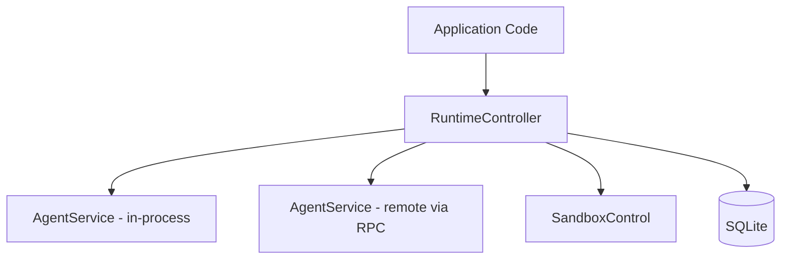
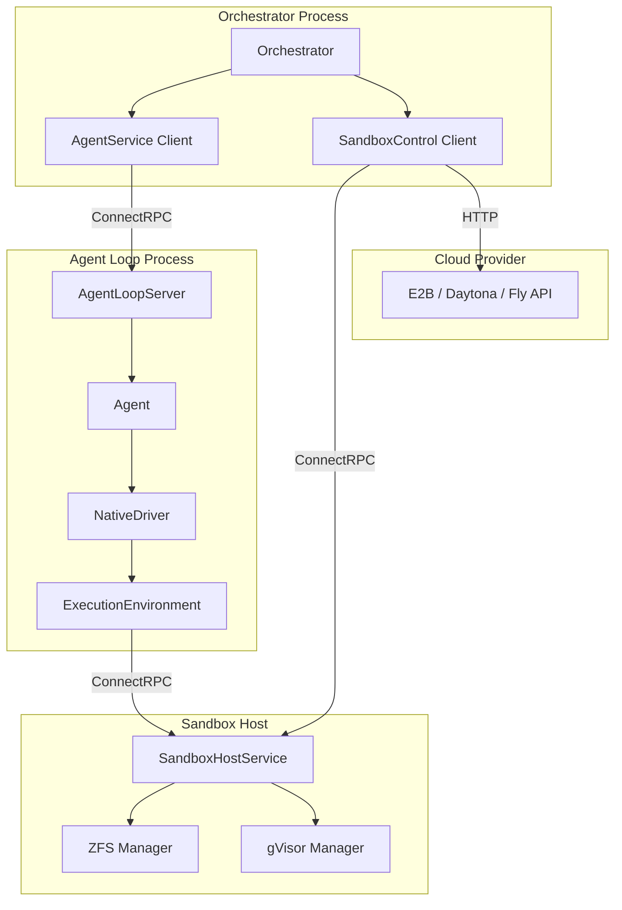
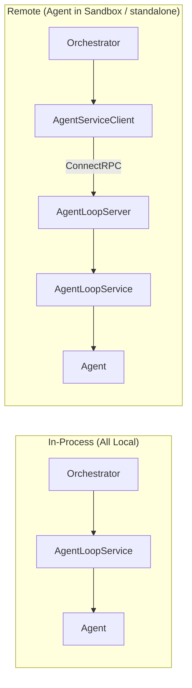
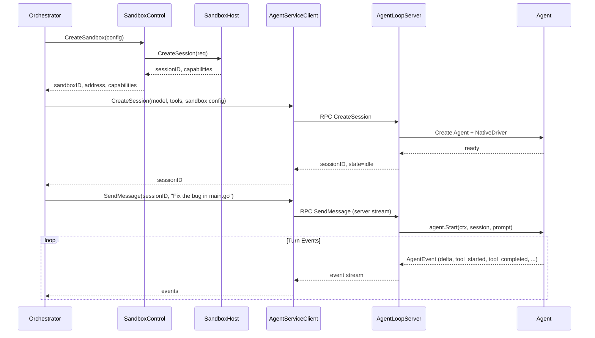
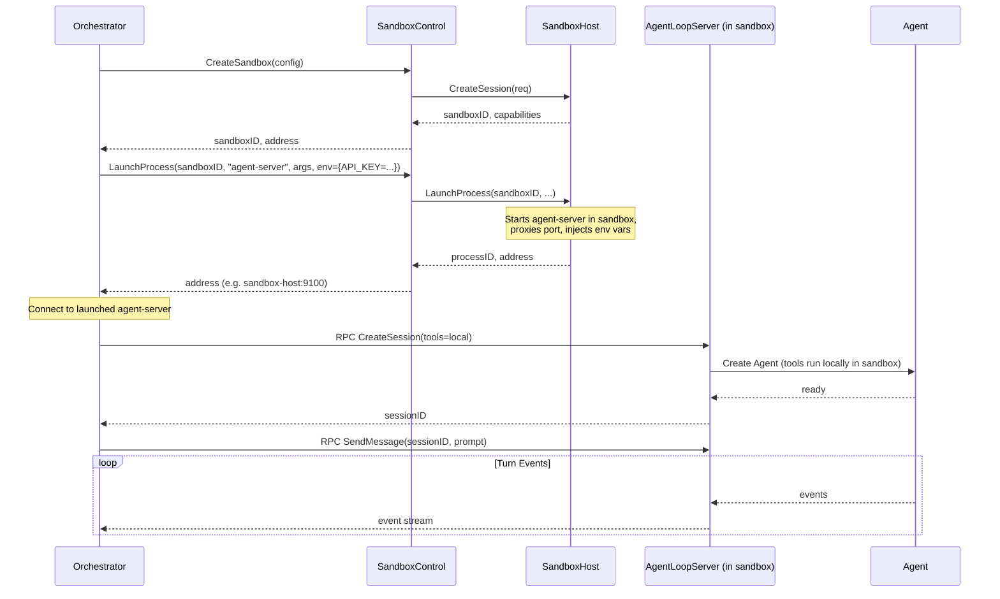
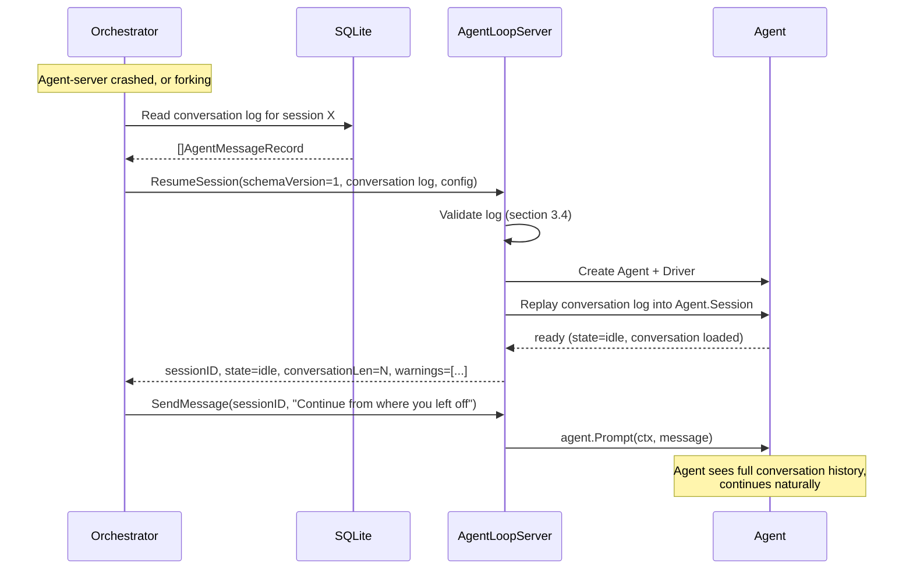
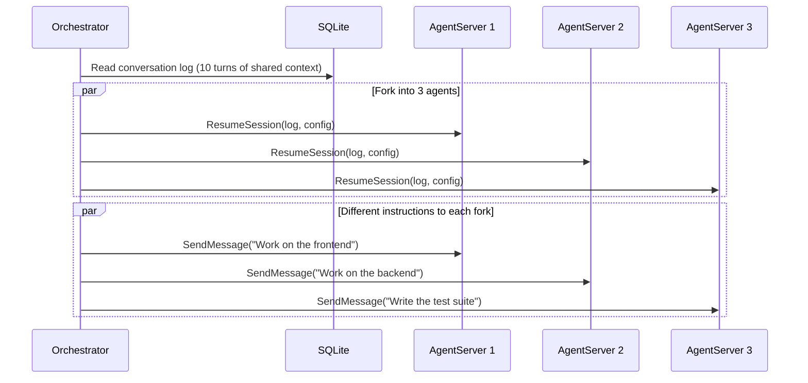
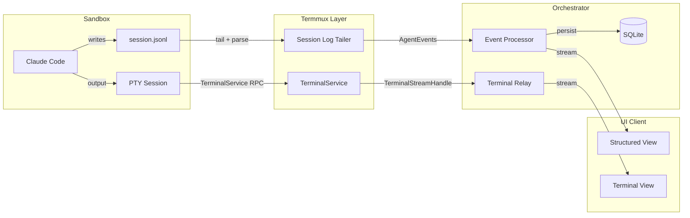

# 18: Agent Loop RPC Service

**Status:** Draft (R1 review incorporated)
**Depends on:** 05-agent, 13-rpc-layer, 11-sandbox-host-service.add01, 11-sandbox-host-service.add02 (LaunchProcess)
**Depended on by:** Orchestrator application (future)
**Scope:** Wrap the existing agent loop with a ConnectRPC interface so it can run as a standalone service, deployable anywhere. Adds a SandboxControl abstraction for unified sandbox lifecycle management across native and cloud providers.
**Incorporated reviews:** 18-agent-loop-rpc-review-r1-a.md, 18-agent-loop-rpc-review-r1-b.md

---

## 1. Overview

The agent loop (`internal/agent`) can only run in-process today. This plan adds an RPC interface around it so that an orchestrator (or any client) can create agent sessions, send messages, subscribe to events, and issue steering commands — all over the network.

This is the missing seam between the orchestrator layer and the agent layer in the three-layer architecture. It enables:

- **Agent loop as a standalone process** on any machine
- **Agent loop inside a sandbox** launched by a sandbox-host or cloud provider
- **Agent loop in-process** with the orchestrator (zero-cost — same Go interface, no RPC)

Additionally, this plan introduces the **SandboxControl** interface, which abstracts sandbox lifecycle (create, destroy, pause, resume, launch process) at the **orchestrator level**. SandboxControl is the control-plane counterpart to ExecutionEnvironment: SandboxControl provisions and manages sandbox instances from the orchestrator, while ExecutionEnvironment executes tools within an already-provisioned sandbox from the agent loop. They are complementary, not competing -- see section 6 for detailed boundary clarification.

### Key Design Principle

The Agent Loop RPC follows the same pattern as the existing Sandbox RPC: a Go interface (`AgentService`) that can be called in-process or over ConnectRPC. The transport is transparent to the caller.

### Relationship to RuntimeController

The architecture doc defines a `RuntimeController` interface at the orchestrator level. `AgentService` is **not** a replacement for `RuntimeController` -- they operate at different layers:

- **AgentService** is the agent-loop-facing API. It is what an agent loop server exposes (or what the in-process `AgentLoopService` implements). It manages individual agent sessions: create, message, steer, subscribe to events, destroy.
- **RuntimeController** is the orchestrator-facing API. It is what application code calls. A `RuntimeController` implementation delegates to one or more `AgentService` instances (in-process or remote) and composes them with `SandboxControl` for sandbox lifecycle, session persistence to SQLite, and cross-agent coordination.



---

## 2. Architecture

### 2.1 Component Diagram



### 2.2 In-Process vs Remote

When agent loop runs in-process with the orchestrator, no RPC is involved -- the orchestrator calls `AgentService` methods directly on the in-process implementation. When remote, the orchestrator uses `AgentServiceClient` which wraps ConnectRPC calls.



---

## 3. AgentService Interface

This is the core Go interface. Both the in-process implementation and the RPC server implement it.

**Package location:** `internal/agent/api/agent.go` (NOT `internal/rpc/api`). The interface lives in a new `internal/agent/api` package to avoid circular imports -- `internal/rpc/api` imports `internal/agent` types, so `internal/agent` cannot import `internal/rpc/api`. This follows the same pattern as `internal/sandbox/environment` (transport-neutral interface) vs `internal/rpc/api` (RPC-specific types). The RPC layer wraps AgentService; it does not define it.

```go
// internal/agent/api/agent.go

// AgentService manages agent loop sessions. Implemented by AgentLoopService
// (in-process) and AgentServiceClient (remote via ConnectRPC).
type AgentService interface {
    // CreateSession initializes a new agent session with the given config.
    // The agent loop is ready to receive prompts after this returns.
    // If req.SessionID is non-empty and already exists, returns an error
    // (not idempotent -- callers should use GetSession to check first).
    CreateSession(ctx context.Context, req *CreateAgentSessionRequest) (*CreateAgentSessionResponse, error)

    // GetSession returns the current state of a session.
    GetSession(ctx context.Context, req *GetAgentSessionRequest) (*GetAgentSessionResponse, error)

    // ListSessions returns all active sessions managed by this service.
    ListSessions(ctx context.Context, req *ListAgentSessionsRequest) (*ListAgentSessionsResponse, error)

    // SendMessage sends a user message to the agent and begins a new turn.
    // Returns a stream of events for this turn. The stream terminates when
    // the turn completes (EventTurnCompleted received). See section 3.2
    // for turn-scoping details. Returns BusyError if a turn is already active.
    SendMessage(ctx context.Context, req *SendMessageRequest) (AgentEventReceiver, error)

    // Continue resumes the agent without a new user message (e.g., after tool use).
    // Returns a stream of events for this turn (same scoping as SendMessage).
    Continue(ctx context.Context, req *ContinueRequest) (AgentEventReceiver, error)

    // Steer injects a steering instruction into the current turn.
    // Returns FailedPrecondition error if no turn is active (agent in StateIdle).
    Steer(ctx context.Context, req *SteerRequest) (*SteerResponse, error)

    // FollowUp queues a follow-up prompt for after the current turn completes.
    // Unlike Steer, this is valid in any state -- it queues for the next turn.
    FollowUp(ctx context.Context, req *FollowUpRequest) (*FollowUpResponse, error)

    // Abort requests the agent to stop the current turn.
    Abort(ctx context.Context, req *AbortRequest) (*AbortResponse, error)

    // SubscribeEvents opens a persistent event stream for a session.
    // Unlike SendMessage/Continue (which stream events for one turn),
    // this streams ALL events for the session lifecycle.
    // Internally, this delegates to the existing AgentEventService infrastructure.
    // Events are delivered to both per-turn streams and session-wide subscribers
    // simultaneously (dual delivery). Consuming the per-turn stream is NOT
    // required for the turn to proceed -- the turn runs regardless.
    SubscribeEvents(ctx context.Context, req *SubscribeEventsRequest) (AgentEventReceiver, error)

    // ResumeSession creates a new session initialized with an existing conversation log.
    // The agent picks up from the last message in the log.
    // This enables:
    //   - Crash recovery (orchestrator replays persisted conversation)
    //   - Session forking (same conversation log -> multiple new sessions)
    //   - Cross-agent migration (conversation from one agent type resumed on another)
    ResumeSession(ctx context.Context, req *ResumeSessionRequest) (*ResumeSessionResponse, error)

    // DestroySession tears down a session and releases all resources.
    // If a turn is active, it is forcefully cancelled (context cancelled).
    // Open event streams for the session are closed with EOF.
    // DestroySession does NOT wait for the active turn to finish.
    DestroySession(ctx context.Context, req *DestroyAgentSessionRequest) (*DestroyAgentSessionResponse, error)

    // Close gracefully shuts down the service, stopping all sessions and
    // releasing all resources. Called on server shutdown.
    Close() error
}
```

### 3.1 Request/Response Types

```go
// internal/agent/api/agent_types.go

// ToolEnvironmentType is a typed constant for ToolEnvironmentConfig.Type.
type ToolEnvironmentType string

const (
    ToolEnvLocal   ToolEnvironmentType = "local"
    ToolEnvSandbox ToolEnvironmentType = "sandbox"
)

// SessionConfig holds shared configuration for creating or resuming a session.
// Both CreateAgentSessionRequest and ResumeSessionRequest embed this.
type SessionConfig struct {
    SessionID    string            // Optional; generated (UUID) if empty
    Driver       string            // Driver name (e.g., "native")
    Model        string            // Model ID (e.g., "claude-sonnet-4-6")
    Provider     string            // Provider API name (e.g., "anthropic")
    SystemPrompt string            // System prompt for the agent
    Tools        []string          // Tool names to enable (e.g., ["bash", "read_file", "edit_file"])
    Metadata     map[string]any    // Arbitrary session metadata

    // Tool execution config
    ToolEnvironment ToolEnvironmentConfig
}

type ToolEnvironmentConfig struct {
    Type ToolEnvironmentType

    // For Type=ToolEnvSandbox: address of sandbox-host
    SandboxHostAddr string

    // For Type=ToolEnvSandbox: sandbox session ID (pre-created by orchestrator via SandboxControl)
    SandboxSessionID string

    // For Type=ToolEnvLocal: root directory for file operations
    LocalRootDir string
}

type CreateAgentSessionRequest struct {
    SessionConfig
}

type CreateAgentSessionResponse struct {
    SessionID string
    State     string // AgentState as string
}

type GetAgentSessionRequest struct {
    SessionID string
}

type GetAgentSessionResponse struct {
    SessionID       string
    State           string
    Metrics         agent.SessionMetrics // Reuse existing agent.SessionMetrics directly
    ConversationLen int
}

type ListAgentSessionsRequest struct {
    // Filter by labels (optional)
    Labels map[string]string
}

type ListAgentSessionsResponse struct {
    Sessions []AgentSessionSummary
}

type AgentSessionSummary struct {
    SessionID string
    State     string
    CreatedAt time.Time
}

type SendMessageRequest struct {
    SessionID string
    Message   string
}

type ContinueRequest struct {
    SessionID string
}

type SteerRequest struct {
    SessionID string
    Message   string
}

type SteerResponse struct{}

type FollowUpRequest struct {
    SessionID string
    Message   string
}

type FollowUpResponse struct{}

type AbortRequest struct {
    SessionID string
    Reason string
}

type AbortResponse struct{}

type ResumeSessionRequest struct {
    SessionConfig

    // Schema version for the conversation log format. Used to detect
    // incompatible log formats from older versions. Current version: 1.
    SchemaVersion int

    // The conversation log to resume from. The agent starts in a state
    // as if it had this conversation, ready for the next prompt.
    ConversationLog []AgentMessageRecord
}

type AgentMessageRecord struct {
    Turn      int
    Role      string          // "user", "assistant", "tool_result"
    Content   json.RawMessage // Serialized message content (see section 3.3)
    CreatedAt time.Time
}

type ResumeSessionResponse struct {
    SessionID       string
    State           string
    ConversationLen int
    // Warnings produced during validation (e.g., unknown tool references in
    // tool_result records, non-contiguous turn numbers).
    Warnings []string
}

type SubscribeEventsRequest struct {
    SessionID string
}

type DestroyAgentSessionRequest struct {
    SessionID string
}

type DestroyAgentSessionResponse struct{}
```

**Note on SessionMetrics:** The response types use `agent.SessionMetrics` directly from `internal/agent/types.go` rather than defining a duplicate. The RPC codec layer (see section 5.4) handles serialization/deserialization for the wire format, following the same pattern as the existing sandbox codec in `internal/rpc/codec/sandbox_map.go`.

**Note on API key handling:** The `APIKey` field has been removed from `SessionConfig`. API keys must NOT be transmitted over the AgentService RPC. Instead, API keys are injected into the agent-server process via environment variables (through `SandboxControl.LaunchProcess.Env` for sandbox-launched mode, or standard env vars for standalone mode). The agent-server reads `ANTHROPIC_API_KEY` (or provider-specific equivalents) from its environment. This eliminates the risk of key exposure in RPC logs, in-memory retention, and compromised sandbox processes. See resolved Open Question 3 in section 17.

### 3.2 Turn-Scoped Event Streams

`SendMessage` and `Continue` return an `AgentEventReceiver` that is scoped to a single turn. Implementation:

1. The `AgentLoopService` subscribes to the session-wide event stream (via `Agent.Subscribe()`) internally.
2. It wraps the subscription in a filtering `AgentEventReceiver` that:
   - Forwards all events for the current turn
   - Closes the stream (returns `io.EOF`) when `EventTurnCompleted` is received for that turn
3. Multiple concurrent `SendMessage` calls on the same session return `BusyError` -- only one turn can be active at a time (enforced by the existing `Agent.Start()`/`Agent.Prompt()` API).

The per-turn stream and any active `SubscribeEvents` stream deliver the **same events simultaneously** (dual delivery). This is not a problem -- the per-turn stream is a convenience for callers who only care about one turn. The orchestrator typically uses `SubscribeEvents` for persistence and the per-turn stream is used by direct API callers.

### 3.3 AgentMessageRecord Serialization Format

The `AgentMessageRecord.Content` field uses `json.RawMessage` with a defined JSON schema for each role:

**Role "user":**
```json
{
    "text": "the user message text"
}
```

**Role "assistant":**
```json
{
    "content_blocks": [
        {"type": "text", "text": "..."},
        {"type": "thinking", "thinking": "...", "signature": "..."},
        {"type": "tool_use", "id": "...", "name": "...", "input": {...}}
    ],
    "model": "claude-sonnet-4-6",
    "usage": {"input_tokens": 100, "output_tokens": 50}
}
```

**Role "tool_result":**
```json
{
    "tool_call_id": "...",
    "tool_name": "...",
    "content": [
        {"type": "text", "text": "..."}
    ],
    "is_error": false
}
```

**Bidirectional mapping with `agent.AgentMessage`:**

The conversion between `AgentMessageRecord` and `agent.AgentMessage` (which wraps `ai.Message`) is implemented in a dedicated codec package at `internal/agent/api/codec.go`:

```go
// internal/agent/api/codec.go

// AgentMessageToRecord converts an in-memory AgentMessage to the serializable record format.
func AgentMessageToRecord(msg agent.AgentMessage) (AgentMessageRecord, error)

// RecordToAgentMessage converts a serialized record back to an in-memory AgentMessage.
// Returns an error if the role is unrecognized or the content fails to parse.
func RecordToAgentMessage(rec AgentMessageRecord) (agent.AgentMessage, error)
```

**Known lossy conversions:** Image content blocks (`ai.ImageBlock`) are serialized to base64 in the record but this is lossless. Multi-block assistant messages preserve all blocks. Tool argument schemas are preserved as `json.RawMessage`. Cross-agent resume to Claude Code via termmux `ConversationEntry` IS lossy -- multi-block messages are flattened to single strings and image content is dropped. This is acceptable because cross-agent resume is a best-effort operation and the agent will see the text content of the conversation even if structured formatting is lost. Tool name mapping for cross-agent resume requires both agents to share the same tool definitions; cross-tool-schema resume is not supported in this plan.

### 3.4 ResumeSession Validation

`ResumeSession` performs the following validation on the conversation log before creating the session:

1. **Schema version check:** If `SchemaVersion` does not match the current version (1), return an error with a descriptive message.
2. **Record parsing:** All records must successfully deserialize. Malformed records produce an error (not a warning).
3. **Role validation:** Each record's `Role` must be one of "user", "assistant", "tool_result". Unknown roles produce an error.
4. **Turn monotonicity:** Turn numbers must be monotonically non-decreasing. Gaps are allowed (crash recovery may produce gaps) but produce a warning in the response.
5. **Tool compatibility:** If a `tool_result` record references a tool name not in the session's `Tools` list, this produces a warning (not an error). The agent will see the historical tool result but cannot re-invoke that tool.

**Session forking caveat:** When the same conversation log is replayed into multiple sessions, tool results in the log reflect the state at the time they were originally executed. Forked agents see these historical results as-is -- tool results are never re-executed during replay. The orchestrator is responsible for ensuring the sandbox filesystem state is consistent with the conversation log (e.g., by using ZFS snapshots taken at the fork point).

---

## 4. AgentLoopService (In-Process Implementation)

```go
// internal/agent/service.go

// AgentLoopService implements api.AgentService by managing Agent instances
// directly in-process. This is the real implementation -- the RPC server
// and client are just transport wrappers around this interface.
type AgentLoopService struct {
    mu         sync.Mutex
    sessions   map[string]*managedSession
    publisher  EventPublisher // Injected event publish callback (see below)
    maxSess    int            // Maximum concurrent sessions (0 = unlimited)
    closed     bool
}

// EventPublisher is the minimal interface for publishing agent events.
// AgentEventServer (in internal/rpc/server) implements this.
// This preserves the import direction: internal/agent does NOT import
// internal/rpc/server.
type EventPublisher interface {
    Publish(sessionID string, event agent.AgentEvent)
}

type managedSession struct {
    agent     *Agent
    config    api.SessionConfig
    cancel    context.CancelFunc
    createdAt time.Time
    started   bool // tracks whether Start() has been called (vs Prompt())
}
```

**Constructor:**
```go
func NewAgentLoopService(publisher EventPublisher, opts ...ServiceOption) *AgentLoopService

type ServiceOption func(*AgentLoopService)

func WithMaxSessions(n int) ServiceOption // Defaults to 0 (unlimited)
```

**CreateSession flow:**
1. Check `closed` flag; return error if service is shutting down
2. Check session count against `maxSess`; return `CodeResourceExhausted` if at limit
3. Generate session ID (UUID v4) if not provided
4. If session ID already exists, return `CodeAlreadyExists` error
5. Resolve model from registry (`ai.GetModel(provider, modelID)`)
6. Resolve driver from registry (`agent.NewDriver(driverName, driverConfig)`)
7. Build ExecutionEnvironment based on ToolEnvironmentConfig:
   - `ToolEnvLocal` -> `environment.NewLocalEnvironment(rootDir)`
   - `ToolEnvSandbox` -> `native.NewNativeSandboxEnvironment(sandboxClient, config)`
8. Build AgentTool list from tool names + environment
9. Create `Agent` with driver, store in sessions map
10. Return session ID and initial state

**SendMessage flow:**
1. Look up session by ID
2. If `!session.started`, call `agent.Start(ctx, session, message)` and set `started = true`
3. Otherwise, call `agent.Prompt(ctx, message)`
4. Subscribe to session events, wrap in turn-scoped `AgentEventReceiver` (see section 3.2)
5. Return the turn-scoped event stream

**Continue flow:**
1. Look up session
2. Call `agent.Continue(ctx)`
3. Return turn-scoped event stream

**Steer/FollowUp/Abort:**
1. Look up session
2. For `Steer`: check agent state; return `CodeFailedPrecondition` if `StateIdle`
3. Call corresponding `agent.Steer(msg)` / `agent.FollowUp(msg)` / `agent.Abort(reason)`
4. Return immediately (these are enqueue operations)

**DestroySession:**
1. Look up session
2. Call `agent.Stop(ctx)` (cancels context, sets `running = false`)
3. Cancel session context -- in-flight turn goroutine detects `ctx.Err()` and exits
4. Close all open event streams for this session with EOF
5. Remove from sessions map

**Close (graceful shutdown):**
1. Set `closed = true` to reject new `CreateSession` calls
2. For each active session, call `DestroySession`
3. Wait for all sessions to clean up (with a configurable deadline, default 30s)
4. If deadline exceeded, force-cancel all remaining session contexts

---

## 5. RPC Transport

### 5.1 ConnectRPC Procedures

Following the existing pattern in `internal/rpc/transport/server.go`:

```go
// New procedures added to transport server
ProcedureAgentCreateSession   = "/rpc.v1.AgentService/CreateSession"
ProcedureAgentGetSession      = "/rpc.v1.AgentService/GetSession"
ProcedureAgentListSessions    = "/rpc.v1.AgentService/ListSessions"       // unary
ProcedureAgentResumeSession   = "/rpc.v1.AgentService/ResumeSession"      // unary
ProcedureAgentSendMessage     = "/rpc.v1.AgentService/SendMessage"        // server stream
ProcedureAgentContinue        = "/rpc.v1.AgentService/Continue"           // server stream
ProcedureAgentSteer           = "/rpc.v1.AgentService/Steer"              // unary
ProcedureAgentFollowUp        = "/rpc.v1.AgentService/FollowUp"          // unary
ProcedureAgentAbort           = "/rpc.v1.AgentService/Abort"              // unary
ProcedureAgentSubscribeEvents = "/rpc.v1.AgentService/SubscribeEvents"    // server stream
ProcedureAgentDestroySession  = "/rpc.v1.AgentService/DestroySession"     // unary
```

**Handler types:**
- CreateSession, GetSession, ListSessions, ResumeSession, Steer, FollowUp, Abort, DestroySession -> **unary** (`connect.NewUnaryHandlerSimple`)
- SendMessage, Continue, SubscribeEvents -> **server stream** (`connect.NewServerStreamHandler`)

### 5.2 AgentRPCServer

```go
// internal/rpc/server/agent_server.go

type AgentRPCServer struct {
    service agentapi.AgentService  // Delegates to AgentLoopService
}

func NewAgentRPCServer(service agentapi.AgentService) *AgentRPCServer
```

Follows same delegation pattern as SandboxServer: validate -> delegate -> map errors -> return.

### 5.3 AgentServiceClient

```go
// internal/rpc/client/agent_client.go

// AgentServiceClient implements agentapi.AgentService over ConnectRPC.
type AgentServiceClient struct {
    baseURL    string
    httpClient connect.HTTPClient
    opts       []connect.ClientOption
}

func NewAgentServiceClient(baseURL string, opts ...connect.ClientOption) *AgentServiceClient
```

Each method creates a ConnectRPC client for the corresponding procedure and makes the call. Server stream methods return an `AgentEventReceiver` that wraps the ConnectRPC stream.

### 5.4 Error Mapping

Agent-specific errors are mapped to ConnectRPC codes. This extends the existing `rpc.MapError()` function in `internal/rpc/errors.go`:

| Agent Error | ConnectRPC Code |
|------------|-----------------|
| `agent.BusyError` | `CodeFailedPrecondition` |
| `agent.StoppedError` | `CodeFailedPrecondition` |
| `agent.InvalidStateError` | `CodeFailedPrecondition` |
| `agent.ErrQueueFull` | `CodeResourceExhausted` |
| Session not found | `CodeNotFound` |
| Session ID already exists | `CodeAlreadyExists` |
| Max sessions exceeded | `CodeResourceExhausted` |
| Service closed/shutting down | `CodeUnavailable` |

### 5.5 Codec Layer

A codec mapping layer at `internal/rpc/codec/agent_map.go` handles conversion between `internal/agent/api` types and wire-format types, following the pattern of `internal/rpc/codec/sandbox_map.go`. This includes:

- `agent.SessionMetrics` -> wire format and back
- `AgentMessageRecord` serialization
- `AgentEvent` envelope wrapping

Unit tests for round-trip fidelity at `internal/rpc/codec/agent_map_test.go`.

---

## 6. SandboxControl Interface

This is the orchestrator-level abstraction for sandbox lifecycle. It is separate from and complementary to `ExecutionEnvironment`:

| Aspect | SandboxControl | ExecutionEnvironment |
|--------|---------------|---------------------|
| **Layer** | Orchestrator | Agent loop |
| **Purpose** | Provision and manage sandbox instances | Execute tools within a sandbox |
| **Who calls it** | Orchestrator / RuntimeController | Agent's NativeDriver |
| **Lifecycle** | CreateSandbox, DestroySandbox, PauseSandbox, ResumeSandbox | Create, Destroy, Pause, Resume (within a session) |
| **Unique capability** | LaunchProcess (deploy agent-server into sandbox) | ExecuteTool, TurnComplete, Snapshots |

**How they coordinate:** `SandboxControl.CreateSandbox()` provisions a new sandbox and returns its ID and address. The orchestrator then passes this information (sandbox ID, sandbox-host address) to `CreateAgentSessionRequest.ToolEnvironment` so the agent loop can construct an `ExecutionEnvironment` pointing at the already-provisioned sandbox. They never both manage the same sandbox simultaneously -- SandboxControl hands off to ExecutionEnvironment.

**Capabilities alignment:** `SandboxControl.SandboxCapabilities` embeds `environment.Capabilities` to avoid type drift:

```go
// internal/sandbox/control/control.go

import "flex-agent-runtime/internal/sandbox/environment"

// SandboxControl manages sandbox lifecycle. The orchestrator uses this
// to create/destroy sandboxes and launch processes inside them.
type SandboxControl interface {
    // CreateSandbox provisions a new sandbox environment.
    // Returns the sandbox ID, connectivity info, and capabilities.
    CreateSandbox(ctx context.Context, req CreateSandboxRequest) (*CreateSandboxResponse, error)

    // DestroySandbox tears down a sandbox and releases all resources.
    DestroySandbox(ctx context.Context, sandboxID string) error

    // LaunchProcess starts a long-running process inside an existing sandbox.
    // Used to deploy the agent loop server inside a sandbox.
    // Returns connectivity info (address, port) for the launched process.
    //
    // Lifecycle: The launched process runs until it exits, the sandbox is
    // destroyed, or KillProcess is called. The sandbox-host monitors the
    // process and can report its status via GetProcessStatus.
    //
    // Port management: The ExposePort in the request is the port the process
    // will listen on inside the sandbox. The sandbox-host allocates a proxy
    // port on its own address and returns it in LaunchProcessResponse.Address.
    // The orchestrator connects to the proxy port, not the container port.
    //
    // Process monitoring: The sandbox-host tracks PID and exit status.
    // If the process exits unexpectedly, the sandbox remains alive (not
    // automatically destroyed). The orchestrator detects the failure via
    // connection loss to the agent-server and recovers via ResumeSession.
    LaunchProcess(ctx context.Context, req LaunchProcessRequest) (*LaunchProcessResponse, error)

    // KillProcess terminates a previously launched process.
    KillProcess(ctx context.Context, req KillProcessRequest) error

    // GetProcessStatus returns the current status of a launched process.
    GetProcessStatus(ctx context.Context, req GetProcessStatusRequest) (*GetProcessStatusResponse, error)

    // PauseSandbox pauses a sandbox (provider-specific semantics).
    PauseSandbox(ctx context.Context, sandboxID string) error

    // ResumeSandbox resumes a paused sandbox.
    ResumeSandbox(ctx context.Context, sandboxID string) error

    // Capabilities returns what this provider supports.
    Capabilities() SandboxCapabilities
}

type CreateSandboxRequest struct {
    Labels    map[string]string
    Template  string            // Provider-specific template/base image
    Resources ResourceSpec      // CPU, memory (uses existing api.ResourceSpec)
}

type CreateSandboxResponse struct {
    SandboxID    string
    Address      string                    // How to reach this sandbox (host:port or URL)
    Capabilities SandboxCapabilities
}

type LaunchProcessRequest struct {
    SandboxID  string
    Binary     string            // Path to binary (or command name)
    Args       []string
    Env        map[string]string // Environment variables (including API keys)
    ExposePort int               // Port the process will listen on inside sandbox
}

type LaunchProcessResponse struct {
    ProcessID string
    Address   string   // How to reach the launched process (proxy host:port)
    Status    ProcessStatus
}

type KillProcessRequest struct {
    SandboxID string
    ProcessID string
    Signal    int // Unix signal (default SIGTERM if 0)
}

type GetProcessStatusRequest struct {
    SandboxID string
    ProcessID string
}

type GetProcessStatusResponse struct {
    Status   ProcessStatus
    ExitCode *int   // Only set if Status == ProcessExited
}

type ProcessStatus string

const (
    ProcessRunning  ProcessStatus = "running"
    ProcessExited   ProcessStatus = "exited"
    ProcessStarting ProcessStatus = "starting"
)

// SandboxCapabilities extends environment.Capabilities with orchestrator-level flags.
type SandboxCapabilities struct {
    environment.Capabilities           // Embed agent-level capabilities
    LaunchProcess bool                 // Whether this provider supports LaunchProcess
    DeepPause     bool                 // ZFS-to-S3 style cold storage (future)
}
```

### 6.1 Native Implementation

```go
// internal/sandbox/control/native/native.go

// NativeSandboxControl wraps our sandbox-host RPC.
type NativeSandboxControl struct {
    sandboxClient api.SandboxService
    logger        *slog.Logger
}
```

- `CreateSandbox` -> calls `sandboxClient.CreateSession()`
- `DestroySandbox` -> calls `sandboxClient.DestroySession()`
- `LaunchProcess` -> requires **new LaunchProcess RPC endpoint on sandbox-host** (tracked as dependency 11-sandbox-host-service.add02). Implementation: sandbox-host runs the process in gVisor (or directly if no gVisor), bind-mounting the sandbox's ZFS dataset, and proxies the exposed port via a TCP reverse proxy on a dynamically allocated port.
- `KillProcess` -> sends signal to tracked PID
- `GetProcessStatus` -> checks PID status
- `PauseSandbox` -> calls `sandboxClient.PauseSession()`
- `ResumeSandbox` -> calls `sandboxClient.ResumeSession()`

### 6.2 Cloud Provider Implementations (Future)

Stub interfaces for Batch 6. Not implemented in this plan:

- `E2BSandboxControl` -- wraps E2B REST API
- `DaytonaSandboxControl` -- wraps Daytona REST API
- `FlySandboxControl` -- wraps Fly Machines API

---

## 7. Agent Loop Server Binary

### 7.1 Standalone Mode

```go
// cmd/agent-server/main.go (or a subcommand of an existing binary)

func main() {
    // Parse flags: --addr, --sandbox-host, --root-dir, --max-sessions, etc.
    // Read API keys from environment variables (ANTHROPIC_API_KEY, etc.)
    // Create AgentLoopService with WithMaxSessions
    // Create AgentRPCServer wrapping the service
    // Register procedures on transport.Server
    // Set up graceful shutdown handler (see 7.4)
    // ListenAndServe
}
```

### 7.2 Embedded Mode

For in-process use (All Local), no binary needed. The orchestrator creates `AgentLoopService` directly:

```go
// In orchestrator code:
agentService := agent.NewAgentLoopService(publisher, agent.WithMaxSessions(10))
// Use agentService directly -- same interface as the RPC client
```

### 7.3 Sandbox-Launched Mode

When the sandbox-host launches the agent loop inside a sandbox via `LaunchProcess`:

1. Sandbox-host starts the `agent-server` binary inside the sandbox (gVisor container or directly)
2. API keys are injected via `LaunchProcessRequest.Env` -- never transmitted over AgentService RPC
3. The binary listens on a configured port
4. Sandbox-host proxies that port (or returns the container's network address)
5. Orchestrator connects to the returned address via `AgentServiceClient`

The agent-server binary runs tools locally within the sandbox (using `LocalEnvironment`). From its perspective, it's just Mode 1 -- all local. The sandbox boundary is invisible to it.

### 7.4 Graceful Shutdown

When the agent-server receives SIGTERM or SIGINT:

1. **Stop accepting new sessions:** Set service to draining mode (new `CreateSession`/`ResumeSession` calls return `CodeUnavailable`)
2. **Notify subscribers:** Emit `EventSessionEnded` with reason "server_shutdown" to all active event streams
3. **Drain period:** Wait up to 30 seconds (configurable via `--shutdown-timeout`) for in-flight turns to complete naturally
4. **Force shutdown:** After the drain deadline, cancel all remaining session contexts, close all event streams with EOF, and exit

For sandbox-launched mode, the sandbox-host may kill the process at any time (SIGKILL). The orchestrator handles this via crash recovery (section 10.1) -- it detects connection loss and calls `ResumeSession` on a new agent-server.

---

## 8. Connectivity: How Orchestrator Finds Agent Loop

### 8.1 In-Process

No discovery needed. Direct Go function calls.

### 8.2 Standalone Process

Operator configures the address. The orchestrator is told where agent-server is running (flag, config file, service discovery).

### 8.3 Launched Inside Sandbox

The `SandboxControl.LaunchProcess()` call returns the address in `LaunchProcessResponse.Address`. The orchestrator uses this to create an `AgentServiceClient`.

For native sandbox-host, the proxy approach:
- Agent-server listens on a port inside the sandbox/container
- Sandbox-host proxies this port on its own address (e.g., `sandbox-host:9100` -> container port `8080`)
- `LaunchProcessResponse.Address` = `sandbox-host-addr:9100`

This means the orchestrator only needs to reach the sandbox-host, not the container directly. The sandbox-host acts as a reverse proxy for launched processes.

---

## 9. Sequence Diagrams

### 9.1 Create Agent Session (Remote, Tools in Sandbox)



### 9.2 Agent in Sandbox (Launched by Orchestrator)



---

## 10. Session Recovery, Forking, and Cross-Agent Resume

### 10.1 Design Principle: Orchestrator Owns Conversation State

The agent loop server is **ephemeral** (holds in-memory session state but does not persist to disk). The **orchestrator** is the durable state owner, persisting the conversation log in SQLite. This clean separation enables powerful capabilities:

- **Crash recovery:** Agent-server crashes -> orchestrator sends conversation log to a new agent-server via `ResumeSession`
- **Session forking:** Orchestrator copies conversation log at turn N -> creates N new sessions with the same log but different follow-up prompts
- **Cross-agent migration:** Conversation from one agent type (e.g., our native loop) resumed on a different agent type (e.g., Claude Code via termmux)

The agent loop server never persists conversation state to disk. If it crashes, the session is gone from its perspective. The orchestrator is the recovery mechanism.

**Mid-turn crash behavior:** If the agent-server crashes while a tool is executing, the tool's side effects (file writes, bash commands) may have partially completed. `ResumeSession` replays the conversation log but does NOT replay or undo partial tool effects. The orchestrator handles this at the application level:
- For sandbox-backed agents: ZFS snapshots taken at turn boundaries provide the rollback mechanism. The orchestrator can roll back to the last snapshot before resuming.
- For local agents: Partial tool effects are not rolled back. The resumed agent sees the filesystem as-is and must handle any inconsistency (this is the same behavior as a human interrupting a coding agent mid-edit).

### 10.2 ResumeSession Flow



### 10.3 Session Forking



### 10.4 Cross-Agent Resume (Our Loop -> Claude Code)

When the orchestrator wants to resume a conversation that was running on our native agent loop using Claude Code (or vice versa), it uses the existing bidirectional session log conversion in `internal/termmux/driver/claudecode/session_log.go`:

1. Orchestrator reads conversation log from SQLite (`[]AgentMessageRecord`)
2. Converts to `[]agent.AgentMessage` via `codec.RecordToAgentMessage()`
3. Converts to canonical `[]ConversationEntry` format
4. Calls `claudecode.WriteSessionLog(entries, writer)` -> produces Claude Code's `session.jsonl`
5. Writes the file into the sandbox filesystem at Claude Code's expected path
6. Launches Claude Code via termmux -> it picks up from the conversation

**Conversion chain:**
```
AgentMessageRecord (orchestrator/SQLite)
    -> agent.AgentMessage (via codec.RecordToAgentMessage)
    -> ConversationEntry (canonical termmux format)
    -> Claude Code session.jsonl (native format)
```

**Known lossy steps:** The `agent.AgentMessage -> ConversationEntry` conversion flattens `ContentBlocks` to a single `Content string`. Multi-block messages, image content, and structured tool argument formatting are lost. This is acceptable for cross-agent resume where the target agent only needs the semantic content of the conversation. Tool name mapping assumes shared tool definitions; cross-tool-schema resume is not supported.

The reverse direction (Claude Code -> our loop) uses `claudecode.ParseSessionLog()` to read the session.jsonl, convert to canonical, then to AgentMessageRecord for replay via ResumeSession.

### 10.5 3rd Party Agent Restart

For termmux-attached 3rd party agents (Claude Code, etc.) that crash or get stuck:

1. The sandbox filesystem (ZFS) preserves all work -- the agent's code changes, files, etc. are on disk
2. Orchestrator reads the agent's native session log from the sandbox filesystem (e.g., Claude Code's session.jsonl)
3. Parses it to canonical format, persists to SQLite
4. Restarts the agent process in the sandbox (via `SandboxControl.LaunchProcess` or termmux restart)
5. Optionally writes the conversation back to the agent's native session format so it can resume

For Claude Code specifically, the agent itself supports resuming from its session.jsonl -- so step 5 may not even be needed. Just restart the process in the same directory.

---

## 11. Event Streaming to Orchestrator

The orchestrator persists conversation state by subscribing to the agent's event stream. Key events that update the conversation log:

- `EventAgentMessageCompleted` -- assistant message finalized -> orchestrator persists it
- `EventToolCompleted` -- tool result -> orchestrator persists it
- `EventTurnCompleted` -- turn boundary marker

The orchestrator subscribes via `SubscribeEvents` (persistent stream) and writes each completed message to SQLite as it arrives. This means the orchestrator's copy of the conversation is always up-to-date, even if the agent-server crashes mid-turn (the orchestrator has everything up to the last completed message).

**Relationship to existing AgentEventService:** `AgentService.SubscribeEvents` delegates internally to the existing `AgentEventService` infrastructure (`internal/rpc/server/event_server.go`). It is not a separate event system -- it is the per-session entry point to the same fan-out event bus. The existing `AgentEventService.StreamAgentEvents` RPC remains available as a lower-level entry point for direct subscribers who are not going through `AgentService`.

---

## 12. Dual-View Streaming for Termmux Agents

For 3rd party agents running via termmux (Claude Code, Codex, etc.), the orchestrator can expose two complementary views to UI clients:

### 12.1 Structured Event View

The orchestrator subscribes to the agent's event stream (via the session log tailer in `internal/termmux/eventsrc/sessionlog/`). The tailer watches the agent's native session log file (e.g., Claude Code's session.jsonl), parses it using the driver's `ParseSessionLog()`, converts to canonical `ConversationEntry` format, and emits structured `AgentEvent`s.

This view powers:
- Orchestrator's own persistence (conversation log to SQLite)
- Structured UI rendering (message bubbles, tool call cards, thinking blocks)
- Cross-agent interoperability (same event format regardless of agent type)

### 12.2 Native Terminal View

The orchestrator connects to the raw terminal output via the existing `TerminalService.StreamTerminal` RPC (`internal/rpc/api/terminal.go`). This streams the raw ANSI/VT100 bytes from the agent's PTY session using the existing `TerminalStreamHandle` protocol (which supports input, output, resize, attach, and detach semantics).

This view powers:
- "See exactly what the agent sees" debugging view
- Native Claude Code terminal rendering (xterm.js in web UI, or passthrough in TUI)
- Interactive terminal access (send keystrokes, Ctrl+C, etc.)

**Terminal access routing:** The `AgentService` interface does NOT include a `StreamTerminal` method. Terminal streaming for termmux-backed sessions uses the existing `TerminalService` interface directly. The orchestrator maintains the mapping between agent session IDs and terminal session IDs, and connects to `TerminalService` on the appropriate sandbox-host or agent-server for terminal access. If the agent-server needs to expose terminal streaming, it registers the existing `TerminalService` procedures on its HTTP handler alongside the AgentService procedures -- no new interface needed.

### 12.3 Orchestrator Relay

The orchestrator relays both streams to its own clients. For each termmux agent session, it maintains:

1. **Event subscription** -> structured events forwarded to UI clients via the orchestrator's own event streaming API
2. **Terminal subscription** -> raw terminal bytes forwarded to UI clients via a terminal relay endpoint (using existing `TerminalService`)



### 12.4 Backpressure, Timing, and Failure Handling

**Backpressure policy:** The orchestrator relay inherits the existing `AgentEventServer.Publish()` behavior: slow consumers have events dropped (non-blocking channel send with `default` case). For the orchestrator's own persistence subscriber, events are processed synchronously (blocking write to SQLite) so the orchestrator buffer must be sized appropriately. If the UI client is slow, events are dropped at the orchestrator relay, not at the tailer. The UI client is expected to handle gaps by re-fetching state from the orchestrator's REST API.

**Failure correlation:** The event stream and terminal stream have **independent lifecycles**. If one fails, the other continues. The orchestrator logs the failure and attempts reconnection for the failed stream. Both streams are torn down only when the session itself is destroyed. This independence is important because the structured event view (tailer-based) and terminal view (PTY-based) come from different sources with different failure modes.

**Timing skew:** The structured event view has inherent latency relative to the terminal view because the session log tailer polls at ~500ms intervals (configurable) while the terminal stream is real-time. This means the terminal view shows output before the structured view reflects it. This skew is acknowledged and acceptable -- the two views serve different purposes (debugging vs. structured rendering). UI clients that display both views should present them as independent panels, not as synchronized. Future: consider adding monotonic sequence numbers to `AgentEvent` to enable cross-view correlation if needed.

---

## 13. Package Structure

```
internal/
  agent/
    api/
      agent.go          # AgentService interface (transport-neutral)
      agent_types.go    # Request/response types
      codec.go          # AgentMessageRecord <-> AgentMessage conversion
      codec_test.go
    service.go          # AgentLoopService (in-process implementation of AgentService)
    service_test.go
  rpc/
    codec/
      agent_map.go      # Wire-format codec for agent types
      agent_map_test.go
    server/
      agent_server.go   # AgentRPCServer (ConnectRPC handler)
      agent_server_test.go
    client/
      agent_client.go   # AgentServiceClient (ConnectRPC client)
      agent_client_test.go
    transport/
      server.go         # Updated: register agent procedures
    errors.go           # Updated: add agent error mappings
  sandbox/
    control/
      control.go        # SandboxControl interface + types
      native/
        native.go       # NativeSandboxControl (wraps sandbox-host RPC)
        native_test.go

cmd/
  agent-server/
    main.go             # Standalone agent loop server binary
```

---

## 14. Testing Strategy

### 14.1 Unit Tests

**AgentLoopService:**
- CreateSession with valid config -> session created, state=idle
- CreateSession with invalid model -> error
- CreateSession with duplicate session ID -> `CodeAlreadyExists`
- CreateSession exceeding MaxSessions -> `CodeResourceExhausted`
- ListSessions returns all active sessions
- SendMessage -> events stream, turn completes with `EventTurnCompleted`
- SendMessage while turn active -> `BusyError`
- Steer while idle -> `CodeFailedPrecondition`
- Steer/FollowUp/Abort -> control commands enqueued
- DestroySession -> agent stopped, resources released, event streams closed with EOF
- DestroySession during active turn -> forceful cancel, events indicate abort
- Concurrent operations on same session -> serialized correctly
- Multiple sessions -> independent lifecycles
- ResumeSession with conversation log -> session created with history, state=idle
- ResumeSession with empty log -> equivalent to CreateSession
- ResumeSession with invalid schema version -> error
- ResumeSession with malformed records -> error
- ResumeSession with non-contiguous turns -> warning in response
- ResumeSession with unknown tool references -> warning in response
- ResumeSession -> SendMessage sees full prior conversation context
- Close -> all sessions destroyed, new creates rejected

**AgentRPCServer:**
- Delegation to service (mirrors sandbox server test pattern)
- Error mapping (all agent errors -> correct ConnectRPC codes)
- Request validation

**AgentServiceClient:**
- Round-trip through in-memory ConnectRPC server
- Event stream consumption
- Connection failure handling

**Codec:**
- `AgentMessageToRecord` round-trip for user, assistant, tool_result roles
- `RecordToAgentMessage` with malformed content -> error
- `AgentMessageToRecord` with multi-block assistant messages -> preserves all blocks
- Wire-format codec round-trip for `SessionMetrics`

### 14.2 Integration Tests

**In-process agent loop:**
- Full conversation: create -> send message -> receive events -> tool calls -> response -> destroy
- Multi-turn with follow-up
- Steering during active turn
- Abort during streaming
- Resume from conversation log -> continue where left off
- Fork: resume same log into 3 sessions -> each gets different prompt -> independent execution
- Cross-agent: conversation from native loop -> WriteSessionLog -> Claude Code session.jsonl -> verify format

**Remote agent loop (via loopback RPC):**
- Same scenarios as in-process but over ConnectRPC
- Verify event stream fidelity (no dropped events)
- Connection drop during streaming -> graceful recovery

**SandboxControl + AgentService combined:**
- Create sandbox -> create agent session with sandbox tools -> send message -> tools execute in sandbox -> verify results

### 14.3 Harness Tests

- Property test: any sequence of valid operations produces valid state transitions
- Stress test: N concurrent sessions, M concurrent messages
- Benchmark: RPC overhead vs in-process (quantify the cost of the network hop)

**Note:** A dedicated test harness document (`18-agent-loop-rpc-test-harness.md`) should be created as a follow-up, covering mock agent driver setup, in-memory ConnectRPC test server infrastructure, session forking stress tests, cross-agent resume round-trip property tests, and event stream fidelity verification. This is tracked as a TODO.

---

## 15. Implementation Order

1. **AgentService interface + request/response types** (`internal/agent/api/agent.go`, `agent_types.go`)
2. **AgentMessageRecord codec** (`internal/agent/api/codec.go`) + unit tests
3. **AgentLoopService** (`internal/agent/service.go`) -- in-process implementation with `Close()`, `MaxSessions`, `EventPublisher`
4. **Unit tests for AgentLoopService** with mock driver
5. **Agent error mapping** (extend `internal/rpc/errors.go`)
6. **Wire-format codec** (`internal/rpc/codec/agent_map.go`) + unit tests
7. **AgentRPCServer** (`internal/rpc/server/agent_server.go`) -- ConnectRPC handlers
8. **Agent procedures in transport server** (`internal/rpc/transport/server.go`)
9. **AgentServiceClient** (`internal/rpc/client/agent_client.go`) -- ConnectRPC client
10. **Integration tests** -- in-process and remote round-trip
11. **cmd/agent-server binary** with graceful shutdown
12. **SandboxControl interface** (`internal/sandbox/control/control.go`)
13. **NativeSandboxControl** with mock sandbox-host for testing (real LaunchProcess depends on 11-sandbox-host-service.add02)
14. **End-to-end test** -- orchestrator -> agent-server -> sandbox-host

---

## 16. Connected Components

### 16.1 Modified Seams

| Seam | Change | Impact |
|------|--------|--------|
| `internal/rpc/transport/server.go` | Add agent service procedures | New HTTP handlers registered |
| `internal/rpc/errors.go` | Add agent error -> ConnectRPC code mappings | Extended existing `MapError` function |
| `cmd/sandbox-host` | Add LaunchProcess RPC endpoint (plan 11.add02) | New capability on existing binary |

### 16.2 New Seams

| Seam | Description |
|------|-------------|
| `internal/agent/api` (new package) | `AgentService` interface + types, transport-neutral |
| `internal/agent/api/codec.go` | `AgentMessageRecord` <-> `agent.AgentMessage` conversion |
| `internal/rpc/codec/agent_map.go` | Wire-format codec for agent RPC types |
| `internal/sandbox/control` (new package) | `SandboxControl` interface + types |
| `LaunchProcess` on sandbox-host | New RPC for starting long-running processes in sandboxes |

### 16.3 Consumed Seams

| Seam | How Used |
|------|----------|
| `internal/agent/agent.go` | `AgentLoopService` creates and manages `Agent` instances via `Agent.Start()`, `Agent.Prompt()`, `Agent.Continue()`, `Agent.Steer()`, `Agent.FollowUp()`, `Agent.Abort()`, `Agent.Stop()`, `Agent.Subscribe()` |
| `internal/agent/types.go` | `AgentMessage`, `SessionMetrics`, `AgentEvent`, `AgentEventType` used directly |
| `internal/sandbox/environment` | `ExecutionEnvironment` and `Capabilities` consumed by `AgentLoopService` for tool execution setup |
| `internal/rpc/api/types.go` | `AgentEventReceiver`, `AgentEventEnvelope` reused for event streaming |
| `internal/rpc/api/terminal.go` | `TerminalService` used by orchestrator for terminal access to termmux sessions (not added to AgentService) |
| `internal/termmux/driver/driver.go` | `ConversationEntry` used in cross-agent resume conversion chain |

### 16.4 Import Flow

```
cmd/agent-server -> internal/agent (AgentLoopService)
                  -> internal/agent/api (AgentService interface, types)
                  -> internal/rpc/transport (Server)
                  -> internal/rpc/server (AgentRPCServer)

internal/agent/api          -> internal/agent (AgentMessage, SessionMetrics -- types only)
internal/agent/service      -> internal/agent/api (AgentService interface, types)
                            -> internal/agent (Agent, Driver)
                            -> internal/sandbox/environment (ExecutionEnvironment)

internal/rpc/server/agent_server -> internal/agent/api (AgentService, types)
                                  -> internal/rpc/codec (wire format mapping)
internal/rpc/client/agent_client -> internal/agent/api (AgentService, types)
                                  -> internal/rpc/codec (wire format mapping)
internal/rpc/codec/agent_map     -> internal/agent/api (types)
                                  -> internal/agent (AgentMessage, SessionMetrics)

internal/sandbox/control         -> internal/sandbox/environment (Capabilities)
internal/sandbox/control/native  -> internal/rpc/api (SandboxService)
                                 -> internal/sandbox/control (SandboxControl)
```

**Key invariant:** `internal/agent` does NOT import `internal/rpc/api` or `internal/rpc/server`. The `EventPublisher` interface in `internal/agent` is implemented by `AgentEventServer` (in `internal/rpc/server`), preserving the import direction.

---

## 17. Resolved Open Questions

1. **Agent-server binary vs subcommand**: Separate binary in `cmd/agent-server/`. Simpler deployment, clear process boundary, easier to launch in sandboxes.

2. **Port proxying on sandbox-host**: Sandbox-host allocates a dynamic port on its own address and sets up a TCP reverse proxy to the container's exposed port. For non-gVisor mode, the process runs directly on the host and listens on a port -- no proxying needed. Full specification deferred to plan 11-sandbox-host-service.add02.

3. **~~API key handling~~**: Resolved. API keys are injected via environment variables, never transmitted over the AgentService RPC. For sandbox-launched mode, keys are passed through `LaunchProcessRequest.Env`. For standalone mode, keys come from standard environment variables. The `APIKey` field has been removed from `SessionConfig`.

4. **~~Session recovery after agent-server restart~~**: Resolved -- the orchestrator owns conversation state (section 10). Agent-server is ephemeral. On crash, orchestrator calls `ResumeSession` with the persisted conversation log on a new agent-server instance.

---

## Round 1 Review Disposition

Reviews incorporated: `18-agent-loop-rpc-review-r1-a.md` (Reviewer A), `18-agent-loop-rpc-review-r1-b.md` (Reviewer B).

| # | Finding | Reviewer | Priority | Disposition | Notes |
|---|---------|----------|----------|-------------|-------|
| F1 | Circular import: AgentService in `internal/rpc/api` | A | P0 | **Incorporated** | Moved AgentService to new `internal/agent/api` package. Added `EventPublisher` interface to avoid reverse import. See sections 3, 4, 13, 16.4. |
| P0 | SandboxControl conflicts with ExecutionEnvironment | B | P0 | **Incorporated** | Clarified complementary roles (orchestrator vs agent level). SandboxCapabilities now embeds `environment.Capabilities`. Added coordination table. See section 6. |
| F2 | Missing Close/shutdown on AgentLoopService | A | P0 | **Incorporated** | Added `Close()` method with drain logic. Added graceful shutdown for agent-server binary. See sections 3, 4, 7.4. |
| F3 | APIKey transmitted in plain struct over RPC | A | P0 | **Incorporated** | Removed `APIKey` from `SessionConfig`. Keys injected via env vars. See sections 3.1, 7.3, 17. |
| F4 | Duplicate SessionMetrics type | A | P1 | **Incorporated** | Use `agent.SessionMetrics` directly. Wire-format codec handles serialization. See section 3.1 note. |
| F5 | AgentMessageRecord to ai.Message conversion unspecified | A | P1 | **Incorporated** | Added section 3.3 with JSON schema per role, codec functions, and lossy conversion documentation. |
| P1-resume | Cross-agent resume conversion chain lossy/unspecified | B | P1 | **Incorporated** | Documented lossy steps, added codec.go for bidirectional mapping, noted tool name compatibility requirement. See sections 3.3, 10.4. |
| F6 | SubscribeEvents overlaps existing AgentEventService | A | P1 | **Incorporated** | Clarified: SubscribeEvents delegates to existing AgentEventService internally. See sections 3, 11. |
| F7 | SendMessage/Continue return per-turn streams but Agent only has session-wide subscriptions | A | P1 | **Incorporated** | Added section 3.2 specifying turn-scoping via EventTurnCompleted filtering. Documented dual delivery model. |
| F8 | LaunchProcess insufficient specification | A | P1 | **Incorporated** | Added lifecycle, port management, process monitoring details. Added KillProcess, GetProcessStatus. See section 6. |
| F9 | No session limits | A | P1 | **Incorporated** | Added `MaxSessions` config via `WithMaxSessions` option. See section 4. |
| F10 | Steer when idle undefined | A | P1 | **Incorporated** | Steer returns `CodeFailedPrecondition` when no active turn. FollowUp remains valid in any state. See sections 3, 4. |
| P1-RuntimeController | AgentService vs RuntimeController relationship | B | P1 | **Incorporated** | Added explicit layering explanation and diagram. See section 1. |
| P1-validation | ResumeSession validation | B | P1 | **Incorporated** | Added section 3.4 with schema versioning, validation rules, and warnings. |
| P1-stateless | Stateless label misleading | B | P1 | **Incorporated** | Changed "stateless" to "ephemeral". Documented mid-turn crash behavior and ZFS rollback. See section 10.1. |
| P1-backpressure | Dual-view streaming backpressure | B | P1 | **Incorporated** | Added section 12.4 covering backpressure policy, failure correlation, and timing skew. |
| P2-StreamTerminal | StreamTerminal duplicates existing TerminalService | A (F13), B | P2 | **Incorporated** | Removed `StreamTerminal` from AgentService. Orchestrator uses existing `TerminalService` directly. See section 12.2. |
| F11 | Duplicate section numbering | A | P2 | **Incorporated** | Renumbered all sections consistently (13-17). Fixed subsection numbering. |
| F12 | ToolEnvironmentConfig.Type should be typed constant | A | P2 | **Incorporated** | Added `ToolEnvironmentType` with constants `ToolEnvLocal`, `ToolEnvSandbox`. See section 3.1. |
| P2-seams | Connected components table incomplete | B | P2 | **Incorporated** | Added "Consumed Seams" table (section 16.3) listing all consumed interfaces and types. |
| P2-impl-order | Implementation ordering has dependency violation | B | P2 | **Incorporated** | Updated dependency header to include 11.add02. NativeSandboxControl uses mock for testing. Reordered steps. See section 15. |
| P2-APIKey | APIKey security concern with no mitigation | B | P2 | **Incorporated** | Resolved via env var injection (see F3 above). |
| P2-event-overlap | SubscribeEvents and SendMessage overlap underspecified | B | P2 | **Incorporated** | Documented dual delivery model in sections 3, 3.2. |
| P2-shutdown | No graceful shutdown protocol for agent-server | B | P2 | **Incorporated** | Added section 7.4 with drain period, event delivery, and deadline behavior. |
| F14 | ResourceSpec undefined in SandboxControl | A | P2 | **Acknowledged** | Uses existing `api.ResourceSpec`. Noted in section 6. |
| F15 | No idempotency for CreateSession/ResumeSession | A | P2 | **Incorporated** | Specified: duplicate session ID returns error. See sections 3, 4. |
| F16 | Missing ListSessions method | A | P2 | **Incorporated** | Added `ListSessions` to AgentService interface. See section 3. |
| F17 | Error mapping for agent errors not defined | A | P2 | **Incorporated** | Added error mapping table. See section 5.4. |
| F19 | AgentEventServer import direction violation | A | P3 | **Incorporated** | Replaced with `EventPublisher` interface in `internal/agent`. See section 4. |
| F20 | Testing section missing codec tests | A | P3 | **Incorporated** | Added codec round-trip tests to section 14.1. |
| F21 | Continue semantic gap (Start vs Prompt) | A | P3 | **Incorporated** | Added `started` flag to `managedSession`. See section 4 SendMessage flow. |
| F22 | DestroySession vs active streaming | A | P3 | **Incorporated** | Specified: forceful cancel, streams closed with EOF. See sections 3, 4. |
| F23 | Implementation order missing MapError extension | A | P3 | **Incorporated** | Added as step 5 in implementation order. See section 15. |
| P3-test-harness | No test harness document | B | P3 | **Acknowledged** | Noted as TODO in section 14.3. Will create as follow-up. |
| P3-event-import | AgentEventServer shared from RPC layer | B | P3 | **Incorporated** | See F19 resolution above. |
| P3-ResumeRequest-duplication | ResumeSessionRequest duplicates CreateAgentSessionRequest | B | P3 | **Incorporated** | Extracted shared `SessionConfig` type. See section 3.1. |
| F18 | Verify termmux session_log.go path exists | A | P3 | **Acknowledged** | Path references are from existing plan docs. Verification deferred to implementation. |
