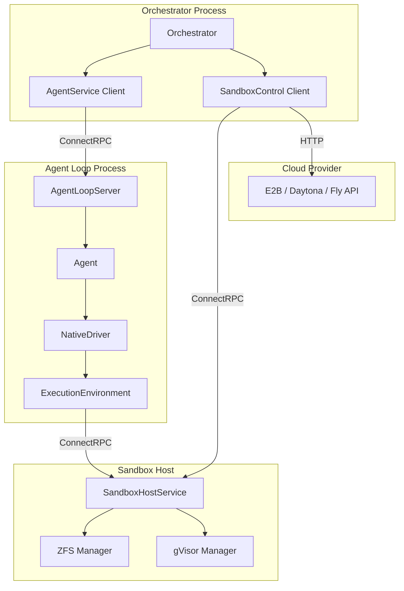
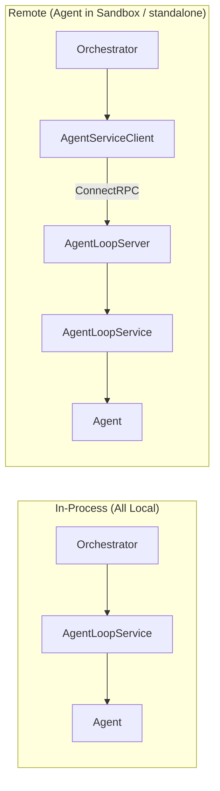
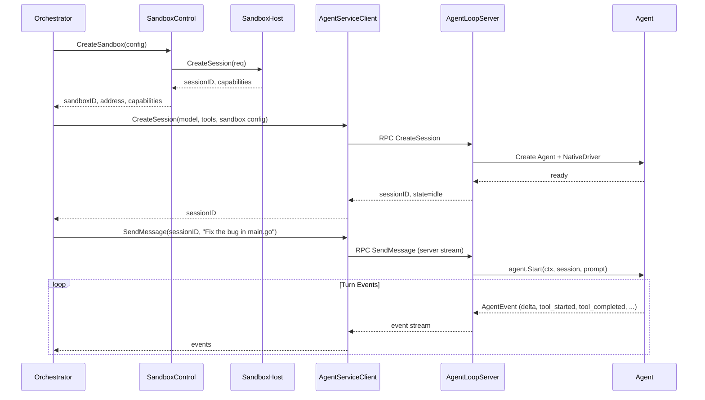
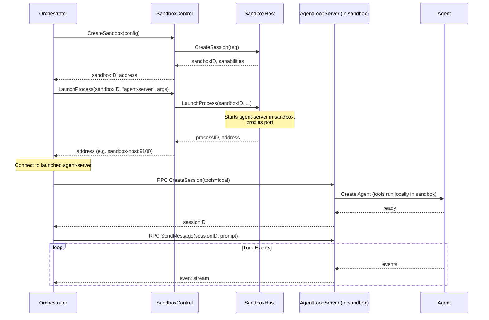

# 18: Agent Loop RPC Service

**Status:** Draft
**Depends on:** 05-agent, 13-rpc-layer, 11-sandbox-host-service.add01
**Depended on by:** Orchestrator application (future)
**Scope:** Wrap the existing agent loop with a ConnectRPC interface so it can run as a standalone service, deployable anywhere. Adds a SandboxControl abstraction for unified sandbox lifecycle management across native and cloud providers.

---

## 1. Overview

The agent loop (`internal/agent`) can only run in-process today. This plan adds an RPC interface around it so that an orchestrator (or any client) can create agent sessions, send messages, subscribe to events, and issue steering commands — all over the network.

This is the missing seam between the orchestrator layer and the agent layer in the three-layer architecture. It enables:

- **Agent loop as a standalone process** on any machine
- **Agent loop inside a sandbox** launched by a sandbox-host or cloud provider
- **Agent loop in-process** with the orchestrator (zero-cost — same Go interface, no RPC)

Additionally, this plan introduces the **SandboxControl** interface, which abstracts sandbox lifecycle (create, destroy, pause, resume, launch process) across native and cloud providers. This is the control-plane counterpart to ExecutionEnvironment (which handles tool execution within an already-created sandbox).

### Key Design Principle

The Agent Loop RPC follows the same pattern as the existing Sandbox RPC: a Go interface (`AgentService`) that can be called in-process or over ConnectRPC. The transport is transparent to the caller.

---

## 2. Architecture

### 2.1 Component Diagram



### 2.2 In-Process vs Remote

When agent loop runs in-process with the orchestrator, no RPC is involved — the orchestrator calls `AgentService` methods directly on the in-process implementation. When remote, the orchestrator uses `AgentServiceClient` which wraps ConnectRPC calls.



---

## 3. AgentService Interface

This is the core Go interface. Both the in-process implementation and the RPC server implement it.

```go
// internal/rpc/api/agent.go

// AgentService manages agent loop sessions. Implemented by AgentLoopService
// (in-process) and AgentServiceClient (remote via ConnectRPC).
type AgentService interface {
    // CreateSession initializes a new agent session with the given config.
    // The agent loop is ready to receive prompts after this returns.
    CreateSession(ctx context.Context, req *CreateAgentSessionRequest) (*CreateAgentSessionResponse, error)

    // GetSession returns the current state of a session.
    GetSession(ctx context.Context, req *GetAgentSessionRequest) (*GetAgentSessionResponse, error)

    // SendMessage sends a user message to the agent and begins a new turn.
    // Returns a stream of events for this turn.
    SendMessage(ctx context.Context, req *SendMessageRequest) (AgentEventReceiver, error)

    // Continue resumes the agent without a new user message (e.g., after tool use).
    Continue(ctx context.Context, req *ContinueRequest) (AgentEventReceiver, error)

    // Steer injects a steering instruction into the current turn.
    Steer(ctx context.Context, req *SteerRequest) (*SteerResponse, error)

    // FollowUp queues a follow-up prompt for after the current turn completes.
    FollowUp(ctx context.Context, req *FollowUpRequest) (*FollowUpResponse, error)

    // Abort requests the agent to stop the current turn.
    Abort(ctx context.Context, req *AbortRequest) (*AbortResponse, error)

    // SubscribeEvents opens a persistent event stream for a session.
    // Unlike SendMessage/Continue (which stream events for one turn),
    // this streams ALL events for the session lifecycle.
    SubscribeEvents(ctx context.Context, req *SubscribeEventsRequest) (AgentEventReceiver, error)

    // DestroySession tears down a session and releases all resources.
    DestroySession(ctx context.Context, req *DestroyAgentSessionRequest) (*DestroyAgentSessionResponse, error)
}
```

### 3.1 Request/Response Types

```go
// internal/rpc/api/agent_types.go

type CreateAgentSessionRequest struct {
    SessionID    string            // Optional; generated if empty
    Driver       string            // Driver name (e.g., "native")
    Model        string            // Model ID (e.g., "claude-sonnet-4-6")
    Provider     string            // Provider API name (e.g., "anthropic")
    SystemPrompt string            // System prompt for the agent
    Tools        []string          // Tool names to enable (e.g., ["bash", "read_file", "edit_file"])
    APIKey       string            // LLM provider API key
    Metadata     map[string]any    // Arbitrary session metadata

    // Tool execution config
    ToolEnvironment ToolEnvironmentConfig
}

type ToolEnvironmentConfig struct {
    // "local" — tools run in-process with agent loop
    // "sandbox" — tools dispatch to sandbox-host via RPC
    Type string

    // For Type="sandbox": address of sandbox-host
    SandboxHostAddr string

    // For Type="sandbox": sandbox session ID (pre-created by orchestrator via SandboxControl)
    SandboxSessionID string

    // For Type="local": root directory for file operations
    LocalRootDir string
}

type CreateAgentSessionResponse struct {
    SessionID string
    State     string // AgentState as string
}

type GetAgentSessionRequest struct {
    SessionID string
}

type GetAgentSessionResponse struct {
    SessionID       string
    State           string
    Metrics         SessionMetrics
    ConversationLen int
}

type SendMessageRequest struct {
    SessionID string
    Message   string
}

type ContinueRequest struct {
    SessionID string
}

type SteerRequest struct {
    SessionID string
    Message   string
}

type SteerResponse struct{}

type FollowUpRequest struct {
    SessionID string
    Message   string
}

type FollowUpResponse struct{}

type AbortRequest struct {
    SessionID string
    Reason string
}

type AbortResponse struct{}

type SubscribeEventsRequest struct {
    SessionID string
}

type DestroyAgentSessionRequest struct {
    SessionID string
}

type DestroyAgentSessionResponse struct{}

type SessionMetrics struct {
    TurnsStarted      uint64
    TurnsCompleted    uint64
    MessagesAppended  uint64
    ToolCallsStarted  uint64
    ToolCallsFinished uint64
    Errors            uint64
}
```

---

## 4. AgentLoopService (In-Process Implementation)

```go
// internal/agent/service.go

// AgentLoopService implements api.AgentService by managing Agent instances
// directly in-process. This is the real implementation — the RPC server
// and client are just transport wrappers around this interface.
type AgentLoopService struct {
    mu       sync.Mutex
    sessions map[string]*managedSession
    events   *AgentEventServer  // Fan-out event bus for all sessions
}

type managedSession struct {
    agent  *Agent
    config CreateAgentSessionRequest
    cancel context.CancelFunc
}
```

**CreateSession flow:**
1. Generate session ID if not provided
2. Resolve model from registry (`ai.GetModel(provider, modelID)`)
3. Resolve driver from registry (`agent.NewDriver(driverName, driverConfig)`)
4. Build ExecutionEnvironment based on ToolEnvironmentConfig:
   - `Type="local"` → `environment.NewLocalEnvironment(rootDir)`
   - `Type="sandbox"` → `native.NewNativeSandboxEnvironment(sandboxClient, config)`
5. Build AgentTool list from tool names + environment
6. Create `Agent` with driver, store in sessions map
7. Return session ID and initial state

**SendMessage flow:**
1. Look up session by ID
2. Call `agent.Prompt(ctx, message)` (or `agent.Start(ctx, session, message)` for first message)
3. Return event stream (subscriber channel bridged to AgentEventReceiver)

**Continue flow:**
1. Look up session
2. Call `agent.Continue(ctx)`
3. Return event stream

**Steer/FollowUp/Abort:**
1. Look up session
2. Call corresponding `agent.Steer(msg)` / `agent.FollowUp(msg)` / `agent.Abort(reason)`
3. Return immediately (these are enqueue operations)

**DestroySession:**
1. Look up session
2. Call `agent.Stop(ctx)`
3. Cancel session context
4. Remove from sessions map

---

## 5. RPC Transport

### 5.1 ConnectRPC Procedures

Following the existing pattern in `internal/rpc/transport/server.go`:

```go
// New procedures added to transport server
ProcedureAgentCreateSession   = "/rpc.v1.AgentService/CreateSession"
ProcedureAgentGetSession      = "/rpc.v1.AgentService/GetSession"
ProcedureAgentSendMessage     = "/rpc.v1.AgentService/SendMessage"      // server stream
ProcedureAgentContinue        = "/rpc.v1.AgentService/Continue"          // server stream
ProcedureAgentSteer           = "/rpc.v1.AgentService/Steer"            // unary
ProcedureAgentFollowUp        = "/rpc.v1.AgentService/FollowUp"        // unary
ProcedureAgentAbort           = "/rpc.v1.AgentService/Abort"            // unary
ProcedureAgentSubscribeEvents = "/rpc.v1.AgentService/SubscribeEvents"  // server stream
ProcedureAgentDestroySession  = "/rpc.v1.AgentService/DestroySession"   // unary
```

**Handler types:**
- CreateSession, GetSession, Steer, FollowUp, Abort, DestroySession → **unary** (`connect.NewUnaryHandlerSimple`)
- SendMessage, Continue, SubscribeEvents → **server stream** (`connect.NewServerStreamHandler`)

### 5.2 AgentRPCServer

```go
// internal/rpc/server/agent_server.go

type AgentRPCServer struct {
    service api.AgentService  // Delegates to AgentLoopService
}

func NewAgentRPCServer(service api.AgentService) *AgentRPCServer
```

Follows same delegation pattern as SandboxServer: validate → delegate → map errors → return.

### 5.3 AgentServiceClient

```go
// internal/rpc/client/agent_client.go

// AgentServiceClient implements api.AgentService over ConnectRPC.
type AgentServiceClient struct {
    baseURL    string
    httpClient connect.HTTPClient
    opts       []connect.ClientOption
}

func NewAgentServiceClient(baseURL string, opts ...connect.ClientOption) *AgentServiceClient
```

Each method creates a ConnectRPC client for the corresponding procedure and makes the call. Server stream methods return an `AgentEventReceiver` that wraps the ConnectRPC stream.

---

## 6. SandboxControl Interface

This is the orchestrator-level abstraction for sandbox lifecycle. It's separate from ExecutionEnvironment (which handles tool execution within a sandbox).

```go
// internal/sandbox/control/control.go

// SandboxControl manages sandbox lifecycle. The orchestrator uses this
// to create/destroy sandboxes and launch processes inside them.
type SandboxControl interface {
    // CreateSandbox provisions a new sandbox environment.
    // Returns the sandbox ID and what capabilities it supports.
    CreateSandbox(ctx context.Context, req CreateSandboxRequest) (*CreateSandboxResponse, error)

    // DestroySandbox tears down a sandbox and releases all resources.
    DestroySandbox(ctx context.Context, sandboxID string) error

    // LaunchProcess starts a process inside an existing sandbox.
    // Used to deploy the agent loop server inside a sandbox.
    // Returns connectivity info (address, port) for the launched process.
    LaunchProcess(ctx context.Context, req LaunchProcessRequest) (*LaunchProcessResponse, error)

    // PauseSandbox pauses a sandbox (provider-specific semantics).
    PauseSandbox(ctx context.Context, sandboxID string) error

    // ResumeSandbox resumes a paused sandbox.
    ResumeSandbox(ctx context.Context, sandboxID string) error

    // Capabilities returns what this provider supports.
    Capabilities() SandboxCapabilities
}

type CreateSandboxRequest struct {
    Labels   map[string]string
    Template string            // Provider-specific template/base image
    Resources ResourceSpec     // CPU, memory
}

type CreateSandboxResponse struct {
    SandboxID    string
    Address      string            // How to reach this sandbox (host:port or URL)
    Capabilities SandboxCapabilities
}

type LaunchProcessRequest struct {
    SandboxID  string
    Binary     string            // Path to binary (or command name)
    Args       []string
    Env        map[string]string
    ExposePort int               // Port the process will listen on
}

type LaunchProcessResponse struct {
    ProcessID string
    Address   string   // How to reach the launched process (host:port)
}

type SandboxCapabilities struct {
    Snapshots bool
    Rollback  bool
    Pause     bool
    DeepPause bool   // ZFS-to-S3 style cold storage (future)
}
```

### 6.1 Native Implementation

```go
// internal/sandbox/control/native/native.go

// NativeSandboxControl wraps our sandbox-host RPC.
type NativeSandboxControl struct {
    sandboxClient api.SandboxService
    logger        *slog.Logger
}
```

- `CreateSandbox` → calls `sandboxClient.CreateSession()`
- `DestroySandbox` → calls `sandboxClient.DestroySession()`
- `LaunchProcess` → **new capability needed on sandbox-host** — executes a long-running process inside a sandbox's filesystem, exposes its port. This is different from `ExecuteTool` (which runs a tool call and returns). Implementation detail: sandbox-host runs the process in gVisor (or directly if no gVisor), bind-mounting the sandbox's ZFS dataset, and proxies the exposed port.
- `PauseSandbox` → calls `sandboxClient.PauseSession()`
- `ResumeSandbox` → calls `sandboxClient.ResumeSession()`

### 6.2 Cloud Provider Implementations (Future)

Stub interfaces for Batch 6. Not implemented in this plan:

- `E2BSandboxControl` — wraps E2B REST API
- `DaytonaSandboxControl` — wraps Daytona REST API
- `FlySandboxControl` — wraps Fly Machines API

---

## 7. Agent Loop Server Binary

### 7.1 Standalone Mode

```go
// cmd/agent-server/main.go (or a subcommand of an existing binary)

func main() {
    // Parse flags: --addr, --sandbox-host, --root-dir, etc.
    // Create AgentLoopService
    // Create AgentRPCServer wrapping the service
    // Register procedures on transport.Server
    // ListenAndServe
}
```

### 7.2 Embedded Mode

For in-process use (All Local), no binary needed. The orchestrator creates `AgentLoopService` directly:

```go
// In orchestrator code:
agentService := agent.NewAgentLoopService(eventServer)
// Use agentService directly — same interface as the RPC client
```

### 7.3 Sandbox-Launched Mode

When the sandbox-host launches the agent loop inside a sandbox via `LaunchProcess`:

1. Sandbox-host starts the `agent-server` binary inside the sandbox (gVisor container or directly)
2. The binary listens on a configured port
3. Sandbox-host proxies that port (or returns the container's network address)
4. Orchestrator connects to the returned address via `AgentServiceClient`

The agent-server binary runs tools locally within the sandbox (using `LocalEnvironment`). From its perspective, it's just Mode 1 — all local. The sandbox boundary is invisible to it.

---

## 8. Connectivity: How Orchestrator Finds Agent Loop

### 8.1 In-Process

No discovery needed. Direct Go function calls.

### 8.2 Standalone Process

Operator configures the address. The orchestrator is told where agent-server is running (flag, config file, service discovery).

### 8.3 Launched Inside Sandbox

The `SandboxControl.LaunchProcess()` call returns the address in `LaunchProcessResponse.Address`. The orchestrator uses this to create an `AgentServiceClient`.

For native sandbox-host, the proxy approach:
- Agent-server listens on a port inside the sandbox/container
- Sandbox-host proxies this port on its own address (e.g., `sandbox-host:9100` → container port `8080`)
- `LaunchProcessResponse.Address` = `sandbox-host-addr:9100`

This means the orchestrator only needs to reach the sandbox-host, not the container directly. The sandbox-host acts as a reverse proxy for launched processes.

---

## 9. Sequence Diagrams

### 9.1 Create Agent Session (Remote, Tools in Sandbox)



### 9.2 Agent in Sandbox (Launched by Orchestrator)



---

## 10. Package Structure

```
internal/
  agent/
    service.go          # AgentLoopService (in-process implementation of AgentService)
    service_test.go
  rpc/
    api/
      agent.go          # AgentService interface
      agent_types.go    # Request/response types
    server/
      agent_server.go   # AgentRPCServer (ConnectRPC handler)
      agent_server_test.go
    client/
      agent_client.go   # AgentServiceClient (ConnectRPC client)
      agent_client_test.go
    transport/
      server.go         # Updated: register agent procedures
  sandbox/
    control/
      control.go        # SandboxControl interface + types
      native/
        native.go       # NativeSandboxControl (wraps sandbox-host RPC)
        native_test.go

cmd/
  agent-server/
    main.go             # Standalone agent loop server binary
```

---

## 11. Testing Strategy

### 11.1 Unit Tests

**AgentLoopService:**
- CreateSession with valid config → session created, state=idle
- CreateSession with invalid model → error
- SendMessage → events stream, turn completes
- Steer/FollowUp/Abort → control commands enqueued
- DestroySession → agent stopped, resources released
- Concurrent operations on same session → serialized correctly
- Multiple sessions → independent lifecycles

**AgentRPCServer:**
- Delegation to service (mirrors sandbox server test pattern)
- Error mapping
- Request validation

**AgentServiceClient:**
- Round-trip through in-memory ConnectRPC server
- Event stream consumption
- Connection failure handling

### 11.2 Integration Tests

**In-process agent loop:**
- Full conversation: create → send message → receive events → tool calls → response → destroy
- Multi-turn with follow-up
- Steering during active turn
- Abort during streaming

**Remote agent loop (via loopback RPC):**
- Same scenarios as in-process but over ConnectRPC
- Verify event stream fidelity (no dropped events)
- Connection drop during streaming → graceful recovery

**SandboxControl + AgentService combined:**
- Create sandbox → create agent session with sandbox tools → send message → tools execute in sandbox → verify results

### 11.3 Harness Tests

- Property test: any sequence of valid operations produces valid state transitions
- Stress test: N concurrent sessions, M concurrent messages
- Benchmark: RPC overhead vs in-process (quantify the cost of the network hop)

---

## 12. Implementation Order

1. **AgentService interface + request/response types** (`internal/rpc/api/agent.go`, `agent_types.go`)
2. **AgentLoopService** (`internal/agent/service.go`) — in-process implementation
3. **Unit tests for AgentLoopService** with mock driver
4. **AgentRPCServer** (`internal/rpc/server/agent_server.go`) — ConnectRPC handlers
5. **Agent procedures in transport server** (`internal/rpc/transport/server.go`)
6. **AgentServiceClient** (`internal/rpc/client/agent_client.go`) — ConnectRPC client
7. **Integration tests** — in-process and remote round-trip
8. **SandboxControl interface** (`internal/sandbox/control/control.go`)
9. **NativeSandboxControl** with LaunchProcess on sandbox-host
10. **cmd/agent-server binary**
11. **End-to-end test** — orchestrator → agent-server → sandbox-host

---

## 13. Connected Components

### 13.1 Modified Seams

| Seam | Change | Impact |
|------|--------|--------|
| `internal/rpc/transport/server.go` | Add agent service procedures | New HTTP handlers registered |
| `internal/rpc/api/types.go` | Add AgentService interface + types | New file, no breaking changes |
| `cmd/sandbox-host` | Add LaunchProcess RPC endpoint | New capability on existing binary |

### 13.2 New Seams

| Seam | Description |
|------|-------------|
| `AgentService` interface | Contract between orchestrator and agent loop |
| `SandboxControl` interface | Contract between orchestrator and sandbox lifecycle |
| `LaunchProcess` on sandbox-host | New RPC for starting long-running processes in sandboxes |

### 13.3 Import Flow

```
cmd/agent-server → internal/agent (AgentLoopService)
                  → internal/rpc/transport (Server)
                  → internal/rpc/server (AgentRPCServer)

internal/rpc/server/agent_server → internal/rpc/api (AgentService, types)
internal/rpc/client/agent_client → internal/rpc/api (AgentService, types)
internal/agent/service → internal/agent (Agent, Driver)
                       → internal/rpc/api (AgentService)
                       → internal/sandbox/environment (ExecutionEnvironment)

internal/sandbox/control/native → internal/rpc/api (SandboxService)
                                → internal/sandbox/control (SandboxControl)
```

---

## 14. Open Questions

1. **Agent-server binary vs subcommand**: Should `agent-server` be its own binary in `cmd/agent-server/`, or a subcommand of an existing binary (e.g., `sandbox-host agent-serve`)? Separate binary is simpler; subcommand reduces deployment artifacts.

2. **Port proxying on sandbox-host**: When sandbox-host launches a process in a gVisor container, how does port proxying work? gVisor supports port forwarding, but the specifics need investigation. If no gVisor, the process runs directly on the host and listens on a port — no proxying needed.

3. **API key handling**: The `CreateAgentSessionRequest` includes an `APIKey` field. How is this secured in transit? ConnectRPC over TLS handles transport security, but should we support additional encryption or credential injection mechanisms?

4. **Session recovery after agent-server restart**: If the agent-server process crashes and restarts, can it recover in-flight sessions? The agent's conversation log is in memory. Options: persist to disk, or accept that a crash loses the current session (orchestrator can retry).
