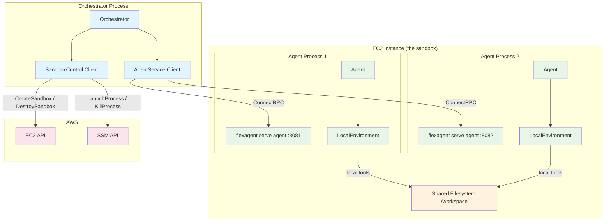
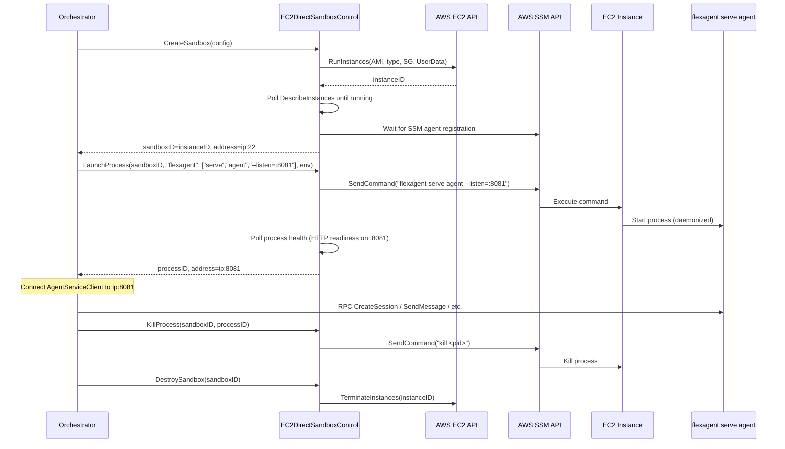
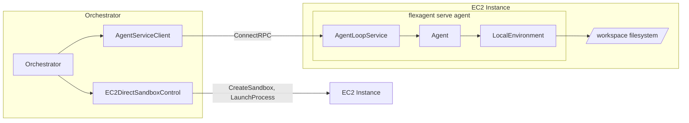

# 19: EC2 Direct Adapter

**Status:** Draft
**Depends on:** 18-agent-loop-rpc (SandboxControl interface), 11-sandbox-host-service.add01 (ExecutionEnvironment interface)
**Depended on by:** Orchestrator application (future), multi-agent collaboration features
**Scope:** Implement an EC2 Direct adapter (`EC2DirectSandboxControl`) that manages raw EC2 instances as agent execution environments. This is the "D2: EC2 Lightweight Sandbox" shape from the cloud-sandbox-providers shaping doc, now renamed to EC2 Direct. It provides no per-agent isolation -- multiple agents share one EC2 instance on a shared filesystem.
**Shaping source:** docs/shaping/cloud-sandbox-providers.md (Shape D2)

---

## 1. Overview

EC2 Direct is a SandboxControl adapter that provisions and manages raw EC2 instances as agent environments. Unlike the native sandbox (which uses ZFS + gVisor for per-agent isolation), EC2 Direct treats the entire EC2 instance as a single shared workspace. Think of it as "what you'd do on your laptop but in the cloud" -- multiple agents run on the same OS, share the same filesystem, and execute tools locally.

### Purpose

- **Multi-agent shared workspace:** Multiple agents collaborate on a shared codebase, each running as a `flexagent serve agent` process on the same instance.
- **Simple cloud deployment:** No ZFS, no gVisor, no sandbox-host service. Just an EC2 instance with `flexagent` installed.
- **Cost-efficient:** One instance shared across N agents. No per-agent overhead.

### Relationship to Other Adapters

```
NativeSandboxControl     -- Full isolation (ZFS + gVisor), richest capabilities
EC2DirectSandboxControl  -- No isolation, shared OS, simplest cloud option  <-- THIS PLAN
E2BSandboxControl        -- 3rd party, per-sandbox isolation, 24h limit (future)
DaytonaSandboxControl    -- 3rd party, per-sandbox isolation, lossy pause (future)
FlySandboxControl        -- 3rd party, per-VM isolation, no lifetime limit (future)
```

EC2 Direct sits at the opposite end of the capability spectrum from NativeSandboxControl. It trades isolation and snapshots for simplicity and shared-filesystem collaboration. It is intentionally minimal.

### Key Design Decision: No Custom ExecutionEnvironment

Since agents run ON the EC2 instance (launched via `flexagent serve agent`), they use `LocalEnvironment` for tool execution. Tools execute in the same process/filesystem as the agent. The agent does not know or care that it is running on an EC2 instance -- from its perspective, it is running locally.

This means EC2 Direct does NOT need a custom `ExecutionEnvironment` implementation. `EC2DirectSandboxControl` handles instance lifecycle and process management. `LocalEnvironment` handles tool execution inside the agent process.

---

## 2. Architecture

### 2.1 Component Diagram



### 2.2 Lifecycle Flow



---

## 3. EC2DirectSandboxControl

### 3.1 Struct and Constructor

```go
// internal/sandbox/control/ec2direct/ec2direct.go

// EC2DirectSandboxControl manages raw EC2 instances as agent environments.
// Multiple agents share one instance without isolation.
type EC2DirectSandboxControl struct {
    ec2Client    EC2API         // Interface wrapping AWS EC2 SDK calls
    ssmClient    SSMAPI         // Interface wrapping AWS SSM SDK calls
    logger       *slog.Logger
    config       Config

    mu           sync.Mutex
    instances    map[string]*instanceState  // sandboxID -> state
}

type Config struct {
    // AMI to launch instances from. Should have flexagent pre-installed.
    AMIID            string

    // Default instance type (e.g., "t3.medium", "m5.xlarge").
    DefaultInstanceType string

    // Subnet ID for instance placement.
    SubnetID         string

    // Security group IDs to attach.
    SecurityGroupIDs []string

    // IAM instance profile ARN (for SSM access and any AWS API calls from the instance).
    InstanceProfileARN string

    // Key pair name for SSH fallback (optional; SSM is primary).
    KeyPairName      string

    // EBS volume size in GiB for the root volume.
    RootVolumeSizeGB int

    // EBS volume type (default "gp3").
    RootVolumeType   string

    // UserData script template. Executed on instance boot.
    // Used to configure workspace directory, install dependencies, etc.
    UserDataTemplate string

    // Tags applied to all resources created by this adapter.
    Tags             map[string]string

    // Timeouts
    InstanceReadyTimeout  time.Duration // Max wait for instance + SSM ready (default 3min)
    ProcessReadyTimeout   time.Duration // Max wait for launched process to be healthy (default 30s)
}

type instanceState struct {
    instanceID  string
    publicIP    string
    privateIP   string
    state       string // "running", "stopped", "terminated"
    processes   map[string]*processState // processID -> state
}

type processState struct {
    processID  string
    pid        int
    binary     string
    args       []string
    port       int
    status     control.ProcessStatus
}
```

### 3.2 CreateSandbox

Provisions a new EC2 instance. The instance IS the sandbox.

```go
func (c *EC2DirectSandboxControl) CreateSandbox(ctx context.Context, req control.CreateSandboxRequest) (*control.CreateSandboxResponse, error)
```

**Steps:**

1. Determine instance type from `req.Resources` (map CPU/memory to EC2 instance type) or fall back to `Config.DefaultInstanceType`.
2. Build `RunInstancesInput`:
   - AMI: `Config.AMIID` (or `req.Template` if provided as an AMI ID override)
   - Instance type: determined in step 1
   - Subnet: `Config.SubnetID`
   - Security groups: `Config.SecurityGroupIDs`
   - IAM instance profile: `Config.InstanceProfileARN`
   - Key pair: `Config.KeyPairName` (if set)
   - EBS root volume: size from config, type from config
   - UserData: rendered from `Config.UserDataTemplate` with sandbox metadata
   - Tags: merge `Config.Tags` + `req.Labels` + `{"flex-sandbox-id": sandboxID}`
3. Call `ec2Client.RunInstances(ctx, input)`.
4. Extract instance ID. Generate sandbox ID (use instance ID directly).
5. Poll `ec2Client.DescribeInstances` until instance state is "running" and has an IP address.
6. Poll SSM for instance registration (instance must appear as a managed instance in SSM). This confirms the SSM agent on the instance is ready to receive commands.
7. Optionally run a readiness check via SSM (e.g., `flexagent version`) to confirm the binary is available on the instance.
8. Store instance state in `c.instances`.
9. Return `CreateSandboxResponse` with `SandboxID = instanceID`, `Address = publicIP` (or privateIP depending on network config).

**UserData template** is a shell script that runs on first boot. A typical template:

```bash
#!/bin/bash
set -euo pipefail

# Create workspace directory
mkdir -p /workspace
chown ubuntu:ubuntu /workspace

# flexagent binary is pre-installed in the AMI
# Verify it's available
/usr/local/bin/flexagent version

# Signal readiness (optional: write a marker file)
touch /var/run/flex-sandbox-ready
```

### 3.3 DestroySandbox

Terminates the EC2 instance and releases all resources.

```go
func (c *EC2DirectSandboxControl) DestroySandbox(ctx context.Context, sandboxID string) error
```

**Steps:**

1. Look up instance state from `c.instances`.
2. Call `ec2Client.TerminateInstances(ctx, instanceID)`.
3. Remove instance from `c.instances`.
4. Return nil (termination is fire-and-forget; AWS handles cleanup).

No need to explicitly kill processes -- instance termination kills everything.

### 3.4 LaunchProcess

Starts a long-running process on the EC2 instance via SSM. This is how agents are launched.

```go
func (c *EC2DirectSandboxControl) LaunchProcess(ctx context.Context, req control.LaunchProcessRequest) (*control.LaunchProcessResponse, error)
```

**Steps:**

1. Look up instance state from `c.instances`.
2. Build the command string from `req.Binary` and `req.Args`.
3. Build environment variable exports from `req.Env` (including API keys like `ANTHROPIC_API_KEY`).
4. Construct a daemonized command via SSM SendCommand:
   ```bash
   # Set environment variables
   export ANTHROPIC_API_KEY='...'
   export OPENAI_API_KEY='...'
   # Launch process in background, redirect output to log file
   nohup /usr/local/bin/flexagent serve agent --listen=:PORT --root-dir=/workspace \
       > /var/log/flex-agent-PROCESSID.log 2>&1 &
   echo $!  # Return PID
   ```
5. Call `ssmClient.SendCommand(ctx, instanceID, command)`.
6. Wait for command completion. Parse PID from stdout.
7. Generate process ID (UUID or use PID).
8. Poll the launched process for readiness:
   - HTTP GET to `http://instanceIP:PORT/health` (or equivalent readiness endpoint)
   - Retry with backoff until `Config.ProcessReadyTimeout`
9. Store process state in instance's `processes` map.
10. Return `LaunchProcessResponse` with `ProcessID`, `Address = instanceIP:PORT`, `Status = ProcessRunning`.

**Port allocation:** `req.ExposePort` specifies the port the process should listen on. The orchestrator is responsible for choosing non-conflicting ports when launching multiple agents on the same instance (e.g., 8081, 8082, 8083, ...). The adapter passes the port through to the command arguments.

**Security group requirement:** The security group attached to the instance must allow inbound traffic on the agent RPC ports (or a range like 8080-8100) from the orchestrator's network.

### 3.5 KillProcess

Terminates a previously launched process via SSM.

```go
func (c *EC2DirectSandboxControl) KillProcess(ctx context.Context, req control.KillProcessRequest) error
```

**Steps:**

1. Look up process state from instance's `processes` map.
2. Determine signal (default SIGTERM if `req.Signal == 0`).
3. Send SSM command: `kill -SIGNAL PID`.
4. Optionally wait briefly and verify process exited (send `kill -0 PID` to check).
5. Update process state to `ProcessExited`.

### 3.6 GetProcessStatus

Checks whether a launched process is still running via SSM.

```go
func (c *EC2DirectSandboxControl) GetProcessStatus(ctx context.Context, req control.GetProcessStatusRequest) (*control.GetProcessStatusResponse, error)
```

**Steps:**

1. Look up process state from instance's `processes` map.
2. Send SSM command: `kill -0 PID && echo "running" || echo "exited"`.
3. If exited, send: `wait PID 2>/dev/null; echo $?` to get exit code (may not work for non-child processes; alternative: check `/proc/PID/status`).
4. Return `GetProcessStatusResponse` with current status and exit code if exited.

**Optimization:** Cache status locally and only poll SSM if the cached status is `ProcessRunning`. Once a process is `ProcessExited`, the status is stable.

### 3.7 PauseSandbox

Stops the EC2 instance. This is a lossy pause -- all processes are killed, but EBS volumes (filesystem) are preserved.

```go
func (c *EC2DirectSandboxControl) PauseSandbox(ctx context.Context, sandboxID string) error
```

**Steps:**

1. Look up instance state.
2. Call `ec2Client.StopInstances(ctx, instanceID)`.
3. Update all process states to `ProcessExited` (processes do not survive stop).
4. Update instance state to "stopped".

**Important:** Callers must understand that pause is lossy. The `Capabilities()` method reports `Pause: true` but the `DeepPause` flag is false, indicating that process state is NOT preserved. The orchestrator must re-launch agents after resume.

### 3.8 ResumeSandbox

Starts a previously stopped instance. The filesystem is intact but all processes must be re-launched.

```go
func (c *EC2DirectSandboxControl) ResumeSandbox(ctx context.Context, sandboxID string) error
```

**Steps:**

1. Look up instance state.
2. Call `ec2Client.StartInstances(ctx, instanceID)`.
3. Poll `DescribeInstances` until instance state is "running" (10-30 seconds).
4. Wait for SSM agent registration (the SSM agent restarts on instance start).
5. Update instance state to "running".
6. Note: process map is cleared -- caller must re-launch any agents via `LaunchProcess`.

### 3.9 Capabilities

```go
func (c *EC2DirectSandboxControl) Capabilities() control.SandboxCapabilities {
    return control.SandboxCapabilities{
        Snapshots:     false,  // No ZFS, no instant snapshots
        Rollback:      false,  // No rollback capability
        Pause:         true,   // EC2 stop/start (lossy -- processes die, EBS preserved)
        LaunchProcess: true,   // SSM-based process launch
        DeepPause:     false,  // No cold storage / deep archival
        // ConcurrentSandboxes: 0 means unlimited (bounded by AWS account limits)
        // MaxSandboxDuration: 0 means unlimited
    }
}
```

---

## 4. ExecutionEnvironment: Use LocalEnvironment

Agents launched on an EC2 Direct instance use `LocalEnvironment` for tool execution. No custom `ExecutionEnvironment` is needed.

The flow:

1. Orchestrator calls `EC2DirectSandboxControl.CreateSandbox()` to provision an instance.
2. Orchestrator calls `EC2DirectSandboxControl.LaunchProcess()` to start `flexagent serve agent` on the instance.
3. The `flexagent serve agent` process creates an `AgentLoopService` with `ToolEnvironmentConfig{Type: ToolEnvLocal, LocalRootDir: "/workspace"}`.
4. The `AgentLoopService` creates a `LocalEnvironment` for each agent session.
5. Tools (bash, read, write, edit, grep, glob) execute locally on the instance's filesystem.



This is the same architecture as running `flexagent serve agent` on a developer's laptop, except the "laptop" is an EC2 instance provisioned programmatically.

---

## 5. AWS Integration

### 5.1 AWS SDK Interfaces

The adapter uses thin Go interfaces wrapping the AWS SDK v2 to enable unit testing with mocks.

```go
// internal/sandbox/control/ec2direct/aws.go

// EC2API wraps the subset of EC2 SDK methods used by this adapter.
type EC2API interface {
    RunInstances(ctx context.Context, input *ec2.RunInstancesInput, opts ...func(*ec2.Options)) (*ec2.RunInstancesOutput, error)
    TerminateInstances(ctx context.Context, input *ec2.TerminateInstancesInput, opts ...func(*ec2.Options)) (*ec2.TerminateInstancesOutput, error)
    StopInstances(ctx context.Context, input *ec2.StopInstancesInput, opts ...func(*ec2.Options)) (*ec2.StopInstancesOutput, error)
    StartInstances(ctx context.Context, input *ec2.StartInstancesInput, opts ...func(*ec2.Options)) (*ec2.StartInstancesOutput, error)
    DescribeInstances(ctx context.Context, input *ec2.DescribeInstancesInput, opts ...func(*ec2.Options)) (*ec2.DescribeInstancesOutput, error)
}

// SSMAPI wraps the subset of SSM SDK methods used by this adapter.
type SSMAPI interface {
    SendCommand(ctx context.Context, input *ssm.SendCommandInput, opts ...func(*ssm.Options)) (*ssm.SendCommandOutput, error)
    GetCommandInvocation(ctx context.Context, input *ssm.GetCommandInvocationInput, opts ...func(*ssm.Options)) (*ssm.GetCommandInvocationOutput, error)
    DescribeInstanceInformation(ctx context.Context, input *ssm.DescribeInstanceInformationInput, opts ...func(*ssm.Options)) (*ssm.DescribeInstanceInformationOutput, error)
}
```

### 5.2 SSM vs SSH

**Recommendation: Use SSM (AWS Systems Manager) as the primary remote execution mechanism.**

SSM advantages over SSH:
- **No key management.** SSH requires distributing and managing key pairs. SSM uses IAM roles -- the instance profile grants SSM access, and the orchestrator uses its own AWS credentials.
- **No inbound port needed.** SSM uses outbound HTTPS from the instance to the SSM service. No need to open port 22 in the security group.
- **Audit trail.** SSM Run Command invocations are logged in CloudTrail automatically.
- **No bastion/VPN required.** Works across VPCs and even from the public internet (the orchestrator just needs AWS API access).

SSM disadvantages:
- **Latency.** SSM SendCommand has higher latency than SSH (~1-3s per command invocation vs ~100ms for SSH).
- **Not interactive.** SSM SendCommand is fire-and-forget (run command, get output). Not suitable for interactive terminal sessions.
- **Output size limits.** SSM command output is capped at 24KB inline (larger outputs must go via S3).

For EC2 Direct, the latency trade-off is acceptable because:
- `LaunchProcess` is infrequent (once per agent, not per tool call).
- `KillProcess` and `GetProcessStatus` are infrequent.
- Tool execution does NOT go through SSM -- it goes through the agent's `LocalEnvironment` via ConnectRPC.

**SSH fallback:** If SSM latency proves problematic or if SSM is unavailable in a deployment, the adapter can fall back to SSH via the `Config.KeyPairName` field. This is an implementation detail -- the `SandboxControl` interface is agnostic to the remote execution mechanism.

### 5.3 Security Groups

The EC2 instance needs the following inbound rules:

| Port Range | Protocol | Source | Purpose |
|-----------|----------|--------|---------|
| 8080-8100 | TCP | Orchestrator SG / CIDR | Agent RPC endpoints (one per agent) |

No SSH port (22) is needed if using SSM exclusively.

Outbound rules:
- Allow all outbound (default). Required for agents to call LLM provider APIs (Anthropic, OpenAI, Google) and for the SSM agent to connect to the SSM service.

The security group IDs are provided via `Config.SecurityGroupIDs`. The adapter does NOT create or modify security groups -- they are pre-provisioned as part of the infrastructure setup.

### 5.4 IAM Instance Profile

The instance profile must include:

- **SSM managed policy:** `arn:aws:iam::aws:policy/AmazonSSMManagedInstanceCore` -- allows the SSM agent on the instance to communicate with the SSM service.
- **No additional AWS permissions needed** unless the agents themselves need AWS access (e.g., S3 for data storage). Those permissions are application-specific and outside the scope of this adapter.

The orchestrator's IAM role/credentials must include:

- `ec2:RunInstances`, `ec2:TerminateInstances`, `ec2:StopInstances`, `ec2:StartInstances`, `ec2:DescribeInstances`
- `ssm:SendCommand`, `ssm:GetCommandInvocation`, `ssm:DescribeInstanceInformation`
- `iam:PassRole` for the instance profile

### 5.5 UserData and Instance Initialization

The `Config.UserDataTemplate` is a bash script template that runs on first boot via cloud-init. It should:

1. Create the shared workspace directory (`/workspace`).
2. Set ownership/permissions.
3. Verify `flexagent` binary is available (pre-installed in AMI).
4. Optionally clone a git repository into the workspace.
5. Write a readiness marker file.

The template supports Go `text/template` variables substituted at CreateSandbox time:

- `{{.SandboxID}}` -- the sandbox/instance ID
- `{{.Labels}}` -- labels from the CreateSandbox request (as key=value pairs)
- `{{.WorkspaceDir}}` -- workspace directory path (default `/workspace`)

### 5.6 AMI Requirements

The AMI used by EC2 Direct must have:

- **Ubuntu LTS** (22.04 or 24.04) as the base OS.
- **SSM agent** installed and configured to start on boot (included by default in AWS-published Ubuntu AMIs).
- **`flexagent` binary** pre-installed at `/usr/local/bin/flexagent`.
- **Git, common build tools** pre-installed for agent tool execution.

AMI creation is outside the scope of this adapter. A Packer template or similar tool should be used to build the AMI. The AMI ID is passed via `Config.AMIID`.

---

## 6. Instance Configuration

### 6.1 Instance Type Selection

The adapter maps `CreateSandboxRequest.Resources` to an EC2 instance type:

| CPU (approx) | Memory (approx) | Instance Type |
|-------------|-----------------|---------------|
| 1-2 vCPU    | <= 4 GiB        | t3.medium     |
| 2-4 vCPU    | <= 8 GiB        | t3.xlarge     |
| 4-8 vCPU    | <= 16 GiB       | m5.2xlarge    |
| 8-16 vCPU   | <= 32 GiB       | m5.4xlarge    |

If `Resources` is zero-valued, the adapter uses `Config.DefaultInstanceType`.

The mapping is implemented as a simple function, not a configurable table, since the use cases are limited and the mapping can be refined based on experience. Future enhancement: make the mapping configurable.

### 6.2 EBS Volumes

- **Root volume:** gp3, size from `Config.RootVolumeSizeGB` (default 50 GiB). This holds the OS, `flexagent` binary, and shared workspace.
- **No additional volumes** unless the orchestrator explicitly provisions them (outside scope of this adapter).
- EBS volumes persist across instance stop/start, which is what makes the lossy pause useful -- the workspace survives even though processes die.

### 6.3 Network and VPC

- Instance is placed in the subnet specified by `Config.SubnetID`.
- Public IP assignment depends on subnet configuration (public subnet = auto-assign public IP; private subnet = NAT gateway for outbound, no public IP).
- For private subnet deployments, the orchestrator must be able to reach the instance's private IP (via VPN, VPC peering, or same VPC).
- The address returned by `CreateSandbox` and `LaunchProcess` uses the public IP if available, otherwise the private IP.

---

## 7. Multi-Agent Support

### 7.1 Architecture

Multiple agents share one EC2 instance. Each agent is a separate `flexagent serve agent` process listening on a distinct port.

```
EC2 Instance
├── flexagent serve agent --listen=:8081 --root-dir=/workspace   (Agent 1)
├── flexagent serve agent --listen=:8082 --root-dir=/workspace   (Agent 2)
├── flexagent serve agent --listen=:8083 --root-dir=/workspace   (Agent 3)
└── /workspace/                                                  (shared filesystem)
    ├── src/
    ├── tests/
    └── ...
```

### 7.2 Process Management

Each agent is launched via a separate `LaunchProcess` call. The orchestrator is responsible for:

1. **Port allocation:** Choosing non-conflicting ports (e.g., 8081, 8082, ...) for each agent's `--listen` flag. The orchestrator tracks which ports are in use per instance.
2. **Environment isolation:** Each `LaunchProcess` call can inject different environment variables (e.g., different API keys per agent, different system prompts via config files).
3. **Lifecycle management:** Each process has an independent lifecycle. Killing one agent does not affect others.

The adapter does not enforce any limit on the number of agents per instance. Resource contention is managed by choosing an appropriately sized instance type.

### 7.3 Port Allocation Strategy

The orchestrator assigns ports sequentially starting from a base port (e.g., 8081). The adapter does not manage port allocation -- it passes `req.ExposePort` through to the command arguments.

Suggested convention:
- Base port: 8081
- Agent N gets port: 8081 + N - 1
- Security group allows range: 8081-8180 (up to 100 agents per instance)

### 7.4 Shared Filesystem Considerations

All agents share `/workspace`. This is a feature, not a bug -- it enables collaboration patterns like:

- **Pair programming:** Multiple agents edit the same codebase, review each other's changes.
- **Task division:** Agents work on different files/directories within the same project.
- **Shared context:** All agents see the same project state, git history, test results.

**No coordination mechanism is provided by the adapter.** Agents coordinate through:
- Git (branches, commits, merges)
- File conventions (e.g., lock files, status files)
- h2 messaging protocol (for high-level coordination)

This is identical to how multiple developers share a filesystem -- conventions and communication, not enforcement. The lack of enforcement is intentional and consistent with the "what you'd do on your laptop" philosophy.

---

## 8. Package Structure

```
internal/
  sandbox/
    control/
      ec2direct/
        ec2direct.go         # EC2DirectSandboxControl struct, constructor, options
        create.go            # CreateSandbox implementation
        destroy.go           # DestroySandbox implementation
        process.go           # LaunchProcess, KillProcess, GetProcessStatus
        pause.go             # PauseSandbox, ResumeSandbox
        capabilities.go      # Capabilities() method
        aws.go               # EC2API, SSMAPI interfaces
        instance_type.go     # Resource-to-instance-type mapping
        ec2direct_test.go    # Unit tests with mocked AWS APIs
```

### 8.1 Dependencies

**New Go module dependencies:**

- `github.com/aws/aws-sdk-go-v2/service/ec2` -- EC2 API client
- `github.com/aws/aws-sdk-go-v2/service/ssm` -- SSM API client
- `github.com/aws/aws-sdk-go-v2/config` -- AWS SDK configuration loading

These are the only new external dependencies. The adapter uses the same `log/slog`, `sync`, `context`, and `time` standard library packages as the rest of the codebase.

---

## 9. Testing Strategy

### 9.1 Unit Tests (with Mocked AWS API)

All AWS API calls go through the `EC2API` and `SSMAPI` interfaces, which are mockable.

**Test cases:**

- `CreateSandbox` happy path: mock `RunInstances` returns instance ID, mock `DescribeInstances` returns running + IP, mock SSM `DescribeInstanceInformation` returns registered. Verify response fields.
- `CreateSandbox` with instance type mapping: verify different `Resources` values produce correct instance types.
- `CreateSandbox` with template override: `req.Template` overrides `Config.AMIID`.
- `CreateSandbox` timeout: mock `DescribeInstances` never returns "running". Verify timeout error after `InstanceReadyTimeout`.
- `CreateSandbox` SSM not ready: instance is running but SSM agent never registers. Verify timeout error.
- `DestroySandbox` happy path: verify `TerminateInstances` called with correct instance ID.
- `DestroySandbox` unknown sandbox: verify error.
- `LaunchProcess` happy path: mock `SendCommand` returns PID. Verify process state stored. Verify address format.
- `LaunchProcess` with environment variables: verify env vars are included in SSM command.
- `LaunchProcess` command failure: mock `SendCommand` returns error. Verify error propagated.
- `KillProcess` happy path: verify `SendCommand` sends `kill -SIGNAL PID`.
- `KillProcess` with custom signal: verify signal number passed through.
- `GetProcessStatus` running: mock SSM confirms PID exists. Verify `ProcessRunning`.
- `GetProcessStatus` exited: mock SSM confirms PID gone. Verify `ProcessExited` with exit code.
- `PauseSandbox` happy path: verify `StopInstances` called. Verify all processes marked exited.
- `ResumeSandbox` happy path: mock `StartInstances` + `DescribeInstances`. Verify instance state updated.
- `ResumeSandbox` timeout: instance never reaches "running". Verify timeout error.
- `Capabilities` returns expected values (no snapshots, no rollback, pause=true, launchProcess=true).
- Concurrent operations: multiple `LaunchProcess` calls on same sandbox, verify no races (use `go test -race`).

### 9.2 Integration Tests (Real EC2, Gated)

These tests are gated behind a build tag (`//go:build integration_ec2`) and are NOT run in CI. They require:
- Valid AWS credentials with EC2/SSM permissions
- A pre-built AMI with `flexagent`
- A VPC with appropriate subnets and security groups

**Test cases:**

- Full lifecycle: CreateSandbox -> LaunchProcess -> GetProcessStatus -> KillProcess -> DestroySandbox.
- Multi-agent: CreateSandbox -> LaunchProcess x3 -> verify all three agents respond to health checks -> KillProcess x3 -> DestroySandbox.
- Pause/Resume: CreateSandbox -> LaunchProcess -> PauseSandbox -> ResumeSandbox -> verify filesystem preserved -> LaunchProcess (re-launch agent) -> verify agent works.
- Cleanup: test creates an instance, crashes (simulate), verify instance can be cleaned up by subsequent DestroySandbox call.

### 9.3 Test Infrastructure

A test helper should be written to:
- Create and clean up EC2 instances tagged with a test run ID.
- Implement a "sweep" function that terminates all instances with test tags older than 1 hour (safety net for leaked instances from failed test runs).
- Generate a unique security group for each test run (or reuse a pre-existing one).

---

## 10. Implementation Order

1. **AWS interfaces** (`internal/sandbox/control/ec2direct/aws.go`) -- Define `EC2API` and `SSMAPI` interfaces.

2. **Config and constructor** (`internal/sandbox/control/ec2direct/ec2direct.go`) -- `Config` struct, `NewEC2DirectSandboxControl()` with functional options, internal state types (`instanceState`, `processState`).

3. **Capabilities** (`internal/sandbox/control/ec2direct/capabilities.go`) -- Simple method returning the fixed capability set.

4. **Instance type mapping** (`internal/sandbox/control/ec2direct/instance_type.go`) -- `Resources` to instance type mapping function.

5. **CreateSandbox** (`internal/sandbox/control/ec2direct/create.go`) -- RunInstances, polling, SSM readiness check. Unit tests with mocked AWS.

6. **DestroySandbox** (`internal/sandbox/control/ec2direct/destroy.go`) -- TerminateInstances. Unit tests.

7. **LaunchProcess / KillProcess / GetProcessStatus** (`internal/sandbox/control/ec2direct/process.go`) -- SSM-based process management. Unit tests. This is the most complex piece -- the SSM command construction, PID tracking, and readiness polling all need careful implementation.

8. **PauseSandbox / ResumeSandbox** (`internal/sandbox/control/ec2direct/pause.go`) -- StopInstances, StartInstances, process state cleanup. Unit tests.

9. **End-to-end unit test** -- Full lifecycle test using mocks: CreateSandbox -> LaunchProcess -> GetProcessStatus -> KillProcess -> DestroySandbox.

10. **Integration tests** (gated) -- Real EC2 tests. Create AMI build script or document AMI requirements for test setup.

---

## 11. Connected Components

### 11.1 Consumed Seams

| Seam | How Used |
|------|----------|
| `internal/sandbox/control/control.go` | `EC2DirectSandboxControl` implements `SandboxControl` interface. Uses `CreateSandboxRequest`, `CreateSandboxResponse`, `LaunchProcessRequest`, `LaunchProcessResponse`, `KillProcessRequest`, `GetProcessStatusRequest`, `GetProcessStatusResponse`, `SandboxCapabilities`, `ProcessStatus` types. |
| `internal/sandbox/environment/local/local.go` | Agents launched on EC2 Direct use `LocalEnvironment` for tool execution. No direct import by this adapter -- consumed by `flexagent serve agent` running on the instance. |
| `internal/agent/api/agent.go` | `AgentService` interface consumed by the orchestrator to communicate with agents running on the instance. No direct import by this adapter -- consumed by `AgentServiceClient` in the orchestrator. |

### 11.2 New Seams

| Seam | Description |
|------|-------------|
| `internal/sandbox/control/ec2direct` (new package) | `EC2DirectSandboxControl` implementing `SandboxControl`. `EC2API` and `SSMAPI` interfaces for AWS SDK abstraction. |

### 11.3 Modified Seams

None. This adapter is purely additive. It does not modify any existing code.

### 11.4 Import Flow

```
internal/sandbox/control/ec2direct  -> internal/sandbox/control (SandboxControl interface, types)
                                    -> github.com/aws/aws-sdk-go-v2/service/ec2 (EC2 SDK types for interface signatures)
                                    -> github.com/aws/aws-sdk-go-v2/service/ssm (SSM SDK types for interface signatures)
```

The adapter does NOT import any other internal packages. It is a leaf package that only depends on the `control` interface package and the AWS SDK.

---

## 12. Open Questions

### OQ1: Instance Pooling

Should EC2 Direct maintain a warm pool of pre-provisioned instances to reduce CreateSandbox latency (currently 10-90s for EC2 boot)? Pooling would improve cold start at the cost of paying for idle instances.

**Recommendation:** Defer pooling to a follow-up. The initial implementation provisions on-demand. Pooling can be added as an optimization if cold start latency is a problem in practice. The pooling logic (pre-warm N instances, assign from pool on CreateSandbox, return to pool on DestroySandbox) is well-understood and can be layered on top without changing the interface.

### OQ2: SSH Fallback

Should the initial implementation include SSH as a fallback for SSM, or should SSM be the only supported mechanism?

**Recommendation:** SSM only for the initial implementation. SSH can be added as a fallback if SSM proves unreliable or if there are deployment scenarios where SSM is unavailable (e.g., air-gapped environments). The `Config.KeyPairName` field is included in the config struct to signal future SSH support.

### OQ3: Process Health Monitoring

After launching a process, should the adapter periodically poll process health, or is on-demand `GetProcessStatus` sufficient?

**Recommendation:** On-demand only for the initial implementation. The orchestrator already monitors agent health via the `AgentServiceClient` (ConnectRPC health checks). If the connection drops, the orchestrator calls `GetProcessStatus` to check if the process is still running. Background health polling adds complexity without clear benefit.

### OQ4: Resource Contention on Shared Instances

When multiple agents share an instance, there is no per-agent resource limiting. A runaway agent could consume all CPU/memory and starve others. Should the adapter use cgroups to enforce per-agent resource limits?

**Recommendation:** Defer cgroup-based limits. The initial implementation relies on choosing an appropriately sized instance for the number of agents. Per-agent cgroups would add significant complexity (cgroup setup via SSM, process placement into cgroups) for a relatively rare problem. If resource contention becomes an issue, it can be addressed by using larger instances or adding cgroup support.

---

## 13. Future Enhancements

These are explicitly out of scope for the initial implementation but noted for future consideration:

1. **Instance pooling** -- Pre-warm pool for fast CreateSandbox (see OQ1).
2. **SSH fallback** -- Alternative to SSM for remote command execution.
3. **Spot instances** -- Use spot instances for cost savings with interruption handling.
4. **Auto-scaling** -- Automatically scale the number of instances based on agent demand.
5. **EBS snapshots** -- Expose EBS snapshots through the `SandboxCapabilities` (slow, instance-level granularity, but better than nothing).
6. **cgroup resource limits** -- Per-agent CPU/memory limits via cgroups (see OQ4).
7. **Custom AMI builder** -- Packer template or similar to automate AMI creation with flexagent and dependencies pre-installed.
