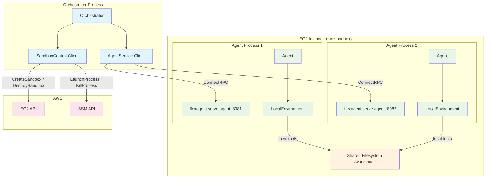
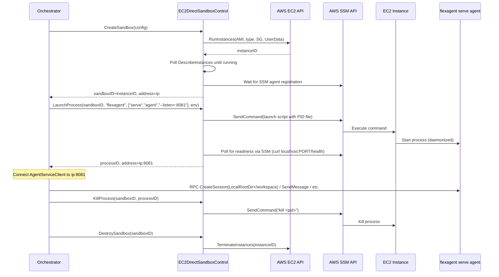
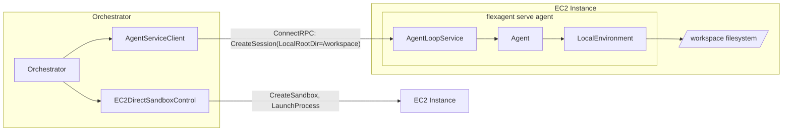

# 19: EC2 Direct Adapter

**Status:** Draft (revised per R1 review feedback)
**Depends on:** 18-agent-loop-rpc (SandboxControl interface), 11-sandbox-host-service.add01 (ExecutionEnvironment interface)
**Depended on by:** Orchestrator application (future), multi-agent collaboration features
**Scope:** Implement an EC2 Direct adapter (`EC2DirectSandboxControl`) that manages raw EC2 instances as agent execution environments. This is the "D2: EC2 Lightweight Sandbox" shape from the cloud-sandbox-providers shaping doc, now renamed to EC2 Direct. It provides no per-agent isolation -- multiple agents share one EC2 instance on a shared filesystem.
**Shaping source:** docs/shaping/cloud-sandbox-providers.md (Shape D2)
**Incorporated reviews:** docs/plans/19-ec2-direct-adapter-review-r1-a.md, docs/plans/19-ec2-direct-adapter-review-r1-b.md

---

## 1. Overview

EC2 Direct is a SandboxControl adapter that provisions and manages raw EC2 instances as agent environments. Unlike the native sandbox (which uses ZFS + gVisor for per-agent isolation), EC2 Direct treats the entire EC2 instance as a single shared workspace. Think of it as "what you'd do on your laptop but in the cloud" -- multiple agents run on the same OS, share the same filesystem, and execute tools locally.

### Purpose

- **Multi-agent shared workspace:** Multiple agents collaborate on a shared codebase, each running as a `flexagent serve agent` process on the same instance.
- **Simple cloud deployment:** No ZFS, no gVisor, no sandbox-host service. Just an EC2 instance with `flexagent` installed.
- **Cost-efficient:** One instance shared across N agents. No per-agent overhead.

### Relationship to Other Adapters

```
NativeSandboxControl     -- Full isolation (ZFS + gVisor), richest capabilities
EC2DirectSandboxControl  -- No isolation, shared OS, simplest cloud option  <-- THIS PLAN
E2BSandboxControl        -- 3rd party, per-sandbox isolation, 24h limit (future)
DaytonaSandboxControl    -- 3rd party, per-sandbox isolation, lossy pause (future)
FlySandboxControl        -- 3rd party, per-VM isolation, no lifetime limit (future)
```

EC2 Direct sits at the opposite end of the capability spectrum from NativeSandboxControl. It trades isolation and snapshots for simplicity and shared-filesystem collaboration. It is intentionally minimal.

### Key Design Decision: No Custom ExecutionEnvironment

Since agents run ON the EC2 instance (launched via `flexagent serve agent`), they use `LocalEnvironment` for tool execution. Tools execute in the same process/filesystem as the agent. The agent does not know or care that it is running on an EC2 instance -- from its perspective, it is running locally.

This means EC2 Direct does NOT need a custom `ExecutionEnvironment` implementation. `EC2DirectSandboxControl` handles instance lifecycle and process management. `LocalEnvironment` handles tool execution inside the agent process.

---

## 2. Architecture

### 2.1 Component Diagram



### 2.2 Lifecycle Flow



---

## 3. EC2DirectSandboxControl

### 3.1 Struct and Constructor

```go
// internal/sandbox/control/ec2direct/ec2direct.go

// EC2DirectSandboxControl manages raw EC2 instances as agent environments.
// Multiple agents share one instance without isolation.
type EC2DirectSandboxControl struct {
    provisioner  InstanceLifecycle  // Shared EC2 lifecycle operations (see 5.1)
    ssmClient    SSMAPI             // Interface wrapping AWS SSM SDK calls
    logger       *slog.Logger
    config       Config

    mu           sync.Mutex
    instances    map[string]*instanceState  // sandboxID -> state
}

type Config struct {
    // AMI to launch instances from. Should have flexagent pre-installed.
    AMIID            string

    // Default instance type (e.g., "t3.medium", "m5.xlarge").
    DefaultInstanceType string

    // Subnet ID for instance placement.
    SubnetID         string

    // Security group IDs to attach.
    SecurityGroupIDs []string

    // IAM instance profile ARN (for SSM access and any AWS API calls from the instance).
    InstanceProfileARN string

    // Key pair name for SSH fallback (optional; SSM is primary).
    KeyPairName      string

    // EBS volume size in GiB for the root volume.
    RootVolumeSizeGB int

    // EBS volume type (default "gp3").
    RootVolumeType   string

    // UserData script template. Executed on instance boot.
    // Used to configure workspace directory, install dependencies, etc.
    UserDataTemplate string

    // Tags applied to all resources created by this adapter.
    // Always includes {"ManagedBy": "flex-agent-runtime", "adapter": "ec2-direct"} in addition
    // to any user-provided tags (see crash recovery, section 3.10).
    Tags             map[string]string

    // IP selection strategy: "public" (default), "private", or "auto" (public if available, else private).
    IPSelectionMode  string

    // TerminateOnClose controls whether Close() terminates all managed instances (default false).
    // When false, instances are left running for potential recovery after restart.
    TerminateOnClose bool

    // Timeouts
    InstanceReadyTimeout  time.Duration // Max wait for instance + SSM ready (default 3min)
    ProcessReadyTimeout   time.Duration // Max wait for launched process to be healthy (default 30s)
}

type instanceState struct {
    instanceID  string
    publicIP    string
    privateIP   string
    state       instanceStatus
    processes   map[string]*processState // processID -> state
}

// instanceStatus is a typed string for instance lifecycle states.
type instanceStatus string

const (
    instanceStatusRunning    instanceStatus = "running"
    instanceStatusStopped    instanceStatus = "stopped"
    instanceStatusTerminated instanceStatus = "terminated"
)

type processState struct {
    processID  string
    pid        int
    startTime  int64  // /proc/PID start time, for PID recycling detection
    binary     string
    args       []string
    port       int
    status     control.ProcessStatus
}
```

The constructor `NewEC2DirectSandboxControl` accepts functional options and performs crash recovery on initialization (see section 3.10).

### 3.2 CreateSandbox

Provisions a new EC2 instance. The instance IS the sandbox.

```go
func (c *EC2DirectSandboxControl) CreateSandbox(ctx context.Context, req control.CreateSandboxRequest) (*control.CreateSandboxResponse, error)
```

**Steps:**

1. Determine instance type from `req.Resources` (map CPU/memory to EC2 instance type) or fall back to `Config.DefaultInstanceType`.
2. Build `RunInstancesInput`:
   - AMI: `Config.AMIID` (or `req.Template` if provided as an AMI ID override)
   - Instance type: determined in step 1
   - Subnet: `Config.SubnetID`
   - Security groups: `Config.SecurityGroupIDs`
   - IAM instance profile: `Config.InstanceProfileARN`
   - Key pair: `Config.KeyPairName` (if set)
   - EBS root volume: size from config, type from config
   - UserData: rendered from `Config.UserDataTemplate` with sandbox metadata
   - Tags: merge `Config.Tags` + `req.Labels` + `{"flex-sandbox-id": sandboxID, "ManagedBy": "flex-agent-runtime", "adapter": "ec2-direct"}`
3. Call `provisioner.RunInstances(ctx, input)`.
4. Extract instance ID. Generate sandbox ID (use instance ID directly).
5. Poll `provisioner.DescribeInstances` until instance state is "running" and has an IP address. Polling uses exponential backoff with jitter, starting at 2s, capped at 10s, with total timeout from `Config.InstanceReadyTimeout` (default 3min). Returns `ErrInstanceReadyTimeout` on timeout.
6. Poll SSM for instance registration via `ssmClient.DescribeInstanceInformation` with instance ID filter. Uses exponential backoff with jitter, starting at 2s, capped at 10s, within the remaining `Config.InstanceReadyTimeout`. Returns `ErrSSMUnavailable` if SSM registration never occurs.
7. Optionally run a readiness check via SSM (e.g., `flexagent version`) to confirm the binary is available on the instance.
8. Store instance state in `c.instances` (acquire `c.mu` only for map read/write, not during AWS API calls).
9. Return `CreateSandboxResponse` with `SandboxID = instanceID`, `Address = selectedIP` (based on `Config.IPSelectionMode`: public IP if available and mode is "public" or "auto", otherwise private IP).

**Note on Address:** `CreateSandboxResponse.Address` returns the instance IP without a port, since no process is running yet. The address becomes fully usable (host:port) only after `LaunchProcess` returns. This is a known deviation from the `host:port` contract documented in `control.go` -- for EC2 Direct, the sandbox address is an IP that the orchestrator uses as a prefix for agent process addresses.

**UserData template** is a shell script that runs on first boot. A typical template:

```bash
#!/bin/bash
set -euo pipefail

# Create workspace directory
mkdir -p /workspace
chown ubuntu:ubuntu /workspace

# flexagent binary is pre-installed in the AMI
# Verify it's available
/usr/local/bin/flexagent version

# Signal readiness (optional: write a marker file)
touch /var/run/flex-sandbox-ready
```

### 3.3 DestroySandbox

Terminates the EC2 instance and releases all resources.

```go
func (c *EC2DirectSandboxControl) DestroySandbox(ctx context.Context, sandboxID string) error
```

**Steps:**

1. Look up instance state from `c.instances`. Return `ErrInstanceNotFound` if not found.
2. Call `provisioner.TerminateInstances(ctx, instanceID)`.
3. Remove instance from `c.instances`.
4. Return nil (termination is fire-and-forget; AWS handles cleanup).

No need to explicitly kill processes -- instance termination kills everything.

### 3.4 LaunchProcess

Starts a long-running process on the EC2 instance via SSM. This is how agents are launched.

```go
func (c *EC2DirectSandboxControl) LaunchProcess(ctx context.Context, req control.LaunchProcessRequest) (*control.LaunchProcessResponse, error)
```

**Steps:**

1. Look up instance state from `c.instances`. Return `ErrInstanceNotFound` if not found.
2. Generate a process ID (UUID).
3. Build the command string from `req.Binary` and `req.Args`. **All values interpolated into the shell command MUST be escaped** using a `shellQuote()` helper function that wraps values in single quotes with proper escaping of embedded single quotes (replace `'` with `'\''`). A `buildSSMCommand(processID string, binary string, args []string, env map[string]string) string` function encapsulates this logic with comprehensive unit tests for edge cases (values containing single quotes, double quotes, newlines, dollar signs, backticks).
4. Construct a daemonized command via SSM SendCommand. The command writes PID and process start time to a well-known file rather than relying on stdout parsing:
   ```bash
   # Set environment variables (all values shell-escaped)
   export ANTHROPIC_API_KEY='escaped_value'
   export OPENAI_API_KEY='escaped_value'
   # Launch process in background, redirect output to log file
   nohup /usr/local/bin/flexagent serve agent --listen=:PORT \
       > /var/log/flex-agent-PROCESSID.log 2>&1 &
   PID=$!
   # Write PID and start time to well-known file for reliable tracking
   echo "$PID" > /var/run/flex-agent-PROCESSID.pid
   START_TIME=$(cat /proc/$PID/stat 2>/dev/null | awk '{print $22}')
   echo "$START_TIME" >> /var/run/flex-agent-PROCESSID.pid
   # Also write a status marker
   echo "launched" > /var/run/flex-agent-PROCESSID.status
   ```
5. Call `ssmClient.SendCommand(ctx, instanceID, command)` using the `AWS-RunShellScript` document. Set SSM `TimeoutSeconds` to 30.
6. Poll `ssmClient.GetCommandInvocation` for completion. Parse PID and start time from the PID file via a follow-up SSM command (`cat /var/run/flex-agent-PROCESSID.pid`) if the initial command's stdout is unreliable. Return `ErrProcessLaunchFailed` if the command fails (e.g., binary not found, port in use).
7. Poll for process readiness via SSM command: `curl -s -o /dev/null -w '%{http_code}' http://localhost:PORT/health`. This avoids network topology issues -- the health check runs on the instance itself. The expected healthy response is HTTP 200 with body `"ok\n"` (matching `cmd/flexagent/serve_agent.go`). Polling uses exponential backoff with jitter, starting at 500ms, capped at 5s, with total timeout from `Config.ProcessReadyTimeout` (default 30s). Returns `ErrProcessReadyTimeout` on timeout.
8. Store process state (including PID and start time) in instance's `processes` map.
9. Return `LaunchProcessResponse` with `ProcessID`, `Address = instanceIP:PORT`, `Status = ProcessRunning`.

**Workspace directory:** The `flexagent serve agent` process does NOT take a `--root-dir` flag. The workspace root directory (`/workspace`) is configured per-session by the orchestrator, which passes `LocalRootDir: "/workspace"` in the `ToolEnvironmentConfig` field of the `CreateAgentSessionRequest` RPC call. The SSM launch command simply starts the agent process with `--listen=:PORT`; directory configuration happens at the RPC session level.

**Port allocation:** `req.ExposePort` specifies the port the process should listen on. The orchestrator is responsible for choosing non-conflicting ports when launching multiple agents on the same instance (e.g., 8081, 8082, 8083, ...). The adapter passes the port through to the command arguments.

**Security group requirement:** The security group attached to the instance must allow inbound traffic on the agent RPC ports (or a range like 8080-8100) from the orchestrator's network.

**API key security:** Environment variables passed via `req.Env` (including API keys) are included in the SSM command string. SSM command content is logged in CloudTrail and stored in SSM command history. This is a known security limitation. Mitigation path for future work: store secrets in AWS Secrets Manager or SSM Parameter Store and have the agent process fetch them at startup using the instance's IAM role. For the initial implementation, the plan accepts this risk since the orchestrator is a trusted caller and CloudTrail access is already restricted. See Future Enhancements item 8.

### 3.5 KillProcess

Terminates a previously launched process via SSM.

```go
func (c *EC2DirectSandboxControl) KillProcess(ctx context.Context, req control.KillProcessRequest) error
```

**Steps:**

1. Look up process state from instance's `processes` map. Return `ErrProcessNotFound` if not found.
2. Determine signal (default SIGTERM if `req.Signal == 0`).
3. Verify PID is still the expected process by checking start time: send SSM command `cat /proc/PID/stat | awk '{print $22}'` and compare with stored `startTime`. If mismatch, the PID has been recycled -- update process state to `ProcessExited` and return `ErrProcessNotFound`.
4. Send SSM command: `kill -SIGNAL PID`.
5. Optionally wait briefly and verify process exited (send `kill -0 PID` to check).
6. Update process state to `ProcessExited`.
7. Clean up PID file: `rm -f /var/run/flex-agent-PROCESSID.pid /var/run/flex-agent-PROCESSID.status`.

### 3.6 GetProcessStatus

Checks whether a launched process is still running via SSM.

```go
func (c *EC2DirectSandboxControl) GetProcessStatus(ctx context.Context, req control.GetProcessStatusRequest) (*control.GetProcessStatusResponse, error)
```

**Steps:**

1. Look up process state from instance's `processes` map. Return `ErrProcessNotFound` if not found.
2. If cached status is `ProcessExited`, return immediately (exit is a terminal state).
3. Verify PID identity and check status via SSM command:
   ```bash
   if [ -f /proc/PID/stat ]; then
       START_TIME=$(awk '{print $22}' /proc/PID/stat)
       echo "running $START_TIME"
   else
       # Process exited -- check for exit code in status file
       echo "exited"
   fi
   ```
4. Parse response. If running, verify `START_TIME` matches stored `startTime` to guard against PID recycling. If mismatch, report `ProcessExited`.
5. Return `GetProcessStatusResponse` with current status and exit code if exited.

**Optimization:** Cache status locally and only poll SSM if the cached status is `ProcessRunning`. Once a process is `ProcessExited`, the status is stable.

### 3.7 PauseSandbox

Stops the EC2 instance. This is a lossy pause -- all processes are killed, but EBS volumes (filesystem) are preserved.

```go
func (c *EC2DirectSandboxControl) PauseSandbox(ctx context.Context, sandboxID string) error
```

**Steps:**

1. Look up instance state. Return `ErrInstanceNotFound` if not found.
2. Call `provisioner.StopInstances(ctx, instanceID)`.
3. Update all process states to `ProcessExited` (processes do not survive stop).
4. Update instance state to `instanceStatusStopped`.

**Important: Lossy pause semantics.** EC2 Direct pause kills all running processes. Only the EBS-backed filesystem is preserved. The orchestrator MUST re-launch all agent processes after `ResumeSandbox`. This behavior differs from NativeSandboxControl, which preserves full process state via gVisor container pause. The `SandboxCapabilities` struct currently has no field to distinguish lossy vs. lossless pause (see Capabilities section 3.9 and Open Question OQ5). The orchestrator must use adapter-specific knowledge for now.

### 3.8 ResumeSandbox

Starts a previously stopped instance. The filesystem is intact but all processes must be re-launched.

```go
func (c *EC2DirectSandboxControl) ResumeSandbox(ctx context.Context, sandboxID string) error
```

**Steps:**

1. Look up instance state. Return `ErrInstanceNotFound` if not found.
2. Call `provisioner.StartInstances(ctx, instanceID)`.
3. Poll `provisioner.DescribeInstances` until instance state is "running". Uses exponential backoff with jitter, starting at 2s, capped at 10s, within `Config.InstanceReadyTimeout`. Returns `ErrInstanceReadyTimeout` on timeout.
4. Update instance IP addresses (the instance may get a new public IP after stop/start).
5. Wait for SSM agent registration (the SSM agent restarts on instance start).
6. Update instance state to `instanceStatusRunning`.
7. Note: process map is cleared -- caller must re-launch any agents via `LaunchProcess`.

**Address stability:** After stop/start, the instance may receive a new public IP. The orchestrator should call `LaunchProcess` after resume to get the updated `Address` in the response. If stable IPs are required, use Elastic IPs (configure outside this adapter). See Future Enhancements item 9.

### 3.9 Capabilities

```go
func (c *EC2DirectSandboxControl) Capabilities() control.SandboxCapabilities {
    return control.SandboxCapabilities{
        Snapshots:     false, // No ZFS, no instant snapshots
        Rollback:      false, // No rollback capability
        Pause:         true,  // EC2 stop/start (lossy -- processes die, EBS preserved)
        LaunchProcess: true,  // SSM-based process launch
        DeepPause:     false, // ZFS-to-S3 cold storage; not applicable to EC2 Direct
    }
}
```

**Note on pause semantics:** `DeepPause` refers to ZFS-to-S3 cold storage archival (as documented in `control.go` line 112), NOT whether processes survive pause. There is currently no field in `SandboxCapabilities` to distinguish lossy pause (EC2 Direct: processes die, filesystem preserved) from lossless pause (Native: full process state preserved via gVisor). This is a gap in the interface. See OQ5 for the proposed resolution. Until the interface is extended, the orchestrator must have adapter-specific logic for post-resume recovery.

### 3.10 Crash Recovery

The adapter stores instance and process state in memory. If the orchestrator process restarts, all tracking state is lost but EC2 instances continue running (and billing). To prevent orphaned instances, the adapter implements a recovery mechanism.

**Recovery at construction time:**

```go
func NewEC2DirectSandboxControl(provisioner InstanceLifecycle, ssmClient SSMAPI, cfg Config, opts ...Option) *EC2DirectSandboxControl
```

The constructor calls `Recover()` which:

1. Queries `provisioner.DescribeInstances` with tag filters: `{"ManagedBy": "flex-agent-runtime", "adapter": "ec2-direct"}` and state filter for "running" and "stopped" instances.
2. For each discovered instance:
   a. Extracts `flex-sandbox-id` from tags to reconstruct the sandbox ID.
   b. Reads instance IP addresses.
   c. For running instances, probes for active agent processes by checking PID files via SSM: `ls /var/run/flex-agent-*.pid 2>/dev/null` and reading each to reconstruct process state.
   d. For each discovered PID file, verifies the process is still running via `/proc/PID/stat` and adds it to the process map.
3. Populates `c.instances` with recovered state.
4. Logs a summary of recovered instances and processes.

This recovery is best-effort. If SSM is unavailable for a running instance, the instance is tracked but its processes are assumed unknown (the orchestrator will need to re-launch agents).

### 3.11 Close

The adapter implements `io.Closer` for graceful shutdown.

```go
func (c *EC2DirectSandboxControl) Close() error
```

**Steps:**

1. If `Config.TerminateOnClose` is true, terminate all managed instances via `provisioner.TerminateInstances` for each instance in `c.instances`.
2. If `Config.TerminateOnClose` is false (default), leave instances running. They will be rediscovered via crash recovery (section 3.10) after restart.
3. Clear internal state (`c.instances = nil`).
4. Return any accumulated errors.

The default behavior (leave instances running) is intentional: it enables seamless orchestrator restarts without killing active agent workloads. The orchestrator should call `DestroySandbox` explicitly for each sandbox before exiting if cleanup is desired.

---

## 4. ExecutionEnvironment: Use LocalEnvironment

Agents launched on an EC2 Direct instance use `LocalEnvironment` for tool execution. No custom `ExecutionEnvironment` is needed.

The flow:

1. Orchestrator calls `EC2DirectSandboxControl.CreateSandbox()` to provision an instance.
2. Orchestrator calls `EC2DirectSandboxControl.LaunchProcess()` to start `flexagent serve agent --listen=:PORT` on the instance.
3. The orchestrator calls `CreateAgentSession` via RPC on the agent process, passing `ToolEnvironmentConfig{Type: ToolEnvLocal, LocalRootDir: "/workspace"}` in the session config. This is how the workspace directory is configured -- per-session via RPC, not via a CLI flag on the agent process.
4. The `AgentLoopService` creates a `LocalEnvironment` rooted at `/workspace` for the session.
5. Tools (bash, read, write, edit, grep, glob) execute locally on the instance's filesystem.



This is the same architecture as running `flexagent serve agent` on a developer's laptop, except the "laptop" is an EC2 instance provisioned programmatically.

---

## 5. AWS Integration

### 5.1 AWS SDK Interfaces and Shared EC2 Lifecycle

The adapter uses SSM for process management (which is EC2 Direct-specific) and delegates EC2 instance lifecycle operations to a shared `InstanceLifecycle` interface. This avoids duplicating EC2 SDK wrapping code with Plan 20's `InstanceProvisioner`.

**Composition with Plan 20:** Plan 20 (Fleet Management) defines `InstanceProvisioner` with `EC2InstanceProvisioner` that wraps the same EC2 API calls (`RunInstances`, `TerminateInstances`, `StopInstances`, `StartInstances`, `DescribeInstances`). Rather than both plans independently wrapping the AWS EC2 SDK, EC2 Direct composes:

- **`InstanceLifecycle`** (shared with Plan 20) for EC2 instance lifecycle: `RunInstances`, `TerminateInstances`, `StopInstances`, `StartInstances`, `DescribeInstances`
- **`SSMAPI`** (EC2 Direct-specific) for remote process management: `SendCommand`, `GetCommandInvocation`, `DescribeInstanceInformation`

If Plan 20 is implemented first, `EC2DirectSandboxControl` uses `InstanceProvisioner` directly. If Plan 19 is implemented first, it defines the `InstanceLifecycle` interface which Plan 20's `InstanceProvisioner` later satisfies. The interface is identical either way:

```go
// internal/sandbox/control/ec2direct/aws.go (or shared package)

// InstanceLifecycle wraps EC2 instance lifecycle operations.
// This interface is shared with Plan 20's InstanceProvisioner.
type InstanceLifecycle interface {
    RunInstances(ctx context.Context, input *ec2.RunInstancesInput, opts ...func(*ec2.Options)) (*ec2.RunInstancesOutput, error)
    TerminateInstances(ctx context.Context, input *ec2.TerminateInstancesInput, opts ...func(*ec2.Options)) (*ec2.TerminateInstancesOutput, error)
    StopInstances(ctx context.Context, input *ec2.StopInstancesInput, opts ...func(*ec2.Options)) (*ec2.StopInstancesOutput, error)
    StartInstances(ctx context.Context, input *ec2.StartInstancesInput, opts ...func(*ec2.Options)) (*ec2.StartInstancesOutput, error)
    DescribeInstances(ctx context.Context, input *ec2.DescribeInstancesInput, opts ...func(*ec2.Options)) (*ec2.DescribeInstancesOutput, error)
}

// SSMAPI wraps the subset of SSM SDK methods used by this adapter.
// This is EC2 Direct-specific -- Plan 20 does not need SSM.
type SSMAPI interface {
    SendCommand(ctx context.Context, input *ssm.SendCommandInput, opts ...func(*ssm.Options)) (*ssm.SendCommandOutput, error)
    GetCommandInvocation(ctx context.Context, input *ssm.GetCommandInvocationInput, opts ...func(*ssm.Options)) (*ssm.GetCommandInvocationOutput, error)
    DescribeInstanceInformation(ctx context.Context, input *ssm.DescribeInstanceInformationInput, opts ...func(*ssm.Options)) (*ssm.DescribeInstanceInformationOutput, error)
}
```

### 5.2 SSM vs SSH

**Recommendation: Use SSM (AWS Systems Manager) as the primary remote execution mechanism.**

SSM advantages over SSH:
- **No key management.** SSH requires distributing and managing key pairs. SSM uses IAM roles -- the instance profile grants SSM access, and the orchestrator uses its own AWS credentials.
- **No inbound port needed.** SSM uses outbound HTTPS from the instance to the SSM service. No need to open port 22 in the security group.
- **Audit trail.** SSM Run Command invocations are logged in CloudTrail automatically.
- **No bastion/VPN required.** Works across VPCs and even from the public internet (the orchestrator just needs AWS API access).

SSM disadvantages:
- **Latency.** SSM SendCommand has higher latency than SSH (~1-3s per command invocation vs ~100ms for SSH).
- **Not interactive.** SSM SendCommand is fire-and-forget (run command, get output). Not suitable for interactive terminal sessions.
- **Output size limits.** SSM command output is capped at 24KB inline (larger outputs must go via S3).
- **API key exposure.** SSM command content is logged in CloudTrail and SSM command history (see section 3.4 security note).

For EC2 Direct, the latency trade-off is acceptable because:
- `LaunchProcess` is infrequent (once per agent, not per tool call).
- `KillProcess` and `GetProcessStatus` are infrequent.
- Tool execution does NOT go through SSM -- it goes through the agent's `LocalEnvironment` via ConnectRPC.

**Note on SSM Session Manager:** SSM Session Manager was considered as an alternative to Run Command. It provides interactive sessions and lower-latency persistent connections. However, Run Command was chosen because all adapter operations are non-interactive fire-and-forget commands (launch, kill, status check), and Run Command is simpler to implement and test.

**SSH fallback:** If SSM latency proves problematic or if SSM is unavailable in a deployment, the adapter can fall back to SSH via the `Config.KeyPairName` field. This is an implementation detail -- the `SandboxControl` interface is agnostic to the remote execution mechanism.

### 5.3 Security Groups

The EC2 instance needs the following inbound rules:

| Port Range | Protocol | Source | Purpose |
|-----------|----------|--------|---------|
| 8080-8100 | TCP | Orchestrator SG / CIDR | Agent RPC endpoints (one per agent) |

No SSH port (22) is needed if using SSM exclusively.

Outbound rules:
- Allow all outbound (default). Required for agents to call LLM provider APIs (Anthropic, OpenAI, Google) and for the SSM agent to connect to the SSM service.

The security group IDs are provided via `Config.SecurityGroupIDs`. The adapter does NOT create or modify security groups -- they are pre-provisioned as part of the infrastructure setup.

### 5.4 IAM Instance Profile

The instance profile must include:

- **SSM managed policy:** `arn:aws:iam::aws:policy/AmazonSSMManagedInstanceCore` -- allows the SSM agent on the instance to communicate with the SSM service.
- **No additional AWS permissions needed** unless the agents themselves need AWS access (e.g., S3 for data storage). Those permissions are application-specific and outside the scope of this adapter.

The orchestrator's IAM role/credentials must include:

- `ec2:RunInstances`, `ec2:TerminateInstances`, `ec2:StopInstances`, `ec2:StartInstances`, `ec2:DescribeInstances`
- `ssm:SendCommand`, `ssm:GetCommandInvocation`, `ssm:DescribeInstanceInformation`
- `iam:PassRole` for the instance profile

### 5.5 UserData and Instance Initialization

The `Config.UserDataTemplate` is a bash script template that runs on first boot via cloud-init. It should:

1. Create the shared workspace directory (`/workspace`).
2. Set ownership/permissions.
3. Verify `flexagent` binary is available (pre-installed in AMI).
4. Optionally clone a git repository into the workspace.
5. Write a readiness marker file.

The template supports Go `text/template` variables substituted at CreateSandbox time. A `UserDataTemplateData` struct defines the typed fields:

```go
type UserDataTemplateData struct {
    SandboxID    string            // the sandbox/instance ID
    Labels       map[string]string // labels from the CreateSandbox request
    WorkspaceDir string            // workspace directory path (default "/workspace")
}
```

Template variables:
- `{{.SandboxID}}` -- the sandbox/instance ID
- `{{.Labels}}` -- labels map (iterate with `{{range $k, $v := .Labels}}`)
- `{{.WorkspaceDir}}` -- workspace directory path (default `/workspace`)

**Template validation:** The UserData template is validated at constructor time (`NewEC2DirectSandboxControl`) by calling `template.New().Parse()`. If the template is invalid, the constructor returns an error (fail-fast). All template variable values are shell-escaped using the same `shellQuote()` helper used for SSM commands, preventing injection via label values or other user-provided data.

### 5.6 AMI Requirements

The AMI used by EC2 Direct must have:

- **Ubuntu LTS** (22.04 or 24.04) as the base OS.
- **SSM agent** installed and configured to start on boot (included by default in AWS-published Ubuntu AMIs).
- **`flexagent` binary** pre-installed at `/usr/local/bin/flexagent`.
- **Git, common build tools** pre-installed for agent tool execution.

AMI creation is outside the scope of this adapter. A Packer template or similar tool should be used to build the AMI. The AMI ID is passed via `Config.AMIID`.

---

## 6. Instance Configuration

### 6.1 Instance Type Selection

The adapter maps `CreateSandboxRequest.Resources` to an EC2 instance type:

| CPU (approx) | Memory (approx) | Instance Type | Actual Specs |
|-------------|-----------------|---------------|--------------|
| 1-2 vCPU    | <= 4 GiB        | t3.medium     | 2 vCPU / 4 GiB |
| 2-4 vCPU    | <= 8 GiB        | t3.large      | 2 vCPU / 8 GiB |
| 4-8 vCPU    | <= 16 GiB       | t3.xlarge     | 4 vCPU / 16 GiB |
| 8-16 vCPU   | <= 32 GiB       | m5.2xlarge    | 8 vCPU / 32 GiB |
| 16-32 vCPU  | <= 64 GiB       | m5.4xlarge    | 16 vCPU / 64 GiB |

If `Resources` is zero-valued, the adapter uses `Config.DefaultInstanceType`.

If the requested resources exceed the largest mapped type (> 32 vCPU or > 64 GiB), the adapter returns an error: `ErrResourcesExceedMaximum`. The caller should either reduce the resource request or use a different adapter.

The mapping is implemented as a simple function, not a configurable table, since the use cases are limited and the mapping can be refined based on experience. Future enhancement: make the mapping configurable.

### 6.2 EBS Volumes

- **Root volume:** gp3, size from `Config.RootVolumeSizeGB` (default 50 GiB). This holds the OS, `flexagent` binary, and shared workspace.
- **No additional volumes** unless the orchestrator explicitly provisions them (outside scope of this adapter).
- EBS volumes persist across instance stop/start, which is what makes the lossy pause useful -- the workspace survives even though processes die.

### 6.3 Network and VPC

- Instance is placed in the subnet specified by `Config.SubnetID`.
- Public IP assignment depends on subnet configuration (public subnet = auto-assign public IP; private subnet = NAT gateway for outbound, no public IP).
- For private subnet deployments, the orchestrator must be able to reach the instance's private IP (via VPN, VPC peering, or same VPC).
- IP selection is controlled by `Config.IPSelectionMode`:
  - `"public"` (default): use public IP. Fails if instance has no public IP.
  - `"private"`: always use private IP.
  - `"auto"`: use public IP if available, otherwise private IP.

---

## 7. Multi-Agent Support

### 7.1 Architecture

Multiple agents share one EC2 instance. Each agent is a separate `flexagent serve agent` process listening on a distinct port. The workspace directory `/workspace` is configured per-session via the `CreateAgentSession` RPC call (see section 4), not via CLI flags.

```
EC2 Instance
+-- flexagent serve agent --listen=:8081   (Agent 1)
+-- flexagent serve agent --listen=:8082   (Agent 2)
+-- flexagent serve agent --listen=:8083   (Agent 3)
+-- /workspace/                            (shared filesystem)
    +-- src/
    +-- tests/
    +-- ...
```

### 7.2 Process Management

Each agent is launched via a separate `LaunchProcess` call. The orchestrator is responsible for:

1. **Port allocation:** Choosing non-conflicting ports (e.g., 8081, 8082, ...) for each agent's `--listen` flag. The orchestrator tracks which ports are in use per instance.
2. **Environment isolation:** Each `LaunchProcess` call can inject different environment variables (e.g., different API keys per agent, different system prompts via config files).
3. **Lifecycle management:** Each process has an independent lifecycle. Killing one agent does not affect others.

The adapter does not enforce any limit on the number of agents per instance. Resource contention is managed by choosing an appropriately sized instance type.

### 7.3 Port Allocation Strategy

The orchestrator assigns ports sequentially starting from a base port (e.g., 8081). The adapter does not manage port allocation -- it passes `req.ExposePort` through to the command arguments.

Suggested convention:
- Base port: 8081
- Agent N gets port: 8081 + N - 1
- Security group allows range: 8081-8180 (up to 100 agents per instance)

### 7.4 Shared Filesystem Considerations

All agents share `/workspace`. This is a feature, not a bug -- it enables collaboration patterns like:

- **Pair programming:** Multiple agents edit the same codebase, review each other's changes.
- **Task division:** Agents work on different files/directories within the same project.
- **Shared context:** All agents see the same project state, git history, test results.

**No coordination mechanism is provided by the adapter.** Agents coordinate through:
- Git (branches, commits, merges)
- File conventions (e.g., lock files, status files)
- h2 messaging protocol (for high-level coordination)

This is identical to how multiple developers share a filesystem -- conventions and communication, not enforcement. The lack of enforcement is intentional and consistent with the "what you'd do on your laptop" philosophy.

---

## 8. Error Handling

### 8.1 Sentinel Errors

The adapter defines typed sentinel errors for programmatic error handling. Callers can use `errors.Is()` to distinguish failure modes and make retry decisions.

```go
// internal/sandbox/control/ec2direct/errors.go

var (
    // ErrInstanceNotFound indicates the sandbox ID does not correspond to a
    // known managed instance.
    ErrInstanceNotFound = errors.New("ec2direct: instance not found")

    // ErrProcessNotFound indicates the process ID does not correspond to a
    // known launched process on the given instance.
    ErrProcessNotFound = errors.New("ec2direct: process not found")

    // ErrInstanceNotReady indicates the instance exists but is not in a state
    // where operations can be performed (e.g., stopped, pending).
    ErrInstanceNotReady = errors.New("ec2direct: instance not ready")

    // ErrInstanceReadyTimeout indicates the instance did not reach "running"
    // state within Config.InstanceReadyTimeout.
    ErrInstanceReadyTimeout = errors.New("ec2direct: instance ready timeout")

    // ErrProcessReadyTimeout indicates a launched process did not pass its
    // health check within Config.ProcessReadyTimeout.
    ErrProcessReadyTimeout = errors.New("ec2direct: process ready timeout")

    // ErrSSMUnavailable indicates the SSM agent on the instance is not
    // responding or not registered.
    ErrSSMUnavailable = errors.New("ec2direct: ssm agent unavailable")

    // ErrSSMTimeout indicates an SSM command did not complete within the
    // allowed time.
    ErrSSMTimeout = errors.New("ec2direct: ssm command timeout")

    // ErrProcessLaunchFailed indicates the process launch command failed
    // (e.g., binary not found, port in use, permission denied).
    ErrProcessLaunchFailed = errors.New("ec2direct: process launch failed")

    // ErrResourcesExceedMaximum indicates the requested resources exceed the
    // largest supported instance type mapping.
    ErrResourcesExceedMaximum = errors.New("ec2direct: resources exceed maximum supported")
)
```

### 8.2 Error Classification

| Error Category | Retry-safe? | Examples |
|---------------|-------------|---------|
| Transient AWS API errors | Yes | Rate limiting, throttling, temporary service unavailability |
| Timeout errors | Yes (with backoff) | `ErrInstanceReadyTimeout`, `ErrProcessReadyTimeout`, `ErrSSMTimeout` |
| Instance state errors | No | `ErrInstanceNotFound` (instance terminated), `ErrInstanceNotReady` |
| Process errors | No | `ErrProcessNotFound`, `ErrProcessLaunchFailed` (binary missing) |
| Resource errors | No | `ErrResourcesExceedMaximum` |

All errors wrap the underlying cause (AWS SDK error, context error, etc.) using `fmt.Errorf("...: %w", sentinel, cause)` so callers can use both `errors.Is()` for classification and `errors.Unwrap()` for the root cause.

---

## 9. Concurrency Model

### 9.1 Locking Strategy

The `sync.Mutex` (`c.mu`) protects `c.instances` map access only. It is NOT held during AWS API calls (which can take seconds). The pattern:

```go
// Read from map (short lock)
c.mu.Lock()
inst, ok := c.instances[sandboxID]
c.mu.Unlock()
if !ok {
    return ErrInstanceNotFound
}

// AWS API call (no lock held)
result, err := c.provisioner.DescribeInstances(ctx, ...)

// Write back to map (short lock)
c.mu.Lock()
// Check instance still exists (may have been destroyed concurrently)
if _, ok := c.instances[sandboxID]; ok {
    c.instances[sandboxID].publicIP = newIP
}
c.mu.Unlock()
```

After each AWS API call, the code checks that the instance still exists in the map before updating. This handles the race where `DestroySandbox` removes an instance while another operation (e.g., `CreateSandbox` polling, `ResumeSandbox` polling) is in flight.

---

## 10. Package Structure

```
internal/
  sandbox/
    control/
      ec2direct/
        ec2direct.go         # EC2DirectSandboxControl struct, constructor, options, Close()
        create.go            # CreateSandbox implementation
        destroy.go           # DestroySandbox implementation
        process.go           # LaunchProcess, KillProcess, GetProcessStatus
        pause.go             # PauseSandbox, ResumeSandbox
        capabilities.go      # Capabilities() method
        recover.go           # Crash recovery (Recover method)
        aws.go               # InstanceLifecycle, SSMAPI interfaces
        ssm_command.go       # buildSSMCommand, shellQuote helpers
        errors.go            # Sentinel error definitions
        instance_type.go     # Resource-to-instance-type mapping
        ec2direct_test.go    # Unit tests with mocked AWS APIs
        ssm_command_test.go  # Shell escaping edge case tests
```

### 10.1 Dependencies

**New Go module dependencies:**

- `github.com/aws/aws-sdk-go-v2/service/ec2` -- EC2 API client
- `github.com/aws/aws-sdk-go-v2/service/ssm` -- SSM API client
- `github.com/aws/aws-sdk-go-v2/config` -- AWS SDK configuration loading

These are the only new external dependencies. The adapter uses the same `log/slog`, `sync`, `context`, and `time` standard library packages as the rest of the codebase.

---

## 11. Testing Strategy

### 11.1 Unit Tests (with Mocked AWS API)

All AWS API calls go through the `InstanceLifecycle` and `SSMAPI` interfaces, which are mockable.

**Test cases:**

- `CreateSandbox` happy path: mock `RunInstances` returns instance ID, mock `DescribeInstances` returns running + IP, mock SSM `DescribeInstanceInformation` returns registered. Verify response fields.
- `CreateSandbox` with instance type mapping: verify different `Resources` values produce correct instance types.
- `CreateSandbox` with template override: `req.Template` overrides `Config.AMIID`.
- `CreateSandbox` timeout: mock `DescribeInstances` never returns "running". Verify `ErrInstanceReadyTimeout` after `InstanceReadyTimeout`.
- `CreateSandbox` SSM not ready: instance is running but SSM agent never registers. Verify `ErrSSMUnavailable`.
- `CreateSandbox` resources exceed maximum: verify `ErrResourcesExceedMaximum`.
- `DestroySandbox` happy path: verify `TerminateInstances` called with correct instance ID.
- `DestroySandbox` unknown sandbox: verify `ErrInstanceNotFound`.
- `LaunchProcess` happy path: mock `SendCommand` succeeds. Verify process state stored. Verify address format.
- `LaunchProcess` with environment variables: verify env vars are included in SSM command with proper shell escaping.
- `LaunchProcess` command failure: mock `SendCommand` returns error. Verify `ErrProcessLaunchFailed`.
- `LaunchProcess` readiness timeout: health check never passes. Verify `ErrProcessReadyTimeout`.
- `KillProcess` happy path: verify `SendCommand` sends `kill -SIGNAL PID`.
- `KillProcess` with custom signal: verify signal number passed through.
- `KillProcess` PID recycled: stored start time mismatches. Verify `ErrProcessNotFound`.
- `GetProcessStatus` running: mock SSM confirms PID exists with matching start time. Verify `ProcessRunning`.
- `GetProcessStatus` exited: mock SSM confirms PID gone. Verify `ProcessExited` with exit code.
- `GetProcessStatus` PID recycled: SSM reports different start time. Verify `ProcessExited`.
- `PauseSandbox` happy path: verify `StopInstances` called. Verify all processes marked exited.
- `ResumeSandbox` happy path: mock `StartInstances` + `DescribeInstances`. Verify instance state updated, IP refreshed.
- `ResumeSandbox` timeout: instance never reaches "running". Verify `ErrInstanceReadyTimeout`.
- `Capabilities` returns expected values (no snapshots, no rollback, pause=true, launchProcess=true, deepPause=false).
- `Recover` happy path: mock `DescribeInstances` returns tagged instances. Verify `c.instances` populated.
- `Close` with `TerminateOnClose=true`: verify all instances terminated.
- `Close` with `TerminateOnClose=false`: verify instances NOT terminated.
- Concurrent operations: multiple `LaunchProcess` calls on same sandbox, verify no races (use `go test -race`).
- `buildSSMCommand` edge cases: values with single quotes, double quotes, newlines, dollar signs, backticks, empty strings.
- `shellQuote` edge cases: comprehensive quoting tests.

### 11.2 Integration Tests (Real EC2, Gated)

These tests are gated behind a build tag (`//go:build integration_ec2`) and are NOT run in CI. They require:
- Valid AWS credentials with EC2/SSM permissions
- A pre-built AMI with `flexagent`
- A VPC with appropriate subnets and security groups

**Test cases:**

- Full lifecycle: CreateSandbox -> LaunchProcess -> GetProcessStatus -> KillProcess -> DestroySandbox.
- Multi-agent: CreateSandbox -> LaunchProcess x3 -> verify all three agents respond to health checks -> KillProcess x3 -> DestroySandbox.
- Pause/Resume: CreateSandbox -> LaunchProcess -> PauseSandbox -> ResumeSandbox -> verify filesystem preserved -> LaunchProcess (re-launch agent) -> verify agent works.
- Crash recovery: CreateSandbox -> LaunchProcess -> construct new adapter instance -> verify Recover() rediscovers instance and processes.
- Network connectivity: after LaunchProcess, verify HTTP request to agent health endpoint succeeds from orchestrator (validates security group configuration).
- Cleanup: test creates an instance, crashes (simulate), verify instance can be cleaned up by subsequent DestroySandbox call.

### 11.3 Test Infrastructure

A test helper should be written to:
- Create and clean up EC2 instances tagged with a test run ID.
- Implement a "sweep" function that terminates all instances with test tags older than 1 hour (safety net for leaked instances from failed test runs).
- Generate a unique security group for each test run (or reuse a pre-existing one).

---

## 12. Implementation Order

1. **Sentinel errors** (`internal/sandbox/control/ec2direct/errors.go`) -- Define all error types.

2. **AWS interfaces** (`internal/sandbox/control/ec2direct/aws.go`) -- Define `InstanceLifecycle` and `SSMAPI` interfaces.

3. **SSM command helpers** (`internal/sandbox/control/ec2direct/ssm_command.go`) -- `shellQuote()`, `buildSSMCommand()` with unit tests (`ssm_command_test.go`). Test edge cases for shell injection prevention.

4. **Config and constructor** (`internal/sandbox/control/ec2direct/ec2direct.go`) -- `Config` struct, `NewEC2DirectSandboxControl()` with functional options, internal state types (`instanceState`, `processState`), UserData template validation.

5. **Capabilities** (`internal/sandbox/control/ec2direct/capabilities.go`) -- Simple method returning the fixed capability set.

6. **Instance type mapping** (`internal/sandbox/control/ec2direct/instance_type.go`) -- `Resources` to instance type mapping function with overflow error.

7. **CreateSandbox** (`internal/sandbox/control/ec2direct/create.go`) -- RunInstances, polling with exponential backoff, SSM readiness check. Unit tests with mocked AWS.

8. **DestroySandbox** (`internal/sandbox/control/ec2direct/destroy.go`) -- TerminateInstances. Unit tests.

9. **LaunchProcess / KillProcess / GetProcessStatus** (`internal/sandbox/control/ec2direct/process.go`) -- SSM-based process management with PID file tracking, start time verification, health check via SSM. Unit tests. This is the most complex piece.

10. **PauseSandbox / ResumeSandbox** (`internal/sandbox/control/ec2direct/pause.go`) -- StopInstances, StartInstances, process state cleanup, IP refresh. Unit tests.

11. **Crash recovery** (`internal/sandbox/control/ec2direct/recover.go`) -- Tag-based instance discovery, process reconstruction. Unit tests.

12. **Close** -- `io.Closer` implementation in `ec2direct.go`. Unit tests.

13. **End-to-end unit test** -- Full lifecycle test using mocks: CreateSandbox -> LaunchProcess -> GetProcessStatus -> KillProcess -> DestroySandbox.

14. **Integration tests** (gated) -- Real EC2 tests. Create AMI build script or document AMI requirements for test setup.

---

## 13. Connected Components

### 13.1 Consumed Seams

| Seam | How Used |
|------|----------|
| `internal/sandbox/control/control.go` | `EC2DirectSandboxControl` implements `SandboxControl` interface. Uses `CreateSandboxRequest`, `CreateSandboxResponse`, `LaunchProcessRequest`, `LaunchProcessResponse`, `KillProcessRequest`, `GetProcessStatusRequest`, `GetProcessStatusResponse`, `SandboxCapabilities`, `ProcessStatus` types. |
| `internal/sandbox/environment/local/local.go` | Agents launched on EC2 Direct use `LocalEnvironment` for tool execution. No direct import by this adapter -- consumed by `flexagent serve agent` running on the instance. |
| `internal/agent/api/agent.go` | `AgentService` interface consumed by the orchestrator to communicate with agents running on the instance. No direct import by this adapter -- consumed by `AgentServiceClient` in the orchestrator. |
| `internal/agent/api/agent_types.go` | `ToolEnvironmentConfig` with `LocalRootDir` field -- the orchestrator sets `LocalRootDir: "/workspace"` in the `CreateAgentSessionRequest` to configure the workspace directory per-session. |

### 13.2 New Seams

| Seam | Description |
|------|-------------|
| `internal/sandbox/control/ec2direct` (new package) | `EC2DirectSandboxControl` implementing `SandboxControl` + `io.Closer`. `InstanceLifecycle` and `SSMAPI` interfaces for AWS SDK abstraction. Sentinel errors for programmatic error handling. |

### 13.3 Modified Seams

None. This adapter is purely additive. It does not modify any existing code.

**Note:** If OQ5 is resolved by adding `PausePreservesProcesses` to `SandboxCapabilities`, that would be a modification to `internal/sandbox/control/control.go`. This change should be coordinated across all adapter plans.

### 13.4 Import Flow

```
internal/sandbox/control/ec2direct  -> internal/sandbox/control (SandboxControl interface, types)
                                    -> github.com/aws/aws-sdk-go-v2/service/ec2 (EC2 SDK types for interface signatures)
                                    -> github.com/aws/aws-sdk-go-v2/service/ssm (SSM SDK types for interface signatures)
```

The adapter does NOT import any other internal packages. It is a leaf package that only depends on the `control` interface package and the AWS SDK.

---

## 14. Open Questions

### OQ1: Instance Pooling

Should EC2 Direct maintain a warm pool of pre-provisioned instances to reduce CreateSandbox latency (currently 10-90s for EC2 boot)? Pooling would improve cold start at the cost of paying for idle instances.

**Recommendation:** Defer pooling to a follow-up. The initial implementation provisions on-demand. Pooling can be added as an optimization if cold start latency is a problem in practice. The pooling logic (pre-warm N instances, assign from pool on CreateSandbox, return to pool on DestroySandbox) is well-understood and can be layered on top without changing the interface.

### OQ2: SSH Fallback

Should the initial implementation include SSH as a fallback for SSM, or should SSM be the only supported mechanism?

**Recommendation:** SSM only for the initial implementation. SSH can be added as a fallback if SSM proves unreliable or if there are deployment scenarios where SSM is unavailable (e.g., air-gapped environments). The `Config.KeyPairName` field is included in the config struct to signal future SSH support.

### OQ3: Process Health Monitoring

After launching a process, should the adapter periodically poll process health, or is on-demand `GetProcessStatus` sufficient?

**Recommendation:** On-demand only for the initial implementation. The orchestrator already monitors agent health via the `AgentServiceClient` (ConnectRPC health checks). If the connection drops, the orchestrator calls `GetProcessStatus` to check if the process is still running. Background health polling adds complexity without clear benefit.

### OQ4: Resource Contention on Shared Instances

When multiple agents share an instance, there is no per-agent resource limiting. A runaway agent could consume all CPU/memory and starve others. Should the adapter use cgroups to enforce per-agent resource limits?

**Recommendation:** Defer cgroup-based limits. The initial implementation relies on choosing an appropriately sized instance for the number of agents. Per-agent cgroups would add significant complexity (cgroup setup via SSM, process placement into cgroups) for a relatively rare problem. If resource contention becomes an issue, it can be addressed by using larger instances or adding cgroup support.

### OQ5: PausePreservesProcesses Capability Flag (NEW)

The `SandboxCapabilities` struct has no field to distinguish lossy pause (processes die, filesystem preserved) from lossless pause (full process state preserved). This affects EC2 Direct, Daytona, and potentially other future adapters.

**Options:**
1. Add `PausePreservesProcesses bool` to `SandboxCapabilities` in `control.go`. This requires coordinating with all adapter plans and updating the interface.
2. Add `PauseFidelity string` with values like `"full"`, `"filesystem-only"`, `"none"`. More expressive but stringly-typed.
3. Accept that the orchestrator must have adapter-specific logic for post-resume recovery until a dedicated field is added.

**Recommendation:** Option 1 (`PausePreservesProcesses bool`) is the cleanest. This should be proposed as a small addendum to Plan 18. For the initial implementation of EC2 Direct, proceed with option 3 (orchestrator uses adapter-specific knowledge) and note that the capability flag will be added in a follow-up.

---

## 15. Future Enhancements

These are explicitly out of scope for the initial implementation but noted for future consideration:

1. **Instance pooling** -- Pre-warm pool for fast CreateSandbox (see OQ1).
2. **SSH fallback** -- Alternative to SSM for remote command execution.
3. **Spot instances** -- Use spot instances for cost savings with interruption handling.
4. **Auto-scaling** -- Automatically scale the number of instances based on agent demand.
5. **EBS snapshots** -- Expose EBS snapshots through the `SandboxCapabilities` (slow, instance-level granularity, but better than nothing).
6. **cgroup resource limits** -- Per-agent CPU/memory limits via cgroups (see OQ4).
7. **Custom AMI builder** -- Packer template or similar to automate AMI creation with flexagent and dependencies pre-installed.
8. **Secure secret injection** -- Store API keys in AWS Secrets Manager or SSM Parameter Store. Agent process fetches them at startup using instance IAM role, eliminating plaintext secrets in SSM command history and CloudTrail.
9. **Elastic IP support** -- Optional Elastic IP allocation for address stability across pause/resume cycles.
10. **`PausePreservesProcesses` capability flag** -- Add to `SandboxCapabilities` interface (see OQ5).

---

## 16. Review Disposition Table

This table tracks every finding from both R1 reviews and their disposition.

### R1-A Findings (docs/plans/19-ec2-direct-adapter-review-r1-a.md)

| ID | Finding | Severity | Disposition | Notes |
|----|---------|----------|-------------|-------|
| A-F1 | `DeepPause` semantics misused to signal lossy pause | P1 | **Accepted** | Removed incorrect interpretation. Corrected section 3.9 to note `DeepPause` means ZFS-to-S3 cold storage. Added OQ5 for `PausePreservesProcesses` flag. Updated section 3.7 to document lossy pause as an interface gap. |
| A-F2 | `flexagent serve agent` has no `--root-dir` flag | P1 | **Accepted** | Removed all `--root-dir` references. Updated sections 2.2, 3.4, 4, 7.1 to document that workspace directory is configured per-session via `LocalRootDir` in `CreateAgentSessionRequest` RPC. |
| A-F3 | EC2 SDK code duplication with Plan 20 | P1 | **Accepted** | Replaced `EC2API` with shared `InstanceLifecycle` interface in section 5.1. EC2 Direct composes `InstanceLifecycle` (shared) + `SSMAPI` (EC2 Direct-specific). |
| A-F4 | No crash recovery after orchestrator restart | P1 | **Accepted** | Added section 3.10 (Crash Recovery) with tag-based instance discovery, SSM process probing, and constructor-time recovery. Added mandatory tags `ManagedBy` and `adapter` to Config. |
| A-F5 | SSM command injection vulnerability | P2 | **Accepted** | Added `shellQuote()` helper and `buildSSMCommand()` function in section 3.4. Added `ssm_command.go` and `ssm_command_test.go` to package structure. Specified shell escaping as mandatory for all interpolated values. |
| A-F6 | Health check readiness polling underspecified | P2 | **Accepted** | Specified exponential backoff with jitter (500ms start, 5s cap) in section 3.4. Changed health check to use SSM-based `curl localhost:PORT/health` to avoid network topology issues. Referenced the specific health endpoint contract (`200 OK`, body `"ok\n"`). |
| A-F7 | PID tracking via SSM is fragile | P2 | **Accepted** | Replaced `echo $!` stdout parsing with PID file approach (`/var/run/flex-agent-PROCESSID.pid`). Added start time tracking from `/proc/PID/stat` to guard against PID recycling. Updated sections 3.4, 3.5, 3.6. |
| A-F8 | Missing `Close()` / shutdown method | P2 | **Accepted** | Added section 3.11 (Close) implementing `io.Closer`. Added `TerminateOnClose` config option. Default behavior leaves instances running for recovery. |
| A-F9 | Instance type mapping table has errors | P3 | **Accepted** | Fixed table in section 6.1. Added `t3.large` for 2-4 vCPU / 8 GiB tier. Added actual specs column. Added overflow handling (`ErrResourcesExceedMaximum`). |
| A-F10 | `CreateSandboxResponse.Address` contract unclear | P2 | **Partially accepted** | Added note in section 3.2 documenting that Address returns IP without port (deviation from `host:port` contract). Added `IPSelectionMode` config option for public/private/auto selection. |
| A-F11 | Capabilities comment syntax error | P3 | **Accepted** | Fixed code sample in section 3.9. Removed invalid comment syntax. |
| A-F12 | API keys logged in SSM/CloudTrail | P2 | **Accepted** | Added security note in section 3.4 documenting the limitation and mitigation path. Added to SSM disadvantages in section 5.2. Added Future Enhancement item 8 for Secrets Manager integration. |
| A-F13 | No error types or error classification | P2 | **Accepted** | Added section 8 (Error Handling) with sentinel errors and error classification table. Referenced specific errors throughout all method descriptions. |
| A-F14 | `Pause: true` semantically overloaded | P2 | **Accepted** | Added OQ5 proposing `PausePreservesProcesses` flag. Updated sections 3.7 and 3.9 to document the interface gap and that orchestrator must use adapter-specific logic for now. |
| A-F15 | Concurrent access to instances map during polling | P3 | **Accepted** | Added section 9 (Concurrency Model) specifying lock-only-for-map-access strategy with post-API-call existence checks. |
| A-F16 | Missing security group connectivity integration test | P3 | **Accepted** | Added "Network connectivity" test case to section 11.2 integration tests. |
| A-F17 | UserData template variables underspecified | P3 | **Accepted** | Added `UserDataTemplateData` struct definition in section 5.5. Specified template validation at constructor time. Added shell escaping for template values. |

### R1-B Findings (docs/plans/19-ec2-direct-adapter-review-r1-b.md)

| ID | Finding | Severity | Disposition | Notes |
|----|---------|----------|-------------|-------|
| B-F1 | `flexagent serve agent` has no `--root-dir` flag | P0 | **Accepted** | Same as A-F2. See disposition above. |
| B-F2 | In-memory instance/process state is not durable | P1 | **Accepted** | Same as A-F4. See disposition above (crash recovery section 3.10). |
| B-F3 | SSM command construction vulnerable to injection | P1 | **Accepted** | Same as A-F5. See disposition above. |
| B-F4 | Missing overlap analysis with Plan 20 InstanceProvisioner | P1 | **Accepted** | Same as A-F3. See disposition above (shared `InstanceLifecycle` interface). |
| B-F5 | `DeepPause` semantics confusing/inconsistent | P2 | **Accepted** | Same as A-F1. See disposition above. |
| B-F6 | SSM readiness polling underspecified | P2 | **Accepted** | Same as A-F6. See disposition above. Also specified polling strategy for CreateSandbox instance readiness (section 3.2, step 5-6). |
| B-F7 | SSM command output capture for PID extraction underspecified | P2 | **Accepted** | Same as A-F7. See disposition above (PID file approach). |
| B-F8 | Health check polls over network, connectivity may not be established | P2 | **Accepted** | Changed to SSM-based health check (`curl localhost:PORT/health` via SSM) in section 3.4 step 7. This removes network topology as a variable. |
| B-F9 | No error types for adapter-specific failures | P2 | **Accepted** | Same as A-F13. See disposition above (section 8). |
| B-F10 | `processState.status` typed but `instanceState.state` is stringly-typed | P3 | **Accepted** | Added `instanceStatus` typed string with constants in section 3.1. |
| B-F11 | Instance type mapping table has gap | P3 | **Accepted** | Same as A-F9. See disposition above. |
| B-F12 | Address instability after pause/resume | P3 | **Accepted** | Added note in section 3.8 about IP refresh after resume. Added "Address stability" note about Elastic IPs. Added Future Enhancement item 9. |
| B-F13 | UserData template security implications | P3 | **Accepted** | Added shell escaping for template variable values using `shellQuote()` helper in section 5.5. |
| B-F14 | No graceful shutdown/drain for adapter | P3 | **Accepted** | Same as A-F8. See disposition above (section 3.11). |
| B-F15 | No consideration of SSM Session Manager vs Run Command | P3 | **Accepted** | Added note in section 5.2 explaining why Run Command was chosen over Session Manager. |
