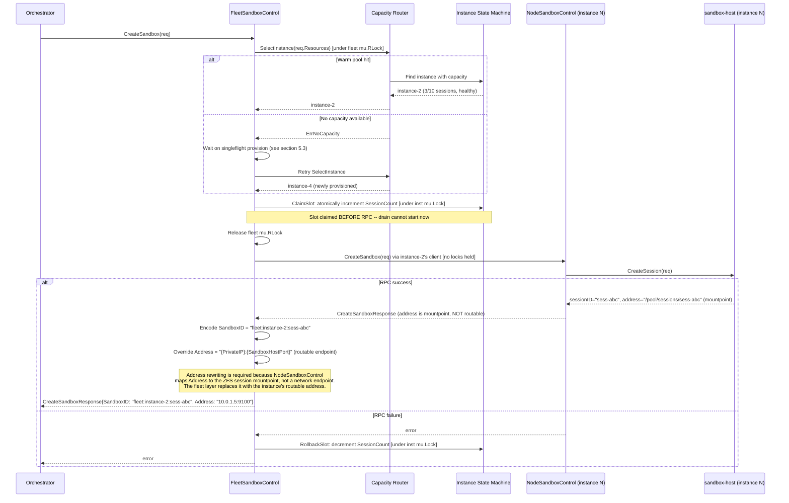
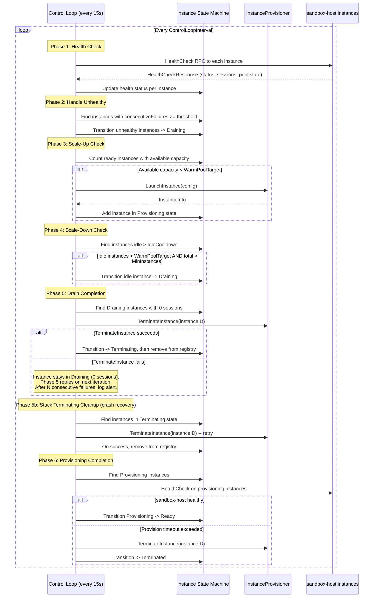
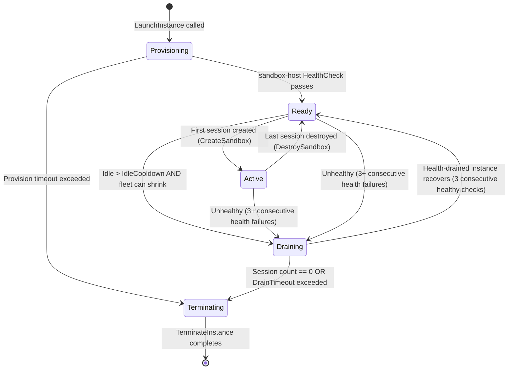

# 20: EC2 Fleet Management

**Status:** Draft (revised per review feedback)
**Depends on:** 18-agent-loop-rpc (SandboxControl interface), 11-sandbox-host-service (sandbox-host HealthCheck RPC), 11-sandbox-host-service.add01 (ExecutionEnvironment interface)
**Depended on by:** Orchestrator application (future), production-scale native sandbox deployment
**Scope:** Implement `FleetSandboxControl`, an in-process fleet manager that implements `SandboxControl` by managing a pool of sandbox-host EC2 instances. Provider-agnostic via `InstanceProvisioner` interface with EC2 as the first implementation. Includes fleet control loop (scaling, health, warm pool), capacity-aware routing, and SandboxID-encoded instance routing.
**Shaping source:** docs/shaping/ec2-fleet-management.md (Shape A selected: in-process fleet management with provider-agnostic InstanceProvisioner)
**Incorporated reviews:** docs/plans/20-fleet-management-review-coder-1-sea.md, docs/plans/20-fleet-management-review-r1-b.md, docs/plans/20-fleet-management-seam-review.md, docs/plans/20-fleet-management-review-r2-b.md, docs/plans/19-20-seam-review.md

---

## 1. Overview

`FleetSandboxControl` implements the `SandboxControl` interface by managing a fleet of sandbox-host instances. Each instance runs our native sandbox stack (ZFS + gVisor + sandbox-host service), and can host multiple concurrent sandboxes. The fleet manager handles:

- **Instance provisioning and termination** via a pluggable `InstanceProvisioner` interface (EC2 first, GCP and Azure future).
- **Warm pool maintenance** so `CreateSandbox` gets a ready instance without waiting for cloud boot.
- **Capacity-aware routing** to pick the least-loaded instance for new sandboxes.
- **Health monitoring** via periodic sandbox-host HealthCheck RPC calls.
- **Auto-scaling** up when capacity is exhausted and down when instances are idle.
- **Graceful drain** before instance termination to avoid killing active sandboxes.
- **SandboxID-encoded routing** so every subsequent call (DestroySandbox, LaunchProcess, etc.) routes to the correct instance without maintaining a session-to-instance map.

`FleetSandboxControl` wraps `NodeSandboxControl` -- it does not re-implement sandbox logic. For each instance in the fleet, it constructs a `NodeSandboxControl` client pointing at that instance's sandbox-host RPC address, and delegates all sandbox operations to it. The fleet layer's job is to decide WHICH instance to use and manage instance lifecycle.

### Relationship to Other SandboxControl Implementations

```
NodeSandboxControl       -- Single sandbox-host, direct RPC (existing)
FleetSandboxControl        -- Multi-instance fleet of sandbox-hosts (THIS PLAN)
EC2DirectSandboxControl    -- Raw EC2, no sandbox-host, shared OS (plan 19)
E2BSandboxControl          -- 3rd party E2B (future)
DaytonaSandboxControl      -- 3rd party Daytona (future)
FlySandboxControl          -- 3rd party Fly.io (future)
```

`FleetSandboxControl` is the production-scale version of `NodeSandboxControl`. It provides the same full capability set (instant ZFS snapshots, gVisor isolation, pause/resume, long-running processes) but across a dynamically managed fleet of instances.

---

## 2. Architecture

### 2.1 Component Diagram


### 2.2 Import Flow

```
internal/sandbox/control/instance     -- InstanceProvisioner interface + types (shared by Direct and Fleet)

internal/sandbox/control/fleet        -> internal/sandbox/control (SandboxControl, types)
                                      -> internal/sandbox/control/instance (InstanceProvisioner, InstanceConfig, etc.)
                                      -> internal/sandbox/control/native (NodeSandboxControl)
                                      -> internal/rpc/api (SandboxService, HealthCheckResponse -- used in FleetNodeClient interface)
                                      -> internal/rpc/client (SandboxClient constructor -- wrapped in FleetNodeClient)

internal/sandbox/control/fleet/ec2    -> internal/sandbox/control/instance (InstanceProvisioner)
                                      -> aws-sdk-go-v2/service/ec2

internal/sandbox/control/direct       -> internal/sandbox/control (SandboxControl, types)
                                      -> internal/sandbox/control/instance (InstanceProvisioner, InstanceConfig, etc.)
                                      -- Does NOT import internal/sandbox/control/fleet

cmd/flexagent (serve orchestrator)    -> internal/sandbox/control/fleet (FleetSandboxControl)
                                      -> internal/sandbox/control/fleet/ec2 (EC2InstanceProvisioner)
```

No circular imports. The `InstanceProvisioner` interface and its associated types live in `internal/sandbox/control/instance/`, a shared package imported by both `fleet` and `direct` independently. This eliminates the coupling where `direct` would otherwise import `fleet` solely for the provisioner interface. The `ec2` sub-package depends only on the shared `instance` package for the provisioner interface and the AWS SDK.

---

## 3. InstanceProvisioner Interface

`InstanceProvisioner` is the thin abstraction over cloud provider instance lifecycle. Each cloud provider implements this interface. The fleet control loop uses it for all provisioning operations and never touches cloud APIs directly.

The interface and all its associated types (`InstanceConfig`, `InstanceInfo`, `InstanceStatus`, `InstanceFilter`, `CloudInstanceState`) live in the shared package `internal/sandbox/control/instance/`, NOT in the fleet package. This allows both the `fleet` and `direct` adapters to import them independently without creating a coupling between the two adapter packages (per seam review finding F3).

```go
// internal/sandbox/control/instance/provisioner.go

// InstanceProvisioner manages cloud instance lifecycle. Implementations exist
// for each cloud provider (EC2, GCP, Azure). The fleet control loop calls
// these methods; it never touches cloud APIs directly.
type InstanceProvisioner interface {
    // LaunchInstance provisions a new instance from the given config.
    // Returns immediately with the instance ID and initial info. The instance
    // may still be booting (State == CloudInstancePending). The fleet manager
    // polls via DescribeInstance or HealthCheck to detect readiness.
    // This is non-blocking to avoid stalling the control loop.
    LaunchInstance(ctx context.Context, cfg InstanceConfig) (*InstanceInfo, error)

    // TerminateInstance permanently destroys an instance and all its resources.
    TerminateInstance(ctx context.Context, instanceID string) error

    // StopInstance stops an instance without terminating it. The instance can
    // be restarted with StartInstance. Storage is preserved.
    // Used for cost savings on warm-pool instances that have been idle too long.
    StopInstance(ctx context.Context, instanceID string) error

    // StartInstance restarts a previously stopped instance. Returns updated
    // InstanceInfo with potentially new IP addresses -- callers MUST use the
    // returned IPs rather than cached values. Cloud providers may reassign
    // IPs on stop/start (GCP releases external IP on stop; Azure deallocate
    // may change private IP; EC2 reassigns public IP if not Elastic). The
    // fleet control loop must update ManagedInstance.PrivateIP and recreate
    // the FleetNodeClient via SandboxClientFactory using the new address.
    StartInstance(ctx context.Context, instanceID string) (*InstanceInfo, error)

    // DescribeInstance returns current status of an instance from the cloud
    // provider's perspective (running, stopped, terminated, etc.).
    DescribeInstance(ctx context.Context, instanceID string) (*InstanceStatus, error)

    // ListInstances returns all instances matching the given filter. This is
    // essential for crash recovery: after a fleet manager restart, instance IDs
    // are lost and must be rediscovered from the cloud provider via tag-based
    // filtering (e.g., ManagedBy + fleet-id tags).
    ListInstances(ctx context.Context, filter InstanceFilter) ([]InstanceInfo, error)
}

// InstanceFilter specifies criteria for listing instances from the provider.
type InstanceFilter struct {
    // Tags filters instances that have all of these tags with matching values.
    // At minimum, used with {"ManagedBy": "flex-agent-runtime", "fleet-id": "<id>"}.
    Tags map[string]string

    // States filters to instances in these cloud states. If empty, all states
    // are returned (excluding terminated, which providers should omit by default).
    States []CloudInstanceState
}

// InstanceConfig specifies how to launch a new instance. Only provider-neutral
// fields are included here. Provider-specific launch configuration (security
// groups, subnets, IAM roles, etc.) is passed to the provisioner constructor
// via typed provider config (e.g., EC2LaunchConfig), not through this interface.
type InstanceConfig struct {
    // Image is the pre-baked machine image ID (AMI for EC2, GCE image for GCP, etc.).
    Image string

    // InstanceType is the cloud-specific instance size (e.g., "m5.xlarge",
    // "n2-standard-4"). The provisioner interprets this for its provider.
    InstanceType string

    // UserData is cloud-init / startup script content (optional; should be
    // unnecessary with a properly baked image, but available for overrides).
    UserData string

    // Tags are metadata tags applied to the instance. Used for fleet discovery,
    // operational visibility, and crash recovery filtering.
    Tags map[string]string

    // DiskSizeGB is the root volume size in GB.
    DiskSizeGB int
}

// InstanceInfo is returned after launching or starting an instance.
type InstanceInfo struct {
    InstanceID string
    PrivateIP  string
    PublicIP   string // May be empty if no public IP is assigned.
    State      CloudInstanceState
}

// InstanceStatus is the cloud provider's view of an instance.
type InstanceStatus struct {
    InstanceID string
    State      CloudInstanceState
    PrivateIP  string
    PublicIP   string
}

// CloudInstanceState represents the instance state as reported by the cloud
// provider, normalized to a minimal provider-neutral set. Each provisioner
// implementation maps its native states to these values (e.g., EC2 "shutting-down"
// -> CloudInstanceTerminating, GCP "STAGING" -> CloudInstancePending).
type CloudInstanceState string

const (
    CloudInstancePending     CloudInstanceState = "pending"     // Launching / booting
    CloudInstanceRunning     CloudInstanceState = "running"     // Running and reachable
    CloudInstanceStopping    CloudInstanceState = "stopping"    // Shutting down (but not terminated)
    CloudInstanceStopped     CloudInstanceState = "stopped"     // Stopped, can be restarted
    CloudInstanceTerminating CloudInstanceState = "terminating" // Being destroyed
    CloudInstanceTerminated  CloudInstanceState = "terminated"  // Destroyed, no longer exists
)
```

### 3.1 EC2InstanceProvisioner

The first implementation, using AWS SDK v2. AWS-specific launch configuration (security groups, subnets, key pairs, IAM roles) is provided via `EC2LaunchConfig` at construction time, not threaded through the shared `InstanceConfig` interface.

```go
// internal/sandbox/control/fleet/ec2/ec2_provisioner.go

// EC2LaunchConfig holds AWS-specific instance launch parameters.
// These are provider-specific and are NOT part of the shared InstanceConfig.
type EC2LaunchConfig struct {
    SecurityGroupIDs    []string // VPC security groups to attach
    SubnetID            string   // VPC subnet to launch into
    KeyName             string   // SSH key pair name (optional, for debugging)
    InstanceProfileName string   // IAM instance profile NAME (not ARN, not role name).
                                 // This is the instance profile that gets associated with the
                                 // EC2 instance via the IamInstanceProfile.Name parameter in
                                 // RunInstances. The instance profile must already exist and
                                 // have the desired IAM role attached to it.
}

// EC2InstanceProvisioner implements InstanceProvisioner using the AWS EC2 API.
type EC2InstanceProvisioner struct {
    client      *ec2.Client
    launchCfg   EC2LaunchConfig
    logger      *slog.Logger
}

func NewEC2InstanceProvisioner(cfg aws.Config, launchCfg EC2LaunchConfig, opts ...Option) *EC2InstanceProvisioner
```

Method mapping:

| InstanceProvisioner method | AWS API call(s) |
|----------------------------|----------------|
| `LaunchInstance` | `RunInstances` (returns immediately after instance ID is assigned) |
| `TerminateInstance` | `TerminateInstances` |
| `StopInstance` | `StopInstances` |
| `StartInstance` | `StartInstances` + `DescribeInstances` (wait for running) |
| `DescribeInstance` | `DescribeInstances` |
| `ListInstances` | `DescribeInstances` with tag filters |

`LaunchInstance` calls `RunInstances` and returns as soon as the instance ID is available (state `pending`). It does NOT block until the instance is running -- the fleet control loop detects readiness via DescribeInstance and HealthCheck polling in the provisioning completion phase. This keeps `LaunchInstance` non-blocking so it does not stall the control loop.

The provisioner applies all `InstanceConfig` fields (image, instance type, tags, disk size, user data) plus `EC2LaunchConfig` fields (security groups, subnet, key pair, IAM instance profile) to the `RunInstances` input.

`ListInstances` calls `DescribeInstances` with tag filters mapped from `InstanceFilter.Tags` and state filters mapped from `InstanceFilter.States`. This is the crash recovery path: the fleet manager calls `ListInstances(ctx, InstanceFilter{Tags: {"ManagedBy": "flex-agent-runtime", "fleet-id": fleetID}})` to rediscover all managed instances.

Tags always include `{"ManagedBy": "flex-agent-runtime", "fleet-id": "<fleet-id>"}` for operational visibility, cleanup, and crash recovery.

### 3.2 Future Providers

`GCPInstanceProvisioner` and `AzureInstanceProvisioner` are out of scope for this plan. The `InstanceProvisioner` interface is designed to accommodate them -- each provider's constructor accepts its own typed launch config (e.g., `GCPLaunchConfig` with network, subnetwork, service account). GCP would map to Compute Engine API (`instances.insert`, `instances.delete`, `instances.stop`, `instances.start`, `instances.list`). Azure would map to Azure Compute (`VirtualMachines.BeginCreateOrUpdate`, `BeginDelete`, `BeginDeallocate`, `BeginStart`, `VirtualMachines.ListAll` with filters).

### 3.3 Interface Contract Tests

Every `InstanceProvisioner` implementation must pass a shared contract test suite that verifies:

- `LaunchInstance` returns a valid `InstanceInfo` with non-empty `InstanceID`
- `DescribeInstance` on a launched instance returns a consistent state
- `TerminateInstance` on a launched instance succeeds and subsequent `DescribeInstance` returns `CloudInstanceTerminated`
- `ListInstances` with matching tags returns launched instances
- `ListInstances` with non-matching tags returns empty results
- `LaunchInstance` with invalid config returns an error (not a partial instance)
- `TerminateInstance` on an already-terminated instance is idempotent (no error)
- Transient cloud API errors are retried internally by the provisioner (not surfaced as permanent failures)

---

## 4. FleetSandboxControl

`FleetSandboxControl` implements `SandboxControl` by managing a pool of sandbox-host instances and delegating sandbox operations to per-instance `NodeSandboxControl` clients.

### 4.1 Constructor and Configuration

```go
// internal/sandbox/control/fleet/fleet.go

// FleetSandboxControl implements SandboxControl by managing a fleet of
// sandbox-host instances. It provisions instances via InstanceProvisioner,
// monitors health, maintains a warm pool, and routes sandbox operations
// to per-instance NodeSandboxControl clients.
//
// Lock ordering discipline (MUST be followed throughout):
//   1. FleetSandboxControl.mu  (fleet-level lock)
//   2. ManagedInstance.mu       (per-instance lock)
// The fleet lock is ALWAYS acquired before any instance lock. No code path
// may acquire FleetSandboxControl.mu while holding any ManagedInstance.mu.
// This prevents deadlocks between the control loop and concurrent callers.
type FleetSandboxControl struct {
    provisioner    instance.InstanceProvisioner  // from internal/sandbox/control/instance/
    config         FleetConfig
    instances      map[string]*ManagedInstance // guarded by mu
    mu             sync.RWMutex
    logger         *slog.Logger
    cancelLoop     context.CancelFunc
    loopDone       chan struct{}
    clientFactory  SandboxClientFactory // creates SandboxControl clients for an address

    // Pending provisions: tracks in-flight LaunchInstance calls to prevent
    // duplicate provisioning when multiple CreateSandbox callers hit
    // ErrNoCapacity simultaneously. Uses singleflight semantics.
    provisionGroup singleflight.Group
    pendingLaunches atomic.Int32 // current number of in-flight provisions
}

// FleetNodeClient combines SandboxControl with health checking. The fleet
// control loop needs both sandbox delegation and health polling from each
// instance. SandboxControl alone has no HealthCheck method, so this
// composite interface bridges the gap.
type FleetNodeClient interface {
    control.SandboxControl
    HealthCheck(ctx context.Context) (*api.HealthCheckResponse, error)
}

// SandboxClientFactory creates a FleetNodeClient for a given sandbox-host
// address. This is injected for testability -- unit tests provide a mock
// factory, production code provides the real RPC client constructor
// wrapping the connection in a NodeSandboxControl + health client.
// The factory must return a FleetNodeClient (not just SandboxControl)
// because the fleet control loop calls HealthCheck on every instance.
type SandboxClientFactory func(addr string) (FleetNodeClient, error)

// FleetConfig controls fleet behavior.
type FleetConfig struct {
    // Instance provisioning
    InstanceConfig instance.InstanceConfig // Template for launching new instances (from shared package)

    // Fleet sizing
    MinInstances   int // Floor -- never scale below this (default: 1)
    MaxInstances   int // Ceiling -- never scale above this (default: 50)
    WarmPoolTarget int // Number of idle instances to keep ready (default: 2)

    // Capacity thresholds
    MaxSessionsPerInstance int     // Max sandboxes per instance (default: 10)
    CapacityHeadroom       float64 // Don't route above this fraction (default: 0.8)

    // Health checking
    HealthCheckInterval    time.Duration // How often to poll (default: 15s)
    UnhealthyThreshold     int           // Consecutive failures before marking unhealthy (default: 3)

    // Scaling
    ControlLoopInterval    time.Duration // How often the control loop runs (default: 15s)
    IdleCooldown           time.Duration // How long an instance must be idle before scale-down (default: 10m)
    ProvisionTimeout       time.Duration // Max time to wait for instance to become healthy (default: 5m)
    MaxConcurrentProvisions int          // Max simultaneous LaunchInstance calls (default: 3)

    // Drain
    DrainTimeout           time.Duration // Max time to wait for active sandboxes during drain (default: 30m)
    MaxTerminateRetries    int           // Max consecutive TerminateInstance failures before alerting (default: 5)

    // Sandbox-host port
    SandboxHostPort        int // Port sandbox-host listens on (default: 9100)
}

func DefaultFleetConfig() FleetConfig

func NewFleetSandboxControl(
    provisioner instance.InstanceProvisioner,
    clientFactory SandboxClientFactory,
    cfg FleetConfig,
    opts ...FleetOption,
) *FleetSandboxControl
```

### 4.1.1 Concurrency: Atomic Claim-Slot Protocol

The TOCTOU race between `CreateSandbox` routing and control loop drain transitions is addressed via an **atomic claim-slot protocol**. Instead of selecting an instance and then creating the sandbox (leaving a window where the instance can be drained), `CreateSandbox` atomically reserves a session slot before making the RPC call:

```
1. Acquire fleet mu.RLock
2. Call SelectInstance to find the best candidate
3. Atomically increment candidate's SessionCount (claim the slot)
   - This is done under the instance's mu.Lock
   - The increment happens BEFORE the RPC call
   - The instance transitions Ready -> Active if this is its first session
4. Release fleet mu.RLock
5. Call client.CreateSandbox(ctx, req) -- the RPC call happens outside any lock
6. On RPC success: the slot is already claimed, nothing more to do
7. On RPC failure: roll back by decrementing SessionCount under instance mu.Lock
   - If this was the only session, transition Active -> Ready
```

The control loop's drain transition checks `SessionCount` under the instance lock. Because the claim-slot increment happens atomically before the RPC, the control loop sees the correct count:

- If the control loop reads `SessionCount > 0`, it cannot drain the instance (sessions still active).
- If `CreateSandbox` claims a slot on an instance that is already `Draining`, the claim is rejected because `SelectInstance` skips `Draining` instances, and the drain transition sets the state before any new slot can be claimed.

The key invariant: **the session count is always >= the number of actually active sessions**. It may temporarily overcount (if an RPC fails and the rollback hasn't happened yet), but it never undercounts. This means routing decisions are conservative (an instance appears more loaded than it is, never less), and drain decisions are safe (an instance won't appear empty when it has pending creates).

The TLA+ spec models this exact interleaving: the `ClaimSlot` action atomically increments the count and changes state, the `CreateRPC` action is a separate step that can fail, and the `RollbackSlot` action handles failure. The drain transition's `BeginDrain` action checks the session count atomically.

### 4.1.2 Lock Ordering Discipline

Two mutex levels exist in the system:

1. **`FleetSandboxControl.mu`** (fleet-level `sync.RWMutex`): Guards the `instances` map. Acquired as `RLock` for reads (routing, lookups) and `Lock` for writes (adding/removing instances).

2. **`ManagedInstance.mu`** (per-instance `sync.RWMutex`): Guards mutable instance fields (`SessionCount`, `State`, `LastHealthCheck`, `ConsecutiveFailures`, etc.).

**Strict ordering: fleet lock first, then instance lock.** This is enforced by convention and code review:

- The control loop acquires `mu.RLock` to iterate instances, then acquires individual `inst.mu.Lock` to update fields.
- `CreateSandbox` acquires `mu.RLock` for `SelectInstance`, then `inst.mu.Lock` for claim-slot.
- No code path acquires `mu` while holding any `inst.mu`.
- The control loop never calls back into fleet-level operations while holding an instance lock.

Code comments at both mutex declarations reference this ordering rule.

### 4.1.3 Session Count Reconciliation

Session counts can drift from reality due to:
- Process crash between RPC completion and local count update
- Network timeout where the RPC succeeded server-side but the client timed out
- sandbox-host restart (resetting its own session tracking)

**Reconciliation algorithm** (runs in the control loop's health check phase):

```
For each instance in Ready or Active state:
  1. Call HealthCheck RPC -> get remote_count (sandbox-host's reported SessionCount)
  2. Read local_count (fleet-tracked SessionCount)
  3. If remote_count != local_count:
     a. If remote_count < local_count:
        // Local overcount. The fleet thinks there are more sessions than
        // actually exist (e.g., DestroySandbox RPC succeeded but local
        // decrement was lost). Trust the remote count because the sandbox-host
        // is authoritative for what sessions actually exist on it.
        Set local_count = remote_count
        Log warning: "session count reconciled down" with instance ID, old, new
     b. If remote_count > local_count:
        // Local undercount. This is unusual -- it means sessions exist that
        // the fleet doesn't know about (e.g., a CreateSandbox RPC succeeded
        // but the local increment was lost). Trust the remote count.
        Set local_count = remote_count
        Log warning: "session count reconciled up" with instance ID, old, new
  4. After reconciliation, update instance state:
     - If local_count == 0 and State == Active -> transition to Ready
     - If local_count > 0 and State == Ready -> transition to Active
```

**Edge case: sandbox-host restart.** If the sandbox-host process restarts, it reports `SessionCount = 0` because its sessions are lost. The fleet manager reconciles down to 0, which is correct -- those sessions are genuinely gone. The orchestrator detects session loss via failed RPC calls and handles recovery (ResumeSession).

**Edge case: stale HealthCheck.** The HealthCheck response reflects the state at the time of the RPC call. Between the HealthCheck and the reconciliation update, new sessions may be created. This is safe because the claim-slot protocol increments the count atomically -- the reconciliation only runs between control loop iterations, and claim-slot increments happen independently.

The TLA+ spec models count drift by allowing the `HealthCheck` action to return a count that differs from the fleet-tracked count, and verifies that the reconciliation converges to the correct value within one control loop iteration.

### 4.2 CreateSandbox

`CreateSandbox` picks the best instance, atomically claims a session slot, creates a sandbox on it, and returns a SandboxID that encodes the instance identity for stateless routing. The claim-slot protocol (section 4.1.1) prevents the TOCTOU race between routing and drain.



**Address rewriting contract:** `NodeSandboxControl.CreateSandbox` returns `CreateSandboxResponse.Address` set to the ZFS session mountpoint (e.g., `/pool/sessions/sess-abc`), which is a filesystem path, not a network endpoint. `FleetSandboxControl` MUST override this with the instance's routable address (`{PrivateIP}:{SandboxHostPort}`) before returning the response to the caller. This ensures the orchestrator receives a valid `host:port` address for reaching the sandbox over the network. Unit tests assert that `Address` returned from fleet `CreateSandbox` is in `"host:port"` format, not a filesystem path.

### 4.3 DestroySandbox / LaunchProcess / KillProcess / GetProcessStatus / PauseSandbox / ResumeSandbox

All subsequent operations decode the instance from the SandboxID and delegate to the appropriate per-instance `NodeSandboxControl`.

```go
func (f *FleetSandboxControl) DestroySandbox(ctx context.Context, sandboxID string) error {
    instanceID, sessionID, err := parseSandboxID(sandboxID)
    if err != nil {
        return err
    }
    client, err := f.getInstanceClient(instanceID)
    if err != nil {
        return err
    }
    // Decrement session count BEFORE the RPC. If the RPC fails, we re-increment.
    // This is the inverse of the claim-slot protocol: we "release the slot" eagerly.
    // If the process crashes between decrement and RPC, the reconciliation loop
    // (section 4.1.3) corrects the count from the sandbox-host's HealthCheck.
    f.decrementSessionCount(instanceID)
    err = client.DestroySandbox(ctx, sessionID)
    if err != nil {
        // RPC failed -- the session may or may not still exist on the remote.
        // Re-increment to be conservative. The reconciliation loop will correct
        // the count from the sandbox-host's authoritative HealthCheck response.
        f.incrementSessionCount(instanceID)
        return err
    }
    return nil
}
```

The same pattern applies to all other `SandboxControl` methods. For methods that take a request struct containing `SandboxID`, the fleet layer MUST rewrite the request to use the session-local ID before delegating. Example for `LaunchProcess`:

```go
func (f *FleetSandboxControl) LaunchProcess(ctx context.Context, req control.LaunchProcessRequest) (*control.LaunchProcessResponse, error) {
    instanceID, sessionID, err := parseSandboxID(req.SandboxID)
    if err != nil {
        return nil, err
    }
    client, err := f.getInstanceClient(instanceID)
    if err != nil {
        return nil, err
    }
    // Rewrite the request with the session-local ID. The per-instance
    // NodeSandboxControl passes req.SandboxID directly to the RPC as
    // SessionID, so it MUST be the local session ID, not the fleet-encoded ID.
    delegateReq := control.LaunchProcessRequest{
        SandboxID:  sessionID,  // parsed local part, NOT the fleet SandboxID
        Binary:     req.Binary,
        Args:       req.Args,
        Env:        req.Env,
        ExposePort: req.ExposePort,
    }
    return client.LaunchProcess(ctx, delegateReq)
}
```

The same request-rewriting pattern applies to `KillProcess`, `GetProcessStatus`, `PauseSandbox`, and `ResumeSandbox` -- each constructs a new request struct with `SandboxID` set to `sessionID`.

**LaunchProcess response address assumption:** Fleet expects the `LaunchProcessResponse.Address` returned by the per-instance `NodeSandboxControl` to be routable from the orchestrator (i.e., using the instance's advertised IP, not `localhost` or `127.0.0.1`). The sandbox-host's `AdvertiseAddr` must be configured to return the host's actual IP. If the returned address contains `localhost` or `127.0.0.1`, Fleet should log a warning and attempt to rewrite it using the instance's known `PrivateIP`. This is a best-effort fix; the root cause would be a misconfigured `AdvertiseAddr` on the sandbox-host.

The fleet layer is a thin router that:
1. Parses the SandboxID to extract instance identity and session identity.
2. Looks up the `FleetNodeClient` for that instance.
3. Rewrites the request struct with the session-local ID before delegating.
4. Updates bookkeeping (session counts) on create/destroy.

Note: session count accuracy is ultimately guaranteed by the reconciliation algorithm (section 4.1.3), which periodically aligns fleet-tracked counts with the sandbox-host's authoritative HealthCheck response. The local count serves as a fast-path routing hint between reconciliation cycles.

### 4.4 Close / Shutdown Protocol

`FleetSandboxControl` implements a graceful shutdown via a `Close` method:

```go
// Close initiates graceful shutdown of the fleet manager.
//
// Shutdown sequence:
// 1. Cancel the control loop context (stops new control loop iterations).
// 2. Wait for the control loop goroutine to exit (loopDone channel).
// 3. Reject all new CreateSandbox calls with ErrFleetClosed.
// 4. Transition all instances to Draining (no new sessions).
// 5. Wait up to DrainTimeout for all active sessions to complete.
//    - During this wait, existing sandbox operations (DestroySandbox, etc.)
//      continue to work normally.
// 6. After DrainTimeout, force-terminate any instances that still have sessions.
// 7. Terminate all instances via InstanceProvisioner.TerminateInstance.
// 8. Return when all instances are terminated.
//
// If the fleet manager is being shut down for restart (not permanent shutdown),
// callers should set the FleetOption WithLeaveInstancesOnClose(true), which
// skips step 7 and leaves instances running for re-adoption by the restarted
// fleet manager via crash recovery (section 14, OQ2).
func (f *FleetSandboxControl) Close() error
```

`FleetSandboxControl` also implements `io.Closer`, so generic cleanup code can use type assertion (`if closer, ok := sc.(io.Closer); ok { closer.Close() }`). Note that `Close()` is intentionally NOT part of the `SandboxControl` interface: `NodeSandboxControl` has no background goroutines and does not need `Close()`. The orchestrator is responsible for knowing the concrete type and calling `Close()` on fleet providers. The `Close()` method has no context parameter; shutdown duration is bounded by `DrainTimeout` in `FleetConfig`.

**Cross-cutting concern:** Both Fleet and Direct (Plan 19) implement `io.Closer` but `SandboxControl` does not include `Close()`. This means the orchestrator must use type assertions for cleanup. Adding `Close() error` to `SandboxControl` (with a no-op for `NodeSandboxControl`) would simplify lifecycle management. This is tracked as a cross-cutting improvement for future work.

In-flight `CreateSandbox` calls that have already claimed a slot (section 4.1.1) are allowed to complete their RPC. The `Close` method waits for all in-flight operations to finish before beginning the drain sequence.

### 4.5 Capabilities

`FleetSandboxControl` reports the same feature capabilities as the native sandbox (since it delegates all sandbox operations to `NodeSandboxControl`), but populates `ConcurrentSandboxes` with the fleet's theoretical maximum capacity:

```go
func (f *FleetSandboxControl) Capabilities() control.SandboxCapabilities {
    return control.SandboxCapabilities{
        Snapshots:           true,
        Rollback:            true,
        Pause:               true,  // Lossless: delegates to Native (gVisor container pause preserves process state)
        LaunchProcess:       true,
        DeepPause:           false, // ZFS-to-S3 cold storage; not yet implemented
        ConcurrentSandboxes: f.config.MaxInstances * f.config.MaxSessionsPerInstance,
    }
}
```

Note: `ConcurrentSandboxes` is the theoretical ceiling (`MaxInstances * MaxSessionsPerInstance`). Actual available capacity depends on fleet state (how many instances are provisioned, healthy, and have headroom). The orchestrator should use `ErrNoCapacity` as the primary backpressure signal for admission control, not `ConcurrentSandboxes`. The capability value is useful for capacity planning and display purposes.

**Note on pause semantics:** Fleet's pause is **lossless** -- it delegates to `NodeSandboxControl` which uses gVisor container pause to preserve full process state. This differs from Direct's **lossy** pause (EC2 stop kills processes, only EBS survives). Both adapters report `Pause: true` but the fidelity differs. See Plan 19 OQ5 for the proposed `PausePreservesProcesses` capability flag.

**Note on `DeepPause`:** Explicitly set to `false`. `DeepPause` refers to ZFS-to-S3 cold storage archival, not whether processes survive pause. When DeepPause is implemented in the future, Fleet will need to be updated to report it.

**ToolEnvironmentConfig for fleet-launched agents:** The orchestrator creates agent sessions on fleet-managed instances by passing `ToolEnvSandbox` with the instance's sandbox-host address and the session ID:
```go
ToolEnvironmentConfig{
    Type:             ToolEnvSandbox,
    SandboxHostAddr:  "{instancePrivateIP}:{SandboxHostPort}",
    SandboxSessionID: "{sessionID}",  // the session-local part from parseSandboxID
}
```
This causes the `AgentLoopService` to create a `NativeSandboxEnvironment` pointing at the sandbox-host. The flow is implicitly correct because Fleet delegates to Node, which delegates to sandbox-host, following the same pattern as Plan 18 section 9.2.

---

## 5. Fleet Control Loop

A background goroutine that runs on a configurable interval (default 15s). It performs health checking, scaling decisions, and warm pool maintenance in each iteration.

### 5.1 Control Loop Sequence



**Phase 5 termination protocol:** The state transition to `Terminating` happens AFTER `TerminateInstance` succeeds, not before. If `TerminateInstance` fails, the instance remains in `Draining` with 0 sessions and phase 5 retries on the next control loop iteration. This prevents instances from getting stuck in `Terminating` state where no phase would retry them. After `MaxTerminateRetries` (default 5) consecutive `TerminateInstance` failures for the same instance, the control loop logs an alert-level message for manual intervention. Phase 5b handles crash recovery: if the fleet manager restarts and discovers instances in `Terminating` state (from a crash between the API call and registry removal), it retries `TerminateInstance` and removes them on success.

### 5.2 Health Polling

Each iteration calls `HealthCheck` on every instance in state Ready or Active via `ManagedInstance.Client.HealthCheck(ctx)` (the `FleetNodeClient` interface). The response from sandbox-host includes:

| Field | Type | Used For |
|-------|------|----------|
| `Status` | string ("healthy", "degraded", "unhealthy") | Instance health classification |
| `PoolState` | string | ZFS pool health (detect degraded arrays) |
| `SessionCount` | int | Live session count for capacity routing |
| `ActiveTools` | int | Current tool execution load |
| `Uptime` | duration | Detect recent restarts |
| `Errors` | []string | Recent error context for debugging |

Health check failure (RPC error, timeout, or `Status == "unhealthy"`) increments a per-instance `consecutiveFailures` counter. When this counter reaches `UnhealthyThreshold` (default 3), the instance transitions to `Draining` and a replacement is provisioned.

### 5.3 Scale-Up Trigger

Scale-up occurs when the number of instances with available capacity (session count below `MaxSessionsPerInstance * CapacityHeadroom`) falls below `WarmPoolTarget`. The control loop provisions new instances up to `MaxInstances`.

**Control loop provisioning is non-blocking.** `LaunchInstance` returns immediately after the cloud API assigns an instance ID (the instance is still booting). The control loop tracks the instance in `Provisioning` state and detects readiness in the provisioning completion phase (phase 6) via HealthCheck polling. This prevents long cloud boot times from stalling the control loop.

**Concurrent provisions are bounded** by `MaxConcurrentProvisions` (default 3). The control loop checks `pendingLaunches` before initiating a new provision and skips if the limit is reached.

**CreateSandbox no-capacity path uses singleflight deduplication.** When `CreateSandbox` gets `ErrNoCapacity`, it does NOT independently trigger a provision. Instead:

1. It calls `provisionGroup.Do("scale-up", func() { ... })` which ensures only one provision is in-flight for the `scale-up` key.
2. If a provision is already in-flight (from the control loop or another `CreateSandbox` caller), the caller waits on the same result.
3. The provision completes, adds the instance to the pool, and all waiting callers retry `SelectInstance`.
4. If the provision fails, all waiters receive the error.
5. If the caller's context is cancelled while waiting, the provision continues in the background (the instance will be added to the pool for future callers).

This prevents N concurrent `CreateSandbox` calls from launching N separate instances (capacity overshoot). The `MaxConcurrentProvisions` limit provides an additional safety bound.

### 5.4 Scale-Down Trigger

An instance is eligible for scale-down when:
1. It has zero active sessions.
2. It has been idle for longer than `IdleCooldown` (default 10 minutes).
3. Removing it would NOT bring the fleet below `MinInstances`.
4. Removing it would NOT bring the idle instance count below `WarmPoolTarget`.

Scale-down transitions the instance to `Draining` (which prevents new session assignment). Since it already has zero sessions, it immediately becomes eligible for termination in the next drain completion phase.

### 5.5 Graceful Drain

When an instance enters the `Draining` state (from scale-down, unhealthy detection, or explicit drain request):
1. It is removed from the routing pool -- no new sandboxes are assigned to it.
2. Existing sandboxes continue to operate normally.
3. The control loop monitors the session count each iteration.
4. When session count reaches 0, the instance is terminated.
5. If `DrainTimeout` is exceeded with sessions still active, the instance is force-terminated and a warning is logged. The orchestrator handles session loss via crash recovery (ResumeSession).

---

## 6. Capacity-Aware Routing

### 6.1 Instance Selection Algorithm

When `CreateSandbox` needs an instance, the capacity router scores each candidate:

```go
// internal/sandbox/control/fleet/routing.go

// SelectInstance picks the best instance for a new sandbox.
// Returns ErrNoCapacity if no instance can accept the sandbox.
//
// Strategy: spread (prefer most available capacity). When multiple instances
// have equal headroom, use IdleSince as a tiebreaker (prefer the instance that
// has been idle longest, promoting even distribution). If IdleSince is also
// equal (e.g., all instances at the same session count), use an atomic counter
// for round-robin to prevent map iteration order bias.
func (r *CapacityRouter) SelectInstance(instances []*ManagedInstance) (*ManagedInstance, error) {
    // Collect all candidates with their scores.
    type candidate struct {
        inst  *ManagedInstance
        score float64
    }
    var candidates []candidate

    for _, inst := range instances {
        if inst.State != InstanceReady && inst.State != InstanceActive {
            continue // skip provisioning, draining, terminated
        }
        if inst.SessionCount >= inst.MaxSessions {
            continue // full
        }
        headroom := 1.0 - (float64(inst.SessionCount) / float64(inst.MaxSessions))
        if headroom < (1.0 - r.config.CapacityHeadroom) {
            continue // above headroom threshold
        }
        candidates = append(candidates, candidate{inst: inst, score: headroom})
    }

    if len(candidates) == 0 {
        return nil, ErrNoCapacity
    }

    // Find the best score.
    bestScore := candidates[0].score
    for _, c := range candidates[1:] {
        if c.score > bestScore {
            bestScore = c.score
        }
    }

    // Collect all candidates within epsilon of the best score (tiebreaker pool).
    const epsilon = 0.001
    var tied []candidate
    for _, c := range candidates {
        if bestScore-c.score < epsilon {
            tied = append(tied, c)
        }
    }

    if len(tied) == 1 {
        return tied[0].inst, nil
    }

    // Tiebreaker: prefer the instance idle longest (oldest IdleSince).
    // For active instances (IdleSince is zero), fall through to round-robin.
    best := tied[0]
    allZero := best.inst.IdleSince.IsZero()
    for _, c := range tied[1:] {
        if !c.inst.IdleSince.IsZero() {
            allZero = false
            if best.inst.IdleSince.IsZero() || c.inst.IdleSince.Before(best.inst.IdleSince) {
                best = c
            }
        }
    }

    if allZero {
        // All tied candidates are active (no idle time). Use atomic counter
        // for round-robin to avoid map iteration order bias.
        idx := r.roundRobin.Add(1) % uint64(len(tied))
        return tied[idx].inst, nil
    }

    return best.inst, nil
}
```

The default strategy is **spread** (prefer most available capacity) rather than best-fit packing. This maximizes per-instance headroom so that burst traffic is absorbed without immediate scale-up. The strategy can be made configurable in the future.

**Resource-aware routing** (factoring in CPU/memory from `CreateSandboxRequest.Resources`) is deferred to a follow-up. The initial implementation uses session-count-only routing, which is sufficient when all sandboxes have similar resource profiles (the common case for our initial deployment). Resource-aware routing is tracked as OQ6 (section 14) and will be added when heterogeneous sandbox workloads are supported.

### 6.2 Capacity Data Sources

Capacity data comes from two sources:

1. **Fleet-tracked session count** -- incremented on `CreateSandbox` (via claim-slot), decremented on `DestroySandbox`. This is the primary routing signal because it is immediately consistent (no polling delay). It serves as a fast-path hint and may temporarily diverge from reality.

2. **HealthCheck response** -- provides authoritative session count, ZFS pool health status (`PoolState`), and uptime from the sandbox-host's perspective. The reconciliation algorithm (section 4.1.3) runs every control loop iteration and corrects any drift between the fleet-tracked count and the HealthCheck-reported count. The sandbox-host count is always trusted as the source of truth when a discrepancy is detected. Note: the current `api.HealthCheckResponse` does not include CPU/memory utilization or ZFS pool space data (`PoolCapacity`/`PoolFree`). The sandbox-host's internal `HealthStatus` struct includes `PoolSpace zfs.PoolSpace`, but the RPC server adapter drops this field during conversion. If pool space data is needed for future resource-aware routing (OQ6), `PoolCapacity float64` and `PoolFree int64` fields should be added to `api.HealthCheckResponse` and the RPC server adapter updated. CPU/memory metrics would require a new data source not currently in sandbox-host.

---

## 7. SandboxID Encoding

The SandboxID returned by `FleetSandboxControl.CreateSandbox` encodes the instance identity so that all subsequent calls route to the correct instance without maintaining a persistent session-to-instance mapping.

### 7.1 Format

```
fleet:<instanceID>:<sessionID>
```

Example:
```
fleet:i-0abc123def456:sess-7890xyz
```

- `fleet:` prefix distinguishes fleet-managed sandbox IDs from other adapters.
- `<instanceID>` is the cloud provider's instance identifier.
- `<sessionID>` is the session ID returned by the sandbox-host's `CreateSession`.

**Cross-adapter SandboxID prefix convention:** Each adapter uses a distinct prefix so the orchestrator can cheaply route operations to the correct adapter by inspecting the SandboxID prefix:
- `direct:{instanceID}` -- Direct adapter (Plan 19)
- `fleet:{instanceID}:{sessionID}` -- Fleet adapter (this plan)
- Raw session IDs (no prefix) -- Node/Native adapter (prefix convention can be added later)

This prefix convention ensures that passing a SandboxID from one adapter to another produces a clear error (wrong prefix), not silent corruption.

### 7.2 Parsing

```go
// internal/sandbox/control/fleet/fleet.go

const sandboxIDPrefix = "fleet:"

func encodeSandboxID(instanceID, sessionID string) (string, error) {
    if strings.Contains(instanceID, ":") {
        return "", fmt.Errorf("invalid instance ID: contains colon: %q", instanceID)
    }
    if instanceID == "" || sessionID == "" {
        return "", fmt.Errorf("invalid sandbox ID components: instanceID=%q sessionID=%q", instanceID, sessionID)
    }
    return sandboxIDPrefix + instanceID + ":" + sessionID, nil
}

func parseSandboxID(sandboxID string) (instanceID, sessionID string, err error) {
    if !strings.HasPrefix(sandboxID, sandboxIDPrefix) {
        return "", "", fmt.Errorf("invalid fleet sandbox ID: missing prefix: %q", sandboxID)
    }
    rest := sandboxID[len(sandboxIDPrefix):]
    idx := strings.Index(rest, ":")
    if idx < 0 {
        return "", "", fmt.Errorf("invalid fleet sandbox ID: missing session separator: %q", sandboxID)
    }
    instanceID, sessionID = rest[:idx], rest[idx+1:]
    if instanceID == "" || sessionID == "" {
        return "", "", fmt.Errorf("invalid fleet sandbox ID: empty component: %q", sandboxID)
    }
    return instanceID, sessionID, nil
}
```

### 7.3 Design Rationale

**Note:** The shaping doc (OQ8) recommended option (a): maintaining a `sandboxID -> instanceAddress` map with rebuild-on-restart, keeping SandboxIDs opaque. This plan chooses option (b): encoding instance ID in the SandboxID. The divergence is intentional for these reasons:

1. **Statelessness.** Encoding the instance in the SandboxID makes the fleet manager stateless for subsequent calls. If the fleet manager process restarts, it does not need to rebuild a session-to-instance mapping from persistent storage. It just needs the instance registry (rebuilt from cloud provider `ListInstances` calls) and the SandboxID tells it where each session lives.

2. **No mapping hot path.** Opaque IDs require a concurrent-safe map lookup on every `DestroySandbox`, `LaunchProcess`, etc. call. Encoded IDs require only string parsing, which is cheaper and lock-free.

3. **No mapping drift.** An in-memory map can lose entries on crash, requiring reconstruction from all instances (querying each sandbox-host for its session list). Encoded IDs are self-describing and never lose routing information.

The shaping doc's concern about leaking infrastructure details into the ID is addressed by the fact that SandboxIDs are internal identifiers passed between orchestrator and SandboxControl, never exposed to end users or external APIs.

### 7.4 SandboxID Validation

The parser enforces:
- Non-empty `instanceID` and `sessionID` components (empty components are rejected)
- The `fleet:` prefix is required
- The instance ID is validated against the known instance registry on routing calls
- Instance IDs MUST NOT contain colons -- `encodeSandboxID` rejects them at runtime. This is a hard constraint on provider instance ID formats. Current providers (EC2 `i-{hex}`, GCP numeric IDs, Azure resource names) satisfy this. Session IDs may contain colons since everything after `{instanceID}:` is treated as the sessionID

---

## 8. Instance Lifecycle State Machine

Each instance in the fleet has a state tracked by `ManagedInstance`:

```go
// internal/sandbox/control/fleet/instance_state.go

type InstanceState string

const (
    InstanceProvisioning InstanceState = "provisioning" // Cloud instance launched, waiting for sandbox-host healthy
    InstanceReady        InstanceState = "ready"         // sandbox-host healthy, 0 sessions, available for routing
    InstanceActive       InstanceState = "active"        // sandbox-host healthy, >= 1 session
    InstanceDraining     InstanceState = "draining"      // No new sessions, waiting for existing to finish
    InstanceTerminating  InstanceState = "terminating"   // TerminateInstance called, waiting for cloud confirmation
)

type ManagedInstance struct {
    // mu guards all mutable fields below. Lock ordering: FleetSandboxControl.mu
    // must always be acquired BEFORE this lock. See section 4.1.2.
    mu                  sync.RWMutex
    InstanceID          string
    PrivateIP           string
    State               InstanceState
    SessionCount        int
    MaxSessions         int
    Client              FleetNodeClient // Combined SandboxControl + HealthCheck client for this instance
    LastHealthCheck      time.Time
    LastHealthStatus     string // "healthy", "degraded", "unhealthy"
    ConsecutiveFailures  int
    ConsecutiveSuccesses int       // Used for Draining -> Ready recovery
    DrainReason          string    // "health", "scale-down", "shutdown" -- why draining started
    IdleSince           time.Time // When session count last reached 0
    ProvisionedAt       time.Time
}
```

### 8.1 State Transitions



Transitions and their triggers:

| From | To | Trigger |
|------|-----|---------|
| -- | Provisioning | Control loop calls `LaunchInstance` |
| Provisioning | Ready | Control loop detects healthy HealthCheck response |
| Provisioning | Terminating | `ProvisionTimeout` exceeded without healthy HealthCheck |
| Ready | Active | `CreateSandbox` assigns first session to this instance (claim-slot) |
| Active | Ready | `DestroySandbox` removes last session from this instance |
| Ready | Draining | Control loop scale-down (idle too long) |
| Active | Draining | Control loop detects unhealthy instance |
| Ready | Draining | Control loop detects unhealthy instance |
| Draining | Ready | Instance was drained for health reasons (`DrainReason == "health"`), still has active sessions, and passes `UnhealthyThreshold` consecutive healthy HealthChecks while draining. This prevents unnecessary instance churn from transient network partitions. Does NOT apply to scale-down or shutdown drains. |
| Draining | Terminating | Session count reaches 0, or `DrainTimeout` exceeded |
| Terminating | (removed) | `TerminateInstance` completes, instance removed from registry |

The `Draining -> Ready` recovery path prevents a transient health failure (e.g., brief network partition) from causing unnecessary instance termination and replacement, which would lose cached ZFS data and cost instance boot time. When an instance recovers health while draining, it is returned to the routing pool. The `ConsecutiveSuccesses` counter on `ManagedInstance` tracks healthy checks during the draining state for this purpose.

---

## 9. Package Structure

```
internal/
  sandbox/
    control/
      control.go                    # SandboxControl interface (existing)
      native/
        native.go                   # NodeSandboxControl (existing)
      instance/
        provisioner.go              # InstanceProvisioner interface + associated types
                                    # (InstanceConfig, InstanceInfo, InstanceStatus,
                                    #  InstanceFilter, CloudInstanceState)
                                    # Shared by fleet/ and direct/ -- neither imports the other.
      fleet/
        fleet.go                    # FleetSandboxControl: SandboxControl implementation
        fleet_test.go               # Unit tests with mock InstanceProvisioner
        control_loop.go             # Fleet control loop: scaling, health, warm pool
        control_loop_test.go        # Control loop unit tests
        routing.go                  # Capacity-aware instance selection
        routing_test.go             # Routing unit tests
        instance_state.go           # ManagedInstance, InstanceState, state transitions
        instance_state_test.go      # State machine unit tests
        sandbox_id.go               # SandboxID encoding/parsing (fleet: prefix)
        sandbox_id_test.go          # SandboxID round-trip tests
        config.go                   # FleetConfig, DefaultFleetConfig
        ec2/
          ec2_provisioner.go        # EC2InstanceProvisioner (AWS SDK v2)
          ec2_provisioner_test.go   # Unit tests with mocked EC2 client
```

---

## 10. TLA+ Formal Specification

The fleet control loop involves concurrent processes (multiple `CreateSandbox` callers, the control loop itself, drain/termination sequences) with subtle interleaving hazards. We use TLA+ to model-check the core concurrency properties and verify that no interleaving produces a safety violation.

### 10.1 Specification Scope

The TLA+ spec models the following concurrent interactions:

- **Claim-slot protocol (P0-1 fix).** The spec explicitly models the atomic claim-slot protocol: `ClaimSlot` atomically increments the session count and changes instance state, `CreateRPC` is a separate step that can succeed or fail, and `RollbackSlot` handles RPC failure. The `BeginDrain` action checks session count atomically and cannot interleave between `ClaimSlot` and the state update.
- **Session count drift and reconciliation (P0-2 fix).** The `HealthCheck` action can return a session count that differs from the fleet-tracked count (modeling crash/timeout scenarios). The `Reconcile` action corrects the fleet count to match the HealthCheck count. The spec verifies convergence within one control loop iteration.
- **Fleet control loop concurrency:** Multiple `CreateSandbox` callers racing with the control loop's scale-up and scale-down decisions. A caller may attempt to route to an instance that the control loop is concurrently deciding to drain or terminate.
- **Two-lock structure (P1-1 fix).** The spec models the fleet lock and per-instance locks as separate resources with the ordering invariant (fleet lock acquired before instance lock).
- **Warm pool maintenance racing with session assignment:** The control loop provisions new warm instances while callers are consuming warm instances.
- **Instance failure during active sessions:** An instance becomes unhealthy while it has active sessions. The spec verifies that the drain protocol completes correctly and no session is orphaned.

### 10.2 Safety Properties (Invariants)

The model checker verifies these invariants hold in every reachable state:

1. **No routing to draining/terminating instances.** For every session `s`, the instance that `s` is assigned to must be in state `Ready` or `Active` -- never `Draining` or `Terminating`. The claim-slot protocol ensures this by atomically checking state and incrementing the count in a single critical section.

2. **Scale-down never terminates an instance with active sessions (without completing drain first).** An instance may transition to `Terminating` only if its session count is 0 or the drain timeout has been exceeded.

3. **Session count monotonicity.** The fleet-tracked session count for an instance is always >= the number of actually active sessions on that instance. It may temporarily overcount (pending RPC or awaiting reconciliation) but never undercounts. This ensures routing decisions are conservative and drain decisions are safe.

4. **Session-to-instance uniqueness.** Every session's `SandboxID` maps to exactly one instance. No two instances claim the same session.

5. **Instance state exclusivity.** No instance is in two states simultaneously. The instance state is a total function from instance IDs to a single `InstanceState` value.

6. **Lock ordering.** No state is reachable where a process holds an instance lock and then acquires the fleet lock. (Models deadlock freedom.)

7. **Reconciliation convergence.** After a `Reconcile` action executes, the fleet-tracked session count equals the HealthCheck-reported count for that instance.

### 10.3 Liveness Properties

The model checker verifies these temporal properties (under fairness assumptions):

1. **CreateSandbox eventually completes.** Every `CreateSandbox` call eventually returns a result (success or error). There is no deadlock between the scale-up path and the routing path.

2. **Drain eventually terminates.** Every instance that enters the `Draining` state eventually reaches `Terminating` (unless it recovers via the `Draining -> Ready` path). The drain does not hang forever (enforced by `DrainTimeout`).

3. **Scale-up fires under pressure.** If all instances are above the capacity headroom threshold, the control loop eventually initiates a scale-up (unless `MaxInstances` is reached).

4. **Warm pool replenishment.** After a warm (idle) instance is activated by a `CreateSandbox` call, the control loop eventually provisions a replacement to restore the warm pool to `WarmPoolTarget` (unless `MaxInstances` is reached).

Note: The previous safety property "warm pool floor" (idle instances never drop below `WarmPoolTarget`) has been replaced by liveness property 4. The invariant form is too strong -- it trivially fails during legitimate transient states (warm instance activated before replacement is provisioned, provisioning failure, fleet startup). The correct property is that the control loop never _voluntarily_ reduces idle instances below `WarmPoolTarget` during scale-down decisions, which is enforced by the scale-down guard (section 5.4, condition 4).

### 10.4 Spec File Location

- **Spec:** `specs/fleet_control.tla` -- the TLA+ specification module.
- **Model-checker config:** `specs/fleet_control_mc.cfg` -- the TLC model checker configuration file specifying constants, invariants, and temporal properties.

### 10.5 Key Modeling Decisions

- **N instances, parameterized.** The model is parameterized over the number of instances. Start with `N = 3` for tractable state-space exploration. This is sufficient to exercise all pairwise interactions (routing contention, drain overlap, warm pool boundary).

- **M concurrent callers, parameterized.** The number of concurrent `CreateSandbox` callers is a separate parameter. Start with `M = 2` to model the minimal concurrent contention case. Increasing to 3 or 4 is feasible for targeted checks.

- **Cloud API calls abstracted as atomic transitions.** Actual cloud API calls (`RunInstances`, `TerminateInstances`, etc.) are modeled as atomic state transitions with nondeterministic success or failure. This avoids modeling network-level details while preserving the essential concurrency structure: the fleet manager's state may be stale relative to the cloud provider's actual state.

- **Control loop as a separate process.** The control loop is modeled as its own TLA+ process that interleaves with the caller processes. It executes the six phases (health check, handle unhealthy, scale-up, scale-down, drain completion, provisioning completion) atomically per phase but interleaves between phases with caller actions.

- **Time as a monotonic counter.** Real wall-clock time is abstracted to a monotonic integer counter. Cooldown durations (`IdleCooldown`, `DrainTimeout`, `ProvisionTimeout`) are expressed as counter thresholds. The counter advances nondeterministically, allowing TLC to explore all timing interleavings without modeling continuous time.

- **Claim-slot as atomic action.** The `ClaimSlot` action atomically reads instance state, checks it is `Ready` or `Active`, increments the session count, and transitions the state if needed. This models the Go implementation where the instance lock is held for the entire sequence. The `BeginDrain` action similarly checks the session count atomically under the lock.

---

## 11. Testing Strategy

### 11.1 Unit Tests

All unit tests use a mock `InstanceProvisioner` and mock `SandboxClientFactory`. No cloud API calls or real instances.

**FleetSandboxControl (fleet_test.go):**
- CreateSandbox routes to least-loaded instance and returns fleet-prefixed SandboxID
- CreateSandbox with no available capacity waits on singleflight provision
- CreateSandbox concurrent callers with no capacity share a single provision (no overshoot)
- CreateSandbox at MaxInstances with all instances full returns error
- CreateSandbox claim-slot rolls back on RPC failure
- CreateSandbox that selects an instance racing with control loop drain transition is handled correctly (claim-slot prevents routing to draining instance)
- DestroySandbox parses SandboxID, delegates to correct instance, decrements count
- DestroySandbox with failed RPC re-increments session count
- DestroySandbox with invalid SandboxID format returns error
- LaunchProcess / KillProcess / GetProcessStatus route correctly via SandboxID
- PauseSandbox / ResumeSandbox route correctly via SandboxID
- CreateSandbox overrides Address with routable host:port (not mountpoint passthrough)
- LaunchProcess rewrites request SandboxID to session-local ID before delegation
- KillProcess / GetProcessStatus rewrite request SandboxID to session-local ID
- Capabilities returns ConcurrentSandboxes = MaxInstances * MaxSessionsPerInstance
- Concurrent CreateSandbox calls are serialized correctly (no double-assignment)
- Close stops control loop, drains all instances, terminates instances
- Close with LeaveInstancesOnClose leaves instances running
- Close rejects new CreateSandbox calls with ErrFleetClosed

**Control Loop (control_loop_test.go):**
- Health check failure increments consecutive failure counter
- 3 consecutive failures transitions instance to Draining with DrainReason "health"
- Healthy response resets consecutive failure counter
- Session count reconciliation corrects overcount (fleet > HealthCheck)
- Session count reconciliation corrects undercount (fleet < HealthCheck)
- Session count reconciliation after sandbox-host restart (remote count = 0)
- Scale-up triggered when available capacity < WarmPoolTarget
- Scale-up respects MaxInstances ceiling
- Scale-up respects MaxConcurrentProvisions limit
- Scale-down triggered when instance idle > IdleCooldown
- Scale-down respects MinInstances floor
- Scale-down does not remove instances when idle count <= WarmPoolTarget
- Drain completion terminates instance when session count reaches 0 (state -> Terminating AFTER API success)
- Drain completion TerminateInstance failure leaves instance in Draining for retry
- Drain completion retries TerminateInstance on next loop iteration
- Drain completion logs alert after MaxTerminateRetries consecutive failures
- Phase 5b cleans up instances stuck in Terminating state after crash recovery
- Drain timeout force-terminates instance
- Draining instance with DrainReason "health" recovers to Ready after 3 consecutive healthy checks
- Draining instance with DrainReason "scale-down" does NOT recover to Ready
- Provisioning timeout terminates stuck instances
- Provisioning -> Ready transition on first healthy HealthCheck (non-blocking launch)
- Warm pool reconciliation provisions to fill gap
- Crash recovery: ListInstances rediscovers managed instances and rebuilds fleet state
- Crash recovery: stale/orphan instance (not in HealthCheck) is terminated

**Routing (routing_test.go):**
- SelectInstance returns instance with most headroom (spread strategy)
- SelectInstance breaks ties using IdleSince (prefer longest idle)
- SelectInstance breaks ties with round-robin when all candidates have same IdleSince
- SelectInstance distributes evenly across equal-headroom instances over many calls
- SelectInstance skips instances in Draining/Terminating/Provisioning state
- SelectInstance skips instances above CapacityHeadroom threshold
- SelectInstance returns ErrNoCapacity when all instances full
- SelectInstance with single available instance returns it

**Instance State Machine (instance_state_test.go):**
- All valid state transitions succeed
- Invalid state transitions return error
- Ready -> Active on session count increment from 0
- Active -> Ready on session count decrement to 0
- Draining -> Ready when DrainReason is "health" and ConsecutiveSuccesses >= threshold
- Draining -> Ready rejected when DrainReason is "scale-down"
- Draining -> Ready rejected when DrainReason is "shutdown"

**SandboxID (sandbox_id_test.go):**
- encodeSandboxID produces correct format
- parseSandboxID round-trips correctly
- parseSandboxID with missing prefix returns error
- parseSandboxID with missing session separator returns error
- parseSandboxID with empty components returns error
- encodeSandboxID with colon in instanceID returns error
- encodeSandboxID with empty instanceID or sessionID returns error

**EC2InstanceProvisioner (ec2/ec2_provisioner_test.go):**
- LaunchInstance calls RunInstances with correct parameters including EC2LaunchConfig fields (mock EC2 API)
- LaunchInstance applies tags including ManagedBy and fleet-id
- LaunchInstance returns immediately (does not wait for running state)
- TerminateInstance calls TerminateInstances
- TerminateInstance on already-terminated instance is idempotent
- StopInstance calls StopInstances
- StartInstance calls StartInstances and waits for running
- DescribeInstance returns mapped status (EC2 states -> CloudInstanceState)
- ListInstances calls DescribeInstances with tag filters from InstanceFilter
- ListInstances with state filter maps CloudInstanceState to EC2 states
- ListInstances with no matching tags returns empty result

### 11.2 Integration Tests (Build-Tag Gated)

Integration tests that interact with real AWS resources are gated behind `//go:build integration`. They are not run in CI by default. They require AWS credentials and will provision real EC2 instances.

```go
//go:build integration

// TestFleetSandboxControl_RealEC2 provisions a single EC2 instance,
// creates a sandbox, executes a tool, and destroys everything.
func TestFleetSandboxControl_RealEC2(t *testing.T) { ... }
```

Tests to include:
- Provision a single instance, wait for healthy, create sandbox, destroy sandbox, terminate instance
- Warm pool: provision 2 instances, verify both reach Ready
- Scale-down: create sandbox, destroy it, wait for idle cooldown, verify instance terminated
- Health failure: stop sandbox-host on an instance, verify fleet detects and drains
- Crash recovery: kill fleet manager, restart, verify re-adoption of running instances via ListInstances
- Crash recovery: verify orphan instances (HealthCheck fails persistently) are scheduled for termination

### 11.3 Test Doubles

```go
// internal/sandbox/control/fleet/fleet_test.go

// MockInstanceProvisioner records calls and returns configured responses.
type MockInstanceProvisioner struct {
    mu              sync.Mutex
    LaunchCalls     []InstanceConfig
    TerminateCalls  []string
    StopCalls       []string
    StartCalls      []string
    DescribeCalls   []string
    ListCalls       []InstanceFilter

    LaunchResult    *InstanceInfo
    LaunchError     error
    ListResult      []InstanceInfo
    ListError       error
    // ... configurable per-call responses
}
```

The `SandboxClientFactory` in tests returns a mock `FleetNodeClient` that implements both `SandboxControl` and `HealthCheck`, recording all calls and returning configured responses. This allows testing the full fleet flow (routing -> claim-slot -> delegation -> bookkeeping) and health polling without any RPC or cloud infrastructure.

---

## 12. Connected Components / Seams

### 12.1 Consumed Seams

| Seam | How Used |
|------|----------|
| `internal/sandbox/control/control.go` | `SandboxControl` interface that `FleetSandboxControl` implements; `CreateSandboxRequest/Response`, `LaunchProcessRequest/Response`, etc. |
| `internal/sandbox/control/native/native.go` | `NodeSandboxControl` created per instance to delegate sandbox operations |
| `internal/rpc/api/types.go` | `HealthCheckRequest/Response` for health polling |
| `internal/rpc/client/` | `SandboxClient` constructor for creating RPC connections to sandbox-host instances |
| AWS SDK v2 `ec2` package | Used by `EC2InstanceProvisioner` for instance lifecycle |

### 12.2 Produced Seams

| Seam | Description |
|------|-------------|
| `internal/sandbox/control/instance/provisioner.go` | `InstanceProvisioner` interface and associated types -- shared by Fleet and Direct adapters, consumed by future GCP/Azure implementations |
| `internal/sandbox/control/fleet/fleet.go` | `FleetSandboxControl` -- consumed by orchestrator as a `SandboxControl` implementation |
| `internal/sandbox/control/fleet/ec2/ec2_provisioner.go` | `EC2InstanceProvisioner` -- first `InstanceProvisioner` implementation |

### 12.3 Modified Seams

No existing code is modified by this plan. `FleetSandboxControl` is a new `SandboxControl` implementation alongside `NodeSandboxControl` and `EC2DirectSandboxControl`. The orchestrator selects which implementation to use via configuration.

### 12.4 Import Flow

```
cmd/flexagent (orchestrator)
  -> internal/sandbox/control/fleet      (FleetSandboxControl)
  -> internal/sandbox/control/fleet/ec2  (EC2InstanceProvisioner)

internal/sandbox/control/fleet
  -> internal/sandbox/control            (SandboxControl interface, types)
  -> internal/sandbox/control/instance   (InstanceProvisioner, InstanceConfig, InstanceInfo, etc.)
  -> internal/sandbox/control/native     (NodeSandboxControl)
  -> internal/rpc/api                    (SandboxService, HealthCheck types)
  -> internal/rpc/client                 (NewSandboxClient)

internal/sandbox/control/fleet/ec2
  -> internal/sandbox/control/instance   (InstanceProvisioner, InstanceConfig, InstanceInfo)
  -> github.com/aws/aws-sdk-go-v2/service/ec2
```

Key invariants:
- `internal/sandbox/control/fleet` does NOT import `internal/sandbox/control/fleet/ec2`. The concrete provisioner is injected by the caller (orchestrator). This keeps the fleet package provider-agnostic.
- `internal/sandbox/control/fleet` does NOT import `internal/sandbox/control/direct`, and vice versa. Both import from the shared `instance` package independently.

---

## 13. Implementation Order

1. **InstanceProvisioner interface + types** (`instance/provisioner.go`, `fleet/config.go`)
   - Define `InstanceProvisioner` (including `ListInstances`), `InstanceFilter`, `InstanceConfig`, `InstanceInfo`, `InstanceStatus`, `CloudInstanceState` in the shared `internal/sandbox/control/instance/` package
   - Define `FleetConfig`, `DefaultFleetConfig()` in `fleet/config.go`

2. **SandboxID encoding/parsing** (`fleet/sandbox_id.go`) + unit tests
   - `encodeSandboxID`, `parseSandboxID`
   - Round-trip and error-case tests including empty component rejection

3. **Instance state machine** (`fleet/instance_state.go`) + unit tests
   - `ManagedInstance`, `InstanceState`, state transition validation
   - Include `Draining -> Ready` transition for health-drained instances
   - Tests for all valid/invalid transitions including drain recovery

4. **Capacity-aware routing** (`fleet/routing.go`) + unit tests
   - `SelectInstance` with spread strategy + tiebreaker (IdleSince, round-robin)
   - Tests for all selection and skip scenarios including tie distribution

5. **FleetSandboxControl core** (`fleet/fleet.go`) + unit tests
   - Constructor, `CreateSandbox` with claim-slot protocol, `DestroySandbox`, delegation methods
   - `Close` / shutdown protocol
   - Singleflight provisioning coordination
   - Uses mock `InstanceProvisioner` and mock `SandboxClientFactory`
   - Tests for routing, claim-slot, rollback, delegation, SandboxID encoding, session count tracking, concurrent create+drain race

6. **Fleet control loop** (`fleet/control_loop.go`) + unit tests
   - Health polling, session count reconciliation, scale-up (non-blocking), scale-down, drain, warm pool maintenance
   - Provisioning completion detection
   - Draining -> Ready recovery for health-drained instances
   - Crash recovery via `ListInstances`
   - Tests with deterministic time control (injectable clock)

7. **EC2InstanceProvisioner** (`fleet/ec2/ec2_provisioner.go`) + unit tests
   - AWS SDK v2 integration with mocked EC2 client
   - All CRUD operations + `ListInstances` + tag management
   - Provider-specific config via `EC2LaunchConfig` at construction time

8. **InstanceProvisioner contract tests** (`fleet/provisioner_contract_test.go`)
   - Shared test suite verifiable by any `InstanceProvisioner` implementation
   - Covers launch, describe, terminate, list, idempotency, error handling

9. **Integration tests** (build-tag gated)
   - Real EC2 provisioning, health check, sandbox lifecycle
   - Crash recovery: kill fleet manager, restart, verify re-adoption via `ListInstances`
   - Gated behind `//go:build integration`

10. **Orchestrator wiring**
    - Add `FleetSandboxControl` as a `SandboxControl` provider option in `flexagent serve orchestrator`
    - Configuration: fleet config from flags / config file / environment

---

## 14. Open Questions

### OQ1: Warm Pool Sizing

The warm pool target is a static config value initially (default 2). A feedback loop that adjusts the target based on cold-provision hit rate would be valuable but is deferred to a follow-up. Start static, instrument the cold-provision rate, and add adaptive sizing when we have data.

### OQ2: State Persistence for Crash Recovery

If the fleet manager process crashes, the in-memory instance registry is lost. On restart, it must rebuild state. Options:
- **(a) Cloud provider list** -- call `InstanceProvisioner.ListInstances` with the `ManagedBy=flex-agent-runtime` and `fleet-id` tag filter to find all fleet instances, then `HealthCheck` each to determine current state. This is the simplest approach and requires no external state store.
- **(b) File-based persistence** -- write instance registry to a local JSON file on each change. Faster restart but lost if the host is terminated.
- **(c) DynamoDB** -- durable across host failures but adds an external dependency.

Recommendation: start with (a) for simplicity. The `ListInstances` method on `InstanceProvisioner` (added per review feedback) provides the provider-agnostic discovery mechanism. The `ManagedBy` and `fleet-id` tags on each instance provide enough information to reconstruct the registry. HealthCheck tells us session count and health. Recovery sequence:

1. Call `ListInstances(ctx, InstanceFilter{Tags: {"ManagedBy": "flex-agent-runtime", "fleet-id": fleetID}})`.
2. For each discovered instance, call `DescribeInstance` to get current cloud state.
3. Skip instances in `terminated` state.
4. For `running` instances, call `HealthCheck` to get session count and health.
5. Reconstruct `ManagedInstance` entries with state derived from HealthCheck results.
6. Identify orphan instances (running but HealthCheck fails persistently) and schedule for drain/termination.

This approach has a brief gap (seconds) during restart where the fleet manager cannot route, but the orchestrator retries handle this.

### OQ3: Instance Type Selection

Start with a single configurable instance type in `FleetConfig.InstanceConfig`. Heterogeneous instance types (different sizes for different sandbox workloads) are deferred. The `InstanceConfig` struct supports this future extension but the routing logic does not account for variable capacity per instance type initially.

### OQ4: AMI Build Pipeline

The AMI (or equivalent machine image for other providers) must contain Ubuntu LTS + ZFS + gVisor + flexagent binary + systemd unit + base ZFS pool with initial snapshot. This plan assumes the AMI already exists and is specified in `FleetConfig.InstanceConfig.Image`. Building the AMI pipeline (Packer template, CI/CD integration, rotation) is a separate task.

### OQ5: Spot Instance Support

EC2 Spot instances can save 60-70% but add complexity (2-minute interruption notices). The `InstanceProvisioner` interface supports this -- `LaunchInstance` could accept a spot parameter, and the fleet control loop would handle interruption notices by transitioning interrupted instances to Draining. Deferred to a follow-up.

### OQ6: Resource-Aware Routing

`CreateSandboxRequest` includes a `Resources` field (CPU, memory) from the `SandboxControl` interface, and the shaping doc emphasizes resource-based packing. The initial implementation uses session-count-only routing, which is sufficient when all sandboxes have similar resource profiles. Resource-aware routing (tracking per-instance allocated CPU/memory and factoring it into `SelectInstance` scoring) is deferred to a follow-up when heterogeneous sandbox workloads are supported. The `ManagedInstance` struct can be extended with `AllocatedCPU` and `AllocatedMemMB` fields, and the HealthCheck response already provides system-level resource data for reconciliation.

---

## 15. Observability

The fleet manager emits structured metrics and logs for operational visibility. This is critical for a system managing cloud instances with real cost implications.

### 15.1 Metrics

All metrics use the `fleet_` prefix and are exposed via the standard metrics registry (prometheus-compatible).

**Gauges:**
- `fleet_instances_total{state}` -- current number of instances by state (provisioning, ready, active, draining, terminating)
- `fleet_sessions_total` -- total active sessions across all instances
- `fleet_warm_pool_size` -- current number of idle instances (warm pool)
- `fleet_pending_provisions` -- number of in-flight LaunchInstance calls

**Counters:**
- `fleet_create_sandbox_total{result}` -- CreateSandbox calls by result (success, no_capacity, error)
- `fleet_destroy_sandbox_total{result}` -- DestroySandbox calls by result (success, error)
- `fleet_provisions_total{result}` -- LaunchInstance calls by result (success, timeout, error)
- `fleet_terminations_total{reason}` -- TerminateInstance calls by reason (scale_down, unhealthy, drain_timeout, shutdown)
- `fleet_health_checks_total{result}` -- HealthCheck calls by result (healthy, degraded, unhealthy, error)
- `fleet_session_reconciliations_total{direction}` -- session count corrections by direction (up, down)
- `fleet_drain_recoveries_total` -- instances recovered from Draining to Ready
- `fleet_claim_slot_rollbacks_total` -- claim-slot rollbacks due to RPC failure

**Histograms:**
- `fleet_provision_duration_seconds` -- time from LaunchInstance to Ready state
- `fleet_create_sandbox_duration_seconds` -- end-to-end CreateSandbox latency
- `fleet_drain_duration_seconds` -- time from Draining to Terminating
- `fleet_health_check_duration_seconds` -- HealthCheck RPC latency

### 15.2 Structured Logging

State transitions and error conditions are logged with structured fields:

- Instance state transitions: `instance_id`, `from_state`, `to_state`, `reason`
- Session count reconciliation: `instance_id`, `fleet_count`, `remote_count`, `direction`
- Claim-slot rollback: `instance_id`, `error`
- Drain timeout force-termination: `instance_id`, `remaining_sessions`, `drain_duration`
- Provision timeout: `instance_id`, `provision_duration`
- Scale decisions: `action` (scale_up/scale_down), `current_instances`, `target_instances`, `reason`

### 15.3 FleetStatus Method

```go
// FleetStatus returns a snapshot of fleet state for operational visibility.
// Can be exposed via a health/status endpoint by the orchestrator.
type FleetStatusResponse struct {
    TotalInstances    int
    InstancesByState  map[InstanceState]int
    TotalSessions     int
    WarmPoolSize      int
    PendingProvisions int
    Healthy           bool // true if warm pool >= target and no stuck drains
}

func (f *FleetSandboxControl) FleetStatus() FleetStatusResponse
```

---

## 15.4 Error Classification

Errors surfaced by `FleetSandboxControl` to the orchestrator, classified for retry guidance:

| Error | Retry-safe? | Description |
|-------|-------------|-------------|
| `ErrNoCapacity` | Yes (with backoff) | No instance has available session slots. The fleet may be scaling up. Caller should wait briefly and retry. The singleflight provision path (section 5.3) handles deduplication automatically. |
| `ErrFleetClosed` | No | The fleet manager is shutting down. No new sandboxes will be accepted. |
| `parseSandboxID` error | No | The SandboxID is malformed (wrong prefix, missing components). This is a programming error, not a transient condition. |
| Node RPC errors (delegated) | Depends | Errors from `NodeSandboxControl` RPC calls pass through. Network errors and timeouts are retry-safe. Application-level errors (session not found, etc.) are not. |
| `InstanceProvisioner` errors | Depends | `LaunchInstance` cloud API errors may be transient (rate limiting, throttling) or permanent (invalid config, quota exceeded). The provisioner handles internal retries for transient failures. |
| Claim-slot rollback errors | N/A | Not surfaced to caller. Claim-slot rollback happens internally on RPC failure. The reconciliation loop (section 4.1.3) corrects any drift. |

**Note on shared error taxonomy:** Each adapter currently defines its own sentinel errors. A shared error set in `internal/sandbox/control/errors.go` (e.g., `control.ErrSandboxNotFound`, `control.ErrNoCapacity`, `control.ErrProviderClosed`) that all adapters wrap or return would simplify orchestrator error handling. This is tracked as a cross-cutting improvement for future work.

---

## 16. Review Disposition Table

Findings from `docs/plans/20-fleet-management-review-coder-1-sea.md` and `docs/plans/20-fleet-management-review-r1-b.md`, tracked with disposition.

| # | Source | Priority | Finding | Disposition | Section(s) Updated |
|---|--------|----------|---------|-------------|-------------------|
| 1 | r1-b P0-1 | P0 | TOCTOU race between CreateSandbox routing and control loop drain transition | **Fixed.** Added atomic claim-slot protocol: session count is incremented before the RPC call and rolled back on failure. Drain transition checks count atomically. TLA+ spec updated to model this interleaving. | 4.1.1, 4.2, 10.1, 10.2 |
| 2 | r1-b P0-2 | P0 | Session count drift after DestroySandbox failure is unrecoverable | **Fixed.** Added complete reconciliation algorithm: HealthCheck-reported count is authoritative, fleet count is corrected every control loop iteration. Handles overcount, undercount, and sandbox-host restart. TLA+ spec models count drift and reconciliation convergence. | 4.1.3, 4.3, 6.2, 10.1, 10.2 |
| 3 | r1-b P1-1 | P1 | Nested mutexes (FleetSandboxControl.mu + ManagedInstance.mu) with no lock ordering | **Fixed.** Specified strict lock ordering: fleet lock always acquired before instance lock, never the reverse. Documented in FleetSandboxControl struct comment and section 4.1.2. TLA+ spec models two-lock structure and verifies deadlock freedom. | 4.1, 4.1.2, 8, 10.1, 10.2 |
| 4 | r1-b P1-2, coder-1-sea P1 | P1 | Synchronous provisioning from CreateSandbox blocks callers up to 5min; no singleflight dedup | **Fixed.** LaunchInstance is now non-blocking (returns after instance ID assigned). CreateSandbox no-capacity path uses singleflight dedup. Added MaxConcurrentProvisions config. Provisions complete regardless of caller context cancellation. | 3, 3.1, 4.1, 5.3 |
| 5 | r1-b P1-3, coder-1-sea P1 | P1 | InstanceProvisioner lacks ListInstances, breaking crash recovery | **Fixed.** Added `ListInstances(ctx, InstanceFilter)` to InstanceProvisioner interface. InstanceFilter supports tag and state filtering. EC2 maps to DescribeInstances with filters. OQ2 updated with full recovery sequence. | 3, 3.1, 13, 14 (OQ2) |
| 6 | r1-b P1-4, coder-1-sea P1 | P1 | InstanceConfig fields (SecurityGroupIDs, SubnetID, etc.) are AWS-specific | **Fixed.** InstanceConfig now contains only provider-neutral fields (Image, InstanceType, UserData, Tags, DiskSizeGB). AWS-specific fields moved to EC2LaunchConfig, passed to EC2InstanceProvisioner constructor. Future providers use their own typed config. | 3, 3.1, 3.2 |
| 7 | r1-b P1-5 | P1 | No Close/shutdown protocol specified | **Fixed.** Added section 4.4 with Close method specification: cancellation sequence, drain behavior, timeout handling, and LeaveInstancesOnClose option for re-adoption. | 4.4 |
| 8 | r1-b P2-1 | P2 | Spread strategy tiebreaker missing | **Fixed.** Added two-level tiebreaker: IdleSince (prefer longest idle) then atomic round-robin counter. Prevents map iteration order bias. | 6.1 |
| 9 | r1-b P2-2 | P2 | No resource-aware routing despite CreateSandboxRequest.Resources | **Deferred with justification.** Session-count-only routing is sufficient for initial deployment with homogeneous sandbox profiles. Documented as OQ6 with clear plan for future addition. | 6.1, 14 (OQ6) |
| 10 | r1-b P2-3 | P2 | TLA+ warm pool invariant (safety property 3) too strong | **Fixed.** Removed as safety invariant. Replaced with note that the correct property is enforced by the scale-down guard (section 5.4 condition 4). Warm pool replenishment remains as liveness property 4. | 10.2, 10.3 |
| 11 | r1-b P2-4 | P2 | No metrics, logging, or observability specification | **Fixed.** Added section 15 with full observability spec: gauges, counters, histograms for key fleet operations. Structured logging for state transitions, reconciliation, errors. FleetStatus method for health endpoints. | 15 |
| 12 | r1-b P2-5 | P2 | No Draining -> Ready recovery path for transient health failures | **Fixed.** Added Draining -> Ready transition when DrainReason is "health" and instance passes UnhealthyThreshold consecutive healthy checks while draining. Does not apply to scale-down or shutdown drains. Added DrainReason and ConsecutiveSuccesses fields to ManagedInstance. | 8, 8.1 |
| 13 | r1-b P2-6 | P2 | SandboxID encoding diverges from shaping doc OQ8 recommendation without acknowledgment | **Fixed.** Section 7.3 now explicitly acknowledges the shaping doc recommended opaque IDs (option a) and explains why encoded IDs (option b) were chosen: statelessness, no mapping hot path, no mapping drift. Addresses the leaking-infrastructure-details concern. | 7.3 |
| 14 | coder-1-sea P2 | P2 | SandboxID encoding is ambiguous, parser/test contract inconsistent | **Fixed.** Added section 7.4 with explicit validation rules: non-empty components enforced, charset documented (alphanumeric + hyphen, no colons), parser behavior aligned with test expectations. | 7.4 |
| 15 | coder-1-sea P2 | P2 | Test strategy omits recovery/abstraction seams | **Fixed.** Added crash recovery tests to control_loop_test.go, added InstanceProvisioner contract test suite (step 8 in implementation order), added integration test for crash recovery. | 11.1, 13 |
| 16 | r1-b P3-1, coder-1-sea P3 | P3 | Shape label mismatch (plan says "Shape B", shaping doc says Shape A) | **Fixed.** Plan header corrected to "Shape A selected". | Header |
| 17 | r1-b P3-2 | P3 | CloudInstanceState values duplicate EC2-specific states | **Fixed.** CloudInstanceState comments now specify these are provider-neutral normalized values. Each provisioner maps native states (EC2 "shutting-down", GCP "STAGING", etc.) to these canonical values. | 3 |
| 18 | r1-b P3-3 | P3 | SandboxClientFactory return type should be control.SandboxControl, not api.SandboxService | **Fixed.** SandboxClientFactory now returns `control.SandboxControl`. ManagedInstance.Client typed as `control.SandboxControl`. Factory constructs NodeSandboxControl wrapping the RPC client. | 4.1, 8 |
| 19 | r1-b P3-4 | P3 | Test list omits concurrent CreateSandbox + control loop drain interaction | **Fixed.** Added test case: "CreateSandbox that selects an instance racing with control loop drain transition is handled correctly (claim-slot prevents routing to draining instance)". | 11.1 |
| 20 | r1-b P3 (CloudInstanceState) | P3 | CloudInstanceState should be string or truly minimal provider-neutral set | **Addressed.** Kept the 6-value enum but documented it as provider-neutral with mapping responsibility on each provisioner. The set is minimal and covers all lifecycle phases needed by the fleet manager's state machine. | 3 |

### Seam Review Findings (docs/plans/20-fleet-management-seam-review.md)

| # | Source | Priority | Finding | Disposition | Section(s) Updated |
|---|--------|----------|---------|-------------|-------------------|
| 21 | seam-review P1-1 | P1 | HealthCheck seam gap: `SandboxClientFactory` returns `SandboxControl` which has no `HealthCheck` method, so control loop cannot poll health | **Fixed.** Introduced `FleetNodeClient` interface combining `control.SandboxControl` + `HealthCheck`. Updated `SandboxClientFactory` to return `FleetNodeClient`. Updated `ManagedInstance.Client` type to `FleetNodeClient`. | 4.1, 5.2, 8, 11.3 |
| 22 | seam-review P1-2 | P1 | CreateSandbox address contract drift: `NodeSandboxControl` maps `Address` to ZFS mountpoint, not routable `host:port` | **Fixed.** Fleet layer explicitly overrides `CreateSandboxResponse.Address` with `{PrivateIP}:{SandboxHostPort}`. Added address rewriting note after section 4.2 sequence diagram. Added unit test assertion. | 4.2 |
| 23 | seam-review P1-3 | P1 | TerminateInstance failure handling in drain completion ambiguous -- state transition timing and retry path unclear | **Fixed.** Specified that transition to `Terminating` happens AFTER `TerminateInstance` succeeds. On failure, instance stays in `Draining` for retry. Added `MaxTerminateRetries` config. Added phase 5b for crash recovery cleanup of stuck `Terminating` instances. | 4.1 (FleetConfig), 5.1 |
| 24 | seam-review P1-4 | P1 | `Capabilities()` returns `ConcurrentSandboxes = 0` (unlimited) but fleet has hard limit `MaxInstances * MaxSessionsPerInstance` | **Fixed.** `Capabilities()` now returns `ConcurrentSandboxes: MaxInstances * MaxSessionsPerInstance`. Documented as theoretical ceiling with `ErrNoCapacity` as primary backpressure signal. | 4.5 |
| 25 | seam-review P2-1 | P2 | HealthCheck data contract overstated: plan claims CPU/memory/pool-space but actual RPC only has Status/PoolState/SessionCount/ActiveTools/Uptime/Errors | **Fixed.** Revised section 6.2 to accurately state available fields. Documented that pool space data requires `PoolCapacity`/`PoolFree` additions to `api.HealthCheckResponse`. CPU/memory would need new data source. | 6.2 |
| 26 | seam-review P2-2 | P2 | Request struct rewriting for delegated `LaunchProcess`/`KillProcess`/`GetProcessStatus` not shown -- fleet SandboxID might be passed through to native | **Fixed.** Added explicit pseudocode for `LaunchProcess` request rewriting in section 4.3. Documented that all request-struct methods must rewrite `SandboxID` to session-local ID. | 4.3 |
| 27 | seam-review P2-3 | P2 | `StopInstance`/`StartInstance` IP change semantics not documented -- cached IPs may become stale after restart | **Fixed.** Added doc comment to `StartInstance` noting IPs may change. Fleet control loop must update `ManagedInstance.PrivateIP` and recreate client via `SandboxClientFactory`. | 3 |
| 28 | seam-review P2-4 | P2 | SandboxID `instanceID` colon validation missing -- future providers with colons in IDs would produce ambiguous encoding | **Fixed.** `encodeSandboxID` now rejects instance IDs containing colons at runtime. Section 7.4 documents this as a hard constraint on provider instance ID formats. | 7.2, 7.4 |
| 29 | seam-review P2-5 | P2 | `SandboxControl` interface lacks `Close()` but `FleetSandboxControl` needs one -- lifecycle management asymmetry | **Fixed.** Documented that `Close()` is intentionally outside `SandboxControl`. `FleetSandboxControl` implements `io.Closer` for generic cleanup. Orchestrator responsible for calling `Close()` on concrete type. | 4.4 |
| 30 | seam-review P3-1 | P3 | SandboxID parser snippet omits empty-component checks despite stated validation contract | **Fixed.** Updated `parseSandboxID` pseudocode with explicit empty-component checks. | 7.2 |
| 31 | seam-review P3-2 | P3 | No startup-time validation of `InstanceConfig.InstanceType` for active provider | **Deferred.** `LaunchInstance` must return a clear error for invalid instance types. Startup validation via `ValidateConfig` method is a reasonable future addition but not required for initial implementation -- the first `LaunchInstance` call surfaces the error within seconds of fleet startup. | -- |

### Round 2 Review B Findings (docs/plans/20-fleet-management-review-r2-b.md)

| # | Source | Priority | Finding | Disposition | Section(s) Updated |
|---|--------|----------|---------|-------------|-------------------|
| 32 | r2-b P2 | P2 | `DestroySandbox` decrement-before-RPC briefly violates `>=` count invariant (fleet_count < actual_sessions during failed RPC window) | **Acknowledged, no change.** The window is narrow (duration of one failed RPC) and the re-increment on failure closes it. The reconciliation loop (4.1.3) provides ultimate correctness. The invariant statement in 4.1.1 applies strictly to the `CreateSandbox` path; `DestroySandbox` uses the inverse pattern where brief undercount is acceptable because drain decisions wait for count to reach 0 regardless. |
| 33 | r2-b P3 | P3 | `Close()` has no context parameter for caller-controlled shutdown timeout | **Deferred.** `DrainTimeout` already bounds the wait. Adding `Close(ctx context.Context) error` can be done in a follow-up if independent timeout control is needed. | -- |

### Cross-Adapter Seam Review Findings (docs/plans/19-20-seam-review.md)

| # | Source | Priority | Finding | Disposition | Section(s) Updated |
|---|--------|----------|---------|-------------|-------------------|
| 34 | F1 | P2 | Fleet does not explicitly set `DeepPause: false` in Capabilities | **Fixed.** Added explicit `DeepPause: false` to `Capabilities()` with doc comment. | 4.5 |
| 35 | F2 | P2 | `Pause: true` means different things for Direct (lossy) vs Native/Fleet (lossless) | **Accepted.** Added note to section 4.5 documenting that Fleet's pause is lossless (delegates to Native) and clarifying the difference from Direct's lossy pause. `PausePreservesProcesses` tracked in Plan 19 OQ5. | 4.5 |
| 36 | F3 | P1 | Import coupling: Direct imports Fleet solely for InstanceProvisioner | **Fixed.** Extracted `InstanceProvisioner` and associated types to shared package `internal/sandbox/control/instance/`. Updated import flow (2.2), package structure (9), connected components (12.2, 12.4), constructor, struct type, and all references. | 2.2, 3, 4.1, 9, 12.2, 12.4, 13 |
| 37 | F4 | P3 | `IAMRole` naming inconsistency in `EC2LaunchConfig` | **Fixed.** Renamed `IAMRole` to `InstanceProfileName` with doc comment clarifying it takes the instance profile name (not a role name or ARN). | 3.1 |
| 38 | F5 | P1 | No prefix-based SandboxID disambiguation across adapters | **Accepted (Plan 19 change).** Direct added `direct:` prefix. Fleet already uses `fleet:` prefix. Documented the cross-adapter prefix convention in section 7.1. | 7.1 |
| 39 | F6 | P2 | Inconsistent `Address` semantics across adapters | **Acknowledged.** Fleet's address rewriting is already documented (section 4.2). Added future work note about splitting `Address` into `HostAddress` and `WorkspacePath` in Plan 19. |
| 40 | F7 | P3 | Plan 20 does not explicitly document the ToolEnvironmentConfig flow for fleet-launched agents | **Fixed.** Added ToolEnvironmentConfig documentation to section 4.5 showing the orchestrator passes `ToolEnvSandbox` with the instance's sandbox-host address and session ID. | 4.5 |
| 41 | F10 | P2 | Fleet's `LaunchProcess` does not document response address rewriting assumptions (expects non-localhost) | **Fixed.** Added "LaunchProcess response address assumption" note to section 4.3 documenting that Fleet expects routable addresses and will warn/rewrite localhost addresses. | 4.3 |
| 42 | F11 | P2 | No shared error taxonomy across adapters | **Noted for future work.** Added note to new section 15.4 recommending shared sentinel errors in `internal/sandbox/control/errors.go`. | 15.4 |
| 43 | F12 | P3 | Inconsistent retry guidance; Plan 20 lacks an error classification table | **Fixed.** Added section 15.4 with error classification table for orchestrator-facing errors. | 15.4 |
| 44 | F13 | P2 | `Close()` not in `SandboxControl` interface, requiring type assertions for cleanup | **Noted for future work.** Added cross-cutting concern note to section 4.4 tracking the potential addition of `Close() error` to the `SandboxControl` interface. | 4.4 |
| 45 | F14 | P1 | Direct `Close()` has no mechanism to wait for in-flight `CreateSandbox` | **Accepted (Plan 19 change).** Plan 19 updated with `closing` flag and `inflightWg` WaitGroup. No change needed in Plan 20 -- Fleet already handles this correctly. | -- |

**All P0 and P1 findings resolved. All P2 findings resolved, acknowledged, or explicitly deferred with justification. All P3 findings resolved or deferred.**
