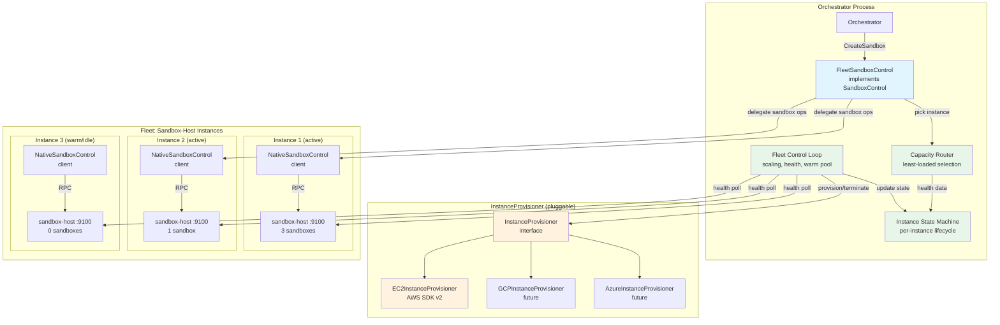
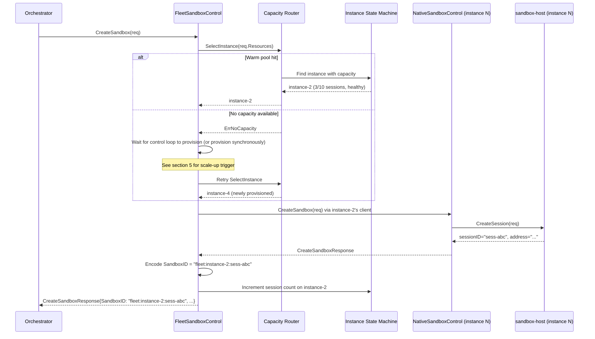
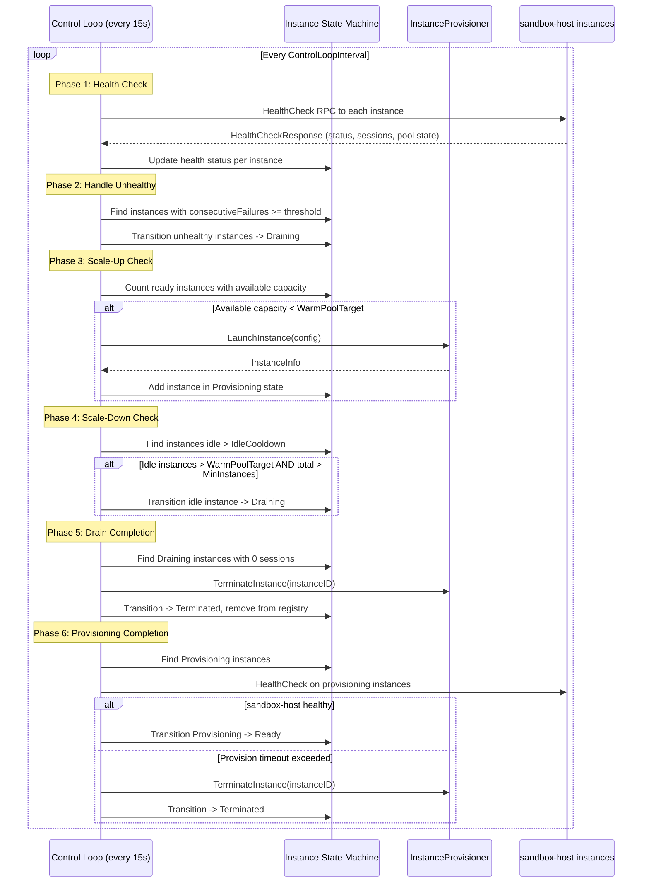
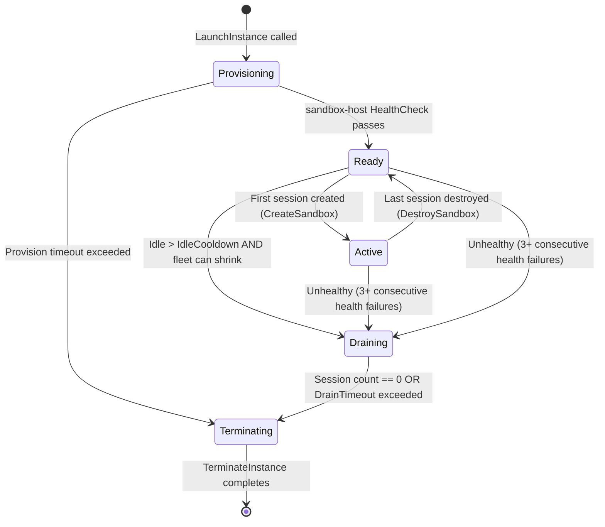

# 20: EC2 Fleet Management

**Status:** Draft
**Depends on:** 18-agent-loop-rpc (SandboxControl interface), 11-sandbox-host-service (sandbox-host HealthCheck RPC), 11-sandbox-host-service.add01 (ExecutionEnvironment interface)
**Depended on by:** Orchestrator application (future), production-scale native sandbox deployment
**Scope:** Implement `FleetSandboxControl`, an in-process fleet manager that implements `SandboxControl` by managing a pool of sandbox-host EC2 instances. Provider-agnostic via `InstanceProvisioner` interface with EC2 as the first implementation. Includes fleet control loop (scaling, health, warm pool), capacity-aware routing, and SandboxID-encoded instance routing.
**Shaping source:** docs/shaping/ec2-fleet-management.md (Shape B selected: in-process fleet management with provider-agnostic InstanceProvisioner)

---

## 1. Overview

`FleetSandboxControl` implements the `SandboxControl` interface by managing a fleet of sandbox-host instances. Each instance runs our native sandbox stack (ZFS + gVisor + sandbox-host service), and can host multiple concurrent sandboxes. The fleet manager handles:

- **Instance provisioning and termination** via a pluggable `InstanceProvisioner` interface (EC2 first, GCP and Azure future).
- **Warm pool maintenance** so `CreateSandbox` gets a ready instance without waiting for cloud boot.
- **Capacity-aware routing** to pick the least-loaded instance for new sandboxes.
- **Health monitoring** via periodic sandbox-host HealthCheck RPC calls.
- **Auto-scaling** up when capacity is exhausted and down when instances are idle.
- **Graceful drain** before instance termination to avoid killing active sandboxes.
- **SandboxID-encoded routing** so every subsequent call (DestroySandbox, LaunchProcess, etc.) routes to the correct instance without maintaining a session-to-instance map.

`FleetSandboxControl` wraps `NativeSandboxControl` -- it does not re-implement sandbox logic. For each instance in the fleet, it constructs a `NativeSandboxControl` client pointing at that instance's sandbox-host RPC address, and delegates all sandbox operations to it. The fleet layer's job is to decide WHICH instance to use and manage instance lifecycle.

### Relationship to Other SandboxControl Implementations

```
NativeSandboxControl       -- Single sandbox-host, direct RPC (existing)
FleetSandboxControl        -- Multi-instance fleet of sandbox-hosts (THIS PLAN)
EC2DirectSandboxControl    -- Raw EC2, no sandbox-host, shared OS (plan 19)
E2BSandboxControl          -- 3rd party E2B (future)
DaytonaSandboxControl      -- 3rd party Daytona (future)
FlySandboxControl          -- 3rd party Fly.io (future)
```

`FleetSandboxControl` is the production-scale version of `NativeSandboxControl`. It provides the same full capability set (instant ZFS snapshots, gVisor isolation, pause/resume, long-running processes) but across a dynamically managed fleet of instances.

---

## 2. Architecture

### 2.1 Component Diagram



### 2.2 Import Flow

```
internal/sandbox/control/fleet        -> internal/sandbox/control (SandboxControl, types)
                                      -> internal/sandbox/control/native (NativeSandboxControl)
                                      -> internal/rpc/api (SandboxService, HealthCheckResponse)
                                      -> internal/rpc/client (SandboxClient constructor)

internal/sandbox/control/fleet/ec2    -> internal/sandbox/control/fleet (InstanceProvisioner)
                                      -> aws-sdk-go-v2/service/ec2

cmd/flexagent (serve orchestrator)    -> internal/sandbox/control/fleet (FleetSandboxControl)
                                      -> internal/sandbox/control/fleet/ec2 (EC2InstanceProvisioner)
```

No circular imports. The fleet package depends on `control` for the interface it implements and `native` for per-instance delegation. The `ec2` sub-package depends only on `fleet` for the provisioner interface and the AWS SDK.

---

## 3. InstanceProvisioner Interface

`InstanceProvisioner` is the thin abstraction over cloud provider instance lifecycle. Each cloud provider implements this interface. The fleet control loop uses it for all provisioning operations and never touches cloud APIs directly.

```go
// internal/sandbox/control/fleet/provisioner.go

// InstanceProvisioner manages cloud instance lifecycle. Implementations exist
// for each cloud provider (EC2, GCP, Azure). The fleet control loop calls
// these methods; it never touches cloud APIs directly.
type InstanceProvisioner interface {
    // LaunchInstance provisions a new instance from the given config.
    // Blocks until the instance is running and reachable (but NOT until
    // sandbox-host is healthy -- that is the fleet manager's responsibility).
    // Returns the instance ID and network address.
    LaunchInstance(ctx context.Context, cfg InstanceConfig) (*InstanceInfo, error)

    // TerminateInstance permanently destroys an instance and all its resources.
    TerminateInstance(ctx context.Context, instanceID string) error

    // StopInstance stops an instance without terminating it. The instance can
    // be restarted with StartInstance. Storage is preserved.
    // Used for cost savings on warm-pool instances that have been idle too long.
    StopInstance(ctx context.Context, instanceID string) error

    // StartInstance restarts a previously stopped instance.
    StartInstance(ctx context.Context, instanceID string) (*InstanceInfo, error)

    // DescribeInstance returns current status of an instance from the cloud
    // provider's perspective (running, stopped, terminated, etc.).
    DescribeInstance(ctx context.Context, instanceID string) (*InstanceStatus, error)
}

// InstanceConfig specifies how to launch a new instance.
type InstanceConfig struct {
    // Image is the pre-baked machine image ID (AMI for EC2, etc.).
    Image string

    // InstanceType is the cloud-specific instance size (e.g., "m5.xlarge").
    InstanceType string

    // SecurityGroupIDs are the network security groups to attach.
    SecurityGroupIDs []string

    // SubnetID is the network subnet to launch into.
    SubnetID string

    // KeyName is the SSH key pair name (optional, for debugging access).
    KeyName string

    // UserData is cloud-init / startup script content (optional; should be
    // unnecessary with a properly baked image, but available for overrides).
    UserData string

    // Tags are provider-specific metadata tags applied to the instance.
    Tags map[string]string

    // IAMRole is the instance profile / service account for cloud API access.
    IAMRole string

    // DiskSizeGB is the root volume size in GB.
    DiskSizeGB int
}

// InstanceInfo is returned after launching or starting an instance.
type InstanceInfo struct {
    InstanceID string
    PrivateIP  string
    PublicIP   string // May be empty if no public IP is assigned.
    State      CloudInstanceState
}

// InstanceStatus is the cloud provider's view of an instance.
type InstanceStatus struct {
    InstanceID string
    State      CloudInstanceState
    PrivateIP  string
    PublicIP   string
}

// CloudInstanceState represents the instance state as reported by the cloud provider.
type CloudInstanceState string

const (
    CloudInstancePending     CloudInstanceState = "pending"
    CloudInstanceRunning     CloudInstanceState = "running"
    CloudInstanceStopping    CloudInstanceState = "stopping"
    CloudInstanceStopped     CloudInstanceState = "stopped"
    CloudInstanceTerminating CloudInstanceState = "terminating"
    CloudInstanceTerminated  CloudInstanceState = "terminated"
)
```

### 3.1 EC2InstanceProvisioner

The first implementation, using AWS SDK v2.

```go
// internal/sandbox/control/fleet/ec2/ec2_provisioner.go

// EC2InstanceProvisioner implements InstanceProvisioner using the AWS EC2 API.
type EC2InstanceProvisioner struct {
    client *ec2.Client
    logger *slog.Logger
}

func NewEC2InstanceProvisioner(cfg aws.Config, opts ...Option) *EC2InstanceProvisioner
```

Method mapping:

| InstanceProvisioner method | AWS API call(s) |
|----------------------------|----------------|
| `LaunchInstance` | `RunInstances` + `DescribeInstances` (wait for running) |
| `TerminateInstance` | `TerminateInstances` |
| `StopInstance` | `StopInstances` |
| `StartInstance` | `StartInstances` + `DescribeInstances` (wait for running) |
| `DescribeInstance` | `DescribeInstances` |

`LaunchInstance` uses `ec2.NewInstanceRunningWaiter` to block until the instance reaches the `running` state. It applies all `InstanceConfig` fields to the `RunInstances` input: AMI, instance type, security groups, subnet, key pair, user data, IAM instance profile, tags, and EBS volume configuration.

Tags always include `{"ManagedBy": "flex-agent-runtime", "fleet-id": "<fleet-id>"}` for operational visibility and cleanup.

### 3.2 Future Providers

`GCPInstanceProvisioner` and `AzureInstanceProvisioner` are out of scope for this plan. The `InstanceProvisioner` interface is designed to accommodate them. GCP would map to Compute Engine API (`instances.insert`, `instances.delete`, `instances.stop`, `instances.start`). Azure would map to Azure Compute (`VirtualMachines.BeginCreateOrUpdate`, `BeginDelete`, `BeginDeallocate`, `BeginStart`).

---

## 4. FleetSandboxControl

`FleetSandboxControl` implements `SandboxControl` by managing a pool of sandbox-host instances and delegating sandbox operations to per-instance `NativeSandboxControl` clients.

### 4.1 Constructor and Configuration

```go
// internal/sandbox/control/fleet/fleet.go

// FleetSandboxControl implements SandboxControl by managing a fleet of
// sandbox-host instances. It provisions instances via InstanceProvisioner,
// monitors health, maintains a warm pool, and routes sandbox operations
// to per-instance NativeSandboxControl clients.
type FleetSandboxControl struct {
    provisioner    InstanceProvisioner
    config         FleetConfig
    instances      map[string]*ManagedInstance // guarded by mu
    mu             sync.RWMutex
    logger         *slog.Logger
    cancelLoop     context.CancelFunc
    loopDone       chan struct{}
    clientFactory  SandboxClientFactory // creates SandboxService clients for an address
}

// SandboxClientFactory creates a SandboxService RPC client for a given
// sandbox-host address. This is injected for testability -- unit tests
// provide a mock factory, production code provides the real RPC client
// constructor.
type SandboxClientFactory func(addr string) (api.SandboxService, error)

// FleetConfig controls fleet behavior.
type FleetConfig struct {
    // Instance provisioning
    InstanceConfig InstanceConfig // Template for launching new instances

    // Fleet sizing
    MinInstances   int // Floor -- never scale below this (default: 1)
    MaxInstances   int // Ceiling -- never scale above this (default: 50)
    WarmPoolTarget int // Number of idle instances to keep ready (default: 2)

    // Capacity thresholds
    MaxSessionsPerInstance int     // Max sandboxes per instance (default: 10)
    CapacityHeadroom       float64 // Don't route above this fraction (default: 0.8)

    // Health checking
    HealthCheckInterval    time.Duration // How often to poll (default: 15s)
    UnhealthyThreshold     int           // Consecutive failures before marking unhealthy (default: 3)

    // Scaling
    ControlLoopInterval    time.Duration // How often the control loop runs (default: 15s)
    IdleCooldown           time.Duration // How long an instance must be idle before scale-down (default: 10m)
    ProvisionTimeout       time.Duration // Max time to wait for instance to become healthy (default: 5m)

    // Drain
    DrainTimeout           time.Duration // Max time to wait for active sandboxes during drain (default: 30m)

    // Sandbox-host port
    SandboxHostPort        int // Port sandbox-host listens on (default: 9100)
}

func DefaultFleetConfig() FleetConfig

func NewFleetSandboxControl(
    provisioner InstanceProvisioner,
    clientFactory SandboxClientFactory,
    cfg FleetConfig,
    opts ...FleetOption,
) *FleetSandboxControl
```

### 4.2 CreateSandbox

`CreateSandbox` picks the best instance, creates a sandbox on it, and returns a SandboxID that encodes the instance identity for stateless routing.



### 4.3 DestroySandbox / LaunchProcess / KillProcess / GetProcessStatus / PauseSandbox / ResumeSandbox

All subsequent operations decode the instance from the SandboxID and delegate to the appropriate per-instance `NativeSandboxControl`.

```go
func (f *FleetSandboxControl) DestroySandbox(ctx context.Context, sandboxID string) error {
    instanceID, sessionID, err := parseSandboxID(sandboxID)
    if err != nil {
        return err
    }
    client, err := f.getInstanceClient(instanceID)
    if err != nil {
        return err
    }
    err = client.DestroySandbox(ctx, sessionID)
    if err != nil {
        return err
    }
    f.decrementSessionCount(instanceID)
    return nil
}
```

The same pattern applies to all other `SandboxControl` methods. The fleet layer is a thin router that:
1. Parses the SandboxID to extract instance identity and session identity.
2. Looks up the `NativeSandboxControl` client for that instance.
3. Delegates the call with the session-local ID.
4. Updates bookkeeping (session counts) on create/destroy.

### 4.4 Capabilities

`FleetSandboxControl` reports the same capabilities as the native sandbox, since it delegates all sandbox operations to `NativeSandboxControl`:

```go
func (f *FleetSandboxControl) Capabilities() control.SandboxCapabilities {
    return control.SandboxCapabilities{
        Snapshots:     true,
        Rollback:      true,
        Pause:         true,
        LaunchProcess: true,
    }
}
```

---

## 5. Fleet Control Loop

A background goroutine that runs on a configurable interval (default 15s). It performs health checking, scaling decisions, and warm pool maintenance in each iteration.

### 5.1 Control Loop Sequence



### 5.2 Health Polling

Each iteration calls `HealthCheck` on every instance in state Ready or Active. The response from sandbox-host includes:

| Field | Type | Used For |
|-------|------|----------|
| `Status` | string ("healthy", "degraded", "unhealthy") | Instance health classification |
| `PoolState` | string | ZFS pool health (detect degraded arrays) |
| `SessionCount` | int | Live session count for capacity routing |
| `ActiveTools` | int | Current tool execution load |
| `Uptime` | duration | Detect recent restarts |
| `Errors` | []string | Recent error context for debugging |

Health check failure (RPC error, timeout, or `Status == "unhealthy"`) increments a per-instance `consecutiveFailures` counter. When this counter reaches `UnhealthyThreshold` (default 3), the instance transitions to `Draining` and a replacement is provisioned.

### 5.3 Scale-Up Trigger

Scale-up occurs when the number of instances with available capacity (session count below `MaxSessionsPerInstance * CapacityHeadroom`) falls below `WarmPoolTarget`. The control loop provisions new instances up to `MaxInstances`.

Additionally, `CreateSandbox` can trigger synchronous scale-up if no instance has capacity and the control loop has not yet provisioned enough. In this case, `CreateSandbox` starts a provision and blocks (with `ProvisionTimeout`) until the new instance is ready.

### 5.4 Scale-Down Trigger

An instance is eligible for scale-down when:
1. It has zero active sessions.
2. It has been idle for longer than `IdleCooldown` (default 10 minutes).
3. Removing it would NOT bring the fleet below `MinInstances`.
4. Removing it would NOT bring the idle instance count below `WarmPoolTarget`.

Scale-down transitions the instance to `Draining` (which prevents new session assignment). Since it already has zero sessions, it immediately becomes eligible for termination in the next drain completion phase.

### 5.5 Graceful Drain

When an instance enters the `Draining` state (from scale-down, unhealthy detection, or explicit drain request):
1. It is removed from the routing pool -- no new sandboxes are assigned to it.
2. Existing sandboxes continue to operate normally.
3. The control loop monitors the session count each iteration.
4. When session count reaches 0, the instance is terminated.
5. If `DrainTimeout` is exceeded with sessions still active, the instance is force-terminated and a warning is logged. The orchestrator handles session loss via crash recovery (ResumeSession).

---

## 6. Capacity-Aware Routing

### 6.1 Instance Selection Algorithm

When `CreateSandbox` needs an instance, the capacity router scores each candidate:

```go
// internal/sandbox/control/fleet/routing.go

// SelectInstance picks the best instance for a new sandbox.
// Returns ErrNoCapacity if no instance can accept the sandbox.
func (r *CapacityRouter) SelectInstance(instances []*ManagedInstance) (*ManagedInstance, error) {
    var best *ManagedInstance
    bestScore := -1.0

    for _, inst := range instances {
        if inst.State != InstanceReady && inst.State != InstanceActive {
            continue // skip provisioning, draining, terminated
        }
        if inst.SessionCount >= inst.MaxSessions {
            continue // full
        }
        headroom := 1.0 - (float64(inst.SessionCount) / float64(inst.MaxSessions))
        if headroom < (1.0 - r.config.CapacityHeadroom) {
            continue // above headroom threshold
        }
        // Prefer the instance with the MOST available capacity (spread strategy).
        // This distributes load evenly and maximizes headroom for burst.
        score := headroom
        if score > bestScore {
            bestScore = score
            best = inst
        }
    }

    if best == nil {
        return nil, ErrNoCapacity
    }
    return best, nil
}
```

The default strategy is **spread** (prefer most available capacity) rather than best-fit packing. This maximizes per-instance headroom so that burst traffic is absorbed without immediate scale-up. The strategy can be made configurable in the future.

### 6.2 Capacity Data Sources

Capacity data comes from two sources:

1. **Fleet-tracked session count** -- incremented on `CreateSandbox`, decremented on `DestroySandbox`. This is the primary routing signal because it is immediately consistent (no polling delay).

2. **HealthCheck response** -- provides ground-truth session count, CPU, memory, and ZFS pool space. Used for periodic reconciliation. If the fleet-tracked count drifts from the HealthCheck-reported count (e.g., due to a crash where `DestroySandbox` was never called), the control loop corrects it.

---

## 7. SandboxID Encoding

The SandboxID returned by `FleetSandboxControl.CreateSandbox` encodes the instance identity so that all subsequent calls route to the correct instance without maintaining a persistent session-to-instance mapping.

### 7.1 Format

```
fleet:<instanceID>:<sessionID>
```

Example:
```
fleet:i-0abc123def456:sess-7890xyz
```

- `fleet:` prefix distinguishes fleet-managed sandbox IDs from single-instance IDs.
- `<instanceID>` is the cloud provider's instance identifier.
- `<sessionID>` is the session ID returned by the sandbox-host's `CreateSession`.

### 7.2 Parsing

```go
// internal/sandbox/control/fleet/fleet.go

const sandboxIDPrefix = "fleet:"

func encodeSandboxID(instanceID, sessionID string) string {
    return sandboxIDPrefix + instanceID + ":" + sessionID
}

func parseSandboxID(sandboxID string) (instanceID, sessionID string, err error) {
    if !strings.HasPrefix(sandboxID, sandboxIDPrefix) {
        return "", "", fmt.Errorf("invalid fleet sandbox ID: missing prefix: %q", sandboxID)
    }
    rest := sandboxID[len(sandboxIDPrefix):]
    idx := strings.Index(rest, ":")
    if idx < 0 {
        return "", "", fmt.Errorf("invalid fleet sandbox ID: missing session separator: %q", sandboxID)
    }
    return rest[:idx], rest[idx+1:], nil
}
```

### 7.3 Design Rationale

Encoding the instance in the SandboxID makes the fleet manager stateless for subsequent calls. If the fleet manager process restarts, it does not need to rebuild a session-to-instance mapping from persistent storage. It just needs the instance registry (rebuilt from cloud provider describe calls) and the SandboxID tells it where each session lives.

This does "leak" the instance ID into the SandboxID, but since SandboxIDs are internal identifiers passed between orchestrator and SandboxControl, not exposed to end users, this is acceptable.

---

## 8. Instance Lifecycle State Machine

Each instance in the fleet has a state tracked by `ManagedInstance`:

```go
// internal/sandbox/control/fleet/instance_state.go

type InstanceState string

const (
    InstanceProvisioning InstanceState = "provisioning" // Cloud instance launched, waiting for sandbox-host healthy
    InstanceReady        InstanceState = "ready"         // sandbox-host healthy, 0 sessions, available for routing
    InstanceActive       InstanceState = "active"        // sandbox-host healthy, >= 1 session
    InstanceDraining     InstanceState = "draining"      // No new sessions, waiting for existing to finish
    InstanceTerminating  InstanceState = "terminating"   // TerminateInstance called, waiting for cloud confirmation
)

type ManagedInstance struct {
    mu                  sync.RWMutex
    InstanceID          string
    PrivateIP           string
    State               InstanceState
    SessionCount        int
    MaxSessions         int
    Client              control.SandboxControl // NativeSandboxControl for this instance
    LastHealthCheck      time.Time
    LastHealthStatus     string // "healthy", "degraded", "unhealthy"
    ConsecutiveFailures  int
    IdleSince           time.Time // When session count last reached 0
    ProvisionedAt       time.Time
}
```

### 8.1 State Transitions



Transitions and their triggers:

| From | To | Trigger |
|------|-----|---------|
| -- | Provisioning | Control loop calls `LaunchInstance` |
| Provisioning | Ready | Control loop detects healthy HealthCheck response |
| Provisioning | Terminating | `ProvisionTimeout` exceeded without healthy HealthCheck |
| Ready | Active | `CreateSandbox` assigns first session to this instance |
| Active | Ready | `DestroySandbox` removes last session from this instance |
| Ready | Draining | Control loop scale-down (idle too long) |
| Active | Draining | Control loop detects unhealthy instance |
| Ready | Draining | Control loop detects unhealthy instance |
| Draining | Terminating | Session count reaches 0, or `DrainTimeout` exceeded |
| Terminating | (removed) | `TerminateInstance` completes, instance removed from registry |

---

## 9. Package Structure

```
internal/
  sandbox/
    control/
      control.go                    # SandboxControl interface (existing)
      native/
        native.go                   # NativeSandboxControl (existing)
      fleet/
        fleet.go                    # FleetSandboxControl: SandboxControl implementation
        fleet_test.go               # Unit tests with mock InstanceProvisioner
        provisioner.go              # InstanceProvisioner interface + types
        control_loop.go             # Fleet control loop: scaling, health, warm pool
        control_loop_test.go        # Control loop unit tests
        routing.go                  # Capacity-aware instance selection
        routing_test.go             # Routing unit tests
        instance_state.go           # ManagedInstance, InstanceState, state transitions
        instance_state_test.go      # State machine unit tests
        sandbox_id.go               # SandboxID encoding/parsing
        sandbox_id_test.go          # SandboxID round-trip tests
        config.go                   # FleetConfig, DefaultFleetConfig
        ec2/
          ec2_provisioner.go        # EC2InstanceProvisioner (AWS SDK v2)
          ec2_provisioner_test.go   # Unit tests with mocked EC2 client
```

---

## 10. Testing Strategy

### 10.1 Unit Tests

All unit tests use a mock `InstanceProvisioner` and mock `SandboxClientFactory`. No cloud API calls or real instances.

**FleetSandboxControl (fleet_test.go):**
- CreateSandbox routes to least-loaded instance and returns fleet-prefixed SandboxID
- CreateSandbox with no available capacity triggers synchronous provision
- CreateSandbox at MaxInstances with all instances full returns error
- DestroySandbox parses SandboxID, delegates to correct instance, decrements count
- DestroySandbox with invalid SandboxID format returns error
- LaunchProcess / KillProcess / GetProcessStatus route correctly via SandboxID
- PauseSandbox / ResumeSandbox route correctly via SandboxID
- Capabilities returns native sandbox capabilities
- Concurrent CreateSandbox calls are serialized correctly (no double-assignment)
- Close stops control loop, drains all instances

**Control Loop (control_loop_test.go):**
- Health check failure increments consecutive failure counter
- 3 consecutive failures transitions instance to Draining
- Healthy response resets consecutive failure counter
- Scale-up triggered when available capacity < WarmPoolTarget
- Scale-up respects MaxInstances ceiling
- Scale-down triggered when instance idle > IdleCooldown
- Scale-down respects MinInstances floor
- Scale-down does not remove instances when idle count <= WarmPoolTarget
- Drain completion terminates instance when session count reaches 0
- Drain timeout force-terminates instance
- Provisioning timeout terminates stuck instances
- Provisioning -> Ready transition on first healthy HealthCheck
- Warm pool reconciliation provisions to fill gap

**Routing (routing_test.go):**
- SelectInstance returns instance with most headroom (spread strategy)
- SelectInstance skips instances in Draining/Terminating/Provisioning state
- SelectInstance skips instances above CapacityHeadroom threshold
- SelectInstance returns ErrNoCapacity when all instances full
- SelectInstance with single available instance returns it

**Instance State Machine (instance_state_test.go):**
- All valid state transitions succeed
- Invalid state transitions return error
- Ready -> Active on session count increment from 0
- Active -> Ready on session count decrement to 0

**SandboxID (sandbox_id_test.go):**
- encodeSandboxID produces correct format
- parseSandboxID round-trips correctly
- parseSandboxID with missing prefix returns error
- parseSandboxID with missing session separator returns error
- parseSandboxID with empty components returns error

**EC2InstanceProvisioner (ec2/ec2_provisioner_test.go):**
- LaunchInstance calls RunInstances with correct parameters (mock EC2 API)
- LaunchInstance applies tags including ManagedBy
- TerminateInstance calls TerminateInstances
- StopInstance calls StopInstances
- StartInstance calls StartInstances and waits for running
- DescribeInstance returns mapped status

### 10.2 Integration Tests (Build-Tag Gated)

Integration tests that interact with real AWS resources are gated behind `//go:build integration`. They are not run in CI by default. They require AWS credentials and will provision real EC2 instances.

```go
//go:build integration

// TestFleetSandboxControl_RealEC2 provisions a single EC2 instance,
// creates a sandbox, executes a tool, and destroys everything.
func TestFleetSandboxControl_RealEC2(t *testing.T) { ... }
```

Tests to include:
- Provision a single instance, wait for healthy, create sandbox, destroy sandbox, terminate instance
- Warm pool: provision 2 instances, verify both reach Ready
- Scale-down: create sandbox, destroy it, wait for idle cooldown, verify instance terminated
- Health failure: stop sandbox-host on an instance, verify fleet detects and drains

### 10.3 Test Doubles

```go
// internal/sandbox/control/fleet/fleet_test.go

// MockInstanceProvisioner records calls and returns configured responses.
type MockInstanceProvisioner struct {
    mu              sync.Mutex
    LaunchCalls     []InstanceConfig
    TerminateCalls  []string
    StopCalls       []string
    StartCalls      []string
    DescribeCalls   []string

    LaunchResult    *InstanceInfo
    LaunchError     error
    // ... configurable per-call responses
}
```

The `SandboxClientFactory` in tests returns a mock `SandboxService` that records all calls and returns configured responses. This allows testing the full fleet flow (routing -> delegation -> bookkeeping) without any RPC or cloud infrastructure.

---

## 11. Connected Components / Seams

### 11.1 Consumed Seams

| Seam | How Used |
|------|----------|
| `internal/sandbox/control/control.go` | `SandboxControl` interface that `FleetSandboxControl` implements; `CreateSandboxRequest/Response`, `LaunchProcessRequest/Response`, etc. |
| `internal/sandbox/control/native/native.go` | `NativeSandboxControl` created per instance to delegate sandbox operations |
| `internal/rpc/api/types.go` | `SandboxService` interface (for constructing per-instance RPC clients); `HealthCheckRequest/Response` for health polling |
| `internal/rpc/client/` | `SandboxClient` constructor for creating RPC connections to sandbox-host instances |
| AWS SDK v2 `ec2` package | Used by `EC2InstanceProvisioner` for instance lifecycle |

### 11.2 Produced Seams

| Seam | Description |
|------|-------------|
| `internal/sandbox/control/fleet/provisioner.go` | `InstanceProvisioner` interface -- consumed by future GCP/Azure implementations |
| `internal/sandbox/control/fleet/fleet.go` | `FleetSandboxControl` -- consumed by orchestrator as a `SandboxControl` implementation |
| `internal/sandbox/control/fleet/ec2/ec2_provisioner.go` | `EC2InstanceProvisioner` -- first `InstanceProvisioner` implementation |

### 11.3 Modified Seams

No existing code is modified by this plan. `FleetSandboxControl` is a new `SandboxControl` implementation alongside `NativeSandboxControl` and `EC2DirectSandboxControl`. The orchestrator selects which implementation to use via configuration.

### 11.4 Import Flow

```
cmd/flexagent (orchestrator)
  -> internal/sandbox/control/fleet      (FleetSandboxControl)
  -> internal/sandbox/control/fleet/ec2  (EC2InstanceProvisioner)

internal/sandbox/control/fleet
  -> internal/sandbox/control            (SandboxControl interface, types)
  -> internal/sandbox/control/native     (NativeSandboxControl)
  -> internal/rpc/api                    (SandboxService, HealthCheck types)
  -> internal/rpc/client                 (NewSandboxClient)

internal/sandbox/control/fleet/ec2
  -> internal/sandbox/control/fleet      (InstanceProvisioner, InstanceConfig, InstanceInfo)
  -> github.com/aws/aws-sdk-go-v2/service/ec2
```

Key invariant: `internal/sandbox/control/fleet` does NOT import `internal/sandbox/control/fleet/ec2`. The concrete provisioner is injected by the caller (orchestrator). This keeps the fleet package provider-agnostic.

---

## 12. Implementation Order

1. **InstanceProvisioner interface + types** (`fleet/provisioner.go`, `fleet/config.go`)
   - Define `InstanceProvisioner`, `InstanceConfig`, `InstanceInfo`, `InstanceStatus`, `CloudInstanceState`
   - Define `FleetConfig`, `DefaultFleetConfig()`

2. **SandboxID encoding/parsing** (`fleet/sandbox_id.go`) + unit tests
   - `encodeSandboxID`, `parseSandboxID`
   - Round-trip and error-case tests

3. **Instance state machine** (`fleet/instance_state.go`) + unit tests
   - `ManagedInstance`, `InstanceState`, state transition validation
   - Tests for all valid/invalid transitions

4. **Capacity-aware routing** (`fleet/routing.go`) + unit tests
   - `SelectInstance` with spread strategy
   - Tests for all selection and skip scenarios

5. **FleetSandboxControl core** (`fleet/fleet.go`) + unit tests
   - Constructor, `CreateSandbox`, `DestroySandbox`, delegation methods
   - Uses mock `InstanceProvisioner` and mock `SandboxClientFactory`
   - Tests for routing, delegation, SandboxID encoding, session count tracking

6. **Fleet control loop** (`fleet/control_loop.go`) + unit tests
   - Health polling, scale-up, scale-down, drain, warm pool maintenance
   - Provisioning completion detection
   - Tests with deterministic time control (injectable clock)

7. **EC2InstanceProvisioner** (`fleet/ec2/ec2_provisioner.go`) + unit tests
   - AWS SDK v2 integration with mocked EC2 client
   - All CRUD operations + tag management

8. **Integration tests** (build-tag gated)
   - Real EC2 provisioning, health check, sandbox lifecycle
   - Gated behind `//go:build integration`

9. **Orchestrator wiring**
   - Add `FleetSandboxControl` as a `SandboxControl` provider option in `flexagent serve orchestrator`
   - Configuration: fleet config from flags / config file / environment

---

## 13. Open Questions

### OQ1: Warm Pool Sizing

The warm pool target is a static config value initially (default 2). A feedback loop that adjusts the target based on cold-provision hit rate would be valuable but is deferred to a follow-up. Start static, instrument the cold-provision rate, and add adaptive sizing when we have data.

### OQ2: State Persistence for Crash Recovery

If the fleet manager process crashes, the in-memory instance registry is lost. On restart, it must rebuild state. Options:
- **(a) Cloud provider describe** -- call `DescribeInstances` with the `ManagedBy=flex-agent-runtime` tag filter to find all fleet instances, then `HealthCheck` each to determine current state. This is the simplest approach and requires no external state store.
- **(b) File-based persistence** -- write instance registry to a local JSON file on each change. Faster restart but lost if the host is terminated.
- **(c) DynamoDB** -- durable across host failures but adds an external dependency.

Recommendation: start with (a) for simplicity. The `ManagedBy` and `fleet-id` tags on each instance provide enough information to reconstruct the registry. HealthCheck tells us session count and health. This approach has a brief gap (seconds) during restart where the fleet manager cannot route, but the orchestrator retries handle this.

### OQ3: Instance Type Selection

Start with a single configurable instance type in `FleetConfig.InstanceConfig`. Heterogeneous instance types (different sizes for different sandbox workloads) are deferred. The `InstanceConfig` struct supports this future extension but the routing logic does not account for variable capacity per instance type initially.

### OQ4: AMI Build Pipeline

The AMI (or equivalent machine image for other providers) must contain Ubuntu LTS + ZFS + gVisor + flexagent binary + systemd unit + base ZFS pool with initial snapshot. This plan assumes the AMI already exists and is specified in `FleetConfig.InstanceConfig.Image`. Building the AMI pipeline (Packer template, CI/CD integration, rotation) is a separate task.

### OQ5: Spot Instance Support

EC2 Spot instances can save 60-70% but add complexity (2-minute interruption notices). The `InstanceProvisioner` interface supports this -- `LaunchInstance` could accept a spot parameter, and the fleet control loop would handle interruption notices by transitioning interrupted instances to Draining. Deferred to a follow-up.
