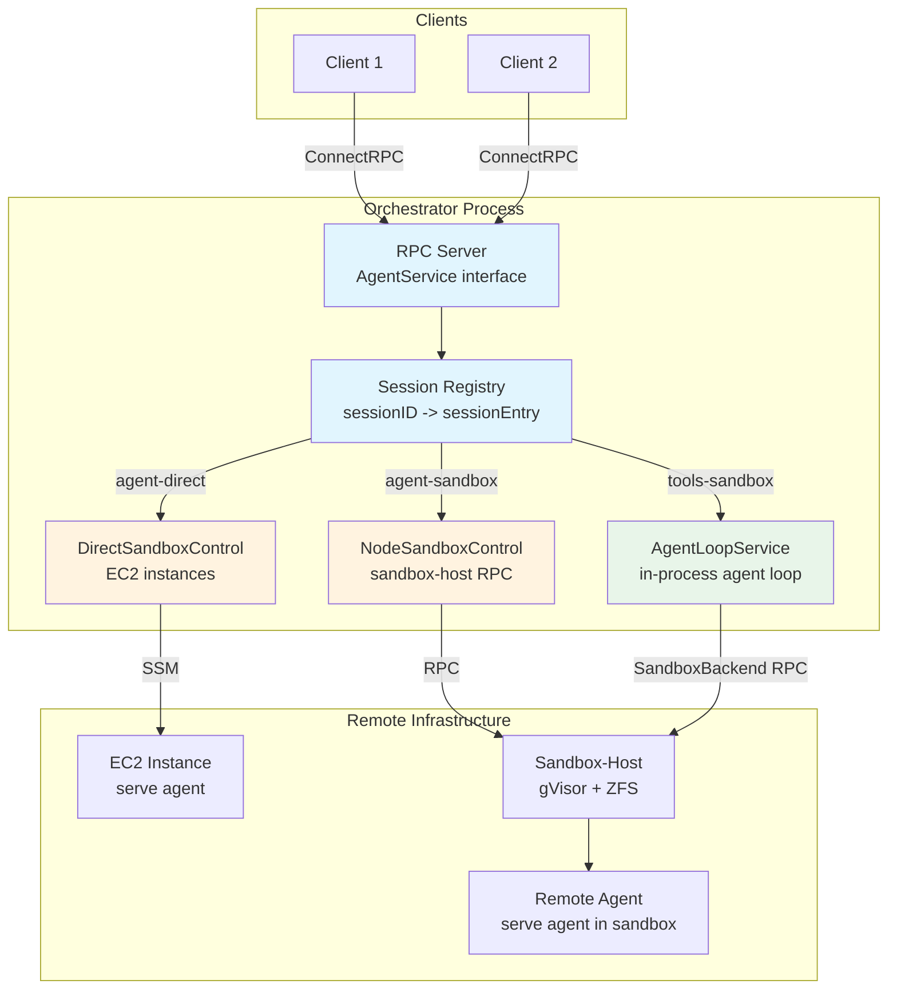
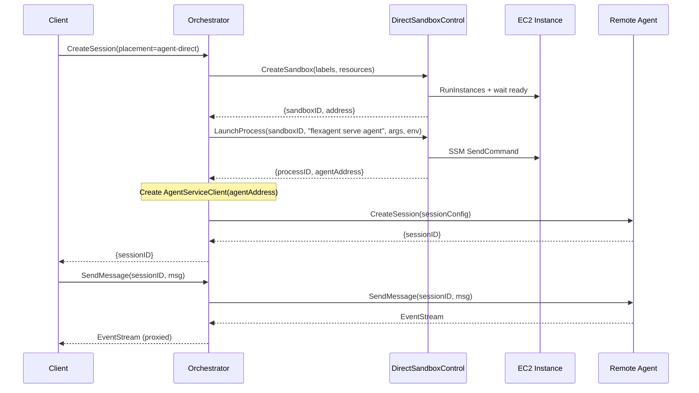
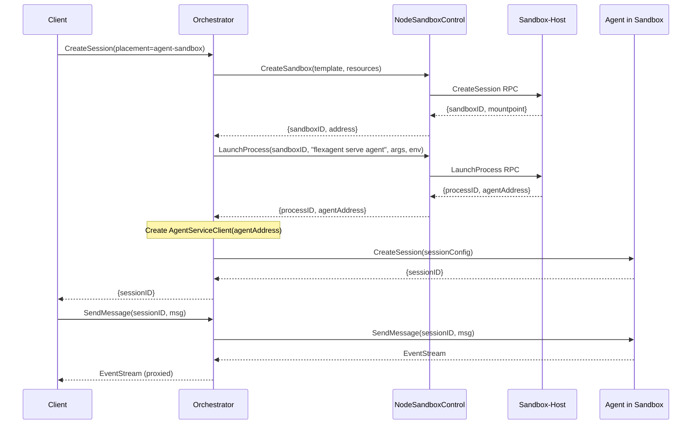
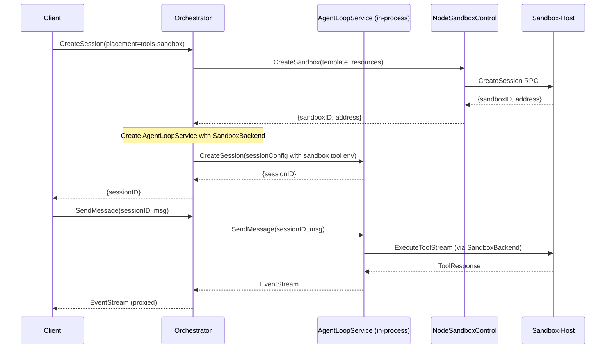

# 21: Serve Orchestrator Command

**Status:** Draft
**Depends on:** 18-agent-loop-rpc (AgentService, AgentServiceClient, SandboxControl interface), 19-ec2-direct-adapter (DirectSandboxControl), 20-fleet-management (FleetSandboxControl / NodeSandboxControl), 11-sandbox-host-service (sandbox-host RPC)
**Depended on by:** Production multi-tenant deployment, client applications
**Scope:** Wire existing building blocks into `flexagent serve orchestrator` -- a process that accepts client RPC requests, manages sandbox lifecycle per session, and proxies or runs agent loops depending on the per-session placement mode.

---

## 1. Context

All building blocks exist:

- **AgentService / AgentLoopService** (`internal/agent/api`, `internal/agent`) -- the in-process agent loop implementation that satisfies the `AgentService` interface.
- **AgentServiceClient** (`internal/rpc/client/agent_client.go`) -- RPC client that satisfies the same `AgentService` interface over ConnectRPC, for talking to a remote `flexagent serve agent` process.
- **SandboxControl** (`internal/sandbox/control/control.go`) -- orchestrator-level sandbox lifecycle interface (CreateSandbox, DestroySandbox, LaunchProcess, PauseSandbox, etc.).
- **DirectSandboxControl** (`internal/sandbox/control/direct/`) -- SandboxControl over raw EC2 instances via SSM.
- **NodeSandboxControl** (`internal/sandbox/control/node/`) -- SandboxControl wrapping a sandbox-host RPC client (gVisor + ZFS sandboxes).
- **SandboxClient** (`internal/rpc/client/sandbox_client.go`) -- tool dispatch via RPC for tools-sandbox mode.
- **serve agent** (`cmd/flexagent/serve_agent.go`) -- standalone agent loop HTTP server.
- **serve sandbox-host** (`cmd/flexagent/serve_sandbox_host.go`) -- standalone sandbox-host HTTP server.
- **serve all** (`cmd/flexagent/serve_all.go`) -- combined agent + sandbox-host in one process.
- **RPC transport layer** (`internal/rpc/transport/`) -- ConnectRPC server/client wiring.

This plan covers wiring them into the `serve orchestrator` command, which is currently a placeholder that exits with "not yet implemented" (`cmd/flexagent/serve_orchestrator.go`).

---

## 2. Design

### 2.1 What the Orchestrator Is

The orchestrator is the control plane process in a distributed deployment. It sits between external clients and the agent execution infrastructure. Clients talk to the orchestrator; the orchestrator decides where and how to run agent sessions based on the requested placement mode.

The orchestrator does NOT own sandbox-host infrastructure directly. It connects to sandbox-hosts (or provisions EC2 instances) through the existing SandboxControl implementations.



### 2.2 Orchestrator Responsibilities

1. **Connect to sandbox-host(s) at startup**, detect capabilities via `SandboxControl.Capabilities()`.
2. **Expose RPC API** that implements `AgentService` interface to clients.
3. **On CreateSession**: accept placement mode from client, create sandbox via appropriate SandboxControl, launch agent process (for agent-direct and agent-sandbox modes) or run agent loop in-process (tools-sandbox mode), proxy all subsequent requests.
4. **Session identity ownership**: orchestrator owns client-visible session IDs and translates to backend IDs for every proxied call.
5. **Session lifecycle**: pause/resume/destroy propagate to both agent and sandbox layers.
6. **Health monitoring** of sandbox-host connections and remote agent processes.

### 2.3 Fleet Scope Decision

`FleetSandboxControl` is already implemented and is in scope for this plan.

- If one `--sandbox-host-addr` is configured, orchestrator uses `NodeSandboxControl`.
- If multiple `--sandbox-host-addr` values are configured, orchestrator uses `FleetSandboxControl`.

Reason: tools-sandbox must persist host identity per session for correct routing and health accounting, and Fleet already provides this abstraction.

### 2.4 Three Placement Modes

Placement mode is per-session, not per-orchestrator. A single orchestrator can serve all three modes concurrently, provided it has the required backends configured.

#### agent-direct

The agent runs on a raw EC2 instance without sandbox isolation. Simplest mode, no gVisor needed.

- Uses `DirectSandboxControl`
- `CreateSandbox()` provisions an EC2 instance
- `LaunchProcess()` starts `flexagent serve agent` on the instance via SSM
- All subsequent `AgentService` calls proxied to the remote agent via `AgentServiceClient`
- Tools run locally on the EC2 instance (agent uses LocalBackend)



#### agent-sandbox

The agent runs inside a gVisor sandbox on a sandbox-host. Full isolation with ZFS snapshots.

- Uses `NodeSandboxControl` (or `FleetSandboxControl` wrapping multiple `NodeSandboxControl` instances)
- `CreateSandbox()` provisions a gVisor sandbox on the sandbox-host
- `LaunchProcess()` starts `flexagent serve agent` inside the sandbox
- All subsequent `AgentService` calls proxied to the remote agent via `AgentServiceClient`
- Tools run locally inside the sandbox (agent uses LocalBackend)
- Supports snapshots, rollback, pause/resume



#### tools-sandbox

The agent loop runs in-process inside the orchestrator. Only tool execution is dispatched to sandbox-hosts via RPC. No agent process launch needed.

- Agent loop runs as an `AgentLoopService` instance inside the orchestrator
- Tools configured with `ToolEnvSandbox` / `SandboxBackend`, dispatching to sandbox-host(s)
- `CreateSandbox()` creates a tool-execution sandbox session on the sandbox-host (for filesystem state)
- No `LaunchProcess()` call -- the agent is local
- Requires LLM API keys in the orchestrator's environment



---

## 3. Detailed Design

### 3.1 Package Structure

```
internal/orchestrator/
    orchestrator.go       -- Orchestrator struct, constructor, Close/Shutdown
    session.go            -- Session registry, sessionEntry, placement routing
    proxy.go              -- AgentService proxy implementation (implements AgentService)
    config.go             -- OrchestratorConfig, validation
    health.go             -- Health monitor goroutine for sandbox-hosts and remote agents

cmd/flexagent/
    serve_orchestrator.go -- CLI flag parsing, config construction, Orchestrator wiring
```

### 3.2 Configuration

CLI flags for `flexagent serve orchestrator`:

| Flag | Env Var | Default | Description |
|------|---------|---------|-------------|
| `--listen` | `FLEXAGENT_LISTEN` | `:8080` | Orchestrator listen address |
| `--sandbox-host-addr` | `ORCHESTRATOR_SANDBOX_HOST_ADDR` | (none) | Comma-separated sandbox-host RPC addresses for agent-sandbox and tools-sandbox modes |
| `--direct-ami-id` | `ORCHESTRATOR_DIRECT_AMI_ID` | (none) | AMI ID for agent-direct mode EC2 instances |
| `--direct-subnet-id` | `ORCHESTRATOR_DIRECT_SUBNET_ID` | (none) | VPC subnet for agent-direct instances |
| `--direct-security-group-ids` | `ORCHESTRATOR_DIRECT_SG_IDS` | (none) | Comma-separated security group IDs |
| `--direct-instance-profile-arn` | `ORCHESTRATOR_DIRECT_INSTANCE_PROFILE` | (none) | IAM instance profile ARN |
| `--direct-instance-type` | `ORCHESTRATOR_DIRECT_INSTANCE_TYPE` | `t3.medium` | Default EC2 instance type |
| `--max-sessions` | `ORCHESTRATOR_MAX_SESSIONS` | `0` | Max concurrent sessions (0 = unlimited) |
| `--agent-max-sessions` | `ORCHESTRATOR_AGENT_MAX_SESSIONS` | `0` | Max concurrent in-process agent sessions for tools-sandbox mode |
| `--shutdown-timeout` | `FLEXAGENT_SHUTDOWN_TIMEOUT` | `30s` | Graceful shutdown drain period |
| `--health-check-interval` | `ORCHESTRATOR_HEALTH_INTERVAL` | `15s` | Interval for health checks on remote agents and sandbox-hosts |
| `--create-session-timeout` | `ORCHESTRATOR_CREATE_TIMEOUT` | `3m` | Max time for provisioning + launch + backend CreateSession |
| `--auth-token` | `FLEXAGENT_AUTH_TOKEN` | (none) | Bearer auth token for client connections |
| `--rpc-max-message-bytes` | `FLEXAGENT_RPC_MAX_MESSAGE_BYTES` | `16MB` | Max RPC message size |
| `--api-version` | `FLEXAGENT_API_VERSION` | `v1` | Advertised API version |
| `--min-api-version` | `FLEXAGENT_MIN_API_VERSION` | `v1` | Minimum supported API version |

Mode availability is determined by which backends are configured:
- **agent-direct** available when `--direct-ami-id` is set (EC2 config present)
- **agent-sandbox** available when `--sandbox-host-addr` is set
- **tools-sandbox** available when `--sandbox-host-addr` is set

### 3.3 Orchestrator Struct

```go
// Orchestrator manages agent sessions across placement modes.
type Orchestrator struct {
    mu       sync.Mutex
    sessions map[string]*sessionEntry // clientSessionID -> entry
    closing  bool

    // Placement backends (nil if not configured)
    directControl  control.SandboxControl  // DirectSandboxControl for agent-direct
    nodeControl    control.SandboxControl  // Node/Fleet control for agent-sandbox + tools-sandbox

    // In-process agent loop for tools-sandbox mode
    agentLoopService *agent.AgentLoopService

    // Config
    config           OrchestratorConfig
    logger           *slog.Logger
    healthInterval   time.Duration
    createTimeout    time.Duration
    shutdownTimeout  time.Duration

    // Health monitor
    healthCancel context.CancelFunc
    healthWg     sync.WaitGroup

    wg sync.WaitGroup // tracks in-flight operations
}
```

### 3.4 Session Entry

```go
type PlacementMode string

const (
    PlacementAgentDirect  PlacementMode = "agent-direct"
    PlacementAgentSandbox PlacementMode = "agent-sandbox"
    PlacementToolsSandbox PlacementMode = "tools-sandbox"
)

// sessionEntry tracks everything the orchestrator knows about an active session.
type sessionEntry struct {
    mu sync.Mutex

    sessionID     string
    remoteSessionID string        // backend agent session ID; may differ
    placement     PlacementMode
    sandboxID     string           // from SandboxControl.CreateSandbox
    processID     string           // from SandboxControl.LaunchProcess (empty for tools-sandbox)
    sandboxControl control.SandboxControl // which SandboxControl manages this session's sandbox
    sandboxHostAddr string         // host:port used for tools-sandbox dispatch and host health checks
    sandboxHostID   string         // stable host key (fleet instance ID or single-node key)

    // The AgentService for this session -- either an AgentServiceClient (remote)
    // or the local AgentLoopService (tools-sandbox)
    agentService  agentapi.AgentService

    // Lifecycle state
    state         sessionState
    createdAt     time.Time
    lastHealthy   time.Time
    healthErr     error
}

type sessionState string

const (
    sessionCreating  sessionState = "creating"
    sessionActive    sessionState = "active"
    sessionPaused    sessionState = "paused"
    sessionUnhealthy sessionState = "unhealthy"
    sessionDestroyed sessionState = "destroyed"
)
```

### 3.5 CreateSession Flow

The orchestrator implements `AgentService.CreateSession`. Placement mode is read from `req.SessionConfig.Metadata["placement_mode"]` (to avoid changing API types in this initial implementation).

Client-visible session IDs are generated and owned by the orchestrator. Backend session IDs are tracked as `entry.remoteSessionID`.

```go
func (o *Orchestrator) CreateSession(ctx context.Context, req *agentapi.CreateAgentSessionRequest) (*agentapi.CreateAgentSessionResponse, error) {
    placement := placementFromMetadata(req.SessionConfig.Metadata)
    clientSessionID := generateSessionID()
    createCtx, cancel := context.WithTimeout(context.Background(), o.createTimeout)
    defer cancel()

    // 1. Validate placement is supported
    if err := o.validatePlacement(placement); err != nil {
        return nil, err
    }

    // 2. Create session entry
    entry := &sessionEntry{
        sessionID: clientSessionID,
        placement: placement,
        state:     sessionCreating,
        createdAt: time.Now(),
    }

    // Backend gets orchestrator-owned ID when explicit IDs are supported.
    createReq := *req
    createReq.SessionConfig = req.SessionConfig
    createReq.SessionConfig.SessionID = clientSessionID

    // 3. Route to placement-specific creation
    switch placement {
    case PlacementAgentDirect:
        return o.createAgentDirectSession(createCtx, entry, &createReq)
    case PlacementAgentSandbox:
        return o.createAgentSandboxSession(createCtx, entry, &createReq)
    case PlacementToolsSandbox:
        return o.createToolsSandboxSession(createCtx, entry, &createReq)
    }
}
```

#### createAgentDirectSession / createAgentSandboxSession (shared logic)

Both agent-direct and agent-sandbox follow the same pattern -- they differ only in which `SandboxControl` implementation is used:

```
1. sc := o.directControl (or o.nodeControl)
2. sandbox := sc.CreateSandbox(ctx, sandboxReq)
3. process := sc.LaunchProcess(ctx, LaunchProcessRequest{
       SandboxID:  sandbox.SandboxID,
       Binary:     "flexagent",
       Args:       ["serve", "agent", "--listen", ":8081"],
       Env:        {LLM API keys, auth token},
       ExposePort: 8081,
   })
4. agentClient := client.NewAgentServiceClient(httpClient, process.Address, clientCfg)
5. resp := agentClient.CreateSession(ctx, req) // req.SessionConfig.SessionID is clientSessionID
6. entry.sandboxID = sandbox.SandboxID
   entry.processID = process.ProcessID
   entry.remoteSessionID = resp.SessionID
   entry.agentService = agentClient
   entry.sandboxControl = sc
   entry.state = sessionActive
7. o.registerSession(entry)
8. return resp
```

On failure at any step, previously created resources are cleaned up (destroy sandbox if agent launch fails, etc.).

#### createToolsSandboxSession

```
1. host := o.selectToolsSandboxHost() // returns {hostID, hostAddr, sandboxControl}
2. sandbox := host.sandboxControl.CreateSandbox(ctx, sandboxReq)  // for tool execution filesystem
3. sessionCfg := req.SessionConfig
   sessionCfg.ToolEnvironment = agentapi.ToolEnvironmentConfig{
       Type:             agentapi.ToolEnvSandbox,
       SandboxHostAddr:  host.hostAddr,
       SandboxSessionID: sandbox.SandboxID,
   }
4. resp := o.agentLoopService.CreateSession(ctx, &agentapi.CreateAgentSessionRequest{SessionConfig: sessionCfg})
5. entry.sandboxID = sandbox.SandboxID
   entry.remoteSessionID = resp.SessionID
   entry.agentService = o.agentLoopService
   entry.sandboxControl = host.sandboxControl
   entry.sandboxHostAddr = host.hostAddr
   entry.sandboxHostID = host.hostID
   entry.state = sessionActive
6. o.registerSession(entry)
7. return resp
```

### 3.6 Proxy Behavior

The orchestrator implements the full `AgentService` interface. For each method, it:
1) looks up the session entry by client session ID,
2) rewrites request session IDs to `entry.remoteSessionID`,
3) delegates to `entry.agentService`,
4) rewrites response/event session IDs back to `entry.sessionID`.

| Method | Behavior |
|--------|----------|
| `CreateSession` | Placement routing as described above |
| `GetSession` | Delegate to `entry.agentService.GetSession()` |
| `ListSessions` | Aggregate across all entries (local tracking, not delegated) |
| `SendMessage` | Delegate to `entry.agentService.SendMessage()`, proxy EventReceiver stream back to client |
| `Continue` | Delegate to `entry.agentService.Continue()`, proxy EventReceiver stream |
| `Steer` | Delegate to `entry.agentService.Steer()` |
| `FollowUp` | Delegate to `entry.agentService.FollowUp()` |
| `Abort` | Delegate to `entry.agentService.Abort()` |
| `SubscribeEvents` | Delegate to `entry.agentService.SubscribeEvents()`, proxy EventReceiver stream |
| `ResumeSession` | Placement routing similar to CreateSession (re-provision sandbox if needed) |
| `DestroySession` | Destroy agent session, then destroy sandbox (see below) |

#### Stream Proxying and Event Fidelity

For streaming methods (SendMessage, Continue, SubscribeEvents), the orchestrator wraps backend `EventReceiver` with a rewriting receiver. Only `SessionID` is rewritten; all other event fields are forwarded unchanged.

```go
func (o *Orchestrator) SendMessage(ctx context.Context, req *agentapi.SendMessageRequest) (agentapi.EventReceiver, error) {
    entry, err := o.getSession(req.SessionID)
    if err != nil {
        return nil, err
    }
    backendReq := *req
    backendReq.SessionID = entry.remoteSessionID
    recv, err := entry.agentService.SendMessage(ctx, &backendReq)
    if err != nil {
        return nil, err
    }
    return newSessionIDRewritingReceiver(recv, entry.sessionID), nil
}
```

For remote agents (`AgentServiceClient`), this means two RPC hops: client -> orchestrator -> remote agent, with explicit ID translation at the orchestrator boundary.

### 3.7 DestroySession Flow

Destruction is ordered but best-effort and idempotent: every step is attempted with bounded timeout, and non-fatal errors are aggregated.

```
1. entry := o.getSession(sessionID)
2. For each step, use `context.WithTimeout(context.Background(), stepTimeout)`:
   a. `entry.agentService.DestroySession(remoteSessionID)` (ignore not-found)
   b. `KillProcess` when `processID != ""` (ignore not-found/already-exited)
   c. `DestroySandbox` (ignore not-found)
   d. close `AgentServiceClient` when applicable
3. mark `entry.state = sessionDestroyed`
4. unregister session even if some cleanup steps fail
5. return aggregated error only when non-ignorable errors remain
```

### 3.8 Pause/Resume

Pause and resume propagate to both the agent layer and the sandbox layer:

**Pause:**
1. Abort any active agent turn (so it stops cleanly)
2. For agent-direct/agent-sandbox: the agent process may be killed by sandbox pause, so the orchestrator should gracefully stop the agent session first if the sandbox provider's pause is lossy (check `Capabilities().Pause` semantics -- Direct is lossy, Node is not)
3. Call `entry.sandboxControl.PauseSandbox(entry.sandboxID)`
4. Update `entry.state = sessionPaused`

**Resume:**
1. Call `entry.sandboxControl.ResumeSandbox(entry.sandboxID)`
2. For agent-direct (lossy pause): re-launch the agent process and reconnect `entry.agentService`
3. Conversation-log source for `AgentService.ResumeSession` is always caller-provided (`ResumeSessionRequest.ConversationLog`); orchestrator only rewrites IDs and forwards
4. For agent-sandbox (non-lossy pause): the process should still be running inside the resumed sandbox; verify via health check
5. For tools-sandbox: the in-process agent loop is still alive; just resume the sandbox for tool execution
6. Update `entry.state = sessionActive`

### 3.9 Health Monitoring

A background goroutine periodically checks the health of remote agents and sandbox-hosts.

**For remote agents (agent-direct, agent-sandbox sessions):**
- HTTP GET to `{agentAddress}/health` endpoint
- On failure: mark session as `sessionUnhealthy`, set `entry.healthErr`
- On recovery: mark session back to `sessionActive`
- Consecutive failures beyond threshold: attempt process status check via `SandboxControl.GetProcessStatus()`
- If process exited: report to client via next event subscription

**For sandbox-hosts:**
- Node mode: RPC `SandboxService.HealthCheck` against the configured host.
- Fleet mode: use Fleet control-loop health + per-instance health state.
- On failure: log warning, mark all sessions on that host as unhealthy
- On recovery: re-check individual sessions

**Implementation:**
```go
func (o *Orchestrator) runHealthLoop(ctx context.Context) {
    ticker := time.NewTicker(o.healthInterval)
    defer ticker.Stop()
    for {
        select {
        case <-ctx.Done():
            return
        case <-ticker.C:
            o.checkAllSessions(ctx)
        }
    }
}
```

### 3.10 Orchestrator Shutdown

Follows the same pattern as `serve agent` and `serve all`:

1. Signal received (SIGINT/SIGTERM)
2. Set `closing = true` to reject new CreateSession
3. For each active session:
   a. Abort active turns
   b. Destroy agent sessions
   c. Destroy sandboxes (best-effort -- if sandbox-host is down, log and continue)
4. Stop health monitor
5. Drain HTTP server with shutdown timeout
6. Close the in-process `AgentLoopService` if present

### 3.11 serve_orchestrator.go Command Wiring

The CLI entry point follows the pattern established by `serve_agent.go` and `serve_all.go`:

```go
func runServeOrchestrator(args []string) {
    cfg := parseOrchestratorConfig(args)
    logger := slog.Default()
    if err := cfg.validate(); err != nil {
        logger.Error("invalid configuration", "error", err)
        os.Exit(1)
    }

    // Build SandboxControl backends based on config
    var directControl control.SandboxControl
    if cfg.hasDirectConfig() {
        // Build DirectSandboxControl with EC2 provisioner + SSM client
        directControl = buildDirectControl(cfg, logger)
    }

    var nodeControl control.SandboxControl
    var sandboxHostAddrs []string
    if cfg.SandboxHostAddr != "" {
        sandboxHostAddrs = strings.Split(cfg.SandboxHostAddr, ",")
        // Explicit scope decision:
        // - 1 host  -> NodeSandboxControl
        // - N hosts -> FleetSandboxControl
        nodeControl = buildNodeOrFleetControl(sandboxHostAddrs, cfg, logger)
    }

    // Build in-process AgentLoopService for tools-sandbox mode
    var agentLoopSvc *agent.AgentLoopService
    if nodeControl != nil {
        agentLoopSvc = agent.NewAgentLoopService(
            nil,
            agent.WithMaxSessions(cfg.AgentMaxSessions),
            agent.WithCloseDrainTimeout(cfg.ShutdownTimeout),
            agent.WithToolCatalogFactory(newRuntimeToolCatalogFactory(logger)),
        )
    }

    // Build orchestrator
    orch := orchestrator.New(orchestrator.Config{
        DirectControl:    directControl,
        NodeControl:      nodeControl,
        AgentLoopService: agentLoopSvc,
        MaxSessions:      cfg.MaxSessions,
        HealthInterval:   cfg.HealthCheckInterval,
        CreateTimeout:    cfg.CreateSessionTimeout,
        ShutdownTimeout:  cfg.ShutdownTimeout,
        Logger:           logger,
        SandboxHostAddrs: sandboxHostAddrs,
    })

    // Expose RPC -- the orchestrator implements AgentService
    authHook := makeAuthHook(cfg.AuthToken)
    rpcTransport := transport.NewServer(
        transport.ServerConfig{
            MaxMessageBytes: cfg.RPCMaxMessageBytes,
            APIVersion:      cfg.APIVersion,
            MinAPIVersion:   cfg.MinAPIVersion,
            AuthHook:        authHook,
        },
        transport.WithAgentService(orch), // orchestrator IS an AgentService
    )

    mux := http.NewServeMux()
    mux.HandleFunc("/health", healthHandler(orch))
    mux.Handle("/", rpcTransport.Handler())

    httpServer := &http.Server{
        Addr:              cfg.ListenAddr,
        Handler:           mux,
        ReadHeaderTimeout: 5 * time.Second,
    }

    // Start + signal handling (same pattern as serve_agent.go)
    // ...
}
```

Key design point: the orchestrator implements `AgentService`, so it plugs directly into `transport.WithAgentService()`. Clients that already talk to `serve agent` can point at the orchestrator with zero changes -- the RPC interface is identical.

---

## 4. API Extension: Placement Mode

The existing `CreateAgentSessionRequest` carries metadata under `SessionConfig.Metadata`. For the initial implementation, placement mode will be passed there:

```go
// Client sets placement:
req.SessionConfig.Metadata = map[string]any{
    "placement_mode": "agent-sandbox",
}
```

The orchestrator reads `req.SessionConfig.Metadata["placement_mode"]` and defaults to `"tools-sandbox"` if unset.

A follow-up task should add `PlacementMode` as a first-class field on `CreateAgentSessionRequest` / `SessionConfig` and deprecate the metadata approach. This avoids changing the API types in this initial wiring task.

---

## 5. Error Handling

### 5.1 Sandbox Creation Failure
- Return error to client with `rpc.CodeUnavailable` or `rpc.CodeInternal`
- No cleanup needed (nothing was created yet)

### 5.2 Agent Launch Failure
- Destroy the sandbox that was just created (cleanup)
- Return error to client with `rpc.CodeInternal`

### 5.2a Client Deadline/Cancel During CreateSession
- Provisioning + cleanup run under orchestrator-owned bounded context (`--create-session-timeout`) so cleanup still executes even if client context is canceled.
- Client still receives cancellation/deadline error from the original request path.

### 5.3 Agent Crash Mid-Session
- Detected via health check (HTTP /health endpoint unreachable, or `GetProcessStatus` returns `ProcessExited`)
- Mark session as `sessionUnhealthy`
- Subsequent client calls to that session return `rpc.CodeUnavailable` with descriptive error
- Client can call `DestroySession` to clean up, or attempt `ResumeSession` if the session state was persisted

### 5.4 Sandbox-Host Disconnect
- Detected via health check
- All sessions on that sandbox-host marked as `sessionUnhealthy`
- For tools-sandbox sessions: in-progress tool calls will fail at the `SandboxClient` level; the agent loop's error handling surfaces this to the LLM
- For agent-sandbox sessions: the agent process may still be running inside the sandbox, but the orchestrator cannot verify; mark unhealthy

### 5.5 Orchestrator Restart Recovery
- In the initial implementation, orchestrator restart loses all session state (sessions are in-memory only)
- Future work: persist session registry to SQLite (as outlined in 18-agent-loop-rpc.md's discussion of RuntimeController), enabling recovery on restart by reconnecting to still-running sandboxes and agent processes

### 5.6 Close()/Shutdown Semantics
- `Close()` is idempotent.
- First `Close()` call sets `closing=true`, rejects new sessions, stops health loop, waits in-flight operations, and runs best-effort teardown for all sessions.
- Subsequent `Close()` calls return nil.

---

## 6. Implementation Tasks

### Bead 1: Core orchestrator struct + agent-direct mode

**Scope:** Build the `internal/orchestrator` package with the `Orchestrator` struct, session registry, config/validation, and full agent-direct placement mode. Wire into `cmd/flexagent/serve_orchestrator.go`.

**Deliverables:**
- `internal/orchestrator/orchestrator.go` -- constructor, Close, Shutdown
- `internal/orchestrator/session.go` -- session entry, placement types, session registry (add/get/remove/list)
- `internal/orchestrator/proxy.go` -- `AgentService` implementation: CreateSession with agent-direct routing, all proxy methods (SendMessage, Continue, Steer, FollowUp, Abort, SubscribeEvents, DestroySession, GetSession, ListSessions, ResumeSession)
- `internal/orchestrator/config.go` -- `OrchestratorConfig`, validation, `placementFromMetadata()`
- `cmd/flexagent/serve_orchestrator.go` -- replace placeholder with full CLI wiring
- Unit tests with mock `SandboxControl` and mock `AgentServiceClient`
- Session-ID translation helpers and tests (client session ID <-> remote session ID)

**Why agent-direct first:** It is the simplest mode (no sandbox-host dependency, no in-process agent loop complexity). It exercises the full CreateSession -> proxy -> DestroySession lifecycle with real SandboxControl and AgentServiceClient interactions. If the proxy layer works for agent-direct, agent-sandbox is almost identical.

### Bead 2: agent-sandbox + tools-sandbox modes

**Scope:** Add the remaining two placement modes and the plumbing to support them.

**Deliverables:**
- agent-sandbox creation flow (reuses proxy logic from bead 1, just different SandboxControl)
- tools-sandbox creation flow (in-process `AgentLoopService` with `SandboxBackend` tool environment)
- Pause/resume logic for all three modes, including lossy-pause handling for agent-direct
- Config validation for sandbox-host connectivity
- Explicit Node(single host)/Fleet(multi host) selection
- Unit tests for agent-sandbox and tools-sandbox flows
- Unit tests for pause/resume with mock SandboxControl

### Bead 3: Health monitoring + error recovery

**Scope:** Background health loop, unhealthy session detection, error propagation to clients.

**Deliverables:**
- `internal/orchestrator/health.go` -- health monitor goroutine, per-session health checks, sandbox-host health checks
- Unhealthy session state transitions and error surfacing
- Integration with `GetProcessStatus` for agent crash detection
- Graceful shutdown improvements (drain active sessions before exit)
- Event fidelity verification tests for stream proxying
- Unit tests with simulated health check failures
- Integration test skeleton (can be run against real EC2 in a future CI step)

---

## 7. Testing

### 7.1 Unit Tests

All orchestrator logic is unit-testable with mocks:

- **Mock SandboxControl**: implements `control.SandboxControl` with configurable responses and failure injection. Returns canned `CreateSandboxResponse`, `LaunchProcessResponse`, etc.
- **Mock AgentService**: implements `agentapi.AgentService` with configurable responses. Returns canned `CreateAgentSessionResponse`, mock `EventReceiver` for streaming methods.
- **Test helpers**: `newTestOrchestrator(mocks...)` that wires up an orchestrator with mock backends for testing.

Test cases:
- CreateSession routes to correct placement backend based on metadata
- CreateSession with unsupported placement returns error
- CreateSession reads placement from `SessionConfig.Metadata` (not `req.Metadata`)
- Client-facing session IDs remain stable when backend IDs differ
- Proxy methods (SendMessage, Steer, etc.) delegate to the correct backend
- Stream proxying passes through events correctly
- Stream proxy rewrites only `SessionID` and preserves all non-ID fields after codec roundtrip
- DestroySession cleans up sandbox and agent session in correct order
- DestroySession continues teardown after partial failures and aggregates errors
- Agent launch failure triggers sandbox cleanup
- CreateSession failure at each step triggers compensation cleanup (sandbox created, process launched, backend session created)
- Session lookup for nonexistent session returns CodeNotFound
- ListSessions returns all active sessions
- Max sessions limit is enforced
- `agent-max-sessions` applies only to tools-sandbox (in-process loop)
- Closing orchestrator rejects new sessions with CodeUnavailable
- Close() is idempotent and waits for in-flight operations
- Pause/resume propagates to sandbox and agent layers
- ResumeSession forwards caller-provided conversation log with ID translation

### 7.2 Integration Test Skeleton

A test harness that can be run against real infrastructure (EC2 for agent-direct, local sandbox-host for agent-sandbox/tools-sandbox):

- `tests/integration/orchestrator/` directory
- Build tag `integration` so it does not run in CI by default
- Test creates orchestrator, performs CreateSession + SendMessage + DestroySession cycle
- Validates event stream contains expected event types
- Validates sandbox is destroyed after session cleanup

### 7.3 Concurrency Tests

- Multiple concurrent CreateSession calls across different placement modes
- Concurrent SendMessage to different sessions
- DestroySession while SendMessage is streaming
- Health check running concurrently with session operations
- Client-canceled stream while backend stream is active does not leak goroutines
- Client-canceled CreateSession during slow provisioning still performs bounded cleanup
- Race detector (`make test-race`) must pass clean

---

## 8. Future Work (Out of Scope)

- **Persistent session registry**: SQLite-backed session state for orchestrator restart recovery (tracked as part of RuntimeController design in 00-architecture.md)
- **Advanced fleet routing policies**: weighted placement, AZ affinity/anti-affinity, and cost-aware host selection
- **First-class PlacementMode field**: add `PlacementMode` to `CreateAgentSessionRequest` / `SessionConfig` instead of metadata
- **Metrics/observability**: Prometheus metrics for session counts, placement mode distribution, sandbox creation latency, agent health status
- **Client authentication/authorization**: per-session auth, role-based access control
- **Session migration**: move a session from one sandbox-host to another (snapshot + restore)
