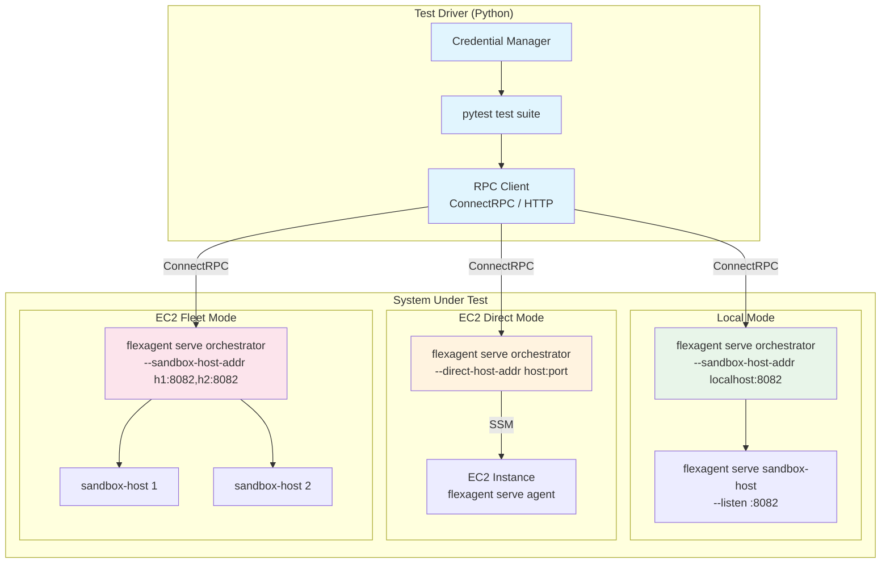
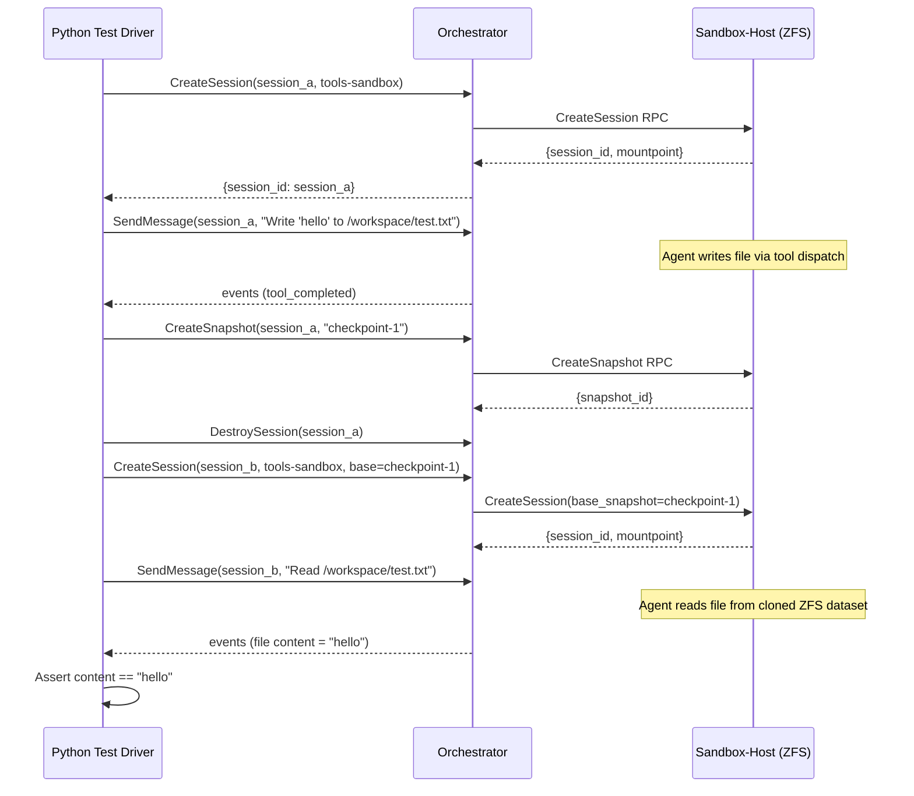
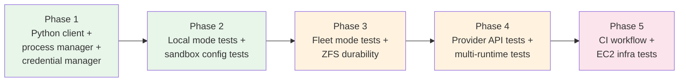

# 22: E2E External Test Plan

**Status:** Draft
**Depends on:** 17-external-testing, 21-serve-orchestrator, 18-agent-loop-rpc, 19-ec2-direct-adapter, 20-fleet-management
**Depended on by:** --
**Scope:** Automated end-to-end testing of the full system from an external client perspective. A Python driver script spins up the orchestrator, makes RPC requests, and validates responses across all deployment modes, sandbox configurations, and LLM providers.

---

## 1. Overview

Plan 17 covers Go-level E2E testing that exercises the runtime as a library consumer. This plan covers **external black-box testing** -- exercising the system as a deployed service through its RPC API, the way a real client application would.

The key differences from plan 17:

- **External driver**: Tests are driven from Python (not Go), exercising the full network stack including HTTP transport, ConnectRPC serialization, and auth headers.
- **Deployment modes**: Tests exercise the orchestrator's three deployment configurations (EC2 fleet, EC2 direct, local/sandbox-host) as they would be deployed in production.
- **Real infrastructure**: Tests spin up actual orchestrator and sandbox-host processes, not in-process mocks.
- **Real LLM providers**: Dedicated test suite for API endpoint correctness against Anthropic, OpenAI, Google, and OpenRouter.
- **Cross-runtime**: Tests verify interop between different agent runtimes (Claude Code, Codex).

Non-goals:
- Replacing plan 17's Go-level tests (those remain for fast CI).
- Load testing (covered by plan 16-runtime-test-harness).
- Unit or component testing of internal packages.

---

## 2. Architecture

### 2.1 System Under Test



### 2.2 Test Driver Architecture

The test driver is a Python package (`tests/e2e/`) using pytest. It communicates with the orchestrator via HTTP using the ConnectRPC JSON protocol (POST to procedure URLs with JSON bodies). This avoids needing generated protobuf stubs -- ConnectRPC's unary protocol is just `POST /rpc.v1.AgentService/SendMessage` with a JSON body.

```
tests/e2e/
    conftest.py                  # pytest fixtures: orchestrator lifecycle, credentials
    client.py                    # FlexAgentClient: thin RPC client wrapper
    credentials.py               # Credential loading from secrets file
    process.py                   # Process manager: start/stop orchestrator, sandbox-host

    test_deployment_modes.py     # §3: Deployment mode tests
    test_sandbox_config.py       # §4: Sandbox configuration tests
    test_zfs_durability.py       # §5: ZFS durability tests
    test_sandbox_identity.py     # §6: Sandbox identity verification
    test_multi_runtime.py        # §7: Multi-runtime tests
    test_provider_api.py         # §8: Real LLM provider API tests

    requirements.txt             # pytest, requests, (optional) grpcio for streaming)
```

### 2.3 RPC Client

The Python client wraps ConnectRPC's unary JSON protocol. Each RPC is a POST request:

```python
class FlexAgentClient:
    """Thin HTTP client for the orchestrator's ConnectRPC API."""

    def __init__(self, base_url: str, auth_token: str = ""):
        self.base_url = base_url.rstrip("/")
        self.session = requests.Session()
        if auth_token:
            self.session.headers["Authorization"] = f"Bearer {auth_token}"
        self.session.headers["Content-Type"] = "application/json"

    def _call(self, procedure: str, payload: dict) -> dict:
        url = f"{self.base_url}{procedure}"
        resp = self.session.post(url, json=payload, timeout=120)
        resp.raise_for_status()
        return resp.json()

    def create_session(self, **kwargs) -> dict:
        return self._call("/rpc.v1.AgentService/CreateSession", kwargs)

    def send_message(self, session_id: str, message: str) -> dict:
        return self._call("/rpc.v1.AgentService/SendMessage", {
            "session_id": session_id, "message": message,
        })

    def get_session(self, session_id: str) -> dict:
        return self._call("/rpc.v1.AgentService/GetSession", {
            "session_id": session_id,
        })

    def destroy_session(self, session_id: str) -> dict:
        return self._call("/rpc.v1.AgentService/DestroySession", {
            "session_id": session_id,
        })

    def steer(self, session_id: str, instruction: str) -> dict:
        return self._call("/rpc.v1.AgentService/Steer", {
            "session_id": session_id, "instruction": instruction,
        })

    def follow_up(self, session_id: str, message: str) -> dict:
        return self._call("/rpc.v1.AgentService/FollowUp", {
            "session_id": session_id, "message": message,
        })

    def abort(self, session_id: str) -> dict:
        return self._call("/rpc.v1.AgentService/Abort", {
            "session_id": session_id,
        })

    def subscribe_events(self, session_id: str):
        """Server-streaming RPC via ConnectRPC streaming protocol.
        Returns an iterator of event dicts."""
        url = f"{self.base_url}/rpc.v1.AgentService/SubscribeEvents"
        resp = self.session.post(url, json={"session_id": session_id},
                                 stream=True, timeout=300)
        resp.raise_for_status()
        for line in resp.iter_lines():
            if line:
                yield json.loads(line)

    def health(self) -> bool:
        resp = self.session.get(f"{self.base_url}/health", timeout=5)
        return resp.status_code == 200
```

For server-streaming RPCs (`SendMessage`, `SubscribeEvents`), ConnectRPC uses newline-delimited JSON over a single HTTP response. The client reads lines incrementally.

### 2.4 Process Manager

The test driver manages orchestrator and sandbox-host processes:

```python
class ProcessManager:
    """Start/stop flexagent processes for testing."""

    def __init__(self, binary_path: str = "flexagent"):
        self.binary = binary_path
        self.processes: list[subprocess.Popen] = []

    def start_sandbox_host(self, listen: str = ":8082", **env) -> subprocess.Popen:
        return self._start(["serve", "sandbox-host", "--listen", listen], env)

    def start_orchestrator(self, listen: str = ":8080", **kwargs) -> subprocess.Popen:
        args = ["serve", "orchestrator", "--listen", listen]
        for k, v in kwargs.items():
            args.extend([f"--{k.replace('_', '-')}", str(v)])
        return self._start(args, kwargs.get("env", {}))

    def _start(self, args: list[str], env: dict) -> subprocess.Popen:
        full_env = {**os.environ, **env}
        proc = subprocess.Popen(
            [self.binary] + args,
            env=full_env,
            stdout=subprocess.PIPE, stderr=subprocess.PIPE,
        )
        self.processes.append(proc)
        return proc

    def stop_all(self):
        for proc in self.processes:
            proc.terminate()
            proc.wait(timeout=10)
        self.processes.clear()
```

---

## 3. Test Safety and Reliability

This is a first-class design concern. These tests will be run by automated agents (not just humans), so every failure mode must resolve cleanly without manual intervention.

### 3.1 Non-Interactive Execution

**Hard rule:** No test step may require interactive input. Every subprocess, API call, and orchestrator command must be fully non-interactive.

- All `flexagent` processes are started with `stdin=/dev/null` (or `subprocess.DEVNULL`).
- No prompts for confirmation, passwords, or API keys at runtime.
- All configuration is via flags, environment variables, or config files -- never stdin.
- The pytest runner itself uses `--no-header -q` to minimize output noise.

### 3.2 Timeouts at Every Layer

Every operation has an explicit timeout. Nothing is allowed to block indefinitely.

| Layer | Timeout | Enforcement |
|-------|---------|-------------|
| **pytest test function** | 120s (default), 300s (infra tests) | `@pytest.mark.timeout(N)` via `pytest-timeout` |
| **HTTP requests** | 30s (unary), 120s (streaming) | `requests.post(..., timeout=N)` |
| **Process startup** | 30s | `wait_for_health()` with deadline |
| **Process shutdown** | 10s | `proc.terminate(); proc.wait(timeout=10)` then `proc.kill()` |
| **LLM API calls** | 60s | HTTP client timeout |
| **Event stream consumption** | 120s | Streaming response timeout |
| **Full test suite** | 600s (fast), 1800s (infra) | pytest `--timeout` global flag |

```python
# Process manager enforces shutdown timeout
def stop_all(self, timeout: float = 10):
    for proc in self.processes:
        proc.terminate()
        try:
            proc.wait(timeout=timeout)
        except subprocess.TimeoutExpired:
            proc.kill()
            proc.wait(timeout=5)
    self.processes.clear()
```

### 3.3 Automatic Cleanup on Failure

Cleanup must happen whether a test passes, fails, times out, or is interrupted by a signal. The design uses multiple layers of cleanup:

**Layer 1: pytest fixtures with finalizers.** All resource-creating fixtures use `yield` with cleanup in the teardown phase. pytest guarantees teardown runs even on test failure or timeout.

```python
@pytest.fixture
def session(local_orchestrator):
    resp = local_orchestrator.create_session(placement="tools-sandbox")
    session_id = resp["session_id"]
    yield session_id
    # Cleanup: always runs, even on failure
    try:
        local_orchestrator.destroy_session(session_id)
    except Exception:
        pass  # Best-effort cleanup
```

**Layer 2: Process manager with atexit and signal handlers.** The process manager registers cleanup hooks so that even if pytest itself crashes, all child processes are terminated.

```python
class ProcessManager:
    def __init__(self, binary_path: str = "flexagent"):
        self.binary = binary_path
        self.processes: list[subprocess.Popen] = []
        atexit.register(self.stop_all)
        signal.signal(signal.SIGTERM, self._signal_handler)
        signal.signal(signal.SIGINT, self._signal_handler)

    def _signal_handler(self, signum, frame):
        self.stop_all()
        sys.exit(128 + signum)
```

**Layer 3: Module-scoped sweep.** Each test module's fixture teardown enumerates and destroys all sessions that weren't explicitly cleaned up (leaked sessions).

```python
@pytest.fixture(scope="module", autouse=True)
def cleanup_leaked_sessions(local_orchestrator):
    yield
    # After all tests in this module: sweep any remaining sessions
    try:
        sessions = local_orchestrator.list_sessions()
        for s in sessions.get("sessions", []):
            try:
                local_orchestrator.destroy_session(s["session_id"])
            except Exception:
                pass
    except Exception:
        pass
```

**Layer 4: Infrastructure cleanup.** For tests that create EC2 instances or ZFS volumes:

```python
@pytest.fixture(scope="module")
def ec2_cleanup():
    created_instances = []
    yield created_instances
    # Teardown: terminate all EC2 instances created during tests
    for instance_id in created_instances:
        try:
            ec2_client.terminate_instances(InstanceIds=[instance_id])
        except Exception:
            pass
```

### 3.4 No Hanging Agents

The test driver must never block waiting for an agent that has become unresponsive.

- **Event stream reads** use a timeout: if no event arrives within 120s, the stream is closed and the test fails.
- **SendMessage** calls set a client-side timeout. If the orchestrator doesn't respond, the client raises `TimeoutError`.
- **Agent turns** have a maximum duration enforced by the test, not the agent. If a turn takes too long, the test calls `Abort()` then `DestroySession()`.

```python
def wait_for_turn_complete(client, session_id, timeout=120):
    """Consume events until turn completes or timeout."""
    deadline = time.time() + timeout
    for event in client.subscribe_events(session_id):
        if event.get("type") == "turn_completed":
            return event
        if time.time() > deadline:
            client.abort(session_id)
            raise TimeoutError(f"Turn did not complete within {timeout}s")
    raise RuntimeError("Event stream ended without turn_completed")
```

### 3.5 Idempotent Test Runs

Tests must not depend on state from previous runs. Each test module:

1. Starts fresh processes (no reuse of processes from other modules unless explicitly shared via session-scoped fixtures).
2. Creates its own sessions with unique IDs.
3. Cleans up all created resources in teardown.

Port allocation uses a deterministic scheme per test tier to avoid conflicts:

| Tier | Orchestrator Port | Sandbox-Host Ports | Stubserver Port |
|------|-------------------|--------------------|-----------------|
| E2E-Fast | 18080 | 18082 | 19090 |
| E2E-Standard | 28080 | 28082, 28083 | 29090 |
| E2E-Provider | 38080 | 38082 | N/A (real providers) |
| E2E-Infra | 48080 | 48082, 48083 | 49090 |

This allows parallel tier execution without port conflicts.

---

## 4. Deployment Mode Tests

These tests verify that each orchestrator deployment configuration works end-to-end.

### 4.1 Local Mode (sandbox-host on localhost)

The simplest deployment: orchestrator + sandbox-host on the same machine. Both `tools-sandbox` and `agent-sandbox` placement modes are available.

```
Setup:
  1. Start sandbox-host on :8082
  2. Start orchestrator with --sandbox-host-addr localhost:8082
  3. Wait for /health on both

Tests:
  DM-L1: Create session (tools-sandbox) -> send message -> get events -> destroy
  DM-L2: Create session (agent-sandbox) -> send message -> get events -> destroy
  DM-L3: Multiple concurrent sessions on same orchestrator
  DM-L4: Session survives orchestrator restart (if sandbox-host stays up)
  DM-L5: Health check returns healthy when sandbox-host is up
  DM-L6: Health check reflects unhealthy when sandbox-host is down
```

### 4.2 EC2 Direct Mode

The orchestrator connects to a pre-existing host running `flexagent serve agent`. Uses `--direct-host-addr`.

```
Prerequisites:
  - EC2 instance running flexagent serve agent (or mock equivalent)
  - Instance reachable from test machine

Setup:
  1. Start orchestrator with --direct-host-addr <host>:<port>
  2. Wait for /health

Tests:
  DM-D1: Create session (agent-direct) -> send message -> get events -> destroy
  DM-D2: Verify agent runs on remote host (hostname check)
  DM-D3: Multiple sessions on same direct host
  DM-D4: Session cleanup on destroy (verify no leaked processes)
```

For CI without real EC2 instances, we can use a local `flexagent serve agent` process as the "direct host" by pointing `--direct-host-addr` at it.

### 4.3 EC2 Fleet Mode

The orchestrator manages multiple sandbox-hosts and routes sessions across them.

```
Prerequisites:
  - Multiple sandbox-host instances (or local processes on different ports)

Setup:
  1. Start sandbox-host on :8082 and :8083
  2. Start orchestrator with --sandbox-host-addr localhost:8082,localhost:8083
  3. Wait for /health on all

Tests:
  DM-F1: Create sessions distributed across fleet members
  DM-F2: Verify routing -- sessions stick to their assigned host
  DM-F3: Fleet health reflects individual host status
  DM-F4: Session creation fails gracefully when all hosts are full
  DM-F5: Fleet handles host going down (health monitoring)
```

### 4.4 Deployment Mode Test Matrix

| Test | Local | EC2 Direct | EC2 Fleet | CI Feasible |
|------|:---:|:---:|:---:|:---:|
| Session lifecycle (create/message/destroy) | Yes | Yes | Yes | All |
| Health monitoring | Yes | Yes | Yes | All |
| Multi-session | Yes | Yes | Yes | All |
| Host failure handling | N/A | N/A | Yes | Yes (kill process) |
| Real EC2 provisioning | No | Yes | No | Nightly only |

---

## 5. Sandbox Configuration Tests

These tests verify that both sandbox placement modes work correctly.

### 5.1 Tools-in-Sandbox

Agent loop runs in orchestrator process; tool calls dispatch to sandbox-host via RPC.

```
SC-T1: File operations (read, write, edit) execute on sandbox-host filesystem
SC-T2: Bash commands execute in sandbox-host environment
SC-T3: Grep and glob operations search sandbox-host filesystem
SC-T4: Tool progress streaming works (bash output arrives incrementally)
SC-T5: Agent can create and read files across multiple turns
SC-T6: File edits persist within the session
```

### 5.2 Agent-in-Sandbox

Agent process runs inside a sandbox on the sandbox-host. All tools run locally inside the sandbox.

```
SC-A1: Agent session creates and runs inside sandbox
SC-A2: Agent can access files within its sandbox mountpoint
SC-A3: Agent processes are isolated from host (PID namespace)
SC-A4: Agent session cleanup destroys sandbox on destroy
SC-A5: Multiple agent-in-sandbox sessions are isolated from each other
```

### 5.3 Mixed Mode

```
SC-M1: Same orchestrator serves both tools-sandbox and agent-sandbox sessions concurrently
SC-M2: Sessions in different modes don't interfere with each other
```

---

## 6. ZFS Durability Tests

These tests verify data persistence across agent lifecycles using ZFS.

**Prerequisite:** Sandbox-host configured with ZFS storage backend (`SANDBOX_STORAGE_BACKEND=zfs`).

```
ZFS-D1: Write file in session A -> destroy A -> create session B on same ZFS dataset
         -> read file back from B -> verify contents match
         (Note: requires snapshot + clone workflow, not just destroy/recreate)

ZFS-D2: Agent writes file -> create snapshot -> agent writes more -> rollback
         -> verify filesystem matches snapshot state

ZFS-D3: Multi-turn agent: each turn creates a snapshot
         -> verify snapshot count matches turn count
         -> rollback to turn N-1 snapshot -> verify state

ZFS-D4: Pause session -> resume session -> verify files are still present

ZFS-D5: Agent writes large file (100MB) -> snapshot -> destroy -> clone from snapshot
         -> verify large file intact (tests ZFS COW under load)
```

### 6.1 Cross-Agent File Persistence Flow



---

## 7. Sandbox Identity Verification

These tests verify agents are running in the correct sandbox environment.

```
SI-1: Agent reads hostname -> verify it matches sandbox ID or container hostname
       (not the orchestrator host)

SI-2: Agent reads /proc/self/cgroup -> verify cgroup isolation
       (gVisor sandbox should show sandbox-specific cgroup)

SI-3: Agent-in-sandbox: hostname differs from host machine hostname

SI-4: Tools-in-sandbox: bash tool `hostname` output comes from sandbox,
       not orchestrator process

SI-5: Two concurrent sessions report different hostnames
       (verifies session isolation)
```

---

## 8. Multi-Runtime Tests

These tests verify interop between different agent driver types.

### 8.1 Claude Code Sandbox

```
MR-CC1: Launch Claude Code driver in agent-sandbox mode
         -> verify normalized events stream back
         -> verify tool calls execute in sandbox

MR-CC2: Claude Code agent writes files -> take snapshot
         -> verify snapshot captures Claude Code's changes
```

### 8.2 Codex Sandbox

```
MR-CX1: Launch Codex driver in agent-sandbox mode
         -> verify normalized events stream back

MR-CX2: Codex agent can execute tools inside its sandbox
```

### 8.3 Cross-Runtime Context Transfer

```
MR-CT1: Claude Code agent works on task -> snapshot -> destroy
         -> Create new session with NativeDriver (or another driver)
            based on same snapshot
         -> New agent reads files and continues work
         -> Verify file state is inherited correctly

MR-CT2: NativeDriver agent writes code -> snapshot
         -> Claude Code agent picks up from snapshot
         -> Verify Claude Code can read and modify the files
```

**Note:** Context transfer means filesystem state transfer (via ZFS snapshots), not conversation history transfer. The new agent starts a fresh conversation but inherits the file system state.

---

## 9. Real LLM Provider API Tests

A focused test suite that exercises real provider API endpoints. These are **not** full agent tests -- they test provider connectivity, auth, and basic streaming at the API level.

### 9.1 Provider Test Matrix

| Provider | Env Var | Model for Testing | Expected Cost |
|----------|---------|-------------------|---------------|
| Anthropic | `ANTHROPIC_API_KEY` | `claude-haiku-4-5-20251001` | ~$0.001/test |
| OpenAI | `OPENAI_API_KEY` | `gpt-4o-mini` | ~$0.001/test |
| Google | `GOOGLE_API_KEY` | `gemini-2.0-flash` | ~$0.001/test |
| OpenRouter | `OPENROUTER_API_KEY` | (cheapest available) | ~$0.001/test |

### 9.2 Test Scenarios

Each provider runs through the same scenario set:

```
PA-1: Simple completion -- send "Say hello" -> verify non-empty response
PA-2: Streaming -- verify SSE events arrive incrementally (not all at once)
PA-3: Tool use -- send schema + prompt requiring tool call -> verify tool_use block
PA-4: Multi-turn -- send message, get response, send follow-up -> verify coherence
PA-5: Auth failure -- use invalid API key -> verify clean error (not crash)
PA-6: Model lookup -- verify model ID resolves correctly in catalog
```

### 9.3 Provider Tests via Orchestrator

These tests run through the full orchestrator stack with real providers:

```
PA-O1: Create session with real Anthropic provider
        -> send coding task -> verify agent uses tools -> destroy
PA-O2: Same with OpenAI provider
PA-O3: Same with Google provider
PA-O4: Verify usage/cost tracking in session metadata after real API calls
```

### 9.4 Test Structure

```python
@pytest.mark.parametrize("provider,model,env_var", [
    ("anthropic", "claude-haiku-4-5-20251001", "ANTHROPIC_API_KEY"),
    ("openai", "gpt-4o-mini", "OPENAI_API_KEY"),
    ("google", "gemini-2.0-flash", "GOOGLE_API_KEY"),
])
def test_provider_simple_completion(provider, model, env_var):
    api_key = os.environ.get(env_var)
    if not api_key:
        pytest.skip(f"{env_var} not set")
    # ... test implementation
```

---

## 10. Credential Management

### 10.1 Secrets File Convention

Test credentials are stored in a local secrets file that is never committed to git.

**File:** `~/.flexagent/test-credentials.env`

```bash
# LLM Provider API keys
ANTHROPIC_API_KEY=sk-ant-...
OPENAI_API_KEY=sk-...
GOOGLE_API_KEY=AIza...
OPENROUTER_API_KEY=sk-or-...

# AWS credentials (for EC2 direct/fleet tests)
AWS_REGION=us-west-2
AWS_ACCESS_KEY_ID=AKIA...
AWS_SECRET_ACCESS_KEY=...

# Orchestrator auth token (for test deployments)
FLEXAGENT_AUTH_TOKEN=test-e2e-token-...
```

### 10.2 Lookup Order

The credential manager loads credentials in this order (later overrides earlier):

1. `~/.flexagent/test-credentials.env` (user's local secrets file)
2. Environment variables (set by CI or shell)
3. `.env.test.local` in the repo root (gitignored, for per-project overrides)

```python
class CredentialManager:
    """Load test credentials from secrets files and environment."""

    SEARCH_PATHS = [
        Path.home() / ".flexagent" / "test-credentials.env",
        Path.cwd() / ".env.test.local",
    ]

    def __init__(self):
        self.credentials: dict[str, str] = {}
        for path in self.SEARCH_PATHS:
            if path.exists():
                self._load_env_file(path)
        # Environment variables override file-based credentials
        for key in list(self.credentials.keys()):
            if key in os.environ:
                self.credentials[key] = os.environ[key]

    def get(self, key: str, required: bool = False) -> str | None:
        val = self.credentials.get(key) or os.environ.get(key)
        if required and not val:
            raise ValueError(f"Required credential {key} not found")
        return val

    def _load_env_file(self, path: Path):
        for line in path.read_text().splitlines():
            line = line.strip()
            if not line or line.startswith("#"):
                continue
            key, _, value = line.partition("=")
            self.credentials[key.strip()] = value.strip()
```

### 10.3 CI Integration

In CI, credentials are injected via GitHub Actions secrets:

```yaml
env:
  ANTHROPIC_API_KEY: ${{ secrets.ANTHROPIC_API_KEY }}
  OPENAI_API_KEY: ${{ secrets.OPENAI_API_KEY }}
  GOOGLE_API_KEY: ${{ secrets.GOOGLE_API_KEY }}
  FLEXAGENT_AUTH_TOKEN: ${{ secrets.FLEXAGENT_AUTH_TOKEN }}
```

Tests that require credentials skip gracefully when they're not available:

```python
def require_credential(key: str):
    """pytest skip decorator for credential-gated tests."""
    val = os.environ.get(key)
    return pytest.mark.skipif(not val, reason=f"{key} not set")
```

---

## 11. CI Integration

### 11.1 Test Tiers

| Tier | What | Prerequisites | Duration | When |
|------|------|---------------|----------|------|
| **E2E-Fast** | Local mode only, stubserver LLM | `flexagent` binary | <2min | Every PR |
| **E2E-Standard** | Local + fleet modes, stubserver LLM | `flexagent` binary, multiple ports | <5min | Every PR |
| **E2E-Provider** | Real LLM provider API tests | API keys | <5min | Nightly |
| **E2E-Infra** | EC2 direct/fleet, ZFS durability, multi-runtime | AWS credentials, ZFS, EC2 instances | <20min | Nightly |

### 11.2 CI Workflow

```yaml
# .github/workflows/e2e-external.yml
name: E2E External Tests

on:
  pull_request:
  schedule:
    - cron: '0 4 * * *'  # Nightly at 4 AM UTC

jobs:
  build-binary:
    runs-on: ubuntu-latest
    steps:
      - uses: actions/checkout@v4
      - uses: actions/setup-go@v5
        with: { go-version: '1.23' }
      - run: go build -o flexagent ./cmd/flexagent
      - uses: actions/upload-artifact@v4
        with:
          name: flexagent-binary
          path: flexagent

  e2e-fast:
    name: "E2E-Fast: Local mode + stubserver"
    runs-on: ubuntu-latest
    needs: build-binary
    steps:
      - uses: actions/checkout@v4
      - uses: actions/setup-python@v5
        with: { python-version: '3.12' }
      - uses: actions/download-artifact@v4
        with: { name: flexagent-binary }
      - run: chmod +x flexagent && pip install -r tests/e2e/requirements.txt
      - run: pytest tests/e2e/ -m "not provider and not infra" -v --timeout=120
        env:
          FLEXAGENT_BINARY: ./flexagent
          FLEXAGENT_AUTH_TOKEN: test-token

  e2e-provider:
    name: "E2E-Provider: Real LLM APIs"
    runs-on: ubuntu-latest
    if: github.event_name == 'schedule'
    needs: build-binary
    steps:
      - uses: actions/checkout@v4
      - uses: actions/setup-python@v5
        with: { python-version: '3.12' }
      - uses: actions/download-artifact@v4
        with: { name: flexagent-binary }
      - run: chmod +x flexagent && pip install -r tests/e2e/requirements.txt
      - run: pytest tests/e2e/test_provider_api.py -v --timeout=120
        env:
          FLEXAGENT_BINARY: ./flexagent
          ANTHROPIC_API_KEY: ${{ secrets.ANTHROPIC_API_KEY }}
          OPENAI_API_KEY: ${{ secrets.OPENAI_API_KEY }}
          GOOGLE_API_KEY: ${{ secrets.GOOGLE_API_KEY }}

  e2e-infra:
    name: "E2E-Infra: EC2 + ZFS + multi-runtime"
    runs-on: [self-hosted, linux, zfs]
    if: github.event_name == 'schedule'
    needs: build-binary
    steps:
      - uses: actions/checkout@v4
      - uses: actions/setup-python@v5
        with: { python-version: '3.12' }
      - uses: actions/download-artifact@v4
        with: { name: flexagent-binary }
      - run: chmod +x flexagent && pip install -r tests/e2e/requirements.txt
      - run: pytest tests/e2e/ -m "infra" -v --timeout=600
        env:
          FLEXAGENT_BINARY: ./flexagent
          ANTHROPIC_API_KEY: ${{ secrets.ANTHROPIC_API_KEY }}
          AWS_REGION: ${{ secrets.AWS_REGION }}
          AWS_ACCESS_KEY_ID: ${{ secrets.AWS_ACCESS_KEY_ID }}
          AWS_SECRET_ACCESS_KEY: ${{ secrets.AWS_SECRET_ACCESS_KEY }}
```

### 11.3 Pytest Markers

```python
# conftest.py
import pytest

def pytest_configure(config):
    config.addinivalue_line("markers", "provider: requires real LLM provider API key")
    config.addinivalue_line("markers", "infra: requires EC2/ZFS infrastructure")
    config.addinivalue_line("markers", "zfs: requires ZFS storage backend")
    config.addinivalue_line("markers", "fleet: requires multiple sandbox-hosts")
    config.addinivalue_line("markers", "multi_runtime: requires Claude Code or Codex binary")
```

---

## 12. Test Fixtures (conftest.py)

### 12.1 Orchestrator Lifecycle Fixture

```python
@pytest.fixture(scope="session")
def flexagent_binary():
    """Path to the flexagent binary."""
    binary = os.environ.get("FLEXAGENT_BINARY", "flexagent")
    assert shutil.which(binary), f"flexagent binary not found: {binary}"
    return binary

@pytest.fixture(scope="module")
def local_orchestrator(flexagent_binary):
    """Start orchestrator + sandbox-host in local mode for the test module."""
    pm = ProcessManager(flexagent_binary)
    auth_token = os.environ.get("FLEXAGENT_AUTH_TOKEN", "test-token")

    # Start sandbox-host
    pm.start_sandbox_host(listen=":8082", FLEXAGENT_AUTH_TOKEN=auth_token)
    wait_for_health("http://localhost:8082/health")

    # Start orchestrator
    pm.start_orchestrator(
        listen=":8080",
        sandbox_host_addr="localhost:8082",
        auth_token=auth_token,
    )
    wait_for_health("http://localhost:8080/health")

    client = FlexAgentClient("http://localhost:8080", auth_token=auth_token)
    yield client

    pm.stop_all()

@pytest.fixture(scope="module")
def fleet_orchestrator(flexagent_binary):
    """Start orchestrator + 2 sandbox-hosts in fleet mode."""
    pm = ProcessManager(flexagent_binary)
    auth_token = os.environ.get("FLEXAGENT_AUTH_TOKEN", "test-token")

    pm.start_sandbox_host(listen=":8082", FLEXAGENT_AUTH_TOKEN=auth_token)
    pm.start_sandbox_host(listen=":8083", FLEXAGENT_AUTH_TOKEN=auth_token)
    wait_for_health("http://localhost:8082/health")
    wait_for_health("http://localhost:8083/health")

    pm.start_orchestrator(
        listen=":8080",
        sandbox_host_addr="localhost:8082,localhost:8083",
        auth_token=auth_token,
    )
    wait_for_health("http://localhost:8080/health")

    client = FlexAgentClient("http://localhost:8080", auth_token=auth_token)
    yield client

    pm.stop_all()

def wait_for_health(url: str, timeout: float = 30, interval: float = 0.5):
    """Poll health endpoint until it returns 200."""
    deadline = time.time() + timeout
    while time.time() < deadline:
        try:
            if requests.get(url, timeout=2).status_code == 200:
                return
        except requests.ConnectionError:
            pass
        time.sleep(interval)
    raise TimeoutError(f"Health check failed: {url}")
```

### 12.2 Stubserver LLM Fixture

For tests that don't need real LLM providers, the test driver starts the stubserver (from plan 17 §12) as the LLM backend:

```python
@pytest.fixture(scope="module")
def stubserver_orchestrator(flexagent_binary):
    """Orchestrator with stubserver as LLM backend."""
    pm = ProcessManager(flexagent_binary)
    auth_token = "test-token"

    # Start stubserver
    pm._start(["cmd/stubserver"], {"STUBSERVER_FIXTURE_DIR": "testdata/fixtures"})
    wait_for_health("http://localhost:9090/health")

    # Start sandbox-host + orchestrator with provider pointed at stubserver
    pm.start_sandbox_host(listen=":8082", FLEXAGENT_AUTH_TOKEN=auth_token)
    wait_for_health("http://localhost:8082/health")

    pm.start_orchestrator(
        listen=":8080",
        sandbox_host_addr="localhost:8082",
        auth_token=auth_token,
        env={
            "ANTHROPIC_BASE_URL": "http://localhost:9090",
            "FLEXAGENT_AUTH_TOKEN": auth_token,
        },
    )
    wait_for_health("http://localhost:8080/health")

    client = FlexAgentClient("http://localhost:8080", auth_token=auth_token)
    yield client

    pm.stop_all()
```

---

## 13. Acceptance Criteria

| Criterion | Target | How Measured |
|-----------|--------|-------------|
| E2E-Fast pass rate | 100% on every PR | CI status check |
| E2E-Fast runtime | <2 minutes | CI job duration |
| E2E-Standard pass rate | 100% on every PR | CI status check |
| Deployment mode coverage | All 3 modes tested | Test count per mode |
| Sandbox config coverage | tools-sandbox + agent-sandbox | Test count per config |
| Provider API coverage | All 4 providers pass basic tests | Provider test results |
| ZFS durability | Write/snapshot/clone/read verified | ZFS test assertions |
| Multi-runtime | At least 2 driver types tested | Multi-runtime test count |
| Credential management | No hardcoded secrets in code | Grep for API keys in committed files |
| CI integration | All tiers defined and runnable | Workflow file exists and parses |

---

## 14. Implementation Sequence



| Phase | Work | Depends On |
|-------|------|------------|
| **Phase 1** | `client.py`, `process.py`, `credentials.py`, `conftest.py`, `requirements.txt` | `flexagent` binary builds |
| **Phase 2** | `test_deployment_modes.py` (local), `test_sandbox_config.py` | Phase 1, stubserver binary |
| **Phase 3** | `test_deployment_modes.py` (fleet), `test_zfs_durability.py` | Phase 2, ZFS-enabled sandbox-host |
| **Phase 4** | `test_provider_api.py`, `test_multi_runtime.py`, `test_sandbox_identity.py` | Phase 2, API keys, Claude Code/Codex binaries |
| **Phase 5** | `.github/workflows/e2e-external.yml`, EC2 direct mode tests | Phase 3-4, AWS infrastructure |

---

## 15. Relationship to Plan 17

| Aspect | Plan 17 (Go E2E) | Plan 22 (External E2E) |
|--------|-------------------|------------------------|
| **Language** | Go | Python |
| **Interface** | Library API (in-process) | RPC API (over network) |
| **LLM backend** | ScriptedProvider / stubserver | Stubserver / real providers |
| **Deployment** | In-process or Docker | Real processes (`flexagent serve`) |
| **Focus** | Agent loop correctness, cross-mode parity | Deployment correctness, infra integration |
| **Speed** | <30s (Tier 1) | <2min (E2E-Fast) |
| **CI** | Every PR (all tiers) | Every PR (fast), nightly (full) |

The two plans are complementary. Plan 17 catches bugs in the agent loop and tool execution logic with fast, deterministic tests. Plan 22 catches deployment, wiring, credential, and infrastructure integration bugs that only surface when running real processes over the network.

---

## 16. Open Questions

1. **ConnectRPC streaming from Python**: The unary JSON protocol is trivial, but server-streaming RPCs (SendMessage, SubscribeEvents) use ConnectRPC's streaming wire format. Should we use `grpcio` for streaming, implement the ConnectRPC streaming protocol manually (newline-delimited JSON envelopes), or use a ConnectRPC Python library if one becomes available?

2. **Stubserver as LLM backend**: For E2E-Fast tests, should we use the Go stubserver binary from plan 17, or implement a minimal Python-based fixture server? The Go binary is already built but adds a dependency on building two binaries.

3. **Port allocation**: Tests start multiple processes on fixed ports (8080, 8082, 8083, 9090). Should we use dynamic port allocation to avoid conflicts when tests run in parallel? This adds complexity to the process manager.

4. **EC2 direct mode without real EC2**: For CI, we simulate EC2 direct mode by pointing `--direct-host-addr` at a local `flexagent serve agent` process. Is this sufficient, or should we invest in localstack/mock EC2 for more realistic testing?

5. **Multi-runtime binary availability**: Claude Code and Codex binaries may not be available in CI. Should multi-runtime tests be nightly-only, or should we provide lightweight mock drivers that simulate their behavior?
