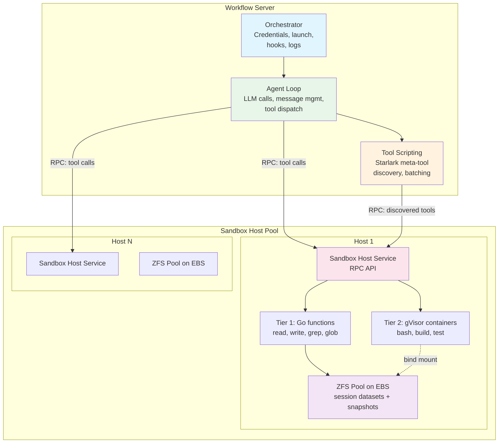
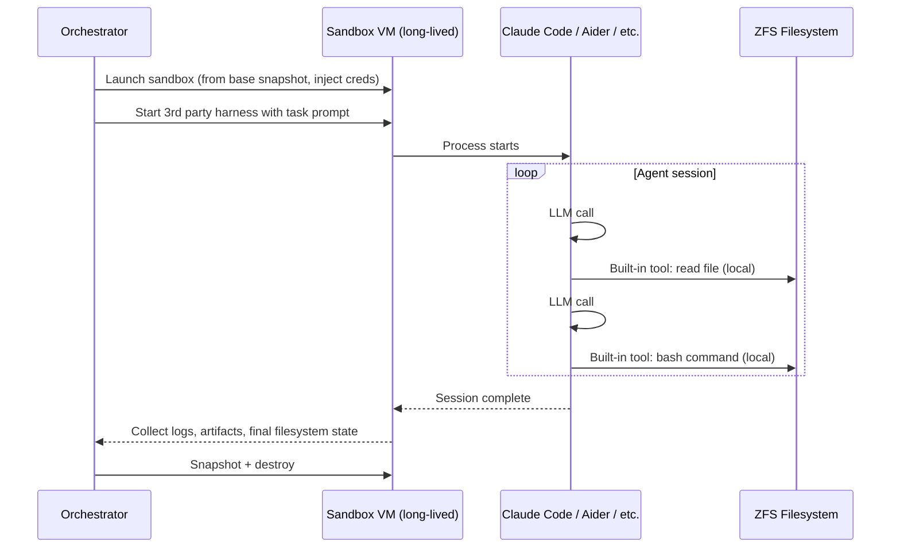

# Agent Runtime — Shaping

## Source

> Fundamentally, an agent is an LLM paired with a computer.
>
> We're providing a toolkit of different patterns for giving LLMs a computer.
>
> We want to support flexibly running all the pieces in different places as needed to let anyone build up the right runtime for them.

---

## Problem

Building an AI coding agent today requires choosing a rigid, all-in-one harness (Claude Code, Cursor, Aider, etc.) that bundles the agent loop, tools, and execution environment into a single monolithic process running on one machine. This creates several problems:

1. **No flexibility in placement** — The agent loop, tool execution, and orchestration all run in the same place. You can't run the agent loop on cheap compute while dispatching heavy builds to beefy hardware.
2. **No production-grade execution** — Local file operations have no snapshotting, rollback, or durability. If the process dies, state is lost.
3. **Vendor lock-in to one harness** — Each harness has its own agent loop, tool definitions, and assumptions. Switching or mixing is impossible.
4. **One-size-fits-all compute** — A file read and a full build run on the same hardware with the same resources.
5. **No multi-agent coordination** — Running 50+ agents at scale requires orchestration, credential management, and resource scheduling that no single-machine harness provides.

## Outcome

A flexible agent runtime where:
- The three core layers (orchestrator, agent loop, tools) can be placed independently — all local, partially remote, or fully distributed
- Multiple execution backends are supported for tools, from local filesystem to production sandbox hosts with ZFS snapshots and gVisor containers
- 3rd party agent harnesses (Claude Code, etc.) can be integrated within the framework
- Agents can pause, resume, and roll back with full filesystem state preservation
- The system scales from a single developer's laptop to thousands of concurrent agents

---

## Requirements (R)

| ID | Requirement | Category |
|----|-------------|----------|
| R0 | Three-layer architecture: orchestrator, agent loop, and tools, with well-defined RPC interfaces between them | Core goal |
| R1 | Each layer can run locally or remotely, independently of the others | Core goal |
| R2 | Tool calls execute in isolated environments with configurable resource sizing (lightweight for file ops, heavyweight for builds) | Core goal |
| R3 | Every tool call produces a filesystem snapshot; full incremental history is maintained | Must-have |
| R4 | Agents can pause (zero compute cost) and resume from last snapshot, across hours or days | Must-have |
| R5 | Rollback: restore both agent session state and filesystem to any prior snapshot in sync | Must-have |
| R6 | 3rd party agent harnesses can be run within the framework, at minimum by running the entire harness inside a sandbox | Must-have |
| R7 | Tool scripting (code-mode / Starlark executor) is supported as a meta-tool that can call other tools | Must-have |
| R8 | Multiple concurrent agents can be orchestrated with credential injection, tool policies, and log/artifact collection | Must-have |
| R9 | Sandbox can be initialized from a pre-built snapshot (repo checked out, deps installed) | Must-have |
| R10 | Snapshot overhead is low enough for per-tool-call frequency | Must-have |

---

## Architecture

### Three-Layer Model

```
1. Orchestrator    — Control plane: launch agents, inject credentials/tools/prompts,
                     handle hooks, collect logs & artifacts

2. Agent Loop      — Core loop: LLM provider calls, message log management,
                     tool call dispatch

3. Tools           — Regular tools (read, write, bash, grep, glob, MCP)
                     + Tool scripting meta-tool (Starlark/code-mode executor)
```

The boundaries between layers are well-defined RPC interfaces, allowing any layer to be local or remote.

### Tool Scripting as a Meta-Tool

Tool scripting (Starlark/code-mode executor) is NOT a separate architectural layer. It is a special tool that:
- Receives a script (Starlark code) from the agent loop like any other tool call
- Executes in a sandboxed interpreter with no filesystem/network access
- Can call other tools through exposed builtins (discover, invoke)
- Returns structured results back to the agent loop

This avoids polluting LLM context with full tool documentation (progressive discovery) and enables multi-step tool workflows in a single agent turn (token efficiency).

It requires a much smaller runtime than tools like bash — just an embedded interpreter plus helper function bindings, no OS or filesystem needed.

### Two-Tier Tool Execution

Tools on a sandbox host are split into two tiers based on isolation needs:

**Tier 1 — File operations (no VM needed):**
- Read, write, grep, glob, git operations
- Execute as Go functions directly on ZFS dataset
- Microsecond latency
- No isolation boundary (operations are constrained to session dataset with path validation)

**Tier 2 — Process execution (container sandbox required):**
- Bash, shell commands, builds, test runs, linters
- Execute in gVisor (runsc) containers with per-call resource sizing via cgroups
- ZFS dataset bind-mounted directly into the container — native filesystem performance
- ~50-150ms container start overhead per call
- Strong syscall-level isolation (user-space kernel, used by GKE Sandbox and Cloud Run) — arbitrary code cannot affect host or other sessions
- Runs on any standard EC2 instance — no bare-metal or nested virtualization required

ZFS snapshots are taken after every tool call regardless of tier.

### Container Lifecycle: Per-Tool-Call

Containers are spun up per tool call and destroyed after completion — NOT kept alive during LLM thinking time. At scale this matters:

- 50 agents x 12 hours x 85% idle = 510 container-hours wasted if kept alive
- Boot overhead: ~100ms per call x 200 calls = 20 seconds total over 12 hours (negligible)
- Default: spin up, execute, snapshot, destroy
- Potential optimization: batch rapid sequential tool calls in one container session

---

## Placement Modes

The three layers can be arranged in multiple configurations:

### Mode 1: All Local (dev / simple)

```
[Orchestrator + Agent Loop + Tools]
         on laptop
```

- Simplest setup — everything in one process
- No snapshots or remote execution, just local filesystem
- Good for development, single-agent use

### Mode 2: Remote Agent (managed sandbox)

```
[Orchestrator]  ←RPC→  [Agent Loop + Tools]
  on server              on sandbox host
```

- Orchestrator manages multiple agents, each running on a sandbox host
- Agent loop + tools colocated — local filesystem access, no RPC per tool call
- **Primary 3rd party harness integration path:** run the entire harness (Claude Code, etc.) inside the sandbox. The harness doesn't know it's remote.
- Tradeoff: VM/container runs for the duration of the agent session including LLM thinking time

### Mode 3: Split Tools (compute-optimized)

```
[Orchestrator + Agent Loop]  ←RPC→  [Tools]
       on server                on sandbox host(s)
```

- Agent loop runs on the workflow server alongside orchestrator
- Tool calls dispatched via RPC to sandbox hosts
- Most compute-efficient: agent loop is just goroutines waiting on LLM responses (cheap), sandbox hosts only active during tool execution
- RPC overhead (~1-5ms) is negligible vs LLM thinking time (5-30+ seconds)
- Scales independently: agent count limited by workflow server capacity, tool execution limited by sandbox host pool

### Mode 4: Fully Distributed

```
[Orchestrator]  ←RPC→  [Agent Loop]  ←RPC→  [Tools]
  on server          on lightweight host    on sandbox host(s)
```

- Maximum flexibility — each layer scales and fails independently
- Agent loop on its own infrastructure, decoupled from both orchestrator and tools
- Useful when agent loop has specific requirements (GPU for local inference, geographic placement, etc.)

---

## Solution: ZFS-on-EBS + gVisor

Combines ZFS on EBS for instantly-snapshotable filesystem with gVisor containers for fast, dynamically-sized, isolated execution.

### Why gVisor

gVisor (runsc) is a user-space container runtime that intercepts syscalls through a reimplemented Linux kernel interface (written in Go, memory-safe). It is used in production by Google (GKE Sandbox, Cloud Run).

Key advantages over Firecracker microVMs for this use case:
- **ZFS access via bind mount** — the ZFS dataset is bind-mounted directly into the container. No virtio-fs, NFS, or rootfs extraction needed. Native filesystem performance.
- **Runs on any EC2 instance** — no bare-metal or nested virtualization required. Firecracker needs KVM, which means `.metal` instances or nested-virt-capable types when running inside EC2 (VM within a VM). gVisor runs in user-space.
- **No nested virtualization performance penalty** — Firecracker inside EC2 suffers 10-30% overhead from double address translation and double I/O virtualization. gVisor has no hypervisor layer.
- **Comparable boot times** — ~50-150ms container start, similar to Firecracker's ~125ms VM boot.
- **Strong isolation** — syscall interception in user-space with a memory-safe kernel. Not hardware-level (KVM) isolation, but sufficient for executing agent-generated code where we're protecting against accidental damage and runaway processes, not adversarial kernel exploits.

Firecracker or other VM runtimes (Kata Containers) remain a future option if hardware-level isolation is ever required (e.g., running fully untrusted third-party code).

### Solution Components

| Part | Mechanism |
|------|-----------|
| **S1** | **Durable filesystem:** ZFS pool on EBS volume(s). ZFS provides instant COW snapshots. EBS provides durability across host lifecycle. |
| **S2** | **Execution environment:** Tier 1 (file ops) as Go functions on the host with direct ZFS access. Tier 2 (bash/builds) in gVisor containers with ZFS dataset bind-mounted. CPU/memory limits set via cgroups per container. |
| **S3** | **Snapshot lifecycle:** `zfs snapshot` after each tool call. Instant (microseconds), space-efficient (COW — only changed blocks stored). Named with monotonic IDs correlated to agent event log. |
| **S4** | **Pause/resume:** No container running between tool calls or when paused. ZFS pool on EBS persists. On resume: attach EBS (if needed), import ZFS pool, ready. |
| **S5** | **Rollback:** `zfs rollback` to any named snapshot. Agent session reconstructed from event log. |
| **S6** | **Initial snapshot:** Base ZFS snapshots pre-built. New sessions `zfs clone` from base (~instant). |
| **S7** | **Dynamic sizing:** gVisor container CPU/memory limits set via cgroups per tool call. Tier 1 calls need zero container resources. |
| **S8** | **Host management:** "Sandbox host" service on EC2 manages ZFS pool + gVisor containers. Exposes RPC API. Multiple agent sessions per host (each with own ZFS dataset). |

---

## Fit Check

| Req | Requirement | Status |
|-----|-------------|--------|
| R0 | Three-layer architecture with RPC interfaces | ✅ |
| R1 | Each layer can run locally or remotely | ✅ |
| R2 | Isolated tool execution with configurable resources | ✅ |
| R3 | Per-tool-call filesystem snapshots | ✅ |
| R4 | Pause/resume with zero idle compute | ✅ |
| R5 | Synchronized rollback of session + filesystem | ✅ |
| R6 | 3rd party harness integration (Mode 2) | ✅ |
| R7 | Tool scripting meta-tool support | ✅ |
| R8 | Multi-agent orchestration | ✅ |
| R9 | Initialization from pre-built snapshot | ✅ |
| R10 | Low snapshot overhead | ✅ |

All requirements pass with ZFS-on-EBS + gVisor.

---

## Analysis

### Eliminated Alternatives

- **ZFS-on-EBS + Fargate:** Fargate cannot attach EBS volumes. Fundamental gap.
- **ZFS-on-EBS + EC2 (start/stop):** EC2 instance types are fixed at launch. Cannot dynamically resize per tool call.
- **Kubernetes + PV Snapshots:** EBS snapshots take seconds-to-minutes. Incompatible with per-tool-call snapshot frequency.
- **Firecracker microVMs + Overlay Snapshots:** Overlay snapshots degrade at depth (hundreds of layers hurt read performance). Firecracker also requires bare-metal EC2 or nested virtualization, adding cost and operational complexity.
- **Firecracker microVMs + ZFS:** Firecracker can't bind-mount host filesystems (needs virtio-fs/NFS workarounds). Requires bare-metal or nested-virt EC2 instances with 10-30% performance overhead. gVisor solves both problems.

### Key Properties of Chosen Solution

- **ZFS snapshots** are instant (microseconds) and space-efficient (COW). An agent session with 500 tool calls changing a few files each might use a few hundred MB of snapshot storage.
- **Two-tier execution** eliminates container overhead for ~80% of tool calls (file operations). Only bash/builds spin up gVisor containers.
- **Per-tool-call container lifecycle** avoids idle compute waste at scale.
- **gVisor bind mounts** give containers native filesystem performance on ZFS — no virtio-fs or NFS indirection.
- **Standard EC2 instances** — no bare-metal or nested virtualization needed. Wider instance selection, lower cost.
- **EBS durability** survives host failure. Volumes can be detached and reattached to different hosts for resume.

---

## 3rd Party Harness Integration

### Integration Strategy

3rd party harnesses (Claude Code, Cursor, Aider, etc.) have deeply integrated assumptions about local execution. Their built-in tools cannot be overridden or redirected.

**Primary integration path: Mode 2 (remote agent).** Run the entire 3rd party harness inside a sandbox (VM or container). From the harness's perspective, it's running locally — it just happens to be "local" inside our managed sandbox with ZFS underneath.

The orchestrator layer wraps around the harness:
- Injects credentials (API keys, git auth) into the sandbox environment
- Provides the initial filesystem snapshot (code checked out, deps installed)
- Collects logs and artifacts after completion
- Manages pause/resume of the sandbox

**Limitations of Mode 2 with 3rd party harnesses:**
- The VM/container runs for the full agent session (no per-tool-call spin-down), since the harness process must stay alive
- Snapshotting happens at the filesystem level but isn't correlated to individual tool calls (the harness doesn't emit events we can hook into)
- Resource sizing is fixed for the session, not per tool call
- Rollback is coarser — we can snapshot periodically or on git commits, but not per tool call

**Deeper integration (stretch goal per harness):**
- Mount remote ZFS via NFS so file operations hit remote storage transparently
- Use hooks (where available) to trigger snapshots on tool calls
- These are harness-specific and fragile — document supported modes per harness

### Our Own Harness

Our `ai-agent-go` agent framework is the default and most capable option. It supports all placement modes (1-4), full per-tool-call snapshots, two-tier execution, tool scripting, and the complete orchestrator integration. This is the path for production-scale deployments.

---

## Architecture Sketch (Mode 3: Split Tools)



### Sequence: Tool Call (Mode 3)


### Sequence: 3rd Party Harness (Mode 2)



---

## Decisions

### D1: Two-Repo Split

The project is split into two repositories with a clean dependency direction:

**`h2-agent-runtime`** (this repo):
- Core agent loop (our own LLM abstraction + tool dispatch, inspired by pi-mono)
- Tool interfaces and built-in tool implementations (read, write, bash, grep, glob)
- Terminal multiplexer / session manager (for running CLI-based 3rd party agents like Claude Code, Codex, Aider — they need a PTY)
- OTEL event normalization (parsing agent activity from 3rd party harnesses)
- Sandbox host service (ZFS + gVisor)
- Tool scripting meta-tool (Starlark/code-mode executor)
- Importable as a Go library by everything-db or any other consumer

**`h2` (orchestrator, separate repo):**
- Profiles, roles, pods configuration system
- Inter-agent messaging protocol
- Plan/review/signoff framework
- Work ledger / beads-lite task system
- External integrations (Linear, etc.)
- Pluggable UI layer (headless by default — TUI, web, desktop/mobile, Slack/Telegram, pure API)
- Imports `h2-agent-runtime` as a dependency

**Why two repos:**
- Clean dependency direction: `h2` depends on `h2-agent-runtime`, never the reverse
- everything-db imports `h2-agent-runtime` without pulling in orchestration opinions
- Runtime is a stable general-purpose library; orchestrator is an opinionated framework with faster evolution
- Separate release cadences

### D2: Everything-DB Integration

everything-db imports `h2-agent-runtime` as a Go library to implement its deferred `ActivityAgentLoop` and `ActivityLLMCall` workflow activity types.

The `AgentTool` interface is the integration seam between placement modes:

```go
// edb workflow executor, Mode 1 (local — single laptop)
tools := []AgentTool{localReadFile, localBash, localGrep}
agent := agentruntime.NewAgentLoop(tools, llmConfig)

// edb workflow executor, Mode 3 (remote sandbox — production)
tools := []AgentTool{sandboxRPC.ReadFile, sandboxRPC.Bash, sandboxRPC.Grep}
agent := agentruntime.NewAgentLoop(tools, llmConfig)
```

Same agent loop code, different tool backends. In Mode 1, everything runs in-process (just goroutines, no RPC, no sandbox host, no ZFS). In Mode 3, tool calls dispatch to sandbox hosts via RPC. The agent loop doesn't know or care — it just calls `AgentTool.Execute()`.

This makes the agent feel built-in to edb rather than a separate piece of infrastructure. The workflow engine dispatches `ActivityAgentLoop` → runtime runs the loop → events flow back as activity progress/completion via the existing ERC patterns.

### D3: Terminal Mux in the Runtime

The terminal multiplexer (PTY allocation, session management, attach/detach) lives in `h2-agent-runtime`, not the orchestrator. 3rd party harnesses (Claude Code, Codex, Aider) are CLI processes that require a PTY to run. Without it, Mode 2 (run 3rd party harness in sandbox) doesn't work.

The TUI (user-facing terminal interface) lives in `h2` orchestrator — it's a UI concern, distinct from the infrastructure that manages agent processes.

### D4: Headless Orchestrator with Pluggable UI

The h2 orchestrator is headless by default, exposing APIs that any UI can consume:
- TUI (current h2 terminal experience)
- Web interface
- Desktop/mobile app
- Chat integrations (Slack, Telegram — existing bridge pattern)
- Pure API consumers (CI/CD, other services)

---

## Open Questions

### OQ1: RPC Protocol Between Layers

What protocol for the inter-layer RPCs? gRPC (typed, streaming), HTTP/JSON (simple), or custom binary. Affects latency, tooling, and observability. Should align with everything-db patterns if integrating.

### OQ2: 3rd Party Harness Snapshot Granularity

In Mode 2 with 3rd party harnesses, how do we trigger snapshots without per-tool-call hooks? Options: periodic timer, inotify/fswatch on filesystem changes, git commit hooks, or accept coarser granularity.

### OQ3: Cloud Provider Portability

Solution as described is AWS-specific (EBS, EC2). ZFS and gVisor are portable to any Linux host. The AWS-specific piece is EBS for durable block storage — GCP has Persistent Disks, Azure has Managed Disks. Orchestration layer would need provider adapters.

### Resolved Questions

- **~~Firecracker + ZFS filesystem sharing~~** — Resolved by choosing gVisor. Bind-mount ZFS dataset directly into container. No virtio-fs/NFS needed.
- **~~Firecracker vs container isolation~~** — Resolved: gVisor. Sufficient isolation for agent-generated code, runs on standard EC2, no nested virtualization overhead.
- **~~Orchestrator ↔ Workflow Engine relationship~~** — Resolved: the runtime is a Go library that edb imports. The orchestrator (h2) is a separate, higher-level framework. edb can use the runtime directly or optionally integrate with h2 orchestrator for multi-agent coordination.
