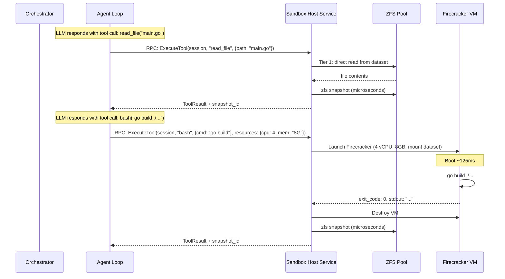
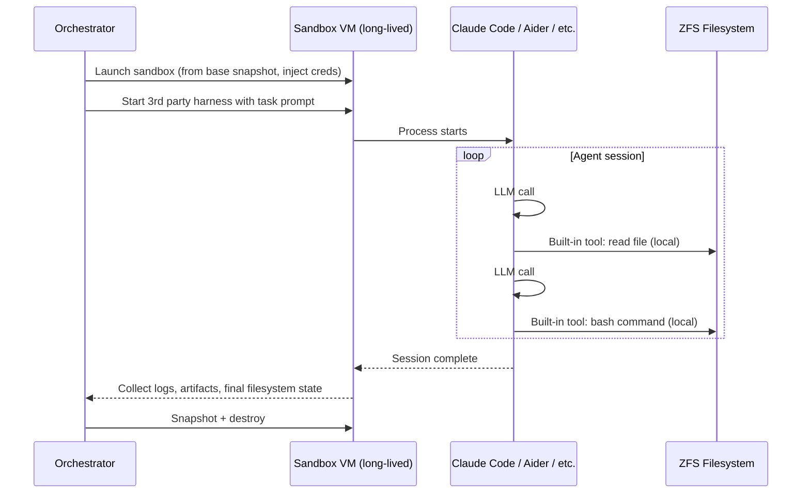

# Agent Runtime — Shaping

## Source

> Fundamentally, an agent is an LLM paired with a computer.
>
> We're providing a toolkit of different patterns for giving LLMs a computer.
>
> We want to support flexibly running all the pieces in different places as needed to let anyone build up the right runtime for them.

---

## Problem

Building an AI coding agent today requires choosing a rigid, all-in-one harness (Claude Code, Cursor, Aider, etc.) that bundles the agent loop, tools, and execution environment into a single monolithic process running on one machine. This creates several problems:

1. **No flexibility in placement** — The agent loop, tool execution, and orchestration all run in the same place. You can't run the agent loop on cheap compute while dispatching heavy builds to beefy hardware.
2. **No production-grade execution** — Local file operations have no snapshotting, rollback, or durability. If the process dies, state is lost.
3. **Vendor lock-in to one harness** — Each harness has its own agent loop, tool definitions, and assumptions. Switching or mixing is impossible.
4. **One-size-fits-all compute** — A file read and a full build run on the same hardware with the same resources.
5. **No multi-agent coordination** — Running 50+ agents at scale requires orchestration, credential management, and resource scheduling that no single-machine harness provides.

## Outcome

A flexible agent runtime where:
- The three core layers (orchestrator, agent loop, tools) can be placed independently — all local, partially remote, or fully distributed
- Multiple execution backends are supported for tools, from local filesystem to production sandbox hosts with ZFS snapshots and Firecracker microVMs
- 3rd party agent harnesses (Claude Code, etc.) can be integrated within the framework
- Agents can pause, resume, and roll back with full filesystem state preservation
- The system scales from a single developer's laptop to thousands of concurrent agents

---

## Requirements (R)

| ID | Requirement | Category |
|----|-------------|----------|
| R0 | Three-layer architecture: orchestrator, agent loop, and tools, with well-defined RPC interfaces between them | Core goal |
| R1 | Each layer can run locally or remotely, independently of the others | Core goal |
| R2 | Tool calls execute in isolated environments with configurable resource sizing (lightweight for file ops, heavyweight for builds) | Core goal |
| R3 | Every tool call produces a filesystem snapshot; full incremental history is maintained | Must-have |
| R4 | Agents can pause (zero compute cost) and resume from last snapshot, across hours or days | Must-have |
| R5 | Rollback: restore both agent session state and filesystem to any prior snapshot in sync | Must-have |
| R6 | 3rd party agent harnesses can be run within the framework, at minimum by running the entire harness inside a sandbox | Must-have |
| R7 | Tool scripting (code-mode / Starlark executor) is supported as a meta-tool that can call other tools | Must-have |
| R8 | Multiple concurrent agents can be orchestrated with credential injection, tool policies, and log/artifact collection | Must-have |
| R9 | Sandbox can be initialized from a pre-built snapshot (repo checked out, deps installed) | Must-have |
| R10 | Snapshot overhead is low enough for per-tool-call frequency | Must-have |

---

## Architecture

### Three-Layer Model

```
1. Orchestrator    — Control plane: launch agents, inject credentials/tools/prompts,
                     handle hooks, collect logs & artifacts

2. Agent Loop      — Core loop: LLM provider calls, message log management,
                     tool call dispatch

3. Tools           — Regular tools (read, write, bash, grep, glob, MCP)
                     + Tool scripting meta-tool (Starlark/code-mode executor)
```

The boundaries between layers are well-defined RPC interfaces, allowing any layer to be local or remote.

### Tool Scripting as a Meta-Tool

Tool scripting (Starlark/code-mode executor) is NOT a separate architectural layer. It is a special tool that:
- Receives a script (Starlark code) from the agent loop like any other tool call
- Executes in a sandboxed interpreter with no filesystem/network access
- Can call other tools through exposed builtins (discover, invoke)
- Returns structured results back to the agent loop

This avoids polluting LLM context with full tool documentation (progressive discovery) and enables multi-step tool workflows in a single agent turn (token efficiency).

It requires a much smaller runtime than tools like bash — just an embedded interpreter plus helper function bindings, no OS or filesystem needed.

### Two-Tier Tool Execution

Tools on a sandbox host are split into two tiers based on isolation needs:

**Tier 1 — File operations (no VM needed):**
- Read, write, grep, glob, git operations
- Execute as Go functions directly on ZFS dataset
- Microsecond latency
- No isolation boundary (operations are constrained to session dataset with path validation)

**Tier 2 — Process execution (VM required):**
- Bash, shell commands, builds, test runs, linters
- Execute in Firecracker microVMs with per-call resource sizing
- ~125ms boot overhead per call
- Full KVM isolation — arbitrary code cannot affect host or other sessions

ZFS snapshots are taken after every tool call regardless of tier.

### VM Lifecycle: Per-Tool-Call

VMs are spun up per tool call and destroyed after completion — NOT kept alive during LLM thinking time. At scale this matters:

- 50 agents x 12 hours x 85% idle = 510 VM-hours wasted if kept alive
- Boot overhead: 125ms per call x 200 calls = 27 seconds total over 12 hours (negligible)
- Default: spin up, execute, snapshot, destroy
- Potential optimization: batch rapid sequential tool calls in one VM session

---

## Placement Modes

The three layers can be arranged in multiple configurations:

### Mode 1: All Local (dev / simple)

```
[Orchestrator + Agent Loop + Tools]
         on laptop
```

- Simplest setup — everything in one process
- No snapshots or remote execution, just local filesystem
- Good for development, single-agent use

### Mode 2: Remote Agent (managed sandbox)

```
[Orchestrator]  ←RPC→  [Agent Loop + Tools]
  on server              on sandbox host
```

- Orchestrator manages multiple agents, each running on a sandbox host
- Agent loop + tools colocated — local filesystem access, no RPC per tool call
- **Primary 3rd party harness integration path:** run the entire harness (Claude Code, etc.) inside the sandbox. The harness doesn't know it's remote.
- Tradeoff: VM/container runs for the duration of the agent session including LLM thinking time

### Mode 3: Split Tools (compute-optimized)

```
[Orchestrator + Agent Loop]  ←RPC→  [Tools]
       on server                on sandbox host(s)
```

- Agent loop runs on the workflow server alongside orchestrator
- Tool calls dispatched via RPC to sandbox hosts
- Most compute-efficient: agent loop is just goroutines waiting on LLM responses (cheap), sandbox hosts only active during tool execution
- RPC overhead (~1-5ms) is negligible vs LLM thinking time (5-30+ seconds)
- Scales independently: agent count limited by workflow server capacity, tool execution limited by sandbox host pool

### Mode 4: Fully Distributed

```
[Orchestrator]  ←RPC→  [Agent Loop]  ←RPC→  [Tools]
  on server          on lightweight host    on sandbox host(s)
```

- Maximum flexibility — each layer scales and fails independently
- Agent loop on its own infrastructure, decoupled from both orchestrator and tools
- Useful when agent loop has specific requirements (GPU for local inference, geographic placement, etc.)

---

## Shapes

### Shape C: Firecracker microVMs + Overlay Snapshots

Uses Firecracker microVMs for fast-launching, lightweight isolation. Filesystem snapshots via overlay filesystem approach.

| Part | Mechanism |
|------|-----------|
| **C1** | **Durable filesystem:** Overlay filesystem (OverlayFS or device-mapper thin provisioning) on top of a base image stored in durable block storage. Each tool call writes to a new overlay layer. |
| **C2** | **Execution environment:** Firecracker microVMs. Sub-second boot (~125ms). CPU/memory configurable per VM. |
| **C3** | **Snapshot lifecycle:** After each tool call, the overlay diff is persisted as a snapshot layer. Snapshots are additive — each references its parent. |
| **C4** | **Pause/resume:** On pause, VM terminated. Filesystem overlays persisted durably. On resume, fresh VM booted with overlay stack at last point. |
| **C5** | **Rollback:** Discard overlay layers after the target point. Re-launch VM from that point. |
| **C6** | **Initial snapshot:** Base VM images pre-built with repo, deps, toolchain. New sessions layer on top. |
| **C7** | **Dynamic sizing:** Firecracker allows specifying vCPUs and memory per microVM at creation time. |

**Tradeoff:** Overlay snapshots are simpler than ZFS but less space-efficient and harder to manage at depth (many layers degrade read performance).

### Shape E: ZFS-on-EBS + Firecracker (Hybrid) — Leading

Combines ZFS on EBS for instantly-snapshotable filesystem with Firecracker microVMs for fast, dynamically-sized execution.

| Part | Mechanism |
|------|-----------|
| **E1** | **Durable filesystem:** ZFS pool on EBS volume(s). ZFS provides instant COW snapshots. EBS provides durability. |
| **E2** | **Execution environment:** Tier 1 (file ops) as Go functions on the host. Tier 2 (bash/builds) in Firecracker microVMs. ZFS pool lives on the host; microVMs access filesystem via virtio-fs or shared mount. |
| **E3** | **Snapshot lifecycle:** `zfs snapshot` after each tool call. Instant (microseconds), space-efficient (COW — only changed blocks stored). Named with monotonic IDs correlated to agent event log. |
| **E4** | **Pause/resume:** No VM running between tool calls or when paused. ZFS pool on EBS persists. On resume: attach EBS (if needed), import ZFS pool, ready. |
| **E5** | **Rollback:** `zfs rollback` to any named snapshot. Agent session reconstructed from event log. |
| **E6** | **Initial snapshot:** Base ZFS snapshots pre-built. New sessions `zfs clone` from base (~instant). |
| **E7** | **Dynamic sizing:** Firecracker vCPU/memory per VM. Tier 1 calls need zero VM resources. |
| **E8** | **Host management:** "Sandbox host" service on EC2 manages ZFS pool + Firecracker VMs. Exposes RPC API. Multiple agent sessions per host (each with own ZFS dataset). |

---

## Fit Check

| Req | Requirement | C | E |
|-----|-------------|---|---|
| R0 | Three-layer architecture with RPC interfaces | ✅ | ✅ |
| R1 | Each layer can run locally or remotely | ✅ | ✅ |
| R2 | Isolated tool execution with configurable resources | ✅ | ✅ |
| R3 | Per-tool-call filesystem snapshots | ✅ | ✅ |
| R4 | Pause/resume with zero idle compute | ✅ | ✅ |
| R5 | Synchronized rollback of session + filesystem | ✅ | ✅ |
| R6 | 3rd party harness integration (Mode 2) | ✅ | ✅ |
| R7 | Tool scripting meta-tool support | ✅ | ✅ |
| R8 | Multi-agent orchestration | ✅ | ✅ |
| R9 | Initialization from pre-built snapshot | ✅ | ✅ |
| R10 | Low snapshot overhead | ⚠️ | ✅ |

**R10 note for Shape C:** Overlay snapshots are fast but degrade at depth. After hundreds of layers, read performance suffers as the filesystem must traverse the overlay stack. Periodic flattening needed. ZFS (Shape E) has no such degradation.

---

## Analysis

### Eliminated Shapes (from previous iteration)

- **ZFS-on-EBS + Fargate:** Fargate cannot attach EBS volumes. Fundamental gap.
- **ZFS-on-EBS + EC2 (start/stop):** EC2 instance types are fixed at launch. Cannot dynamically resize per tool call.
- **Kubernetes + PV Snapshots:** EBS snapshots take seconds-to-minutes. Incompatible with per-tool-call snapshot frequency.

### Leading Shape

**Shape E (ZFS-on-EBS + Firecracker)** passes all requirements. Key properties:

- **ZFS snapshots** are instant (microseconds) and space-efficient (COW). An agent session with 500 tool calls changing a few files each might use a few hundred MB of snapshot storage.
- **Two-tier execution** eliminates VM overhead for ~80% of tool calls (file operations). Only bash/builds spin up VMs.
- **Per-tool-call VM lifecycle** avoids idle compute waste at scale.
- **EBS durability** survives host failure. Volumes can be detached and reattached to different hosts for resume.

Shape C is a viable fallback if ZFS operational complexity is a concern, at the cost of snapshot depth management.

---

## 3rd Party Harness Integration

### Integration Strategy

3rd party harnesses (Claude Code, Cursor, Aider, etc.) have deeply integrated assumptions about local execution. Their built-in tools cannot be overridden or redirected.

**Primary integration path: Mode 2 (remote agent).** Run the entire 3rd party harness inside a sandbox (VM or container). From the harness's perspective, it's running locally — it just happens to be "local" inside our managed sandbox with ZFS underneath.

The orchestrator layer wraps around the harness:
- Injects credentials (API keys, git auth) into the sandbox environment
- Provides the initial filesystem snapshot (code checked out, deps installed)
- Collects logs and artifacts after completion
- Manages pause/resume of the sandbox

**Limitations of Mode 2 with 3rd party harnesses:**
- The VM/container runs for the full agent session (no per-tool-call spin-down), since the harness process must stay alive
- Snapshotting happens at the filesystem level but isn't correlated to individual tool calls (the harness doesn't emit events we can hook into)
- Resource sizing is fixed for the session, not per tool call
- Rollback is coarser — we can snapshot periodically or on git commits, but not per tool call

**Deeper integration (stretch goal per harness):**
- Mount remote ZFS via NFS so file operations hit remote storage transparently
- Use hooks (where available) to trigger snapshots on tool calls
- These are harness-specific and fragile — document supported modes per harness

### Our Own Harness

Our `ai-agent-go` agent framework is the default and most capable option. It supports all placement modes (1-4), full per-tool-call snapshots, two-tier execution, tool scripting, and the complete orchestrator integration. This is the path for production-scale deployments.

---

## Architecture Sketch (Mode 3: Split Tools with Shape E)


### Sequence: Tool Call (Mode 3)



### Sequence: 3rd Party Harness (Mode 2)



---

## Open Questions

### OQ1: Firecracker + ZFS Filesystem Sharing

How does the Firecracker microVM access the ZFS filesystem on the host? Options: virtio-fs (experimental in Firecracker), NFS/9p, rootfs extraction. Highest-risk technical question — needs a spike.

### OQ2: Firecracker vs Container Isolation

Firecracker requires bare-metal or nested-virt EC2 instances. If container-level isolation (gVisor, cgroups) is acceptable for Tier 2, deployment simplifies significantly. Needs a security/isolation requirements discussion.

### OQ3: RPC Protocol Between Layers

What protocol for the inter-layer RPCs? gRPC (typed, streaming), HTTP/JSON (simple), or custom binary. Affects latency, tooling, and observability. Should align with everything-db patterns if integrating.

### OQ4: 3rd Party Harness Snapshot Granularity

In Mode 2 with 3rd party harnesses, how do we trigger snapshots without per-tool-call hooks? Options: periodic timer, inotify/fswatch on filesystem changes, git commit hooks, or accept coarser granularity.

### OQ5: Orchestrator ↔ Workflow Engine Relationship

Is the orchestrator a standalone service, or is it the everything-db workflow engine? The workflow engine already has activity dispatch, credential management, and durable execution. The orchestrator role may be a thin layer on top of it rather than a separate system.

### OQ6: Cloud Provider Portability

Shape E as described is AWS-specific (EBS, EC2). ZFS and Firecracker are portable to any KVM-capable Linux. The AWS-specific piece is EBS for durable block storage — GCP has Persistent Disks, Azure has Managed Disks. Orchestration layer would need provider adapters.

---

## Next Steps

1. **Resolve OQ1** — Spike on Firecracker + ZFS filesystem sharing mechanism
2. **Resolve OQ2** — Decide Firecracker vs container isolation (affects deployment complexity and cost)
3. **Prototype ZFS snapshot performance** — Benchmark per-tool-call snapshot latency and space consumption
4. **Design RPC interfaces** between the three layers (OQ3)
5. **Detail Shape E** into concrete components (sandbox host service, orchestrator API, tool dispatch protocol)
6. **Slice for implementation** — Vertical increments starting with Mode 1 (all local) and building toward Mode 3
