# Cloud Sandbox Providers — Shaping

## Source

> **Context:** The flex-agent-runtime currently has two interfaces for sandbox
> management: `ExecutionEnvironment` (tool-level: execute tools, snapshot,
> rollback, pause/resume) and `SandboxControl` (orchestrator-level: create/destroy
> sandboxes, launch/kill long-running processes, pause/resume). The only
> implementations today are `NodeSandboxControl` and `NativeSandboxEnvironment`,
> which wrap our own sandbox-host service (ZFS + gVisor on EC2). We want to add
> adapters for 3rd party cloud sandbox providers so callers can swap sandbox
> backends without changing agent code.
>
> **Providers to evaluate:** E2B, Daytona, Fly.io Machines, and EC2 in two
> distinct roles: (1) as an infrastructure provisioner for our native sandbox,
> and (2) as a lightweight non-isolated sandbox for multi-agent collaboration.
>
> **Run modes to assess:**
> - **Tools in Sandbox** — Agent loop runs externally; individual tool calls are
>   dispatched to the sandbox for execution.
> - **Agent in Sandbox** — The agent loop itself runs inside the sandbox as a
>   long-running process, accessible via RPC.
> - **All in Sandbox** — Everything (orchestrator + agent loop + tools) runs in
>   one sandbox. Requires the same capabilities as Agent in Sandbox plus
>   orchestrator-level functionality.

---

## Problem

The native sandbox backend (ZFS + gVisor on EC2) provides the strongest
capability set (instant snapshots, rollback, pause/resume, two-tier execution)
but requires us to operate our own infrastructure: EC2 instances, ZFS pools,
gVisor, and the sandbox-host service. Many users and deployment scenarios would
benefit from delegating sandbox infrastructure to a managed 3rd party provider
at the cost of reduced capabilities. Additionally, we need a way to scale the
native sandbox to multiple machines with automated provisioning, and a simpler
option for collaborative agent teams that do not require per-agent isolation.
We need to understand which providers and EC2 usage patterns can implement which
parts of our interfaces, and where the gaps are.

## Outcome

A clear capability mapping of cloud sandbox providers (E2B, Daytona,
Fly.io Machines) and two distinct EC2 roles (EC2 as infra provisioner for our
native sandbox, EC2 as lightweight sandbox) against our `ExecutionEnvironment`
and `SandboxControl` interfaces, with an assessment of which run modes are
feasible for each, what trade-offs each introduces, and a recommendation for
implementation priority.

---

## Requirements (R)

These requirements are derived directly from the `ExecutionEnvironment` and
`SandboxControl` interfaces, plus the run-mode requirements.

| ID | Requirement | Source | Category |
|----|-------------|--------|----------|
| R0 | **Create/Destroy sandbox** — Provision an isolated environment and tear it down, releasing all resources. | `SandboxControl.CreateSandbox/DestroySandbox`, `ExecutionEnvironment.Create/Destroy` | Core |
| R1 | **Execute commands (tool calls)** — Run arbitrary shell commands or tool-specific logic inside the sandbox and return results. | `ExecutionEnvironment.ExecuteTool` | Core |
| R2 | **Streaming command output** — Stream stdout/stderr progress back to the caller during tool execution. | `ExecutionEnvironment.ExecuteTool(onProgress)`, `ToolProgress` | Core |
| R3 | **Filesystem persistence between tool calls** — Files written by one tool call must be visible to subsequent tool calls within the same session. | Implicit in `ExecutionEnvironment` session model | Core |
| R4 | **Snapshot/rollback** — Create named point-in-time filesystem snapshots and restore to any previous snapshot. | `ExecutionEnvironment.CreateSnapshot/Rollback`, `SandboxCapabilities.Snapshots/Rollback` | Must-have |
| R5 | **Pause/Resume with state preservation** — Pause the sandbox to zero compute cost and resume later with filesystem (and ideally process) state intact. | `ExecutionEnvironment.Pause/Resume`, `SandboxControl.PauseSandbox/ResumeSandbox` | Must-have |
| R6 | **Launch long-running process** — Start a persistent process inside the sandbox (e.g., an agent loop binary) and get connectivity info. | `SandboxControl.LaunchProcess/KillProcess/GetProcessStatus` | Must-have (Agent in Sandbox) |
| R7 | **Expose ports (for RPC)** — Make a port inside the sandbox reachable from outside so the orchestrator can communicate with a launched process. | `LaunchProcessResponse.Address` | Must-have (Agent in Sandbox) |
| R8 | **Network access (for LLM API calls)** — The sandbox must have outbound internet access so a process inside can call LLM provider APIs. | Implicit for Agent in Sandbox mode | Must-have (Agent in Sandbox) |
| R9 | **Resource limits (CPU/memory)** — Specify CPU and memory for the sandbox or per tool call. | `CreateSandboxRequest.Resources`, `ToolRequest.Resources` | Must-have |
| R10 | **Max lifetime sufficient for agent sessions** — Sandbox must stay alive long enough for a full agent session (hours to days). | `SandboxCapabilities.MaxSandboxDuration` | Must-have |
| R11 | **Cold start < 5s** — Sandbox creation must be fast enough that it doesn't dominate tool call latency. | Operational | Should-have |
| R12 | **Cost-efficient at scale** — Billing model should not penalize idle time during LLM thinking (pay-per-second or pause support). | Operational | Should-have |

---

## Shapes

### Shape A: E2B

[E2B](https://e2b.dev) provides cloud sandboxes built on Firecracker microVMs
with a purpose-built API for AI agent tool execution.

| Part | Mechanism | Notes |
|------|-----------|:-----:|
| **A1: Create/Destroy** | `Sandbox.create()` / `sandbox.kill()`. REST API for lifecycle, gRPC for real-time ops. Sandboxes spin up in ~80-200ms. | |
| **A2: Execute commands** | `sandbox.commands.run(cmd)` — runs a shell command and returns stdout/stderr/exit code. Also supports `sandbox.commands.start()` for background commands. | |
| **A3: Streaming output** | `on_stdout` / `on_stderr` callbacks on `commands.run()`. Real-time streaming via gRPC. | |
| **A4: Filesystem persistence** | Full persistent filesystem within a sandbox session. Files survive across multiple `commands.run()` calls. | |
| **A5: Snapshots** | `sandbox.snapshot()` captures full VM state (filesystem + memory + running processes). New sandbox can be spawned from snapshot via `Sandbox.create(snapshot=id)`. | |
| **A6: Rollback** | Spawn a new sandbox from a prior snapshot. Not in-place rollback on the same sandbox — requires creating a new sandbox from the snapshot. Rollback = destroy current + create from snapshot. | ~200ms |
| **A7: Pause/Resume** | `sandbox.pause()` / `Sandbox.resume(sandbox_id)`. Full state preservation: filesystem, running processes, loaded variables, memory. Paused sandboxes consume no compute. | |
| **A8: Long-running process** | `sandbox.commands.start()` for background processes. Sandbox stays alive up to 24h (Pro). Can run an agent loop binary as a background process. | |
| **A9: Expose ports** | `sandbox.getHost(port)` returns a publicly accessible URL for any port. Configurable `allowPublicTraffic`. | |
| **A10: Network access** | Outbound internet enabled by default (`allowInternetAccess`). Domain-based filtering available for HTTP/TLS. | |
| **A11: Resource limits** | 1-8 vCPUs, 512 MiB - 8 GiB RAM. Configurable per sandbox. | |
| **A12: Max lifetime** | 24 hours (Pro), 1 hour (Hobby). | |
| **A13: Cold start** | ~80-200ms depending on region proximity and template complexity. | |
| **A14: Cost** | $0.05/hr per vCPU. Memory at $0.0000045/GiB/s. Per-second billing. Paused sandboxes at zero compute cost. | |

**Run mode assessment:**

- **Tools in Sandbox:** Excellent fit. `commands.run()` maps directly to `ExecuteTool`. Filesystem persists between calls. Snapshots available (via new sandbox spawn). Pause/resume with full state.
- **Agent in Sandbox:** Feasible. Launch agent binary via `commands.start()`, expose RPC port via `getHost()`, outbound internet for LLM calls. 24h max lifetime is a constraint for very long sessions.
- **All in Sandbox:** Feasible with same 24h lifetime constraint.

---

### Shape B: Daytona

[Daytona](https://www.daytona.io) provides secure sandboxes for AI code
execution built on OCI containers with a RESTful API and multi-language SDKs.

| Part | Mechanism | Notes |
|------|-----------|:-----:|
| **B1: Create/Destroy** | `daytona.create()` / `sandbox.delete()`. REST API. Sandboxes built from OCI images. Creation in ~27-90ms. | |
| **B2: Execute commands** | `sandbox.process.exec(cmd)` — run shell commands. Also supports `sandbox.process.code_run()` for language-specific execution (Python, JS, etc.). | |
| **B3: Streaming output** | `onStdout` / `onStderr` callbacks. Real-time streaming supported. | |
| **B4: Filesystem persistence** | Full persistent filesystem within a session. Files survive across commands. Sandbox daemon (Toolbox API) manages filesystem ops. | |
| **B5: Snapshots** | Snapshots capture configured environment (OCI image-level). Checkpoint feature (point-in-time filesystem rollback) exists but is newer — captures filesystem state, CPU/memory/disk config, env vars, volumes, network settings. | |
| **B6: Rollback** | Checkpoint restore reverts filesystem to a saved state. Available via API/SDK. Creates a new sandbox from the checkpoint entity. | |
| **B7: Pause/Resume** | Auto-stop after 15 min inactivity (configurable, can disable). **Stop clears memory state** — only filesystem is preserved. Running processes are NOT restored on resume. This is a lossy pause. | **Lossy** |
| **B8: Long-running process** | Background process sessions via `sandbox.process.createSession()`. Auto-stop timer may kill sandbox even while processes run (inactivity = no new SDK events, not process activity). Must disable auto-stop or keep heartbeating. | |
| **B9: Expose ports** | Sandboxes expose ports. Per-sandbox firewall rules configurable. | |
| **B10: Network access** | Full network stack per sandbox. Configurable egress firewall (allow/deny destinations). | |
| **B11: Resource limits** | Default 1 vCPU / 1 GiB / 3 GiB disk. Max per sandbox: 4 vCPUs / 8 GiB RAM / 10 GiB disk (contact support for higher). | |
| **B12: Max lifetime** | No hard max if auto-stop is disabled. Auto-archive after 7 days stopped. Auto-delete configurable. | |
| **B13: Cold start** | ~27-90ms. | |
| **B14: Cost** | $0.067/hr for 1 vCPU / 1 GiB. Per-second billing. $200 free credits. | |

**Run mode assessment:**

- **Tools in Sandbox:** Good fit for basic use. Command execution and filesystem persistence work well. Checkpoints provide rollback. Main gap: pause/resume is lossy (memory state not preserved, processes killed). Must treat pause as "stop and restart from filesystem."
- **Agent in Sandbox:** Feasible but requires care. Must disable auto-stop. Agent process must handle being killed on stop and restarting from persisted state. Port exposure and network access work.
- **All in Sandbox:** Same caveats as Agent in Sandbox.

---

### Shape C: Fly.io Machines

[Fly.io Machines](https://fly.io) provides Firecracker microVMs with a REST
API, full VM lifecycle control, suspend/resume, volumes, and global deployment.

| Part | Mechanism | Notes |
|------|-----------|:-----:|
| **C1: Create/Destroy** | Machines API `POST /apps/{app}/machines` / `DELETE`. Full Firecracker VM provisioning. | |
| **C2: Execute commands** | No built-in command execution API. Must SSH into the machine (`fly ssh console -C "command"`) or run an agent/daemon inside the VM that accepts commands via a custom protocol. | **No native API** |
| **C3: Streaming output** | No native streaming API for command output. Would need custom implementation over SSH or a daemon protocol. | **No native API** |
| **C4: Filesystem persistence** | Root filesystem persists across Machine stop/start. Fly Volumes provide persistent block storage attached to a single Machine. | |
| **C5: Snapshots** | Volume snapshots: automatic daily snapshots (retained 5 days, configurable up to 60). On-demand snapshots via `fly volumes snapshots create`. New volumes can be created from snapshots. | **Volume-level** |
| **C6: Rollback** | Create a new volume from a snapshot, attach to a new Machine. Not in-place rollback — requires volume recreation and Machine relaunch. Slower than E2B/Daytona. | **Slow** |
| **C7: Pause/Resume** | `suspend` / `start` (resume). Full VM state preservation via Firecracker snapshots (CPU registers, memory, open file handles). Resume in ~hundreds of ms. Suspended machines billed only for root filesystem storage ($0.15/GB/month). | **Full state** |
| **C8: Long-running process** | The Machine IS the long-running process. Run any binary as the Machine's entrypoint. Full VM lifecycle control. | |
| **C9: Expose ports** | Full port exposure via Fly proxy. Anycast routing. Configurable services in machine config. | |
| **C10: Network access** | Full outbound internet. Private networking between Machines via WireGuard. | |
| **C11: Resource limits** | Flexible CPU/RAM presets from shared-cpu-1x/256MB to performance-16x/128GB. Custom specs via API. | |
| **C12: Max lifetime** | No hard max. Machines run indefinitely until stopped or destroyed. | |
| **C13: Cold start** | Cold boot: ~1-3s for typical apps. Resume from suspend: ~hundreds of ms. | |
| **C14: Cost** | Per-second billing. Shared-cpu-1x/256MB at ~$0.0027/hr. Performance VMs higher. Suspended machines at storage-only cost. Volume pricing separate. | |

**Run mode assessment:**

- **Tools in Sandbox:** Requires significant custom work. No native command execution API — must build a command execution daemon that runs inside the VM and accepts tool calls via HTTP/gRPC. Filesystem persistence and suspend/resume are excellent. Snapshots are volume-level (slow rollback, minutes not milliseconds).
- **Agent in Sandbox:** Excellent fit. Run the agent binary as the Machine's process. Full port exposure, outbound internet, suspend/resume with complete state preservation. No lifetime limits. Most flexible option.
- **All in Sandbox:** Excellent fit. Full VM with no restrictions.

---

### Shape D1: EC2 as Infra Provisioner

[AWS EC2](https://aws.amazon.com/ec2/) instances used as the underlying
infrastructure for our native sandbox. In this shape, `SandboxControl.CreateSandbox`
provisions an EC2 instance, installs and starts the sandbox-host service, then
delegates all actual sandbox management (ZFS snapshots, gVisor isolation,
tool execution) to `NodeSandboxControl`. EC2 sits BELOW `SandboxControl` as an
infrastructure provisioner, not alongside E2B/Daytona/Fly as a sandbox provider.
This enables scaling our native sandbox — which has the richest feature set — to
multiple machines.

| Part | Mechanism | Notes |
|------|-----------|:-----:|
| **D1-1: Create/Destroy** | `RunInstances` / `TerminateInstances` provisions the underlying EC2 instance. Instance is set up with ZFS + gVisor + sandbox-host via user data or AMI. Once sandbox-host is running, `NodeSandboxControl` handles sandbox creation on the instance. | **Provisioning layer** |
| **D1-2: Execute commands** | Delegated to `NativeSandboxEnvironment` via sandbox-host RPC once the instance is running. Full native command execution with streaming. | **Via native sandbox** |
| **D1-3: Streaming output** | Delegated to native sandbox. Full gRPC streaming via sandbox-host. | **Via native sandbox** |
| **D1-4: Filesystem persistence** | ZFS datasets on EBS. Full persistence managed by native sandbox. | **Via native sandbox** |
| **D1-5: Snapshots** | ZFS snapshots via native sandbox. Instant, in-place. | **Via native sandbox** |
| **D1-6: Rollback** | `zfs rollback` via native sandbox. Instant, in-place. | **Via native sandbox** |
| **D1-7: Pause/Resume** | Sandbox-level pause/resume managed by native sandbox (gVisor container pause). Instance-level stop/start possible for cost savings but slower (10-30s restart, sandbox-host must re-initialize). | **Full via native sandbox** |
| **D1-8: Long-running process** | Full support via native sandbox's `LaunchProcess`. | **Via native sandbox** |
| **D1-9: Expose ports** | Security groups + native sandbox port forwarding. | **Via native sandbox** |
| **D1-10: Network access** | Full outbound via VPC. Sandbox network policy managed by gVisor. | **Via native sandbox** |
| **D1-11: Resource limits** | Instance type determines total resources. Native sandbox manages per-sandbox resource allocation within the instance. | **Two-level** |
| **D1-12: Max lifetime** | No limit. Instance runs until terminated. | |
| **D1-13: Cold start** | Instance provisioning: 10-90s (one-time). Subsequent sandbox creation on the running instance: same speed as native sandbox. AMI pre-baking reduces setup time. | **Instance boot is slow, sandbox creation fast** |
| **D1-14: Cost** | EC2 instance cost (e.g., t3.medium ~$0.042/hr) plus EBS storage. Same cost model as current native sandbox but with automated provisioning. | |

**Run mode assessment:**

- **Tools in Sandbox:** Excellent. Once the instance is provisioned and sandbox-host is running, all capabilities are identical to the native sandbox — the richest feature set of any option. Instant ZFS snapshots, gVisor isolation, native streaming.
- **Agent in Sandbox:** Excellent. Full native sandbox capabilities including long-running processes, port exposure, and no lifetime limits.
- **All in Sandbox:** Excellent. Full native sandbox capabilities.

---

### Shape D2: EC2 as Lightweight Sandbox

[AWS EC2](https://aws.amazon.com/ec2/) instances used directly as non-isolated
execution environments. Multiple agents share one instance without separate
sandboxes. Good for collaborative agent teams that do not need isolation — like
running `flexagent serve all` for N agents sharing a filesystem. Sits alongside
E2B/Daytona/Fly as a simpler, lower-isolation option.

| Part | Mechanism | Notes |
|------|-----------|:-----:|
| **D2-1: Create/Destroy** | `RunInstances` / `TerminateInstances` API. Launch from AMI. The instance IS the sandbox — no additional isolation layer. | **No isolation** |
| **D2-2: Execute commands** | SSH or a lightweight daemon running on the instance. Multiple agents execute commands on the same OS. No per-agent isolation. | **Shared execution** |
| **D2-3: Streaming output** | SSH can stream. A custom daemon can provide gRPC/HTTP streaming. SSM polling is also available but inferior. | **Custom daemon or SSH** |
| **D2-4: Filesystem persistence** | EBS volumes persist across instance stop/start. All agents share the same filesystem. | **Shared filesystem** |
| **D2-5: Snapshots** | EBS snapshots via `CreateSnapshot`. Incremental, stored in S3. Seconds to minutes depending on volume size. Captures the entire shared filesystem — no per-agent granularity. | **Slow, no per-agent granularity** |
| **D2-6: Rollback** | Create new EBS volume from snapshot, detach old, attach new. Not in-place. Multi-step process (30s-minutes). Rolls back ALL agents' state, not individual. | **Slow, all-or-nothing** |
| **D2-7: Pause/Resume** | `StopInstances` / `StartInstances`. EBS preserved. Memory state NOT preserved. Running processes killed. Restart 10-30s. | **Lossy, slow** |
| **D2-8: Long-running process** | Run any process on the instance. Full OS control. Multiple agent processes coexist. | |
| **D2-9: Expose ports** | Security groups control inbound/outbound. Elastic IPs or instance public IPs. Full port control. | |
| **D2-10: Network access** | Full outbound by default (configurable via security groups and NACLs). VPC networking. | |
| **D2-11: Resource limits** | Fixed per instance type at launch. Resources shared across all agents on the instance. No per-agent enforcement without OS-level cgroups. | **Shared, fixed at launch** |
| **D2-12: Max lifetime** | No limit. Instances run until terminated. | |
| **D2-13: Cold start** | New instance launch: 10-90s. Restart stopped instance: 10-30s. | **Slow** |
| **D2-14: Cost** | Per-second billing (Linux). Cost shared across all agents on the instance. t3.medium ~$0.042/hr. Stopped instances: EBS storage cost only ($0.08/GB/month gp3). | **Cost-efficient when shared** |

**Run mode assessment:**

- **Agent in Sandbox (multi-agent, no isolation):** Best fit. Multiple agents share one instance, each running as a process. Like running `flexagent serve all` for N agents on a shared filesystem. No per-agent isolation, but simple and cost-efficient for collaborative teams.
- **Tools in Sandbox:** Works but without per-tool isolation. All tool calls execute on the same OS with the same filesystem. Snapshots and rollback affect all agents, not individual ones.
- **All in Sandbox:** Works for single-agent or collaborative multi-agent. Not suitable when isolation between agents or tools is needed.

---

## Capability Comparison Table

| Capability | A: E2B | B: Daytona | C: Fly.io | D1: EC2 Infra Provisioner | D2: EC2 Lightweight Sandbox |
|------------|--------|------------|-----------|---------------------------|------------------------------|
| **Create/Destroy** | Native API, ~80-200ms | Native API, ~27-90ms | Native API, ~1-3s | EC2 boot 10-90s, then native sandbox | AWS API, ~10-90s |
| **Execute commands** | `commands.run()` | `process.exec()` | SSH or custom daemon | Via native sandbox (full) | SSH or custom daemon |
| **Streaming output** | gRPC callbacks | SDK callbacks | Custom only | Via native sandbox (gRPC) | Custom daemon or SSH |
| **FS persistence** | Full (within session) | Full (within session) | Root FS + Volumes | ZFS on EBS (via native sandbox) | EBS volumes (shared) |
| **Snapshot** | Full VM state (fs+memory+procs) | Checkpoints (fs + config) | Volume snapshots (daily auto, on-demand) | ZFS snapshots (instant, via native sandbox) | EBS snapshots (seconds-minutes) |
| **Rollback** | New sandbox from snapshot (~200ms) | Checkpoint restore | New volume from snapshot (minutes) | `zfs rollback` (instant, via native sandbox) | New volume from snapshot (minutes) |
| **Pause/Resume** | Full state preservation | Lossy (filesystem only) | Full state (Firecracker snapshot) | gVisor container pause (via native sandbox) | Lossy (filesystem only), 10-30s restart |
| **Long-running process** | Background commands, 24h max | Background sessions, auto-stop risk | Machine IS the process, no limit | Via native sandbox, no limit | Full OS, no limit |
| **Expose ports** | `getHost(port)`, public URL | Per-sandbox firewall | Fly proxy, anycast | Security groups + native sandbox | Security groups, EIPs |
| **Network access** | Outbound by default | Full stack, firewall configurable | Full outbound, WireGuard | Full, VPC + gVisor policy | Full, VPC configurable |
| **Resource limits** | 1-8 vCPU, 512M-8G RAM | 1-4 vCPU, 1-8G RAM, 3-10G disk | Flexible presets, up to 16x/128G | Instance type (total) + native sandbox (per-sandbox) | Shared, fixed per instance type |
| **Max lifetime** | 24h (Pro) | No hard max | No limit | No limit | No limit |
| **Cold start** | 80-200ms | 27-90ms | 1-3s (cold), ~hundreds ms (resume) | 10-90s (instance), fast (sandbox) | 10-90s |
| **Cost model** | $0.05/hr/vCPU, per-second | $0.067/hr (1vCPU/1G), per-second | Per-second, presets | Per-second, instance type | Per-second, shared across agents |
| **Isolation** | Per-sandbox (Firecracker) | Per-sandbox (OCI) | Per-Machine (Firecracker) | Per-sandbox (gVisor, via native sandbox) | None (shared OS) |
| **Tools in Sandbox** | Excellent | Good (lossy pause) | Requires custom daemon | Excellent (via native sandbox) | Works (no per-tool isolation) |
| **Agent in Sandbox** | Good (24h limit) | Feasible (auto-stop risk) | Excellent | Excellent (via native sandbox) | Best fit (multi-agent, no isolation) |

---

## Fit Check: R x {A, B, C, D1, D2}

| Req | Requirement | A: E2B | B: Daytona | C: Fly.io | D1: EC2 Infra Provisioner | D2: EC2 Lightweight Sandbox |
|-----|-------------|--------|------------|-----------|---------------------------|------------------------------|
| R0 | Create/Destroy sandbox | Yes | Yes | Yes | Yes (EC2 + native sandbox) | Yes (EC2 instance) |
| R1 | Execute commands | Yes (native) | Yes (native) | Partial (SSH/custom) | Yes (via native sandbox) | Partial (SSH/custom daemon) |
| R2 | Streaming output | Yes (gRPC) | Yes (callbacks) | No (custom needed) | Yes (via native sandbox gRPC) | Partial (custom daemon or SSH) |
| R3 | FS persistence between tool calls | Yes | Yes | Yes | Yes (ZFS) | Yes (shared EBS) |
| R4 | Snapshot/rollback | Yes (spawn new sandbox) | Yes (checkpoints) | Partial (volume-level, slow) | Yes (ZFS, instant, in-place) | Partial (EBS, slow, all-or-nothing) |
| R5 | Pause/Resume with state preservation | Yes (full) | Partial (lossy) | Yes (full) | Yes (gVisor container pause) | Partial (lossy, slow) |
| R6 | Launch long-running process | Yes (24h limit) | Yes (auto-stop risk) | Yes (no limit) | Yes (via native sandbox, no limit) | Yes (no limit) |
| R7 | Expose ports | Yes | Yes | Yes | Yes | Yes |
| R8 | Network access for LLM calls | Yes | Yes | Yes | Yes | Yes |
| R9 | Resource limits | Yes (1-8 vCPU) | Yes (1-4 vCPU) | Yes (flexible) | Yes (instance + per-sandbox) | Partial (shared, fixed at launch) |
| R10 | Max lifetime for agent sessions | Partial (24h cap) | Yes | Yes | Yes | Yes |
| R11 | Cold start < 5s | Yes (~80-200ms) | Yes (~27-90ms) | Yes (~1-3s) | Partial (instance boot slow, sandbox creation fast) | No (10-90s) |
| R12 | Cost-efficient at scale | Yes (pause = zero cost) | Yes (stop = disk only) | Yes (suspend = storage only) | Yes (standard EC2 + native sandbox efficiency) | Yes (cost shared across agents) |

### Summary of gaps by provider

**A (E2B):**
- R4 rollback is not in-place; requires destroying current sandbox and spawning new from snapshot (~200ms, acceptable).
- R10 capped at 24h. Sessions longer than 24h would need to snapshot and re-create.

**B (Daytona):**
- R5 pause is lossy. Memory/process state is not preserved. Agent must be designed to reconstruct state from filesystem on resume.
- R9 max 4 vCPU / 8 GiB per sandbox without contacting support.
- Auto-stop timer can kill sandbox even with running processes. Must disable or heartbeat.

**C (Fly.io):**
- R1/R2 no native command execution or streaming API. Must build and deploy a tool execution daemon inside the VM. Highest implementation effort.
- R4 volume snapshots are slow (not instant). Rollback requires new volume creation.

**D1 (EC2 Infra Provisioner):**
- R11 initial instance boot is slow (10-90s), but this is a one-time cost per machine. Subsequent sandbox creation on a running instance is fast. Pre-baked AMIs mitigate boot time.
- Requires operational investment in EC2 instance management (auto-scaling, health checks, AMI updates), but this is the cost of scaling the native sandbox to multiple machines.

**D2 (EC2 Lightweight Sandbox):**
- R1/R2 no native command execution or streaming API. Must use SSH or build a custom daemon.
- R4 EBS snapshots are slow (seconds to minutes) and affect all agents on the instance (no per-agent granularity).
- R5 stop/start is lossy and slow (10-30s).
- R9 resources are shared across all agents with no built-in per-agent enforcement.
- R11 cold start exceeds 5s for new instances.
- No isolation between agents — all share the same OS and filesystem.

---

## Run Mode Feasibility

### Tools in Sandbox

The agent loop runs externally and dispatches individual tool calls to the sandbox.

| Provider | Feasibility | Key trade-offs |
|----------|------------|----------------|
| **A: E2B** | **Excellent** | Best semantic fit among 3rd party providers. `commands.run()` maps directly to `ExecuteTool`. Snapshots capture full state. Pause/resume preserves everything. Main limitation is 24h max lifetime. |
| **B: Daytona** | **Good** | `process.exec()` works for tool dispatch. Checkpoints provide rollback. Lossy pause means agent must be resilient to process loss on resume. |
| **C: Fly.io** | **Feasible but high effort** | No native command execution. Must deploy a custom tool-execution daemon inside the VM. Once built, filesystem and suspend/resume are excellent. Volume-level snapshots are slow for per-tool-call granularity. |
| **D1: EC2 Infra Provisioner** | **Excellent** | Supports all run modes because it provisions machines for our native sandbox. Once the instance is running, tool execution goes through NativeSandboxEnvironment with full capabilities: instant ZFS snapshots, gVisor isolation, native gRPC streaming. Richest feature set of any option. |
| **D2: EC2 Lightweight Sandbox** | **Feasible (limited)** | Works but without per-tool isolation. All tool calls execute on the same OS with the same filesystem. Snapshots and rollback affect the entire instance, not individual tool sessions. Best suited for cases where isolation is not needed. |

### Agent in Sandbox

The agent loop runs inside the sandbox as a long-running process.

| Provider | Feasibility | Key trade-offs |
|----------|------------|----------------|
| **A: E2B** | **Good** | Launch agent via `commands.start()`. Port exposure via `getHost()`. 24h max lifetime requires session checkpointing for longer runs. |
| **B: Daytona** | **Feasible** | Must disable auto-stop. Agent process must handle being killed on sandbox stop. Port exposure and network work. |
| **C: Fly.io** | **Excellent** | The Machine IS the agent process. No lifetime limit. Full suspend/resume with process state. Best fit for long-running agents. |
| **D1: EC2 Infra Provisioner** | **Excellent** | Full native sandbox capabilities. Launch agent process via NodeSandboxControl. No lifetime limits. Pause/resume via gVisor container pause. |
| **D2: EC2 Lightweight Sandbox** | **Best fit (multi-agent, no isolation)** | Multiple agents share one instance, each running as a process on the same OS. Like running `flexagent serve all` for N agents sharing a filesystem. No per-agent isolation, but simple and cost-efficient for collaborative teams. |

### All in Sandbox

Everything runs in one sandbox (orchestrator + agent loop + tools).

Same assessment as Agent in Sandbox for each provider, since the additional
orchestrator requirements (launching sub-processes, managing state) are
subsumed by full OS/VM access that all providers offer. Note that D2 works
for this mode for single-agent or collaborative multi-agent scenarios, but
is not suitable when isolation between agents or tools is needed.

---

## Implementation Priority Recommendation

1. **EC2 Infra Provisioner (Shape D1)** — Implement first. This enables scaling
   our native sandbox — which has the richest feature set of any option — to
   multiple machines with automated provisioning. The native sandbox already
   supports all capabilities (instant ZFS snapshots, gVisor isolation, native
   streaming, full pause/resume). D1 adds the infrastructure automation layer:
   `SandboxControl.CreateSandbox` provisions an EC2 instance, installs
   sandbox-host, then delegates to `NodeSandboxControl`. This is high priority
   because it unlocks horizontal scaling of the backend we already have and know
   works well, without depending on any 3rd party provider.

2. **E2B (Shape A)** — Implement second. Best semantic fit among 3rd party
   providers for Tools in Sandbox mode. Native command execution API with
   streaming maps cleanly to `ExecuteTool`. Snapshot and pause/resume align with
   our interface semantics. Lowest implementation effort of the 3rd party
   options. The 24h lifetime cap is manageable by snapshotting and re-creating
   for longer sessions.

3. **Fly.io (Shape C)** — Implement third. Best 3rd party fit for Agent in
   Sandbox mode. Full VM control with no lifetime limits and true
   suspend/resume. Requires building a tool-execution daemon (significant
   effort), but this daemon could be reused across Fly.io and D2 shapes.
   Volume-level snapshots are coarser than ideal but functional.

4. **Daytona (Shape B)** — Implement fourth. Similar API surface to E2B but with
   lossy pause semantics and tighter resource limits. Good option for users
   who want an alternative to E2B or prefer Daytona's pricing/ecosystem.

5. **EC2 Lightweight Sandbox (Shape D2)** — Implement last or defer. Simplest
   option but provides no isolation. Best suited for collaborative agent teams
   that share a filesystem and do not need per-agent sandboxing. Low
   implementation effort (SSH/daemon for command execution, no sandbox
   management layer), but limited capability set. Consider implementing when
   there is demand for a no-isolation multi-agent shared environment.

---

## Adapter Architecture Sketch

Each 3rd party provider adapter implements both `ExecutionEnvironment` and
`SandboxControl`. The adapter translates our interface methods to
provider-specific API calls.

The EC2 Infra Provisioner (D1) is different: it sits below `SandboxControl` as
an infrastructure layer, provisioning EC2 instances and then delegating to the
existing `NodeSandboxControl`/`NativeSandboxEnvironment`. The EC2 Lightweight
Sandbox (D2) implements the interfaces directly but with reduced capabilities
(no isolation, shared filesystem).

```mermaid
graph TD
    subgraph "Interfaces"
        EE[ExecutionEnvironment]
        SC[SandboxControl]
    end

    subgraph "Existing"
        NE[NativeSandboxEnvironment<br/>ZFS + gVisor]
        NC[NodeSandboxControl<br/>sandbox-host RPC]
    end

    subgraph "New: 3rd Party Adapters"
        E2B_E[E2BSandboxEnvironment]
        E2B_C[E2BSandboxControl]
        FLY_E[FlySandboxEnvironment]
        FLY_C[FlySandboxControl]
        DAY_E[DaytonaSandboxEnvironment]
        DAY_C[DaytonaSandboxControl]
    end

    subgraph "New: EC2 Infra Provisioner (D1)"
        EC2P[EC2InfraProvisioner<br/>Provisions EC2 + sandbox-host]
    end

    subgraph "New: EC2 Lightweight Sandbox (D2)"
        EC2L_E[EC2LightweightEnvironment<br/>SSH/daemon, shared OS]
        EC2L_C[EC2LightweightControl<br/>EC2 lifecycle, no isolation]
    end

    EE --> NE
    EE --> E2B_E
    EE --> FLY_E
    EE --> DAY_E
    EE --> EC2L_E

    SC --> NC
    SC --> E2B_C
    SC --> FLY_C
    SC --> DAY_C
    SC --> EC2L_C

    EC2P -->|provisions instance,<br/>then delegates to| NC
    EC2P -->|provisions instance,<br/>then delegates to| NE

    style EE fill:#e1f5fe
    style SC fill:#e1f5fe
    style NE fill:#fff3e0
    style NC fill:#fff3e0
    style E2B_E fill:#d1c4e9
    style E2B_C fill:#d1c4e9
    style FLY_E fill:#d1c4e9
    style FLY_C fill:#d1c4e9
    style DAY_E fill:#d1c4e9
    style DAY_C fill:#d1c4e9
    style EC2P fill:#c8e6c9
    style EC2L_E fill:#ffecb3
    style EC2L_C fill:#ffecb3
```

### Key adapter design considerations

1. **Rollback semantics differ by provider.** E2B and Daytona rollback by
   creating a new sandbox from a snapshot/checkpoint. This means the adapter's
   `Rollback()` method must transparently destroy the current sandbox and
   create a new one, updating internal state (session ID, connection) without
   the caller knowing. This is a significant difference from the native backend
   where `zfs rollback` is in-place.

2. **Pause semantics differ by provider.** For Daytona (lossy pause), the
   adapter should document that `Pause()` preserves filesystem only. Callers
   using `Capabilities()` can check `Pause: true` but should also check a new
   `PausePreservesProcesses` capability flag to know whether memory/process
   state survives.

3. **Fly.io and D2 need a tool-execution daemon.** These adapters cannot
   implement `ExecuteTool` without a companion binary that runs inside the
   VM/instance and accepts tool call requests. This daemon should be a small
   standalone binary built from this repo that implements a simple HTTP/gRPC
   server accepting `ToolRequest` and returning `ToolResponse` with streaming
   `ToolProgress`. The same daemon can be reused across Fly.io and D2.

4. **EC2 Infra Provisioner (D1) is a provisioning layer, not a sandbox
   adapter.** D1 wraps `SandboxControl` by managing EC2 instance lifecycle:
   `CreateSandbox` provisions an EC2 instance (from a pre-baked AMI or via
   user data), waits for sandbox-host to be healthy, then hands off to
   `NodeSandboxControl` for all sandbox operations. The caller gets the
   full native sandbox feature set. D1 needs to manage instance pooling,
   health checks, and teardown, but does not need to re-implement any
   sandbox logic.

5. **EC2 Lightweight Sandbox (D2) has no isolation.** The adapter must
   clearly report via `Capabilities()` that there is no per-agent or per-tool
   isolation. Snapshots and rollback affect the entire instance. This shape
   is intentionally simple — it is for teams that want shared-filesystem
   collaboration, not sandboxed execution.

6. **Capability reporting.** Each adapter's `Capabilities()` method must
   accurately report what it supports. For example, E2B would return
   `Snapshots: true, Rollback: true, Pause: true, MaxSessionDuration: 24h`.
   Fly.io would return `Snapshots: true` (volume-level) but could introduce
   a `SnapshotGranularity` field to distinguish volume-level from filesystem-
   level snapshots. D1 would report the same capabilities as the native
   sandbox. D2 would report `Isolation: false, SnapshotGranularity: instance`.

---

## Open Questions

### OQ1: E2B 24h lifetime management

For agent sessions that run longer than 24 hours, the E2B adapter would need to
snapshot and re-create the sandbox before the 24h limit. Should this be handled
transparently inside the adapter (auto-rotate), or should the caller be
responsible for monitoring `MaxSessionDuration` and managing rotation?

### OQ2: Fly.io / D2 tool-execution daemon

The daemon running inside Fly.io Machines and D2 instances needs to implement
the tool execution logic. Should this be a generic "remote tool executor" binary
shared across both shapes? A generic approach would reduce duplication and is
recommended given that both need the same core functionality (accept tool call
requests, stream output). Fly.io-specific concerns (Machine lifecycle hooks)
and D2-specific concerns (multi-agent coordination) could be handled via
configuration or small adapter layers on top of the shared daemon.

### OQ3: Capability system extension

The current `Capabilities` struct may need new fields to express the nuances
discovered here: `PausePreservesProcesses`, `SnapshotGranularity` (instant vs
volume-level vs EBS), `RollbackInPlace` (in-place vs destroy+recreate),
`NativeCommandExecution` (native API vs SSH/custom daemon). How much detail
should the capability system expose vs leaving it to documentation?

### OQ4: Daytona auto-stop interaction

When using Daytona for Agent in Sandbox mode, the auto-stop timer fires based on
SDK event inactivity, not process activity. The adapter would need to either
disable auto-stop on sandbox creation or implement a heartbeat mechanism. Which
approach is preferred?

### OQ5: Cost modeling for Tools in Sandbox

In Tools in Sandbox mode, should the sandbox stay alive for the entire agent
session (paying per-second even during LLM thinking), or should it be
paused/resumed between tool calls? E2B and Fly.io support fast enough
pause/resume that inter-call pausing could save significant cost at scale,
but adds latency to each tool call.

### OQ6: EC2 Infra Provisioner (D1) instance pooling

D1's cold start is dominated by EC2 instance boot time (10-90s). Should D1
maintain a warm pool of pre-provisioned instances with sandbox-host already
running, so that `CreateSandbox` can immediately assign a warm instance
instead of waiting for boot? This would improve cold start at the cost of
maintaining idle instances. How should the pool size be managed (static,
auto-scaling based on demand, predictive)?

### OQ7: EC2 Infra Provisioner (D1) multi-sandbox per instance

A single EC2 instance running sandbox-host can host multiple sandboxes (the
native sandbox already supports this via ZFS datasets and gVisor containers).
Should D1 pack multiple sandboxes onto a single instance to improve cost
efficiency, or maintain a 1:1 mapping of instances to sandboxes for simplicity
and isolation? Packing improves cost but requires resource accounting and
introduces noisy-neighbor risk.

### OQ8: EC2 Lightweight Sandbox (D2) agent coordination

When multiple agents share a D2 instance, how should filesystem access be
coordinated? Options include: (a) no coordination — agents use conventions
to avoid conflicts, (b) per-agent working directories with a shared common
area, (c) a lightweight coordination daemon that manages file locks or
workspace assignments. The right answer likely depends on whether agents are
collaborating on the same files or working on independent tasks.

---

## Research Sources

- [E2B Documentation](https://e2b.dev/docs)
- [E2B Sandbox Persistence](https://e2b.dev/docs/sandbox/persistence)
- [E2B Sandbox Snapshots](https://e2b.dev/docs/sandbox/snapshots)
- [E2B Pricing](https://e2b.dev/pricing)
- [E2B SDK Reference](https://e2b.dev/docs/sdk-reference/python-sdk/v2.2.4/sandbox_async)
- [E2B Sandbox Internet Access](https://e2b.dev/docs/sandbox/internet-access)
- [E2B Customize CPU & RAM](https://e2b.dev/docs/sandbox-template/customize-cpu-ram)
- [Daytona Documentation](https://www.daytona.io/docs/en/)
- [Daytona Sandboxes](https://www.daytona.io/docs/en/sandboxes/)
- [Daytona Process and Code Execution](https://www.daytona.io/docs/en/process-code-execution/)
- [Daytona Snapshots](https://www.daytona.io/docs/en/snapshots/)
- [Daytona Sandbox Management](https://www.daytona.io/docs/en/sandbox-management/)
- [Daytona Limits](https://www.daytona.io/docs/en/limits/)
- [Daytona Architecture](https://www.daytona.io/docs/en/architecture/)
- [Daytona Checkpoint Rollback Issue #2528](https://github.com/daytonaio/daytona/issues/2528)
- [Fly.io Machine Suspend and Resume](https://fly.io/docs/reference/suspend-resume/)
- [Fly.io Machines API](https://fly.io/docs/machines/api/machines-resource/)
- [Fly.io Machines Overview](https://fly.io/docs/machines/overview/)
- [Fly.io Volume Snapshots](https://fly.io/docs/volumes/snapshots/)
- [Fly.io Resource Pricing](https://fly.io/docs/about/pricing/)
- [Fly.io SSH](https://fly.io/docs/flyctl/ssh/)
- [AWS EC2 Pricing](https://aws.amazon.com/ec2/pricing/on-demand/)
- [AWS SSM RunCommand](https://docs.aws.amazon.com/systems-manager/latest/userguide/run-command.html)
- [AWS EBS Snapshots](https://docs.aws.amazon.com/ebs/latest/userguide/ebs-snapshot-lifecycle.html)
- [AWS EBS Fast Snapshot Restore](https://docs.aws.amazon.com/ebs/latest/userguide/ebs-fast-snapshot-restore.html)
- [AI Code Sandbox Benchmark 2026](https://www.superagent.sh/blog/ai-code-sandbox-benchmark-2026)
- [AI Sandbox Comparison 2026](https://lifo.sh/blog/ai-sandbox-comparison-2026)
- [Best Sandbox Runners 2026](https://betterstack.com/community/comparisons/best-sandbox-runners/)
