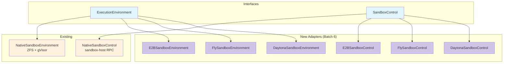

# Cloud Sandbox Providers — Shaping

## Source

> **Context:** The flex-agent-runtime currently has two interfaces for sandbox
> management: `ExecutionEnvironment` (tool-level: execute tools, snapshot,
> rollback, pause/resume) and `SandboxControl` (orchestrator-level: create/destroy
> sandboxes, launch/kill long-running processes, pause/resume). The only
> implementations today are `NativeSandboxControl` and `NativeSandboxEnvironment`,
> which wrap our own sandbox-host service (ZFS + gVisor on EC2). We want to add
> adapters for 3rd party cloud sandbox providers so callers can swap sandbox
> backends without changing agent code.
>
> **Providers to evaluate:** E2B, Daytona, Fly.io Machines, and direct EC2.
>
> **Run modes to assess:**
> - **Tools in Sandbox** — Agent loop runs externally; individual tool calls are
>   dispatched to the sandbox for execution.
> - **Agent in Sandbox** — The agent loop itself runs inside the sandbox as a
>   long-running process, accessible via RPC.
> - **All in Sandbox** — Everything (orchestrator + agent loop + tools) runs in
>   one sandbox. Requires the same capabilities as Agent in Sandbox plus
>   orchestrator-level functionality.

---

## Problem

The native sandbox backend (ZFS + gVisor on EC2) provides the strongest
capability set (instant snapshots, rollback, pause/resume, two-tier execution)
but requires us to operate our own infrastructure: EC2 instances, ZFS pools,
gVisor, and the sandbox-host service. Many users and deployment scenarios would
benefit from delegating sandbox infrastructure to a managed 3rd party provider
at the cost of reduced capabilities. We need to understand which providers can
implement which parts of our interfaces, and where the gaps are.

## Outcome

A clear capability mapping of four cloud sandbox providers (E2B, Daytona,
Fly.io Machines, EC2 Direct) against our `ExecutionEnvironment` and
`SandboxControl` interfaces, with an assessment of which run modes are feasible
for each provider, what trade-offs each introduces, and a recommendation for
implementation priority.

---

## Requirements (R)

These requirements are derived directly from the `ExecutionEnvironment` and
`SandboxControl` interfaces, plus the run-mode requirements.

| ID | Requirement | Source | Category |
|----|-------------|--------|----------|
| R0 | **Create/Destroy sandbox** — Provision an isolated environment and tear it down, releasing all resources. | `SandboxControl.CreateSandbox/DestroySandbox`, `ExecutionEnvironment.Create/Destroy` | Core |
| R1 | **Execute commands (tool calls)** — Run arbitrary shell commands or tool-specific logic inside the sandbox and return results. | `ExecutionEnvironment.ExecuteTool` | Core |
| R2 | **Streaming command output** — Stream stdout/stderr progress back to the caller during tool execution. | `ExecutionEnvironment.ExecuteTool(onProgress)`, `ToolProgress` | Core |
| R3 | **Filesystem persistence between tool calls** — Files written by one tool call must be visible to subsequent tool calls within the same session. | Implicit in `ExecutionEnvironment` session model | Core |
| R4 | **Snapshot/rollback** — Create named point-in-time filesystem snapshots and restore to any previous snapshot. | `ExecutionEnvironment.CreateSnapshot/Rollback`, `SandboxCapabilities.Snapshots/Rollback` | Must-have |
| R5 | **Pause/Resume with state preservation** — Pause the sandbox to zero compute cost and resume later with filesystem (and ideally process) state intact. | `ExecutionEnvironment.Pause/Resume`, `SandboxControl.PauseSandbox/ResumeSandbox` | Must-have |
| R6 | **Launch long-running process** — Start a persistent process inside the sandbox (e.g., an agent loop binary) and get connectivity info. | `SandboxControl.LaunchProcess/KillProcess/GetProcessStatus` | Must-have (Agent in Sandbox) |
| R7 | **Expose ports (for RPC)** — Make a port inside the sandbox reachable from outside so the orchestrator can communicate with a launched process. | `LaunchProcessResponse.Address` | Must-have (Agent in Sandbox) |
| R8 | **Network access (for LLM API calls)** — The sandbox must have outbound internet access so a process inside can call LLM provider APIs. | Implicit for Agent in Sandbox mode | Must-have (Agent in Sandbox) |
| R9 | **Resource limits (CPU/memory)** — Specify CPU and memory for the sandbox or per tool call. | `CreateSandboxRequest.Resources`, `ToolRequest.Resources` | Must-have |
| R10 | **Max lifetime sufficient for agent sessions** — Sandbox must stay alive long enough for a full agent session (hours to days). | `SandboxCapabilities.MaxSandboxDuration` | Must-have |
| R11 | **Cold start < 5s** — Sandbox creation must be fast enough that it doesn't dominate tool call latency. | Operational | Should-have |
| R12 | **Cost-efficient at scale** — Billing model should not penalize idle time during LLM thinking (pay-per-second or pause support). | Operational | Should-have |

---

## Shapes

### Shape A: E2B

[E2B](https://e2b.dev) provides cloud sandboxes built on Firecracker microVMs
with a purpose-built API for AI agent tool execution.

| Part | Mechanism | Notes |
|------|-----------|:-----:|
| **A1: Create/Destroy** | `Sandbox.create()` / `sandbox.kill()`. REST API for lifecycle, gRPC for real-time ops. Sandboxes spin up in ~80-200ms. | |
| **A2: Execute commands** | `sandbox.commands.run(cmd)` — runs a shell command and returns stdout/stderr/exit code. Also supports `sandbox.commands.start()` for background commands. | |
| **A3: Streaming output** | `on_stdout` / `on_stderr` callbacks on `commands.run()`. Real-time streaming via gRPC. | |
| **A4: Filesystem persistence** | Full persistent filesystem within a sandbox session. Files survive across multiple `commands.run()` calls. | |
| **A5: Snapshots** | `sandbox.snapshot()` captures full VM state (filesystem + memory + running processes). New sandbox can be spawned from snapshot via `Sandbox.create(snapshot=id)`. | |
| **A6: Rollback** | Spawn a new sandbox from a prior snapshot. Not in-place rollback on the same sandbox — requires creating a new sandbox from the snapshot. Rollback = destroy current + create from snapshot. | ~200ms |
| **A7: Pause/Resume** | `sandbox.pause()` / `Sandbox.resume(sandbox_id)`. Full state preservation: filesystem, running processes, loaded variables, memory. Paused sandboxes consume no compute. | |
| **A8: Long-running process** | `sandbox.commands.start()` for background processes. Sandbox stays alive up to 24h (Pro). Can run an agent loop binary as a background process. | |
| **A9: Expose ports** | `sandbox.getHost(port)` returns a publicly accessible URL for any port. Configurable `allowPublicTraffic`. | |
| **A10: Network access** | Outbound internet enabled by default (`allowInternetAccess`). Domain-based filtering available for HTTP/TLS. | |
| **A11: Resource limits** | 1-8 vCPUs, 512 MiB - 8 GiB RAM. Configurable per sandbox. | |
| **A12: Max lifetime** | 24 hours (Pro), 1 hour (Hobby). | |
| **A13: Cold start** | ~80-200ms depending on region proximity and template complexity. | |
| **A14: Cost** | $0.05/hr per vCPU. Memory at $0.0000045/GiB/s. Per-second billing. Paused sandboxes at zero compute cost. | |

**Run mode assessment:**

- **Tools in Sandbox:** Excellent fit. `commands.run()` maps directly to `ExecuteTool`. Filesystem persists between calls. Snapshots available (via new sandbox spawn). Pause/resume with full state.
- **Agent in Sandbox:** Feasible. Launch agent binary via `commands.start()`, expose RPC port via `getHost()`, outbound internet for LLM calls. 24h max lifetime is a constraint for very long sessions.
- **All in Sandbox:** Feasible with same 24h lifetime constraint.

---

### Shape B: Daytona

[Daytona](https://www.daytona.io) provides secure sandboxes for AI code
execution built on OCI containers with a RESTful API and multi-language SDKs.

| Part | Mechanism | Notes |
|------|-----------|:-----:|
| **B1: Create/Destroy** | `daytona.create()` / `sandbox.delete()`. REST API. Sandboxes built from OCI images. Creation in ~27-90ms. | |
| **B2: Execute commands** | `sandbox.process.exec(cmd)` — run shell commands. Also supports `sandbox.process.code_run()` for language-specific execution (Python, JS, etc.). | |
| **B3: Streaming output** | `onStdout` / `onStderr` callbacks. Real-time streaming supported. | |
| **B4: Filesystem persistence** | Full persistent filesystem within a session. Files survive across commands. Sandbox daemon (Toolbox API) manages filesystem ops. | |
| **B5: Snapshots** | Snapshots capture configured environment (OCI image-level). Checkpoint feature (point-in-time filesystem rollback) exists but is newer — captures filesystem state, CPU/memory/disk config, env vars, volumes, network settings. | |
| **B6: Rollback** | Checkpoint restore reverts filesystem to a saved state. Available via API/SDK. Creates a new sandbox from the checkpoint entity. | |
| **B7: Pause/Resume** | Auto-stop after 15 min inactivity (configurable, can disable). **Stop clears memory state** — only filesystem is preserved. Running processes are NOT restored on resume. This is a lossy pause. | **Lossy** |
| **B8: Long-running process** | Background process sessions via `sandbox.process.createSession()`. Auto-stop timer may kill sandbox even while processes run (inactivity = no new SDK events, not process activity). Must disable auto-stop or keep heartbeating. | |
| **B9: Expose ports** | Sandboxes expose ports. Per-sandbox firewall rules configurable. | |
| **B10: Network access** | Full network stack per sandbox. Configurable egress firewall (allow/deny destinations). | |
| **B11: Resource limits** | Default 1 vCPU / 1 GiB / 3 GiB disk. Max per sandbox: 4 vCPUs / 8 GiB RAM / 10 GiB disk (contact support for higher). | |
| **B12: Max lifetime** | No hard max if auto-stop is disabled. Auto-archive after 7 days stopped. Auto-delete configurable. | |
| **B13: Cold start** | ~27-90ms. | |
| **B14: Cost** | $0.067/hr for 1 vCPU / 1 GiB. Per-second billing. $200 free credits. | |

**Run mode assessment:**

- **Tools in Sandbox:** Good fit for basic use. Command execution and filesystem persistence work well. Checkpoints provide rollback. Main gap: pause/resume is lossy (memory state not preserved, processes killed). Must treat pause as "stop and restart from filesystem."
- **Agent in Sandbox:** Feasible but requires care. Must disable auto-stop. Agent process must handle being killed on stop and restarting from persisted state. Port exposure and network access work.
- **All in Sandbox:** Same caveats as Agent in Sandbox.

---

### Shape C: Fly.io Machines

[Fly.io Machines](https://fly.io) provides Firecracker microVMs with a REST
API, full VM lifecycle control, suspend/resume, volumes, and global deployment.

| Part | Mechanism | Notes |
|------|-----------|:-----:|
| **C1: Create/Destroy** | Machines API `POST /apps/{app}/machines` / `DELETE`. Full Firecracker VM provisioning. | |
| **C2: Execute commands** | No built-in command execution API. Must SSH into the machine (`fly ssh console -C "command"`) or run an agent/daemon inside the VM that accepts commands via a custom protocol. | **No native API** |
| **C3: Streaming output** | No native streaming API for command output. Would need custom implementation over SSH or a daemon protocol. | **No native API** |
| **C4: Filesystem persistence** | Root filesystem persists across Machine stop/start. Fly Volumes provide persistent block storage attached to a single Machine. | |
| **C5: Snapshots** | Volume snapshots: automatic daily snapshots (retained 5 days, configurable up to 60). On-demand snapshots via `fly volumes snapshots create`. New volumes can be created from snapshots. | **Volume-level** |
| **C6: Rollback** | Create a new volume from a snapshot, attach to a new Machine. Not in-place rollback — requires volume recreation and Machine relaunch. Slower than E2B/Daytona. | **Slow** |
| **C7: Pause/Resume** | `suspend` / `start` (resume). Full VM state preservation via Firecracker snapshots (CPU registers, memory, open file handles). Resume in ~hundreds of ms. Suspended machines billed only for root filesystem storage ($0.15/GB/month). | **Full state** |
| **C8: Long-running process** | The Machine IS the long-running process. Run any binary as the Machine's entrypoint. Full VM lifecycle control. | |
| **C9: Expose ports** | Full port exposure via Fly proxy. Anycast routing. Configurable services in machine config. | |
| **C10: Network access** | Full outbound internet. Private networking between Machines via WireGuard. | |
| **C11: Resource limits** | Flexible CPU/RAM presets from shared-cpu-1x/256MB to performance-16x/128GB. Custom specs via API. | |
| **C12: Max lifetime** | No hard max. Machines run indefinitely until stopped or destroyed. | |
| **C13: Cold start** | Cold boot: ~1-3s for typical apps. Resume from suspend: ~hundreds of ms. | |
| **C14: Cost** | Per-second billing. Shared-cpu-1x/256MB at ~$0.0027/hr. Performance VMs higher. Suspended machines at storage-only cost. Volume pricing separate. | |

**Run mode assessment:**

- **Tools in Sandbox:** Requires significant custom work. No native command execution API — must build a command execution daemon that runs inside the VM and accepts tool calls via HTTP/gRPC. Filesystem persistence and suspend/resume are excellent. Snapshots are volume-level (slow rollback, minutes not milliseconds).
- **Agent in Sandbox:** Excellent fit. Run the agent binary as the Machine's process. Full port exposure, outbound internet, suspend/resume with complete state preservation. No lifetime limits. Most flexible option.
- **All in Sandbox:** Excellent fit. Full VM with no restrictions.

---

### Shape D: EC2 Direct

[AWS EC2](https://aws.amazon.com/ec2/) instances used directly as sandboxes,
with EBS for storage, EBS snapshots for point-in-time capture, and SSM or SSH
for command execution.

| Part | Mechanism | Notes |
|------|-----------|:-----:|
| **D1: Create/Destroy** | `RunInstances` / `TerminateInstances` API. Full instance lifecycle. Launch from AMI or EBS snapshot. | |
| **D2: Execute commands** | AWS Systems Manager `SendCommand` with `AWS-RunShellScript`. Alternatively, SSH. No SDK-level command execution — must poll for results via `ListCommandInvocations`. | **Polling-based** |
| **D3: Streaming output** | SSM does not provide real-time streaming. Must poll `GetCommandInvocation` for output after completion. SSH can stream but requires managing connections. | **No native streaming** |
| **D4: Filesystem persistence** | EBS volumes persist across instance stop/start. Instance store volumes do not survive stop. | |
| **D5: Snapshots** | EBS snapshots via `CreateSnapshot`. Incremental, stored in S3. Creation takes seconds to minutes depending on volume size and change delta. Lazy-loading on restore causes I/O latency (solvable with Fast Snapshot Restore at extra cost). | **Slow (seconds-minutes)** |
| **D6: Rollback** | Create new EBS volume from snapshot, detach old, attach new, or launch new instance from snapshot. Not in-place. Multi-step process taking 30s-minutes. | **Slow** |
| **D7: Pause/Resume** | `StopInstances` / `StartInstances`. EBS-backed instances preserve EBS volumes. Memory state is NOT preserved. Running processes are killed. Restart takes 10-90s depending on instance type and AMI. | **Lossy, slow** |
| **D8: Long-running process** | Run any process on the instance. Full OS control. | |
| **D9: Expose ports** | Security groups control inbound/outbound. Elastic IPs or instance public IPs. Full port control. | |
| **D10: Network access** | Full outbound by default (configurable via security groups and NACLs). VPC networking. | |
| **D11: Resource limits** | Fixed per instance type at launch. Cannot resize without stop/start and instance type change. Hundreds of instance types from t3.nano (2 vCPU/0.5GB) to metal instances. | **Fixed at launch** |
| **D12: Max lifetime** | No limit. Instances run until terminated. | |
| **D13: Cold start** | New instance launch: 10-90s. Restart stopped instance: 10-30s. | **Slow** |
| **D14: Cost** | Per-second billing (Linux). t3.medium ~$0.042/hr. m6i.xlarge ~$0.192/hr. Stopped instances: EBS storage cost only ($0.08/GB/month gp3). | |

**Run mode assessment:**

- **Tools in Sandbox:** Poor fit for per-tool-call dispatch due to slow cold start. Only viable if the instance stays running for the entire session (no per-call spin-up). SSM command execution is polling-based with no streaming. Would need a custom daemon for real-time tool execution.
- **Agent in Sandbox:** Good fit if the instance stays running. Run agent binary directly. Full OS control. Slow pause/resume (10-30s restart, no memory preservation). Cost-inefficient during LLM thinking time if instance stays running.
- **All in Sandbox:** Same as Agent in Sandbox.

---

## Capability Comparison Table

| Capability | A: E2B | B: Daytona | C: Fly.io | D: EC2 Direct |
|------------|--------|------------|-----------|----------------|
| **Create/Destroy** | Native API, ~80-200ms | Native API, ~27-90ms | Native API, ~1-3s | AWS API, ~10-90s |
| **Execute commands** | `commands.run()` | `process.exec()` | SSH or custom daemon | SSM RunCommand or SSH |
| **Streaming output** | gRPC callbacks | SDK callbacks | Custom only | No native streaming |
| **FS persistence** | Full (within session) | Full (within session) | Root FS + Volumes | EBS volumes |
| **Snapshot** | Full VM state (fs+memory+procs) | Checkpoints (fs + config) | Volume snapshots (daily auto, on-demand) | EBS snapshots (seconds-minutes) |
| **Rollback** | New sandbox from snapshot (~200ms) | Checkpoint restore | New volume from snapshot (minutes) | New volume from snapshot (minutes) |
| **Pause/Resume** | Full state preservation | Lossy (filesystem only) | Full state (Firecracker snapshot) | Lossy (filesystem only), 10-30s restart |
| **Long-running process** | Background commands, 24h max | Background sessions, auto-stop risk | Machine IS the process, no limit | Full OS, no limit |
| **Expose ports** | `getHost(port)`, public URL | Per-sandbox firewall | Fly proxy, anycast | Security groups, EIPs |
| **Network access** | Outbound by default | Full stack, firewall configurable | Full outbound, WireGuard | Full, VPC configurable |
| **Resource limits** | 1-8 vCPU, 512M-8G RAM | 1-4 vCPU, 1-8G RAM, 3-10G disk | Flexible presets, up to 16x/128G | Fixed per instance type |
| **Max lifetime** | 24h (Pro) | No hard max | No limit | No limit |
| **Cold start** | 80-200ms | 27-90ms | 1-3s (cold), ~hundreds ms (resume) | 10-90s |
| **Cost model** | $0.05/hr/vCPU, per-second | $0.067/hr (1vCPU/1G), per-second | Per-second, presets | Per-second, instance type |
| **Tools in Sandbox** | Excellent | Good (lossy pause) | Requires custom daemon | Poor (slow, no streaming) |
| **Agent in Sandbox** | Good (24h limit) | Feasible (auto-stop risk) | Excellent | Good (cost-inefficient) |

---

## Fit Check: R x {A, B, C, D}

| Req | Requirement | A: E2B | B: Daytona | C: Fly.io | D: EC2 |
|-----|-------------|--------|------------|-----------|--------|
| R0 | Create/Destroy sandbox | Yes | Yes | Yes | Yes |
| R1 | Execute commands | Yes (native) | Yes (native) | Partial (SSH/custom) | Partial (SSM/SSH) |
| R2 | Streaming output | Yes (gRPC) | Yes (callbacks) | No (custom needed) | No (polling only) |
| R3 | FS persistence between tool calls | Yes | Yes | Yes | Yes |
| R4 | Snapshot/rollback | Yes (spawn new sandbox) | Yes (checkpoints) | Partial (volume-level, slow) | Partial (EBS, slow) |
| R5 | Pause/Resume with state preservation | Yes (full) | Partial (lossy) | Yes (full) | Partial (lossy, slow) |
| R6 | Launch long-running process | Yes (24h limit) | Yes (auto-stop risk) | Yes (no limit) | Yes (no limit) |
| R7 | Expose ports | Yes | Yes | Yes | Yes |
| R8 | Network access for LLM calls | Yes | Yes | Yes | Yes |
| R9 | Resource limits | Yes (1-8 vCPU) | Yes (1-4 vCPU) | Yes (flexible) | Yes (fixed at launch) |
| R10 | Max lifetime for agent sessions | Partial (24h cap) | Yes | Yes | Yes |
| R11 | Cold start < 5s | Yes (~80-200ms) | Yes (~27-90ms) | Yes (~1-3s) | No (10-90s) |
| R12 | Cost-efficient at scale | Yes (pause = zero cost) | Yes (stop = disk only) | Yes (suspend = storage only) | Partial (stop = EBS only, slow restart) |

### Summary of gaps by provider

**A (E2B):**
- R4 rollback is not in-place; requires destroying current sandbox and spawning new from snapshot (~200ms, acceptable).
- R10 capped at 24h. Sessions longer than 24h would need to snapshot and re-create.

**B (Daytona):**
- R5 pause is lossy. Memory/process state is not preserved. Agent must be designed to reconstruct state from filesystem on resume.
- R9 max 4 vCPU / 8 GiB per sandbox without contacting support.
- Auto-stop timer can kill sandbox even with running processes. Must disable or heartbeat.

**C (Fly.io):**
- R1/R2 no native command execution or streaming API. Must build and deploy a tool execution daemon inside the VM. Highest implementation effort.
- R4 volume snapshots are slow (not instant). Rollback requires new volume creation.

**D (EC2 Direct):**
- R1/R2 SSM is polling-based with no real-time streaming. SSH streaming possible but requires connection management.
- R4 EBS snapshots are slow (seconds to minutes). Rollback is a multi-step process.
- R5 stop/start is lossy and slow (10-30s).
- R11 cold start exceeds 5s for new instances.

---

## Run Mode Feasibility

### Tools in Sandbox

The agent loop runs externally and dispatches individual tool calls to the sandbox.

| Provider | Feasibility | Key trade-offs |
|----------|------------|----------------|
| **A: E2B** | **Excellent** | Best semantic fit. `commands.run()` maps directly to `ExecuteTool`. Snapshots capture full state. Pause/resume preserves everything. Main limitation is 24h max lifetime. |
| **B: Daytona** | **Good** | `process.exec()` works for tool dispatch. Checkpoints provide rollback. Lossy pause means agent must be resilient to process loss on resume. |
| **C: Fly.io** | **Feasible but high effort** | No native command execution. Must deploy a custom tool-execution daemon inside the VM. Once built, filesystem and suspend/resume are excellent. Volume-level snapshots are slow for per-tool-call granularity. |
| **D: EC2** | **Poor** | Too slow for per-tool-call dispatch (cold start 10-90s). Must keep instance running continuously. SSM has no streaming. Would need a custom daemon. Not recommended for this mode. |

### Agent in Sandbox

The agent loop runs inside the sandbox as a long-running process.

| Provider | Feasibility | Key trade-offs |
|----------|------------|----------------|
| **A: E2B** | **Good** | Launch agent via `commands.start()`. Port exposure via `getHost()`. 24h max lifetime requires session checkpointing for longer runs. |
| **B: Daytona** | **Feasible** | Must disable auto-stop. Agent process must handle being killed on sandbox stop. Port exposure and network work. |
| **C: Fly.io** | **Excellent** | The Machine IS the agent process. No lifetime limit. Full suspend/resume with process state. Best fit for long-running agents. |
| **D: EC2** | **Good** | Full OS control. No lifetime limit. But cost-inefficient (instance runs during LLM thinking). Stop/start is slow and lossy. |

### All in Sandbox

Everything runs in one sandbox (orchestrator + agent loop + tools).

Same assessment as Agent in Sandbox for each provider, since the additional
orchestrator requirements (launching sub-processes, managing state) are
subsumed by full OS/VM access that all providers offer.

---

## Implementation Priority Recommendation

1. **E2B (Shape A)** — Implement first. Best semantic fit for Tools in Sandbox
   mode, which is the primary use case. Native command execution API with
   streaming maps cleanly to `ExecuteTool`. Snapshot and pause/resume align with
   our interface semantics. Lowest implementation effort. The 24h lifetime cap
   is manageable by snapshotting and re-creating for longer sessions.

2. **Fly.io (Shape C)** — Implement second. Best fit for Agent in Sandbox mode.
   Full VM control with no lifetime limits and true suspend/resume. Requires
   building a tool-execution daemon (significant effort), but this daemon could
   be reused across Fly.io and EC2 shapes. Volume-level snapshots are coarser
   than ideal but functional.

3. **Daytona (Shape B)** — Implement third. Similar API surface to E2B but with
   lossy pause semantics and tighter resource limits. Good option for users
   who want an alternative to E2B or prefer Daytona's pricing/ecosystem.

4. **EC2 Direct (Shape D)** — Defer or skip. Highest implementation effort, slowest
   lifecycle operations, no native streaming. The native sandbox backend
   (ZFS + gVisor on EC2) already covers this infrastructure better. EC2 Direct
   only makes sense for users who want maximum control and cannot use any
   managed provider, which is a niche case.

---

## Adapter Architecture Sketch

Each provider adapter implements both `ExecutionEnvironment` and
`SandboxControl`. The adapter translates our interface methods to
provider-specific API calls.

### Key adapter design considerations

1. **Rollback semantics differ by provider.** E2B and Daytona rollback by
   creating a new sandbox from a snapshot/checkpoint. This means the adapter's
   `Rollback()` method must transparently destroy the current sandbox and
   create a new one, updating internal state (session ID, connection) without
   the caller knowing. This is a significant difference from the native backend
   where `zfs rollback` is in-place.

2. **Pause semantics differ by provider.** For Daytona (lossy pause), the
   adapter should document that `Pause()` preserves filesystem only. Callers
   using `Capabilities()` can check `Pause: true` but should also check a new
   `PausePreservesProcesses` capability flag to know whether memory/process
   state survives.

3. **Fly.io needs a tool-execution daemon.** The adapter cannot implement
   `ExecuteTool` without a companion binary that runs inside the Machine and
   accepts tool call requests. This daemon should be a small standalone binary
   built from this repo that implements a simple HTTP/gRPC server accepting
   `ToolRequest` and returning `ToolResponse` with streaming `ToolProgress`.

4. **Capability reporting.** Each adapter's `Capabilities()` method must
   accurately report what it supports. For example, E2B would return
   `Snapshots: true, Rollback: true, Pause: true, MaxSessionDuration: 24h`.
   Fly.io would return `Snapshots: true` (volume-level) but could introduce
   a `SnapshotGranularity` field to distinguish volume-level from filesystem-
   level snapshots.

---

## Open Questions

### OQ1: E2B 24h lifetime management

For agent sessions that run longer than 24 hours, the E2B adapter would need to
snapshot and re-create the sandbox before the 24h limit. Should this be handled
transparently inside the adapter (auto-rotate), or should the caller be
responsible for monitoring `MaxSessionDuration` and managing rotation?

### OQ2: Fly.io tool-execution daemon

The daemon running inside Fly.io Machines needs to implement the tool execution
logic. Should this be a generic "remote tool executor" binary that could also be
used for EC2 Direct? Or should it be Fly.io-specific? A generic approach would
reduce duplication but may add complexity.

### OQ3: Capability system extension

The current `Capabilities` struct may need new fields to express the nuances
discovered here: `PausePreservesProcesses`, `SnapshotGranularity` (instant vs
volume-level vs EBS), `RollbackInPlace` (in-place vs destroy+recreate),
`NativeCommandExecution` (native API vs SSH/custom daemon). How much detail
should the capability system expose vs leaving it to documentation?

### OQ4: Daytona auto-stop interaction

When using Daytona for Agent in Sandbox mode, the auto-stop timer fires based on
SDK event inactivity, not process activity. The adapter would need to either
disable auto-stop on sandbox creation or implement a heartbeat mechanism. Which
approach is preferred?

### OQ5: Cost modeling for Tools in Sandbox

In Tools in Sandbox mode, should the sandbox stay alive for the entire agent
session (paying per-second even during LLM thinking), or should it be
paused/resumed between tool calls? E2B and Fly.io support fast enough
pause/resume that inter-call pausing could save significant cost at scale,
but adds latency to each tool call.

---

## Research Sources

- [E2B Documentation](https://e2b.dev/docs)
- [E2B Sandbox Persistence](https://e2b.dev/docs/sandbox/persistence)
- [E2B Sandbox Snapshots](https://e2b.dev/docs/sandbox/snapshots)
- [E2B Pricing](https://e2b.dev/pricing)
- [E2B SDK Reference](https://e2b.dev/docs/sdk-reference/python-sdk/v2.2.4/sandbox_async)
- [E2B Sandbox Internet Access](https://e2b.dev/docs/sandbox/internet-access)
- [E2B Customize CPU & RAM](https://e2b.dev/docs/sandbox-template/customize-cpu-ram)
- [Daytona Documentation](https://www.daytona.io/docs/en/)
- [Daytona Sandboxes](https://www.daytona.io/docs/en/sandboxes/)
- [Daytona Process and Code Execution](https://www.daytona.io/docs/en/process-code-execution/)
- [Daytona Snapshots](https://www.daytona.io/docs/en/snapshots/)
- [Daytona Sandbox Management](https://www.daytona.io/docs/en/sandbox-management/)
- [Daytona Limits](https://www.daytona.io/docs/en/limits/)
- [Daytona Architecture](https://www.daytona.io/docs/en/architecture/)
- [Daytona Checkpoint Rollback Issue #2528](https://github.com/daytonaio/daytona/issues/2528)
- [Fly.io Machine Suspend and Resume](https://fly.io/docs/reference/suspend-resume/)
- [Fly.io Machines API](https://fly.io/docs/machines/api/machines-resource/)
- [Fly.io Machines Overview](https://fly.io/docs/machines/overview/)
- [Fly.io Volume Snapshots](https://fly.io/docs/volumes/snapshots/)
- [Fly.io Resource Pricing](https://fly.io/docs/about/pricing/)
- [Fly.io SSH](https://fly.io/docs/flyctl/ssh/)
- [AWS EC2 Pricing](https://aws.amazon.com/ec2/pricing/on-demand/)
- [AWS SSM RunCommand](https://docs.aws.amazon.com/systems-manager/latest/userguide/run-command.html)
- [AWS EBS Snapshots](https://docs.aws.amazon.com/ebs/latest/userguide/ebs-snapshot-lifecycle.html)
- [AWS EBS Fast Snapshot Restore](https://docs.aws.amazon.com/ebs/latest/userguide/ebs-fast-snapshot-restore.html)
- [AI Code Sandbox Benchmark 2026](https://www.superagent.sh/blog/ai-code-sandbox-benchmark-2026)
- [AI Sandbox Comparison 2026](https://lifo.sh/blog/ai-sandbox-comparison-2026)
- [Best Sandbox Runners 2026](https://betterstack.com/community/comparisons/best-sandbox-runners/)
