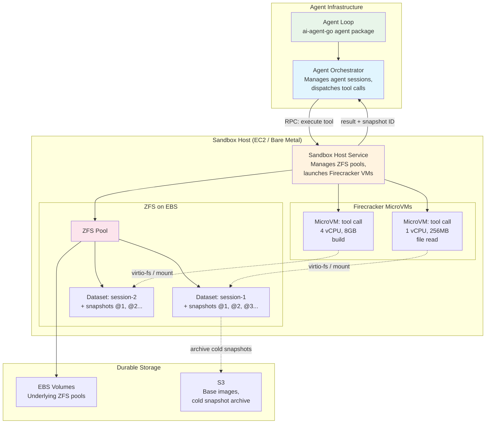
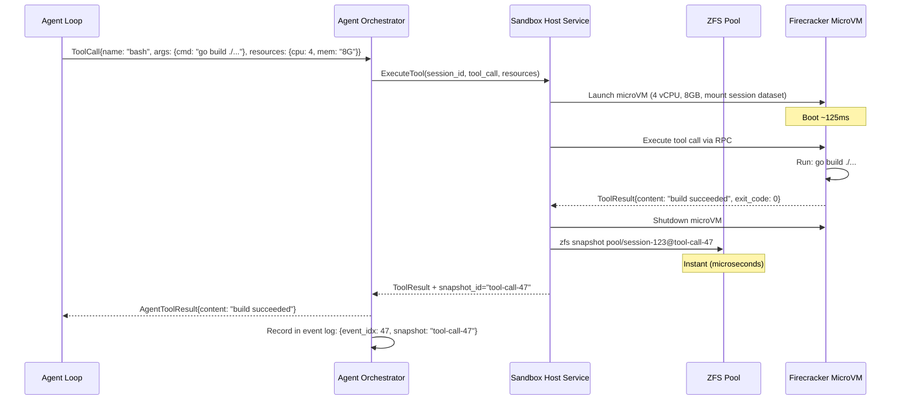
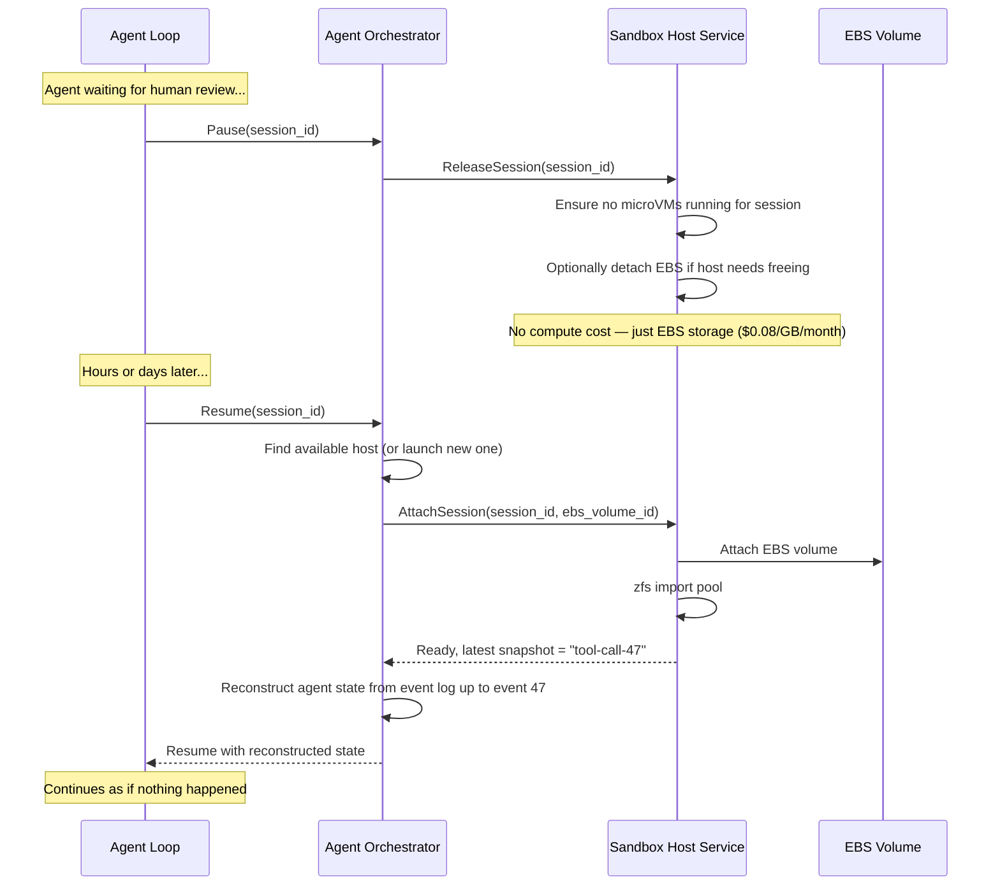

# Cloud Sandbox Runtime — Shaping

## Source

> **Core Concept:** The agent runs on separate infrastructure (Kubernetes or similar), but all tool calls (read, write, bash commands — basically "operating a computer") execute remotely in sandboxed environments.
>
> **Requirements:**
>
> 1. **Remote Execution Environment:** Every tool use runs in a remote sandbox/VM. Even simple file reads/writes go through a sandbox (minimal resources), since the filesystem is remote and not locally accessible to the agent process.
>
> 2. **Snapshotable Filesystem:**
>    - Specify an initial snapshot (e.g., with code already checked out)
>    - After every command/tool use, generate a new filesystem snapshot
>    - Full incremental change history at the filesystem level alongside the agent's operation log
>    - Ability to roll back to any earlier state — both the agent's session/context AND the filesystem in sync
>
> 3. **Pause/Resume (Durable Execution):**
>    - Agents can pause (waiting for user input, review, etc.)
>    - When paused, the sandbox spins down — no active resources consumed
>    - Could be paused for hours or days
>    - On resume, launch a new sandbox from the last snapshot, continue as if nothing happened
>    - Fully durable execution pattern
>
> 4. **Dynamic Resource Sizing:**
>    - Specify amount of resources needed per sandbox
>    - Heavyweight builds → bigger box
>    - Simple file reads/writes/greps → minimal sandbox
>    - Default should be very lightweight for basic file operations
>
> 5. **Filesystem Durability:**
>    - The filesystem the agent edits must be durable and persistent across pause/resume cycles
>    - Snapshots must be stored durably
>
> **User's Initial Solution Idea:**
> - **Filesystem layer:** ZFS on EBS in AWS (ZFS provides cheap, fast snapshots; EBS provides durability)
> - **Execution environment:** AWS Fargate containers (serverless, scale to zero when paused, variable resource allocation)

---

## Problem

AI coding agents need to execute tool calls (file reads/writes, shell commands, builds) against real filesystems, but running these directly on the agent's host infrastructure creates several problems:

1. **No isolation** — tool execution shares the agent's process space; a bad command can take down the agent or leak across sessions.
2. **No state history** — filesystem changes are destructive; there's no way to see what changed between tool calls or roll back to an earlier state.
3. **Wasted resources** — agents spend most of their time waiting for LLM responses, but their sandbox sits idle consuming compute and memory the entire time. Agents may pause for hours or days waiting for human review.
4. **One-size-fits-all compute** — a file read needs minimal resources; a large build needs significant CPU/memory. Fixed-size VMs waste money on simple operations and are too small for heavy ones.

## Outcome

A system where:
- Every agent tool call executes in an isolated, resource-appropriate sandbox
- The entire filesystem history is captured as a sequence of snapshots, correlated with the agent's operation log
- Agents can pause and resume across hours or days with zero idle resource cost
- Rolling back an agent's state also rolls back its filesystem, keeping the two in sync
- The system integrates cleanly with the `ai-agent-go` agent framework (V2 layer on top of `ai` and `agent` packages)

---

## Requirements (R)

| ID | Requirement | Status |
|----|-------------|--------|
| R0 | Tool calls execute in isolated sandboxes, not on the agent host | Core goal |
| R1 | Every tool call produces a filesystem snapshot; full incremental history is maintained | Core goal |
| R2 | Agent can pause (spin down sandbox, zero compute cost) and resume from last snapshot | Core goal |
| R3 | Sandbox resources are dynamically sized per tool call (lightweight default, heavyweight on demand) | Must-have |
| R4 | Filesystem and snapshots are durably persisted (survive sandbox termination, host failure) | Must-have |
| R5 | Rollback: restore both agent session state and filesystem to any prior snapshot in sync | Must-have |
| R6 | Sandbox can be initialized from a pre-built snapshot (e.g., repo already checked out, deps installed) | Must-have |
| R7 | Snapshot overhead is low enough that per-tool-call snapshots don't meaningfully slow execution | Must-have |
| R8 | Integrates with `ai-agent-go` agent framework: tool calls dispatched through `AgentTool` interface, events via `Subscribe()` | Must-have |
| R9 | Multi-tenancy: multiple agents can run sandboxes concurrently without interference | Must-have |

---

## Shapes

### A: ZFS-on-EBS + Fargate

The user's initial proposal. ZFS provides the snapshotable filesystem layer, EBS provides durability, and Fargate provides serverless container execution with variable resource sizing.

| Part | Mechanism | Flag |
|------|-----------|:----:|
| **A1** | **Durable filesystem:** ZFS pool on AWS EBS volume(s). EBS provides persistence; ZFS provides instant copy-on-write snapshots. | |
| **A2** | **Execution environment:** AWS Fargate tasks. Each tool call (or batch of tool calls) launches a Fargate task with the ZFS volume attached. Task size (CPU/memory) specified per invocation. | ⚠️ |
| **A3** | **Snapshot lifecycle:** After each tool call completes, `zfs snapshot` is taken. Snapshots are named with monotonic sequence IDs correlated to agent event log entries. | |
| **A4** | **Pause/resume:** On pause, Fargate task stops — no compute cost. EBS volume persists. On resume, new Fargate task launched, EBS re-attached, ZFS pool imported, agent continues from last snapshot. | |
| **A5** | **Rollback:** `zfs rollback` to any named snapshot. Agent session state is reconstructed from event log up to the corresponding event index. | |
| **A6** | **Initial snapshot:** Base snapshots pre-built (e.g., via a "workspace provisioner" that clones a repo, installs deps, takes a ZFS snapshot). New agent sessions `zfs clone` from the base snapshot. | |
| **A7** | **Agent integration:** A `SandboxToolExecutor` wraps each `AgentTool`. Instead of executing locally, it dispatches the tool call to the Fargate sandbox via RPC, waits for result + snapshot confirmation, then returns. | |

**A2 flag note:** Fargate does not natively support EBS volume attachment. Fargate tasks use ephemeral storage (up to 200GB) or EFS. Attaching an EBS volume to a Fargate task would require a sidecar or custom orchestration layer — this is a significant architectural gap.

---

### B: ZFS-on-EBS + EC2 with Start/Stop

Same ZFS-on-EBS filesystem layer, but using EC2 instances instead of Fargate. EC2 natively supports EBS attachment and can be stopped (zero compute cost, EBS persists) and restarted.

| Part | Mechanism | Flag |
|------|-----------|:----:|
| **B1** | **Durable filesystem:** ZFS pool on AWS EBS volume(s). Same as A1. | |
| **B2** | **Execution environment:** EC2 instances. A pool of instances (or on-demand launch) with ZFS-capable AMI. EBS volumes attached/detached as needed. | |
| **B3** | **Snapshot lifecycle:** Same as A3 — `zfs snapshot` after each tool call. | |
| **B4** | **Pause/resume:** EC2 instance stopped (no compute cost, EBS persists). On resume, instance started (or new instance launched + EBS re-attached). ZFS pool imported, agent continues. | |
| **B5** | **Rollback:** Same as A5 — `zfs rollback` + event log replay. | |
| **B6** | **Initial snapshot:** Same as A6 — base snapshots, `zfs clone`. | |
| **B7** | **Agent integration:** Same as A7 — `SandboxToolExecutor` dispatches via RPC to EC2 instance. | |
| **B8** | **Dynamic sizing:** Use different EC2 instance types (or a fleet of pre-warmed instances at different sizes). Tool calls declare resource needs; orchestrator routes to appropriately-sized instance. | ⚠️ |

**B8 flag note:** Dynamic EC2 instance type selection adds complexity. Options: (a) maintain a fleet with different sizes and route, (b) launch on-demand (slow cold start), (c) use a single generous size for all (wastes resources for simple operations). Needs further investigation.

---

### C: Firecracker microVMs + Overlay Snapshots

Use Firecracker microVMs (as used by AWS Lambda and Fly.io) for fast-launching, lightweight isolation. Filesystem snapshots via Firecracker's built-in VM snapshotting or overlay filesystem approach.

| Part | Mechanism | Flag |
|------|-----------|:----:|
| **C1** | **Durable filesystem:** Overlay filesystem (OverlayFS or device-mapper thin provisioning) on top of a base image stored in durable block storage (EBS or similar). Each tool call writes to a new overlay layer. | |
| **C2** | **Execution environment:** Firecracker microVMs. Sub-second boot times (~125ms). Each tool call gets its own microVM (or reuses one within a session). CPU/memory configurable per VM. | |
| **C3** | **Snapshot lifecycle:** After each tool call, the overlay diff is persisted as a snapshot layer. Snapshots are additive — each references its parent. Full filesystem at any point = base + overlay stack. | |
| **C4** | **Pause/resume:** Firecracker supports VM snapshots (full memory + disk state). On pause, VM snapshot is taken and stored durably. VM terminated — zero cost. On resume, VM restored from snapshot in ~ms. | ⚠️ |
| **C5** | **Rollback:** Discard overlay layers after the target point. Re-launch VM from the snapshot at the target point. | |
| **C6** | **Initial snapshot:** Base VM images pre-built with repo, deps, toolchain. Stored as rootfs images. New sessions layer on top. | |
| **C7** | **Agent integration:** Same pattern — `SandboxToolExecutor` dispatches to microVM via vsock or TCP. | |
| **C8** | **Dynamic sizing:** Firecracker allows specifying vCPUs and memory per microVM at creation time. Trivially supports per-tool-call resource sizing. | |

**C4 flag note:** Firecracker VM snapshots capture full memory state, which is powerful but may be large (hundreds of MB per snapshot). For pause/resume spanning hours/days, the cost of storing these snapshots and the time to restore them needs investigation. An alternative: don't snapshot VM state at all — just persist the filesystem overlay, and on resume, boot a fresh VM with the filesystem at the right point. This is simpler and sufficient since the agent's session state lives in the agent framework (event log), not in VM memory.

---

### D: Kubernetes Pods + Persistent Volume Snapshots

Use Kubernetes (EKS or similar) as the orchestration layer. Pods for execution, PersistentVolumeClaims for storage, VolumeSnapshots for filesystem history.

| Part | Mechanism | Flag |
|------|-----------|:----:|
| **D1** | **Durable filesystem:** Kubernetes PersistentVolume (backed by EBS via CSI driver). Mounted into pods. | |
| **D2** | **Execution environment:** Kubernetes Pods. Resource requests/limits set per pod (CPU, memory). Pods created/destroyed per tool call or per session. | |
| **D3** | **Snapshot lifecycle:** Kubernetes VolumeSnapshot API after each tool call. EBS CSI driver creates EBS snapshots. | ⚠️ |
| **D4** | **Pause/resume:** Delete pod (zero compute). PV retained. On resume, create new pod, mount same PV. | |
| **D5** | **Rollback:** Create new PV from a VolumeSnapshot, mount into new pod. | |
| **D6** | **Initial snapshot:** Base VolumeSnapshots pre-created. New sessions create PVs from base snapshot. | |
| **D7** | **Agent integration:** Same pattern — `SandboxToolExecutor` dispatches to pod via service/exec API. | |
| **D8** | **Dynamic sizing:** Pod resource requests/limits set per invocation. Kubernetes scheduler handles placement. | |

**D3 flag note:** EBS snapshots are NOT suitable for per-tool-call frequency. EBS snapshots are eventual (take seconds to minutes to create), are charged per GB-month of storage, and have API rate limits. A single agent session could generate hundreds of tool calls — that's hundreds of EBS snapshots, which is operationally untenable. This is a fundamental mismatch between the snapshot frequency requirement and EBS snapshot capabilities.

---

### E: ZFS-on-EBS + Firecracker (Hybrid)

Combines the best of A/B and C: ZFS on EBS for the durable, instantly-snapshotable filesystem, and Firecracker microVMs for fast, lightweight, dynamically-sized execution.

| Part | Mechanism | Flag |
|------|-----------|:----:|
| **E1** | **Durable filesystem:** ZFS pool on EBS volume(s). ZFS provides instant COW snapshots. EBS provides durability across VM lifecycle. | |
| **E2** | **Execution environment:** Firecracker microVMs running on a host (EC2 instance or bare metal). The ZFS pool lives on the host; microVMs access the filesystem via virtio-fs or a shared mount. Each tool call gets a microVM with specified CPU/memory. | |
| **E3** | **Snapshot lifecycle:** After each tool call, `zfs snapshot` on the host. Instant, space-efficient (COW). Named with monotonic IDs correlated to agent event log. | |
| **E4** | **Pause/resume:** MicroVM terminated (or never started — no VM running between tool calls). ZFS pool on EBS persists. On resume: if same host, just launch new microVM. If different host: detach EBS, attach to new host, import ZFS pool, launch microVM. | |
| **E5** | **Rollback:** `zfs rollback` on host. Agent session reconstructed from event log. | |
| **E6** | **Initial snapshot:** Base ZFS snapshots pre-built. New sessions `zfs clone` from base. MicroVM boots in ~125ms with the cloned filesystem. | |
| **E7** | **Agent integration:** `SandboxToolExecutor` runs on the host alongside ZFS. It launches Firecracker microVMs per tool call, passes the tool call in, collects results, takes ZFS snapshot after completion. | |
| **E8** | **Dynamic sizing:** Firecracker vCPU/memory specified per microVM. Lightweight reads get 0.5 vCPU + 128MB. Builds get 4+ vCPUs + 8GB+. | |
| **E9** | **Host management:** A "sandbox host" service runs on EC2 instances (or bare metal). It manages the ZFS pool, launches/destroys Firecracker microVMs, and exposes an RPC API to the agent orchestrator. Multiple agent sessions can share a host (each with its own ZFS dataset). | |

---

## Fit Check

| Req | Requirement | Status | A | B | C | D | E |
|-----|-------------|--------|---|---|---|---|---|
| R0 | Tool calls execute in isolated sandboxes, not on the agent host | Core goal | ✅ | ✅ | ✅ | ✅ | ✅ |
| R1 | Every tool call produces a filesystem snapshot; full incremental history is maintained | Core goal | ✅ | ✅ | ✅ | ❌ | ✅ |
| R2 | Agent can pause (spin down sandbox, zero compute cost) and resume from last snapshot | Core goal | ✅ | ✅ | ✅ | ✅ | ✅ |
| R3 | Sandbox resources are dynamically sized per tool call | Must-have | ❌ | ❌ | ✅ | ✅ | ✅ |
| R4 | Filesystem and snapshots are durably persisted | Must-have | ✅ | ✅ | ✅ | ✅ | ✅ |
| R5 | Rollback: restore agent session state and filesystem to any prior snapshot in sync | Must-have | ✅ | ✅ | ✅ | ❌ | ✅ |
| R6 | Sandbox can be initialized from a pre-built snapshot | Must-have | ✅ | ✅ | ✅ | ✅ | ✅ |
| R7 | Snapshot overhead is low enough for per-tool-call frequency | Must-have | ✅ | ✅ | ✅ | ❌ | ✅ |
| R8 | Integrates with ai-agent-go agent framework | Must-have | ✅ | ✅ | ✅ | ✅ | ✅ |
| R9 | Multi-tenancy: multiple agents run concurrently without interference | Must-have | ✅ | ✅ | ✅ | ✅ | ✅ |

**Notes:**

- **A fails R3:** Fargate task sizes are set at task definition time. Changing resource allocation requires stopping and starting a new task — high latency (~30-60s). Not feasible to change per tool call.
- **B fails R3:** EC2 instance type is fixed at launch. Changing requires stopping, changing instance type, and restarting — minutes of latency. A fleet approach is possible but adds significant complexity (B8 flagged).
- **D fails R1:** EBS snapshots are too slow and expensive for per-tool-call frequency (D3 flagged). You'd get a snapshot every few minutes at best, not per tool call.
- **D fails R5:** Rolling back requires creating a new PV from a snapshot — but since snapshots can't be taken at per-tool-call frequency, rollback granularity is too coarse.
- **D fails R7:** EBS snapshot creation takes seconds to minutes, making per-tool-call snapshots impractical.

---

## Analysis

### Shapes Eliminated

**Shape D (Kubernetes + PV Snapshots)** is eliminated. The fundamental issue is that Kubernetes VolumeSnapshots backed by EBS are too slow and expensive for per-tool-call snapshot frequency. This is not a solvable problem within the Kubernetes storage abstraction — it's a mismatch between the requirement and the infrastructure primitive.

**Shape A (ZFS-on-EBS + Fargate)** has a critical gap: Fargate does not support EBS volume attachment. You'd need to use EFS (NFSv4) instead, but ZFS cannot run on top of EFS. This means either (a) abandoning ZFS and using EFS directly (losing instant snapshots), or (b) using a sidecar architecture where the ZFS host is separate from the Fargate task, adding network latency to every filesystem operation. Neither is clean.

**Shape B (ZFS-on-EBS + EC2)** works but fails on dynamic sizing. The core issue is that EC2 instances have a fixed instance type. You can't cheaply resize per tool call. A fleet of pre-warmed instances at different sizes is operationally complex and expensive.

### Leading Shape

**Shape E (ZFS-on-EBS + Firecracker)** passes all requirements. It combines:

- **ZFS on EBS** for the filesystem layer: instant COW snapshots (microseconds), durable storage (EBS), efficient space usage (only changed blocks stored), fast clone from base images.
- **Firecracker microVMs** for the execution layer: sub-second boot (~125ms), per-VM resource sizing (vCPU and memory set at creation), strong isolation (KVM-based), no idle cost (VM destroyed after tool call completes).
- **Host-based architecture**: A "sandbox host" service on EC2/bare metal manages both the ZFS pool and Firecracker VMs. This co-location is key — ZFS operations happen on the host without network round-trips, and the host can manage multiple agent sessions concurrently.

### Key Properties of Shape E

**Snapshot model:** ZFS snapshots are instant and essentially free. A `zfs snapshot pool/session-123@tool-call-47` completes in microseconds regardless of filesystem size. Storage cost is proportional to data changed between snapshots (COW), not total filesystem size. An agent session with 500 tool calls that each change a few files might only use a few hundred MB of snapshot storage total.

**Pause/resume model:** When an agent pauses, the Firecracker microVM is destroyed (or was never running — it may be destroyed after each tool call). The ZFS dataset and all its snapshots remain on the EBS volume. The EBS volume can optionally be detached from the host and re-attached later (to the same or different host). Resume means: ensure EBS is attached to a host, import the ZFS pool (if needed), launch a fresh Firecracker microVM with the filesystem at the last snapshot point.

**Dynamic sizing model:** Each Firecracker microVM is created with a specific vCPU count and memory allocation. The orchestrator decides sizing based on the tool being called. File reads/writes/greps: 1 vCPU, 256MB. Compilation/builds: 4 vCPUs, 8GB. The microVM boots in ~125ms regardless of size, so the overhead of creating a new VM per tool call is acceptable.

**Isolation model:** Firecracker uses KVM hardware virtualization — stronger isolation than containers. Each tool call runs in its own VM with its own kernel. A malicious command in one tool call cannot affect the host, the ZFS pool, or other sessions.

---

## Open Questions

### OQ1: Firecracker + ZFS Filesystem Sharing

How does the Firecracker microVM access the ZFS filesystem on the host?

Options:
- **virtio-fs:** Shared filesystem protocol between host and guest. Firecracker has experimental virtio-fs support. This would allow the guest to directly read/write files on the ZFS dataset.
- **Block device passthrough:** Expose the ZFS dataset as a block device to the guest. But ZFS datasets are not raw block devices — this doesn't map cleanly.
- **NFS/9p:** Run a lightweight NFS or 9p server on the host, mount in the guest. Adds latency but is well-understood.
- **Pre-mount rootfs:** Use `zfs send` to create a rootfs image from the current snapshot, boot the microVM with that as its root filesystem. After tool call completes, extract changes back to ZFS. Adds overhead but avoids shared filesystem complexity.

This is the most critical technical question and needs a spike.

### OQ2: Host Management and Scheduling

When an agent session needs to run a tool call:
- How does the orchestrator decide which host to use?
- How is EBS attachment managed (can only attach to one host at a time)?
- What happens if a host goes down mid-tool-call?
- How many concurrent sessions can one host serve?

### OQ3: ZFS Snapshot Storage Costs

For a large codebase (e.g., 10GB working directory), how much EBS storage is consumed by:
- 100 snapshots with small changes each (a few files, ~100KB of diffs)?
- 100 snapshots with medium changes (build artifacts, ~100MB of diffs)?
- What's the cost implication vs. just using a large EBS volume?

ZFS's COW behavior means only changed blocks are stored, but the EBS volume itself needs to be large enough for the cumulative data. Need to model this.

### OQ4: Cold Start Latency Budget

End-to-end latency from "agent decides to call a tool" to "tool execution begins in sandbox":
- EBS attachment (if needed): ~10-30 seconds
- ZFS pool import (if needed): ~1-5 seconds
- Firecracker VM boot: ~125ms
- Filesystem mount in VM: ~10ms

For pause/resume across hosts, the EBS attachment dominates. For same-host execution (e.g., consecutive tool calls in an active session), it's sub-second. Is the cross-host latency acceptable for resume after long pauses?

### OQ5: Alternative to Firecracker for Simpler Deployment

Firecracker requires bare-metal or nested-virtualization-capable hosts. It can't run inside a standard EC2 instance (unless `.metal` type or with nested virt enabled on `.bare` types). This limits deployment options and increases cost.

Alternatives for the execution layer that provide dynamic sizing without Firecracker:
- **gVisor (runsc):** Sandbox containers with a user-space kernel. Runs on standard EC2 instances. Less isolation than Firecracker but more than standard containers. Supports cgroups for resource limiting.
- **Kata Containers:** Similar to Firecracker (uses lightweight VMs) but with broader compatibility.
- **Standard containers with cgroups:** Docker/containerd with per-container CPU/memory limits. Weakest isolation but simplest deployment. The ZFS dataset can be bind-mounted into the container.

### OQ6: Cloud Provider Lock-in

Shape E as described is AWS-specific (EBS, EC2). What would it take to run on GCP or Azure?
- ZFS runs on any Linux host — the filesystem layer is portable.
- Firecracker runs on any KVM-capable Linux host — also portable.
- The AWS-specific piece is EBS for durable block storage. GCP has Persistent Disks, Azure has Managed Disks — similar primitives.
- The orchestration layer would need provider-specific adapters for volume management and instance provisioning.

---

## Architecture Sketch (Shape E)



### Sequence: Tool Call Execution



### Sequence: Pause and Resume



---

## Integration with ai-agent-go

The sandbox runtime is a **V2 concern** that layers on top of the V1 `agent` package without modifying it. Here's how it maps:

### SandboxToolExecutor

Each `AgentTool` is wrapped by a `SandboxToolExecutor` that intercepts tool execution and dispatches it to the sandbox:

```go
// Conceptual — this is the V2 integration pattern
type SandboxToolExecutor struct {
    sandboxClient SandboxHostClient
    sessionID     string
    resourcePolicy ResourcePolicy  // maps tool names → resource requirements
}

func (s *SandboxToolExecutor) WrapTool(tool agent.AgentTool) agent.AgentTool {
    originalExecute := tool.Execute
    tool.Execute = func(ctx context.Context, toolCallID string, params map[string]any, onUpdate func(agent.AgentToolResult)) (agent.AgentToolResult, error) {
        resources := s.resourcePolicy.ForTool(tool.Name)
        result, snapshotID, err := s.sandboxClient.ExecuteInSandbox(ctx, ExecuteRequest{
            SessionID:  s.sessionID,
            ToolCallID: toolCallID,
            ToolName:   tool.Name,
            Params:     params,
            Resources:  resources,
        })
        if err != nil {
            return agent.AgentToolResult{}, err
        }
        // Record snapshot correlation
        s.recordSnapshot(toolCallID, snapshotID)
        return result, nil
    }
    return tool
}
```

### Event Log Correlation

The agent's `Subscribe()` mechanism provides the event stream. The orchestrator persists every `AgentEvent` with its index. After each tool execution, the snapshot ID is correlated with the event index:

```
Event Log:                    Snapshot Log:
[0] agent_start               —
[1] turn_start                —
[2] message_start             —
[3] message_update (text)     —
[4] message_end               —
[5] tool_execution_start      —
[6] tool_execution_end        snapshot: tool-call-1
[7] turn_end                  —
[8] turn_start                —
...
```

Rollback to event index 6 means `zfs rollback pool/session@tool-call-1` + reconstruct agent messages from events 0-6.

### Workflow Engine Integration

This integrates naturally with the workflow engine pattern described in `docs/notes/workflow-engine-integration.md`. The workflow engine provides the durable envelope (event persistence, crash recovery), and the sandbox runtime provides the durable filesystem:

```
Workflow Engine (durability of agent state)
    └── Agent Loop (ai-agent-go)
        └── SandboxToolExecutor (dispatches to sandbox)
            └── Sandbox Host Service (ZFS + Firecracker)
```

---

## Next Steps

1. **Resolve OQ1 (Firecracker + ZFS filesystem sharing)** — This is the highest-risk technical question. Spike to determine the best mechanism for guest-to-host filesystem access. If virtio-fs is not viable in Firecracker, the alternatives (NFS, rootfs extract/apply) have significant performance implications.

2. **Resolve OQ5 (Alternative to Firecracker)** — Evaluate whether gVisor or standard containers with cgroups would be sufficient. This significantly affects deployment complexity and cost (no need for bare-metal instances). If container-level isolation is acceptable, Shape E simplifies substantially.

3. **Prototype ZFS snapshot performance** — Validate the assumption that per-tool-call ZFS snapshots are fast enough. Benchmark `zfs snapshot` latency and space consumption under realistic workloads (agent editing a codebase, running builds).

4. **Detail Shape E** — Once OQ1 and OQ5 are resolved, expand Shape E into concrete affordances (breadboard the Sandbox Host Service, Agent Orchestrator, and the RPC protocol between them).

5. **Slice for implementation** — After detailing, slice into vertical implementation increments.
