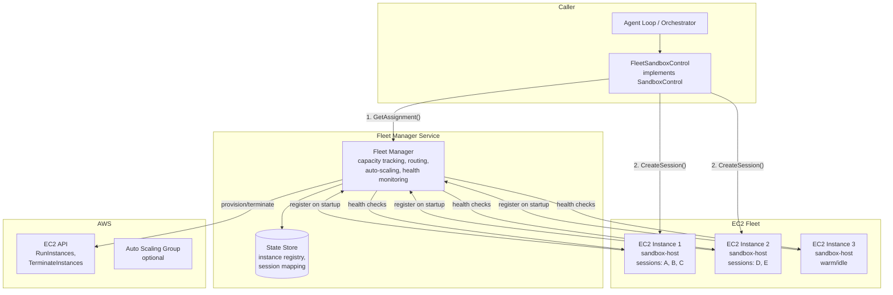
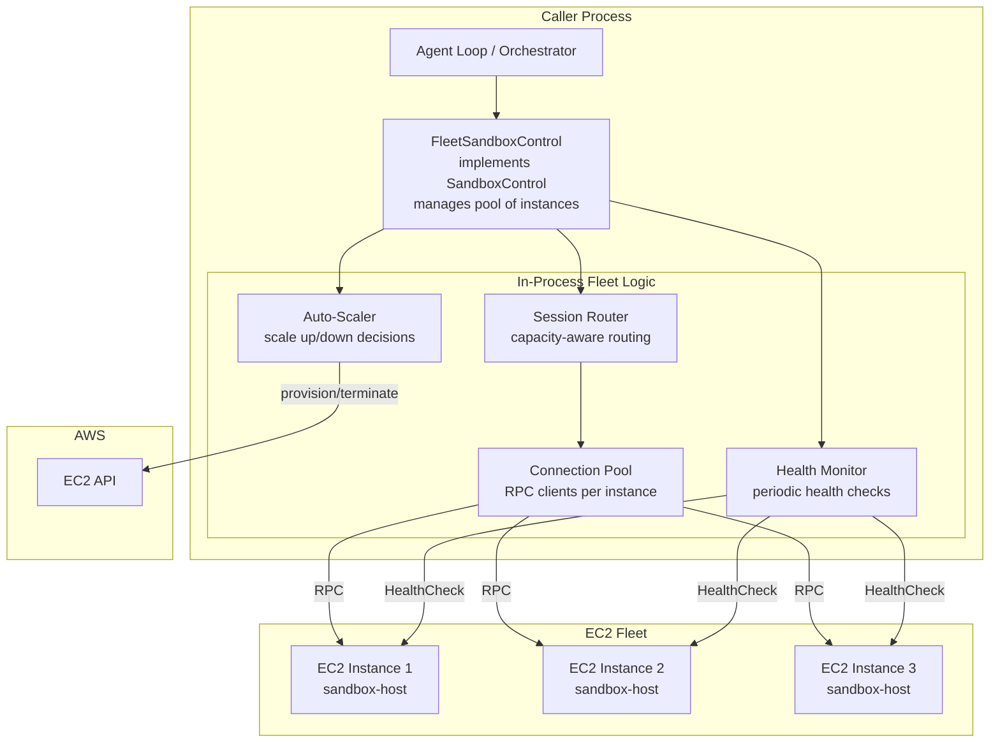
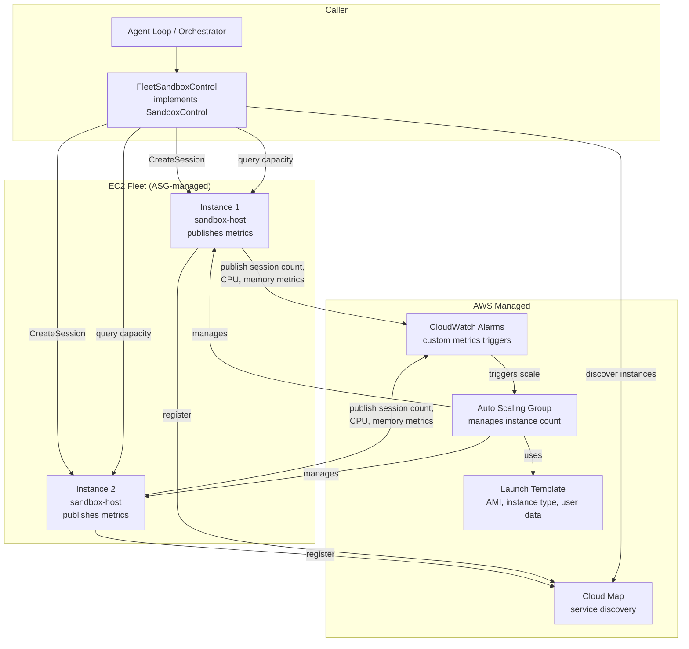
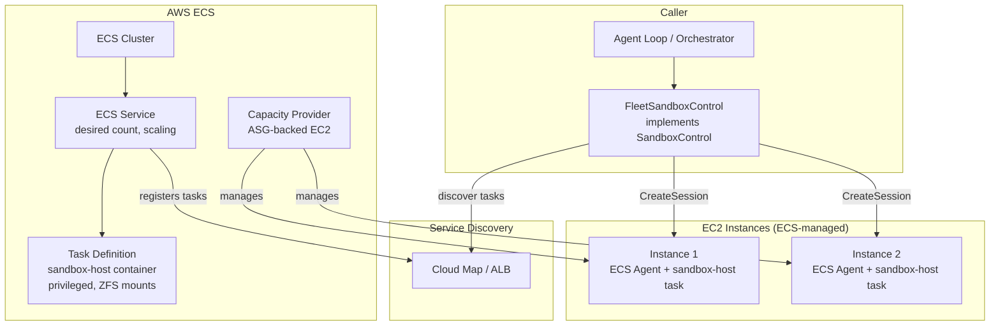
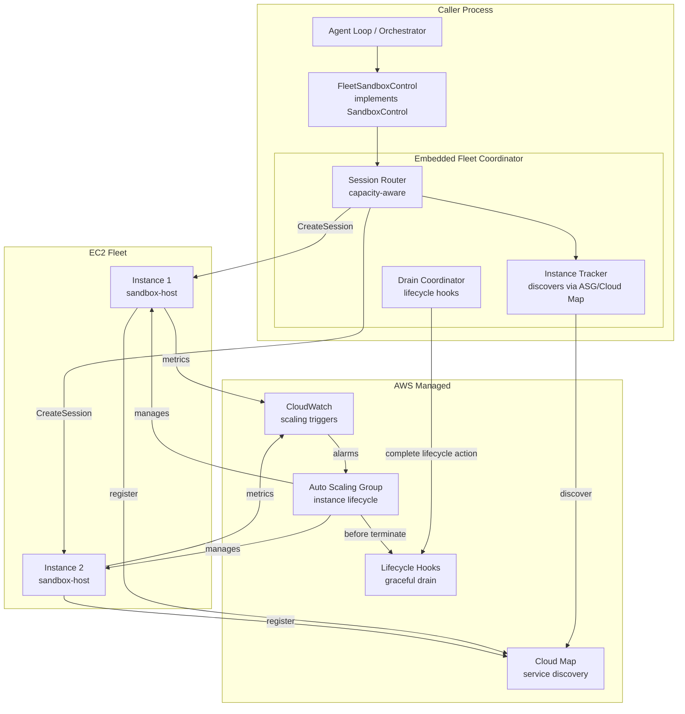

# EC2 Fleet Management for Native Sandbox — Shaping

## Source

> **Context:** The flex-agent-runtime has a native sandbox backend
> (`SandboxHostService`) that uses ZFS for filesystem snapshots/rollback and
> gVisor for per-tool-call container isolation. In "Tools in Sandbox" mode, the
> agent loop runs externally and dispatches individual tool calls to a
> sandbox-host over RPC (`SandboxService` interface). The existing
> `NativeSandboxControl` wraps a single `api.SandboxService` client — it points
> at one sandbox-host process on one machine. There is no way to scale to
> multiple machines, load-balance sessions across them, auto-scale based on
> demand, or recover from a machine failure.
>
> **Prior work:** The cloud-sandbox-providers shaping doc identified "D1: EC2 as
> Infra Provisioner" as the highest priority shape — scaling our native sandbox
> to multiple EC2 instances with automated provisioning. This document goes
> deeper into the fleet management problem specifically.
>
> **Key architectural constraint:** `SandboxControl.CreateSandbox` is
> per-agent-session. A single EC2 instance running sandbox-host hosts MANY
> concurrent agent sessions (each gets its own ZFS dataset but shares the
> machine's ZFS pool, CPU, and memory). The fleet manager must route
> `CreateSandbox` to an instance with available capacity and track which sessions
> live on which instances.

---

## Problem

Today, sandbox-host runs on a single manually provisioned EC2 instance. To use
it, a caller constructs a `NativeSandboxControl` with a single RPC client
pointing at that machine's address. This has several problems:

1. **No horizontal scaling.** One machine limits the total number of concurrent
   agent sessions to whatever that machine's CPU, memory, and ZFS pool can
   handle (configured via `ServiceConfig.MaxSessions`).

2. **No auto-scaling.** If demand spikes, there is no way to automatically
   provision additional EC2 instances. If demand drops to zero, the instance
   still runs and costs money.

3. **No health monitoring or recovery.** If the sandbox-host process or EC2
   instance dies, all sessions on that machine are lost with no automatic
   failover or replacement.

4. **No capacity-aware routing.** When multiple machines exist (manually
   provisioned), there is no mechanism to route a `CreateSandbox` call to the
   instance with the most available capacity.

5. **No warm pool.** Provisioning a new EC2 instance from scratch takes
   10-90 seconds (AMI boot + ZFS pool setup + sandbox-host startup). This is
   too slow to do on-demand when a `CreateSandbox` call arrives and all
   existing instances are at capacity.

## Outcome

A fleet management layer that:
- Pools EC2 instances running sandbox-host
- Routes `CreateSandbox` calls to instances with available capacity
- Auto-scales the fleet based on demand (scale up when sessions are queuing,
  scale down when idle)
- Monitors instance health and replaces unhealthy instances
- Maintains a warm pool for fast session creation
- Is transparent to callers — the `SandboxControl` interface is unchanged
- Optimizes cost (scale to zero when idle, spot instance support)
- Gracefully drains sessions before terminating instances on scale-down

---

## Requirements

| ID | Requirement | Notes |
|----|-------------|-------|
| R0 | **Capacity-aware session routing** — Route `CreateSandbox` calls to an EC2 instance with available capacity (sessions, CPU, memory, ZFS pool space). If no instance has capacity, trigger scale-up and either queue the request or return a retryable error. | The fleet manager must track per-instance capacity. `SandboxHostService` already has `MaxSessions`, `HealthCheck` (which reports `SessionCount`, `ActiveTools`, pool space), and `ListSessions`. |
| R1 | **Auto-scale up** — Automatically provision new EC2 instances when existing capacity is insufficient. Scaling triggers: all instances above a session threshold, pending `CreateSandbox` requests queuing, average CPU/memory utilization above threshold. | Must be responsive enough that sessions don't wait long. Warm pool (R4) is the primary mitigation for boot latency. |
| R2 | **Auto-scale down** — Terminate idle EC2 instances to reduce cost. An instance is eligible for termination when it has zero active sessions and has been idle for a configurable cooldown period. Scale-down must never terminate an instance with active sessions without draining first (R7). | Scale-to-zero must be supported — when there are no sessions at all, all instances should eventually be terminated. |
| R3 | **Health monitoring** — Continuously monitor sandbox-host health on each instance. Detect: process crashes, instance failures, degraded ZFS pool, high resource utilization. Unhealthy instances should be drained (new sessions blocked, existing sessions allowed to complete or be migrated) and replaced. | `SandboxHostService.HealthCheck` already returns status (healthy/degraded/unhealthy), pool state, session count, active tools. The fleet manager calls this periodically. |
| R4 | **Warm pool** — Maintain a configurable number of pre-provisioned, idle EC2 instances with sandbox-host running and ready to accept sessions. Warm pool instances absorb demand spikes without the 10-90s cold start penalty. Pool size should auto-adjust based on recent demand patterns. | Trade-off: warm instances cost money but eliminate cold start. A minimum warm pool of 0-2 instances with auto-adjustment is a reasonable default. |
| R5 | **Transparent to callers** — The `SandboxControl` interface is unchanged. Callers call `CreateSandbox` and get back a `SandboxID` + `Address`. They do not know or care that multiple EC2 instances exist. Subsequent calls (`DestroySandbox`, `LaunchProcess`, etc.) are routed to the correct instance based on the `SandboxID`. | The fleet-aware implementation must maintain a session-to-instance mapping so that `DestroySandbox(sandboxID)` goes to the right machine. |
| R6 | **Instance lifecycle management** — Provision EC2 instances from a pre-baked AMI that includes ZFS, gVisor, and sandbox-host. Configure instances via user data or instance metadata. Handle instance startup sequence: boot, ZFS pool import/create, sandbox-host start, health check passes, register as available. | AMI baking is out of scope for this doc but is a prerequisite. The fleet manager needs to know the AMI ID and instance configuration. |
| R7 | **Graceful scale-down** — Before terminating an instance, drain all sessions: stop accepting new sessions on the instance, wait for existing sessions to complete (with a configurable timeout), then terminate. If sessions don't complete within the timeout, force-destroy them (the agent loop will see RPC errors and can retry or fail). | `SandboxHostService.Shutdown` already destroys all sessions. The fleet manager orchestrates the drain-then-terminate sequence. |
| R8 | **Cost optimization** — Support EC2 Spot Instances for cost savings (up to 90% discount). Handle spot interruption notices (2-minute warning) by draining sessions. Support mixed fleet (on-demand for baseline, spot for burst). Scale to zero when fully idle. | Spot interruption handling is essentially the same as graceful scale-down with a hard 2-minute deadline. |
| R9 | **Session affinity for subsequent calls** — After `CreateSandbox` returns, all subsequent calls for that `SandboxID` (`DestroySandbox`, `LaunchProcess`, `KillProcess`, `GetProcessStatus`, `PauseSandbox`, `ResumeSandbox`) must route to the same EC2 instance where the session was created. The ZFS dataset and gVisor state are local to that instance. | This is a hard requirement — sessions cannot be migrated between instances (ZFS datasets are local). |
| R10 | **Observability** — Expose fleet-level metrics: total instances, instances by state (provisioning/ready/draining/terminating), total sessions across fleet, sessions per instance, scale-up/down events, routing decisions, health check results, warm pool utilization. | Essential for operating the fleet. Should integrate with existing OTEL metrics infrastructure. |

---

## Shapes

### Shape A: Fleet Manager as a Separate Service

A standalone long-running process (`fleet-manager`) that manages the EC2 fleet.
Sandbox-host instances register with the fleet manager on startup. The
fleet-aware `SandboxControl` implementation talks to the fleet manager to get
instance assignments, then talks directly to sandbox-host instances for session
operations.

#### Architecture



#### How it works

**CreateSandbox flow:**
1. `FleetSandboxControl.CreateSandbox()` calls the fleet manager's
   `GetAssignment()` RPC, passing resource requirements.
2. Fleet manager selects an instance with available capacity (least-loaded,
   or from warm pool if all active instances are above threshold).
3. Fleet manager returns the instance address. If no capacity is available, it
   triggers a scale-up event and either queues the request (with timeout) or
   returns a retryable error.
4. `FleetSandboxControl` creates a direct RPC client to the assigned instance
   and calls `CreateSession()` on it.
5. Fleet manager records the session-to-instance mapping.

**Subsequent calls:**
- `FleetSandboxControl` maintains a local cache of `sandboxID -> instanceAddress`.
- `DestroySandbox`, `LaunchProcess`, etc. look up the instance from the cache
  and call the sandbox-host directly.
- On `DestroySandbox`, the fleet manager is notified to update capacity tracking.

**Auto-scaling:**
- Fleet manager runs a control loop (e.g., every 10-30s) that evaluates scaling
  policy:
  - Scale up if: pending requests > 0, or all instances above 80% session
    capacity, or warm pool depleted.
  - Scale down if: an instance has 0 sessions and has been idle for > cooldown
    period, and total instances > minimum.
- Fleet manager calls EC2 `RunInstances` to scale up,
  `TerminateInstances` (after drain) to scale down.

**Health monitoring:**
- Fleet manager polls each instance's `HealthCheck` endpoint every 15-30s.
- If an instance is unhealthy (sandbox-host reports unhealthy, or instance
  fails to respond), mark it as draining (no new sessions), wait for existing
  sessions to complete, then terminate and replace.

**Warm pool:**
- Fleet manager maintains `warmPoolSize` idle instances. When a warm instance
  gets its first session, the fleet manager provisions a replacement.
- Warm pool size can auto-adjust: if sessions are being created faster than
  instances can boot, increase the warm pool target.

#### Trade-offs

- (+) Clean separation of concerns — fleet management logic is isolated.
- (+) Fleet manager can be deployed independently of callers.
- (+) State store enables fleet manager restarts without losing instance/session
  mapping (if using persistent store like DynamoDB).
- (+) Multiple callers can share one fleet manager.
- (-) Additional service to deploy, monitor, and operate.
- (-) Additional network hop for `GetAssignment()` on every `CreateSandbox`.
- (-) Fleet manager is a single point of failure (needs HA deployment for
  production).
- (-) State synchronization between fleet manager and actual EC2/sandbox-host
  state requires reconciliation.

---

### Shape B: Fleet-Aware SandboxControl (No Separate Service)

Extend `NativeSandboxControl` (or create a new `FleetSandboxControl`) that
internally manages multiple sandbox-host connections and handles routing,
capacity tracking, and auto-scaling. No separate fleet manager service — all
logic runs in-process within the caller.

#### Architecture



#### How it works

**CreateSandbox flow:**
1. `FleetSandboxControl.CreateSandbox()` calls the internal router.
2. Router selects the least-loaded instance from its in-memory registry.
3. If no instance has capacity, the router asks the scaler to provision a new
   instance. The scaler calls EC2 `RunInstances`, waits for it to be ready,
   adds it to the pool.
4. Router delegates `CreateSession` to the selected instance's RPC client.
5. Router records `sandboxID -> instance` in an in-memory map.

**Subsequent calls:**
- Same as Shape A — look up instance from in-memory map, call directly.

**Auto-scaling:**
- The scaler runs as a goroutine within the `FleetSandboxControl`. It
  periodically evaluates the same scaling policies as Shape A.
- Scaling decisions are based on local state (capacity reports from health
  checks, pending request count).

**State persistence:**
- Session-to-instance mapping is in-memory. If the caller process restarts,
  the mapping is lost. On restart, `FleetSandboxControl` queries all known
  instances via `ListSessions` to rebuild the mapping.
- Instance discovery on restart: either query EC2 API for instances with a
  specific tag, or persist instance list to a file/database.

#### Trade-offs

- (+) No additional service to deploy — everything runs in the caller process.
- (+) Lower latency — no network hop for routing decisions.
- (+) Simpler deployment topology.
- (+) Follows the existing pattern of `NativeSandboxControl` wrapping an RPC
  client.
- (-) Fleet state is tied to the caller process. If the process restarts,
  state must be rebuilt (survivable but adds startup complexity).
- (-) Multiple callers cannot share fleet management — each would manage its
  own fleet, leading to resource contention or duplication.
- (-) Auto-scaling logic mixed into the sandbox control layer — violates
  separation of concerns.
- (-) Harder to operate — no independent fleet dashboard or API.

---

### Shape C: AWS Auto Scaling Group (ASG) with Custom Capacity Tracking

Use an AWS Auto Scaling Group to manage EC2 instance lifecycle. Instances
register with a target group or service discovery mechanism (e.g., AWS Cloud
Map) on startup. A thin routing layer in the caller uses service discovery to
find instances and route sessions based on capacity reported by each instance's
health endpoint.

#### Architecture



#### How it works

**Instance lifecycle:**
- ASG manages instance count based on CloudWatch alarms on custom metrics
  (e.g., average session count per instance, average CPU utilization).
- Launch template specifies AMI (pre-baked with ZFS + gVisor + sandbox-host),
  instance type, security groups, user data for configuration.
- Instances register with Cloud Map on startup (sandbox-host publishes its
  address to a service discovery namespace).

**CreateSandbox flow:**
1. `FleetSandboxControl` queries Cloud Map for healthy instances.
2. For each candidate instance, it queries the `HealthCheck` endpoint to get
   current capacity (session count, pool space, etc.).
3. Selects the least-loaded instance and calls `CreateSession`.
4. Records `sandboxID -> instanceAddress` locally.

**Auto-scaling:**
- Each sandbox-host publishes custom CloudWatch metrics: `SessionCount`,
  `ActiveTools`, `PoolCapacity`, `CPUUtilization`.
- CloudWatch alarms trigger ASG scaling policies:
  - Scale up: average `SessionCount` across fleet > threshold.
  - Scale down: average `SessionCount` < threshold for > cooldown period.
- ASG handles instance provisioning and termination.

**Graceful scale-down:**
- ASG lifecycle hooks: before terminating an instance, ASG sends a lifecycle
  action. The sandbox-host (or a lifecycle hook Lambda) receives it, drains
  sessions, then signals completion.
- This ensures no instance is terminated with active sessions (within the
  lifecycle hook timeout).

**Health monitoring:**
- ASG health checks (custom health check script that calls sandbox-host's
  `HealthCheck` endpoint).
- Unhealthy instances are automatically replaced by ASG.

#### Trade-offs

- (+) Leverages AWS managed infrastructure — ASG handles instance lifecycle,
  replacement, availability zones.
- (+) CloudWatch + ASG scaling policies are well-tested and reliable.
- (+) ASG lifecycle hooks provide built-in graceful scale-down.
- (+) Cloud Map provides service discovery without a custom registry.
- (+) Less custom code to write and maintain.
- (-) Scaling reactivity is limited by CloudWatch metric publication interval
  (minimum 1 minute for custom metrics) and ASG cooldown periods. May be too
  slow for bursty workloads.
- (-) Capacity-aware routing still requires custom logic in the caller — ASG
  manages instance count but does not route sessions.
- (-) ASG scaling policies are coarse — scaling on average metrics does not
  account for per-instance capacity nuances (e.g., one instance with a
  nearly-full ZFS pool should not get new sessions even if CPU is low).
- (-) Warm pool management via ASG warm pools is possible but has limitations
  (warm instances are stopped, not running — requires boot time on activation).
- (-) More tightly coupled to AWS (harder to run locally or in other clouds).

---

### Shape D: ECS with Custom Task Definition

Run sandbox-host as an ECS task on EC2 instances (not Fargate — Fargate does
not support ZFS or gVisor). ECS manages task placement and scaling. Each ECS
task runs one sandbox-host instance. The EC2 instances in the ECS cluster are
managed by an ASG with ECS capacity providers.

#### Architecture



#### Key constraints

ZFS and gVisor impose hard requirements on the ECS task:
- **ZFS:** Requires the ZFS kernel module loaded on the host. The ECS task
  needs privileged access to the ZFS pool (host-mounted `/dev/zfs` and the
  pool mount path). The task must run in `privileged` mode or with extensive
  Linux capabilities.
- **gVisor:** Requires `runsc` installed on the host and access to
  `/dev/kvm` or ptrace. The task needs at minimum `SYS_PTRACE` capability
  and host PID namespace access.
- **1:1 task-to-instance:** Because ZFS datasets and gVisor containers are
  instance-local, each EC2 instance runs exactly one sandbox-host task. This
  means ECS task count equals instance count.

#### How it works

**Instance lifecycle:**
- ECS capacity provider manages an ASG. When ECS needs more capacity (more
  tasks to place), the capacity provider scales the ASG up.
- Task definition specifies the sandbox-host container with required bind
  mounts, capabilities, and privileged mode.
- ECS service discovery (Cloud Map integration) registers each task with a
  DNS name or service registry.

**CreateSandbox flow:**
- Same as Shape C — discover instances via service discovery, query capacity,
  route to least-loaded instance.

**Auto-scaling:**
- ECS service auto-scaling adjusts desired task count based on custom metrics
  (average sessions per task) published to CloudWatch.
- Capacity provider automatically scales the ASG to match the desired task
  count.

#### Trade-offs

- (+) ECS handles task placement, restart on failure, rolling updates.
- (+) Capacity providers automate the ASG-to-ECS coordination.
- (+) Task definitions provide a declarative, versioned description of the
  sandbox-host deployment.
- (-) The 1:1 task-to-instance mapping means ECS task scheduling adds
  no value over a bare ASG — every task is constrained to its own instance.
- (-) Privileged containers and host mounts make the ECS configuration
  complex and fragile.
- (-) ZFS pool management (creation, import) must happen at the instance
  level (user data or init script), not at the ECS task level — the task
  assumes the pool already exists.
- (-) ECS adds operational overhead (cluster management, capacity provider
  configuration) for minimal benefit given the 1:1 constraint.
- (-) Fargate is not an option (no kernel module support, no privileged
  mode), eliminating the main simplicity advantage of ECS.

---

### Shape E: Hybrid — Thin Fleet Coordinator with ASG Backend

Combine the best of Shapes A and C. Use an ASG to handle instance lifecycle
(provisioning, termination, health-based replacement). Run a thin "fleet
coordinator" as a sidecar or embedded component (not a full separate service)
that handles capacity-aware routing and session mapping. The coordinator
is lighter than Shape A's fleet manager because it delegates lifecycle to
ASG.

#### Architecture



#### How it works

**Instance lifecycle:** Managed by ASG — same as Shape C.

**Capacity-aware routing:** Embedded coordinator queries Cloud Map for healthy
instances, fetches capacity from each instance's `HealthCheck`, routes to
the least-loaded. This is more sophisticated than Shape C's basic routing
because the coordinator maintains a continuously-updated capacity model
rather than querying on every `CreateSandbox` call.

**Session mapping:** In-memory in the coordinator, rebuilt from
`ListSessions` on all discovered instances if the caller restarts.

**Graceful drain:** ASG lifecycle hooks notify the coordinator (via SQS
queue or EventBridge). The coordinator calls `Shutdown` on the draining
instance's sandbox-host, then completes the lifecycle action to allow
termination.

**Warm pool:** ASG warm pool feature keeps instances in a "stopped" state.
The coordinator activates warm instances by completing a lifecycle action.
Alternative: keep warm instances running (costs more but eliminates boot
time).

#### Trade-offs

- (+) ASG handles the hard parts of instance lifecycle.
- (+) No separate service to deploy — coordinator is embedded.
- (+) Capacity-aware routing is more responsive than pure CloudWatch-based
  scaling.
- (+) Lifecycle hooks provide clean integration for graceful drain.
- (-) Coordinator is tied to the caller process (same limitation as Shape B
  for multi-caller scenarios).
- (-) ASG scaling latency (CloudWatch metric interval + cooldown) may be
  too slow for burst scenarios.
- (-) More AWS coupling than Shape A or B.

---

## Fit Check

| Req | Requirement | A: Separate Service | B: In-Process | C: ASG + Cloud Map | D: ECS | E: Hybrid |
|-----|-------------|:-------------------:|:-------------:|:------------------:|:------:|:---------:|
| R0 | Capacity-aware routing | Yes (fleet manager decides) | Yes (in-process router) | Partial (caller queries each instance) | Partial (same as C) | Yes (embedded coordinator with cache) |
| R1 | Auto-scale up | Yes (fleet manager calls EC2) | Yes (in-process scaler calls EC2) | Yes (ASG + CloudWatch) | Yes (ECS + capacity provider) | Yes (ASG + CloudWatch, coordinator can also trigger) |
| R2 | Auto-scale down | Yes (fleet manager drains + terminates) | Yes (in-process logic) | Yes (ASG with lifecycle hooks) | Yes (ECS service scaling) | Yes (ASG with lifecycle hooks) |
| R3 | Health monitoring | Yes (fleet manager polls) | Yes (in-process monitor) | Yes (ASG health checks) | Yes (ECS health checks) | Yes (ASG health checks + coordinator polling) |
| R4 | Warm pool | Yes (fleet manager maintains running instances) | Yes (in-process management) | Partial (ASG warm pool = stopped instances, boot required) | Partial (ECS maintains desired count but no "warm" concept) | Partial (ASG warm pool, or running warm instances at cost) |
| R5 | Transparent to callers | Yes | Yes | Yes | Yes | Yes |
| R6 | Instance lifecycle | Yes (fleet manager provisions) | Yes (in-process) | Yes (ASG + launch template) | Yes (ECS + capacity provider) | Yes (ASG + launch template) |
| R7 | Graceful scale-down | Yes (fleet manager drains) | Yes (in-process drain) | Yes (lifecycle hooks) | Yes (task drain) | Yes (lifecycle hooks + coordinator) |
| R8 | Cost optimization (spot) | Yes (fleet manager manages spot) | Yes (mixed fleet support) | Yes (ASG mixed instances policy) | Yes (capacity provider spot support) | Yes (ASG mixed instances policy) |
| R9 | Session affinity | Yes (fleet manager tracks mapping) | Yes (in-memory map) | Yes (caller-side mapping) | Yes (caller-side mapping) | Yes (coordinator tracks) |
| R10 | Observability | Yes (fleet manager exposes metrics) | Partial (mixed into caller metrics) | Partial (CloudWatch metrics, no fleet-level view without custom dashboard) | Partial (ECS metrics + CloudWatch) | Partial (coordinator metrics + CloudWatch) |

### Summary

**Shape A (Separate Service)** scores highest on all requirements but has the
highest operational overhead — a separate service to deploy and keep available.
Best for production multi-tenant scenarios where multiple callers share a fleet.

**Shape B (In-Process)** scores well on all requirements but has significant
limitations for multi-caller scenarios and state persistence. Best for
single-caller deployments or early development.

**Shape C (ASG + Cloud Map)** offloads instance lifecycle to AWS but has
coarse scaling granularity (CloudWatch metric interval) and requires
custom routing logic in the caller. The warm pool limitation (stopped
instances need boot time) partially defeats the purpose.

**Shape D (ECS)** adds complexity without proportional benefit due to the
1:1 task-to-instance constraint. ZFS and gVisor requirements make ECS a
poor fit. **Not recommended.**

**Shape E (Hybrid)** balances AWS-managed lifecycle with embedded
capacity-aware routing. Less operational overhead than Shape A, more
capable than pure Shape C. Good balance for initial production use.

---

## Recommendation

**Start with Shape B (In-Process) for initial implementation, designed to
evolve into Shape E (Hybrid) for production.**

Rationale:

1. Shape B is the fastest to implement and test. The `FleetSandboxControl`
   struct manages a pool of RPC clients internally, handles routing, and calls
   the EC2 API for scaling. No additional services to deploy.

2. The routing and capacity tracking logic in Shape B is the same logic needed
   for Shapes A and E. Building it in-process first lets us iterate on the
   algorithms (routing strategy, scaling policy, health evaluation) without the
   overhead of a separate service.

3. Shape B can be deployed immediately for single-caller scenarios (e.g., one
   orchestrator managing a fleet), which is the near-term use case.

4. When we need multi-caller support or independent fleet management, we
   extract the fleet logic into a service (Shape A) or add ASG backing
   (Shape E). The routing and capacity tracking code is reusable.

5. Shape D (ECS) is eliminated — the 1:1 constraint and privileged container
   requirements add complexity without benefit.

The evolutionary path:

```
Shape B (in-process)
  → Shape E (add ASG for lifecycle, keep routing in-process)
    → Shape A (extract fleet manager as a service, if multi-caller needed)
```

---

## Key Design Decisions to Make

### Instance-to-Session Multiplexing

Each EC2 instance runs one `SandboxHostService` that manages many sessions.
The fleet manager must decide how many sessions to pack per instance.

**Factors:**
- `ServiceConfig.MaxSessions` on each sandbox-host caps the session count.
- ZFS pool space is the binding constraint for many sessions — each session
  clones a base snapshot and accumulates changes. Pool space is reported by
  `HealthCheck`.
- CPU and memory are shared across sessions. Tier 2 tool calls (gVisor
  containers) have per-call resource limits (`ResourceSpec`) but the total
  must not exceed the instance's capacity.
- Agent sessions are bursty — most time is spent waiting for LLM responses,
  with intermittent bursts of tool calls. This means many sessions can
  share an instance if the bursts don't all coincide.

**Proposed approach:** Set `MaxSessions` per instance type (e.g., 10 sessions
on a c5.2xlarge, 20 on a c5.4xlarge). Use a composite capacity score that
weights session count, CPU headroom, memory headroom, and ZFS pool space.
Route to the instance with the highest remaining capacity score.

### Routing Strategy

Options for selecting which instance gets a new session:

1. **Least-loaded (by session count):** Simple, works well when sessions are
   homogeneous. Does not account for resource usage differences between
   sessions.

2. **Least-loaded (by composite capacity score):** Weights session count, CPU
   utilization, memory utilization, and ZFS pool usage. More accurate but
   requires recent metrics from each instance.

3. **Bin packing:** Fill instances to capacity before using new ones. Minimizes
   the number of running instances (better for cost). Risk: no headroom on
   packed instances for burst tool calls.

4. **Spread:** Distribute evenly across instances. Maximizes per-session
   headroom. Risk: more instances running than necessary.

**Proposed approach:** Least-loaded by composite capacity score, with a
configurable "headroom threshold" (e.g., don't route to an instance above
80% capacity). This naturally spreads load while allowing instances to
fill up to 80%.

### Session-to-Instance Mapping Persistence

When the fleet manager (or in-process coordinator) restarts, it needs to
reconstruct the mapping of which sessions are on which instances.

**Options:**
1. **Rebuild from instances:** Query `ListSessions` on all known instances.
   This works but requires knowing which instances exist (via EC2 API tag
   query or service discovery).

2. **Persist to DynamoDB/Redis:** Write the mapping to a durable store on
   every `CreateSandbox`/`DestroySandbox`. Survives restarts without
   querying instances.

3. **Encode instance in SandboxID:** Include the instance identifier in
   the returned `SandboxID` (e.g., `i-abc123:sess-xyz`). Subsequent calls
   can extract the instance from the ID without any lookup. Requires
   careful design to not leak infrastructure details.

**Proposed approach:** Option 3 (encode in SandboxID) for stateless routing
of subsequent calls, with option 1 (rebuild from instances) as a fallback
for fleet state reconstruction on restart. Avoid option 2 for initial
implementation to minimize dependencies.

---

## Open Questions

### OQ1: Instance Type Selection

What EC2 instance type(s) should be used? Key dimensions:
- **CPU:** Tier 2 tool calls (gVisor containers) need CPU. But most time is
  idle (waiting for LLM). Burstable instances (t3) might be cost-effective
  if credit balance is managed.
- **Memory:** ZFS ARC (adaptive replacement cache) benefits from extra RAM.
  Each gVisor container needs memory. 16-32GB is likely a minimum for
  10+ concurrent sessions.
- **Storage:** EBS volume for the ZFS pool. gp3 (baseline 3000 IOPS, 125
  MB/s) is likely sufficient. Instance store (NVMe) is faster but
  ephemeral — data lost on stop/terminate.
- **Conclusion needed:** Benchmark with realistic workloads to determine
  the right instance type and sessions-per-instance ratio.

### OQ2: ZFS Pool on EBS vs Instance Store

- **EBS:** Persistent across instance stop/start. Slower than instance store
  but durable. Supports snapshots to S3.
- **Instance store (NVMe):** Much faster I/O. Ephemeral — data lost on
  stop/terminate. Suitable if sessions are short-lived and we don't need to
  survive instance restarts.
- For fleet management, ephemeral instance store may actually be fine: if
  an instance is terminated, all sessions on it are lost, but the fleet
  manager detects this and the caller handles the RPC error. Session data
  is disposable (it's a scratch workspace, not persistent storage).

### OQ3: Spot Instance Interruption Handling

Spot instances can be interrupted with a 2-minute warning. How should the
fleet manager handle this?
- Option A: Treat spot interruption like a scale-down event — drain sessions
  within the 2-minute window. If sessions cannot complete in 2 minutes,
  they are force-destroyed (agent loop sees RPC errors).
- Option B: Proactively migrate sessions from spot instances to on-demand
  instances when interruption is detected. Migration is not possible with
  ZFS (datasets are local), so this would mean creating new sessions on
  another instance and having the agent loop reconnect. This is essentially
  session loss + retry.
- Option A is simpler and likely sufficient. The agent loop should already
  handle sandbox failures gracefully.

### OQ4: Multi-Region Support

Should the fleet span multiple AWS regions? Arguments for:
- Lower latency for callers in different regions.
- Higher availability (survive region-level outages).
Arguments against:
- Significantly increases complexity (cross-region coordination, data
  locality).
- Agent sessions are latency-sensitive to LLM API calls, not to
  sandbox-host. The sandbox can be in a different region from the caller
  without major impact (tool call latency is dominated by execution time,
  not network).
- Recommendation: Single-region initially. Multi-region is a future
  concern.

### OQ5: Base Snapshot Distribution

Each sandbox-host instance needs access to base snapshots (the ZFS snapshots
that sessions are cloned from). How are these distributed to fleet instances?
- Option A: Pre-bake base snapshots into the AMI. Simple but requires AMI
  updates whenever base snapshots change.
- Option B: Store base snapshots in S3 (using ZFS send/receive). Instances
  pull the base snapshot on first use and cache it locally. More flexible
  but adds cold-start latency for the first session using a new base.
- Option C: A "golden" instance maintains base snapshots, and new instances
  replicate from it using ZFS send/receive. More complex but fast
  replication.
- This is a hard problem and may warrant its own shaping doc.

### OQ6: Fleet Manager High Availability

If using Shape A (separate service), the fleet manager itself needs HA.
Options:
- Active/passive with a leader election (e.g., DynamoDB lock).
- Stateless fleet manager with all state in DynamoDB — any instance can
  serve requests.
- This is deferred complexity that can be addressed when moving beyond
  Shape B.

### OQ7: How Does the Caller Discover the Fleet?

In Shape B (in-process), the `FleetSandboxControl` needs to know which EC2
instances are in the fleet. Options:
- Configuration file listing instance addresses (static, requires updates).
- EC2 API query with tag filter (dynamic, requires IAM permissions).
- Service discovery (Cloud Map, Consul, etc.).
- For initial implementation, EC2 tag query is the simplest dynamic option.
  Instances are tagged with a fleet identifier, and `FleetSandboxControl`
  periodically queries for instances with that tag.

### OQ8: Sandbox-Host Self-Registration vs Discovery

Should sandbox-host instances register themselves (push model) or should the
fleet manager discover them (pull model)?
- **Push (registration):** Sandbox-host calls a fleet manager endpoint on
  startup. Requires the fleet manager to exist (not applicable for Shape B).
- **Pull (discovery):** Fleet coordinator queries EC2 API or service
  discovery for instances. Works for all shapes. Sandbox-host only needs to
  be reachable and respond to health checks.
- For Shape B, pull via EC2 tags is simplest. For Shape E, Cloud Map
  registration (built into the ASG launch template) is cleaner.

### OQ9: Interaction with Agent-in-Sandbox Mode

This shaping doc focuses on Tools in Sandbox (agent loop external, tool
calls dispatched to sandbox-host). But the fleet can also serve Agent in
Sandbox mode, where `SandboxControl.CreateSandbox` provisions a sandbox
and `LaunchProcess` runs the agent binary inside it. The fleet management
requirements are the same (routing, scaling, health). Should the fleet
manager handle both modes uniformly, or are there mode-specific
considerations?
- In Agent in Sandbox, sessions are typically longer-lived (hours vs minutes
  for tool calls) and use more resources (the agent process itself consumes
  CPU/memory continuously). This affects the sessions-per-instance ratio
  and scaling policy.
- Uniform fleet management with mode-aware capacity scoring is likely the
  right approach.
