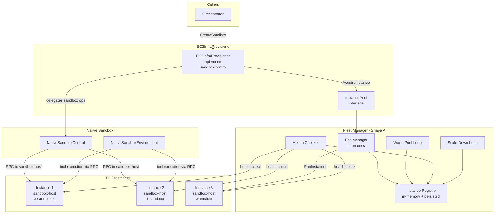
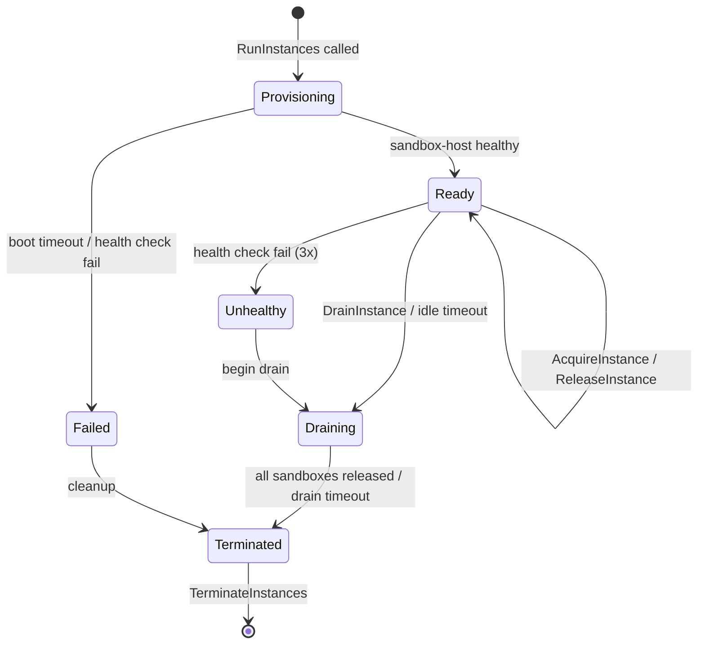

# EC2 Fleet Management for Sandbox Hosts — Shaping

## Source

> **Context:** The flex-agent-runtime's native sandbox backend (ZFS + gVisor) runs
> on EC2 instances provisioned as sandbox hosts. Today, provisioning is manual via
> `scripts/ec2-sandbox/provision.sh`, which creates a single instance, installs
> ZFS + gVisor + flexagent, configures systemd, and starts `flexagent serve
> sandbox-host`. Teardown is likewise manual via `teardown.sh`. There is no
> automated scaling, no instance pooling, no health monitoring, and no graceful
> lifecycle management.
>
> **Parent shape:** This is the detailed design shaping for **Shape D1: EC2 as
> Infra Provisioner** from the
> [cloud-sandbox-providers shaping doc](cloud-sandbox-providers.md). In that doc,
> D1 is described as an infrastructure provisioning layer that sits BELOW
> `SandboxControl`: it provisions EC2 instances with sandbox-host, then delegates
> all sandbox operations (ZFS snapshots, gVisor isolation, tool execution) to
> `NativeSandboxControl`. This document shapes the fleet management layer that
> makes D1 production-ready.
>
> **Key architectural constraint:** EC2 fleet management does NOT implement
> `SandboxControl` directly. It provides an `InstancePool` that the
> `EC2InfraProvisioner` (which wraps `SandboxControl`) uses to acquire and release
> sandbox-host instances. The native sandbox already supports multiple sandboxes
> per instance (ZFS datasets + gVisor containers), so the fleet manager must
> handle multi-tenant instance packing, not just 1:1 instance-to-sandbox mapping.
>
> **Run modes to assess:**
> - **Scaling up** — Demand exceeds available capacity; new instances must be
>   provisioned.
> - **Steady state** — Demand is stable; warm pool maintains fast CreateSandbox.
> - **Scaling down** — Demand drops; idle instances are drained and terminated.
> - **Failure recovery** — Instances become unhealthy; sandboxes are migrated or
>   re-created on healthy instances.

---

## Problem

The manual provisioning approach (`scripts/ec2-sandbox/provision.sh`) has
fundamental limitations that prevent production use:

1. **No scaling.** A single instance is provisioned at a time. There is no
   mechanism to add capacity when demand increases or remove it when demand drops.
   Each instance requires manual CLI invocation with SSH key paths.

2. **Slow cold start.** EC2 instance boot + user-data bootstrap takes 60-90
   seconds. Every `CreateSandbox` call that needs a new instance pays this cost
   because there is no warm pool of pre-provisioned instances.

3. **No health monitoring.** If an instance becomes unhealthy (kernel panic,
   ZFS pool degraded, gVisor crash, EBS volume issue), there is no detection or
   replacement. Sandboxes on that instance silently fail.

4. **No graceful lifecycle.** Teardown terminates instances immediately. There
   is no drain step to migrate or finish active sandboxes before termination.
   Scale-down destroys in-progress work.

5. **No multi-sandbox packing.** Each provisioned instance runs a single
   sandbox-host that CAN host multiple sandboxes, but there is no resource
   accounting or assignment logic to pack sandboxes onto existing instances
   before provisioning new ones.

6. **No AMI management.** Every instance runs user-data bootstrap on first boot,
   installing ZFS, gVisor, and system configuration from scratch. This is slow
   and fragile (depends on external package repositories at boot time). Pre-baked
   AMIs would eliminate this.

## Outcome

A fleet management layer that:
- Automatically scales sandbox-host instances based on demand.
- Maintains a warm pool for fast `CreateSandbox` (sub-second on warm hit).
- Packs multiple sandboxes per instance for cost efficiency.
- Monitors instance health and replaces unhealthy instances.
- Drains instances gracefully before termination.
- Uses pre-baked AMIs to minimize boot time and eliminate bootstrap fragility.
- Integrates transparently with the existing `SandboxControl` interface via
  `EC2InfraProvisioner`.

---

## Requirements (R)

| ID | Requirement | Source | Category |
|----|-------------|--------|----------|
| R0 | **Auto-scale instances based on demand** — Provision new sandbox-host instances when pending sandbox requests exceed available capacity. Scale metric is queue depth of pending `CreateSandbox` calls plus projected demand from in-flight agent sessions. | Operational need | Core |
| R1 | **Warm pool of pre-provisioned instances** — Maintain N ready instances with sandbox-host running and healthy, so `CreateSandbox` can assign immediately without waiting for EC2 boot. Target: `CreateSandbox` on warm hit < 2s (dominated by `NativeSandboxControl.CreateSandbox` on the instance, not EC2 boot). | D1 cold start gap (OQ6 in cloud-sandbox-providers) | Core |
| R2 | **Multi-sandbox per instance packing** — Assign multiple sandboxes to a single instance based on resource availability (CPU, memory, ZFS pool space). Track per-instance resource usage and refuse assignment when an instance is full. | D1 multi-sandbox question (OQ7 in cloud-sandbox-providers), cost optimization | Core |
| R3 | **Instance health monitoring and replacement** — Periodically check instance and sandbox-host health (EC2 status checks, sandbox-host RPC health endpoint, ZFS pool health). Automatically replace unhealthy instances: drain if possible, then terminate and provision replacement. | Operational reliability | Core |
| R4 | **Cost optimization via scale-down** — Terminate idle instances that have no active sandboxes and have been idle beyond a configurable grace period. Never terminate instances with active sandboxes. Prefer draining over immediate termination. | Operational cost | Core |
| R5 | **Transparent integration with SandboxControl** — Callers of `SandboxControl.CreateSandbox` must not know about fleet management. `EC2InfraProvisioner` uses the fleet manager's `InstancePool` to acquire an instance, then delegates to `NativeSandboxControl`. The fleet manager is an internal implementation detail. | Architecture constraint from cloud-sandbox-providers D1 | Core |
| R6 | **AMI management** — Build and maintain pre-baked AMIs containing Ubuntu LTS + ZFS + gVisor + flexagent binary + systemd unit + base ZFS snapshot. AMI builds should be automated (Packer or EC2 Image Builder). Instance boot from AMI should reach sandbox-host healthy in < 30s (vs. 60-90s with user-data bootstrap). | Bootstrap fragility, cold start optimization | Must-have |
| R7 | **Graceful instance lifecycle** — Before terminating an instance, drain it: stop accepting new sandbox assignments, wait for active sandboxes to complete or be migrated (with configurable timeout), then terminate. Support SIGTERM-initiated graceful shutdown of sandbox-host. | Data integrity, user experience | Must-have |

---

## Shapes

### Shape A: Simple In-Process Pool Manager

A Go library embedded in the `EC2InfraProvisioner` process. No external
dependencies beyond the AWS SDK. The pool manager runs as goroutines within the
same process that handles `SandboxControl` calls.

| Part | Mechanism | Notes |
|------|-----------|-------|
| **A1: Instance registry** | In-memory map of `instanceID -> InstanceState` tracking: instance ID, address, health status, resource capacity (total CPU/mem), resource usage (allocated CPU/mem), list of sandbox IDs, last health check time, state (provisioning, ready, draining, terminated). Persisted to DynamoDB or a local file for crash recovery. | Simple, fast lookups. Single-process means no coordination overhead. |
| **A2: Warm pool maintenance** | Background goroutine runs a reconciliation loop every 10-30s. Compares `count(ready instances with available capacity)` against `warmPoolTarget` config. If below target, calls `RunInstances` to provision new instances from pre-baked AMI. Waits for sandbox-host health check to pass before marking instance ready. | `warmPoolTarget` is a static config value initially (e.g., 2-5 instances). Can be made dynamic later based on demand trends. |
| **A3: Instance assignment** | `AcquireInstance(resources ResourceSpec) -> (instanceAddr, error)`. Scans ready instances for one with sufficient available capacity (CPU, memory, ZFS quota). Uses best-fit packing: prefers the instance with the least remaining capacity that still fits the request, to maximize packing density. Returns instance address for `NativeSandboxControl` to use. | Best-fit packing minimizes instance count. Could also support first-fit or spread strategies via config. |
| **A4: Resource tracking** | On `AcquireInstance`, deducts requested resources from instance available capacity. On `ReleaseInstance(instanceID, sandboxID)`, credits resources back. Tracks at the fleet manager level, not by querying the instance (avoids round-trip latency on assignment). Periodic reconciliation with actual instance state corrects drift. | Over-allocation protection: never assign more than instance capacity. Under-utilization detection: flag instances using < 20% capacity for scale-down consideration. |
| **A5: Health checking** | Background goroutine pings each instance's sandbox-host health endpoint every 15-30s via HTTP. Also checks EC2 instance status via `DescribeInstanceStatus`. Health states: healthy, degraded (sandbox-host slow but responding), unhealthy (no response or EC2 status check failed). After N consecutive unhealthy checks (configurable, default 3), mark instance for replacement. | Health check endpoint should return ZFS pool status, active sandbox count, resource usage, and sandbox-host version. |
| **A6: Scale-down** | Background goroutine checks for instances with zero active sandboxes. After `idleGracePeriod` (configurable, default 10 min), moves instance to draining state, then terminates. Never terminates below `minInstances` (configurable floor). During draining, instance is excluded from new assignments but existing sandboxes continue. | Conservative: only terminate truly idle instances. Aggressive mode: also terminate instances with low utilization by migrating sandboxes (future). |
| **A7: Drain and terminate** | `DrainInstance(instanceID)` sets instance state to draining, preventing new sandbox assignments. Waits for all active sandboxes to be destroyed (caller responsibility via `DestroySandbox`). After `drainTimeout` (configurable, default 30 min), forcibly terminates even with active sandboxes (logs warning). `TerminateInstances` API call, then removes from registry. | Drain timeout prevents leaked instances. Force termination is a safety net, not normal operation. |
| **A8: AMI provisioning** | Instances launched from pre-baked AMI ID configured in fleet manager config. AMI contains: Ubuntu LTS, zfsutils-linux, runsc, flexagent binary, systemd unit, base ZFS pool/datasets/snapshot. On boot, sandbox-host starts automatically via systemd, no user-data needed. AMI build is a separate pipeline (Packer script). | AMI ID is a config parameter. AMI rotation: update config, new instances get new AMI, old instances continue until drained. |
| **A9: Crash recovery** | On startup, fleet manager reads persisted instance registry (DynamoDB or file). For each instance in registry, runs health check. Healthy instances are re-added to the pool. Unhealthy or terminated instances are cleaned up. Instances provisioned but never marked ready (stuck in provisioning) are terminated. | Handles fleet manager process restarts gracefully. |

**Run mode assessment:**

- **Scaling up:** Triggered when `AcquireInstance` finds no instance with sufficient capacity AND warm pool is empty. Synchronously provisions a new instance (60-90s with user-data, <30s with AMI). Returns to caller only when instance is ready. Warm pool pre-provisioning avoids this latency in the common case.
- **Steady state:** Warm pool goroutine keeps target instances ready. `AcquireInstance` is O(N) scan over ready instances (N = fleet size, typically < 100). Sub-millisecond assignment.
- **Scaling down:** Idle detection goroutine reclaims unused instances after grace period. Respects `minInstances` floor.
- **Failure recovery:** Health check goroutine detects unhealthy instances within 45-90s (3 checks x 15-30s interval). Marks for replacement. Does NOT automatically migrate sandboxes (caller must re-create via `CreateSandbox`). Unhealthy instance is drained then terminated.

---

### Shape B: AWS Auto Scaling Groups with Custom Scaling Policies

Uses AWS Auto Scaling Groups (ASG) to manage instance lifecycle, with custom
CloudWatch metrics and scaling policies to drive scale-up/down decisions.

| Part | Mechanism | Notes |
|------|-----------|-------|
| **B1: Auto Scaling Group** | ASG configured with launch template specifying: pre-baked AMI, instance type, security group, EBS volume config, IAM role. ASG manages instance provisioning/termination. Min/max/desired capacity configured. | AWS manages instance replacement on failure (ASG health checks). We get AZ distribution for free. |
| **B2: Warm pool** | ASG Warm Pool feature: maintains pre-initialized instances in `Stopped` or `Running` state. When ASG needs to scale up, pulls from warm pool instead of launching fresh. Warm pool instances have already booted and run user-data/AMI init. | ASG Warm Pool is a native AWS feature. Stopped instances cost only EBS storage. Running warm pool instances cost full EC2 price. |
| **B3: Custom CloudWatch metrics** | Fleet manager process publishes custom metrics to CloudWatch every 60s: `PendingSandboxRequests` (queue depth), `AvailableCapacitySlots` (how many more sandboxes can fit on existing instances), `InstanceUtilization` (average across fleet). Scaling policies trigger on these metrics. | CloudWatch custom metrics have ~60s granularity and ~1-2 min propagation delay. Total scale-up reaction time: 2-4 min from demand spike to instance ready. |
| **B4: Scaling policies** | Target tracking policy: maintain `AvailableCapacitySlots >= warmPoolTarget`. Step scaling policy: if `PendingSandboxRequests > 0` for 2 min, add N instances (proportional to queue depth). Scale-in policy: if `InstanceUtilization < 20%` for 10 min, remove 1 instance. | Scale-in protection: instances with active sandboxes must have scale-in protection enabled to prevent ASG from terminating them. |
| **B5: Lifecycle hooks** | ASG lifecycle hooks for `EC2_INSTANCE_TERMINATING`: when ASG decides to terminate an instance, hook pauses termination, sends SNS/SQS notification to fleet manager, fleet manager drains instance (waits for sandboxes to finish), then completes the lifecycle action to allow termination. | Lifecycle hook timeout: 1-48 hours (configurable). Fleet manager must heartbeat to extend if drain takes longer than default timeout. |
| **B6: Instance assignment** | Same as Shape A (A3): fleet manager process maintains in-memory registry of instance states and does best-fit assignment. ASG manages provisioning/termination, but assignment logic is still in our code. | Hybrid: AWS manages infrastructure lifecycle, we manage sandbox assignment within that infrastructure. |
| **B7: Health checks** | Two layers: (1) ASG health checks (EC2 status checks, configurable ELB health checks). (2) Our own sandbox-host health checks (same as Shape A, A5). ASG replaces instances that fail ASG health checks. Our fleet manager handles sandbox-host-level degradation. | Configure ASG to use ELB health checks pointing at sandbox-host health endpoint on each instance. This gives ASG visibility into sandbox-host health, not just EC2 health. |
| **B8: AMI management** | Launch template references AMI ID. AMI updates: create new launch template version with new AMI ID. ASG instance refresh: rolling replacement of instances with new AMI (configurable min healthy percentage). | Instance refresh provides zero-downtime AMI updates. Set `MinHealthyPercentage=90` to ensure capacity during rollout. |
| **B9: Cost optimization** | ASG mixed instance policy: use Spot instances for warm pool, On-Demand for active instances (or mixed). Spot interruption handling via lifecycle hooks. Savings Plans / Reserved Instances for baseline capacity. | Spot can save 60-70% but adds complexity: 2-min interruption notices, instance type flexibility required. |

**Run mode assessment:**

- **Scaling up:** CloudWatch metrics drive ASG scaling. Reaction time: 2-4 min from demand spike (metric publish delay + scaling policy cooldown + instance boot). Warm pool mitigates by pre-provisioning. Slower reaction than Shape A (which can provision synchronously on demand).
- **Steady state:** ASG warm pool maintains ready instances. Assignment logic same as Shape A. AWS handles AZ rebalancing and instance replacement.
- **Scaling down:** ASG scale-in policies remove instances based on utilization metrics. Lifecycle hooks ensure graceful drain before termination. More automated than Shape A but slower to react (CloudWatch granularity).
- **Failure recovery:** ASG automatically replaces instances that fail health checks. Faster and more reliable than Shape A (which requires our code to detect and provision replacements). No sandbox migration -- caller must re-create.

---

### Shape C: Control Plane Service (Separate Process)

A standalone fleet management service running as its own process (or set of
processes), exposing a gRPC/HTTP API for instance acquisition and release. The
`EC2InfraProvisioner` is a client of this service.

| Part | Mechanism | Notes |
|------|-----------|-------|
| **C1: Fleet control plane** | Separate Go binary (`flexagent serve fleet-controller`) that manages all EC2 instance lifecycle. Exposes gRPC API: `AcquireInstance`, `ReleaseInstance`, `GetFleetStatus`, `DrainInstance`. Runs as a singleton (or leader-elected pair for HA). | Decouples fleet management from sandbox control. Multiple `EC2InfraProvisioner` instances can share one fleet controller. |
| **C2: Persistent state store** | DynamoDB table (or PostgreSQL) for instance registry: instance ID, state, capacity, sandbox assignments, health history. All state changes are transactional writes. Fleet controller is stateless -- can restart and rebuild from database. | DynamoDB: simple, serverless, fits key-value access pattern. PostgreSQL: richer queries, better for debugging/auditing. |
| **C3: Warm pool** | Fleet controller runs reconciliation loop (same as Shape A, A2) but with persistent state. Warm pool target can be dynamically adjusted via API or based on demand prediction (time-of-day patterns, rolling average). | Persistent state means warm pool survives controller restarts. Dynamic target is a differentiated feature over Shape A. |
| **C4: Assignment with locking** | `AcquireInstance` uses optimistic locking (DynamoDB conditional writes or SELECT FOR UPDATE) to prevent two concurrent callers from being assigned the same capacity. Returns instance address and reserved resource block ID. | Correct under concurrency. Shape A handles this implicitly (single process, mutex). Shape B delegates to ASG but still needs our assignment logic. |
| **C5: Health monitoring** | Dedicated health checker goroutines in the fleet controller. Publishes health events to the state store. Configurable alerting (CloudWatch alarms, PagerDuty, Slack). Historical health data for debugging. | More observable than Shape A. Health history enables trend analysis (e.g., "this instance type has higher failure rate"). |
| **C6: Fleet API** | gRPC service with methods: `AcquireInstance(ResourceSpec) -> InstanceLease`, `ReleaseInstance(LeaseID)`, `DrainInstance(InstanceID)`, `GetFleetStatus() -> FleetSnapshot`, `UpdateConfig(FleetConfig)`. Lease model: acquired instances have a lease with TTL; if caller doesn't heartbeat/release, lease expires and resources are reclaimed. | Lease TTL prevents resource leaks from crashed callers. Fleet status API enables dashboards and observability. |
| **C7: Multi-region** | Fleet controller can manage instances across multiple regions. Instance registry includes region. `AcquireInstance` can accept a region preference or latency constraint. | Future capability. Adds complexity but enables geo-distributed sandbox provisioning. |
| **C8: AMI pipeline integration** | Fleet controller tracks AMI versions per region. When a new AMI is registered, controller initiates rolling replacement: drain instances on old AMI, provision replacements on new AMI, respecting capacity constraints. | Integrated AMI rotation vs. Shape B's ASG instance refresh (which is external to our code). |
| **C9: Capacity planning** | Fleet controller collects demand metrics over time. Can predict demand (simple: time-of-day curves; advanced: ML-based forecasting). Pre-provisions capacity before anticipated demand spikes. | Differentiated capability. Requires historical data accumulation. Start simple (static warm pool target), add prediction later. |

**Run mode assessment:**

- **Scaling up:** Fleet controller provisions instances proactively (warm pool) or reactively (on `AcquireInstance` when pool is empty). Reaction time same as Shape A for reactive provisioning. Better than Shape B because no CloudWatch delay.
- **Steady state:** Same as Shape A but with persistent state and concurrent-safe assignment. Fleet API enables external observability and control.
- **Scaling down:** Fleet controller applies scale-down policies with full state visibility. Can implement sophisticated policies (time-of-day, prediction) that Shapes A and B cannot.
- **Failure recovery:** Same health checking as Shape A but with persistent health history and integrated alerting. Controller restart recovers full state from database.

---

## Capability Comparison Table

| Capability | A: In-Process Pool Manager | B: AWS ASG + Custom Metrics | C: Control Plane Service |
|------------|---------------------------|----------------------------|--------------------------|
| **Scale-up reaction time** | Fast (synchronous provisioning, <30s with AMI) | Slow (2-4 min via CloudWatch) | Fast (same as A) |
| **Warm pool** | In-memory, configurable target | ASG Warm Pool (native AWS) | Persistent, dynamic target |
| **Multi-sandbox packing** | Best-fit assignment in-process | Best-fit assignment in-process (same logic as A) | Best-fit with optimistic locking |
| **Health monitoring** | Background goroutines, in-memory | ASG health checks + our own | Dedicated checker, persistent history |
| **Scale-down** | Idle detection, grace period | ASG policies + lifecycle hooks | Policy engine, predictive |
| **Graceful drain** | In-process drain with timeout | ASG lifecycle hooks | API-driven drain with persistent state |
| **AMI management** | Config parameter, manual rotation | Launch template versioning, instance refresh | Integrated rolling replacement |
| **Crash recovery** | File/DynamoDB state reload | ASG is external (survives our crash) | Database state, stateless controller |
| **Concurrency safety** | Single process (mutex) | Single process + ASG (mutex) | Optimistic locking (multi-caller safe) |
| **Observability** | Logs, metrics | CloudWatch metrics + ASG console | Fleet API, health history, dashboards |
| **Operational complexity** | Low (one process) | Medium (ASG + CloudWatch + lifecycle hooks + our process) | High (separate service, database, deployment) |
| **External dependencies** | AWS SDK only | AWS SDK + ASG + CloudWatch + SNS/SQS | AWS SDK + DynamoDB/PostgreSQL |
| **Multi-region** | No (single process, single region) | No (ASG is per-region, would need multiple ASGs) | Yes (architecture supports it) |
| **Implementation effort** | Low-medium | Medium-high | High |

---

## Fit Check: R x {A, B, C}

| Req | Requirement | A: In-Process Pool | B: AWS ASG | C: Control Plane |
|-----|-------------|--------------------|------------|------------------|
| R0 | Auto-scale based on demand | Yes (warm pool reconciliation + sync provisioning) | Yes (CloudWatch-driven ASG scaling) | Yes (warm pool + reactive provisioning) |
| R1 | Warm pool for fast CreateSandbox | Yes (in-memory, static target) | Yes (ASG Warm Pool, native) | Yes (persistent, dynamic target) |
| R2 | Multi-sandbox per instance packing | Yes (best-fit assignment) | Yes (same assignment logic as A) | Yes (with concurrency-safe locking) |
| R3 | Instance health monitoring and replacement | Yes (background health checks, self-managed replacement) | Yes (ASG auto-replacement + our health checks) | Yes (dedicated checker, persistent history, alerting) |
| R4 | Cost optimization (scale down idle) | Yes (idle detection, grace period, min floor) | Yes (ASG scale-in policies + lifecycle hooks) | Yes (policy engine, can add prediction) |
| R5 | Transparent SandboxControl integration | Yes (in-process, direct function call) | Yes (in-process assignment, ASG manages infra) | Yes (gRPC client call to fleet controller) |
| R6 | AMI management | Partial (config param, manual rotation) | Yes (launch template versioning, instance refresh) | Yes (integrated rolling replacement) |
| R7 | Graceful instance lifecycle (drain) | Yes (in-process drain with timeout) | Yes (ASG lifecycle hooks) | Yes (API-driven drain with persistent tracking) |

### Summary of gaps by shape

**A (In-Process Pool Manager):**
- R6 AMI rotation is manual (update config, restart process). No automated
  rolling replacement.
- Crash recovery depends on state persistence quality. If using file-based
  persistence, crash during write could corrupt state.
- Single-process means fleet management dies if the `EC2InfraProvisioner`
  process dies. No independent lifecycle.

**B (AWS ASG):**
- R0 scale-up reaction time is 2-4 minutes due to CloudWatch metric propagation
  and scaling policy cooldown. Not acceptable for bursty demand without an
  oversized warm pool.
- R2 multi-sandbox packing still requires our own assignment logic; ASG has no
  concept of sandbox packing. We get instance lifecycle for free but still
  maintain the assignment layer.
- Operational complexity: requires configuring ASG, launch templates, CloudWatch
  custom metrics, scaling policies, lifecycle hooks, SNS/SQS, and IAM roles.
  More AWS surface area to manage and debug.

**C (Control Plane Service):**
- Implementation effort is significantly higher than A. Requires building and
  deploying a separate service, setting up a database, handling service
  discovery, monitoring the fleet controller itself.
- Operational overhead of running another service. If the fleet controller goes
  down, no instances can be acquired or released until it recovers.
- Premature for current scale. Justified when: multiple independent callers
  need fleet access, multi-region deployment is required, or fleet size exceeds
  what a single process can manage (hundreds of instances).

---

## Run Mode Assessment

### Scaling Up

| Shape | Mechanism | Reaction Time | Notes |
|-------|-----------|---------------|-------|
| **A** | Warm pool provides instant assignment. On pool miss, synchronous `RunInstances` + wait for healthy. | Warm hit: <2s. Cold: <30s (AMI). | Caller blocks during cold provisioning. Acceptable if rare (warm pool sized correctly). |
| **B** | ASG scales based on CloudWatch metrics. Warm pool provides buffer. | Warm hit: <2s. Cold: 2-4 min (CloudWatch delay). | CloudWatch delay makes bursty demand painful. Must oversize warm pool to compensate. |
| **C** | Same as A (direct `RunInstances`). | Same as A. | Fleet controller can also pre-provision based on demand prediction. |

### Steady State

All three shapes behave similarly in steady state: warm pool maintains ready
instances, `AcquireInstance` is a fast in-memory lookup. The differences are in
observability (C > B > A) and operational overhead (C > B > A).

### Scaling Down

| Shape | Mechanism | Reaction Time | Notes |
|-------|-----------|---------------|-------|
| **A** | Background goroutine detects idle instances after grace period. | Grace period + 1 reconciliation cycle (10-30s). | Simple and predictable. |
| **B** | ASG scale-in policy based on CloudWatch utilization metric. | 10+ min (metric publish + policy evaluation + cooldown). | Lifecycle hooks ensure graceful drain. More automated but slower. |
| **C** | Fleet controller policy engine. | Same as A (direct control). | Can implement sophisticated policies (time-of-day, prediction). |

### Failure Recovery

| Shape | Mechanism | Detection Time | Notes |
|-------|-----------|----------------|-------|
| **A** | Health check goroutine detects failure. Provisions replacement. | 45-90s (3 checks x 15-30s). | No automatic sandbox migration. Callers must re-create. |
| **B** | ASG health checks detect failure. ASG provisions replacement automatically. | 1-5 min (ASG health check interval + replacement time). | ASG replacement is fully automated. Our code only needs to update sandbox assignments. |
| **C** | Fleet controller health checker. Provisions replacement. Persistent health history. | Same as A (45-90s). | Better observability and alerting than A. |

---

## Implementation Priority Recommendation

### Recommended: Shape A (Simple In-Process Pool Manager)

**Start with Shape A.** It provides the best balance of capability, simplicity,
and time-to-production for our current scale.

1. **Fastest scale-up reaction time.** Synchronous provisioning on warm pool
   miss means callers get an instance as fast as EC2 can provide one. No
   CloudWatch delay. Combined with a properly sized warm pool, most
   `CreateSandbox` calls will hit a warm instance (<2s).

2. **Lowest operational complexity.** No external services to deploy, no
   CloudWatch metrics to configure, no ASG lifecycle hooks to manage. One
   process with goroutines. The AWS surface area is just `RunInstances`,
   `TerminateInstances`, `DescribeInstanceStatus`, and `CreateImage`.

3. **Sufficient for current scale.** With fleet sizes of 10-50 instances and
   a single `EC2InfraProvisioner` process, Shape A handles all requirements.
   The single-process constraint is not a limitation until we need multiple
   independent callers or multi-region.

4. **Clean upgrade path.** Shape A's `InstancePool` interface can later be
   backed by a Shape C control plane service without changing the
   `EC2InfraProvisioner` code. Shape B's ASG can be introduced under Shape A's
   reconciliation loop for automated instance replacement. The abstraction
   boundary is the same across all shapes.

### Phased implementation

**Phase 1: Core pool manager (Shape A, parts A1-A4, A8)**
- Instance registry with in-memory state + file persistence.
- Warm pool maintenance loop with static target.
- Best-fit instance assignment and resource tracking.
- AMI-based instance provisioning (Packer script for AMI build).
- `InstancePool` interface consumed by `EC2InfraProvisioner`.

**Phase 2: Health and lifecycle (Shape A, parts A5-A7, A9)**
- Health checking with sandbox-host endpoint + EC2 status checks.
- Idle instance scale-down with configurable grace period and floor.
- Graceful drain with timeout before termination.
- Crash recovery from persisted state.

**Phase 3: Upgrade to Shape B or C (if needed)**
- If fleet grows beyond ~50 instances or multi-region is needed, evaluate
  moving to Shape C (control plane service) for persistent state, concurrent
  access, and operational tooling.
- If AWS-native lifecycle management is preferred (e.g., for Spot instance
  support, AZ rebalancing), layer Shape B's ASG under Shape A's reconciliation
  loop.

### When to consider Shape B

Shape B (ASG) becomes attractive when:
- Spot instance support is needed for cost savings (ASG mixed instance policies).
- Multi-AZ distribution is required for availability.
- AWS-native instance replacement on failure is preferred over our own.
- The team is comfortable with CloudWatch-based scaling's 2-4 min reaction time
  (or willing to oversize the warm pool to compensate).

### When to consider Shape C

Shape C (Control Plane Service) becomes attractive when:
- Multiple independent services need to acquire sandbox-host instances
  (not just one `EC2InfraProvisioner` process).
- Multi-region fleet management is required.
- Fleet size exceeds what a single process can health-check and manage
  (roughly >100 instances).
- Operational tooling (fleet dashboards, capacity planning, demand prediction)
  justifies the investment in a separate service.

---

## Architecture Sketch



### Key interfaces

```
// InstancePool is the interface the EC2InfraProvisioner uses to acquire
// and release sandbox-host instances. Shape A implements this in-process.
// Shape C would implement it as a gRPC client to the fleet controller.
type InstancePool interface {
    // AcquireInstance returns a ready instance with sufficient capacity.
    // Blocks until an instance is available (from warm pool or fresh provision).
    AcquireInstance(ctx context.Context, req AcquireInstanceRequest) (*InstanceLease, error)

    // ReleaseInstance returns resources to the instance when a sandbox is destroyed.
    ReleaseInstance(ctx context.Context, lease InstanceLease) error

    // DrainInstance marks an instance as draining (no new assignments).
    DrainInstance(ctx context.Context, instanceID string) error

    // Status returns current fleet status for observability.
    Status(ctx context.Context) (*FleetStatus, error)
}

type AcquireInstanceRequest struct {
    Resources ResourceSpec       // CPU, memory needed for the sandbox.
    Labels    map[string]string  // Optional: placement preferences.
}

type InstanceLease struct {
    InstanceID string
    Address    string        // sandbox-host RPC address ("host:port").
    LeaseID    string        // Unique ID for this resource reservation.
    Resources  ResourceSpec  // Resources reserved by this lease.
}

type FleetStatus struct {
    TotalInstances    int
    ReadyInstances    int
    DrainingInstances int
    TotalCapacity     ResourceSpec
    UsedCapacity      ResourceSpec
    AvailableCapacity ResourceSpec
    WarmPoolTarget    int
    WarmPoolActual    int
}
```

### Instance state machine



---

## Open Questions

### OQ1: Warm pool sizing strategy

The warm pool target determines how many pre-provisioned instances sit idle
waiting for demand. Too small: `CreateSandbox` hits cold provisioning (30s).
Too large: paying for idle instances. Initial recommendation: start with a
static target of 2 instances. Add a feedback loop later: if more than X% of
`AcquireInstance` calls hit cold provisioning over a window, increase target.
If warm pool instances sit idle for >30 min, decrease target (but never below 1).

### OQ2: Instance type selection

The current provisioning script uses `t3.large` (2 vCPU, 8 GiB). For
multi-sandbox packing, larger instances (e.g., `m5.xlarge` 4 vCPU / 16 GiB or
`m5.2xlarge` 8 vCPU / 32 GiB) provide better packing density and lower
per-sandbox overhead. Should the fleet manager support heterogeneous instance
types (different types for different sandbox sizes), or standardize on one type?
Recommendation: start with a single configurable instance type, standardize on
`m5.xlarge` for a good balance of packing and cost.

### OQ3: Packing density vs. noisy neighbors

Multi-sandbox packing improves cost efficiency but introduces noisy-neighbor
risk (one sandbox's CPU/IO burst affects others on the same instance). gVisor
provides process isolation but not performance isolation -- ZFS and EBS IO is
shared. Should we implement per-sandbox cgroup resource limits on the instance
to enforce CPU/memory quotas? The native sandbox-host should support this (it
already manages gVisor containers), but the fleet manager needs to set the
resource allocation at assignment time.

### OQ4: State persistence backend

Shape A needs state persistence for crash recovery. Options: (a) local JSON
file in a known path (simplest, no external dependency, lost if instance
running fleet manager is terminated), (b) DynamoDB (serverless, durable,
survives process and instance failures), (c) S3 (cheap, durable, but higher
latency for frequent writes). Recommendation: start with local file for
development, move to DynamoDB for production. The `InstancePool` persistence
is a small interface that can be swapped.

### OQ5: AMI build pipeline

The AMI build pipeline needs to: (a) start from Ubuntu LTS base, (b) install
ZFS + gVisor + flexagent, (c) create ZFS pool and base datasets/snapshots,
(d) configure systemd unit, (e) snapshot to AMI. Should this be a Packer
template, an EC2 Image Builder pipeline, or a script that provisions an instance
and calls `CreateImage`? Packer is the most portable and well-understood option.
The existing `provision.sh` user-data script is essentially the Packer
provisioner script already -- it just needs to be wrapped in Packer HCL.

### OQ6: Sandbox migration on instance failure

When an unhealthy instance is detected, sandboxes on it are lost (ZFS datasets
are on the instance's EBS volume). Should the fleet manager attempt to migrate
sandboxes by: (a) creating EBS snapshots before termination and restoring on a
new instance, (b) simply notifying the caller that the sandbox was lost and
letting them re-create? Option (b) is simpler and aligns with the current
model where sandbox state is ephemeral. Option (a) could preserve long-running
sessions but adds significant complexity. Recommendation: start with (b).
Callers should handle sandbox loss gracefully (they already must for any
provider that has lifetime limits, like E2B's 24h cap).

### OQ7: Scale-to-zero

Should the fleet be allowed to scale to zero instances (no warm pool, no running
instances) when there is no demand at all? This minimizes cost but means the
first `CreateSandbox` after a period of inactivity will pay the full cold start
penalty (~30s with AMI). Recommendation: support scale-to-zero as a
configuration option (`minInstances: 0`), but default to `minInstances: 1` so
there is always one warm instance ready. Users who are cost-sensitive and
tolerant of cold start latency can opt into scale-to-zero.

### OQ8: Encoding instance info in SandboxID

After `CreateSandbox`, all subsequent calls for that sandbox (`DestroySandbox`,
`LaunchProcess`, `PauseSandbox`, etc.) need to route to the correct instance.
Options: (a) maintain a `sandboxID -> instanceAddress` map in memory, (b) encode
the instance address in the returned `SandboxID` itself (e.g.,
`i-abc123:sess-xyz`). Option (b) makes routing stateless for subsequent calls
but leaks infrastructure details into the ID. Option (a) is cleaner but requires
the map to survive process restarts (or be rebuilt from instances via
`ListSessions`). Recommendation: option (a) with rebuild-on-restart, keeping
SandboxIDs opaque.

---

## Research Sources

- [AWS EC2 Auto Scaling Groups](https://docs.aws.amazon.com/autoscaling/ec2/userguide/auto-scaling-groups.html)
- [ASG Warm Pools](https://docs.aws.amazon.com/autoscaling/ec2/userguide/ec2-auto-scaling-warm-pools.html)
- [ASG Lifecycle Hooks](https://docs.aws.amazon.com/autoscaling/ec2/userguide/lifecycle-hooks.html)
- [CloudWatch Custom Metrics](https://docs.aws.amazon.com/AmazonCloudWatch/latest/monitoring/publishingMetrics.html)
- [EC2 Instance Status Checks](https://docs.aws.amazon.com/AWSEC2/latest/UserGuide/monitoring-system-instance-status-check.html)
- [HashiCorp Packer](https://developer.hashicorp.com/packer/docs)
- [EC2 Image Builder](https://docs.aws.amazon.com/imagebuilder/latest/userguide/what-is-image-builder.html)
- [AWS DynamoDB](https://docs.aws.amazon.com/amazondynamodb/latest/developerguide/Introduction.html)
- [AWS EC2 Pricing](https://aws.amazon.com/ec2/pricing/on-demand/)
- [AWS EC2 Spot Instances](https://docs.aws.amazon.com/AWSEC2/latest/UserGuide/using-spot-instances.html)
- [cloud-sandbox-providers shaping doc](cloud-sandbox-providers.md) -- Shape D1, OQ6, OQ7
- [scripts/ec2-sandbox/provision.sh](../../scripts/ec2-sandbox/provision.sh) -- current manual provisioning
- [internal/sandbox/control/control.go](../../internal/sandbox/control/control.go) -- SandboxControl interface
